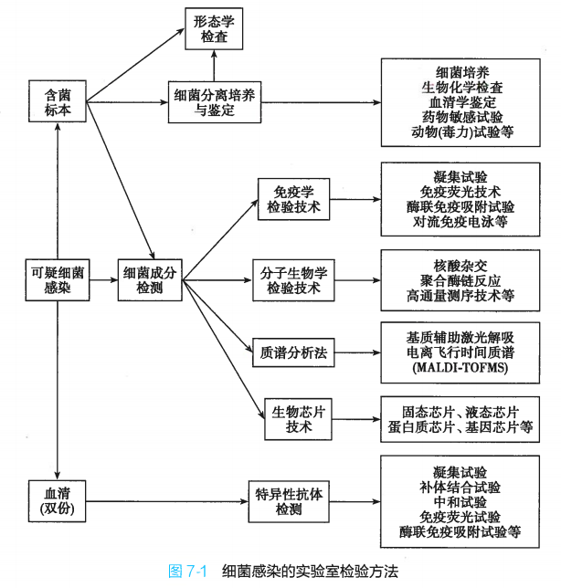

# 微生物学

## 第一章 细菌的形态与结构

### 细菌的大小与形态

- 球菌
  - 双球菌
  - 链球菌
  - 葡萄球菌
  - 四链球菌
  - 八叠球菌
- 杆菌
  - 直杆状
  - 链杆菌
  - 棒状杆菌
  - 球杆菌
  - 分枝杆菌
  - 双歧杆菌
- 螺旋菌
  - 只有一个弯曲：弧菌
  - 数个弯曲：螺菌
  - 菌体细长弯曲呈弧形或螺旋形：螺杆菌

### 细菌的结构

#### 基本结构

##### 细胞壁

革兰氏染色法可将细胞壁分为两类：

1. 革兰仕阳性菌$G^*$
2. 革兰氏阴性菌$G^-$

两种细菌的细胞壁都含有肽聚糖，但分别由各自特殊的成分

肽聚糖是细胞壁主要成分 ，**原核细胞特有**。上述两种细胞的肽聚糖组成成分不同：

- G\*：聚糖骨架、四肽侧链、五肽交联桥
- G-：聚糖骨架、四肽侧链

不同细菌细胞壁的聚糖骨架均相同，但四肽侧链随细菌种类不同而不同

G\*细胞壁特殊成分：

- 细胞壁较厚
- 含有大量磷壁酸
- 含少量磷壁醛酸

G-特殊成分：

- 细胞壁较薄
- 除肽聚糖外还含有特殊组分**外膜**

外膜由脂蛋白、不对称的脂质双层和脂多糖三部分组成

脂多糖由脂质 A、核心多糖和特异多糖组成

G\*和 G-的细胞壁结构显著不同，具体对比图如下：

##### 细胞膜

细菌的细胞膜与真核生物的细胞膜基本相同，都由磷脂与蛋白质组成，但是不含胆固醇

细胞膜功能如下：

1. 物质转运：被动扩散、选择性运输、透性酶
2. 呼吸与分泌：细胞呼吸相关的细胞色素和某些酶位于细胞膜表面，细胞膜类似真核生物的线粒体
3. 生物合成：细胞膜有多种酶参与细胞结构物质合成
4. 参与细菌分裂：部分细胞膜内陷、折叠、卷曲成中介体（多见于 G\*），一端在细胞膜上，一段连接核质。分列式中介体一分为二各自携带一份遗传物质，类似纺锤丝。同时有效扩大细胞膜表面积，增加酶含量和能量产生，功能类似线粒体，因而又称为**拟线粒体**

##### 细胞质

1. 核糖体：游离在细胞质中，合成蛋白质场所。细菌的核糖体与真和生物核糖体沉降系数不同。细菌中的核糖体多与正在转录的 mRNA 相连为多聚核糖体（边转录边翻译）
2. 质粒：遗传物质，闭合环状双链 DNA，游离在细胞质，可自行复制，并非不可或缺
3. 胞质颗粒：又称内含物，不是恒定结构，大多为贮藏的营养物质。

##### 核质

细菌基因组 DNA 的聚集区域称为核质或拟核，也成为细菌的染色体。

细菌的染色体为单倍体，为单一密闭环状 DNA 分子回旋卷曲

#### 特殊结构

##### 荚膜

细胞壁外包绕的一层粘液性物质，为多糖或蛋白质多聚体。

分类：

- 较厚的且与细胞壁边界明显的称为荚膜
- 较薄的称为微荚膜
- 边界不明显容易洗脱的称为黏液层。

化学组成：大多数为多糖

功能：

1. 抗吞噬：保护细菌抵抗宿主吞噬细胞的吞噬和消化
2. 黏附：可使细菌彼此相连，也可以黏附在组织细胞或无生命体表面
3. 抗有害物质损伤：抵抗溶菌酶、抗体、抗菌药物等

##### 鞭毛

运动器官，可根据数量和部位分为四类：

鞭毛自细胞膜长出，由基础小体、钩状体和丝状体三部分组成，具有高度抗原性（鞭毛(H)抗原）

功能：

1. 细菌运动
2. 有些鞭毛与致病性有关
3. 鉴定和分类

##### 菌毛

比鞭毛更细更短

可分为两类：

1. 普通菌毛：是细菌的黏附结构，能与宿主细胞表面的特异性受体结合，是细菌感染第一步，与致病性相关。由质粒编码，因菌种而异
2. 性菌毛：数量少，只有 1-4 根，可传递质粒或 DNA 染色体。同时也是某些噬菌体吸附于细胞的受体

##### 芽孢

胞质脱水浓缩形成的圆形小体，细菌的休眠模式。抵抗力强

## 第二章 细菌的生理

### 细菌的理化性状

#### 细菌的化学组成

与其他生物细胞相似的部分：水、无机盐、蛋白质、糖类、脂质以及核酸；少量无机离子，构成细菌成分，维持酶活性和跨膜化学梯度

原核生物特有的部分：肽聚糖、胞壁酸、磷壁酸等

#### 细菌的物理形状

1. 光学性质：细菌是半透明体，菌数越多浊度越大，可用此光学性质粗略估计细菌数
2. 表面积：细胞膜扭曲折叠获得较大表面积，有利于物质交换
3. 带电现象：细菌固体成分中的蛋白质由兼性离子氨基酸组成。带电与染色反应、凝集、抑菌杀菌有关
4. 半透性：细胞壁细胞膜都有半透性
5. 渗透压：均体内渗透压较大

### 细菌的营养

#### 细菌的营养类型

1. 自养菌：能以无机物为原料合成菌体成分
   1. 所需能量来自无机物氧化的称为化能自养菌
   2. 来自光合作用的称为光能自养菌
2. 异养菌
   1. 腐生菌
   2. 寄生菌

#### 细菌的营养物质

主要包括水、碳源、氮源、无机盐和生长因子

#### 细菌摄取营养物质的机制

1. 被动扩散：营养物质从浓度高一侧扩散到浓度低一侧，驱动力是浓度梯度，不需要提供能量。分为简单扩散（不需要细菌组分协助）和易化扩散（需要特异性蛋白）
2. 主动转运：由浓度低一侧向浓度高一侧转运，需要提供能量
   1. ABC 转运体：跨质膜的运输 ATP 酶，水解 ATP 获得能量改变构象，将与之结合的底物运到另一侧
   2. 化学渗透：利用膜内外质子或离子浓度差产生梯度动力进行转运。转运载体是电化学离子梯度透性酶，可进行可逆性氧还反应，氧化状态与底物结合，还原时释放其进入胞质
   3. 基因转移：营养物质转运过程被磷酸化，使其转运与代谢结合
   4. 特异性转运：通过特异性载体蛋白转运特定的营养物质，例如铁离子

### 细菌的新陈代谢

#### 细菌的能量代谢

生物体能量代谢的基本生化反应是生物氧化，包括加氧、脱氢和脱电子

葡萄糖作为底物分解释放能量合成 ATP 过程：

1. 糖酵解：基本所有细菌共有的基本代谢途径，专性厌氧唯一途径。1 分子葡萄糖 生成 2 分子丙酮酸 + 2 分子 ATP + 2 分子 NADH+ H+
2. 磷酸戊糖途径：己糖生成戊糖，产生少量能量与 NADPH + H+，不是产能主要途径
3. 需氧呼吸：糖酵解生成丙酮酸，丙酮酸进入三羧酸循环彻底氧化脱氢，分子氧受氢
4. 厌氧呼吸：糖酵解生成 2 分子 ATP

#### 细菌的代谢产物

不同细菌具有的酶不完全相同，对营养物质的分解能力不同，因此代谢产物有区别。可以以此鉴别不同细菌，即通过**生化反应试验**

1. 糖发酵试验：不同细菌分解糖类的能力和代谢产物不同（糖种类、分解程度）
2. VP 试验：阳性-红色化合物
3. 甲基红试验：

   1. pH>5.4，甲基红指示剂呈橘黄色，阴性
   2. pH<4.5，甲基红指示剂呈红色，阳性

   ……

细菌的合成代谢产物：

1. 热原质：能引起发热反应
2. 毒素与侵袭性酶
3. 色素
4. 抗生素：大多由线菌和真菌产生
5. 细菌素：有抗菌作用的蛋白质
6. 维生素

#### 细菌的分泌系统

细菌依赖分泌通路进行**蛋白质的跨胞质膜转运系统**，称为分泌系统

有 7 种分泌系统完成合成蛋白的分泌

#### 细菌的免疫系统

细菌可能受到外来侵袭：噬菌体、DNA 元件等

免疫类型：

1. 限制修饰系统
2. 流产感染系统
3. 毒素-抗毒素系统
4. CRISPR-Cas 系统

### 细菌的人工培养

培养方法：

1. 分离培养：固体培养基表面划线
2. 纯培养：挑取一个菌落，在另一培养基上生长纯种细菌
3. 发酵培养：发酵罐中大量培养微生物和生产代谢产物

培养条件：

1. 合适的培养基
   1. 提供充足营养物质
   2. 合适酸碱度及渗透压
   3. 适宜温度
   4. 必要气体

培养基：

1. 基础培养基：营养肉汤、营养琼脂、蛋白陈水
2. 增菌培养基：适合某种细菌而不适合其他细菌生长的细菌培养基
3. 选择培养基：培养基中加入化学物质，抑制某些细菌生长，利于某些细菌生长，将后者从混杂菌群中分离出来
4. 鉴别培养基：用于培养和区分不同细菌种类的培养基
5. 厌氧培养基：专供厌氧菌分离、培养和鉴别

培养基分类：

1. 合成培养基（化学成分确定）/天然培养基（成分不确定）
2. 物理状态：液体、固体、半固体（琼脂起凝固作用不具营养
   1. 液体：大量繁殖细菌，但必须种入纯种细菌
   2. 固体：细菌分离和纯化
   3. 半固体：观察细菌动力和短期保存细菌

细菌在培养基中的生长情况：

1. 液体培养基中：大多数呈现匀混浊状态；少数链菌**沉淀生长**；少数专性需氧菌呈**表面生长**形成**菌膜**
2. 固体培养基中：菌落计数法检测活菌含量

菌落分类：

1. 光滑型（S 型）
2. 粗糙型（R 型）
3. 粘液型（M 型）

## 第三章 噬菌体

噬菌体是感染细菌、真菌、放线菌或螺旋体等微生物的病毒。

噬菌体具有病毒的基本特性，是**专性胞内寄生**微生物

噬菌体具有**严格的宿主特异性**，只寄居在易感宿主菌体内

### 噬菌体的生物学形状

1. 形态与结构：

需要在电镜下观察，有三种形态：

1. 蝌蚪形
2. 微球形
3. 细杆形

2. 化学组成

噬菌体主要有核酸和蛋白质组成，核酸类型为 DNA 或 RNA

3. 抗原性

噬菌体能刺激机体产生特异性抗原，能抑制噬菌体侵袭宿主菌，但对已吸附或已进入宿主菌的噬菌体不起效

4. 抵抗力

噬菌体对理化性质的抵抗力比一般细菌繁殖体强

### 毒性噬菌体

按照与宿主菌的关系，噬菌体可分为两类：

1. **毒性噬菌体**：最终裂解细胞
2. **温和噬菌体/溶源性噬菌体**：不产生子代噬菌体也不裂解细菌，但 DNA 随细菌基因组复制而复制，并随细菌分裂而分配至子代细菌基因组中

毒性噬菌体以**复制方式**进行增殖：

1. 吸附：噬菌体表面蛋白与其宿主菌表面受体特异性结合
2. 穿入：吸附后，噬菌体尾部溶菌酶在宿主菌细胞壁溶一小洞，注入头部核酸
3. 生物合成：噬菌体核酸转录翻译合成所需酶、调节蛋白、结构蛋白；同时核酸自身大量复制
4. 成熟与释放：合成的蛋白质与核酸装配成子代噬菌体，裂解细菌放出子代

### 温和噬菌体

温和噬菌体的基因组整合于宿主菌基因组中

**前噬菌体**：整合在**细菌染色体上**的噬菌体**基因**称为前噬菌体

**溶源性细菌**：带有前噬菌体的细菌

溶源性：温和噬菌体产生成熟子代噬菌体颗粒和裂解宿主菌的**潜在能力**（可以在某些条件下裂解细菌产生成熟子代）

温和噬菌体有三种存在状态：

1. **游离的**具有感染性的噬菌体颗粒
2. 宿主菌胞质内的**噬菌体核酸**（未和宿主菌基因组整合）
3. **前噬菌体**（已与宿主菌基因组整合）

温和噬菌体具有溶源性周期和溶菌性周期，而毒性噬菌体只有一个溶菌性周期

**溶源性转换**：某些前噬菌体可导致细菌基因型和形状改变

## 第四章 细菌的遗传与变异

**细菌基因组**：包含细菌全部遗传信息，包括染色体和外源性 DNA（质粒、噬菌体部分或全部基因组），以及可移动元件

**细菌基因型**：细菌的全部遗传信息

**表型**：特定环境下，细菌在生长中表现的形态和生理特征等**性状的总和**

细菌变异分为两类：

1. 遗传变异：少数，但可稳定遗传
2. 表型变异：外因导致，不可遗传

### 细菌基因组

#### 细菌基因组的主要组成

**细菌基因组包括**：染色体、质粒和整合在染色体中的噬菌体基因组

1. 细菌染色体：单倍体，呈环状或线性。细菌基因组大小与其所含基因数成正相关；具有各种功能的识别区域（复制、转录等）
2. 质粒：细菌染色体外具有独立复制能力的遗传物质，存在细胞质中，非必须基因
3. 噬菌体基因组：前噬菌体

#### 特殊结构

**可移动元件**：**插入序列**和**转座子**等

**转位**：可移动遗传元件的移动方式称为转位

转座元件是不依赖同源重组（交叉互换等）就能在基因组中改变自身位置的独特 DNA 序列，也称为跳跃基因

转座元件的转移有两种类型：

1. 保留性转位：把原序列切割下来后插入其他位点
2. 复制性转位：复制一个新拷贝插入靶点，原拷贝保留在原位

转位主要依赖自身编码的**转座酶（切割、连接作用）**

插入序列：

1. 1~2 个基因编码量
2. 两端有反向重复序列作为重组酶识别位点
3. 中心序列编码转座酶及有关调节蛋白
4. 可正向或反向整合到基因组导致细菌基因突变

转座子：

基本结构：IS-功能基因-IS

整合子：可移动的 DNA 分子，可捕获和整合外源性基因，使其转变为功能性基因

### 细菌基因突变

#### 自发突变

自然发生的突变，概率低，可用实验的方法测出

彷徨实验：噬菌体抗性自发突变菌株

1. 将对噬菌体敏感的细菌在试管中培养
2. 将细菌接种在含噬菌体的琼脂上，计数抗性菌落数
   1. 如果抗性发生在接触噬菌体前，则不同试管中的抗性菌落数应该有明显区别
   2. 如果发生在接触噬菌体后，则应该相近
3. 结果
   1. 同一试管多次取出菌液中，抗性菌数量差别不大
   2. 不同试管差异悬殊
4. 结论
   1. 接触前已发生突变
   2. 噬菌体只起筛选作用，不起诱导作用

诱发突变：人工诱导提高细菌突变率

#### 突变与选择

目标：从大量细菌中鉴定出个别突变株

影印实验：

1. 将抗生素敏感菌在不含抗生素琼脂上培养
2. 培养出菌落后，无菌丝绒按压，黏附菌落印迹
3. 印迹平行按压到含抗生素平板上，观察
4. 可找出原平板上对应抗性菌菌落
5. 抗生素仅起筛选不起诱导作用

#### 回复突变与抑制突变

**野生型**：**未发生突变**的菌株

**突变型**：相对野生型**发生过一次突变**

**回复突变**：突变型经过第二次突变恢复野生型的性状

**抑制突变**：第二次突变没有改变正向突变的 DNA 序列，而是改变其他 DNA 序列，从而抑制了第一次突变的效应

### 基因的转移和重组

细菌的基因重组有两种方式：**同源重组**和**非同源重组**

DNA 可从一种生物转移至另一种生物，整合至其染色体，称为**基因水平转移**或**基因侧向转移**

#### 转化

定义：受体菌直接摄取供体菌（外源）DNA 片段而获得新的遗传性状的过程

肺炎链球菌体内转化实验证明：R 型菌可获得 S 型死菌编码荚膜的遗传物质，转化为 S 型菌

#### 接合

定义：细菌通过**性菌毛**互相连接沟通，将遗传物质从**供体菌**传递给**受体菌**的方式

主要传递质粒，包括 F 质粒和 R 质粒等

##### F 质粒

含 F 质粒的细菌为 F+，无性菌毛的菌株为 F-。接合时 F+为供体菌，F-为受体菌

F 质粒也可以整合到宿主菌染色体称为高频重组株 Hfr

然后 Hfr 可接合到 F-菌上，将部分染色体复制并转移到 F-菌中

##### R 质粒

R 质粒：接合性**耐药**质粒，可用于传递耐药性基因。

R 质粒可通过接合方式在同种属或不同种属细菌间传递，使细菌的耐药性迅速传播。因此 R 质粒又称为传染性耐药因子

#### 转导

定义：转导是由**噬菌体介导**，将供体菌 DNA 片段转入受体菌，使其获得供体菌的部分遗传性状

可分为普遍性转导和局限性转导

##### 普遍性转导

**毒性噬菌体和温和噬菌体均可介导**

普遍性转导原理：

1. 噬菌体装配过程中，误把供体菌的染色体片段或质粒转入噬菌体，形成一个转导噬菌体
2. 转导噬菌体侵染其他细胞，使供体菌的 DNA 进入受体菌

普遍性转导的两种结果：

1. **完全转导**：供体菌 DNA 片段可以整合到受体菌染色体，并随染色体复制而稳定遗传
2. **流产转导**：供体菌 DNA 游离在细胞质中，不能自身复制也不能传代

##### 局限性转导

**由温和噬菌体介导**

噬菌体 DNA 整合在染色体上形成前噬菌体。

前噬菌体带有宿主菌染色体基因脱落后组装成转导噬菌体。

由于被转导的基因，即脱落时携带的宿主菌基因，仅局限于前噬菌体两侧的供体菌基因，因此称为局限性转导。

因为噬菌体有宿主特异性，因此局限性转导只能发生在同种细菌之间

## 第五章 细菌的耐药性

### 抗菌药物种类及其作用机制

#### 抗菌药物的种类

- 按抗菌药物化学结构和性质分类
  - β-内酰胺类
  - 大环内酯类
  - 氨基糖苷类
  - 四环素类
  - 氯霉素类
  - 人工合成抗菌药物
- 按抗菌药物生物来源分类
  - 细菌产生的抗生素
  - 真菌产生的抗生素
  - 放线菌产生的抗生素
  - 植物来源抗菌药物

#### 抗菌药物的作用机制

1. 干扰细胞壁合成
2. 损伤细胞膜功能
3. 抑制蛋白质合成
4. 影响核酸和叶酸代谢

### 细菌的耐药机制

定义：细菌对抗菌药物的不敏感型和抵抗性

耐药性的程度一般用药物对细菌的**最低抑菌浓度 MIC**表示

#### 细菌耐药的遗传机制

1. 固有耐药性：指细菌对某些抗菌药物天然不敏感，具有种属特异性，即不同种菌的固有耐药性不同
2. 获得耐药性：指 DNA 改变导致细菌获得了耐药性表型，
   1. 基因突变
   2. 基因转移：耐药基因在可移动原件中转移并传播
      1. R 质粒：一种质粒可携带一种或多种耐药性基因群
      2. 转座子：可在基因组中跳跃移动
      3. 捕获外源基因并转变为功能性基因表达单位
3. 多重耐药性：细菌对多种不同抗菌药物具有耐药性
   1. 交叉耐药性：细菌对一种抗菌药物产生耐药性后，对其他作用机制相似的抗菌药物也产生耐药性
   2. 泛耐药菌：对除多粘菌素外所有抗菌药物均耐药

#### 细菌耐药的生化机制

1. 钝化酶的产生：钝化酶是耐药菌株产生的具有破坏或灭活抗菌药物活性的一类酶
2. 药物作用靶位的改变：改变抗生素作用靶位的蛋白质结构和数量，使抗生素失去作用靶点或亲和力降低
3. 抗菌药物的渗透障碍：细菌细胞壁障碍或外膜通透性改变，阻止抗菌药物进入
4. 主动外排机制：外排泵将药物泵出
5. 细菌生物被膜及其他：细菌形成生物被膜阻止药物进入

## 第六章 细菌的感染与免疫

### 正常菌群与机会致病菌

#### 正常菌群

- 正常寄居，对宿主无害
- 生理作用
  - 生物拮抗：低于外来致病菌入侵
    - 生物屏障和占位性（占据生存空间）
    - 产生对致病菌有害的代谢产物
    - 营养竞争
  - 营养作用：对宿主摄入的营养物质进行代谢，合成物质供宿主使用
  - 免疫作用
  - 抗衰老作用
- 微生态平衡

#### 机会致病菌

在特定情况下，正常菌群会称为机会致病菌引起发病：

1. 正常菌群寄居位置改变：原本部位不治病，到其他部位可以致病
2. 宿主免疫功能下降
3. 菌群失调

### 细菌的致病作用

下面是一些与细菌致病性有关的概念：

**致病性**：细菌对宿主的治病能力

**毒力**：致病性的强弱程度

**毒力因子**：与毒力相关的物质

**致病岛/毒力岛**：簇集存在的，细菌中编码毒力因子的 DNA 序列

**半数致死量**($LD_{50}$)：能引起 50%实验动物死亡的毒素剂量或细菌数量

**半数感染量**($ID_{50}$)：能引起 50%实验动物或组织培养细胞发生感染的细菌数量

#### 细菌的侵袭力

侵袭力包括黏附、定植和产生侵袭性物质的能力

黏附是细菌致病第一步，黏附有两个必要条件：

1. 黏附素
2. 宿主细胞表面的黏附素受体

黏附素能与宿主细胞表面的黏附素受体发生特异性结合

同时，黏附素也能介导细菌进入宿主细胞生长繁殖，称为**定植**

荚膜：抗吞噬、抵抗宿主体液中杀菌物质的作用，免疫逃逸

侵袭性酶类：细菌可释放侵袭性胞外酶抗吞噬并向周围组织扩散

侵袭素：细菌的侵袭基因编码的蛋白质，与细菌入侵与扩散有关

#### 毒素

##### 外毒素

细菌合成并分泌的毒性蛋白质

主要特性：

1. 大多数外毒素化学本质都是**蛋白质**：A-B 型分子结构
   1. A：外毒素活性单位，决定毒效
   2. B：结合亚单位，介导 A 进入细胞
2. 毒性作用强且对组织器官有**高度选择性**
3. 绝大多数外毒素**不耐热**
4. **抗原性强**：外毒素是蛋白质，有很强的抗原性。去除毒性保留其免疫原性的生物制品称为类毒素

外毒素分类及作用：

- 神经毒素：作用于神经组织，引起神经传导功能紊乱
- 细胞毒素：通过抑制蛋白质合成、破坏细胞膜等机制直接损伤宿主细胞，膜损伤毒素又分为
  - 成孔毒素：在细胞膜上形成孔洞
  - 磷脂酶类：分解卵磷脂
- 肠毒素：作用于肠上皮细胞，引起肠道功能紊乱

##### 内毒素

内毒素是革兰阴性菌细胞壁中的脂多糖(LPS)成分，死亡裂解后才释放

分子结构由三部分构成：

- O 特异性多糖
- 非特异核心多糖
- 脂质 A

内毒素主要特点：

1. 存在于革兰阴性菌细胞壁
2. 化学性质是脂多糖
3. 理化因素相对稳定，如强酸强碱强氧化剂加热
4. 毒素作用相对较弱且对组织无选择性
5. 不能用甲醛液脱毒称为类毒素

引起的病理生理反应：

1. 致发热反应：内毒素作用于宿主细胞释放内源性致热源（细胞因子）
2. 引起白细胞数量变化
3. 内毒素血症与内毒素休克

内毒素致病机制：

内毒素与外毒素主要特性比较：

#### 体内诱生抗原

某些细菌的基因人工培养条件下不表达，只有进入宿主体内后才表达，这些基因称为**体内诱导基因**

由体内诱导基因编码的抗原称为**体内诱生抗原**

### 宿主的抗感染免疫

#### 固有免疫

也成为天然免疫，参与的部分主要有：

- 屏障结构
- 吞噬细胞
- 体液和组织的免疫成分

##### 屏障结构

- 皮肤与粘膜：阻挡和排除、分泌杀菌物质、正常菌群拮抗作用
- 血脑屏障：阻挡致病菌及其毒性产物进入脑组织或脑脊液，保护中枢神经系统
- 胎盘屏障

##### 吞噬细胞

吞噬细胞通过**模式识别**实现对病原菌的识别：

- 病原体内存在病原体相关分子模式(PAMP)
- 宿主免疫活性细胞存在识别 PAMP 并介导固有免疫启动的受体，即模式识别受体(PRR)
- 吞噬细胞的 PRR 识别并结合 PAMP

识别后，启动吞噬和杀菌，分为 4 个过程：

1. 趋化：细菌侵入会刺激吞噬细胞产生**趋化因子**，后者**吸引吞噬细胞定向聚集**到局部炎症区域
2. 识别：吞噬细胞的 PRR 结合病原体的 PAMP
3. 吞入：吞噬细胞吞噬病原体
4. 杀灭与消化：吞噬细胞中形成**吞噬溶酶体**降解消化细菌

自噬：自噬溶酶体降解细胞器、蛋白质或外来异物

##### 体液因素

体液中存在多种抗菌物质：

- 补体：球蛋白，被激活后产生多种生物活性因子发挥免疫作用
- 溶菌酶：主要来源于吞噬细胞，可裂解细胞
- 抗微生物肽：小分子多肽，可破坏细菌细胞壁

#### 适应性免疫

##### 体液免疫

体液免疫过程：

1. 致病菌感染
2. 细胞因子辅助下，B 淋巴细胞活化、增殖、分化为浆细胞
3. 浆细胞分泌抗体

##### 细胞免疫

细胞免疫是 T 细胞介导的免疫应答，过程如下：

1. 病原体侵入
2. 抗原呈递细胞吞噬并呈递给 T 淋巴细胞
3. T 细胞受抗原刺激后，活化、增殖、分化为细胞毒性 T 细胞，特异性杀伤靶细胞

##### 粘膜免疫

黏膜免疫中关键细胞是 M 细胞，免疫过程如下：

1. 病原体侵入
2. M 细胞将抗原内吞并转运到集合淋巴结
3. 抗原被抗原呈递细胞呈递给 T、B 淋巴细胞
4. 激活特异性免疫

#### 抗胞内菌免疫

胞外菌感染：致病菌寄居在细菌外

兼性胞内菌：可在宿主菌胞内也可在胞外生存

专性胞内菌：只能在活细胞内寄居

特异性抗体无法进入细胞内发挥作用，抗胞内菌免疫主要靠细胞免疫

首先，胞内菌主要被单核巨噬细胞吞噬

其次，细胞免疫通过细胞毒性 T 细胞 CTL 与效应 T 细胞 Th1 杀伤感染细胞

### 感染的发生与发展

根据病原体来源的不同感染可分为**内源性感染**和**外源性感染**

1. 外源性感染：感染源来自宿主体外，例如病人、带菌者、病畜及带菌动物
2. 内源性感染：来自病人自身所带的细菌引起的感染

#### 感染的发生

感染是否发生以及发生后的转归取决于三方面因素：

1. 机体的免疫状态
2. 细菌因素，即毒力、数量以及侵入途径
3. 社会和环境因素：战争等社会因素以及气候季节温度等环境因素

#### 感染类型

按照临床病情缓急不同分类：

1. 隐性感染：感染后对机体损害较轻、临床症状不明显
2. 显性感染
   1. 急性感染：发作突然、病程较短
   2. 慢性感染：病程缓慢

按照感染部位分类：

1. 局部感染
2. 全身感染

## 第七章 细菌感染的检测方法与防治原则

### 细菌感染的实验室诊断

实验室诊断主要包括：

1. 细菌学诊断：检测病原菌及其抗原、代谢产物或核酸
2. 血清学诊断：检测病人血清中特异性抗体的血清学诊断

#### 形态学检查

形态学检查包括不染色标本和染色标本检查法

1. 不染色标本：压滴法或悬滴法，在暗视野显微镜下观察细菌动力
2. 染色标本：**革兰染色法**进行分类；**抗酸染色法**鉴别结合；**荧光染色法**敏感性强

#### 细菌的分离培养与鉴定

样本通过分离培养获得单个菌落，进行纯培养，然后进行：

1. 生化实验：例如肠道致病菌对不同糖发酵能力不同进行鉴别
2. 血清学鉴定：用抑制的特异性抗体检查未知的纯培养细菌
3. 动物实验
4. 抗菌药物敏感实验：抗敏实验。纸片扩散法观察抑菌环；稀释法检验最低抑菌浓度等

#### 细菌成分检测

免疫学检验技术：用一致特异性的抗体检测未知细菌抗原

分子生物学检验技术：

1. 聚合酶链式反应 PCR：快速、灵敏、特异性强，可进行细菌定量检测
2. 核酸杂交技术：可直接检测病原菌基因
3. 高通量测序技术：可对病原菌基因组进行测序

### 细菌感染的特异性防治

特异性防治的原理是获得性免疫，主要通过注射抗原或抗体以防治感染性疾病，称为人工免疫，又分为：

1. 人工主动免疫：预防接种或疫苗接种
2. 人工被动免疫

#### 人工主动免疫

定义：将抗原性物质接种于人体，刺激机体免疫系统产生特异性免疫应答

疫苗分类：

1. 死疫苗：灭活疫苗，破坏病原微生物感染性但仍保持免疫原性
2. 活疫苗：减毒活疫苗，

3. 类毒素：外毒素用甲醛处理脱毒，但仍保持免疫原性
4. 多糖疫苗：提取细菌特异性多糖，不存在引起副作用的物质，安全有效
5. 联合疫苗：由不同抗原组分混合制成的一脉哦
   1. 多联疫苗：多种疫苗原液配置，有多种免疫原性
   2. 多价疫苗：同一种细菌不同亚型的多价抗原成分

#### 人工被动免疫

定义：输入含特异性抗体的免疫血清、纯化免疫球蛋白等**免疫制剂**，使机体立即获得特异性免疫力

但由于这些免疫物质并非病人自身生产，因此维持时间较短

常用免疫物质包括：

1. 抗毒素
2. 丙种球蛋白
3. 抗菌血清

## 第八章 球菌

### 葡萄糖球菌属

葡萄糖球菌属大部分时不会致病的表皮葡萄球菌，致病的主要是金色葡萄球菌

#### 金色葡萄糖球菌

##### 生物学性状

形态：球形，葡萄串状排列

染色：革兰阳性

培养特性：

- 需氧或兼性厌氧
- 营养要求不高，可在普通培养基中培养
- 属内不同菌种有不同**脂溶性色素**，致病菌种为**金黄色**

生化反应：

- 多数菌种能分解葡萄糖、麦芽糖、蔗糖，产酸不产气
- 金黄色葡萄球菌能分解甘露醇，可与其他区分

抗原：

- **葡萄球菌A蛋白(SPA)**：完全抗原，协同凝集试验
- 荚膜多糖：帮助黏附
- 多糖抗原：存在于细胞壁

分类：

- 表型分类：
  - **金黄色葡萄球菌**（致病性）
  - **表皮葡萄球菌**（正常菌群）
  - **腐生葡萄球菌**（机会致病菌）
- 有无凝固酶分类：
  - 凝固酶阳性菌株：可被噬菌体裂解
  - 凝固酶阴性菌株

抵抗力：**金黄色葡萄球菌外界理化因素的抵抗力较强**

##### 致病性

致病物质：

细菌的表面结构蛋白（黏附素、荚膜、胞壁肽聚糖、SPA）

毒素

酶类：凝固酶和其他

1. 凝固酶

- 凝固酶
  - 游离凝固酶：**分泌至细菌外**的蛋白质，可被血浆中的协同因子激活，成为凝血酶样物质，使液态纤维蛋白变为固态纤维蛋白，导致血浆凝固
  - 结合凝固酶/凝固银子：**菌株表面**的纤维蛋白原受体
- **凝固酶功能**：
  - 与金黄色葡萄球菌致病性密切相关
  - 使血浆中的纤维蛋白沉积于细菌表面，**阻碍吞噬细胞吞噬和消化**
  - 防御杀菌物质
  - 纤维蛋白沉积和凝固会**形成血栓、使感染局限化**
- 其他酶类
  - 纤维蛋白溶酶/葡激酶：激活血浆中的纤维蛋白原成为纤维蛋白酶，溶解血浆纤维蛋白，利于细菌扩散
  - **耐热核酸酶**：致病性葡萄球菌产生，耐热，降解DNA和RNA，**是测定葡萄球菌有无致病性的重要指标**
  - 透明质酸酶：溶解细胞间质中的透明质酸，利于扩散
  - 脂酶：分解脂肪和油类，便于入侵皮肤和皮下

2. 葡萄球菌溶素：致病的主要是α溶素，外毒素，抗原性好，可破坏膜完整性
3. 杀白细胞素：攻击中性粒白细胞和巨噬细胞
4. 肠毒素：急性肠胃炎；**是超抗原**，刺激淋巴细胞能力强

所致疾病：

- 化脓性感染
  - 皮肤性化脓感染
  - 全身感染
- 毒素行疾病（外毒素引起）
  - 食物中毒
  - 烫伤样皮肤综合征：皮肤红斑
  - 毒性休克综合征TSS

##### 免疫性

人类对葡萄球菌有一定的天然免疫力

##### 微生物学检查法

1. 标本直接涂片镜检：**细菌形态、排列和染色特征**
2. 分离培养和鉴定，**致病性葡萄球菌鉴定主要依据**：
   1. 能产生金黄色色素
   2. 有溶血性
   3. 凝固酶试验阳性
   4. 耐热核酸酶试验阳性
   5. 能分解甘露醇产酸
3. 药敏试验：找到敏感药物
4. 葡萄球菌肠毒素检查

#### 凝固酶阴性葡萄糖球菌

凝固酶阴性葡萄球菌(CNS)也是常见重要病原菌

##### 生物学性状

革兰阳性菌，不产生血浆凝固酶、α溶血素等毒素

常见的CNS是**表皮葡萄球菌**和**腐生葡萄球菌**

##### 致病性

CNS在皮肤和粘膜是正常菌群，当免疫功能低下或进入非正常寄居部位可引起感染：

致病机制：

1. 细菌胞壁外黏质：多糖，粘液，可抑制免疫应答
2. 溶血素：β溶血素、δ溶血素
3. 腐生葡萄球菌可**选择性吸附在尿道上皮细胞**

所致疾病：

1. 泌尿系统感染
2. 细菌性心内膜炎
3. 败血症

### 链球菌属

链球菌属中大多数为正常菌群，致病的主要是A群链球菌和肺炎链球菌

链球菌的分类：

- 溶血现象分类
  - 甲型溶血性链球菌：草绿色溶血环，甲型溶血/α溶血，机会致病菌
  - 乙型溶血性链球菌：无色溶血环，乙型溶血/β溶血，致病力强
  - 丙型链球菌：不产生溶血素，无溶血环，不致病
- 抗原结构分类（C多糖抗原）：致病菌株多为A群
- 生化反应分类：需氧性、药物敏感性等

#### A 群链球菌

A群链球菌中致病性最强的是

##### 生物学性状

形态：球形或椭圆形，链状排列

培养特性：兼性厌氧，营养要求高，多数可形成透明溶血环（β溶血）

生化反应：

- 分解葡萄糖，产酸不产气
- 不分解菊糖，不被胆汁溶解，这两个特性可用于鉴别甲型溶血性链球菌和肺炎链球菌

抗原结构：

1. **多糖抗原/C抗原**：细胞壁多糖组分，可用稀盐酸提取。群特异性抗原，**是链球菌分群依据**
2. 表面抗原/蛋白质抗原：M蛋白
3. P抗原/核蛋白抗原：无特异性

抵抗力：对多药物敏感，60°左右被杀死，常用消毒剂敏感

##### 致病性

致病物质：胞壁成分、外毒素、胞外酶

1. 胞壁成分

- 黏附素
  - 脂磷壁酸LTA：与M蛋白共同组成菌毛，与细胞膜上LTA受体结合增强粘附性
  - F蛋白：是纤维粘连蛋白受体，利于黏附
- M蛋白：**主要致病因子**，有抗吞噬核抗吞噬细胞杀菌作用，有抗原性
- 肽聚糖

2. 外毒素

- 致热外毒素：红疹毒素/猩红热毒素，蛋白质，抗原性强，有**超抗原作用**
- 链球菌溶素
  - 链球菌溶素O：对O2敏感，遇到O2失活，抗原性强
  - 链球菌溶素S：无免疫原性，对O2稳定，破坏白细胞等组织细胞

3. 侵袭性酶：均是扩散因子

- 透明质酸酶：分解透明质酸，利于扩散
- 链激酶：链球菌溶纤维蛋白酶，将血液中纤维蛋白酶原变为纤维蛋白酶，溶解血块或组织血浆凝固，利于扩散
- 链道酶：链球菌DNA酶，能降解粘稠DNA，促进病菌扩散

##### 免疫性

A群链球菌感染后可获得抗体，各型之间无交叉免疫力

##### 微生物学检查法

1. 标本
2. 直接涂片镜检：典型链状排列球菌
3. 分离培养与鉴定
   1. 如有β溶血菌，与葡萄球菌区别
   2. 如有α溶血菌，与肺炎链球菌区别
4. PYR试验：特异性检测A群链球菌氨基肽酶
5. 血清学试验：抗O试验，用于风湿热病诊断，风湿病人血清中抗O抗体显著增高

#### 肺炎链球菌

##### 生物学性状

形态：革兰阳性球菌，双排列，菌体周围有**透明环**

培养特性：营养要求高，培养基需要含血液或血清，兼性厌氧，草绿色α溶血环，有自溶酶溶解细胞壁

生化反应：

- 分解葡萄糖、麦芽糖、乳糖、蔗糖，产酸不产气
- 鉴别方法：**胆汁溶菌试验**

抗原结构与分类：

1. 荚膜多糖抗原
2. 菌体抗原
   1. C多糖：特异性多糖，宿主血清中的C反应蛋白(CRP)可沉淀C多糖，可用C多糖来测定CRP
   2. M蛋白：型特异性，肺炎链球菌的M蛋白与毒力无关

抵抗力：对理化因素抵抗力较弱

##### 致病性

致病物质：

1. 荚膜：抗吞噬，是肺炎链球菌主要毒力因子。荚膜光滑的S型菌失去荚膜成为粗糙R型菌时，毒力减弱或消失
2. 肺炎链球菌溶素O：与膜上胆固醇结合，使细胞膜穿孔溶解红细胞
3. 脂磷壁酸
4. 神经氨酸酶

所致疾病：

1. 大叶性肺炎
2. 支气管炎

##### 免疫性

感染后可建立牢固的型特异性免疫，产生**荚膜多糖型特异性抗体**

##### 微生物学检查法

初步诊断：革兰阳性、有荚膜的双球菌存在

肺炎链球菌核甲型溶血性链球菌都会形成草绿色溶血环，两者鉴别如下：

1. 胆汁溶菌试验：胆汁可激活自溶酶，加速菌体自溶，细菌溶液变清为阳性
2. Optochin敏感试验：观察细菌平板上Optochin溶液绿植抑菌圈大小，肺炎链球菌抑菌圈较大(>20mm)，甲型溶血性链球菌抑菌圈较小(<12mm)
3. 荚膜肿胀试验：抗荚膜抗体可使肺炎链球菌荚膜肿胀
4. 动物毒力试验：小鼠对肺炎链球菌高度易感，而甲型溶血性链球菌不致死

上述试验肺炎链球菌均为阳性，而甲型溶血性链球菌均为阴性

### 肠球菌属

#### 生物学性状

链状排列的革兰阳性球菌，D群链球菌

对人类致病的主要是粪肠球菌和屎肠球菌

对营养要求较高，不同菌种溶血性不同

#### 致病性

肠球菌不会产生毒素或水解酶，毒力不强

致病物质：

1. 碳水化合物黏附素：黏附功能
2. 聚合物因子
3. 细胞溶素
4. 多形核白细胞趋化因子：可介导炎症反应

耐药性：

1. 对青霉素耐药
2. 对氨基糖苷类耐药：高度耐药
3. 对万古霉素高度抗药

所致疾病：

1. 尿路感染：粪肠球菌导致
2. 腹腔、盆腔感染
3. 败血症
4. 心内膜炎

### 奈瑟菌属

革兰阴性球菌，双排列，**专性需氧**，能产生氧化酶和触媒

可发酵多种糖类，产酸不产气，可用糖发酵实验鉴别

大部分奈瑟菌属为正常菌群，对人致病的只有：

- 脑膜炎奈瑟菌
- 淋病奈瑟菌

#### 脑膜炎奈瑟菌

脑膜炎奈瑟菌使流行性脑脊髓膜炎的病原菌

##### 生物学性状

肾形或豆形，革兰阴性双球菌

培养特性：

- 营养要求较高
- **巧克力（色）培养基，专性需氧**，不溶血

生化反应：分解葡萄糖、麦芽糖，产酸不产气

##### 致病性

致病物质：

1. 荚膜：抗吞噬
2. 菌毛：黏附
3. IgA1蛋白酶：破坏IgA1，帮助黏附
4. **脂寡糖：脑膜炎奈瑟菌的主要致病物质**

所致疾病：流行性脑脊髓膜炎，6个月至2岁儿童易感

传播方式：飞沫传播

##### 免疫性

机体对脑膜炎奈瑟菌的免疫性以体液免疫为主

#### 淋病奈瑟菌

淋病奈瑟菌，俗成淋球菌，淋病病原菌

##### 生物学性状

革兰阴性球菌，双排列

培养特性：专性需氧，**巧克力（色）血琼脂平板作培养基**

只分解葡萄糖，产酸不产气

氧化酶试验阳性

抗原结构与分类：

- 菌毛蛋白抗原：黏附、免疫逃逸
- 脂寡糖抗原LOS：有内毒素活性
- 外膜蛋白抗原：包括PⅠ（主要），PⅡ，PⅢ，是淋病奈瑟菌分型的主要依据

##### 致病性

致病物质：

1. 菌毛：黏附至尿道；抗吞噬作用明显
2. 外膜蛋白
   1. P I：破坏膜结构完整性
   2. P II：黏附作用
   3. P III：阻抑杀菌抗体活性
3. 脂寡糖：胞壁脂寡糖（内毒素）形成局部炎症反应；免疫逃逸
4. IgA1蛋白酶：黏附

所致疾病：淋病

##### 免疫性

人类对淋病奈瑟菌无天然抵抗力

多数可自愈并产生抗体，但免疫不持久，再感染和慢性病患者多

##### 微生物学检查法

1. 革兰染色后直接涂片镜检
2. 中性粒细胞内发现革兰阴性双球菌
3. 接种巧克力（色）血琼脂培养
4. 氧化酶试验、糖发酵试验、免疫荧光试验等

## 第九章 肠杆菌科

### 埃希菌属

大肠埃希菌临床最常见，下面以大肠埃希菌进行介绍

#### 生物学性状

革兰阴性杆菌

兼性厌氧，液体培养基混浊生长

能发酵 葡萄糖等多种糖类，**产酸产气**

能产生大肠菌素，可用于大肠埃希菌分型

#### 致病性和免疫性

致病物质：

1. 黏附素：大肠埃希菌黏附素的特点是特异性高，多有抗原性
2. 外毒素：能产生多种外毒素

所致疾病：

1. 肠道外感染
   1. 化脓性感染
      1. 腹膜炎
      2. 阑尾炎
      3. 败血症
      4. 新生儿脑膜炎
   2. 泌尿道感染
      1. 膀胱炎
      2. 尿道炎
2. 胃肠炎
   1. 肠产肠毒素大肠埃希菌：婴幼儿、旅游者，肠毒素、定植因子
   2. 肠侵袭性大肠埃希菌：较大儿童和成人，不产生肠毒素，能破坏组织产生炎症
   3. 肠出血性大肠埃希菌：出血性结肠炎和溶血性尿毒综合征
   4. 肠聚集性大肠埃希菌：水样腹泻、脱水、血便。不侵袭，在细胞表面聚集砖状排列，导致出血

#### 微生物学检查法

1. 标本：肠外感染取中段尿、血液、脓液、脑脊液等；肠胃炎取粪便
2. 分离培养与鉴定
   1. 肠道外感染：肉汤增菌移植血琼脂分离，IMViC实验++--初步鉴定，最后生化反应鉴定
   2. 肠道内感染：鉴别培养基鉴定大肠埃希菌后，用核酸杂交、PCR等方法检测肠毒素等特征

### 志贺菌属

志贺菌属是人类**细菌性痢疾**的病原菌，俗成**痢疾杆菌**

#### 生物学性状

革兰阴性短小杆菌

营养要求不高，半透明S型菌落

分解葡萄糖，产酸不产气

可根据O和K两种抗原分为4群：A、B、C、D

#### 致病性和免疫性

致病物质：

1. 侵袭力：侵袭回肠末端和结肠的粘膜上皮细胞
2. 内毒素
3. 外毒素：A群I型和II型能产生志贺毒素

所致疾病：**细菌性痢疾**

**志贺菌感染只局限于肠道，一般不入侵血液**

急性细菌性痢疾：

1. 1~3天潜伏期后突然发病
2. 发热、腹痛、水样腹泻，后转变为脓血粘液便
3. 里急后重、下腹疼痛

极性中毒性痢疾：

1. 无消化道症状而表现为全身中毒
2. 原因：内毒素
3. 症状：高热、休克、中毒性脑病

免疫性：感染后可在血液中产生抗体，但无保护作用。抗感染的主要是消化道粘膜表面的IgA。病后免疫期短暂

#### 微生物学检查法

1. 标本
2. 分离培养与鉴定：接种肠道性选择培养基，挑取**无色半透明**菌落，通过**生化反应**和**血清学实验**确定群和型
3. 毒力试验：Sereny试验测定贺志菌侵袭力

### 沙门菌属

沙门菌属分为肠道沙门菌和邦戈沙门菌两个种

肠道沙门菌能感染人类的血清型主要是肠道沙门菌肠道亚种

#### 生物学性状

革兰阴性菌，有多个致病岛

兼性厌氧，营养要求不高

在SS选择鉴别培养基上可形成无色半透明S型菌落

不发酵乳糖或蔗糖，分解葡萄糖、麦芽糖、甘露糖，产酸产气（出伤寒沙门菌）

生化反应：

1. 硫化氢阳性，动力阳性，可与大肠埃希菌、志贺菌等区别
2. 尿素酶试验可同变形杆菌区别

抗原有O和H两种

#### 致病性和免疫性

致病物质：

1. 侵袭力：侵袭小肠粘膜，引发细胞膜内陷，在吞噬小泡内生长繁殖导致宿主菌死亡
2. 内毒素：沙门菌死亡后释放内毒素可引起体温升高、白细胞数量下降等
3. 肠毒素：个别沙门菌可产生肠毒素

所致疾病：

1. 肠热症：包括伤寒（伤寒沙门菌）和副伤寒（甲型副伤寒沙门菌）
2. 胃肠炎：最常见的沙门菌感染，主要致病机制是细菌对肠粘膜侵袭以及细菌释放的内毒素
3. 败血症

免疫性：特异性细胞免疫是主要防御机制

#### 微生物学检查法

标本：因为肠热症不同病程细菌出现的主要部位不同，因此应分不同病程取标本：

- 第一周：外周血
- 第二周起：粪便
- 第三周起：可取尿液
- 第一周至第三周均可取骨髓液

分离培养与鉴定：

1. 接种与SS选择鉴别培养基挑取无色半透明乳糖不发酵菌落
2. 通过系列生化反应鉴别

血清学诊断：肥达试验，检测血清中是否含有伤寒沙门菌菌体O抗原和鞭毛H抗原，以及副伤寒沙门菌鞭毛H抗原对应的抗体

### 克雷伯菌属

典型的条件致病菌，常见致病菌种有：

- 肺炎克雷伯菌肺炎亚种
- 鼻炎……

#### 生物学性状

革兰阴性杆菌，与其他杆菌相比显著特点是**有较厚的荚膜**

兼性厌氧，营养要求不高

普通培养基上形成较大灰白色粘液菌落，**接种环挑易拉丝**，是显著的**鉴别特征**

#### 致病性与免疫性

致病物质：

1. 荚膜：荚膜与肺炎克雷伯菌毒力有关，同时可抗吞噬和抗杀菌
2. 荚膜合成相关基因：调控芥末多糖合成
3. 气杆菌素：是克雷伯菌分泌的铁载体和毒力因子，可使肺炎克雷伯菌毒力增强100倍

所致疾病：

1. 肺炎克雷伯菌：重症肺炎、支气管炎与各种肺外感染
2. 鼻炎克雷伯菌：鼻炎

免疫性：免疫机制主要是产生荚膜多糖特异性抗体

#### 微生物学检查法

标本镜检：革兰阴性杆菌，负染色法染色后可见明显荚膜

分离培养与鉴定：

- SS选择鉴别培养基：红色或粉红色中心的无色菌落
- 血琼脂培养基：大而黏的灰白色可拉丝菌落

血清学鉴定：荚膜肿胀试验，将肺炎克雷伯菌与康嘉谟特异性抗血清混合，菌体周围出现较大空白圈为阳性

### 其他菌属

#### 变形杆菌属

变形杆菌属，最相关的两个种为**奇异变形杆菌**和**普通变形杆菌**

**迁徙生长**：以接种部位为中心的厚薄交替、同心圆状的层层波状菌苔

**具有尿素酶**，能迅速分解尿素，是该菌属重要特征

是仅次于大肠埃希菌的泌尿道感染主要病原菌

#### 肠杆菌属

条件致病菌，与泌尿道、呼吸道感染有关

此外还有沙雷菌属、摩根菌属等，此处略

## 弧菌属

弧菌属：菌体短小，弯曲成弧形的革兰阴性菌

霍乱弧菌和副溶血性弧菌最重要，分别可引起霍乱和食物中毒

### 霍乱弧菌

#### 生物学性状

呈弧形或逗点状，革兰阴性，排列如“鱼群”，单鞭毛，运动活泼

霍乱弧菌基因组含有前噬菌体$CTX \phi$基因组，CtxA和CtxB时霍乱毒素

兼性厌氧，耐碱不耐酸，在碱性琼脂培养基上生长良好（其他细菌不易在此pH下生长），因此**分离霍乱弧菌常用碱性蛋白陈水增菌。**

氧化酶和触酶试验阳性：能分解葡萄糖、蔗糖、甘露糖等糖和醇，产酸不产气

#### 致病性与免疫性

致病物质：

1. 霍乱毒素
   1. 是霍乱弧菌产生的**主要致病物质**，由ctxA和ctxB编码，是致泻毒素中最强烈的毒素
   2. 可导致严重腹泻和呕吐
2. 与定植有关因素：如毒素共调节菌毛A(TcpA)可介导细菌黏附于小肠粘膜上皮细胞表面
3. 其他

所致疾病：霍乱，剧烈腹泻和呕吐，排出“米泔水”样粪便，表现为严重脱水和高死亡率

免疫性：

- 霍乱弧菌可刺激机体产生牢固免疫力，可至少维持3年
- 血液和肠腔中可出现抗毒素和抗菌抗体

#### 微生物学检查法

标本：“米泔水”氧粪便，取标本后就地接种碱性蛋白陈水增菌

快速诊断：

1. 直接镜检：革兰阴性，细菌穿梭样运动
2. 免疫学诊断：单克隆抗体凝集

分离培养与鉴定：

1. 标本接种碱性蛋白陈水增菌后镜检
2. 选择培养基：TCBS，形成**黄色菌落**

### 副溶血性弧菌

#### 生物学性状

呈弧状、棒状、卵圆状，革兰阴性

**嗜盐菌**，35g/L氯化钠培养基，**无盐不能生长**

**神奈川现象(KP)**：菌株在我妻琼脂平板可产生完全透亮的β溶血

在海水中可存活47天，不耐热不耐酸

#### 致病性

致病物质：

1. 侵袭力
   1. Ⅲ型分泌系统(T3SS)、毒力岛、鞭毛、荚膜、外膜蛋白等
   2. **耐热直接溶血素(TDH)**是主要致病物质,具有直接**溶血毒性**和**肠毒素毒性**
   3. 耐热相关溶血素(TRH)，与TDH相似

所致疾病：

1. **食物中毒**
2. 东南亚、日本及我国沿海和海岛地区**细菌性胃肠炎**的主要病因

#### 微生物学检查法

1. 标本接种3%NaCl的碱性蛋白陈水中增菌
2. 转种TCBS等鉴别培养基
3. 对可疑菌落做嗜盐性试验与生化反应
4. 最后用诊断血清鉴定

## 螺杆菌属

### 幽门螺杆菌

幽门螺旋杆菌是慢性胃炎、胃溃疡和十二指肠溃疡的主要病因，与胃癌和胃粘膜相关淋巴组织淋巴瘤的发生相关

#### 生物学性状

单极、多变毛、革兰阴性菌，有菌毛

培养特性：

- **微需氧菌**，生长时需5%~10%O2，营养要求高
- 加入动物血清的培养基中可见**针状无色透明菌落**

生化反应：

- 不分解糖类
- **尿素酶丰富，可迅速分解尿素释放氨，是主要鉴定依据**

#### 致病性与免疫性

传播途径：口-口途径或粪便-口途径在人与人之间传播

致病物质：

- 侵袭因子
  - 尿素酶：分解胃中尿素形成“氨云”中和胃酸抵御杀菌
  - 鞭毛：运动到达胃黏膜上皮细胞
  - 菌毛：定植
- 毒素
  - 空泡毒素A(VacA)：使胃黏膜上皮细胞产生空泡样病变
  - 细胞毒素相关蛋白A(CagA)：激活细胞癌基因表达，一直抑癌基因表达

免疫性：幽门螺旋杆菌感染可刺激产生抗体，也可诱发细胞免疫应答。然而免疫应答无法清除感染

#### 微生物学检查法

1. 直接镜检：胃黏膜组织涂片，革兰阴性弯曲状细菌
2. 快速尿素酶试验：将组织加入以酚红为指示剂的尿素试剂中，如果试剂由黄变红则为阳性
3. 分离培养
4. 13C呼气试验：病人口服含有13C标记的尿素，如果含有幽门螺旋杆菌则可分解尿素产生含有13C标记的CO2
5. 血清学检测
6. 粪便抗原检测
7. 核酸检测

## 厌氧性细菌

厌氧菌：只能在无氧或低氧条件下生长和繁殖，利用厌氧呼吸和发酵获取能量

根据能否形成芽胞可分为两类：

- 厌氧芽胞梭菌
- 无芽胞厌氧菌

### 厌氧芽胞梭菌

梭菌属：

- **厌氧、革兰染色阳性、能形成芽胞的大杆菌**
- 芽胞对氧、热、干燥和消毒剂均有**强大抵抗力**
- 芽胞侵入机体后形成繁殖体，可产生强烈**外毒素**

#### 破伤风梭菌

##### 生物学性状

革兰染色阳性，有周鞭毛无荚膜

芽胞圆形，直径大于菌体，可在干燥土壤和尘埃中存货

严格厌氧，营养要求不高

##### 致病性与免疫性

致病条件：**伤口局部需要形成厌氧微环境**

致病物质：外毒素

- 破伤风溶血毒素：致破伤风中的作用仍未知
- 破伤风痉挛毒素：
  - **致破伤风主要物质**，经血液循环到神经肌肉接点处致病
  - 属于**神经毒素，毒性极强，化学本质为蛋白质，不耐热**
  - 致病机制是：
    - 进入抑制性神经元细胞质
    - **裂解**储存抑制性神经递质的突触小泡的**膜蛋白**，后者负责**释放抑制性神经递质**
    - 由此阻止抑制性神经递质的释放，导致屈肌、伸肌同时收缩，导致**强直性痉挛**

所致疾病：

- 破伤风
  - 外伤后三周内发病
  - 早期症状：**咀嚼肌痉挛**导致**苦笑面容**和**牙关紧闭**
  - 后逐渐出现背部肌肉痉挛、角弓反张
- 新生儿破伤风
  - 分娩时使用不洁仪器剪断脐带或脐部消毒不严格
  - 一般出生后4~7天发病

免疫性：主要依靠体液免疫，即抗毒素中和毒素。但破伤风痉挛毒素毒性很强，极少量毒素即可致病，这么少量的毒素不足以刺激产生抗毒素，因此主要依靠人工免疫注射抗毒素

##### 防治原则

治疗原则：

1. **中和毒素**：一旦毒素与神经细胞受体结合，抗毒素就不能中和。因此须尽快注射足量**人抗破伤风免疫球蛋白**、**破伤风抗毒素**
2. **清除细菌**：青霉素和甲硝唑，杀灭破伤风梭菌繁殖体

#### 产气荚膜梭菌

##### 生物学性状

革兰阳性粗大杆菌，无鞭毛，有明显荚膜

培养特性：

- 不严格厌氧
- 在**血琼脂平板**上可形成**双层溶血环**
  - 内环为θ毒素引起的完全溶血
  - 外环为α毒素引起的不完全溶血
- **卵黄琼脂平板**上出现**乳白色浑浊圈**
  - 是α毒素分解卵磷脂导致
  - Nagler反应：在培养基中加入特异性抗血清，则不会出现混浊
- 代谢活跃，分解多种糖类，产酸产气
  - 牛乳培养基上可分解乳糖产酸和大量气体，称为**汹涌发酵现象**

分型：可分为ABCDE五个血清型，对人致病主要是A，C是坏死性肠炎的病原菌

##### 致病性

致病物质：

1. **α毒素**：又称**磷脂酶C**，毒性最强，A型产量最大，能分解细胞膜上的磷脂蛋白复合物，造成细胞溶解引发溶血、血管通透性增加伴出血等
2. β毒素：C型产生，与肠粘膜损伤、坏死、坏死性肠炎有关
3. ι毒素：E型产生，导致坏死，增加血管通透性
4. ε毒素：BD型产生的毒素前体，被胰蛋白酶激活，导致胃肠壁血管通透性增加
5. 肠毒素：A型产生，不耐热蛋白质，可与受体结合将肽链嵌入细胞膜改变通透性，导致胞内液体和离子丢失，引起腹泻

##### 所致疾病

1. 气性坏疽：主要由A型引起，造成气肿、局部水肿、组织坏死
2. 食物中毒：A型产肠毒素导致，表现为腹痛、腹胀、水样腹泻
3. 坏死性肠炎：C型，急性腹痛、呕吐等

##### 微生物学检查法

1. 直接涂片镜检：**革兰阳性大杆菌**、**白细胞数目甚少且形态不典型**（因毒素作用，白细胞无趋化反应）、**伴有其他杂菌**
2. 分离培养与动物试验

#### 肉毒梭菌

主要存在于土壤中，厌氧环境可产生毒性极强的肉毒毒素

##### 生物学性状

革兰阳性粗短杆菌，呈汤匙状或网球拍状

严格厌氧，卵黄培养基上出现混浊圈

可分为ABCDEFG七个血清型

##### 致病性

致病物质：肉毒毒素

肉毒毒素是已知最剧烈的毒物，不耐热，煮沸一分钟可破坏

肉毒毒素进入血液循环后作用于外周胆碱能神经，可灭活神经元突触小泡内参与乙酰胆碱释放的膜蛋白，已知乙酰胆碱释放导致弛缓性瘫痪

##### 所致疾病

1. 食源性肉毒中毒：与其他食物中毒不同，胃肠道症状很少见，以弛缓性瘫痪为主
2. 婴儿肉毒中毒

##### 微生物学检查法

1. 检测粪便、血清中毒素活性
2. 加热标本进行厌氧培养分离
3. 将培养物分成两份，一份与抗毒素结合，另一份不变，然后将两份分别注入小鼠腹腔。如果抗毒素处理小鼠得到保护说明毒素存在

#### 艰难梭菌

##### 生物学性状

革兰阳性粗长杆菌

严格厌氧

对消毒剂、抗生素、高浓度氧或胃酸均由很强抵抗力

##### 致病性

致病物质：

1. 黏液层：黏液层蛋白A有利于附着与定植
2. 细胞表面蛋白84：粘膜裂解酶，可降解结肠粘膜
3. 外毒素
   1. 艰难梭菌毒素A(Tcd A)
   2. 艰难梭菌毒素B(Tcd B)
   3. 艰难梭菌转移酶

所致疾病：艰难梭菌是**医源性腹泻**的最重要病原体

### 无芽胞厌氧菌

最喜欢lxy了！！
