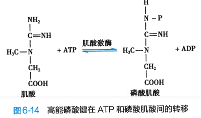
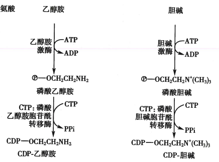

# 生物化学与分子生物学

## 第一章 蛋白质的结构与功能

### 蛋白质的分子组成

#### L-α 氨基酸使蛋白质的基本结构单位

参与蛋白质合成的氨基酸一般有 20 种，通常是 L-α-氨基酸（出甘氨酸外），以及硒代半胱氨酸某些情况也可以用于蛋白质合成

连在——COO-基上的碳原子称为 α-碳原子

#### 蛋白质可根据其侧脸结构和理化性质进行分类

可分为以下五类：

- 非极性脂肪族氨基酸
- 极性中性氨基酸
- 芳香族氨基酸
- 酸性氨基酸
- 碱性氨基酸

分类标准为侧链基团的性质，如果侧链 R 为非极性，则为非极性脂肪族氨基酸；如果含有极性官能团（如-OH）、极性原子（如 N、S），但不含电荷，则为极性中性氨基酸；如果含有苯环则为芳香族氨基酸；如果含有——COO-则为酸性氨基酸；如果含有——NH2+则为碱性氨基酸

上述氨基酸中：

- 非极性脂肪族氨基酸在水溶液中的溶解度小于极性中性氨基酸（因为水分子也是极性的）
- 芳香族氨基酸中，苯基疏水性强，酚基(OH-苯)和吲哚基(CN+苯成环)一定条件可解离
- 酸性氨基酸侧链都含羧基
- 碱性氨基酸侧链含氨基（赖氨酸）、胍基（-N-CNN，精氨酸）、咪唑基（C3N2 成环，组氨酸）

此外半胱氨酸相对特殊，两个半胱氨酸脱氢后以二硫键相连形成蛋白质

#### 蛋白质分子共同或特异的理化性质

##### 两性解离

因为所有的氨基酸都带有碱性的 α-氨基和酸性的 α-羧基，因此既可以与含有 H+的酸反应，又可以与带 OH-的碱溶液反应。

当与 H+结合的趋势与失去 H+与 OH-结合的趋势相同时，呈电中性，此时溶液的 pH 值称为等电点 pI，其计算公式为

$$
pI=\frac{1}{2}(pK_1+pK_2)
$$

其中 pK1 和 pK2 分别为与酸和与碱反应的电离平衡常数的**负对数（与 pH 值的计算类似都是平衡常数取负对数）**

##### 共轭双键可吸收紫外光

含有共轭双键（共轭双键主要存在与苯环中，所以三个芳香族氨基酸都有此性质）的色氨酸、酪氨酸最大吸收峰在 280nm 附近，**这常用于分析溶液中的蛋白质含量**，因为大多数蛋白质都含有色氨酸和酪氨酸的残基

##### 与茚三酮反应生成蓝紫色化合物

茚三酮反应：茚三酮水合物+氨基酸（弱酸性环境共热）-> 蓝紫色化合物

其中氨基酸被氧化托脱氨脱羧，茚三酮被还原，还原产物与氨基酸分解出的氨结合，再与另一分子茚三酮结合生成蓝紫色化合物。即相当于氨基酸分解出的氨与两分子茚三酮结合

最大吸收峰为 570nm，吸收峰大小与氨基酸释放出的氨量成正比，因此可作为**氨基酸定量分析的方法**

#### 氨基酸通过肽键连接形成蛋白质或肽

两个氨基酸，其中一个的 α-羧基和另一个的 α-氨基脱去一分子水可形成肽键

多肽链两端，一端存在一个游离的羧基，称为羧基末端或 C-端；另一端存在一个游离的氨基，称为氨基末端或 N 端

肽链中的氨基酸分子由于脱水缩合而基团不全，称为氨基酸残基

#### 生物肽具有生理活性及多样性

##### 谷胱甘肽

谷胱甘肽 = 谷氨酸 + 半胱氨酸 + 甘氨酸

主要由其中巯基发挥作用：

1. 巯基具有还原性，可作为还原剂保护酶和蛋白质中的巯基不被氧化
2. 巯基具有嗜核特性，可与外源嗜电子毒物结合将其阻断

##### 多肽类激素及神经肽体

多肽类激素：催产素、促肾上腺皮质激素、促甲状腺激素释放激素等都是多肽

神经肽：在神经传导过程中起信号转导作用的肽类，例如脑啡肽、内啡肽、抢匪太等，与痛觉抑制有关，常用于镇痛

### 蛋白质的分子结构

蛋白质的分子结构可以分为四个层次：一级、二级、三级、四级，后三者同城高级结构或空间构想。只有一条肽链的蛋白质只有前三级，两条及两条以上肽链形成的蛋白质才有四级结构

#### 一级结构：氨基酸排列顺序

**从 N 端至 C 端的氨基酸排列顺序** 称为蛋白质的一级结构

标号时，从 N 端开始的第一个氨基酸标号为 1，然后向 C 端依次向后标号

#### 二级结构：主链构象

二级结构是肽链主链股价原子的相对空间位置

肽链主链骨架原子即 N、α-碳原子（中心碳原子）和羰基碳原子，不涉及侧链。二级结构主要包括 α-螺旋、β-转角和 Ω 环。并且一个蛋白质分子还可以含有多种二级结构或多个同种二级结构

##### 参与肽键形成的 6 个原子在同一平面上

参议肽键形成的 6 个原子：$C_{\alpha1}, C,O,N,H,C_{\alpha2}$ 在同一平面上，这 6 个原子形成了肽单元

肽键的 C-N 与 C—N 单键键长不同，介于单键与双键之间，因此有一定的双键性，不可旋转

但是 $C_{\alpha}$ 分别与 N 和 C 相连的键都是单键，可以自由旋转。也正是这两个单键自由旋转的角度决定了两个肽单元平面的相对空间位置

##### α-螺旋

α-螺旋是常见的蛋白质二级结构：多肽链的主链围绕中心轴作有规律的螺旋式上升，螺旋走向为顺时针（右手螺旋）

在蛋白质表面的 α-螺旋常有两性特点，即 3-4 个氨基酸组成的亲水肽段和疏水肽段依次出现，使 α-螺旋的一侧亲水一侧疏水，使其能在极性或非极性环境中存在

多条 α-螺旋的肽链可以缠绕起来形成缆索，增强机械强度（弹性）

##### β-折叠

β-折叠呈折纸状，以每个肽单元的 $C_{\alpha}$ 为转折点（肽单元顺序依次为$C*{\alpha1},C,O,N,H,C*{\alpha2} $ ）依次折叠成锯齿状结构，侧链在上下方。

锯齿状结构一般较短，只含 5-8 个氨基酸残基

多个锯齿状结构可以平行排列或反平行排列，肽段之间通过羰基氧和氨基氢形成的氢键相连。

##### β-转角和 Ω 环

β 转角和 Ω 环出现在**球状蛋白质**中

β 转角发生在肽链进行 180° 回折时的转角上。β 转角一般由四个氨基酸残基构成，第一个氨基酸的羰基氧和第四个残基的氨基氢形成氢键

β 转角分为 Ⅰ 型和 Ⅱ 型

Ω 环总是出现在球状蛋白质表面，以亲水残基为主

##### 侧链对二级结构的影响

侧链的性质会影响二级结构的形成，例如一段肽链的氨基酸残基的侧链适合形成 α 螺旋或 β 折叠，就会出现对应的二级结构

#### 三级结构：全部氨基酸残基相对位置

三级结构是整条肽链所有原子在三维空间的排布位置

三级结构形成和稳定主要依靠次级键如：

- 疏水键
- 盐键
- 范德华力
- ……

结构模体：结构模体是蛋白质分子中具有特定空间构象和特定功能的结构成分，由 2 个或 2 个以上二级结构肽段组成

结构域：蛋白质折叠成的**结构较为紧密且稳定**的区域。含有多个结构域的蛋白质在水解后，会生成多个单独的结构域，而每个结构域的构象基本不变

#### 四级结构：亚基结构

亚基：每条多肽链都有完整的三级结构，称为亚基

蛋白质中各个亚基的空间排布及布局和相互作用，称为四级结构

#### 蛋白质分类

按组成成分分类：

- 单纯蛋白质：只含氨基酸
- 结合蛋白质：氨基酸 + 辅基（非蛋白质部分），绝大多数辅基与蛋白质部分通过**共价键**相连

按形状分类：

- 纤维状蛋白质：多为结构蛋白质，难溶于水，多作细胞支架
- 球状蛋白质：多数可溶于水

### 蛋白质结构与功能的关系

#### 蛋白质主要功能

1. 构成细胞核生物体结构：组织、器官、细胞
2. 物质运输：血红蛋白、载脂蛋白、清蛋白……
3. 催化功能：酶
4. 信息交流：受体
5. 免疫功能：抗体、淋巴因子
6. 氧化供能：蛋白质可彻底氧化水解供能
7. 维持机体酸碱平衡：蛋白质缓冲体系
8. 维持正常的血浆渗透压：清蛋白

#### 蛋白质执行功能主要方式

1. 蛋白质与小分子相互作用：酶催化作用、物质转运、信息传递等
2. 蛋白质与核酸相互作用：蛋白质合成、细胞发育调控等
3. 蛋白质相互作用是蛋白质执行功能的**主要方式**
   1. 主要组织相容性复合物参与分子识别
   2. 抗原与抗体特异性结合

#### 蛋白质一级结构是高级结构核功能的基础

一级结构是空间构象的基础：只要一级结构（氨基酸序列）未被破坏，就有可能恢复到原来的三级结构，功能依然存在

一级结构（氨基酸序列）相似的蛋白质，其空间构象和功能也相似

一级结构也与生物进化有关：物种越接近，一级结构越相似，空间构象与功能也相似

重要蛋白质的氨基酸序列改变可引起疾病：镰状细胞贫血

#### 蛋白质功能依赖特定空间结构

空间构象多与生理功能密切相关

e.g. 血红蛋白亚基 Hb 与肌红蛋白 Mb 结构相似，一分子血红蛋白 Hb 可结合四分子氧。

血红蛋白亚基构象变化可影响亚基与氧结合：

- 协同效应：一个亚基与配体结合后能影响另一亚基与配体的结合能力
  - 促进：正协同作用
  - 抑制：负协同作用
- 别构效应：一个氧分子与 Hb 亚基结合后引起其他亚基构象变化的现象，氧分子称为别构剂，Hb 称为别构分子

蛋白质构象变化可引起疾病：阿尔兹海默、疯牛病

### 蛋白质的理化性质

#### 两性电离性质

除分子两端的氨基和羧基可解离，侧链中某些基团也可解离

等电点：蛋白质解离成正、负离子的趋势相同，此时溶液的 pH 值

为什么当蛋白质颗粒的 pH 值大于等电点，OH-多，与蛋白质分子中的 H+结合，蛋白质颗粒带负电荷；小于等电点，H+多，与蛋白质分子中的负电基团结合，蛋白质颗粒带正电荷

#### 胶体性质

蛋白质溶液为胶体，即蛋白质**不容易从水中析出：**

- 水化膜：蛋白质颗粒表面多为亲水基团可吸水形成水化膜，阻断蛋白质颗粒相互聚集
- 蛋白质胶粒表面电荷也可稳定胶粒

#### 变性与复性

在物理和化学因素作用下，蛋白质特定空间构象被破坏，其理化性质及生物学性质发生变化，叫变性。

变性因素：加热、乙醇、强酸、强碱、重金属离子

蛋白质恢复或部分恢复原有构象和功能，称为复性

#### 特征性光吸收

蛋白质中含有共轭双键，280nm 有特征性吸收峰

#### 蛋白质显色反应

1. 茚三酮反应：蛋白质水解后的氨基酸可发生茚三酮反应，生成蓝紫色化合物
2. 双缩脲反应：蛋白质在弱碱溶液中与硫酸铜共热，出现紫红色反应

## 第二章 核酸的结构与功能

### 核酸的化学组成与一级结构

DNA 的基本组成单位是**脱氧核糖核苷酸**，RNA 的基本组成单位是**核糖核苷酸**

核苷酸由**碱基、戊糖和磷酸**组成

#### 核苷酸和脱氧核苷酸是构成核酸的基本组成单位

**碱基**，可分为嘌呤和嘧啶两类：

- 嘌呤：腺嘌呤 A、鸟嘌呤 G
- 嘧啶：尿嘧啶 U、胸腺嘧啶 T、胞嘧啶 C

DNA 碱基：AGCT；RNA 碱基：AGCU

**核糖**：5 碳糖，脱氧核糖存在 DNA 中，核糖存在 RNA 中，脱氧核糖的化学稳定性优于核糖

**核苷**：碱基与核糖的缩合反应产物，**C-1'原子**与碱基形成糖苷键相连，核糖与碱基处在反式构象

**脱氧核苷**：同理，碱基与脱氧核糖缩合的产物

核苷酸：核苷或脱氧核苷 C-5'的羧基与磷酸反应，脱水形成磷脂键，脱水缩合成核苷酸

含有不同数量磷酸基团的核苷酸分别称为核苷一/二/三磷酸。核苷三磷酸的三个磷原子分别命名为 α，β，γ 磷原子

#### 3',5'-磷酸二脂键

多个脱氧核糖核苷酸通过 3', 5'-磷酸二脂键共价相连

DNA 链一端是 C-5'上的磷酸基团，另一端是 C-3'上的羟基，分别称为 5'-端和 3'-端

C-3'端的羟基可以和可以和游离脱氧核苷三磷酸的 α-磷酸基团反应生成新的 3',5'-磷酸二脂键

因为 DNA 链只能从 3'端延长，所以有方向性 5'端到 3'端

RNA 也是多个核苷酸分子在 RNA 聚合酶催化下通过 3',5'-磷酸二脂键连接形成大分子，也有 5'端到 3'端的方向性。

RNA 与 DNA 的差别在于：

1. RNA 的戊糖环是核糖而不是脱氧核糖
2. RNA 的嘧啶是 C、U，一般没有 T。因此构成 RNA 的四种基本核苷酸是 AMP、GMP、CMP、UMP

#### 核酸的一级结构是核苷酸排列顺序

核酸的一级结构：DNA/RNA 从**5'-端到 3'-端**的脱氧核苷酸/核苷酸排列顺序。因为核苷酸的差异仅在于碱基（戊糖和磷酸均相同），所以一级结构也是**碱基序列**

### DNA 的空间结构与功能

DNA 的空间结构可分为二级结构和高级结构

#### DNA 的二级结构是双螺旋结构

DNA 双螺旋结构特征：

1. DNA 由两条多聚脱氧核苷酸链组成，反向平行（一条 5'-3'自上而下，一条 5'-3'自下而上）
2. 两条链之间形成**碱基互补配对**：C 与 G 之间形成**三条氢键**；A 和 T 之间形成**两条氢键**
3. 两条链的亲水骨架将互补碱基对包裹在内：亲水性骨架包裹疏水性碱基，形成小沟与大沟
4. 两个碱基对平面重叠产生**碱基堆积作用**：碱基堆积作用与氢键共同维持双螺旋结构稳定

#### DNA 双链经过盘绕折叠形成致密的高级结构

DNA 双链需要形成超螺旋结构保持稳定

##### 封闭环状 DNA

绝大多数原核生物的 DNA 为环状双螺旋分子，盘绕后生成超螺旋

叶绿体和线粒体是真核细胞中含有核外遗传物质的细胞器，线粒体 DNA 也有封闭环状的双螺旋结构

##### 真核生物 DNA 逐级组装成高级结构

染色体为串珠样结构，基本组成单位是**核小体**

盘绕压缩过程：

1. 第一次折叠：DNA 双链盘绕在组蛋白核心颗粒上，长度缩短 7 倍
2. 第二次折叠：形成染色质纤维中空状螺线管
3. 第三次折叠：超螺旋管，DNA 长度压缩 40 倍
4. 第四次折叠：形成染色单体，核内组装成染色体，长度压缩 5 到 6 倍

真核生物染色体有端粒和着丝粒两个功能区：

- 端粒
  - 染色体端 DNA+DNA 结合蛋白
  - 维持染色体结构稳定
  - 维持复制过程 DNA 完整性
  - 与衰老和肿瘤有关
- 着丝粒
  - 着丝粒可分开使染色体均等有序进入子代细胞

#### DNA 是主要遗传物质

肺炎链球菌体外转化实验：

噬菌体侵染大肠杆菌实验：

结论：DNA 是遗传信息的载体

生物体的遗传信息是以**基因**的形式存在的。

基因组是包含在生物的 DNA 中的全部遗传信息

### RNA 的空间结构与功能

RNA 可分为编码 RNA 和非编码 RNA：

- 编码 RNA：从基因组上转录而来、可翻译蛋白质
  - 仅有 RNA 一种
- 非编码 RNA：不编码蛋白质
  - 组成性非编码 RNA：确保实现生物学功能的 RNA
    - 转运 RNA(tRNA)
    - 核糖体 RNA(rRNA)
    - 端粒 RNA
    - 信号识别颗粒 RNA
  - 调控性非编码 RNA：丰度随外界环境和细胞性状而改变，在基因表达中发挥调控作用

#### mRNA 是蛋白质生物合成的模板

蛋白质合成速度与 RNA 水平有关，即 mRNA

核内线形成 hnRNA，经过转录后修饰与剪接后称为 mRNA

1. 真核生物 mRNA 的 5'端有帽结构：可与帽结合蛋白形成复合体，维持 mRNA 稳定、协助转运到细胞质、促进核糖体与翻译起始因子结合
2. 真核生物与部分原核生物 mRNA 的 3'端有多聚腺苷酸尾结构：3'-多聚(A)尾结构与 5'-帽结构共同负责 mRNA 由核向质转运、维持 mRNA 稳定以及翻译起始调控
3. 真核生物 hnRNA 修饰剪接成为成熟 mRNA：主要修饰过程包括剪切内含子（非编码序列），连接外显子（mRNA 序列片段），加帽加尾
4. mRNA 的核苷酸序列决定蛋白质的氨基酸序列
   1. mRNA 包括 5'-非翻译区、编码区和 3'-非翻译区
   2. 起始密码子 AUG 开始，每三个核苷酸组成一个遗传密码子，每个密码子编码一个氨基酸，直到终止密码子
   3. 非翻译区调控蛋白质合成

#### tRNA 是蛋白质合成中氨基酸的载体

1. tRNA 含有多种稀有碱基：即除 AGCU 外的碱基，稀有碱基均是转录后修饰而成
2. tRNA 由特定空间结构：

   1. 部分核苷酸序列能碱基互补配对形成局部链内双螺旋
   2. 不能配对部分凸出为茎环或发卡结构
   3. 三级结构力是氢键和碱基堆积力
3. tRNA 的 3'-端连接着氨基酸：3'端都连接着 CCA 三个核苷酸，后面连接**要转运的氨基酸（由密码子决定）**

   
4. tRNA 的反密码子能识别 mRNA 的密码子

   

#### rRNA 是核糖体主要成分

rRNA 是细胞中含量最多的 RNA

rRNA 与核糖体蛋白共同构成核糖体，有 5S、16S 和 23S 三种，与不同核糖体蛋白结合分别形成大亚基和小亚基

大小亚基沟槽：mRNA 结合部位

核糖体三个重要部位：

1. A 位：安氨酰位
2. P 位：肽酰位
3. E 位：已卸下氨基酸的 tRNA 的排除为

#### 组成性非编码 RNA 保障遗传信息传递

其他非编码 RNA 参与 RNA 的剪接和修饰、蛋白质转运以及调控基因表达

1. 催化小 RNA：核酶，剪接修饰中有作用
2. 核仁小 RNA：rRNA 加工
3. 核小 RNA：mRNA 成熟
4. 胞质小 RNA：与蛋白质结合成复合体后发挥作用

#### 调控性非编码 RNA 参与基因表达调控

调控性非编码 RNA 按大小可分为：

1. 非编码小 RNA
2. 长非编码 RNA
3. 环状 RNA

### 核酸的理化性质

#### 强烈的紫外吸收

嘌呤与嘧啶含有共轭双键，中性条件下最大吸收值在 260nm 附近

可以根据 260nm 吸光度 $A_{260}$来判断 DNA 或 RNA 含量

可以根据 $A_{260}/A_{280}$的吸光度比值判断提取核酸样品的纯度，DNA 纯品的比值为 1.8，RNA 纯品的比值为 2.0

核酸为多元酸，酸性较强

DNA 与 RNA 为线型分子，溶液粘滞度极大。RNA 长度远小于 DNA，RNA 溶液粘滞度小得多

核酸分子易沉降，且不同构想的核酸分子沉降速率差异大，所以可用超速离心法提取和分离。

#### DNA 变性

极端理化条件可以断裂氢键及破坏碱基堆积力，使双链解离成两条单链

解链后，更多碱基暴露，因此 $A_{260}$会增大，这种现象称为 DNA 的**增色效应**

可以根据 $A_{260}$的变化判断 DNA 双链是否变性

#### 变性核酸复性或杂交

复性：两条解离的 DNA 互补链重新互补配对成 DNA 双链并恢复双螺旋结构

核酸分子杂交：不同种核酸单链碱基互补配对相连

## 第三章 酶与酶促反应

### 酶的分子结构与功能

**单体酶**：一条肽链构成

**寡聚酶**：多条肽链非共价键连接而成

**多酶体系**：多种不同催化功能的酶聚合成一个整体，即多酶复合物

**多功能酶**：一条肽链上有多种催化功能

#### 酶的分子组成中常含有辅因子

酶按分子组成分类：

- **单纯酶**：水解后只有氨基酸
- **缀合酶/结合酶**：蛋白质部分（**酶蛋白**）与非蛋白质部分（**辅因子**）组成，两者结合称为**全酶**

辅因子按与蛋白质结合的紧密程度分类：

- 辅酶：非共价键，较松散
- 辅基：共价键，较紧密

金属离子常作为辅因子：

- 有的酶与金属离子**结合紧密**，称为**金属酶**
- 有的酶与金属离子的**结合是可逆的**，称为**金属激活酶**

#### 酶的活性中心是酶分子执行其催化功能的部位

**酶的活性中心**：能与底物**特异性结合**并**催化**底物转变为产物 的具有**特定三维结构**的区域

与酶活性相关的化学基团称为**必需基团**，包括**结合基团**和**催化基团**

#### 同工酶催化相同的化学反应

同工酶：催化相同的化学反应，但酶蛋白分子结构、理化性质乃至免疫学性质不同的一组酶

e.g. 动物的乳酸脱氢酶 LDH

### 酶的工作原理

#### 酶不同于一般催化剂的显著特点

1. **对底物有极高的催化效率**：能极大降低活化能，催化效率比一般催化剂高 $10^7$ 到 $10^{13}$ 倍
2. **对底物有高度特异性**：酶的专一性
   1. 绝对特异性：只作用于特定结构的底物分子
   2. 相对特异性：不依据整个底物分子结构，而依据特定的化学键或特定的基团
3. **酶具有可调节性**：酶活性与数量可受体内代谢分子或激素的调节
4. **酶具有不稳定性**：极端理化因素作用下会失活

#### 酶通过促进底物形成过渡态提高反应速率

- 酶比一般催化剂更有效地**降低活化能**

- 酶与底物结合形成**中间产物**：结合放能（结合能）以降低活化能
  - **诱导契合作用**：酶和底物接近时，互相诱导、互相变形、互相适应。该作用可以使有相对特异性的酶结合不同的底物分子
  - **邻近效应与定向排列**：多底物反应中，酶使各底物相互接近形成正确定向关系

- **表面效应**：酶活性中心是疏水“口袋”，表面效应使底物分子**去溶剂化**，排除水分子防止水化膜形成，以便底物与酶分子密切接触和结合

酶的催化机制呈现多元催化功能：

- 普通酸-碱催化作用：酶中有些基团作为**质子供体**，有些集团作为**质子受体**，通过**质子转移**提高反应速率
- 共价催化：催化剂与反应物形成共价结合的中间物降低活化能

### 酶促反应动力学（重点）

#### 底物浓度对酶促反应的影响呈矩形双曲线

反应速率$v$，底物浓度$[S]$

矩形双曲线：

1. a 段：一级反应
2. b 段：v 上升速率减缓，一级反应与零级反应混合
3. c 段：v 不再随 S 上升而增加，达到$V_{max}$零级反应

##### 米-曼方程与单底物反应

酶-底物中间复合学说：

1. 酶 E 与底物 S 结合生成酶-底物中间复合物 ES
2. ES 分解生成产物 P 和游离的酶

米-曼方程/米氏方程：

$$
v=\frac{V_{max}[S]}{K_m+[S]}
$$

其中：

- $K_m$为米氏常数
- $V_m$为最大反应速率

当 $[S]$远小于$K_m$时，分母中的 S 可忽略，此时方程化简为

$$
v=\frac{V_{max}}{K_m}[S]
$$

此时速率与底物浓度成正比，即一级反应阶段

反之，当[S]远大于 Km 时，分母中的 Km 可忽略，方程化简为

$$
v=\frac{V_{max}[S]}{[S]}=V_{max}
$$

此时速率与 S 无关，到达最大反应速率，即零级反应

米氏方程的假设/前提：

1. **单底物反应**
2. 反应速率为**初速率**，即反应刚开始时的酶促反应速率
3. [S]远大于[E]时，**底物消耗可忽略不计**

方程推导过程略

##### 参数$K_m$与$V_{max}$

1. $K_m$值等于$v=\frac{1}{2}V_{max}$时的底物浓度[S]，此时方程变为

$$
\frac{V_{max}}{2}=\frac{V_{max}[S]}{K_m+[S]}
$$

两边消去$V_{max}$后可解得

$$
K_m=[S]
$$

2. $K_m$值时酶的特征性常数：该常数与酶/底物结构、温度、pH 等有关，与酶浓度无关
3. $K_m$**可表示酶对底物的亲和力**
4. $V_{max}$是酶被底物完全饱和是的反应速率
5. 酶的转换数：酶被底物完全饱和时（到达$V_{max}$时），单位时间每个酶分子催化底物产生产物的分子数，称为酶的转换数，即$k_3$。已知$V_{max}$与酶总浓度$[E_t]$计算$k_3$如下

$$
k_3=\frac{V_{max}}{[E_t]}
$$

##### 林-贝作图法求$K_m$和$V_{max}$

也称为双倒数作图法，对米氏方程两边求倒数：

$$
\frac{1}{v}=\frac{K_m}{V_{max}}\cdot\frac{1}{[S]}+\frac{1}{V_{max}}
$$

以$\frac{1}{v}$为纵轴，以$\frac{1}{[S]}$为横轴作图，此时：

- 纵轴上截距为$\frac{1}{V_{max}}$
- 横轴上截距为$-\frac{1}{K_m}$

#### 底物充足时酶浓度对速率影响呈直线关系

[S]远大于[E]时，v 与[E]呈正比关系

#### 温度对酶促反应速率的影响有双重性

温度升高，分子热运动加快，碰撞机会增加，提高酶促反应速率

温度超过临界值，酶变形，速率下降

#### pH 通过改变酶分子及底物分子解离状态影响速率

酶分子中的众多极性基团在不同 pH 下解离状态不同

通过改变 pH 使酶处在特定解离状态，改变与底物的**亲和力**

同时 pH 也可以**改变酶活性中心的构象影响活性**

#### 抑制剂可降低酶促反应速率

酶的抑制剂：使酶活性下降又不引起酶蛋白变性的物质

##### 不可逆性抑制剂

与酶活性中心的必需基团**共价结合**使酶失活

##### 可逆性抑制剂

可逆性抑制剂：与酶**非共价结合**

1. **竞争性抑制剂**：结构与底物相似，与底物竞争结合酶的活性中心，阻碍酶与底物形成中间产物。抑制剂与酶的结合是可逆的

   
2. **非竞争性结合剂**：不影响酶和底物结合，但与其他位点结合抑制中间产物形成

   
3. **反竞争性抑制剂**：同样与其他点位结合，但只有在酶与底物结合后才能与酶-底物复合物结合发挥抑制作用

#### 激活剂可提高酶促反应速率

酶的激活剂：使酶从无活性变为有活性或使酶活性增加的物质，大多数为金属离子

大多数金属离子使酶的必需激活剂，如果没有则检测不到酶活性

### 酶的调节

#### 酶活性的调节

酶活性的调节是对酶促反应速率的**快速调节**

细胞对酶活性的调节包括**酶的别构调节**和**酶的化学修饰调节**

1. 别构调节：一些代谢物与酶活性中心外的部位非共价可逆结合，引起构象变化，改变酶活性

   1. 受调节的酶称为别构酶
   2. 引起别构效应的物质称为别构效应剂
   3. 别构酶中也存在正/负协同效应

   
2. 化学修饰调节：酶肽链与某些化学基团共价结合/去掉已结合的化学基团。最经典的离子就是磷酸化和去磷酸化（蛋白激酶催化）

3. 酶原需要通过激活才能转变为有活性的酶
   1. 部分酶初期无活性，这些酶前体称为**酶原**
   2. 酶原经蛋白酶水解去除几个肽段后，构象改变表现出活性
   3. 实际上是酶的活性中心暴露的过程

#### 酶含量的调节

酶含量的调节是对酶促反应速率的**缓慢调节**

1. 酶蛋白的合成可被诱导或阻遏

某些物质可在**转录水平**影响酶蛋白的生物合成：

- 促进酶合成的物质称为**诱导物，**诱发蛋白合成的作用称为**诱导作用**
- 减少酶合成的物质称为**辅阻遏物**，辅阻遏物与无活性的阻遏蛋白结合和影响转录，称为**阻遏作用**

2. 酶的降解与一般蛋白质降解途径相同
   1. 溶酶体途径：非ATP依赖途径，组织蛋白酶催化分解
   2. 胞质途径：ATP依赖，泛素介导

## 第四章 聚糖的结构与功能

### 糖蛋白分子中聚糖及其合成过程

复合糖类：糖基分子与蛋白质或脂以共价键连接形成的大分子

聚糖：单糖通过糖苷键聚合而成的寡糖或多糖

糖蛋白与蛋白聚糖均由共价连接的蛋白质和聚糖两部分组成

糖蛋白：糖类分子与蛋白质分子共价结合形成的蛋白质，根据聚糖与蛋白质的连接方式可分为：

- N-连接型聚糖
- O-连接型聚糖

#### N-连接型糖蛋白

糖基化：非糖生物分子与糖形成共价结合的反应

并非糖蛋白中所有天冬酰胺残基都可连接聚糖，只有特定的点位才能结合，这个点位就是**糖基化点位Asn-X-Ser/Thr**

根据结构可将N-连接型聚糖分为三类：

- 高甘露糖型：核心五碳连接了9个甘露糖Man
- 复杂型：多分支如天线
- 杂合型：兼具上述两者结构

N-连接型聚糖合成是以**长萜醇**为**聚糖载体：**

1. 长萜醇在糖基转移酶作用下得到GlcNAc
2. 然后在长萜醇上逐个加上糖基
3. 含有14个糖基后被转移至肽链的糖基化位点结合
4. 然后聚糖链依次在内质网和高尔基体加工

#### O-连接型聚糖

O-连接型聚糖的合成不需要聚糖载体

O-连接型聚糖的合成是在多肽链合成后进行，先形成O-连接，然后逐个加上糖基形成聚糖

整个过程从内质网开始，到高尔基体结束

#### $\beta$-N-乙酰葡糖胺

蛋白质糖基化除了上述两种外还包括β-N-乙酰葡糖胺的单糖基修饰(O-GlcNAc,OGT)

这种修饰与N-连接型和O-连接型不同，不再内膜系统（内质网、高尔基体等）进行，主要在细胞质或胞核中

OGT修饰可以用特异性酶解离，因此是可逆的

糖基化后会使蛋白质肽链构象改变，影响功能

#### 聚糖对蛋白质的影响

糖蛋白中聚糖不仅能影响蛋白的构象、聚合、溶解及降解，还能参与识别、结合等：

1. 聚糖可稳固多肽链的结构、延长半寿期
2. 聚糖参与糖蛋白新生肽链的折叠或聚合：糖蛋白起识别、定位功能，帮助精准折叠
3. 聚糖可影响糖蛋白在细胞内的靶向运输：溶酶体酶合成需要聚糖帮助信号识别、定向运输
4. 聚糖参与分子间相互识别：作为受体

### 蛋白聚糖分子中的糖胺聚糖

**蛋白聚糖**：由**糖胺聚糖(GAG)**共价连接不同**核心蛋白质**形成的**糖复合体**

糖胺聚糖：由二糖单位重复连接而成的杂多糖，不分支

#### 糖胺聚糖

**糖胺聚糖**是由**己糖醛酸**和**己糖胺**组成的**重复二糖单位**

#### 核心蛋白质

**核心蛋白质**：与糖胺聚糖共价结合的蛋白质

核心蛋白质均含有结合糖胺聚糖的结合域，用于结合糖胺聚糖

#### 蛋白聚糖

蛋白聚糖合成过程如下：

1. 先在内质网上合成核心蛋白质的多肽链
2. 合成多肽链同时以N-连接或N-连接进行聚糖加工
3. 在高尔基体上进行聚糖延长和加工，加工过程是在多肽链上逐个加上单糖而不是先合成二糖单位

蛋白聚糖的功能：

1. 最主要功能：构成细胞间的基质
2. 特殊功能：抗凝剂等

### 糖脂

糖脂可分为：鞘糖脂、甘油糖脂、类固醇衍生糖脂组成

#### 鞘糖脂

鞘糖脂是神经酰胺被糖基化的糖苷化合物

神经酰胺的1-位羟基被糖基化，形成糖苷化合物，其通式如下：

而鞘糖脂又可根据分子中是否含有唾液酸或硫酸基分为：

- 中性鞘糖脂：脑苷脂
- 酸性鞘糖脂：硫苷脂（鞘糖脂的糖基部分被硫酸化）、神经节苷脂（糖基部分含有唾液酸的鞘糖脂）

#### 甘油糖脂

髓磷脂：包围在神经元轴突外的脂质

甘油糖脂则是髓磷脂的重要成分

### 聚糖中蕴藏大量生物信息

聚糖组分是糖蛋白执行功能所必须：聚糖或多糖的合成不像核酸、蛋白质有模板指导

糖基序列或不同糖苷键的形成主要取决于：**糖基转移酶的特异性识别糖底物和催化作用**

在糖基转移酶催化下有序形成聚糖结构，而糖基转移酶又是由**基因编码**，符合基因到蛋白质的生物信息流向

结构多样性的聚糖富含生物信息：

1. 聚糖的空间结构多样性是其携带信息的基础
2. 聚糖空间结构多样性受基因编码的糖基转移酶和糖苷酶调控

## 第五章 糖代谢

### 糖的摄取与利用

糖被消化成单糖后才能在小肠被吸收

小肠粘膜细胞上的载体可以通过**伴有Na+转运的主动转运**摄入葡萄糖，这种载体称为Na+依赖型葡糖转运蛋白

在体内，葡萄糖的代谢射击分解、存储、合成三方面：

- 分解
  - 无氧氧化
  - 有氧氧化
  - 磷酸戊糖途径
- 存储
  - 糖原形式存储在肝和肌组织中
- 合成
  - 饥饿时使非糖物质转变为葡萄糖供能

### 糖的无氧氧化

#### 无氧氧化两个阶段

葡萄糖的无氧氧化**全部在细胞质中进行**，分为两个阶段：

1. 糖酵解：葡萄糖被分解为两分子丙酮酸
2. 乳酸合成：乳酸脱氢酶LDH催化丙酮酸还原成乳酸，还原所需H+来自NADH

在糖酵解的10步反应中，有3个反应是不可逆的，这3个反应速率最慢，是控制糖酵解反应速度的限速步骤：

1. **磷酸果糖激酶-1** 对调节糖酵解速率**最重要**：该酶主要受别构作用以及化学修饰的方式影响活性
2. **丙酮酸激酶**是糖酵解的第二个重要调节点：同样可以通过别构作用和化学修饰（磷酸化、激素）调节
3. 己糖激酶受反馈抑制调节：受其产物葡糖-6-磷酸的反馈抑制

糖酵解是葡萄糖分解供能的起始阶段，能量消耗多时，磷酸果糖激酶-1和丙酮酸激酶被激活，葡萄糖分解加快

反之血糖高时糖酵解分解的葡萄糖就减少

#### 糖的无氧氧化为机体快速供能

无氧氧化最主要的生理意义就是：**不利用氧迅速提供能量**，对肌收缩很重要

肌细胞储存的ATP较少，因此运动时常需要无氧氧化提供ATP

另外在成熟红细胞等不含线粒体的细胞中也主要靠无氧氧化糖供能

1 mol葡萄糖无氧氧化净得到2 mol ATP

#### 其他单糖可转变为糖酵解的中间产物

其他己糖，如果糖、半乳糖、甘露糖等，可以转变为糖酵解的中间产物，进入糖酵解过程提供能量

### 糖的有氧氧化

有氧氧化：将葡萄糖彻底氧化分解为CO2和H2O的过程

#### 有氧氧化三阶段

有氧氧化分为三个阶段：

1. 葡萄糖在细胞质经糖酵解生成丙酮酸
2. 丙酮酸进入线粒体氧化脱羧生成乙酰CoA
3. 乙酰CoA进入三羧酸循环，并偶联进行氧化磷酸化

第一步：葡萄糖在细胞质经糖酵解生成丙酮酸，同无氧氧化

第二步：丙酮酸在线粒体氧化脱羧生成乙酰CoA，总反应式如下：

$$
丙酮酸+NAD^++HS-CoA \ce{->}乙酰CoA+NADH+H^++CO_2
$$

第三步：乙酰CoA经三羧酸循环和氧化磷酸化提供能量

循环过程：

1. 乙酰CoA与草酰乙酸缩合生成柠檬酸
2. 柠檬酸经一系列反应重新生成草酰乙酸

每经过1轮循环：

- 发生2次脱羧，释放2分子CO2
- 发生1次磷酸化，生成1分子ATP
- **四次脱氢，生成**
  - 3分子NADH+H+
  - 一分子FADH2
- 最后电子经电子传递链传递至氧生成水，并逐步释放能量

#### 三羧酸循环

三羧酸循环分为8步，总反应为

$$
\begin{align}
CH_3CO\sim SCoA+3NAD^++FAD+GDP(ADP)+P2+2H_2O\\\ce{->}2CO_2+3NADH+3H^++FADH_2+HS-CoA+GTP(ATP)
\end{align}
$$

每一次三羧酸循环：

- 消耗1分子乙酰CoA(2个碳原子)，释放2个CO2，但两个碳原子来自草酰乙酸
- 中间产物无量的变化

三羧酸循环在三大营养物质代谢中占核心地位：

1. 糖、脂肪、氨基酸都分解为乙酰CoA进入三羧酸循环
2. 三大营养物质可以三羧酸循环为**枢纽**相互转变

#### 糖的有氧氧化是产能的主要途径

1mol葡萄糖彻底氧化，可净生成30或32mol ATP，总反应：

$$
葡萄糖+30/32ADP+30/32Pi+6O_2\ce{->}30/32ATP+6CO_2+36H_2O
$$

#### 糖的有氧氧化的调节

丙酮酸在三羧酸循环代谢的速率受**两个阶段酶**的调节：

1. 丙酮酸脱氢酶复合体的活性
   1. 别构调节
      1. 能量状态：ATP别构抑制，AMP别构激活，ATP/AMP值大小
      2. 代谢产物的量：反应产物别构抑制，反应底物激活酶活性
   2. 可逆化学修饰
      1. 磷酸化失活，去磷酸化恢复活性
      2. NADH和乙酰CoA除了别构抑制，还能激活丙酮酸脱氢酶激酶，使复合体失活
2. 三羧酸循环关键酶
   1. 三羧酸循环中有3步不可逆反应，其酶控制速率
   2. 底物别构激活
   3. 产物别构抑制
   4. 能量状态：ATP别构抑制，ADP别构激活
   5. Ca2+激活作用：线粒体内Ca2+浓度升高增强酶活性

事实上，有氧氧化各阶段相互协调，主要原因是**多种关键酶可别相同的别构剂调节**，这些共同的别构剂包括两大类：

- **共同代谢物别构调节**：产物别构激活，底物别构抑制
- **能量状态协同调节**：ATP/AMP值（因为ATP与ADP总同时减少因此ATP/ADP变化不明显）

#### 糖氧化产能方式的选择有组织偏好

线粒体选择有氧或无氧氧化取决于不同类型组织

- 肌组织：有氧时，有氧氧化活跃，无氧抑制：巴斯德效应
- 肿瘤：有氧时也不彻底氧化，而分解为乳酸：瓦伯格效应

### 磷酸戊糖途径

磷酸戊糖途径是糖酵解途径的旁路，通过氧化、集团转移两个阶段再返回糖酵解途径

磷酸戊糖途径不产生ATP，但生成**NADPH**和**磷酸核糖**

#### 磷酸戊糖途径的两个阶段

第一阶段：氧化阶段

1分子葡糖-6-磷酸生成**2分子NADPH**和**1分子核糖-5-磷酸**，释放1分子CO2

$$
葡糖-6-磷酸\ce{->}2NADPH+核糖-5-磷酸+CO_2
$$

第二阶段：基团转移阶段

$$
\begin{align}3\times葡糖-6-磷酸+6NADP^+\ce{->}2\times果糖-6-磷酸+3-磷酸甘油醛+6NADPH+6H^++3CO_2\end{align}
$$

#### 磷酸戊糖途径的调节

葡糖-6-磷酸脱氢酶的活性决定葡糖-6-磷酸进入此途径的含量

NADPH可抑制葡糖-6-磷酸脱氢酶

因此磷酸戊糖途径主要受NADPH/NADP+比值的调节：

- 比值高时，葡糖-6-磷酸脱氢酶活性低，磷酸戊糖途径被抑制
- 反之则激活

因此磷酸戊糖途径的流量取决于NADPH的需求，负反馈调节

#### 磷酸戊糖途径时NADPH和磷酸核糖的主要来源

1. 提供磷酸核糖参与核酸的生物合成
2. 提供NADPH作为供氢体参与多种代谢反应：NADH携带的H经电子传递链氧化供能，而NADPH的H参与代谢反应
   1. 合成代谢：脂质合成涉及还原；氨基酸合成等
   2. 烃化反应
   3. 维持谷胱甘肽的还原状态

### 糖原的合成与分解

糖类大部分转变为脂肪，少部分合成糖原

糖原储存在肝和肌细胞中：

- 肝糖原：血糖重要来源
- 肌糖原：为肌收缩提供急需能量

糖原是葡萄糖多聚体，分枝状，有一个还原性末端和多个非还原性末端。合成与分解时，增减均发生在非还原性末端

#### 糖原合成

糖原合成时，葡萄糖需要先活化，再连接形成直链和支链

1. 葡糖-6-磷酸转换成葡糖-1-磷酸，后者活化生成尿苷二磷酸葡萄糖(UDPG)，即“活性葡萄糖”

2. **糖原蛋白**与UDPG的葡萄糖基结合，延伸到八糖时称为糖原合成的**初始引物**
3. 糖原合酶将UDPG的葡萄糖基转移到糖原引物非还原性末端
4. 糖链长达11葡萄糖基时，分支酶将非还原性末端的部分葡萄糖基转移到临近糖链形成分支
   1. 分支可增加糖原水解性
   2. 更重要的时增加非还原性末端数量，便于糖原迅速分解
5. 糖原分子每延长1葡萄糖基，消耗2ATP

#### 糖原分解

糖原分解时指糖原被分解为葡糖-1-磷酸，不是合成的逆反应

1. **糖原磷酸化酶**分解α-啊，4-糖苷键释放葡糖-1-磷酸
   1. α-1，4-糖苷键逐个分解，糖链不断缩短
2. **脱支酶**分解α-1,6-糖苷键释放出游离葡萄糖
   1. 缩短至离分支点4个葡萄糖基时，葡聚糖转移酶催化3个葡萄糖基转移到邻近分支末端
   2. 分支剩下的1个葡萄糖水解成游离葡萄糖

3. 肝糖原和肌糖原分解糖原都释放**葡糖-1-磷酸**，然后转换为**葡糖-6-磷酸**
   1. 肝中的**葡糖-6-磷酸酶**可将葡糖-6-磷酸水解成葡萄糖释放进血液
   2. 肌细胞不含此酶，只能进行**糖酵解**

#### 糖原合成与分解的调节

糖原合成和分解相互制约，一个活跃则另一个被抑制

糖原合酶：糖原合成关键酶

糖原磷酸化酶：分解关键酶

1. **磷酸化修饰**对两种关键酶效果相反
   1. 糖原磷酸化酶被激活
   2. 糖原合酶被抑制
2. **激素**反向调节糖原的合成分解
   1. **胰高血糖素**促进**肝糖原分解**
   2. **肾上腺素**促进**肌糖原分解**
   3. **胰岛素**促进**糖原合成**
3. 别构剂调节肝糖原和肌糖原分解
   1. **葡萄糖别构抑制肝糖原磷酸化酶**：血糖升高抑制肝糖原分解
   2. **能量和Ca2+别构调节肌糖原分解：**
      1. 能量缺乏，AMP多，激活糖原磷酸化酶，促进肌糖原分解；能量充足，ATP、葡糖-6-磷酸多，抑制肌糖原分解
      2. Ca2+增多能激活磷酸化酶，促进糖原分解

### 糖异生

糖异生：非糖化合物转变为葡萄糖或糖原的过程

主要器官：肝

#### 糖异生过程

丙酮酸能逆着糖酵解方向生成葡萄糖、乳酸等，但不完全是糖酵解的逆反应

糖酵解和丙酮酸多数反应可逆，但三个限速步骤的逆反应需要关键酶催化

糖酵解最后一步反应的逆反应，丙酮酸羧化支路：

1. **丙酮酸**在**丙酮酸羧化酶**催化下，消耗ATP与CO2结合生成**草酰乙酸**
2. **草酰乙酸**在**磷酸烯醇式丙酮酸羧激酶**催化下，消耗一个ATP脱羧转变为**磷酸烯醇式丙酮酸**

草酰乙酸有两种方式从线粒体转运到细胞质：

1. 经**苹果酸**转运：**线粒体内的苹果酸脱氢酶**催化**草酰乙酸**还原成**苹果酸**，运出线粒体后，经细胞质种的苹果酸脱氢酶催化氧化苹果酸为草酰乙酸。此过程同时**伴随NADH从线粒体到细胞质的转运**
2. 经**天冬氨酸**转运：线粒体内**谷草转氨酶**催化**草酰乙酸**转变成**天冬氨酸**，运出线粒体后，细胞质种的谷草转氨酶催化天冬氨酸再恢复成草酰乙酸，**不伴随NADH的转运**

具体使用哪一种方式，取决于原料对供氢体的需求：

- 如乳酸后续所需的还原氢来自细胞质中的NADH，无需从线粒体转运NADH，所以使用天冬氨酸方式
- 丙酮酸所需的NADH必须由线粒体提供，所以使用苹果酸方式

随后两个限速反应和关键酶分别如下：

果糖-1,6-二磷酸水解为果糖-6-磷酸，由果糖二磷酸酶-1催化

葡糖-6-磷酸水解为葡萄糖，由葡糖-6-磷酸酶催化

综上，糖异生的4个关键酶为：

- 丙酮酸羧化酶（线粒体内将丙酮酸转变为草酰乙酸）
- 磷酸烯醇式丙酮酸羧激酶（线粒体外将草酰乙酸转变为磷酸烯醇式丙酮酸）
- 果糖二磷酸酶-1（将果糖-1,6-二磷酸水解为果糖-6-磷酸）
- 葡糖-6-磷酸酶（将葡糖-6-磷酸水解为葡萄糖）

完整的丙酮酸糖异生途径如下：

#### 糖异生和糖酵解的反向调节

底物循环：不同的酶催化底物互变，称为**底物循环**

糖酵解和糖异生是方向相反的两条代谢途径，如果两种酶活性相同，则代谢不会向任何一个方向推进。要进行有效糖异生，就要抑制糖酵解

通常糖异生与糖酵解的反向调节主要针对**两个底物循环**：

##### 果糖-6-磷酸与果糖-1,6-二磷酸的互变

糖酵解：果糖-6-磷酸磷酸化形成果糖-1,6-磷酸，耗能

糖异生：水解去磷酸，无产能

催化此互变反应的两种酶活性呈相反变化

如上图，果糖-2,6-二磷酸和AMP是：

- 果糖二磷酸酶-1的别构抑制剂
- 磷酸果糖激酶-1的别构激活剂

通过能量负反馈和果糖二磷酸正反馈，抑制糖异生，促进糖酵解

果糖-2.6-二磷酸可受激素调节：

- 饥饿时，**胰高血糖素**使磷酸果糖激酶-2磷酸化失活，使**果糖-2,6-二磷酸减少**，增强糖异生，减弱糖酵解
- 进食后，**胰岛素升高果糖-2,6-二磷酸水平**，减弱糖异生增强糖酵解

##### 磷酸烯醇式丙酮酸与丙酮酸的互变

糖酵解：磷酸烯醇式丙酮酸转变为丙酮酸并产能

糖异生：耗能生成磷酸烯醇式丙酮酸

该底物循环中涉及的三个关键酶和调节方式如下：

- 丙酮酸激酶
  - 别构调节：
    - 果糖-1,6-二磷酸别构激活，促进糖酵解，其可受胰高血糖素调节（见上文）
    - 丙氨酸别构抑制，可阻止糖酵解
  - 化学修饰调节
    - 胰高血糖素通过cAMP磷酸化丙酮酸激酶抑制其活性，减弱糖酵解
- 磷酸烯醇式丙酮酸羧激酶：激素调节
  - 胰高血糖素：通过cAMP提高该酶的mRNA水平，促进合成酶蛋白，促进糖异生
  - 胰岛素：降低mRNA和酶蛋白，减弱糖异生
- 丙酮酸羧化酶：乙酰CoA别构激活
  - **乙酰CoA别构激活丙酮酸羧化酶**，使丙酮酸转变为草酰乙酸加速糖异生
  - **乙酰CoA抑制丙酮酸脱氢酶复合体**，阻止ptt经丙酮酸氧化分解

##### 两个底物循环间的联系

1. 中间代谢物协调两个底物循环：果糖-1,6-二磷酸可激活第一个循环中的磷酸果糖激酶-1，也可激活第二个循环中的丙酮酸激酶，使两个底物循环同时向着糖酵解方向进行
2. 激素协调两个底物循环：胰高血糖素可降低果糖-2,6-二磷酸，也能使丙酮酸激酶磷酸化失活，抑制糖酵解、促进糖异生

#### 糖异生的生理意义

糖异生的主要生理意义使维持血糖恒定

##### 维持血糖恒定

饥饿导致肝糖原耗尽后，肝通过糖异生维持血糖水平恒定：

1. 蛋白质分解为氨基酸运输至肝进行糖异生
2. 脂肪分解运输甘油至肝，糖异生补充葡萄糖

肌糖原分解成乳酸，乳酸经血液转运至肝进行糖异生

##### 补充或恢复肝糖原储备

进食后，血糖浓度尚不足，糖异生生成葡糖-6-磷酸进入糖原合成途径

摄入葡萄糖不直接合成糖原，而是先分解为丙酮酸、乳酸等三碳化合物，后者再异生成糖合成糖原，称为**糖原合成的三碳途径**

##### 肾糖异生

长期饥饿时，酮体代谢旺盛，体液pH降低，促进肾小管中**磷酸烯醇式丙酮酸羧激酶**合成，肾糖异生增强，可降低原尿中H+浓度，维持酸碱平衡

#### 乳酸循环

1. 肌收缩使糖无氧氧化生成乳酸
2. 乳酸通过细胞膜弥散进入血液，运输到肝
3. 肝内乳酸异生成葡萄糖
4. 葡萄糖释放入血液后被肌获取

乳酸循环的生理意义：

1. 回收乳酸中能量
2. 避免乳酸堆积酸中毒

### 葡萄糖代谢的其他途径

葡萄糖除了氧化供能（无氧、有氧）和磷酸戊糖途径外，还可代谢生成葡糖醛酸、多元醇等产物

#### 糖醛酸途径

糖醛酸途径置以葡糖醛酸为中间产物的葡萄糖代谢途径

葡萄糖经葡糖醛酸最终生成木酮糖-5-磷酸进入磷酸戊糖途径

该途径的主要生理意义是**生成活化的葡糖醛酸**，后者是糖胺聚糖的组成成分、参与肝内生物转化反应

#### 多元醇

葡萄糖可代谢生成多种醇类物质，称为多元醇途径

多元醇途径仅局限于某些组织中

多元醇在肝、脑等阻止中有重要生理意义

### 血糖及其调节

血糖的三来路三去路如下图：

#### 血糖水平恒定

原因是来源与去路的动态平衡：

- 餐后，所有去路活跃
- 短期饥饿，肝糖原分解
- 长期饥饿，非糖物质糖异生，大多数组织改用脂质能源

#### 血糖的激素调节

##### 胰岛素

胰岛素由胰腺β细胞分泌，可降血糖

胰岛素分泌受血糖控制：血糖升高胰岛素分泌增强，降低则减少

胰岛素降低血糖的机制是增加去路、减弱来源：

1. 促进肌、脂肪组织摄取葡萄糖
2. 激活磷酸二酯酶降低cAMP，活化糖原合酶、抑制磷酸化酶，加速糖原合成、抑制糖原分解
3. 激活**丙酮酸脱氢酶磷酸酶**使**丙酮酸脱氢酶复合体**活化，加速糖有氧氧化
4. 抑制肝内糖异生
   1. 抑制磷酸烯醇式丙酮酸羧激酶合成
   2. 氨基酸加速合成，减少糖异生原料
5. 糖分解产物乙酰CoA和NADPH增多，促进原料合成脂肪酸

##### 升血糖激素

胰高血糖素由胰腺α细胞分泌，机制使增强来源、减弱去路：

1. 加速肝糖原分解：抑制糖原合酶、激活磷酸化酶
2. 抑制糖酵解加速糖异生
   1. 抑制磷酸果糖激酶-2、激活果糖二磷酸酶-2，减少果糖-2,6-二磷酸合成
   2. 后者别构激活磷酸果糖激酶-1，别构抑制果糖二磷酸酶-1
3. 促进脂肪分解功能节省血糖

糖皮质激素升血糖机制：

1. 促进糖异生：
   1. 促进肌蛋白质分解，增加糖异生原料
   2. 使磷酸烯醇式丙酮酸羧激酶合成加强
2. 抑制丙酮酸氧化脱羧，阻止葡萄糖分解
3. 促进机体利用脂肪酸供能

肾上腺素强力升血糖机制：

1. 加速糖原分解
2. 肌糖原无氧氧化成乳酸，乳酸循环间接升高血糖

## 第六章 生物氧化

**生物氧化**：化学物质在生物体内氧化分解的过程

生物氧化特点：

- 需要有酶催化
- 分阶段逐步完成

线粒体内生物氧化：

- 产物使CO2和H2O
- 需氧且产能合成ATP

### 线粒体氧化体系与呼吸链

线粒体中营养物质氧化脱氢，脱下的氢以NADH和FADH2等形式存在，后两者经一系列酶催化，逐步脱氢、脱电子，将电子和氢传递给氧生成水，释放能量合成ATP

#### 传递氢和电子的组分

参与传递NADH和FADH2的氢的递氢体和递电子体如下

1. 烟酰胺腺嘌呤二核苷酸(NAD+)

NAD+可接收2个电子和一个H+，剩一个游离的H+：

- 五价N+接收2个电子变为三价N
- 芳环加氢

NAD+磷酸化后的NADP+与NAD+机制相同，生成NADPH+H+传递氢和电子，但参与的反应不同

2. 黄素核苷酸衍生物

黄素单核苷酸(FMN)和黄素腺嘌呤二核苷酸(FAD)可接收2个H+和一个电子，形成还原型FMNH2和FADH2，传递电子

3. 有机物泛醌

泛醌又称**辅酶Q**，其苯醌部分可：

- 接受1个电子和1个H+还原为半醌QH*
- 再接受1个电子和1个H+还原为二氢泛醌QH2

QH2可逐步失电子和H+被氧化为Q，因此Q可进行双、单电子传递

4. 铁硫蛋白和细胞色素蛋白

**铁硫蛋白**含有铁硫中心Fe-S，其中的**亚铁离子**可通过可逆反应每次传递一个电子，是单电子传递体

$$
Fe^{2+}\leftrightarrow Fe^{3+}+e^-
$$

**细胞色素蛋白**通过辅基血红素中的**Fe离子**发挥单电子传递体功能

细胞色素Cyt有三种亚类，主要是血红素辅基不同，其各自的最大吸收峰也不同

#### 呼吸链

NADH与FADH2逐步被氧化脱氢，释放能量合成ATP

催化此过程的酶，是由**多个含有辅因子的蛋白质复合体**，按顺序形成传递电子/氢的反应链，称为**电子传递链**，也称为**呼吸链**

呼吸链主要由四种复合体组成：

- **复合体Ⅰ**
  - 又称**NADH-Q还原酶**或**NADH脱氢酶**
  - 功能是**接受NADH的电子并传递给Q**
  - 电子传递过程：NADH->FMN->Fe-S->Q最终形成QH2
  - Q可在各复合体中传递氢，在电子传递和质子移动中有重要作用
  - 复合体I还**有质子泵功能**
    - 将4各H+从线粒体基质侧(N侧)泵到膜间隙侧(P侧)
    - 能量来自电子传递
- **复合体Ⅱ**
  - **琥珀酸-泛醌还原酶**或**琥珀酸脱氢酶**（三羧酸循环）
  - 功能是**将电子从琥珀酸传递给Q**
  - 电子传递过程：琥珀酸->FAD->Fe-S->Q
  - 此过程放能较少，因此复合体Ⅱ没有质子泵功能
- **复合体Ⅲ**
  - **泛醌-细胞色素c还原酶**
  - 功能是**接受QH2的电子并传递给Cyt c**
  - Q从复合体I和II募集H，产生QH2穿梭至复合体III，复合体III将电子传递给Cyt c蛋白
  - QH2含有**双电子**，而Cyt c是**单电子载体**，因此传递需通过“**Q循环**”
    - QH2结合在Qp位点，Q结合在QN位点
    - 重复两次将电子传递给两分子Cyt c，同时将两个H传递给Q生成QH2
    - 传递过程：QH2->Cyt b->Fe-S->Cyt c1->Cytc
  - 复合体Ⅲ有质子泵功能，每传递2e-向膜间隙释放4H+
  - Cyt c将电子传递到复合体IV
- **复合体IV**
  - 细胞色素c氧化酶，是电子传递链的出口
  - 功能是将Cyt c的电子传递给O2生成H2O
  - 传递过程：Cyt c->CuA中心->Cyt a -> Cyt a3-CuB -> O2
  - 依次传递4个电子，从线粒体基质获得4个H+，与O2生成2分子H2O

其中传递的4个电子是逐个传递，逐步氧化的，过程如下：

#### 呼吸链的电子供体

NADH和FADH2是呼吸链的电子供体

多数脱氢酶以NAD+、NADP+、FMN或FAD为辅酶或辅基，用于获取底物上脱下来的成对氢，生成还原态的

- NADH+H+

  - 复合体I为NADH脱氢酶
  - 通过呼吸链彻底氧化参与能量代谢
- NADPH+H+

  - NADPH的磷酸基团会被生物合成中的酶特异性识别
  - 主要用于还原反应而非能量代谢
- FADH2

  - 进入呼吸链氧化放能

复合体I和复合体II分别获取氢，通过各自的途径向Q传递，形成了两条电子传递链：

1. NADH呼吸链

NADH -> 复合体I -> Q -> 复合体III -> Cyt c -> 复合体IV -> O2

2. FADH2呼吸链，或琥珀酸氧化呼吸链

琥珀酸 -> 复合体II -> Q -> 复合体III -> Cyt c -> 复合体IV -> O2

### 氧化磷酸化与ATP的合成

ADP磷酸化生成ATP的方式有两种 ：

1. 底物水平磷酸化：高能键水解反应的能量直接转移至ADP，产生少量ATP
2. 氧化磷酸化：线粒体中NADH和FADH2氧化，提供能量驱动ADP磷酸化为ATP

#### 氧化磷酸化偶联部位

氧化磷酸化耦联部位：呼吸链中能产生能量使ATP磷酸化的部位（只是释放能量能满足ADP磷酸化为ATP，并非直接生成ATP的部位）

一对电子通过呼吸链传递给一个O原子生成1分子H2O，过程中释放的能量用于合成ATP

**P/O比值**：每消耗1/2 mol O2所需的磷酸摩尔数，即能合成的ATP的摩尔数。可以根据P/O比值推测呼吸链中耦联部位

经实验，氧化磷酸化耦联部位为**复合体I、III、IV**

#### 氧化磷酸化偶联机制

氧化磷酸化偶联机制是**产生跨线粒体内膜的质子梯度**

化学渗透假说：

1. 电子传递使释放的能量可令**复合体质子泵**从**线粒体基质**转运H+到**内膜胞质侧**
2. 因此形成了跨线粒体内膜的**质子梯度**（浓度梯度和跨膜电位差），可理解为储存了电子传递释放的能量
3. 浓度梯度作为驱动力，使质子顺梯度回流至基质，释放能量驱动ADP和Pi生成ATP

线粒体内膜上的**复合体V**为**ATP合酶**，可利用H+顺梯度回流时释放的能量，催化ADP与Pi合成ATP

ATP合酶有两个结构域：

- F1：亲水部分，催化ATP合成
- Fo：疏水部分，嵌入线粒体内膜中组成离子通道，用于质子回流

F1与Fo可形成可旋转的发动机样结构，完成质子回流与ATP合成

质子顺梯度回流时，转子绕定子旋转并合成ATP

**ATP合成的结合变构机制**，β亚基有3种构象：

- 开放性O，无活性，与ATP亲和力低
- 疏松型L，无活性，可与ADP和Pi底物结合
- 紧密型T，有催化ATP合成的活性，可紧密结合ATP

能量驱动转子旋转时，驱动β亚基构象按顺序改变，循环“结合ADP和Pi - 合成ATP - 释放ATP”的过程

ATP合酶转子循环一周生成3分子ATP。

**每分子ATP合成需要4个H+**，其中3个H+经ATP合酶回流入基质，1个H+用于转运ADP、Pi和ATP

#### ATP在能量代谢种的作用

1. ATP是**体内最重要的高能磷酸化合物**，是细胞**可直接利用的能量形式。**可通过水解释放大量自由能，促进需要供能的反应完成
2. ATP是能量转移和核苷酸互变的核心
   1. **腺苷酸激酶**可催化ATP、ADP和AMP间的互变：ADP积累过多时可催化合成AMP；ATP过多时，AMP可获得~P变为ADP
   2. 核苷二磷酸激酶可催化UDP、CDP、GDP获得ATP的~P生成UTP、CTP、GTP

3. ATP通过转移自身基团提供能量：ATP可为底物提供Pi或PPi形成中间产物，参与酶促反应

4. 磷酸肌酸也是储存能量的高能化合物
   1. ATP充足时，可转移~P给肌酸，生成磷酸肌酸CP
   2. 当ATP迅速消耗时，CP可提供~P给ADP生成ATP

### 氧化磷酸化的影响因素

能够影响NADH、FADH2合成、呼吸链组分、ATP合酶功能的因素，都会影响氧化磷酸化，从而影响ATP合成

#### 体内能量状态

ATP分解为ADP、ATP/ADP比值降低时，ADP进入线粒体，氧化磷酸化加速；ATP/ADP回升后氧化磷酸化速率放缓

同时，ATP和ADP也能调节糖酵解、三羧酸循环途径，ATP可别构抑制糖酵解、三羧酸循环，降低产能，从而降低氧化磷酸化速率

#### 抑制剂

1. **呼吸链抑制剂**：阻断电子传递过程、降低耗氧量、阻断ATP的产生
2. **解偶联剂**：可使氧化和磷酸化偶联分离，阻断ADP磷酸化过程
   1. 电子可沿呼吸链传递
   2. 但无法建立质子电化学梯度，不能驱动ATP合酶合成ATP
   3. 例如某些可结合H+的物质结合了泵出的H+，或让泵出的H+以其他途径回到线粒体基质，从而无法建立H+梯度
3. ATP合酶抑制剂：同时抑制电子传递和ATP生成

#### 甲状腺激素

甲状腺激素主要有下面两个功能，分别促进氧化磷酸化和产热：

1. 促进膜上Na+-K+-ATP酶的表达（钠钾泵的ATP酶），加速ATP分解，ADP浓度增加促进氧化磷酸化
2. 诱导解偶联蛋白基因表达，ATP产生减少，氧化的能量用于产热

#### 线粒体DNA突变

线粒体DNA(mtDNA)是裸露的因而容易损伤突变

突变后可影响氧化磷酸化过程

#### 线粒体内膜选择性协调转运

线粒体外膜通透性高、选择性低

内膜有与代谢物转运相关的蛋白质体系，能对各种物质进行选择性转运

##### NADH转运

线粒体外生成的NADH（糖酵解等途径生成）需要通过穿梭机制进入线粒体呼吸链进行氧化：

1. α-磷酸甘油穿梭：脑、骨骼肌细胞中主要采用此机制
   1. NADH+H+传递2H生成α-磷酸甘油
   2. α-磷酸甘油通过线粒体外膜到达间隙处
   3. 内膜间隙侧的FAD结合2H生成FADH2
   4. FADH2传递2H给泛醌Q生成QH2
   5. QH2直接进入氧化呼吸链
   6. 1分子NADH能产生1.5ATP

2. 苹果酸-天冬氨酸穿梭：肝、肾、心肌细胞
   1. NADH+H+还原草酰乙酸生成苹果酸
   2. 苹果酸进入通过线粒体内膜上的转运蛋白进入线粒体基质
   3. 基质内，苹果酸转变为天冬氨酸，传递2H给基质内的NAD生成NADH+H+
   4. 天冬氨酸经转运蛋白回到胞质侧
   5. 基质内的NADH+H+通过NADH呼吸链氧化

##### ATP和ADP转运

ATP-ADP转位酶：腺苷酸转运蛋白，形成通道将ADP转运至线粒体基质，同时将ATP转运出线粒体

同时跨膜质子梯度也驱动膜间隙的H+和H2PO4-转运到线粒体基质

**每分子ATP合成需要4个H+**，其中3个H+经ATP合酶回流入基质，1个H+用于转运ADP、Pi和ATP

### 其他氧化和抗氧化体系

除了线粒体氧化体系外还存在其他氧化体系

而且呼吸链中的单电子有可能“漏出”，之际传递给氧生成活性氧、引起细胞氧化损伤

#### 微粒体细胞色素P450单加氧酶

单加氧酶P450可催化O2的一个O羟化到底物分子，另一个O被NADPH+H+还原成水

$$
RH+NADPH+H^+ \rightarrow ROH+NADP^++H_2O
$$

单加氧酶反应机制如下：

#### 线粒体呼吸链产生活性氧

O2得单电子产生超氧阴离子O2-，再逐步接受电子产生过氧化氢、羟自由基等未完全还原的含氧分子，氧化性远大于O2，合成反应活性氧类(ROS)

线粒体呼吸链是ROS产生的主要部位，单电子露出直接交给氧，得到ROS副产物

ROS大量累积会损伤细胞功能

#### 抗氧化酶体系

**超氧化物歧化酶**可催化2分子O2-分别生成H2O2和O2

$$
2O2^-+2H^+ \rightarrow H_2O_2+O_2
$$

生成的过氧化氢可被**过氧化氢酶**催化分解为H2O和O2

$$
2H_2O_2 \rightarrow 2H_2O+O_2
$$

谷胱甘肽过氧化物酶GPx可去除H2O2和其他过氧化物类(ROOH)

$$
H_2O_2+2GSH \rightarrow 2H_2O+GS-SG
$$

$$
2GSH+ROOH \rightarrow GS-SG+H_2O+ROH
$$

氧化型GS-SG经谷胱甘肽还原酶催化，有NADPH+2H+还原为还原型GSH

还原型GSH发挥抗氧化作用

## 第七章 脂质代谢

### 脂质的构成、功能及分析

#### 脂质的种类与结构

脂质是脂肪和类脂的总称：

- 脂肪：甘油三酯、三脂肪酰基甘油
- 类脂：固醇及其脂、磷脂

##### 甘油三酯

**甘油三酯**为甘油的三个羟基分别被相同或不同的**脂肪酸**酯化形成

而**脂肪酸**是**脂肪烃的羧酸**，结构通式为$CH_3(CH_2)_nCOOH$，碳数量为偶数，根据双键个数分类如下：

- 饱和脂肪酸：无双键（所有碳均有四个键饱和）
- 单不饱和脂肪酸：一个双键
- 多不饱和脂肪酸：多个双键

##### 磷脂

含甘油的磷脂称为**甘油磷脂**，结构通式如下，根据取代基团X的不同形成不同甘油磷脂

含鞘氨醇或二氢鞘氨醇的磷脂称为**鞘磷脂**

**鞘氨醇**的氨基与**脂肪酸**羧基脱水缩合形成酰胺键，鞘氨醇与1分子脂肪酸形成**神经酰胺**，是鞘脂的母体结构

根据取代基X的不同可分为：

- **鞘磷脂**：X为磷酸胆碱或磷酸乙醇胺
- **鞘糖脂**：X为葡萄糖、半乳糖等

##### 胆固醇

胆固醇属于**类固醇化合物**

胆固醇以**环戊烷多氢菲**为基本结构，并根据

- C3羟基氧是否被取代
- C17侧链

衍生出不同的类固醇，其中动物体内最丰富的就是**胆固醇**，植物体内**β-谷固醇**最多

#### 脂质的生物学功能

1. **甘油三酯**是机体重要的**供能和储能物质**
2. **脂肪酸**有多种重要生理
   1. **提供必需脂肪酸**：人体自身不能合成、必须由食物提供的脂肪酸称为必需脂肪酸
   2. 合成不饱和脂肪酸衍生物：如前列腺素、白三烯等
3. **磷脂**是重要的结构成分和信号分子
   1. **磷脂**是**构成生物膜**的重要成分
   2. **磷脂酰肌醇**是**第二信使前体**
4. 胆固醇是生物膜重要成分和固醇类物质的前体
   1. 胆固醇是细胞膜基本结构成分
   2. 胆固醇可转化为固醇化合物
      1. 如肾上腺皮质、睾丸、卵巢以胆固醇为原料合成类固醇激素
      2. 胆固醇在肝转变为 胆汁酸

#### 脂质分析技术

由于脂质是不溶于水的大分子有机化合物，组成多样、结构复杂，需要选择不同方法进行分析

1. 用有机溶剂提取脂质
   1. 中性脂用乙醚、氯仿、苯等极性较小的有机溶剂提取
   2. 膜脂用乙醇、甲醇等极性较大的有机溶剂
   3. 血浆脂质可直接酶法测定
2. 层析分离脂质
   1. 通常用硅胶为固定相，氯仿等有机溶剂为流动相
   2. 极性较高的脂质与硅胶结合比非极脂质更紧密
   3. 硅胶对极性不同的脂质吸附能力不同
   4. 非极性脂质移动速度比极性脂质快，由此分离极性不同的脂质
3. 选择不同分析方法
   1. 层析后染色、扫描显色斑点
   2. 化学方法测定含量等等
4. 复杂脂质分析需要特殊处理

### 脂质的消化与吸收

#### 胆汁酸盐协助消化酶消化脂质

脂质不溶于水，因此不能与消化酶充分接触

**胆汁酸盐**可起**乳化作用**，增大消化酶与脂质接触面积，促进脂质消化

含**胆汁酸盐的胆汁**、含**脂质消化酶的胰液**进入**十二指肠**，因此**小肠上段**是脂质消化的主要场所

胰腺分泌的脂质消化酶主要包括：

- 胰脂酶：
  - 水解脂肪（甘油三脂）的1、3位脂键
  - 生成2-甘油一酯和2分子脂肪酸
- 辅脂酶：
  - 本身不具有脂酶活性
  - 但可以将胰脂酶锚定在脂-水界面，使其与脂肪充分接触
- 磷脂酶A2
  - 催化磷脂水解生成脂肪酸和溶血磷脂
- 胆固醇脂酶
  - 水解胆固醇酯生成胆固醇和脂肪酸

#### 吸收的脂质经再合成进入血液循环

中、短链脂肪酸构成的甘油三酯可直接被肠粘膜细胞摄取，被细胞内**脂肪酶**水解成**脂肪酸**和**甘油**，进入血液循环

长链脂肪酸：

- 在小肠进入肠粘膜细胞
- 转化为**脂酰CoA**
- 在**滑面内质网脂酰CoA转移酶**催化下，由ATP供能，转移到2-甘油一酯羟基，重新合成**甘油三酯**
- 在**粗面内质网**组装成**乳糜微粒**进入血液循环

### 甘油三酯代谢

#### 甘油三酯氧化分解

##### 脂肪动员

甘油三酯的分解代谢从**脂肪动员**开始

**脂肪动员**：存储在白色脂肪细胞内的脂肪，在**脂肪酶**作用下逐步水解，**释放游离脂肪酸和甘油**供其他组织细胞氧化利用的过程

脂肪动员通过激素，如肾上腺素、去甲肾上腺素、胰高血糖素等激素触发：

1. **激素**作用于**白色脂肪细胞受体**
2. 激活**腺苷酸环化酶**，使腺苷酸环化成**cAMP**
3. **cAMP激活蛋白激酶PKA**，使Perilipin-1和HSL磷酸化
   1. 磷酸化的Perilipin-1激活**ATGL**
   2. 磷酸化的Perilipin-1使磷酸化激活的**HSL**由细胞质转移至脂滴表面
4. **ATGL**催化脂肪分解的第一步，生成**甘油二酯**和**游离脂肪酸**（水解一个酯键）
5. **HSL**催化第二步，再水解一个酯键，生成**甘油一酯**和**脂肪酸**
6. **甘油一酯脂肪酶MGL**生成**甘油**和**脂肪酸**

上述过程中，促进脂肪水解的激素称为**脂解激素**；胰岛素等称为**抗脂解激素**

##### 甘油代谢

脂肪动员生成甘油和脂肪酸后，**甘油**在**甘油激酶**（蛋白激酶的作用是将ATP上的磷酸基团转移至底物分子上）的作用下，磷酸化为**3-磷酸甘油**，随后可脱氢进入**糖酵解途径**

##### 脂肪酸β-氧化

对于剩下的脂肪酸，主要通过β-氧化进行分解：

1. **脂肪酸活化为脂酰CoA**：脂肪酸氧化前需要先**活化**，由**内质网、线粒体外膜上**的**脂酰CoA合成酶**催化生成**脂酰CoA**

2. **脂酰CoA进入线粒体**：这步是脂肪酸β-氧化的限速步骤，长链脂酰CoA需要肉碱协助转运才能进入线粒体：
   1. 肉碱脂酰转移酶I催化长链脂酰CoA与肉碱合成脂酰肉碱
   2. 脂酰肉碱在转位酶作用下进入线粒体基质，并将等分子肉碱转运出线粒体
   3. 进入线粒体基质的脂酰肉碱，在线粒体内膜内侧的肉碱脂酰转移酶II作用下，转变为CoA并释放肉碱

在饥饿等缺糖情况，需要脂肪酸功能，肉碱脂酰转移酶I活性增强；反之饱腹时活性被抑制

3. **脂酰CoA分解产生乙酰CoA、FADH2和NADH**
   1. 线粒体基质中有多个酶结合形成的**脂肪酸-β-氧化酶系**
   2. 依次通过**脱氢、加水、再脱氢、硫解**四步完成β-氧化
   3. 四步反应后生成**FADH2、NADH**经**呼吸链**氧化偶联ADP磷酸化生成**ATP**
   4. 生成的**乙酰CoA**在线粒体通过**三羧酸循环**彻底氧化

##### 不同脂肪酸氧化方式不同

1. **不饱和脂肪酸β-氧化需要转变构型**：饱和脂肪酸的双键为**反式**，而不饱和脂肪酸中的双键为**顺式**，需要经酶转换为反式才能继续β-氧化
2. **超长碳链脂肪酸**需先在**过氧化酶体**氧化呈**较短链的脂肪酸**
3. 丙酰CoA转变为琥珀酰CoA进行氧化
4. 脂肪酸氧化还可以从远侧甲基端进行，即有ω-氧化

##### 脂肪酸在肝内分解产生酮体

脂肪酸在肝内β-氧化产生大量乙酰CoA，部分被转化为酮体向肝外输出：

1. 在肝内，**乙酰CoA**在肝线粒体通过**酮体合成酶系**催化合成**酮体**
2. 酮体在肝外组织氧化利用
   1. 乙酰乙酸利用需要先**活化为乙酰乙酰CoA**
   2. 乙酰乙酰CoA硫解生成**乙酰CoA**
3. 酮体是**肝向肝外组织输出能量**的重要形式：部分组织如脑组织，在葡萄糖不足时，不能氧化分解脂肪酸，但可利用酮体供能

#### 脂肪酸合成甘油三酯

不同来源的脂肪酸在不同器官以不同途径合成甘油三酯：

1. **肝、脂肪组织及小肠是甘油三酯合成的主要场所**：
   1. 甘油三酯在细胞质中合成，肝合成能力最强
   2. 但肝不能储存甘油三酯，需装配成脂蛋白后运输至肝外组织
   3. 脂肪细胞可大量储存甘油三酯
2. 甘油和脂肪酸是合成甘油三酯的基本原料
   1. 葡萄糖可分解产生3-磷酸甘油，葡萄糖分解中间产物乙酰CoA可合成脂肪酸，因此糖可转换为脂肪
   2. 小肠粘膜细胞摄取甘油三酯消化产物重新合成甘油三酯
3. 甘油三酯合成有两种途径：甘油一酯途径和甘油二酯途径

无论哪种途径，脂肪酸都需要先或化成脂酰CoA才能参与甘油三酯合成

**甘油一酯途径**：**小肠粘膜细胞**中，脂酰CoA的脂酰基转移到2-甘油一酯羟基合成甘油三酯

**甘油二酯途径**：**肝和脂肪组织细胞**中，葡萄糖糖酵解生成3-磷酸甘油，先合成1,2-甘油二酯(两次获取脂酰CoA中的脂酰)，然后脱去磷酸，最后再酯化一次生成甘油三酯

游离的脂肪酸可以被肝、肾等组织中的**甘油激酶磷酸化成3-磷酸甘油**，供甘油三酯合成

#### 内源性脂肪酸的合成

##### 软脂酸

内源性脂肪酸的合成需要先合成软脂酸：

1. **软脂酸在细胞质中合成**

   1. 参与脂肪酸合成的多个酶组成**脂肪酸合酶复合体**，在**肝**中活性最高
   2. **脂肪组织**中**脂肪酸**主要来源于**小肠吸收**和**肝合成**
4. **乙酰CoA是软脂酸合成的基本原料**

   1. 线粒体基质中，**葡萄糖分解**产生**乙酰CoA**
   2. 乙酰CoA经过柠檬酸-丙酮酸循环进入细胞质
      1. 乙酰CoA与草酰乙酸缩合生成**柠檬酸**
      2. 柠檬酸经内膜载体转运入细胞质
      3. 细胞质中被分解重新生成**乙酰CoA**和**草酰乙酸**
      4. 细胞质中的**草酰乙酸**由NADH供氢还原为**苹果酸**，再脱氢(给NADP+)生成CO2和**丙酮酸**
      5. **丙酮酸**转运回线粒体内，重新生成**草酰乙酸**
   3. 过程中所需的NADPH主要来自**磷酸戊糖途径**

   

3. **1分子乙酰CoA与7分子丙二酸单酰CoA缩合成1分子软脂酸**
   1. **乙酰CoA**转变为**丙二酸单酰CoA**
      1. 由乙酰CoA羧化酶催化，Mn2+为激活剂，转移羧基
      2. 乙酰CoA羧化酶收到别构调节和化学修饰调节
   2. **软脂酸**经过7次缩合-还原-脱水-再还原反应循环合成
      1. 每次结合一个丙二酸单酰CoA，延长2个碳原子

##### 软脂酸延长

软脂酸的延长在内质网和线粒体内进行

1. 内质网脂肪酸延长途径
   1. 以丙二酸单酰CoA为供碳单体
   2. 由脂肪酸延长酶体系催化，NADPH供氢
   3. 每次缩合、加氢、脱水、再加氢后延长2个碳
2. 线粒体脂肪酸延长途径
   1. 以乙酰CoA为二碳单位供体
   2. 由脂肪酸延长酶体系催化，NADPH供氢
   3. 每次缩合、加氢、脱水、再加氢后延长2个碳

##### 不饱和脂肪酸

上述途径合成的脂肪酸均为饱和脂肪酸

不饱和脂肪酸需要多种去饱和酶催化

由于人体只有部分去饱和酶，因此只能合成有限的不饱和脂肪酸，所需的多不饱和脂肪酸需要从食物摄取

##### 脂肪酸合成的调节

脂肪酸合成受**代谢物**和**激素调节**

- 代谢物
  - **原料**：**ATP、NADPH、乙酰CoA**是脂肪酸合成原料
    - 进食后糖代谢加强，NADPH、乙酰CoA供应增多，促进脂肪酸合成
    - 糖代谢使ATP增多，抑制有关酶使柠檬酸别构激活乙酰CoA羧化酶，促进脂肪酸合成
  - **乙酰CoA羧化酶活性**：脂酰CoA(脂肪分解产物)别构抑制乙酰CoA羧化酶活性
    - 脂肪动员分解脂肪产生脂肪酸，脂肪酸活化为脂酰CoA，抑制乙酰CoA羧化酶活性，抑制脂肪酸合成
- 激素
  - **胰岛素**是调节脂肪酸合成的主要激素
    - 胰岛素可激活一种蛋白磷酸酶，使乙酰CoA羧化酶脱磷酸激活，促进脂肪酸合成
    - 促进脂肪酸合成磷脂酸
    - 促进脂肪组织摄取甘油三酯脂肪酸
  - 胰高血糖素可抑制甘油三酯合成
  - 肾上腺素、生长素可抑制乙酰CoA羧化酶

### 磷脂代谢

#### 甘油磷脂的合成

磷脂酸是甘油磷脂合成的重要中间产物

甘油磷脂合成原料：

- 甘油和脂肪酸：由葡萄糖转化而来
- 胆碱：事物
- 丝氨酸
- 肌醇

甘油磷脂的合成有两条途径：**甘油二酯途径**和**CDP-甘油二酯途径**

##### 甘油二酯途径

1. **胆碱**和**乙醇胺**活化成**CDP-胆碱**和**CDP乙醇胺**
2. 分别与**甘油二酯**缩合生成**磷脂酰胆碱PC**和**磷脂酰乙醇胺PE**

**磷脂酰胆碱PC**是真核生物细胞膜含量最丰富的磷脂，有调节细胞增殖分化、维持正常细胞周期有重要意义

##### CDP-甘油二酯途径

肌醇、丝氨酸无需活化

CDP-甘油二酯与丝氨酸、肌醇或磷脂酰甘油缩合，生成肌醇磷脂、丝氨酸磷脂和心磷脂

甘油磷脂合成在内质网膜外侧面进行

磷脂交换蛋白：可催化不同种磷脂在膜之间交换，是新合成的磷脂转移至不同细胞器膜上，更新膜磷脂

#### 甘油磷脂的降解

生物体中存在多种降解甘油磷脂的**磷脂酶**，分别作用于甘油磷脂中的**不同酯键**

#### 神经鞘磷脂

神经鞘磷脂由**鞘氨醇**、**脂肪酸**、**磷酸胆碱**构成

合成场所在内质网

合成过程为先生成**鞘氨醇**，再与**脂酰CoA**缩合生成N-脂酰鞘氨醇，最后由CDP-胆碱提供磷酸**胆碱**(CH3)2-N+-(CH3)3生成**神经鞘磷脂**

### 胆固醇代谢

#### 胆固醇的内源性合成

胆固醇在体内有两种**存在形式**：**游离胆固醇**和**胆固醇酯**

**合成场所**：主要是肝，胆固醇合成酶系存在于细胞质及光面内质网膜

胆固醇**合成原料：**

- 乙酰CoA：线粒体分解葡萄糖(主要)、脂肪酸、氨基酸产物，需要通过柠檬酸-丙酮酸循环途径转运入细胞质
- NADPH供氢
- ATP供能

合成过程：

1. 乙酰CoA合成甲羟戊酸(**HMG-CoA还原酶**)
2. 甲羟戊酸转变为鲨烯
3. 鲨烯经羊毛固醇转变为胆固醇

其中HMG-CoA还原酶是关键酶，有以下性质：

1. **昼夜节律性**
   1. HMG-CoA还原酶活性午夜最高，中午最低
   2. 同时胆固醇合成也是午夜最高，中午最低
2. 受**别构调节**、**化学修饰调节**和**酶含量调节**
3. 活性受**胆固醇含量**调节
   1. HMG-CoA还原酶半寿期约为4小时，寿命短
   2. 胆固醇升高可抑制HMG-CoA还原酶活性，抑制胆固醇合成
   3. 同时胆固醇及其氧化产物可以别构抑制酶活性
4. **餐食状态调节**
   1. 禁食可抑制HMG-CoA酶活性
   2. 同时禁食可以减少乙酰CoA、ATP和NADPH(葡萄糖分解)，抑制胆固醇合成
5. **激素调节**
   1. **胰岛素**可诱导干细胞HMG-CoA还原酶合成，增加胆固醇合成
   2. **甲状腺素**可促进胆固醇在肝转变为胆汁酸
   3. **胰高血糖素**可通过化学修饰调节磷酸化HMG-CoA还原酶使其失活，抑制胆固醇合成
   4. **皮质醇**可抑制HMG-CoA还原酶活性

#### 胆固醇的去路

胆固醇的主要去路是在肝内被转化为胆汁酸，随胆汁排出

同时胆固醇也是合成类固醇激素的原料：

- 肾上腺皮质合成醛固酮、皮质醇、雄激素
- 睾丸合成睾酮
- 卵巢合成雌二醇和孕酮

### 血浆脂蛋白及其代谢
