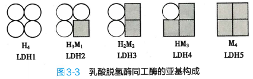
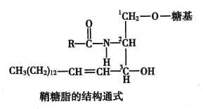
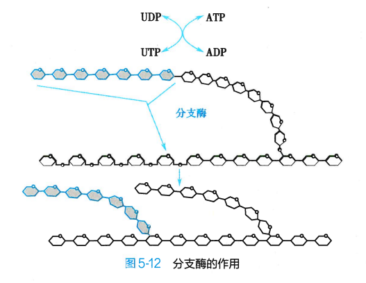
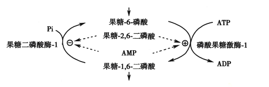
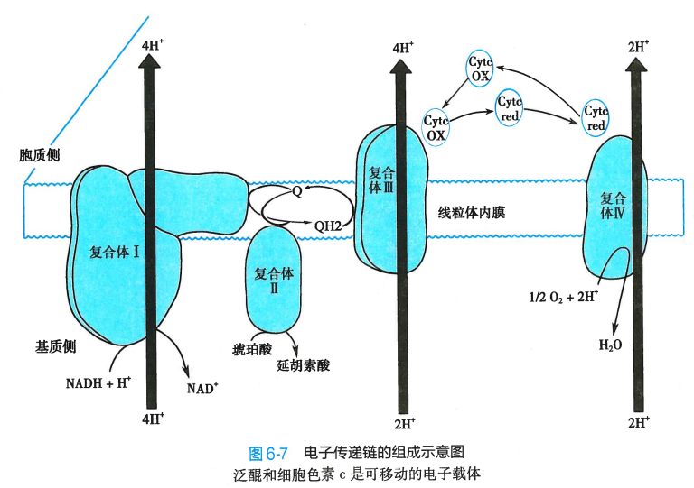
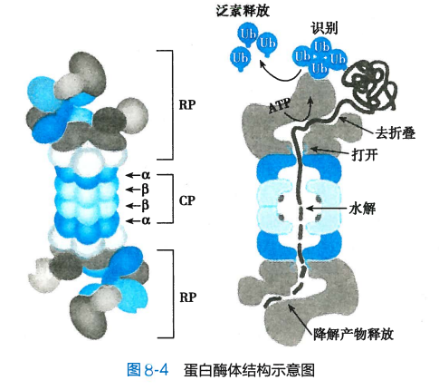
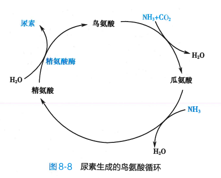

# 生物化学与分子生物学

## 第一章 蛋白质的结构与功能

### 蛋白质的分子组成

#### L-α 氨基酸使蛋白质的基本结构单位

参与蛋白质合成的氨基酸一般有 20 种，通常是 L-α-氨基酸（出甘氨酸外），以及硒代半胱氨酸某些情况也可以用于蛋白质合成

连在——COO-基上的碳原子称为 α-碳原子

#### 蛋白质可根据其侧脸结构和理化性质进行分类

可分为以下五类：

- 非极性脂肪族氨基酸
- 极性中性氨基酸
- 芳香族氨基酸
- 酸性氨基酸
- 碱性氨基酸

分类标准为侧链基团的性质，如果侧链 R 为非极性，则为非极性脂肪族氨基酸；如果含有极性官能团（如-OH）、极性原子（如 N、S），但不含电荷，则为极性中性氨基酸；如果含有苯环则为芳香族氨基酸；如果含有——COO-则为酸性氨基酸；如果含有——NH2+则为碱性氨基酸

上述氨基酸中：

- 非极性脂肪族氨基酸在水溶液中的溶解度小于极性中性氨基酸（因为水分子也是极性的）
- 芳香族氨基酸中，苯基疏水性强，酚基(OH-苯)和吲哚基(CN+苯成环)一定条件可解离
- 酸性氨基酸侧链都含羧基
- 碱性氨基酸侧链含氨基（赖氨酸）、胍基（-N-CNN，精氨酸）、咪唑基（C3N2 成环，组氨酸）

此外半胱氨酸相对特殊，两个半胱氨酸脱氢后以二硫键相连形成蛋白质

#### 蛋白质分子共同或特异的理化性质

##### 两性解离

因为所有的氨基酸都带有碱性的 α-氨基和酸性的 α-羧基，因此既可以与含有 H+的酸反应，又可以与带 OH-的碱溶液反应。

当与 H+结合的趋势与失去 H+与 OH-结合的趋势相同时，呈电中性，此时溶液的 pH 值称为等电点 pI，其计算公式为

$$
pI=\frac{1}{2}(pK_1+pK_2)
$$

其中 pK1 和 pK2 分别为与酸和与碱反应的电离平衡常数的**负对数（与 pH 值的计算类似都是平衡常数取负对数）**

##### 共轭双键可吸收紫外光

含有共轭双键（共轭双键主要存在与苯环中，所以三个芳香族氨基酸都有此性质）的色氨酸、酪氨酸最大吸收峰在 280nm 附近，**这常用于分析溶液中的蛋白质含量**，因为大多数蛋白质都含有色氨酸和酪氨酸的残基

##### 与茚三酮反应生成蓝紫色化合物

茚三酮反应：茚三酮水合物+氨基酸（弱酸性环境共热）-> 蓝紫色化合物

其中氨基酸被氧化托脱氨脱羧，茚三酮被还原，还原产物与氨基酸分解出的氨结合，再与另一分子茚三酮结合生成蓝紫色化合物。即相当于氨基酸分解出的氨与两分子茚三酮结合

最大吸收峰为 570nm，吸收峰大小与氨基酸释放出的氨量成正比，因此可作为**氨基酸定量分析的方法**

#### 氨基酸通过肽键连接形成蛋白质或肽

两个氨基酸，其中一个的 α-羧基和另一个的 α-氨基脱去一分子水可形成肽键

多肽链两端，一端存在一个游离的羧基，称为羧基末端或 C-端；另一端存在一个游离的氨基，称为氨基末端或 N 端

肽链中的氨基酸分子由于脱水缩合而基团不全，称为氨基酸残基

#### 生物肽具有生理活性及多样性

##### 谷胱甘肽

谷胱甘肽 = 谷氨酸 + 半胱氨酸 + 甘氨酸

主要由其中巯基发挥作用：

1. 巯基具有还原性，可作为还原剂保护酶和蛋白质中的巯基不被氧化
2. 巯基具有嗜核特性，可与外源嗜电子毒物结合将其阻断

##### 多肽类激素及神经肽体

多肽类激素：催产素、促肾上腺皮质激素、促甲状腺激素释放激素等都是多肽

神经肽：在神经传导过程中起信号转导作用的肽类，例如脑啡肽、内啡肽、抢匪太等，与痛觉抑制有关，常用于镇痛

### 蛋白质的分子结构

蛋白质的分子结构可以分为四个层次：一级、二级、三级、四级，后三者同城高级结构或空间构想。只有一条肽链的蛋白质只有前三级，两条及两条以上肽链形成的蛋白质才有四级结构

#### 一级结构：氨基酸排列顺序

**从 N 端至 C 端的氨基酸排列顺序** 称为蛋白质的一级结构

标号时，从 N 端开始的第一个氨基酸标号为 1，然后向 C 端依次向后标号

#### 二级结构：主链构象

二级结构是肽链主链股价原子的相对空间位置

肽链主链骨架原子即 N、α-碳原子（中心碳原子）和羰基碳原子，不涉及侧链。二级结构主要包括 α-螺旋、β-转角和 Ω 环。并且一个蛋白质分子还可以含有多种二级结构或多个同种二级结构

##### 参与肽键形成的 6 个原子在同一平面上

参议肽键形成的 6 个原子：$C_{\alpha1}, C,O,N,H,C_{\alpha2}$ 在同一平面上，这 6 个原子形成了肽单元

肽键的 C-N 与 C—N 单键键长不同，介于单键与双键之间，因此有一定的双键性，不可旋转

但是 $C_{\alpha}$ 分别与 N 和 C 相连的键都是单键，可以自由旋转。也正是这两个单键自由旋转的角度决定了两个肽单元平面的相对空间位置

##### α-螺旋

α-螺旋是常见的蛋白质二级结构：多肽链的主链围绕中心轴作有规律的螺旋式上升，螺旋走向为顺时针（右手螺旋）

在蛋白质表面的 α-螺旋常有两性特点，即 3-4 个氨基酸组成的亲水肽段和疏水肽段依次出现，使 α-螺旋的一侧亲水一侧疏水，使其能在极性或非极性环境中存在

多条 α-螺旋的肽链可以缠绕起来形成缆索，增强机械强度（弹性）

##### β-折叠

β-折叠呈折纸状，以每个肽单元的 $C_{\alpha}$ 为转折点（肽单元顺序依次为$C*{\alpha1},C,O,N,H,C*{\alpha2} $ ）依次折叠成锯齿状结构，侧链在上下方。

锯齿状结构一般较短，只含 5-8 个氨基酸残基

多个锯齿状结构可以平行排列或反平行排列，肽段之间通过羰基氧和氨基氢形成的氢键相连。

##### β-转角和 Ω 环

β 转角和 Ω 环出现在**球状蛋白质**中

β 转角发生在肽链进行 180° 回折时的转角上。β 转角一般由四个氨基酸残基构成，第一个氨基酸的羰基氧和第四个残基的氨基氢形成氢键

β 转角分为 Ⅰ 型和 Ⅱ 型

Ω 环总是出现在球状蛋白质表面，以亲水残基为主

##### 侧链对二级结构的影响

侧链的性质会影响二级结构的形成，例如一段肽链的氨基酸残基的侧链适合形成 α 螺旋或 β 折叠，就会出现对应的二级结构

#### 三级结构：全部氨基酸残基相对位置

三级结构是整条肽链所有原子在三维空间的排布位置

三级结构形成和稳定主要依靠次级键如：

- 疏水键
- 盐键
- 范德华力
- ……

结构模体：结构模体是蛋白质分子中具有特定空间构象和特定功能的结构成分，由 2 个或 2 个以上二级结构肽段组成

结构域：蛋白质折叠成的**结构较为紧密且稳定**的区域。含有多个结构域的蛋白质在水解后，会生成多个单独的结构域，而每个结构域的构象基本不变

#### 四级结构：亚基结构

亚基：每条多肽链都有完整的三级结构，称为亚基

蛋白质中各个亚基的空间排布及布局和相互作用，称为四级结构

#### 蛋白质分类

按组成成分分类：

- 单纯蛋白质：只含氨基酸
- 结合蛋白质：氨基酸 + 辅基（非蛋白质部分），绝大多数辅基与蛋白质部分通过**共价键**相连

按形状分类：

- 纤维状蛋白质：多为结构蛋白质，难溶于水，多作细胞支架
- 球状蛋白质：多数可溶于水

### 蛋白质结构与功能的关系

#### 蛋白质主要功能

1. 构成细胞核生物体结构：组织、器官、细胞
2. 物质运输：血红蛋白、载脂蛋白、清蛋白……
3. 催化功能：酶
4. 信息交流：受体
5. 免疫功能：抗体、淋巴因子
6. 氧化供能：蛋白质可彻底氧化水解供能
7. 维持机体酸碱平衡：蛋白质缓冲体系
8. 维持正常的血浆渗透压：清蛋白

#### 蛋白质执行功能主要方式

1. 蛋白质与小分子相互作用：酶催化作用、物质转运、信息传递等
2. 蛋白质与核酸相互作用：蛋白质合成、细胞发育调控等
3. 蛋白质相互作用是蛋白质执行功能的**主要方式**
   1. 主要组织相容性复合物参与分子识别
   2. 抗原与抗体特异性结合

#### 蛋白质一级结构是高级结构核功能的基础

一级结构是空间构象的基础：只要一级结构（氨基酸序列）未被破坏，就有可能恢复到原来的三级结构，功能依然存在

一级结构（氨基酸序列）相似的蛋白质，其空间构象和功能也相似

一级结构也与生物进化有关：物种越接近，一级结构越相似，空间构象与功能也相似

重要蛋白质的氨基酸序列改变可引起疾病：镰状细胞贫血

#### 蛋白质功能依赖特定空间结构

空间构象多与生理功能密切相关

e.g. 血红蛋白亚基 Hb 与肌红蛋白 Mb 结构相似，一分子血红蛋白 Hb 可结合四分子氧。

血红蛋白亚基构象变化可影响亚基与氧结合：

- 协同效应：一个亚基与配体结合后能影响另一亚基与配体的结合能力
  - 促进：正协同作用
  - 抑制：负协同作用
- 别构效应：一个氧分子与 Hb 亚基结合后引起其他亚基构象变化的现象，氧分子称为别构剂，Hb 称为别构分子

蛋白质构象变化可引起疾病：阿尔兹海默、疯牛病

### 蛋白质的理化性质

#### 两性电离性质

除分子两端的氨基和羧基可解离，侧链中某些基团也可解离

等电点：蛋白质解离成正、负离子的趋势相同，此时溶液的 pH 值

为什么当蛋白质颗粒的 pH 值大于等电点，OH-多，与蛋白质分子中的 H+结合，蛋白质颗粒带负电荷；小于等电点，H+多，与蛋白质分子中的负电基团结合，蛋白质颗粒带正电荷

#### 胶体性质

蛋白质溶液为胶体，即蛋白质**不容易从水中析出：**

- 水化膜：蛋白质颗粒表面多为亲水基团可吸水形成水化膜，阻断蛋白质颗粒相互聚集
- 蛋白质胶粒表面电荷也可稳定胶粒

#### 变性与复性

在物理和化学因素作用下，蛋白质特定空间构象被破坏，其理化性质及生物学性质发生变化，叫变性。

变性因素：加热、乙醇、强酸、强碱、重金属离子

蛋白质恢复或部分恢复原有构象和功能，称为复性

#### 特征性光吸收

蛋白质中含有共轭双键，280nm 有特征性吸收峰

#### 蛋白质显色反应

1. 茚三酮反应：蛋白质水解后的氨基酸可发生茚三酮反应，生成蓝紫色化合物
2. 双缩脲反应：蛋白质在弱碱溶液中与硫酸铜共热，出现紫红色反应

## 第二章 核酸的结构与功能

### 核酸的化学组成与一级结构

DNA 的基本组成单位是**脱氧核糖核苷酸**，RNA 的基本组成单位是**核糖核苷酸**

核苷酸由**碱基、戊糖和磷酸**组成

#### 核苷酸和脱氧核苷酸是构成核酸的基本组成单位

**碱基**，可分为嘌呤和嘧啶两类：

- 嘌呤：腺嘌呤 A、鸟嘌呤 G
- 嘧啶：尿嘧啶 U、胸腺嘧啶 T、胞嘧啶 C

DNA 碱基：AGCT；RNA 碱基：AGCU

**核糖**：5 碳糖，脱氧核糖存在 DNA 中，核糖存在 RNA 中，脱氧核糖的化学稳定性优于核糖

**核苷**：碱基与核糖的缩合反应产物，**C-1'原子**与碱基形成糖苷键相连，核糖与碱基处在反式构象

**脱氧核苷**：同理，碱基与脱氧核糖缩合的产物

核苷酸：核苷或脱氧核苷 C-5'的羧基与磷酸反应，脱水形成磷脂键，脱水缩合成核苷酸

含有不同数量磷酸基团的核苷酸分别称为核苷一/二/三磷酸。核苷三磷酸的三个磷原子分别命名为 α，β，γ 磷原子

#### 3',5'-磷酸二脂键

多个脱氧核糖核苷酸通过 3', 5'-磷酸二脂键共价相连

DNA 链一端是 C-5'上的磷酸基团，另一端是 C-3'上的羟基，分别称为 5'-端和 3'-端

C-3'端的羟基可以和可以和游离脱氧核苷三磷酸的 α-磷酸基团反应生成新的 3',5'-磷酸二脂键

因为 DNA 链只能从 3'端延长，所以有方向性 5'端到 3'端

RNA 也是多个核苷酸分子在 RNA 聚合酶催化下通过 3',5'-磷酸二脂键连接形成大分子，也有 5'端到 3'端的方向性。

RNA 与 DNA 的差别在于：

1. RNA 的戊糖环是核糖而不是脱氧核糖
2. RNA 的嘧啶是 C、U，一般没有 T。因此构成 RNA 的四种基本核苷酸是 AMP、GMP、CMP、UMP

#### 核酸的一级结构是核苷酸排列顺序

核酸的一级结构：DNA/RNA 从**5'-端到 3'-端**的脱氧核苷酸/核苷酸排列顺序。因为核苷酸的差异仅在于碱基（戊糖和磷酸均相同），所以一级结构也是**碱基序列**

### DNA 的空间结构与功能

DNA 的空间结构可分为二级结构和高级结构

#### DNA 的二级结构是双螺旋结构

DNA 双螺旋结构特征：

1. DNA 由两条多聚脱氧核苷酸链组成，反向平行（一条 5'-3'自上而下，一条 5'-3'自下而上）
2. 两条链之间形成**碱基互补配对**：C 与 G 之间形成**三条氢键**；A 和 T 之间形成**两条氢键**
3. 两条链的亲水骨架将互补碱基对包裹在内：亲水性骨架包裹疏水性碱基，形成小沟与大沟
4. 两个碱基对平面重叠产生**碱基堆积作用**：碱基堆积作用与氢键共同维持双螺旋结构稳定

#### DNA 双链经过盘绕折叠形成致密的高级结构

DNA 双链需要形成超螺旋结构保持稳定

##### 封闭环状 DNA

绝大多数原核生物的 DNA 为环状双螺旋分子，盘绕后生成超螺旋

叶绿体和线粒体是真核细胞中含有核外遗传物质的细胞器，线粒体 DNA 也有封闭环状的双螺旋结构

##### 真核生物 DNA 逐级组装成高级结构

染色体为串珠样结构，基本组成单位是**核小体**

盘绕压缩过程：

1. 第一次折叠：DNA 双链盘绕在组蛋白核心颗粒上，长度缩短 7 倍
2. 第二次折叠：形成染色质纤维中空状螺线管
3. 第三次折叠：超螺旋管，DNA 长度压缩 40 倍
4. 第四次折叠：形成染色单体，核内组装成染色体，长度压缩 5 到 6 倍

真核生物染色体有端粒和着丝粒两个功能区：

- 端粒
  - 染色体端 DNA+DNA 结合蛋白
  - 维持染色体结构稳定
  - 维持复制过程 DNA 完整性
  - 与衰老和肿瘤有关
- 着丝粒
  - 着丝粒可分开使染色体均等有序进入子代细胞

#### DNA 是主要遗传物质

肺炎链球菌体外转化实验：

噬菌体侵染大肠杆菌实验：

结论：DNA 是遗传信息的载体

生物体的遗传信息是以**基因**的形式存在的。

基因组是包含在生物的 DNA 中的全部遗传信息

### RNA 的空间结构与功能

RNA 可分为编码 RNA 和非编码 RNA：

- 编码 RNA：从基因组上转录而来、可翻译蛋白质
  - 仅有 RNA 一种
- 非编码 RNA：不编码蛋白质
  - 组成性非编码 RNA：确保实现生物学功能的 RNA
    - 转运 RNA(tRNA)
    - 核糖体 RNA(rRNA)
    - 端粒 RNA
    - 信号识别颗粒 RNA
  - 调控性非编码 RNA：丰度随外界环境和细胞性状而改变，在基因表达中发挥调控作用

#### mRNA 是蛋白质生物合成的模板

蛋白质合成速度与 RNA 水平有关，即 mRNA

核内线形成 hnRNA，经过转录后修饰与剪接后称为 mRNA

1. 真核生物 mRNA 的 5'端有帽结构：可与帽结合蛋白形成复合体，维持 mRNA 稳定、协助转运到细胞质、促进核糖体与翻译起始因子结合
2. 真核生物与部分原核生物 mRNA 的 3'端有多聚腺苷酸尾结构：3'-多聚(A)尾结构与 5'-帽结构共同负责 mRNA 由核向质转运、维持 mRNA 稳定以及翻译起始调控
3. 真核生物 hnRNA 修饰剪接成为成熟 mRNA：主要修饰过程包括剪切内含子（非编码序列），连接外显子（mRNA 序列片段），加帽加尾
4. mRNA 的核苷酸序列决定蛋白质的氨基酸序列
   1. mRNA 包括 5'-非翻译区、编码区和 3'-非翻译区
   2. 起始密码子 AUG 开始，每三个核苷酸组成一个遗传密码子，每个密码子编码一个氨基酸，直到终止密码子
   3. 非翻译区调控蛋白质合成

#### tRNA 是蛋白质合成中氨基酸的载体

1. tRNA 含有多种稀有碱基：即除 AGCU 外的碱基，稀有碱基均是转录后修饰而成
2. tRNA 由特定空间结构：

   1. 部分核苷酸序列能碱基互补配对形成局部链内双螺旋
   2. 不能配对部分凸出为茎环或发卡结构
   3. 三级结构力是氢键和碱基堆积力
3. tRNA 的 3'-端连接着氨基酸：3'端都连接着 CCA 三个核苷酸，后面连接**要转运的氨基酸（由密码子决定）**

   
4. tRNA 的反密码子能识别 mRNA 的密码子

   

#### rRNA 是核糖体主要成分

rRNA 是细胞中含量最多的 RNA

rRNA 与核糖体蛋白共同构成核糖体，有 5S、16S 和 23S 三种，与不同核糖体蛋白结合分别形成大亚基和小亚基

大小亚基沟槽：mRNA 结合部位

核糖体三个重要部位：

1. A 位：安氨酰位
2. P 位：肽酰位
3. E 位：已卸下氨基酸的 tRNA 的排除为

#### 组成性非编码 RNA 保障遗传信息传递

其他非编码 RNA 参与 RNA 的剪接和修饰、蛋白质转运以及调控基因表达

1. 催化小 RNA：核酶，剪接修饰中有作用
2. 核仁小 RNA：rRNA 加工
3. 核小 RNA：mRNA 成熟
4. 胞质小 RNA：与蛋白质结合成复合体后发挥作用

#### 调控性非编码 RNA 参与基因表达调控

调控性非编码 RNA 按大小可分为：

1. 非编码小 RNA
2. 长非编码 RNA
3. 环状 RNA

### 核酸的理化性质

#### 强烈的紫外吸收

嘌呤与嘧啶含有共轭双键，中性条件下最大吸收值在 260nm 附近

可以根据 260nm 吸光度 $A_{260}$来判断 DNA 或 RNA 含量

可以根据 $A_{260}/A_{280}$的吸光度比值判断提取核酸样品的纯度，DNA 纯品的比值为 1.8，RNA 纯品的比值为 2.0

核酸为多元酸，酸性较强

DNA 与 RNA 为线型分子，溶液粘滞度极大。RNA 长度远小于 DNA，RNA 溶液粘滞度小得多

核酸分子易沉降，且不同构想的核酸分子沉降速率差异大，所以可用超速离心法提取和分离。

#### DNA 变性

极端理化条件可以断裂氢键及破坏碱基堆积力，使双链解离成两条单链

解链后，更多碱基暴露，因此 $A_{260}$会增大，这种现象称为 DNA 的**增色效应**

可以根据 $A_{260}$的变化判断 DNA 双链是否变性

#### 变性核酸复性或杂交

复性：两条解离的 DNA 互补链重新互补配对成 DNA 双链并恢复双螺旋结构

核酸分子杂交：不同种核酸单链碱基互补配对相连

## 第三章 酶与酶促反应

### 酶的分子结构与功能

**单体酶**：一条肽链构成

**寡聚酶**：多条肽链非共价键连接而成

**多酶体系**：多种不同催化功能的酶聚合成一个整体，即多酶复合物

**多功能酶**：一条肽链上有多种催化功能

#### 酶的分子组成中常含有辅因子

酶按分子组成分类：

- **单纯酶**：水解后只有氨基酸
- **缀合酶/结合酶**：蛋白质部分（**酶蛋白**）与非蛋白质部分（**辅因子**）组成，两者结合称为**全酶**

辅因子按与蛋白质结合的紧密程度分类：

- 辅酶：非共价键，较松散
- 辅基：共价键，较紧密

金属离子常作为辅因子：

- 有的酶与金属离子**结合紧密**，称为**金属酶**
- 有的酶与金属离子的**结合是可逆的**，称为**金属激活酶**

#### 酶的活性中心是酶分子执行其催化功能的部位

**酶的活性中心**：能与底物**特异性结合**并**催化**底物转变为产物 的具有**特定三维结构**的区域

与酶活性相关的化学基团称为**必需基团**，包括**结合基团**和**催化基团**

#### 同工酶催化相同的化学反应

同工酶：催化相同的化学反应，但酶蛋白分子结构、理化性质乃至免疫学性质不同的一组酶

e.g. 动物的乳酸脱氢酶 LDH

### 酶的工作原理

#### 酶不同于一般催化剂的显著特点

1. **对底物有极高的催化效率**：能极大降低活化能，催化效率比一般催化剂高 $10^7$ 到 $10^{13}$ 倍
2. **对底物有高度特异性**：酶的专一性
   1. 绝对特异性：只作用于特定结构的底物分子
   2. 相对特异性：不依据整个底物分子结构，而依据特定的化学键或特定的基团
3. **酶具有可调节性**：酶活性与数量可受体内代谢分子或激素的调节
4. **酶具有不稳定性**：极端理化因素作用下会失活

#### 酶通过促进底物形成过渡态提高反应速率

- 酶比一般催化剂更有效地**降低活化能**

- 酶与底物结合形成**中间产物**：结合放能（结合能）以降低活化能
  - **诱导契合作用**：酶和底物接近时，互相诱导、互相变形、互相适应。该作用可以使有相对特异性的酶结合不同的底物分子
  - **邻近效应与定向排列**：多底物反应中，酶使各底物相互接近形成正确定向关系

- **表面效应**：酶活性中心是疏水“口袋”，表面效应使底物分子**去溶剂化**，排除水分子防止水化膜形成，以便底物与酶分子密切接触和结合

酶的催化机制呈现多元催化功能：

- 普通酸-碱催化作用：酶中有些基团作为**质子供体**，有些集团作为**质子受体**，通过**质子转移**提高反应速率
- 共价催化：催化剂与反应物形成共价结合的中间物降低活化能

### 酶促反应动力学（重点）

#### 底物浓度对酶促反应的影响呈矩形双曲线

反应速率$v$，底物浓度$[S]$

矩形双曲线：

1. a 段：一级反应
2. b 段：v 上升速率减缓，一级反应与零级反应混合
3. c 段：v 不再随 S 上升而增加，达到$V_{max}$零级反应

##### 米-曼方程与单底物反应

酶-底物中间复合学说：

1. 酶 E 与底物 S 结合生成酶-底物中间复合物 ES
2. ES 分解生成产物 P 和游离的酶

米-曼方程/米氏方程：

$$
v=\frac{V_{max}[S]}{K_m+[S]}
$$

其中：

- $K_m$为米氏常数
- $V_m$为最大反应速率

当 $[S]$远小于$K_m$时，分母中的 S 可忽略，此时方程化简为

$$
v=\frac{V_{max}}{K_m}[S]
$$

此时速率与底物浓度成正比，即一级反应阶段

反之，当[S]远大于 Km 时，分母中的 Km 可忽略，方程化简为

$$
v=\frac{V_{max}[S]}{[S]}=V_{max}
$$

此时速率与 S 无关，到达最大反应速率，即零级反应

米氏方程的假设/前提：

1. **单底物反应**
2. 反应速率为**初速率**，即反应刚开始时的酶促反应速率
3. [S]远大于[E]时，**底物消耗可忽略不计**

方程推导过程略

##### 参数$K_m$与$V_{max}$

1. $K_m$值等于$v=\frac{1}{2}V_{max}$时的底物浓度[S]，此时方程变为

$$
\frac{V_{max}}{2}=\frac{V_{max}[S]}{K_m+[S]}
$$

两边消去$V_{max}$后可解得

$$
K_m=[S]
$$

2. $K_m$值时酶的特征性常数：该常数与酶/底物结构、温度、pH 等有关，与酶浓度无关
3. $K_m$**可表示酶对底物的亲和力**
4. $V_{max}$是酶被底物完全饱和是的反应速率
5. 酶的转换数：酶被底物完全饱和时（到达$V_{max}$时），单位时间每个酶分子催化底物产生产物的分子数，称为酶的转换数，即$k_3$。已知$V_{max}$与酶总浓度$[E_t]$计算$k_3$如下

$$
k_3=\frac{V_{max}}{[E_t]}
$$

##### 林-贝作图法求$K_m$和$V_{max}$

也称为双倒数作图法，对米氏方程两边求倒数：

$$
\frac{1}{v}=\frac{K_m}{V_{max}}\cdot\frac{1}{[S]}+\frac{1}{V_{max}}
$$

以$\frac{1}{v}$为纵轴，以$\frac{1}{[S]}$为横轴作图，此时：

- 纵轴上截距为$\frac{1}{V_{max}}$
- 横轴上截距为$-\frac{1}{K_m}$

#### 底物充足时酶浓度对速率影响呈直线关系

[S]远大于[E]时，v 与[E]呈正比关系

#### 温度对酶促反应速率的影响有双重性

温度升高，分子热运动加快，碰撞机会增加，提高酶促反应速率

温度超过临界值，酶变形，速率下降

#### pH 通过改变酶分子及底物分子解离状态影响速率

酶分子中的众多极性基团在不同 pH 下解离状态不同

通过改变 pH 使酶处在特定解离状态，改变与底物的**亲和力**

同时 pH 也可以**改变酶活性中心的构象影响活性**

#### 抑制剂可降低酶促反应速率

酶的抑制剂：使酶活性下降又不引起酶蛋白变性的物质

##### 不可逆性抑制剂

与酶活性中心的必需基团**共价结合**使酶失活

##### 可逆性抑制剂

可逆性抑制剂：与酶**非共价结合**

1. **竞争性抑制剂**：结构与底物相似，与底物竞争结合酶的活性中心，阻碍酶与底物形成中间产物。抑制剂与酶的结合是可逆的

   
2. **非竞争性结合剂**：不影响酶和底物结合，但与其他位点结合抑制中间产物形成

   
3. **反竞争性抑制剂**：同样与其他点位结合，但只有在酶与底物结合后才能与酶-底物复合物结合发挥抑制作用

#### 激活剂可提高酶促反应速率

酶的激活剂：使酶从无活性变为有活性或使酶活性增加的物质，大多数为金属离子

大多数金属离子使酶的必需激活剂，如果没有则检测不到酶活性

### 酶的调节

#### 酶活性的调节

酶活性的调节是对酶促反应速率的**快速调节**

细胞对酶活性的调节包括**酶的别构调节**和**酶的化学修饰调节**

1. 别构调节：一些代谢物与酶活性中心外的部位非共价可逆结合，引起构象变化，改变酶活性

   1. 受调节的酶称为别构酶
   2. 引起别构效应的物质称为别构效应剂
   3. 别构酶中也存在正/负协同效应

   
2. 化学修饰调节：酶肽链与某些化学基团共价结合/去掉已结合的化学基团。最经典的离子就是磷酸化和去磷酸化（蛋白激酶催化）

3. 酶原需要通过激活才能转变为有活性的酶
   1. 部分酶初期无活性，这些酶前体称为**酶原**
   2. 酶原经蛋白酶水解去除几个肽段后，构象改变表现出活性
   3. 实际上是酶的活性中心暴露的过程

#### 酶含量的调节

酶含量的调节是对酶促反应速率的**缓慢调节**

1. 酶蛋白的合成可被诱导或阻遏

某些物质可在**转录水平**影响酶蛋白的生物合成：

- 促进酶合成的物质称为**诱导物，**诱发蛋白合成的作用称为**诱导作用**
- 减少酶合成的物质称为**辅阻遏物**，辅阻遏物与无活性的阻遏蛋白结合和影响转录，称为**阻遏作用**

2. 酶的降解与一般蛋白质降解途径相同
   1. 溶酶体途径：非ATP依赖途径，组织蛋白酶催化分解
   2. 胞质途径：ATP依赖，泛素介导

## 第四章 聚糖的结构与功能

### 糖蛋白分子中聚糖及其合成过程

复合糖类：糖基分子与蛋白质或脂以共价键连接形成的大分子

聚糖：单糖通过糖苷键聚合而成的寡糖或多糖

糖蛋白与蛋白聚糖均由共价连接的蛋白质和聚糖两部分组成

糖蛋白：糖类分子与蛋白质分子共价结合形成的蛋白质，根据聚糖与蛋白质的连接方式可分为：

- N-连接型聚糖
- O-连接型聚糖

#### N-连接型糖蛋白

糖基化：非糖生物分子与糖形成共价结合的反应

并非糖蛋白中所有天冬酰胺残基都可连接聚糖，只有特定的点位才能结合，这个点位就是**糖基化点位Asn-X-Ser/Thr**

根据结构可将N-连接型聚糖分为三类：

- 高甘露糖型：核心五碳连接了9个甘露糖Man
- 复杂型：多分支如天线
- 杂合型：兼具上述两者结构

N-连接型聚糖合成是以**长萜醇**为**聚糖载体：**

1. 长萜醇在糖基转移酶作用下得到GlcNAc
2. 然后在长萜醇上逐个加上糖基
3. 含有14个糖基后被转移至肽链的糖基化位点结合
4. 然后聚糖链依次在内质网和高尔基体加工

#### O-连接型聚糖

O-连接型聚糖的合成不需要聚糖载体

O-连接型聚糖的合成是在多肽链合成后进行，先形成O-连接，然后逐个加上糖基形成聚糖

整个过程从内质网开始，到高尔基体结束

#### $\beta$-N-乙酰葡糖胺

蛋白质糖基化除了上述两种外还包括β-N-乙酰葡糖胺的单糖基修饰(O-GlcNAc,OGT)

这种修饰与N-连接型和O-连接型不同，不再内膜系统（内质网、高尔基体等）进行，主要在细胞质或胞核中

OGT修饰可以用特异性酶解离，因此是可逆的

糖基化后会使蛋白质肽链构象改变，影响功能

#### 聚糖对蛋白质的影响

糖蛋白中聚糖不仅能影响蛋白的构象、聚合、溶解及降解，还能参与识别、结合等：

1. 聚糖可稳固多肽链的结构、延长半寿期
2. 聚糖参与糖蛋白新生肽链的折叠或聚合：糖蛋白起识别、定位功能，帮助精准折叠
3. 聚糖可影响糖蛋白在细胞内的靶向运输：溶酶体酶合成需要聚糖帮助信号识别、定向运输
4. 聚糖参与分子间相互识别：作为受体

### 蛋白聚糖分子中的糖胺聚糖

**蛋白聚糖**：由**糖胺聚糖(GAG)**共价连接不同**核心蛋白质**形成的**糖复合体**

糖胺聚糖：由二糖单位重复连接而成的杂多糖，不分支

#### 糖胺聚糖

**糖胺聚糖**是由**己糖醛酸**和**己糖胺**组成的**重复二糖单位**

#### 核心蛋白质

**核心蛋白质**：与糖胺聚糖共价结合的蛋白质

核心蛋白质均含有结合糖胺聚糖的结合域，用于结合糖胺聚糖

#### 蛋白聚糖

蛋白聚糖合成过程如下：

1. 先在内质网上合成核心蛋白质的多肽链
2. 合成多肽链同时以N-连接或N-连接进行聚糖加工
3. 在高尔基体上进行聚糖延长和加工，加工过程是在多肽链上逐个加上单糖而不是先合成二糖单位

蛋白聚糖的功能：

1. 最主要功能：构成细胞间的基质
2. 特殊功能：抗凝剂等

### 糖脂

糖脂可分为：鞘糖脂、甘油糖脂、类固醇衍生糖脂组成

#### 鞘糖脂

鞘糖脂是神经酰胺被糖基化的糖苷化合物

神经酰胺的1-位羟基被糖基化，形成糖苷化合物，其通式如下：

而鞘糖脂又可根据分子中是否含有唾液酸或硫酸基分为：

- 中性鞘糖脂：脑苷脂
- 酸性鞘糖脂：硫苷脂（鞘糖脂的糖基部分被硫酸化）、神经节苷脂（糖基部分含有唾液酸的鞘糖脂）

#### 甘油糖脂

髓磷脂：包围在神经元轴突外的脂质

甘油糖脂则是髓磷脂的重要成分

### 聚糖中蕴藏大量生物信息

聚糖组分是糖蛋白执行功能所必须：聚糖或多糖的合成不像核酸、蛋白质有模板指导

糖基序列或不同糖苷键的形成主要取决于：**糖基转移酶的特异性识别糖底物和催化作用**

在糖基转移酶催化下有序形成聚糖结构，而糖基转移酶又是由**基因编码**，符合基因到蛋白质的生物信息流向

结构多样性的聚糖富含生物信息：

1. 聚糖的空间结构多样性是其携带信息的基础
2. 聚糖空间结构多样性受基因编码的糖基转移酶和糖苷酶调控

## 第五章 糖代谢

### 糖的摄取与利用

糖被消化成单糖后才能在小肠被吸收

小肠粘膜细胞上的载体可以通过**伴有Na+转运的主动转运**摄入葡萄糖，这种载体称为Na+依赖型葡糖转运蛋白

在体内，葡萄糖的代谢射击分解、存储、合成三方面：

- 分解
  - 无氧氧化
  - 有氧氧化
  - 磷酸戊糖途径
- 存储
  - 糖原形式存储在肝和肌组织中
- 合成
  - 饥饿时使非糖物质转变为葡萄糖供能

### 糖的无氧氧化

#### 无氧氧化两个阶段

葡萄糖的无氧氧化**全部在细胞质中进行**，分为两个阶段：

1. 糖酵解：葡萄糖被分解为两分子丙酮酸
2. 乳酸合成：乳酸脱氢酶LDH催化丙酮酸还原成乳酸，还原所需H+来自NADH

在糖酵解的10步反应中，有3个反应是不可逆的，这3个反应速率最慢，是控制糖酵解反应速度的限速步骤：

1. **磷酸果糖激酶-1** 对调节糖酵解速率**最重要**：该酶主要受别构作用以及化学修饰的方式影响活性
2. **丙酮酸激酶**是糖酵解的第二个重要调节点：同样可以通过别构作用和化学修饰（磷酸化、激素）调节
3. 己糖激酶受反馈抑制调节：受其产物葡糖-6-磷酸的反馈抑制

糖酵解是葡萄糖分解供能的起始阶段，能量消耗多时，磷酸果糖激酶-1和丙酮酸激酶被激活，葡萄糖分解加快

反之血糖高时糖酵解分解的葡萄糖就减少

#### 糖的无氧氧化为机体快速供能

无氧氧化最主要的生理意义就是：**不利用氧迅速提供能量**，对肌收缩很重要

肌细胞储存的ATP较少，因此运动时常需要无氧氧化提供ATP

另外在成熟红细胞等不含线粒体的细胞中也主要靠无氧氧化糖供能

1 mol葡萄糖无氧氧化净得到2 mol ATP

#### 其他单糖可转变为糖酵解的中间产物

其他己糖，如果糖、半乳糖、甘露糖等，可以转变为糖酵解的中间产物，进入糖酵解过程提供能量

### 糖的有氧氧化

有氧氧化：将葡萄糖彻底氧化分解为CO2和H2O的过程

#### 有氧氧化三阶段

有氧氧化分为三个阶段：

1. 葡萄糖在细胞质经糖酵解生成丙酮酸
2. 丙酮酸进入线粒体氧化脱羧生成乙酰CoA
3. 乙酰CoA进入三羧酸循环，并偶联进行氧化磷酸化

第一步：葡萄糖在细胞质经糖酵解生成丙酮酸，同无氧氧化

第二步：丙酮酸在线粒体氧化脱羧生成乙酰CoA，总反应式如下：

$$
丙酮酸+NAD^++HS-CoA \ce{->}乙酰CoA+NADH+H^++CO_2
$$

第三步：乙酰CoA经三羧酸循环和氧化磷酸化提供能量

循环过程：

1. 乙酰CoA与草酰乙酸缩合生成柠檬酸
2. 柠檬酸经一系列反应重新生成草酰乙酸

每经过1轮循环：

- 发生2次脱羧，释放2分子CO2
- 发生1次磷酸化，生成1分子ATP
- **四次脱氢，生成**
  - 3分子NADH+H+
  - 一分子FADH2
- 最后电子经电子传递链传递至氧生成水，并逐步释放能量

#### 三羧酸循环

三羧酸循环分为8步，总反应为

$$
\begin{align}
CH_3CO\sim SCoA+3NAD^++FAD+GDP(ADP)+P2+2H_2O\\\ce{->}2CO_2+3NADH+3H^++FADH_2+HS-CoA+GTP(ATP)
\end{align}
$$

每一次三羧酸循环：

- 消耗1分子乙酰CoA(2个碳原子)，释放2个CO2，但两个碳原子来自草酰乙酸
- 中间产物无量的变化

三羧酸循环在三大营养物质代谢中占核心地位：

1. 糖、脂肪、氨基酸都分解为乙酰CoA进入三羧酸循环
2. 三大营养物质可以三羧酸循环为**枢纽**相互转变

#### 糖的有氧氧化是产能的主要途径

1mol葡萄糖彻底氧化，可净生成30或32mol ATP，总反应：

$$
葡萄糖+30/32ADP+30/32Pi+6O_2\ce{->}30/32ATP+6CO_2+36H_2O
$$

#### 糖的有氧氧化的调节

丙酮酸在三羧酸循环代谢的速率受**两个阶段酶**的调节：

1. 丙酮酸脱氢酶复合体的活性
   1. 别构调节
      1. 能量状态：ATP别构抑制，AMP别构激活，ATP/AMP值大小
      2. 代谢产物的量：反应产物别构抑制，反应底物激活酶活性
   2. 可逆化学修饰
      1. 磷酸化失活，去磷酸化恢复活性
      2. NADH和乙酰CoA除了别构抑制，还能激活丙酮酸脱氢酶激酶，使复合体失活
2. 三羧酸循环关键酶
   1. 三羧酸循环中有3步不可逆反应，其酶控制速率
   2. 底物别构激活
   3. 产物别构抑制
   4. 能量状态：ATP别构抑制，ADP别构激活
   5. Ca2+激活作用：线粒体内Ca2+浓度升高增强酶活性

事实上，有氧氧化各阶段相互协调，主要原因是**多种关键酶可别相同的别构剂调节**，这些共同的别构剂包括两大类：

- **共同代谢物别构调节**：产物别构激活，底物别构抑制
- **能量状态协同调节**：ATP/AMP值（因为ATP与ADP总同时减少因此ATP/ADP变化不明显）

#### 糖氧化产能方式的选择有组织偏好

线粒体选择有氧或无氧氧化取决于不同类型组织

- 肌组织：有氧时，有氧氧化活跃，无氧抑制：巴斯德效应
- 肿瘤：有氧时也不彻底氧化，而分解为乳酸：瓦伯格效应

### 磷酸戊糖途径

磷酸戊糖途径是糖酵解途径的旁路，通过氧化、集团转移两个阶段再返回糖酵解途径

磷酸戊糖途径不产生ATP，但生成**NADPH**和**磷酸核糖**

#### 磷酸戊糖途径的两个阶段

第一阶段：氧化阶段

1分子葡糖-6-磷酸生成**2分子NADPH**和**1分子核糖-5-磷酸**，释放1分子CO2

$$
葡糖-6-磷酸\ce{->}2NADPH+核糖-5-磷酸+CO_2
$$

第二阶段：基团转移阶段

$$
\begin{align}3\times葡糖-6-磷酸+6NADP^+\ce{->}2\times果糖-6-磷酸+3-磷酸甘油醛+6NADPH+6H^++3CO_2\end{align}
$$

#### 磷酸戊糖途径的调节

葡糖-6-磷酸脱氢酶的活性决定葡糖-6-磷酸进入此途径的含量

NADPH可抑制葡糖-6-磷酸脱氢酶

因此磷酸戊糖途径主要受NADPH/NADP+比值的调节：

- 比值高时，葡糖-6-磷酸脱氢酶活性低，磷酸戊糖途径被抑制
- 反之则激活

因此磷酸戊糖途径的流量取决于NADPH的需求，负反馈调节

#### 磷酸戊糖途径时NADPH和磷酸核糖的主要来源

1. 提供磷酸核糖参与核酸的生物合成
2. 提供NADPH作为供氢体参与多种代谢反应：NADH携带的H经电子传递链氧化供能，而NADPH的H参与代谢反应
   1. 合成代谢：脂质合成涉及还原；氨基酸合成等
   2. 烃化反应
   3. 维持谷胱甘肽的还原状态

### 糖原的合成与分解

糖类大部分转变为脂肪，少部分合成糖原

糖原储存在肝和肌细胞中：

- 肝糖原：血糖重要来源
- 肌糖原：为肌收缩提供急需能量

糖原是葡萄糖多聚体，分枝状，有一个还原性末端和多个非还原性末端。合成与分解时，增减均发生在非还原性末端

#### 糖原合成

糖原合成时，葡萄糖需要先活化，再连接形成直链和支链

1. 葡糖-6-磷酸转换成葡糖-1-磷酸，后者活化生成尿苷二磷酸葡萄糖(UDPG)，即“活性葡萄糖”

2. **糖原蛋白**与UDPG的葡萄糖基结合，延伸到八糖时称为糖原合成的**初始引物**
3. 糖原合酶将UDPG的葡萄糖基转移到糖原引物非还原性末端
4. 糖链长达11葡萄糖基时，分支酶将非还原性末端的部分葡萄糖基转移到临近糖链形成分支
   1. 分支可增加糖原水解性
   2. 更重要的时增加非还原性末端数量，便于糖原迅速分解
5. 糖原分子每延长1葡萄糖基，消耗2ATP

#### 糖原分解

糖原分解时指糖原被分解为葡糖-1-磷酸，不是合成的逆反应

1. **糖原磷酸化酶**分解α-啊，4-糖苷键释放葡糖-1-磷酸
   1. α-1，4-糖苷键逐个分解，糖链不断缩短
2. **脱支酶**分解α-1,6-糖苷键释放出游离葡萄糖
   1. 缩短至离分支点4个葡萄糖基时，葡聚糖转移酶催化3个葡萄糖基转移到邻近分支末端
   2. 分支剩下的1个葡萄糖水解成游离葡萄糖

3. 肝糖原和肌糖原分解糖原都释放**葡糖-1-磷酸**，然后转换为**葡糖-6-磷酸**
   1. 肝中的**葡糖-6-磷酸酶**可将葡糖-6-磷酸水解成葡萄糖释放进血液
   2. 肌细胞不含此酶，只能进行**糖酵解**

#### 糖原合成与分解的调节

糖原合成和分解相互制约，一个活跃则另一个被抑制

糖原合酶：糖原合成关键酶

糖原磷酸化酶：分解关键酶

1. **磷酸化修饰**对两种关键酶效果相反
   1. 糖原磷酸化酶被激活
   2. 糖原合酶被抑制
2. **激素**反向调节糖原的合成分解
   1. **胰高血糖素**促进**肝糖原分解**
   2. **肾上腺素**促进**肌糖原分解**
   3. **胰岛素**促进**糖原合成**
3. 别构剂调节肝糖原和肌糖原分解
   1. **葡萄糖别构抑制肝糖原磷酸化酶**：血糖升高抑制肝糖原分解
   2. **能量和Ca2+别构调节肌糖原分解：**
      1. 能量缺乏，AMP多，激活糖原磷酸化酶，促进肌糖原分解；能量充足，ATP、葡糖-6-磷酸多，抑制肌糖原分解
      2. Ca2+增多能激活磷酸化酶，促进糖原分解

### 糖异生

糖异生：非糖化合物转变为葡萄糖或糖原的过程

主要器官：肝

#### 糖异生过程

丙酮酸能逆着糖酵解方向生成葡萄糖、乳酸等，但不完全是糖酵解的逆反应

糖酵解和丙酮酸多数反应可逆，但三个限速步骤的逆反应需要关键酶催化

糖酵解最后一步反应的逆反应，丙酮酸羧化支路：

1. **丙酮酸**在**丙酮酸羧化酶**催化下，消耗ATP与CO2结合生成**草酰乙酸**
2. **草酰乙酸**在**磷酸烯醇式丙酮酸羧激酶**催化下，消耗一个ATP脱羧转变为**磷酸烯醇式丙酮酸**

草酰乙酸有两种方式从线粒体转运到细胞质：

1. 经**苹果酸**转运：**线粒体内的苹果酸脱氢酶**催化**草酰乙酸**还原成**苹果酸**，运出线粒体后，经细胞质种的苹果酸脱氢酶催化氧化苹果酸为草酰乙酸。此过程同时**伴随NADH从线粒体到细胞质的转运**
2. 经**天冬氨酸**转运：线粒体内**谷草转氨酶**催化**草酰乙酸**转变成**天冬氨酸**，运出线粒体后，细胞质种的谷草转氨酶催化天冬氨酸再恢复成草酰乙酸，**不伴随NADH的转运**

具体使用哪一种方式，取决于原料对供氢体的需求：

- 如乳酸后续所需的还原氢来自细胞质中的NADH，无需从线粒体转运NADH，所以使用天冬氨酸方式
- 丙酮酸所需的NADH必须由线粒体提供，所以使用苹果酸方式

随后两个限速反应和关键酶分别如下：

果糖-1,6-二磷酸水解为果糖-6-磷酸，由果糖二磷酸酶-1催化

葡糖-6-磷酸水解为葡萄糖，由葡糖-6-磷酸酶催化

综上，糖异生的4个关键酶为：

- 丙酮酸羧化酶（线粒体内将丙酮酸转变为草酰乙酸）
- 磷酸烯醇式丙酮酸羧激酶（线粒体外将草酰乙酸转变为磷酸烯醇式丙酮酸）
- 果糖二磷酸酶-1（将果糖-1,6-二磷酸水解为果糖-6-磷酸）
- 葡糖-6-磷酸酶（将葡糖-6-磷酸水解为葡萄糖）

完整的丙酮酸糖异生途径如下：

#### 糖异生和糖酵解的反向调节

底物循环：不同的酶催化底物互变，称为**底物循环**

糖酵解和糖异生是方向相反的两条代谢途径，如果两种酶活性相同，则代谢不会向任何一个方向推进。要进行有效糖异生，就要抑制糖酵解

通常糖异生与糖酵解的反向调节主要针对**两个底物循环**：

##### 果糖-6-磷酸与果糖-1,6-二磷酸的互变

糖酵解：果糖-6-磷酸磷酸化形成果糖-1,6-磷酸，耗能

糖异生：水解去磷酸，无产能

催化此互变反应的两种酶活性呈相反变化

如上图，果糖-2,6-二磷酸和AMP是：

- 果糖二磷酸酶-1的别构抑制剂
- 磷酸果糖激酶-1的别构激活剂

通过能量负反馈和果糖二磷酸正反馈，抑制糖异生，促进糖酵解

果糖-2.6-二磷酸可受激素调节：

- 饥饿时，**胰高血糖素**使磷酸果糖激酶-2磷酸化失活，使**果糖-2,6-二磷酸减少**，增强糖异生，减弱糖酵解
- 进食后，**胰岛素升高果糖-2,6-二磷酸水平**，减弱糖异生增强糖酵解

##### 磷酸烯醇式丙酮酸与丙酮酸的互变

糖酵解：磷酸烯醇式丙酮酸转变为丙酮酸并产能

糖异生：耗能生成磷酸烯醇式丙酮酸

该底物循环中涉及的三个关键酶和调节方式如下：

- 丙酮酸激酶
  - 别构调节：
    - 果糖-1,6-二磷酸别构激活，促进糖酵解，其可受胰高血糖素调节（见上文）
    - 丙氨酸别构抑制，可阻止糖酵解
  - 化学修饰调节
    - 胰高血糖素通过cAMP磷酸化丙酮酸激酶抑制其活性，减弱糖酵解
- 磷酸烯醇式丙酮酸羧激酶：激素调节
  - 胰高血糖素：通过cAMP提高该酶的mRNA水平，促进合成酶蛋白，促进糖异生
  - 胰岛素：降低mRNA和酶蛋白，减弱糖异生
- 丙酮酸羧化酶：乙酰CoA别构激活
  - **乙酰CoA别构激活丙酮酸羧化酶**，使丙酮酸转变为草酰乙酸加速糖异生
  - **乙酰CoA抑制丙酮酸脱氢酶复合体**，阻止ptt经丙酮酸氧化分解

##### 两个底物循环间的联系

1. 中间代谢物协调两个底物循环：果糖-1,6-二磷酸可激活第一个循环中的磷酸果糖激酶-1，也可激活第二个循环中的丙酮酸激酶，使两个底物循环同时向着糖酵解方向进行
2. 激素协调两个底物循环：胰高血糖素可降低果糖-2,6-二磷酸，也能使丙酮酸激酶磷酸化失活，抑制糖酵解、促进糖异生

#### 糖异生的生理意义

糖异生的主要生理意义使维持血糖恒定

##### 维持血糖恒定

饥饿导致肝糖原耗尽后，肝通过糖异生维持血糖水平恒定：

1. 蛋白质分解为氨基酸运输至肝进行糖异生
2. 脂肪分解运输甘油至肝，糖异生补充葡萄糖

肌糖原分解成乳酸，乳酸经血液转运至肝进行糖异生

##### 补充或恢复肝糖原储备

进食后，血糖浓度尚不足，糖异生生成葡糖-6-磷酸进入糖原合成途径

摄入葡萄糖不直接合成糖原，而是先分解为丙酮酸、乳酸等三碳化合物，后者再异生成糖合成糖原，称为**糖原合成的三碳途径**

##### 肾糖异生

长期饥饿时，酮体代谢旺盛，体液pH降低，促进肾小管中**磷酸烯醇式丙酮酸羧激酶**合成，肾糖异生增强，可降低原尿中H+浓度，维持酸碱平衡

#### 乳酸循环

1. 肌收缩使糖无氧氧化生成乳酸
2. 乳酸通过细胞膜弥散进入血液，运输到肝
3. 肝内乳酸异生成葡萄糖
4. 葡萄糖释放入血液后被肌获取

乳酸循环的生理意义：

1. 回收乳酸中能量
2. 避免乳酸堆积酸中毒

### 葡萄糖代谢的其他途径

葡萄糖除了氧化供能（无氧、有氧）和磷酸戊糖途径外，还可代谢生成葡糖醛酸、多元醇等产物

#### 糖醛酸途径

糖醛酸途径置以葡糖醛酸为中间产物的葡萄糖代谢途径

葡萄糖经葡糖醛酸最终生成木酮糖-5-磷酸进入磷酸戊糖途径

该途径的主要生理意义是**生成活化的葡糖醛酸**，后者是糖胺聚糖的组成成分、参与肝内生物转化反应

#### 多元醇

葡萄糖可代谢生成多种醇类物质，称为多元醇途径

多元醇途径仅局限于某些组织中

多元醇在肝、脑等阻止中有重要生理意义

### 血糖及其调节

血糖的三来路三去路如下图：

#### 血糖水平恒定

原因是来源与去路的动态平衡：

- 餐后，所有去路活跃
- 短期饥饿，肝糖原分解
- 长期饥饿，非糖物质糖异生，大多数组织改用脂质能源

#### 血糖的激素调节

##### 胰岛素

胰岛素由胰腺β细胞分泌，可降血糖

胰岛素分泌受血糖控制：血糖升高胰岛素分泌增强，降低则减少

胰岛素降低血糖的机制是增加去路、减弱来源：

1. 促进肌、脂肪组织摄取葡萄糖
2. 激活磷酸二酯酶降低cAMP，活化糖原合酶、抑制磷酸化酶，加速糖原合成、抑制糖原分解
3. 激活**丙酮酸脱氢酶磷酸酶**使**丙酮酸脱氢酶复合体**活化，加速糖有氧氧化
4. 抑制肝内糖异生
   1. 抑制磷酸烯醇式丙酮酸羧激酶合成
   2. 氨基酸加速合成，减少糖异生原料
5. 糖分解产物乙酰CoA和NADPH增多，促进原料合成脂肪酸

##### 升血糖激素

胰高血糖素由胰腺α细胞分泌，机制使增强来源、减弱去路：

1. 加速肝糖原分解：抑制糖原合酶、激活磷酸化酶
2. 抑制糖酵解加速糖异生
   1. 抑制磷酸果糖激酶-2、激活果糖二磷酸酶-2，减少果糖-2,6-二磷酸合成
   2. 后者别构激活磷酸果糖激酶-1，别构抑制果糖二磷酸酶-1
3. 促进脂肪分解功能节省血糖

糖皮质激素升血糖机制：

1. 促进糖异生：
   1. 促进肌蛋白质分解，增加糖异生原料
   2. 使磷酸烯醇式丙酮酸羧激酶合成加强
2. 抑制丙酮酸氧化脱羧，阻止葡萄糖分解
3. 促进机体利用脂肪酸供能

肾上腺素强力升血糖机制：

1. 加速糖原分解
2. 肌糖原无氧氧化成乳酸，乳酸循环间接升高血糖

## 第六章 生物氧化

**生物氧化**：化学物质在生物体内氧化分解的过程

生物氧化特点：

- 需要有酶催化
- 分阶段逐步完成

线粒体内生物氧化：

- 产物使CO2和H2O
- 需氧且产能合成ATP

### 线粒体氧化体系与呼吸链

线粒体中营养物质氧化脱氢，脱下的氢以NADH和FADH2等形式存在，后两者经一系列酶催化，逐步脱氢、脱电子，将电子和氢传递给氧生成水，释放能量合成ATP

#### 传递氢和电子的组分

参与传递NADH和FADH2的氢的递氢体和递电子体如下

1. 烟酰胺腺嘌呤二核苷酸(NAD+)

NAD+可接收2个电子和一个H+，剩一个游离的H+：

- 五价N+接收2个电子变为三价N
- 芳环加氢

NAD+磷酸化后的NADP+与NAD+机制相同，生成NADPH+H+传递氢和电子，但参与的反应不同

2. 黄素核苷酸衍生物

黄素单核苷酸(FMN)和黄素腺嘌呤二核苷酸(FAD)可接收2个H+和一个电子，形成还原型FMNH2和FADH2，传递电子

3. 有机物泛醌

泛醌又称**辅酶Q**，其苯醌部分可：

- 接受1个电子和1个H+还原为半醌QH*
- 再接受1个电子和1个H+还原为二氢泛醌QH2

QH2可逐步失电子和H+被氧化为Q，因此Q可进行双、单电子传递

4. 铁硫蛋白和细胞色素蛋白

**铁硫蛋白**含有铁硫中心Fe-S，其中的**亚铁离子**可通过可逆反应每次传递一个电子，是单电子传递体

$$
Fe^{2+}\leftrightarrow Fe^{3+}+e^-
$$

**细胞色素蛋白**通过辅基血红素中的**Fe离子**发挥单电子传递体功能

细胞色素Cyt有三种亚类，主要是血红素辅基不同，其各自的最大吸收峰也不同

#### 呼吸链

NADH与FADH2逐步被氧化脱氢，释放能量合成ATP

催化此过程的酶，是由**多个含有辅因子的蛋白质复合体**，按顺序形成传递电子/氢的反应链，称为**电子传递链**，也称为**呼吸链**

呼吸链主要由四种复合体组成：

- **复合体Ⅰ**
  - 又称**NADH-Q还原酶**或**NADH脱氢酶**
  - 功能是**接受NADH的电子并传递给Q**
  - 电子传递过程：NADH->FMN->Fe-S->Q最终形成QH2
  - Q可在各复合体中传递氢，在电子传递和质子移动中有重要作用
  - 复合体I还**有质子泵功能**
    - 将4各H+从线粒体基质侧(N侧)泵到膜间隙侧(P侧)
    - 能量来自电子传递
- **复合体Ⅱ**
  - **琥珀酸-泛醌还原酶**或**琥珀酸脱氢酶**（三羧酸循环）
  - 功能是**将电子从琥珀酸传递给Q**
  - 电子传递过程：琥珀酸->FAD->Fe-S->Q
  - 此过程放能较少，因此复合体Ⅱ没有质子泵功能
- **复合体Ⅲ**
  - **泛醌-细胞色素c还原酶**
  - 功能是**接受QH2的电子并传递给Cyt c**
  - Q从复合体I和II募集H，产生QH2穿梭至复合体III，复合体III将电子传递给Cyt c蛋白
  - QH2含有**双电子**，而Cyt c是**单电子载体**，因此传递需通过“**Q循环**”
    - QH2结合在Qp位点，Q结合在QN位点
    - 重复两次将电子传递给两分子Cyt c，同时将两个H传递给Q生成QH2
    - 传递过程：QH2->Cyt b->Fe-S->Cyt c1->Cytc
  - 复合体Ⅲ有质子泵功能，每传递2e-向膜间隙释放4H+
  - Cyt c将电子传递到复合体IV
- **复合体IV**
  - 细胞色素c氧化酶，是电子传递链的出口
  - 功能是将Cyt c的电子传递给O2生成H2O
  - 传递过程：Cyt c->CuA中心->Cyt a -> Cyt a3-CuB -> O2
  - 依次传递4个电子，从线粒体基质获得4个H+，与O2生成2分子H2O

其中传递的4个电子是逐个传递，逐步氧化的，过程如下：

#### 呼吸链的电子供体

NADH和FADH2是呼吸链的电子供体

多数脱氢酶以NAD+、NADP+、FMN或FAD为辅酶或辅基，用于获取底物上脱下来的成对氢，生成还原态的

- NADH+H+

  - 复合体I为NADH脱氢酶
  - 通过呼吸链彻底氧化参与能量代谢
- NADPH+H+

  - NADPH的磷酸基团会被生物合成中的酶特异性识别
  - 主要用于还原反应而非能量代谢
- FADH2

  - 进入呼吸链氧化放能

复合体I和复合体II分别获取氢，通过各自的途径向Q传递，形成了两条电子传递链：

1. NADH呼吸链

NADH -> 复合体I -> Q -> 复合体III -> Cyt c -> 复合体IV -> O2

2. FADH2呼吸链，或琥珀酸氧化呼吸链

琥珀酸 -> 复合体II -> Q -> 复合体III -> Cyt c -> 复合体IV -> O2

### 氧化磷酸化与ATP的合成

ADP磷酸化生成ATP的方式有两种 ：

1. 底物水平磷酸化：高能键水解反应的能量直接转移至ADP，产生少量ATP
2. 氧化磷酸化：线粒体中NADH和FADH2氧化，提供能量驱动ADP磷酸化为ATP

#### 氧化磷酸化偶联部位

氧化磷酸化耦联部位：呼吸链中能产生能量使ATP磷酸化的部位（只是释放能量能满足ADP磷酸化为ATP，并非直接生成ATP的部位）

一对电子通过呼吸链传递给一个O原子生成1分子H2O，过程中释放的能量用于合成ATP

**P/O比值**：每消耗1/2 mol O2所需的磷酸摩尔数，即能合成的ATP的摩尔数。可以根据P/O比值推测呼吸链中耦联部位

经实验，氧化磷酸化耦联部位为**复合体I、III、IV**

#### 氧化磷酸化偶联机制

氧化磷酸化偶联机制是**产生跨线粒体内膜的质子梯度**

化学渗透假说：

1. 电子传递使释放的能量可令**复合体质子泵**从**线粒体基质**转运H+到**内膜胞质侧**
2. 因此形成了跨线粒体内膜的**质子梯度**（浓度梯度和跨膜电位差），可理解为储存了电子传递释放的能量
3. 浓度梯度作为驱动力，使质子顺梯度回流至基质，释放能量驱动ADP和Pi生成ATP

线粒体内膜上的**复合体V**为**ATP合酶**，可利用H+顺梯度回流时释放的能量，催化ADP与Pi合成ATP

ATP合酶有两个结构域：

- F1：亲水部分，催化ATP合成
- Fo：疏水部分，嵌入线粒体内膜中组成离子通道，用于质子回流

F1与Fo可形成可旋转的发动机样结构，完成质子回流与ATP合成

质子顺梯度回流时，转子绕定子旋转并合成ATP

**ATP合成的结合变构机制**，β亚基有3种构象：

- 开放性O，无活性，与ATP亲和力低
- 疏松型L，无活性，可与ADP和Pi底物结合
- 紧密型T，有催化ATP合成的活性，可紧密结合ATP

能量驱动转子旋转时，驱动β亚基构象按顺序改变，循环“结合ADP和Pi - 合成ATP - 释放ATP”的过程

ATP合酶转子循环一周生成3分子ATP。

**每分子ATP合成需要4个H+**，其中3个H+经ATP合酶回流入基质，1个H+用于转运ADP、Pi和ATP

#### ATP在能量代谢种的作用

1. ATP是**体内最重要的高能磷酸化合物**，是细胞**可直接利用的能量形式。**可通过水解释放大量自由能，促进需要供能的反应完成
2. ATP是能量转移和核苷酸互变的核心
   1. **腺苷酸激酶**可催化ATP、ADP和AMP间的互变：ADP积累过多时可催化合成AMP；ATP过多时，AMP可获得~P变为ADP
   2. 核苷二磷酸激酶可催化UDP、CDP、GDP获得ATP的~P生成UTP、CTP、GTP

3. ATP通过转移自身基团提供能量：ATP可为底物提供Pi或PPi形成中间产物，参与酶促反应

4. 磷酸肌酸也是储存能量的高能化合物
   1. ATP充足时，可转移~P给肌酸，生成磷酸肌酸CP
   2. 当ATP迅速消耗时，CP可提供~P给ADP生成ATP

### 氧化磷酸化的影响因素

能够影响NADH、FADH2合成、呼吸链组分、ATP合酶功能的因素，都会影响氧化磷酸化，从而影响ATP合成

#### 体内能量状态

ATP分解为ADP、ATP/ADP比值降低时，ADP进入线粒体，氧化磷酸化加速；ATP/ADP回升后氧化磷酸化速率放缓

同时，ATP和ADP也能调节糖酵解、三羧酸循环途径，ATP可别构抑制糖酵解、三羧酸循环，降低产能，从而降低氧化磷酸化速率

#### 抑制剂

1. **呼吸链抑制剂**：阻断电子传递过程、降低耗氧量、阻断ATP的产生
2. **解偶联剂**：可使氧化和磷酸化偶联分离，阻断ADP磷酸化过程
   1. 电子可沿呼吸链传递
   2. 但无法建立质子电化学梯度，不能驱动ATP合酶合成ATP
   3. 例如某些可结合H+的物质结合了泵出的H+，或让泵出的H+以其他途径回到线粒体基质，从而无法建立H+梯度
3. ATP合酶抑制剂：同时抑制电子传递和ATP生成

#### 甲状腺激素

甲状腺激素主要有下面两个功能，分别促进氧化磷酸化和产热：

1. 促进膜上Na+-K+-ATP酶的表达（钠钾泵的ATP酶），加速ATP分解，ADP浓度增加促进氧化磷酸化
2. 诱导解偶联蛋白基因表达，ATP产生减少，氧化的能量用于产热

#### 线粒体DNA突变

线粒体DNA(mtDNA)是裸露的因而容易损伤突变

突变后可影响氧化磷酸化过程

#### 线粒体内膜选择性协调转运

线粒体外膜通透性高、选择性低

内膜有与代谢物转运相关的蛋白质体系，能对各种物质进行选择性转运

##### NADH转运

线粒体外生成的NADH（糖酵解等途径生成）需要通过穿梭机制进入线粒体呼吸链进行氧化：

1. α-磷酸甘油穿梭：脑、骨骼肌细胞中主要采用此机制
   1. NADH+H+传递2H生成α-磷酸甘油
   2. α-磷酸甘油通过线粒体外膜到达间隙处
   3. 内膜间隙侧的FAD结合2H生成FADH2
   4. FADH2传递2H给泛醌Q生成QH2
   5. QH2直接进入氧化呼吸链
   6. 1分子NADH能产生1.5ATP

2. 苹果酸-天冬氨酸穿梭：肝、肾、心肌细胞
   1. NADH+H+还原草酰乙酸生成苹果酸
   2. 苹果酸进入通过线粒体内膜上的转运蛋白进入线粒体基质
   3. 基质内，苹果酸转变为天冬氨酸，传递2H给基质内的NAD生成NADH+H+
   4. 天冬氨酸经转运蛋白回到胞质侧
   5. 基质内的NADH+H+通过NADH呼吸链氧化

##### ATP和ADP转运

ATP-ADP转位酶：腺苷酸转运蛋白，形成通道将ADP转运至线粒体基质，同时将ATP转运出线粒体

同时跨膜质子梯度也驱动膜间隙的H+和H2PO4-转运到线粒体基质

**每分子ATP合成需要4个H+**，其中3个H+经ATP合酶回流入基质，1个H+用于转运ADP、Pi和ATP

### 其他氧化和抗氧化体系

除了线粒体氧化体系外还存在其他氧化体系

而且呼吸链中的单电子有可能“漏出”，之际传递给氧生成活性氧、引起细胞氧化损伤

#### 微粒体细胞色素P450单加氧酶

单加氧酶P450可催化O2的一个O羟化到底物分子，另一个O被NADPH+H+还原成水

$$
RH+NADPH+H^+ \rightarrow ROH+NADP^++H_2O
$$

单加氧酶反应机制如下：

#### 线粒体呼吸链产生活性氧

O2得单电子产生超氧阴离子O2-，再逐步接受电子产生过氧化氢、羟自由基等未完全还原的含氧分子，氧化性远大于O2，合成反应活性氧类(ROS)

线粒体呼吸链是ROS产生的主要部位，单电子露出直接交给氧，得到ROS副产物

ROS大量累积会损伤细胞功能

#### 抗氧化酶体系

**超氧化物歧化酶**可催化2分子O2-分别生成H2O2和O2

$$
2O2^-+2H^+ \rightarrow H_2O_2+O_2
$$

生成的过氧化氢可被**过氧化氢酶**催化分解为H2O和O2

$$
2H_2O_2 \rightarrow 2H_2O+O_2
$$

谷胱甘肽过氧化物酶GPx可去除H2O2和其他过氧化物类(ROOH)

$$
H_2O_2+2GSH \rightarrow 2H_2O+GS-SG
$$

$$
2GSH+ROOH \rightarrow GS-SG+H_2O+ROH
$$

氧化型GS-SG经谷胱甘肽还原酶催化，有NADPH+2H+还原为还原型GSH

还原型GSH发挥抗氧化作用

## 第七章 脂质代谢

### 脂质的构成、功能及分析

#### 脂质的种类与结构

脂质是脂肪和类脂的总称：

- 脂肪：甘油三酯、三脂肪酰基甘油
- 类脂：固醇及其脂、磷脂

##### 甘油三酯

**甘油三酯**为甘油的三个羟基分别被相同或不同的**脂肪酸**酯化形成

而**脂肪酸**是**脂肪烃的羧酸**，结构通式为$CH_3(CH_2)_nCOOH$，碳数量为偶数，根据双键个数分类如下：

- 饱和脂肪酸：无双键（所有碳均有四个键饱和）
- 单不饱和脂肪酸：一个双键
- 多不饱和脂肪酸：多个双键

##### 磷脂

含甘油的磷脂称为**甘油磷脂**，结构通式如下，根据取代基团X的不同形成不同甘油磷脂

含鞘氨醇或二氢鞘氨醇的磷脂称为**鞘磷脂**

**鞘氨醇**的氨基与**脂肪酸**羧基脱水缩合形成酰胺键，鞘氨醇与1分子脂肪酸形成**神经酰胺**，是鞘脂的母体结构

根据取代基X的不同可分为：

- **鞘磷脂**：X为磷酸胆碱或磷酸乙醇胺
- **鞘糖脂**：X为葡萄糖、半乳糖等

##### 胆固醇

胆固醇属于**类固醇化合物**

胆固醇以**环戊烷多氢菲**为基本结构，并根据

- C3羟基氧是否被取代
- C17侧链

衍生出不同的类固醇，其中动物体内最丰富的就是**胆固醇**，植物体内**β-谷固醇**最多

#### 脂质的生物学功能

1. **甘油三酯**是机体重要的**供能和储能物质**
2. **脂肪酸**有多种重要生理
   1. **提供必需脂肪酸**：人体自身不能合成、必须由食物提供的脂肪酸称为必需脂肪酸
   2. 合成不饱和脂肪酸衍生物：如前列腺素、白三烯等
3. **磷脂**是重要的结构成分和信号分子
   1. **磷脂**是**构成生物膜**的重要成分
   2. **磷脂酰肌醇**是**第二信使前体**
4. 胆固醇是生物膜重要成分和固醇类物质的前体
   1. 胆固醇是细胞膜基本结构成分
   2. 胆固醇可转化为固醇化合物
      1. 如肾上腺皮质、睾丸、卵巢以胆固醇为原料合成类固醇激素
      2. 胆固醇在肝转变为 胆汁酸

#### 脂质分析技术

由于脂质是不溶于水的大分子有机化合物，组成多样、结构复杂，需要选择不同方法进行分析

1. 用有机溶剂提取脂质
   1. 中性脂用乙醚、氯仿、苯等极性较小的有机溶剂提取
   2. 膜脂用乙醇、甲醇等极性较大的有机溶剂
   3. 血浆脂质可直接酶法测定
2. 层析分离脂质
   1. 通常用硅胶为固定相，氯仿等有机溶剂为流动相
   2. 极性较高的脂质与硅胶结合比非极脂质更紧密
   3. 硅胶对极性不同的脂质吸附能力不同
   4. 非极性脂质移动速度比极性脂质快，由此分离极性不同的脂质
3. 选择不同分析方法
   1. 层析后染色、扫描显色斑点
   2. 化学方法测定含量等等
4. 复杂脂质分析需要特殊处理

### 脂质的消化与吸收

#### 胆汁酸盐协助消化酶消化脂质

脂质不溶于水，因此不能与消化酶充分接触

**胆汁酸盐**可起**乳化作用**，增大消化酶与脂质接触面积，促进脂质消化

含**胆汁酸盐的胆汁**、含**脂质消化酶的胰液**进入**十二指肠**，因此**小肠上段**是脂质消化的主要场所

胰腺分泌的脂质消化酶主要包括：

- 胰脂酶：
  - 水解脂肪（甘油三脂）的1、3位脂键
  - 生成2-甘油一酯和2分子脂肪酸
- 辅脂酶：
  - 本身不具有脂酶活性
  - 但可以将胰脂酶锚定在脂-水界面，使其与脂肪充分接触
- 磷脂酶A2
  - 催化磷脂水解生成脂肪酸和溶血磷脂
- 胆固醇脂酶
  - 水解胆固醇酯生成胆固醇和脂肪酸

#### 吸收的脂质经再合成进入血液循环

中、短链脂肪酸构成的甘油三酯可直接被肠粘膜细胞摄取，被细胞内**脂肪酶**水解成**脂肪酸**和**甘油**，进入血液循环

长链脂肪酸：

- 在小肠进入肠粘膜细胞
- 转化为**脂酰CoA**
- 在**滑面内质网脂酰CoA转移酶**催化下，由ATP供能，转移到2-甘油一酯羟基，重新合成**甘油三酯**
- 在**粗面内质网**组装成**乳糜微粒**进入血液循环

### 甘油三酯代谢

#### 甘油三酯氧化分解

##### 脂肪动员

甘油三酯的分解代谢从**脂肪动员**开始

**脂肪动员**：存储在白色脂肪细胞内的脂肪，在**脂肪酶**作用下逐步水解，**释放游离脂肪酸和甘油**供其他组织细胞氧化利用的过程

脂肪动员通过激素，如肾上腺素、去甲肾上腺素、胰高血糖素等激素触发：

1. **激素**作用于**白色脂肪细胞受体**
2. 激活**腺苷酸环化酶**，使腺苷酸环化成**cAMP**
3. **cAMP激活蛋白激酶PKA**，使Perilipin-1和HSL磷酸化
   1. 磷酸化的Perilipin-1激活**ATGL**
   2. 磷酸化的Perilipin-1使磷酸化激活的**HSL**由细胞质转移至脂滴表面
4. **ATGL**催化脂肪分解的第一步，生成**甘油二酯**和**游离脂肪酸**（水解一个酯键）
5. **HSL**催化第二步，再水解一个酯键，生成**甘油一酯**和**脂肪酸**
6. **甘油一酯脂肪酶MGL**生成**甘油**和**脂肪酸**

上述过程中，促进脂肪水解的激素称为**脂解激素**；胰岛素等称为**抗脂解激素**

##### 甘油代谢

脂肪动员生成甘油和脂肪酸后，**甘油**在**甘油激酶**（蛋白激酶的作用是将ATP上的磷酸基团转移至底物分子上）的作用下，磷酸化为**3-磷酸甘油**，随后可脱氢进入**糖酵解途径**

##### 脂肪酸β-氧化

对于剩下的脂肪酸，主要通过β-氧化进行分解：

1. **脂肪酸活化为脂酰CoA**：脂肪酸氧化前需要先**活化**，由**内质网、线粒体外膜上**的**脂酰CoA合成酶**催化生成**脂酰CoA**

2. **脂酰CoA进入线粒体**：这步是脂肪酸β-氧化的限速步骤，长链脂酰CoA需要肉碱协助转运才能进入线粒体：
   1. 肉碱脂酰转移酶I催化长链脂酰CoA与肉碱合成脂酰肉碱
   2. 脂酰肉碱在转位酶作用下进入线粒体基质，并将等分子肉碱转运出线粒体
   3. 进入线粒体基质的脂酰肉碱，在线粒体内膜内侧的肉碱脂酰转移酶II作用下，转变为CoA并释放肉碱

在饥饿等缺糖情况，需要脂肪酸功能，肉碱脂酰转移酶I活性增强；反之饱腹时活性被抑制

3. **脂酰CoA分解产生乙酰CoA、FADH2和NADH**
   1. 线粒体基质中有多个酶结合形成的**脂肪酸-β-氧化酶系**
   2. 依次通过**脱氢、加水、再脱氢、硫解**四步完成β-氧化
   3. 四步反应后生成**FADH2、NADH**经**呼吸链**氧化偶联ADP磷酸化生成**ATP**
   4. 生成的**乙酰CoA**在线粒体通过**三羧酸循环**彻底氧化

##### 不同脂肪酸氧化方式不同

1. **不饱和脂肪酸β-氧化需要转变构型**：饱和脂肪酸的双键为**反式**，而不饱和脂肪酸中的双键为**顺式**，需要经酶转换为反式才能继续β-氧化
2. **超长碳链脂肪酸**需先在**过氧化酶体**氧化呈**较短链的脂肪酸**
3. 丙酰CoA转变为琥珀酰CoA进行氧化
4. 脂肪酸氧化还可以从远侧甲基端进行，即有ω-氧化

##### 脂肪酸在肝内分解产生酮体

脂肪酸在肝内β-氧化产生大量乙酰CoA，部分被转化为酮体向肝外输出：

1. 在肝内，**乙酰CoA**在肝线粒体通过**酮体合成酶系**催化合成**酮体**
2. 酮体在肝外组织氧化利用
   1. 乙酰乙酸利用需要先**活化为乙酰乙酰CoA**
   2. 乙酰乙酰CoA硫解生成**乙酰CoA**
3. 酮体是**肝向肝外组织输出能量**的重要形式：部分组织如脑组织，在葡萄糖不足时，不能氧化分解脂肪酸，但可利用酮体供能

#### 脂肪酸合成甘油三酯

不同来源的脂肪酸在不同器官以不同途径合成甘油三酯：

1. **肝、脂肪组织及小肠是甘油三酯合成的主要场所**：
   1. 甘油三酯在细胞质中合成，肝合成能力最强
   2. 但肝不能储存甘油三酯，需装配成脂蛋白后运输至肝外组织
   3. 脂肪细胞可大量储存甘油三酯
2. 甘油和脂肪酸是合成甘油三酯的基本原料
   1. 葡萄糖可分解产生3-磷酸甘油，葡萄糖分解中间产物乙酰CoA可合成脂肪酸，因此糖可转换为脂肪
   2. 小肠粘膜细胞摄取甘油三酯消化产物重新合成甘油三酯
3. 甘油三酯合成有两种途径：甘油一酯途径和甘油二酯途径

无论哪种途径，脂肪酸都需要先或化成脂酰CoA才能参与甘油三酯合成

**甘油一酯途径**：**小肠粘膜细胞**中，脂酰CoA的脂酰基转移到2-甘油一酯羟基合成甘油三酯

**甘油二酯途径**：**肝和脂肪组织细胞**中，葡萄糖糖酵解生成3-磷酸甘油，先合成1,2-甘油二酯(两次获取脂酰CoA中的脂酰)，然后脱去磷酸，最后再酯化一次生成甘油三酯

游离的脂肪酸可以被肝、肾等组织中的**甘油激酶磷酸化成3-磷酸甘油**，供甘油三酯合成

#### 内源性脂肪酸的合成

##### 软脂酸

内源性脂肪酸的合成需要先合成软脂酸：

1. **软脂酸在细胞质中合成**

   1. 参与脂肪酸合成的多个酶组成**脂肪酸合酶复合体**，在**肝**中活性最高
   2. **脂肪组织**中**脂肪酸**主要来源于**小肠吸收**和**肝合成**
2. **乙酰CoA是软脂酸合成的基本原料**

   1. 线粒体基质中，**葡萄糖分解**产生**乙酰CoA**
   2. 乙酰CoA经过柠檬酸-丙酮酸循环进入细胞质
      1. 乙酰CoA与草酰乙酸缩合生成**柠檬酸**
      2. 柠檬酸经内膜载体转运入细胞质
      3. 细胞质中被分解重新生成**乙酰CoA**和**草酰乙酸**
      4. 细胞质中的**草酰乙酸**由NADH供氢还原为**苹果酸**，再脱氢(给NADP+)生成CO2和**丙酮酸**
      5. **丙酮酸**转运回线粒体内，重新生成**草酰乙酸**
   3. 过程中所需的NADPH主要来自**磷酸戊糖途径**

   
3. **1分子乙酰CoA与7分子丙二酸单酰CoA缩合成1分子软脂酸**

   1. **乙酰CoA**转变为**丙二酸单酰CoA**
      1. 由乙酰CoA羧化酶催化，Mn2+为激活剂，转移羧基
      2. 乙酰CoA羧化酶收到别构调节和化学修饰调节
   2. **软脂酸**经过7次缩合-还原-脱水-再还原反应循环合成
      1. 每次结合一个丙二酸单酰CoA，延长2个碳原子

##### 软脂酸延长

软脂酸的延长在内质网和线粒体内进行

1. 内质网脂肪酸延长途径
   1. 以丙二酸单酰CoA为供碳单体
   2. 由脂肪酸延长酶体系催化，NADPH供氢
   3. 每次缩合、加氢、脱水、再加氢后延长2个碳
2. 线粒体脂肪酸延长途径
   1. 以乙酰CoA为二碳单位供体
   2. 由脂肪酸延长酶体系催化，NADPH供氢
   3. 每次缩合、加氢、脱水、再加氢后延长2个碳

##### 不饱和脂肪酸

上述途径合成的脂肪酸均为饱和脂肪酸

不饱和脂肪酸需要多种去饱和酶催化

由于人体只有部分去饱和酶，因此只能合成有限的不饱和脂肪酸，所需的多不饱和脂肪酸需要从食物摄取

##### 脂肪酸合成的调节

脂肪酸合成受**代谢物**和**激素调节**

- 代谢物
  - **原料**：**ATP、NADPH、乙酰CoA**是脂肪酸合成原料
    - 进食后糖代谢加强，NADPH、乙酰CoA供应增多，促进脂肪酸合成
    - 糖代谢使ATP增多，抑制有关酶使柠檬酸别构激活乙酰CoA羧化酶，促进脂肪酸合成
  - **乙酰CoA羧化酶活性**：脂酰CoA(脂肪分解产物)别构抑制乙酰CoA羧化酶活性
    - 脂肪动员分解脂肪产生脂肪酸，脂肪酸活化为脂酰CoA，抑制乙酰CoA羧化酶活性，抑制脂肪酸合成
- 激素
  - **胰岛素**是调节脂肪酸合成的主要激素
    - 胰岛素可激活一种蛋白磷酸酶，使乙酰CoA羧化酶脱磷酸激活，促进脂肪酸合成
    - 促进脂肪酸合成磷脂酸
    - 促进脂肪组织摄取甘油三酯脂肪酸
  - 胰高血糖素可抑制甘油三酯合成
  - 肾上腺素、生长素可抑制乙酰CoA羧化酶

### 磷脂代谢

#### 甘油磷脂的合成

磷脂酸是甘油磷脂合成的重要中间产物

甘油磷脂合成原料：

- 甘油和脂肪酸：由葡萄糖转化而来
- 胆碱：事物
- 丝氨酸
- 肌醇

甘油磷脂的合成有两条途径：**甘油二酯途径**和**CDP-甘油二酯途径**

##### 甘油二酯途径

1. **胆碱**和**乙醇胺**活化成**CDP-胆碱**和**CDP乙醇胺**
2. 分别与**甘油二酯**缩合生成**磷脂酰胆碱PC**和**磷脂酰乙醇胺PE**

**磷脂酰胆碱PC**是真核生物细胞膜含量最丰富的磷脂，有调节细胞增殖分化、维持正常细胞周期有重要意义

##### CDP-甘油二酯途径

肌醇、丝氨酸无需活化

CDP-甘油二酯与丝氨酸、肌醇或磷脂酰甘油缩合，生成肌醇磷脂、丝氨酸磷脂和心磷脂

甘油磷脂合成在内质网膜外侧面进行

磷脂交换蛋白：可催化不同种磷脂在膜之间交换，是新合成的磷脂转移至不同细胞器膜上，更新膜磷脂

#### 甘油磷脂的降解

生物体中存在多种降解甘油磷脂的**磷脂酶**，分别作用于甘油磷脂中的**不同酯键**

#### 神经鞘磷脂

神经鞘磷脂由**鞘氨醇**、**脂肪酸**、**磷酸胆碱**构成

合成场所在内质网

合成过程为先生成**鞘氨醇**，再与**脂酰CoA**缩合生成N-脂酰鞘氨醇，最后由CDP-胆碱提供磷酸**胆碱**(CH3)2-N+-(CH3)3生成**神经鞘磷脂**

### 胆固醇代谢

#### 胆固醇的内源性合成

胆固醇在体内有两种**存在形式**：**游离胆固醇**和**胆固醇酯**

**合成场所**：主要是肝，胆固醇合成酶系存在于细胞质及光面内质网膜

胆固醇**合成原料：**

- 乙酰CoA：线粒体分解葡萄糖(主要)、脂肪酸、氨基酸产物，需要通过柠檬酸-丙酮酸循环途径转运入细胞质
- NADPH供氢
- ATP供能

合成过程：

1. 乙酰CoA合成甲羟戊酸(**HMG-CoA还原酶**)
2. 甲羟戊酸转变为鲨烯
3. 鲨烯经羊毛固醇转变为胆固醇

其中HMG-CoA还原酶是关键酶，有以下性质：

1. **昼夜节律性**
   1. HMG-CoA还原酶活性午夜最高，中午最低
   2. 同时胆固醇合成也是午夜最高，中午最低
2. 受**别构调节**、**化学修饰调节**和**酶含量调节**
3. 活性受**胆固醇含量**调节
   1. HMG-CoA还原酶半寿期约为4小时，寿命短
   2. 胆固醇升高可抑制HMG-CoA还原酶活性，抑制胆固醇合成
   3. 同时胆固醇及其氧化产物可以别构抑制酶活性
4. **餐食状态调节**
   1. 禁食可抑制HMG-CoA酶活性
   2. 同时禁食可以减少乙酰CoA、ATP和NADPH(葡萄糖分解)，抑制胆固醇合成
5. **激素调节**
   1. **胰岛素**可诱导干细胞HMG-CoA还原酶合成，增加胆固醇合成
   2. **甲状腺素**可促进胆固醇在肝转变为胆汁酸
   3. **胰高血糖素**可通过化学修饰调节磷酸化HMG-CoA还原酶使其失活，抑制胆固醇合成
   4. **皮质醇**可抑制HMG-CoA还原酶活性

#### 胆固醇的去路

胆固醇的主要去路是在肝内被转化为胆汁酸，随胆汁排出

同时胆固醇也是合成类固醇激素的原料：

- 肾上腺皮质合成醛固酮、皮质醇、雄激素
- 睾丸合成睾酮
- 卵巢合成雌二醇和孕酮

### 血浆脂蛋白及其代谢

血脂：是血浆所含脂质的统称，包括甘油三酯、磷脂、胆固醇/酯、游离脂肪酸等

血浆脂蛋白：血脂运输形式及代谢形式

不同的脂蛋白所含脂质和蛋白质不同，因而理化性质、免疫学性质和生理功能均不同。可以通过下面两种方法分离：

1. 电泳法：不同脂蛋白质量和表面电荷不同，在同样电场中移动速度不同，按在电场中的迁移率分类
2. 超速离心法：按密度分类

血浆脂蛋白是脂质与蛋白质的复合体，血浆脂蛋白中的蛋白质称为载脂蛋白

不同的脂蛋白有相似的基本结构，大多含**双性α-螺旋**：

- 不带电荷的疏水残基构成非极性面，向内，与脂蛋白疏水的甘油三酯TG、胆固醇酯CE相连
- 带电荷的亲水残基构成极性面，向外，与血浆的水接触

因此脂蛋白以TG和CE为内核，载脂蛋白、磷脂和游离的胆固醇覆盖表面的复合体

#### 脂蛋白的功能与代谢

不同来源的脂蛋白有不同的功能和不同的代谢途径：

##### 乳糜微粒

乳糜微粒CM：主要转运外源性甘油三酯及胆固醇(a)

1. 脂肪消化后，小肠粘膜细胞摄取脂肪酸合成TG，与磷脂和胆固醇组合成CM
2. CM逐渐水解释放脂肪酸等，最后剩下CM残粒
3. CM残粒最后的apo E被受体识别后被肝细胞彻底降解

##### 极低密度脂蛋白

极低密度脂蛋白VLDL：主要转运内源性甘油三酯(b)

1. VLDL血浆代谢产生低密度脂蛋白LDL是转运内源性胆固醇的主要形式
2. VLDL及LDL代谢途径又称内源性脂质转运途径

##### 低密度脂蛋白

低密度脂蛋白LDL：主要转运内源性胆固醇

1. 血浆LDL降解即可通过LDL受体途径
2. 也可通过单核-吞噬细胞系统完成

溶酶体分解后的游离胆固醇有以下作用：

1. 抑制内质网HMG-CoA合成，抑制胆固醇合成
2. 转录水平抑制LDL受体基因表达，减少对LDL的摄取(负反馈)
3. 激活胆固醇脂酰转移酶ACAT，促进游离胆固醇酯化呈胆固醇酯贮存在细胞质
4. 构成细胞膜成分
5. 合成固醇类激素

LDL摄取的多少，取决于细胞膜上受体多少

##### 高密度脂蛋白

高密度脂蛋白HDL主要有肝合成，主要负责逆向转运胆固醇(c)，即将肝外组织的胆固醇通过血液循环转运到肝，随后转化为胆汁酸排出

1. 胆固醇自肝外细胞移出至新生的HDL
2. HDL运载的胆固醇酯化及胆固醇酯的转运
3. 机体不能将胆固醇彻底分解，只能在肝转化成胆汁酸排出

## 第八章 蛋白质消化吸收和氨基酸代谢

### 蛋白质的消化吸收

蛋白质在体内的代谢状况可以用**氮平衡**描述：

- **摄入氮**：主要来源于食物，消化吸收后主要用于体内蛋白质合成
- **排出氮**：主要来自粪便和尿液中的含氮化合物，绝大部分时蛋白质在体内分解的产物

氮平衡有三种情况：

1. **氮的总平衡**：摄入=排出，蛋白质合成与分解动态平衡
2. **正平衡**：摄入>排出，儿童、孕妇、恢复期病人，利用更多蛋白质
3. **负平衡**：摄入<排出，饥饿、病人

**营养必需氨基酸**：人体内有9种氨基酸不能合成，需要通过食物提供，称为必需氨基酸

**蛋白质的营养价值**指蛋白质在体内的利用率，取决于必需氨基酸的种类和数目，必需氨基酸越多/少，营养价值越高/低

#### 外源性蛋白质的消化

外源性蛋白质消化成寡肽和氨基酸后被吸收

首先第一步，蛋白质在胃和小肠被消化呈寡肽和氨基酸：

1. 蛋白质在胃种被水解呈多肽和氨基酸
   1. **胃黏膜主细胞**分泌**胃蛋白酶原**
   2. 后者经**盐酸**激活成**胃蛋白酶**
   3. 胃蛋白酶也可激活胃蛋白酶原，称为**自身催化作用**
   4. 胃蛋白酶**最适pH**为1.5到2.5，因此酸性胃液不仅有助于蛋白质变性，还可激活胃蛋白酶
   5. 胃蛋白酶还有**凝乳功能**，使乳汁凝成乳凝块，在胃中停留时间延长，利于乳汁中蛋白质吸收
2. 蛋白质在小肠被水解成寡肽和氨基酸
   1. 胃对蛋白质消化很不完全，主要在小肠消化
   2. 内肽酶：特异性水解蛋白质内部肽键
   3. 外肽酶：特异性水解蛋白质或多肽末端的肽键

胰液中蛋白酶原的激活：

- 十二指肠分泌的**肠激酶**(蛋白水解酶)特异性剪切**胰蛋白酶原**使其激活
- 胰蛋白酶激活另外三种酶原
- 胰蛋白酶也有自身激活作用，但是较弱
- 胰液中的蛋白酶都以酶原形式存在，到十二指肠后才全部激活
- 胰液中存在胰蛋白酶抑制剂，防止蛋白酶消化胰腺组织

3. 氨基酸和寡肽通过主动转运机制被吸收
   1. 小肠粘膜细胞膜上有转运氨基酸和寡肽的载体蛋白
   2. 可将寡肽/氨基酸和Na+转运入细胞
   3. 随后Na+通过钠泵排出

#### 未消化吸收的蛋白质

**蛋白质的腐败作用**：食物摄入的绝大多数蛋白质被彻底消化吸收，未被消化/吸收的产物在**结肠下部**受到**肠道细菌**的分解

未被吸收的蛋白质：

1. **肠道细菌蛋白酶**可水解蛋白质生成**氨基酸**
2. **细菌氨基酸脱羧酶**使氨基酸脱羧生成**胺类物**质

未被吸收的氨基酸：

1. 肠道细菌脱氨基作用生成氨
2. 进入血液，在肝中合成尿素

### 氨基酸的一般代谢

#### 体内蛋白质分解生成氨基酸

真核细胞内蛋白质降解有两条途径：

1. **ATP非依赖途径**
   1. 蛋白质在**溶酶体**经**组织蛋白酶**水解成氨基酸
   2. 但蛋白质选择性较差，主要降解外来蛋白、膜蛋白和长寿命蛋白
   3. 不需要消耗ATP
2. **ATP依赖途径**
   1. **泛素**对需要降解的蛋白质进行**泛素化标记**，**消耗ATP**
   2. 泛素化的蛋白质在**蛋白酶体**降解为肽链
   3. 肽链进一步经**寡肽酶**水解生成氨基酸
   4. **蛋白酶体**位于细胞核与胞质内，主要降解异常蛋白质和短寿命蛋白质

蛋白酶体：

- 核心颗粒CP由两个α环和两个β环组成
- 环上的某些亚基可以特异性识别、结合泛素化蛋白质

#### 氨基酸代谢库

外源性氨基酸和内源性氨基酸组成氨基酸代谢库

体内氨基酸代谢概况如下

#### 氨基酸的分解代谢

氨基酸分解代谢主要反应使脱氨基作用，可以通过

- 转氨基
- 氧化脱氨基
- 非氧化脱氨基

等方式脱去氨基

##### 转氨基

**转氨基作用**：氨基转移酶催化下，可逆地将α-氨基酸的氨基转移给α-酮酸，两者分别转换为新的酮酸和氨基酸

氨基转移酶也称为转氨酶，在肝和心肌中含量最高

体内有多种转氨酶，不同的氨基酸与α-酮酸之间的转氨基作用只能由专一的转氨酶催化（底物特异性）

##### L-谷氨酸氧化脱氨基

L-谷氨酸是唯一能以高速率氧化脱氨的氨基酸

其在L-谷氨酸脱氢酶催化下，脱氨基生成α-酮戊二酸和氨

L-谷氨酸脱氢酶是别构酶：

- ATP和GTP别构抑制
- ADP和GDP别构激活

这样当能量不足时，可氧化氨基酸供能

同时，先前提到的转氨基作用只是将氨基转移到另一个α-酮酸上，没有真正脱氨

那么此时可以：

1. 先由**转氨酶**，将其他氨基酸的氨基转移到**α-酮戊二酸**，生成**L-谷氨酸**
2. 然后**L-谷氨酸**在**L-谷氨酸脱氢酶**催化下脱氨

这称为**联合脱氨作用**

##### 氨基酸氧化

L-氨基酸氧化酶可以氧化氨基酸，过程如下：

形成的H2O2可以被肝中的过氧化氢酶分解

#### 氨基酸碳链骨架

氨基酸完全脱氨后生成α-酮酸(不包含氨基的碳骨架)有下面三个代谢途径：

1. 彻底氧化分解：通过三羧酸循环和生物氧化体系彻底氧化成CO2和H2O供能
2. 经氨基化生成非必需氨基酸(在骨架上新增氨基生成新的氨基酸)
3. 转变为糖和脂质

### 氨的代谢

体内代谢产生的氨(例如氨基酸脱氨)和消化道吸收的氨进入血液形成血氨。氨有毒性，尤其对脑组织

#### 血氨的三个来源

1. **氨基酸脱氨基作用和胺类分解**，胺类分解反应如下

2. **肠道细菌作用产生氨**
   1. **蛋白质和氨基酸**在肠道细菌腐败作用下会产生氨
   2. **尿素**经细菌尿素酶水解也产生氨
3. **肾小管上皮细胞分泌氨**
   1. **谷氨酰胺**水解成谷氨酸和氨
   2. 氨进入肾小管中与尿中的H+结合成NH4+
   3. 通过**铵盐形式排出体外**

#### 氨的转运

氨在人体是有毒物质，因此需要在血液中以无毒形式运输到肝合成尿素，或运输到肾以铵盐形式排出

氨在血液中的运输有两种形式

1. 丙氨酸形式
2. 谷氨酰胺形式

##### 丙氨酸形式转运

骨骼肌中的丙氨酸-葡萄糖循环：

1. 丙酮酸在转氨酶的转氨基作用下获得氨基，变为丙氨酸
2. 丙氨酸经血液运至肝
3. 丙氨酸在肝中通过联合脱氨基作用(先转氨基给α-酮戊二酸生成L-谷氨酸，后者脱氢分解出氨)生成丙酮酸和氨
4. 丙酮酸经糖异生途径生成葡萄糖，运往肌肉，糖酵解生成丙酮酸继续循环
5. 氨在肝内经尿素循环(见后文)生成尿素

##### 谷氨酰胺形式转运

在脑和骨骼肌等组织中：

1. 氨与谷氨酸在谷氨酰胺合成酶催化下合成谷氨酰胺
2. 经血液运输到肝或肾
3. 经谷氨酰胺酶催化水解成谷氨酸和氨

其中谷氨酰胺的合成和分解是不同酶催化的不可逆反应，合成消耗ATP

谷氨酰胺既是氨的解毒产物，又是氨的储存和运输形式

#### 氨的代谢去路

氨主要在肝合成尿素，少部分在肾以铵盐形式随尿排出

##### 尿素循环

尿素循环，又称鸟氨酸循环学说

其主要内容是：

1. 鸟氨酸催化NH3和CO2生成尿素
2. 精氨酸是重要的中间化合物

鸟氨酸循环的反应步骤：

1. **NH3、CO2和ATP**缩合生成**氨基甲酰磷酸**
2. **氨基甲酰磷酸**和**鸟氨酸**生成**瓜氨酸**
3. **瓜氨酸**和**天冬氨酸**反应生成**精氨酸代琥珀酸**
4. **精氨酸代琥珀酸**裂解生成**精氨酸**与**延胡索酸**
5. **精氨酸**水解释放**尿素**再生成**鸟氨酸**

之后鸟氨酸再经线粒体内膜上载体转运进入线粒体，再参与第2步瓜氨酸合成

尿素作为代谢产物排出体外

综上，尿素合成总反应为：NH3和CO2与ATP、H2O合成尿素

$$
2NH_3+CO_2+3ATP+3H_2O\leftrightarrow H_2N-CO-NH_2+2ADP+AMP+4Pi
$$

#### 尿素合成的调节

尿素的合成受**膳食蛋白质**和**两种关键酶**的调节：

1. **高蛋白膳食增加尿素生成**：蛋白质增多，分解增多，尿素合成加快
2. **AGA激活CPS-I启动尿素合成**
   1. 精氨酸浓度升高时，激活AGA合酶
   2. AGA合酶催化生成AGA
   3. AGA别构激活CPS-I
   4. CPS-I是鸟氨酸循环启动的关键酶，启动尿素合成
3. **精氨酸代琥珀酸合成**：尿素合成启动以后的关键酶，调节尿素合成速率

尿素合成障碍会导致血氨浓度升高，引起高血氨症或氨中毒

### 个别氨基酸的代谢

#### 氨基酸脱羧基作用

某些氨基酸可在脱羧酶的催化下通过脱羧基作用生成胺类

胺类再通过单胺氧化酶被氧化：

- 生成醛，后续再氧化成羧酸
- 羧酸氧化呈CO2和H2O或随尿排出

谷氨酸脱羧基生成γ-氨基丁酸GABA，抑制性神经递质

组氨酸脱羧基生成组胺，位于肥大细胞中

- 是**强烈的血管扩张剂**，可增加毛细血管通透性，可引起**平滑肌收缩**，引起支气管痉挛导致哮喘
- 能促进胃粘膜细胞分泌**胃蛋白酶原**和**胃酸**

色氨酸羟化呈5-羟色氨酸，后脱羧基生成5-羟色胺：

- 抑制性神经递质
- 外周组织中有强烈的血管收缩作用

#### 氨基酸分解代谢产生一碳单位

一碳单位包括甲基、亚甲基等含有一个碳原子的有机基团

一碳单位不能游离存在，一般与四氢叶酸FH4结合，FH4是也算经两步还原生成的(每次加两个氢)

氨基酸分解代谢产生的一碳单位会直接与FH4结合，例如

在这些一碳单位中，C原子的化合价不同，可通过氧化还原反应相互转变，但N5-加急四氢叶酸的生成不可逆

一碳单位的主要功能是**参与嘌呤和嘧啶的合成**，为其提供原料

#### 含硫氨基酸代谢

含硫氨基酸包括甲硫氨酸、半胱氨酸和胱氨酸，其中：

- **甲硫氨酸**可转化为**半胱氨酸**和**胱氨酸**
- **半胱氨酸**和**胱氨酸**可以相互转变
- 后两者不能变为甲硫氨酸，所以人体内不能合成**甲硫氨酸**，必须由食物提供，是**必需氨基酸**

##### 甲硫氨酸

甲硫氨酸分子中含有S-甲基(S-CH3)

通过**转甲基作用**可将其转移到底物上生成生理活性物质，入肾上腺素、肉碱、胆碱、肌酸

转甲基之前，甲硫氨酸需要先和ATP在腺苷转移酶的催化下生成S-腺苷甲硫氨酸(SAM)

**甲硫氨酸循环**：

- SAM在甲基转移酶作用下失去甲基，变为**S-腺苷同型半胱氨酸**
- 后者脱去腺苷生成**同型半胱氨酸**
- **同型半胱氨酸**接受**N5-CH3-FH4**提供的甲基(前文提到的氨基酸分解生成一碳单位)重新生成**甲硫氨酸**

甲硫氨酸为肌酸合成提供甲基：

- 肌酸：主要由肝合成，需要SAM提供甲基
- 肌酸在肌酸激酶催化下被ATP磷酸化成磷酸肌酸，可存储能量
- 肌酸和磷酸肌酸最终代谢产物是肌酐，随尿排出

##### 半胱氨酸

半胱氨酸含有巯基(—SH)，胱氨酸含有二硫键(—S—S—)，两者可相互转变。其中两个半胱氨酸的**二硫键对于维持蛋白质空间构象稳定有重要作用**

**半胱氨酸**可先氧化后脱羧基生成**牛磺酸**，牛磺酸是结合胆汁酸的组成成分

半胱氨酸可直接脱去秋季和氨基生成丙酮酸、氨和H2S

H2S氧化生成H2SO4

硫酸根一部分以无机盐形式随尿排出，**一部分由ATP活化生成活性硫酸根PAPS**，化学性质活泼

#### 芳香族氨基酸代谢

芳香族氨基酸包括苯丙氨酸、酪氨酸和色氨酸：

- 苯丙氨酸和色氨酸为必需氨基酸
- 酪氨酸可由苯丙氨酸羟化生成

##### 苯丙氨酸

苯丙氨酸羟化生成酪氨酸过程如下：

该过程由**苯丙氨酸羟化酶**催化

若先天缺失这种酶，则无法将苯丙氨酸转换为酪氨酸，此时苯丙氨酸会经转氨基作用脱去氨基生成苯丙酮酸，由尿排出，称为**苯丙酮尿症**，对中枢神经系统有危害

##### 酪氨酸

酪氨酸有多条代谢途径：

1. 儿茶酚胺途径
   1. 经**酪氨酸羟化酶**生成多巴
   2. 多巴脱羧基生成神经递质多巴胺
   3. 多巴胺被羟化生成去甲肾上腺素
   4. 去甲肾上腺素甲基化生成肾上腺素
   5. **多巴胺、去甲肾上腺素、肾上腺素统称儿茶酚胺**
2. 合成黑色素
   1. 酪氨酸经**酪氨酸酶**羟化生成多巴
   2. 多巴转换为吲哚醌
   3. 吲哚醌聚合成黑色素
3. 可生成互锁算和乙酰乙酸

##### 色氨酸

色氨酸除了生成5-羟色胺(色氨酸先羟化后脱羧基)，还可以分解生成丙酮酸和乙酰乙酰CoA，进入糖异生

#### 支链氨基酸分解

支链氨基酸包括缬氨酸、亮氨酸和异亮氨酸，分解分为三个阶段：

1. 转氨基生成α-酮酸
2. 氧化脱羧生成相应的脂酰CoA
3. β-氧化生成不同中间产物参与三羧酸循环

## 第九章 核苷酸代谢

### 核苷酸代谢概述

#### 核苷酸的生物学功能

1. 最主要功能：核酸合成的原料
2. 体内能量的利用形式，ATP、GTP等
3. 参与代谢和生理调节，如cAMP是第二信使、cGMP业余代谢有关
4. 组成辅酶，如腺苷酸是NAD+、FAD、CoA等的组分
5. 活化中间代谢物

#### 核苷酸的消化吸收

**核酸酶**可水解核酸：

- 根据底物可分为
  - DNA酶
  - RNA酶
- 根据作用方式可分为
  - 核酸外切酶
    - 只能切除核酸链末端的磷酸二酯键
    - 有方向性，分为5'->3'核酸外切酶和3'->5'核酸外切酶
  - 核酸内切酶
    - 可切除核酸内部磷酸二酯键
    - 酶切位点有核酸序列特异性的称为**限制性核酸内切酶**

核酸的消化吸收过程如下：

1. 核蛋白在胃中在胃酸作用下分解为核酸与蛋白质
2. 核酸在小肠中在胰液和肠液水解酶作用逐步水解
3. 胰腺分泌的DNA酶和RNA可水解DNA和RNA为核苷酸
4. 核苷酸酶水解核苷酸生成核苷、磷酸和戊糖

核苷酸代谢包括合成和分解两大类：

- 合成
  - 从头合成：利用氨基酸、一碳单位、CO2等合成含N杂环
  - 补救合成：合成碱基来自体内游离碱基
- 分解

### 嘌呤核苷酸的合成与分解

#### 从头合成

##### 从头合成途径

嘌呤从头合成过程如下：

1. 合成次黄嘌呤核苷酸(IMP)
   1. 经下图中的11步反应合成(看看就好)
   2. 嘌呤核苷酸从头合成的酶在细胞质中多以**酶复合体形式**存在

2. IMP可以分别转变为AMP和GMP

3. ATP和GTP在激酶作用下，经两步磷酸化生成ATP和GTP

并不是所有细胞都有从头合成嘌呤核苷酸的能力，**合成的主要场所是肝**，其次是小肠粘膜及胸腺

##### 从头合成的调节

嘌呤核苷酸的从头合成需要消耗氨基酸等原料和大量ATP，因此主要调节方式是**反馈调节**

主要调控环节是第一步生成PRPP和第二步生成PRA：

- 原料增加可促进关键酶活性
- 产物增加会抑制酶活性

同时GTP可促进AMP合成，ATP可促进GMP合成；过量AMP抑制AMP合成，过量GMP抑制GMP合成

#### 补救合成

嘌呤核苷酸的补救合成有两种方式：

1. 利用现成的嘌呤碱或嘌呤核苷重新合成嘌呤核苷酸

其中APRT受AMP反馈抑制，HGPRT受IMP和GMP反馈抑制调节

2. 通过**腺苷激酶**的磷酸化使嘌呤核苷获得ATP的磷酸生成嘌呤核苷酸

嘌呤核苷酸的补救合成的生理意义有：

1. 节省从头合成的能量与氨基酸消耗
2. 某些组织器官只能进行补救合成

其中DNA由脱氧核苷酸组成。脱氧核苷酸是核苷酸通过直接还原作用生成，生成过程是在**二磷酸核苷水平**进行，由**核苷酸还原酶**催化

具体还原反应过程如下

其中，核苷酸还原酶是一种别构酶，其两个亚基结合Mg2+时才有酶活性

而嘌呤核苷酸的抗代谢物时嘌呤、氨基酸等的类似物，通过**竞争性抑制**或“**以假乱真**”干扰或阻断嘌呤核苷酸合成

#### 嘌呤核苷酸的分解

嘌呤核苷酸的分解过程：

1. 细胞中，**核苷酸酶**水解**核苷酸**为**核苷**
2. **核苷**经**核苷磷化酶**磷酸解成自由**碱基**和**核糖-1-磷酸**，碱基可参与补救合成或进一步水解
3. 碱基最终分解生成**尿酸**随尿排出，过程如图

别嘌呤醇可抑制尿酸生成

### 嘧啶核苷酸的合成与分解

#### 从头合成

嘧啶核苷酸的合成过程如下：

1. **谷氨酰胺**在氨基甲酰磷酸合成酶II催化下生成**氨基甲酰磷酸**
2. **氨基甲酰磷酸**与天冬氨酸化合生成**氨甲酰天冬氨酸**
3. 后者脱水脱氢生成乳清酸OA
4. 乳清酸与PRPP结合生成乳清酸核苷酸OMP
5. OMP脱羧形成尿嘧啶核苷酸UMP
6. CTP和TMP可由UMP转换得到

从头合成的调节：

- 主要调节酶是天冬氨酸氨基甲酰转移酶，被CTP反馈抑制
- UMP反馈抑制氨基甲酰磷酸合成
- 嘌呤/嘧啶核苷酸产物均可反馈抑制调节PRPP合成

#### 补救合成

嘧啶核苷酸的补救合成和嘌呤核苷酸类似，反应通式如下：

同样也可以尿苷激酶催化尿苷生成尿苷酸(磷酸化)

嘧啶核苷酸的抗代谢产物和嘌呤核苷酸类型相同，嘧啶核苷酸类似物作用环节如下图所示

#### 嘧啶核苷酸的分解

分解过程：

1. 通过核苷酸酶及核苷磷酸化酶除去核糖和磷酸，剩下嘧啶碱
2. 胞嘧啶脱氨基转变为尿嘧啶，最终分解产生NH3、CO2和β-丙酮酸(进入三羧酸循环)
3. 胸腺嘧啶最终分解β-氨基异丁酸，可随尿排出或继续分解

与嘌呤生成尿酸不同，嘧啶碱分解产物均易溶于水

## 第十章 代谢的整合与调节

### 代谢的整体性

#### 体内代谢过程形成一个整体

1. 体内各种物质的代谢并非孤立，而是相互协调、相互依存
2. 体内各种代谢物都有各自的代谢池
3. 体内代谢处于动态平衡
4. 氧化分解产生的NADPH为合成代谢提供所需的还原当量
   1. NADPH主要来自于葡萄糖的磷酸戊糖途径
   2. 为还原型合成提供H

#### 物质代谢与能量代谢相互关联

人体主要的能量物质：糖、脂肪、蛋白质

三者氧化分解都有共同的中间产物**乙酰辅酶A**，同时最后分解都会进入**三羧酸循环**和**氧化磷酸化**

同时三大营养物质可以相互替代、相互补充：

- 一般糖类供能为主
- 脂肪主要储能
- 饥饿时肝糖异生增强，蛋白质分解加强

三者也相互制约：

- 三者都通过三羧酸循环和氧化磷酸化彻底氧化供能，因此任意一种分解优势时，都能抑制其他的氧化分解
- 例如，脂肪分解增强，ATP/ADP增高，别构抑制糖分解关键酶活性，同时激活糖异生关键酶
- 葡萄糖氧化分解增强，ATP增多，抑制脂肪酸分解相关酶，激活脂肪酸合成酶

#### 糖、脂质、蛋白质相互联系

糖、脂质、蛋白质和核酸等的代谢可以通过共同的中间产物、三羧酸循环、生物氧化等彼此联系、相互转变

##### 葡萄糖转变为脂肪酸

当葡萄糖过多时，少部分合成糖原储存在肝和肌，其余可转变为脂肪酸：

1. 葡萄糖分解增多产生柠檬酸和ATP增多
2. 别构激活乙酰辅酶A羧化酶
3. 葡萄糖分解产生的乙酰辅酶A被羧化进而合成脂肪酸和脂肪

但是脂肪酸不能转变为葡萄糖：

- 因为乙酰辅酶A不能逆向转变为丙酮酸
- 脂肪酸分解产生甘油，甘油磷酸化为磷酸甘油，可转变为葡萄糖，但含量极少

##### 葡萄糖与氨基酸互变

绝大多数氨基酸(除了亮氨酸和赖氨酸这些生酮氨基酸)可以转变为葡萄糖：

1. 氨基酸通过脱氨作用生成α-酮酸
2. α-酮酸转变为糖异生中间产物，循糖异生途径生成葡萄糖

同时葡萄糖代谢的部分中间产物，如丙酮酸、α-酮戊二酸、草酰乙酸等也能氨基化为部分氨基酸

##### 氨基酸可转变为脂质

氨基酸可分解产生乙酰辅酶A，经还原缩合可生成脂肪酸、脂肪

氨基酸分解的乙酰辅酶A也可以用于合成胆固醇

氨基酸还可以作为合成磷脂的原料

### 代谢调节的主要方式

#### 关键酶活性调节

细胞内物质代谢的调节主要通过对关键酶活性的调节实现

首先，各种代谢酶在细胞内区隔分布，这是物质代谢及其调节的亚细胞结构基础。参与同一代谢途径的酶独立分布于特定区域，这样能避免不同代谢途径间相互干扰

其次，关键酶活性决定整个代谢途径的速度和方向，这些关键酶的特点有：

1. 通常催化代谢途径上速度最慢的反应，因此其活性决定整个**代谢途径的总速度**
2. 常催化单向反应或非平衡反应，因此其活性决定了**代谢途径的方向**
3. 酶活性受底物和多种代谢物或效应剂调节

下面是一些重要代谢途径的关键调节酶：

其中很多关键酶是通过**别构调节**改变活性：

1. 别构调节是普遍存在的代谢调节方式
2. 别构效应剂通过改变酶分子构象改变酶活性
   1. 调节亚基的调节亚基的“假底物”序列结合催化亚基后能阻止底物结合，抑制催化活性
   2. 效应剂分子结合调节亚基后，“假底物”序列构象变化释放催化亚基，使其具有催化作用
   3. 别构效应剂还能与调节亚基结合还能使分子在T(紧密)构象与R构象(松弛)之间互变以调节活性
3. 别构调节使物质代谢与其相关物质协调
   1. 代谢终产物常可以别构抑制关键酶，进行反馈调节
   2. 同时，一些代谢中间产物可以别构调节其他代谢途径的关键酶
      1. 能量充足时，葡糖-6-磷酸抑制糖酵解、激活糖原合成
      2. 三羧酸循环活跃时，ATP/ADP增加，ATP别构抑制三羧酸循环、别构激活脂肪酸合成

**化学修饰调节**通过酶促共价修饰调节酶活性：

1. 酶促共价修饰有多种形式
   1. 磷酸化与去磷酸化
   2. 乙酰化与去乙酰化
   3. 甲基化与去甲基化
   4. 腺苷化与去腺苷化
   5. 2(—SH)与—S—S—的互变
2. 酶的化学修饰调节具有级联放大效应
   1. 绝大多数受化学修饰的酶都有**无活性**和**有活性**两种形式且能在修饰作用下相互转化
   2. 一分子催化酶可催化多个底物酶发生共价修饰，有放大效应
   3. 磷酸化与去磷酸化最常见，磷酸化只需消耗1分子ATP且迅速，有放大效应，经济有效
   4. 催化共价修饰的酶自身也常受到别构、化学修饰调节
      1. 信号分子(激素)、信号转导分子(第二信使)、效应分子(关键酶)组成级联反应
      2. 一方面可使调节更精细
      3. 同时形成级联放大效应，即只需要少量激素释放就能产生迅速而强大的生理效应

磷酸化与去磷酸化在化学修饰调节中最常见：

- **修饰位点**为丝氨酸、苏氨酸即酪氨酸的羟基
- 酶的磷酸化和去磷酸化不可逆，分别由**蛋白激酶**和**磷酸酶**催化

一些常见的磷酸化/去磷酸化调节活性的代谢关键酶如下：

**别构调节**、**化学修饰调节**都是**改变酶分子结构**的方法。而除此以外，**改变酶含量**也可以改变酶活性

1. 诱导或阻遏蛋白编码基因表达调节酶含量
   1. **酶的底物、产物、激素、药物等**可以诱导或阻遏酶蛋白编码基因的表达
   2. 例如，蛋白质摄入增多，氨基酸分解增强，鸟苷酸循环底物增加，诱导鸟苷酸循环的酶合成
   3. 酶的阻遏即通常是代谢产物
2. 改变酶蛋白降解速度，酶蛋白降解有两种途径：
   1. 溶酶体蛋白水解酶可以非特异性降解酶蛋白
   2. ATP依赖的泛素-蛋白酶体可特异性降解酶蛋白

#### 激素调节

激素可通过特异性受体调节靶细胞代谢：

1. 膜受体激素通过跨膜信号转导调节代谢
   1. 胰岛素、生长激素等激素亲水，不能通过脂双层细胞膜
   2. 激素作为第一信使与膜受体结合
   3. 通过第二信使使信号逐级放大
2. 胞内激素通过激素-胞内受体复合物调节基因表达、调节代谢
   1. 胞内受体激素如类固醇激素、甲状腺素等为疏水激素，可通过脂双层细胞膜
   2. 进入细胞后与受体结合，多数受体位于核内
   3. 激素受体复合物进入核内调节基因表达

#### 神经系统调节

神经系统可调节激素释放，从而整合不同组织器官的代谢，实现整体调节

##### 饱食状态

饱食状态下机体主要分解葡萄糖供能：

1. 未被分解的葡萄糖部分在胰岛素作用下合成糖原，部分合成甘油三酯
2. 吸收葡萄糖过多时，在肝大量合成甘油三酯

摄入高糖膳食时：

1. 胰岛素升高、胰高血糖素降低
2. 胰岛素促进葡萄糖在骨骼肌合成肌糖原、在肝合成肝糖原和甘油三酯

摄入高蛋白膳食时：

1. 胰岛素、胰高血糖素均中度上升，肝糖原分解
2. 氨基酸在肝通过丙酮酸异生为葡萄糖
3. 部分转化为乙酰辅酶A(氨基酸->丙酮酸->乙酰辅酶A)合成甘油三酯

摄入高脂膳食时：

1. 胰岛素降低、胰高血糖素升高
2. 胰高血糖素作用下肝糖原分解
3. 肌组织氨基酸分解生成丙酮酸，输送至肝异生成葡萄糖
4. 小肠吸收的甘油三酯输送到脂肪、肌组织等
5. 脂肪组织同时也分解脂肪为脂肪酸，肝氧化脂肪酸产生酮体供应肝外组织

#### 空腹状态

空腹状态已糖原分解、糖异生、中度脂肪动员为特征：

1. 胰岛素降低、胰高血糖素升高
2. 肝糖原即将耗尽，因而分解水平较低
3. 主要靠糖异生补充血糖
4. 脂肪动员释放脂肪酸供肝氧化产生酮体，同时部分氨基酸分解补充糖异生原料(丙酮酸)

#### 饥饿状态

饥饿时主要氧化分解脂肪供能

短期饥饿时：

1. 机体由葡萄糖氧化供能为主转变为脂肪氧化供能为主
2. 脂肪动员增强且肝酮体生成增多
3. 肝糖异生增强
4. 骨骼肌蛋白质分解加强

长期饥饿：

1. 脂肪动员进一步加强：释放的脂肪酸在肝氧化大量生成酮体
2. 蛋白质分解减少：储存的蛋白质大量被消耗
3. 糖异生明显减少

#### 应激使机体分解代谢增强

1. 应激使血糖升高
   1. 肾上腺素、胰高血糖素增加，激活糖原磷酸化酶，促进肝糖原分解
   2. 肾上腺皮质激素、胰高血糖素加强糖异生
   3. 肾上腺皮质激素、生长激素减少阻止利用糖
2. 应激使脂肪动员增加
3. 应激使蛋白质分解增强

### 体内重要组织和器官的代谢特点

不同组织和器官由各自不同的代谢特点

#### 肝

肝是人体代谢的中枢器官：

1. 可消耗葡萄糖、脂肪酸、甘油、氨基酸等供能
2. 可合成和储存糖原
3. 糖异生、酮体生成
4. 可大量合成脂肪但不能储存，合成的脂肪合成VLDL入血

#### 脑

脑没有糖原也没有储存能量的脂肪和蛋白质用于分解供能

葡萄糖是脑主要功能物质，血糖不足时主要利用肝生成的酮体供能

脑耗氧量大

脑具有特殊的氨基酸代谢机制：

- 血液与脑组织可进行迅速的氨基酸交换
- 氨基酸经氨基转移作用生成谷氨酸、天冬氨酸，再转移生成腺苷酸，最后脱氨基生成氨

#### 心肌

心肌可利用多种营养物质及中间产物：

- 优先利用脂肪酸氧化供能
- 酮体供能
- 乳酸氧化供能

心肌分解代谢主要以有氧氧化为主

#### 骨骼肌

骨骼肌以肌糖原和脂肪酸为主要能量来源

不同类型的骨骼肌产能方式不同，即糖酵解、氧化磷酸化能力不同

骨骼肌可以通过不同耗能状态选择不同能源：

- 短期耗能使用ATP
- 随后在肌酸激酶催化下分解储存的磷酸肌酸
- 静息下主要通过肌糖原、脂肪酸、酮体有氧氧化供能
- 剧烈运动时主要通过乳酸循环

## 第十一章 真核基因与基因组

### 真核基因的结构与功能

基因的功能包括：

1. 利用四种碱基的不同排列荷载遗传信息
2. 通过复制将遗传信息传递给子代细胞
3. 作为基因表达模板表达遗传信息

基因功能的实现，即基因表达，需要两个部分的信息：

1. 蛋白质或功能RNA编码序列
2. 启动子、增强子等调控序列

#### 真核基因的基本结构

基因的基本结构包含：

- 编码蛋白质或RNA的编码序列
- 非编码序列
  - 单个编码序列中的间隔序列
  - 转录起始点后的基因5'-端非翻译区和3'-端非翻译区

成熟的mRNA会剪去转录基因的部分片段

- 外显子：在成熟mRNA上的序列，相对保守
- 内含子：mRNA删除的序列，变异较大

每个基因的内含子序列会比外显子少一个(植树问题)

外显子与内含子接头处有一段高度包首的序列，作为RNA剪接的识别信号，标记剪接位点

mRNA前体会同时含有外显子和内含子，剪去内含子后变为成熟mRNA

一般称基因的5'-端为上游、3'-端为下游

5'端开始的碱基标为-1、-2...；3'端下游开始的碱基标为+2、+3\...

#### 基因编码区

基因编码区中的DNA碱基序列决定了对应成熟RNA序列，即DNA的一级结构据决定了转录出的RNA的一级结构

大部分基因通过mRNA编码蛋白质多肽链，少部分编码功能RNA如rRN、tRNA等

相同的DNA序列起始位点或剪接不同可以编码不同的蛋白质多肽链

#### 调控序列

基因转录区前后紧邻的DNA序列是基因调控区，也称旁侧序列、顺式作用元件，包括：

- 启动子
  - 介导RNA聚合酶结合并形成转录起始复合体的序列
  - I类启动子：富含GC对，主要是编码rRNA的基因含有
  - II类启动子：具有TATA盒特征结构，主要是转录mRNA和一些snRNA基因
  - III类启动子：含有A盒、B盒、C盒

- 上游调控元件
- 增强子
  - **最重要的调控序列**，可以增强启动子工作效率，决定细胞表达水平
  - 可以在不同位置发挥作用，大多数位于上游
- 绝缘子
  - 可以阻碍增强子作用，保护基因不受附近染色质的影响
- 加尾信号

### 真核基因组的结构与功能

人类基因组包含了细胞核染色体(常染色体和性染色体)及线粒体DNA所携带的所有遗传物质

#### 真核基因组的结构特点

1. 编码序列的比例远小于非编码序列
2. 含有大量重复序列
3. 存在多基因家族和假基因（基因家族中不具备正常功能的家族成员）
4. 60%基因转录后发生可变剪接，80%的可变剪接会使蛋白质序列变化
5. DNA与蛋白质结合为染色体，一般体细胞基因组为二倍体

#### 真核基因组中的重复序列

重复序列可分为三种：

- 高度重复序列
  - 在基因组中有数千到百万个拷贝的序列
  - 反向重复序列
    - 两个相同顺序的互补拷贝在同一DNA链上反向排列
    - 常位于DNA复制起点附近，是蛋白质(酶)的结合位点
  - 卫星DNA
    - 主要位于着丝粒区不被转录
    - 可能与染色体配对有关
  - 功能
    - 参与复制水平调节
    - 参与基因表达调控
    - 参与染色体配对
- 中度重复序列
  - 基因组中重复数十至数千次
  - 短散在核元件
  - 长散在核元件
- 低度重复序列

#### 多基因家族与假基因

多基因家族：一组在结构上相似、功能相关的基因

多基因家族可分为两大类：

- 成簇分布在某条染色体，可同时发挥作用，共同编码某一蛋白
- 不同成员成簇分布在不同染色体，编码一类蛋白

假基因是与正常基因相似但不能表达的DNA序列

#### 线粒体的DNA结构

线粒体DNA(mtDNA)可独立编码线粒体中一些蛋白，结构为环状分子

## 第十二章 DNA的合成

### DNA复制的基本规律

#### 半保留复制

DNA复制时，亲代双链解开，各自作为模板按照碱基互补配对合成子链

每个子代DNA中包含一条父代单链和一条新单链

下面是证明半保留复制的实验：

1. 用15N标记亲代DNA
2. 放回14N培养基中培养
3. 发现一代只有14/15，二代以后中密度不变(14/15)，低密度增加(14/14)说明半保留复制

半保留复制过程：

#### 复制双向进行

复制叉：正在进行复制的双链DNA分子形成的Y形区域

原核生物：单点起始双向复制

真核生物：多点起始双向复制

复制子：真核DNA复制时从一个DNA复制起点起始的DNA复制区域，似乎复制的功能单位

#### 半不连续复制

DNA聚合酶只能催化DNA链从5'端到3'端合成

而复制叉解旋方向只有一个，这就导致：

- 一条子链合成方向与解旋方向相同，称为前导链
- 另一条子链合成方向与解旋方向相反，称为后随链

前导链的合成是连续进行的，即边解旋边复制；后随链逐段复制，解旋一段合成一段，不连续复制

这种复制方式称为**半不连续复制**

#### DNA复制的高保真性

DNA复制具有高保真性，碱基错配概率极低，保真性的实现依靠：

- 碱基配对原则
- 复制叉的复杂结构
- DNA聚合酶
- 复制后修复系统(第十三章)

### DNA复制的酶学和拓扑学

DNA复制实质上是碱基配对过程，是**酶促核苷酸聚合反应**

- 反应底物是dATP、dCTP、dGTP、dTTP，总称dNTP
- dNTP有三个磷酸基团，从核糖向外以此为α-P、β-P、γ-P
- 聚合时α-P与核糖的3'-OH连接

复制的基本化学反应为核苷酸与核苷酸之间生成3',5'-磷酸二酯键

#### 脱氧核苷酸聚合

原核生物至少有5种DNA聚合酶

真核生物常见的DNA聚合酶有5种，功能如下：

DNA聚合酶具有碱基选择和校读功能

- 碱基选择
  - G和C间有3个氢键、A和T间有2个氢键
  - 碱基与脱氧核糖的糖苷键有顺式和反式两种构象
    - 嘌呤的糖苷键为反式，嘧啶为顺式，因此嘌呤-嘌呤难配对
    - DNA对不同构型的糖苷键亲和力不同，以此实现选择
- 错配修复
  - 部分DNA聚合酶有3'->5'聚合酶活性和5'->3'核酸外切酶活性
  - 因此复制时可识别并切除错配的碱基并进行修复

#### 复制时DNA分子拓扑学变化

DNA复制起始时，需要多种酶协同解开并理顺DNA双链，并维持DNA分子一段时间内处于单链

其中，DNA拓扑异构酶(简称拓扑酶)，用于解开DNA超螺旋、理顺DNA双链

DNA双螺旋本身绕轴旋转，复制速度快会导致复制叉前方的DNA分子打结、缠绕等现象

拓扑酶既能水解又能连接磷酸二酯键，可以在打结处切口，然后再旋转复位连接：

- 拓扑酶I：切断DNA双链中的一股，使不打结，适当时封闭
- 拓扑酶II：切断超螺旋状态的DNA双链，然后在ATP供能下恢复松弛

#### DNA连接酶

DNA连接酶可连接3'-OH末端和另一DNA链的5'-P末端，生成磷酸二酯键，需要消耗ATP

需要注意：DNA连接酶只能连接双链中的单链缺口，不能单独连接DNA或RNA单链

前面提到，DNA复制中的后随链时分段合成的，因此每一段之间需要DNA连接酶进行连接

### 原核生物DNA复制过程

#### 复制的起始

##### DNA的解链

1. 复制有固定的起点：因为AT间只有2个氢键维系，因此富含AT的部位容易发生解链
2. DNA解链需要多种蛋白质参与：DnaA、DnaB、DnaC共同完成解链
   1. DnaA：负责辨认并结合与oriC的AT区
   2. DnaB(解旋酶)：在DnaC协同下结合并解链
   3. SSB(单链结合蛋白)：结合到DNA单链上，在一定时间内维持复制叉
3. 解链需要DNA拓扑异构酶：拓扑酶解决高速旋转DNA打结

##### 引物合成与起始复合物形成

**引物**：**引物酶**催化合成的**短链RNA分子**

DNA聚合酶(DNA pol)只能催化3'-OH和dNTP间聚合，不能催化两个游离的dNTP聚合

而RNA聚合酶可催化NTP聚合，引物酶属于RNA聚合酶。因此引物为DNA合成提供了3'-OH末端，然后DNA pol逐个加入dNTP形成子链

起始复合物：解旋酶DnaB、DnaC、引物酶与DNA复制起点相结合，形成复合物，引物酶沿5'->3'方向催化NTP聚合生成短链RNA

引物的3'-OH在DNA pol III催化下与dNTP形成磷酸二酯键开始DNA复制

#### DNA链延长

原核生物由DNA pol III催化dNTP的α-磷酸基团与子链上的3'-OH形成磷酸二酯键

子链合成沿5'->3'方向，前导链连续延长，后随链不连续延长

后随链的复制慢于前导链，这是由于后随链的模板链可绕成环状与前导链对齐

#### 复制的终止

复制终止的过程包括：

- 切除引物
- 填补空缺
- 连接切口

由于复制的半不连续性，后随链上有许多一段一段的冈崎片段，每个冈崎片段上都有引物RNA。此时需要切除引物RNA、将其换为DNA碱基、连接形成完整子链

### 真核生物DNA复制过程

#### 复制起始

真核生物DNA在许多染色体上各自复制，每个染色体有多个复制起点

复制有时序性，分组激活，在S期从前期到末期按顺序开始复制

复制同样有固定的复制起点、需要引物、解旋酶、拓扑酶、复制因子等

#### 复制DNA的延长

聚合酶转换：

- DNA pol α催化合成引物，随后迅速被DNA pol δ(聚合后随链)和DNA pol ε (聚合前导链)取代
- 后随链合成到核小体单位末时，DNA pol δ脱落换位DNA pol α合成下一个引物，因此这两种酶之间的转换非常频繁

由于真核DNA复制是多起始复制，所以每个复制子都有前导链和后随链

S期也会大量合成组蛋白，复制后的DNA立即与组蛋白组装成核小体，复制完成后即形成染色体，经G2期过渡到M期

#### 端粒酶

DNA分子每次复制时，子链末端的RNA引物去除后会留下空隙，如果不填补，模板链对应部分会被切除。这样每次复制D染色体会越来越短

然而实际上染色体长度并不会随复制而缩短，这是因为有端粒的存在

端粒：染色体DNA末端的结构

端粒酶通过**爬行模型机制**合成端粒DNA：

1. 端粒酶识别并结合母链DNA(Tn Cn)x重复序列并以逆转录方式复制，然后爬行到3'-OH端开始延长(相当于延长母链重复部分，先复制再延长)
2. 然后端粒酶脱离，RNA引物酶以上一步延长的母链为模板合成引物
3. 引物招募DNA pol填充子链
4. 引物被切除

#### DNA在每个细胞周期中仅复制一次

DNA复制的起始其实有两步：

1. 复制基因选择
   1. 复制基因：DNA复制起始所必需的DNA序列
   2. G1期每个复制基因组装前复制复合物(pre-RC)
2. 复制起点激活
   1. S期激活pre-RC，招募复制基因结合蛋白和DNA聚合酶，起始DNA解旋
   2. 细胞周期蛋白D激活S期的CDK，CDK激活复制许可因子
      1. CDK是复制起始必需因子
      2. CDK一般不能通过核膜进入核内
      3. 但在有丝分裂末期核膜重组前可进入细胞核与复制起点结合
      4. 复制启动后复制许可因子立即失活，CDK无法再进入细胞核启动复制

通过限制CDK只能在特定时间进入细胞核启动复制，保证了每个染色体仅复制一次

#### 线粒体DNA的D环复制

mtDNA是环状双链结构，复制过程如下：

1. 先以内环为模板延伸出引物
2. 内环引物延伸至第二复制起点后，再以外环为模板反向延伸引物

**D环复制的特点**是

- 复制起点不在双链的同一位置
- 且内外环复制有时序差别(内环先于外环)

### 逆转录

RNA病毒的遗传物质是RNA，复制是以逆转录(RNA->DNA)方式进行：

1. 逆转录酶(本质是DNA聚合酶)以病毒RNA为模板催化dNTP聚合成DNA互补链，生成RNA/DNA杂化双链
2. 杂化双链被逆转录酶水解
3. 剩下的单链DNA作为模板，由逆转录酶催化合成第二条DNA互补链

逆转录酶有三种活性：

1. RNA指导的DNA聚合酶活性(由RNA生成互补DNA链)
2. DNA指导的RNase活性(水解杂化双链的RNA)
3. DNA指导的DNA聚合酶活性(生成第二条DNA互补链)

逆转录方向同样由5'->3'

通过逆转录，RNA病毒再细胞内复制成DNA前病毒

整合：DNA前病毒基因组通过基因重组插入到细胞基因组内，随宿主基因一起复制和表达

## 第十三章 DNA损伤和损伤修复

DNA具有遗传保守型，但是由于内外环境中各种因素的影响，DNA改变不可避免

DNA损伤会有两种后果：

1. DNA结构发生永久性改变
2. DNA失去作为复制和转录模板的功能

同时，生物体内有DNA损伤修复系统，可以修复损伤的DNA，恢复DNA结构，保持正常功能

### DNA损伤

#### DNA损伤的因素与机制

DNA主要有体内因素和体外因素通过不同机制产生损伤：

- 体内因素
  - DNA复制错误，包括碱基错配、片段插入或缺失
  - DNA自身的不稳定性
    - DNA受热或环境pH变化时，碱基与核糖之间的糖苷键水解导致碱基丢失
    - 含氮碱基可能发生脱氨基作用，变为另一种碱基
- 体外因素
  - 物理因素：最常见的时电磁辐射
    - 电离辐射：直接破坏分子结构，断裂DNA分子的化学键、激发自由基反应导致碱基氧化
    - 紫外线照射
  - 化学因素
    - 自由基损伤：例如有极强氧化性的羟自由基(·OH)和有极强还原性的氢自由基(·H)会损伤DNA的碱基、核糖和磷酸基
    - 碱基类似物：可取代正常碱基掺入
    - 碱基修饰剂、烷化剂：对碱基的基团进行修饰，进而改变被修饰碱基的配对

#### DNA损伤类型

1. 碱基损伤与糖基破坏：可能在DNA上形成不稳定点导致DNA链断裂
2. 碱基错配
3. DNA链断裂：主要是电离辐射和某些化学毒剂
4. DNA链的共价交联
   1. DNA链内交联：同一条链上的两个碱基共价交联
   2. 链间交联：一条链上的碱基与另一条链上的碱基共价交联
   3. DNA-蛋白质交联：DNA分子与蛋白质共价结合

### DNA损伤修复

常见的DNA损伤修复途径或系统包括：

1. 直接修复
2. 切除修复
3. 重组修复
4. 损伤跨越修复

#### 直接修复

直接修复：修复酶直接作用于受损DNA将其恢复到原来的结构

1. 嘧啶二聚体的直接修复：又称光复活修复
   1. DNA光裂酶识别并结合嘧啶二聚体
   2. 在可见光激发下，光复活酶将嘧啶二聚体解聚，恢复为单体核苷酸
   3. 但并不是高等生物修复嘧啶二聚体的主要方式

2. 烷基化碱基的直接修复
   1. 烷基转移酶将顽疾从核苷酸转移到自身肽链
   2. 修复后自身不可逆失活

3. 单链断裂的直接修复：DNA连接酶催化一条链的5'-磷酸基团与3'-羟基形成磷酸二酯键

#### 切除修复

切除修复根据识别损伤机制的不同分为两种：

1. 碱基切除修复
   1. 识别水解：DNA糖苷酶识别DNA链中已受损碱基并将其水解去除，产生一个无碱基位点
   2. 切除：核酸内切酶切开磷酸二酯键，去除磷酸核糖
   3. 合成：DNA聚合酶在缺口处合成互补序列
   4. 连接：DNA连接酶将切口重新连接

2. 核苷酸切除修复NER：并不识别具体损伤，而识别损伤对DNA造成的扭曲
   1. 酶系统识别DNA损伤部位
   2. 切开损伤部位两侧DNA链，去除损伤序列
   3. 以另一条链为模板合成
   4. 连接酶连接
3. 碱基错配修复
   1. 过程：识别错配碱基，核酸外切酶将包含错配点在内的一小段DNA水解、切除、修补、连接
   2. 如何区分母链和子链：母链(主要是腺嘌呤A)高度甲基化，子链中的A还没来得及甲基化

#### 重组修复

双链DNA如果只有一条链断裂，可将另一条链作为模板修复

但如果双链断裂，没有互补链，不能提供互补序列信息，因此需要更复杂的修复机制

重组修复：重组酶系将另一端未损伤的DNA移到损伤部位作为模板，进行修复，可分为两类

##### 同源重组修复

同源：指参与重组的两端DNA双链在很长的范围内序列相同，可保证重组后新区序列正确

重组修复过程：

1. 重组酶系识别受损部位并加工
2. 完整的DNA双链与受损部位交叉互补
3. 以完整链为模板重建损伤链
4. 解开交叉互补，连接新合成的链与损伤链

##### 非同源重组修复

非同源：两端DNA链末端不需要同源性就能相互替代连接

因此修复的DNA序列会存在一定差异

参与的关键蛋白为：

1. DNA依赖的蛋白激酶(DNA-PK)：可促进双链断裂重接
2. XRCC4：可增强DNA连接酶活性

#### 损伤跨越修复

DNA双链发生大范围损伤，损伤部位失去模板作用，或复制叉解开母链时，需要使用损伤跨越修复，可分为两种：

1. 重组跨越损伤修复
   1. 当复制到损伤部位时，DNA聚合酶III停止移动、脱离模板，然后再损伤下游重新启动复制，复制的子链DNA上有一段缺口对应损伤部位
   2. 重组蛋白将健康母链的对应序列重组到子DNA缺口处填补
2. 合成跨越损伤修复
   1. 修复系统产生新的DNA聚合酶(DNA聚合酶IV或V)替换停留在损伤位点的DNA聚合酶III
   2. 随机插入核苷酸使复制继续
   3. 越过损伤部位后换回DNA聚合酶III继续复制
   4. 出错率很高

### DNA损伤及其修复的意义

DNA损伤的双重效应：

1. 可给DNA带来突变
2. 使DNA不能作为复制和转录的模板，使细胞功能出现障碍

突变是进化的分子基础，但DNA损伤可能导致细胞或个体死亡

DNA损伤修复相关疾病：DNA损伤可能影响细胞、组织功能

- DNA损伤与肿瘤
  - DNA损伤 -> DNA损伤修复异常 -> 基因突变 -> 肿瘤发生
  - DNA损伤可使原癌基因激活或抑癌基因失活
- 遗传性疾病
- 免疫缺陷性疾病
- 衰老

## 第十四章 RNA的合成

转录：以DNA为模板合成RNA的过程

RNA合成有两种方式：

- DNA指导RNA合成，即转录，产生mRNA、rRNA、tRNA、snRNA、miRNA等
- 依赖RNA的RNA合成，也称RNA复制，常见于病毒

### 原核生物转录的模板和酶

RNA合成需要：

- DNA模板
- NTP(ATP、UTP、CTP、GTP)
- DNA依赖的RNA聚合酶，简称RNA pol
- 其他蛋白因子及Mg2+

合成方向也是5'->3'

#### 原核生物转录模板

DNA双链分子只有一条链作为模板指导转录，另一条链不转录：

- 作为RNA合成模板的链成为模板链
- 另一条成为编码链

因此mRNA除用U替代T外与编码链一致

#### RNA聚合酶催化RNA合成

RNA pol 催化RNA合成的原理与DNA pol相似，都是在3'-OH形成磷酸二脂键添加核苷酸

不同点在于：

- DNA链延长需要引物RNA
- 而RNA pol可以在转录起点使两个核苷酸之间形成磷酸二酯键直接启动转录，不需要引物

RNA聚合酶由多个亚基构成，例如大肠杆菌(E. coli)的RNA pol由5中亚基构成6聚体

核心酶：上面的前四种酶构成核心酶，能催化NTP按模板合成

而σ亚基的功能是识别转录起始，即识别启动子

全酶：核心酶 + σ亚基，实际RNA链延长过程只有核心酶发挥作用

#### RNA聚合酶结合启动子

操纵子：整个基因组的转录是分区段进行的，每个区段成为操纵子

操纵子包含多个基因及调控序列

RNA pol结合调控序列中的启动子启动转录，识别过程由σ亚基负责

DNA聚合酶保护法实验：

1. 将DNA与RNA pol混合培养
2. 加入核酸外切酶
3. 结果
   1. 大部分DNA链被水解
   2. 但又一小段序列保留，位于转录起始点上游，这是因为RNA pol结合在上面保护了DNA，这便是转录起始调节区

### 原核生物的转录过程
