# 生理学

## 第一章 绪论

### 生命活动的基本特征

#### 新陈代谢

新陈代谢是机体生命活动最基本的特征，包括各种物质合成、分解和能量转换与利用，包含物质代谢和能量代谢

#### 兴奋性

作用于机体的内外环境变化称为**刺激**，机体对刺激所产生的应答性变化称为**反应**

不同组织细胞对刺激所产生的反应表现出不同的形式。接受刺激后能迅速产生某种特定生理反应的组织称为**可兴奋组织**

细胞接受刺激产生的反应有两种表现：

1. 有相对静止变为显著的运动状态，或原有的活动由弱变强，称为**兴奋。**能对刺激产生动作电位的组织或细胞也称为**可兴奋组织**，受刺激后产生动作电位的行为称为**兴奋**
2. 由运动转为相对静止，或活动由强变弱，这称为**抑制**

刺激要引起反应需要满足三个条件：

1. 足够的刺激强度
2. 足够的刺激作用时间
3. 适当的刺激强度-刺激作用时间变化率

能引起活组织细胞产生反应的最小刺激强度称为**阈强度/阈值**

刺激强度低于/高于阈值的刺激称为阈下/阈上刺激，超过最适刺激的称为强刺激

活组织细胞接受刺激产生反应的能力称为兴奋性，可以用阈值高低衡量兴奋性的高低

其他生命活动的基本特征还包括适应性、生殖、衰老等，此处略

### 机体生理功能的调节

#### 神经调节

反射是神经调节的基本形式

反射活动的结构基础为反射弧，由感受器、传入神经、中枢、传出神经和效应器组成

神经调节特点：迅速、作用快、调节精准

反射可分为条件反射（后天学习）和非条件反射（与生俱来）

#### 体液调节

机体的某些组织细胞分泌的特殊化学物质，通过体液途径到达并作用于靶细胞上的受体

特殊化学物质可以是激素也可以是某些细胞产生的特殊化学物质，也能是代谢产物

体液途径通过血液循环作用于全身靶细胞，称为远距分泌调节；化学物质不通过血液循环而是直接进入组织液，通过扩散作用到达邻近细胞发挥作用，称为旁分泌调节；细胞分泌激素或化学物质在局部扩散，又反馈作用于本身，称为子分泌调节；由下丘脑的一些细胞合成激素，然后随神经末梢进入血，称为神经内分泌调节

## 第二章 细胞的基本功能

### 细胞膜的物质转运功能

#### 细胞膜化学组成及分子排列形式

细胞膜主要由脂质和蛋白质组成，含少量糖类。排列形式为**液态镶嵌模型**

##### 细胞膜的脂质

脂质是细胞膜的基本架构，膜脂质主要由磷脂、胆固醇和少量糖脂组成

脂质分子都是双嗜性分子。磷脂双分子层亲水端朝向细胞外液或胞质，疏水端相对形成内部疏水区

膜脂质可因温度改变而呈凝胶或溶胶状态，使细胞膜具有稳定性和流动性。

此外膜的流动性还与膜脂质成分、膜蛋白含量有关：胆固醇含量越高，脂肪酸烃链越长蛋白质含量越多，流动性越低

##### 细胞膜的蛋白

根据膜蛋白在膜上的存在方式可分为两类：表面膜蛋白和整合膜蛋白

表面膜蛋白占 20%-30%，主要附着在细胞膜内表面，或以酶的形式参与信息转导或物质转运

整合膜蛋白占 70%-80%，肽链穿过膜脂质双层，多以 α-螺旋形式存在。一般与物质跨膜转运功能和受体功能有关的都属于整合膜蛋白

##### 细胞膜的糖类

主要是寡糖和多糖链，与膜蛋白或膜脂质结合形成糖蛋白或糖脂。大多数整合蛋白都是糖蛋白。

糖链基本上伸向细胞膜外侧，形成**糖包被。**糖包被可促进细胞接触和作用；许多糖类带负电，从而使细胞表面呈负电

#### 细胞膜的物质转运

##### 单纯扩散

定义：物质从质膜高浓度一侧像低浓度一侧进行跨膜扩散。

单纯扩散是物理现象，没有生物学转运机制，无需耗能，属于被动扩散

速率影响因素：

- 被转运物在膜两侧的浓度差
- 膜对该物质的通透性
- 溶液温度
- 膜有效面积

##### 易化扩散

定义：非脂溶性小分子物质或带电粒子**在跨膜蛋白的帮助下**，顺浓度梯度和电位梯度的跨膜转运。属于被动转运，不消耗 ATP

1. 经通道的易化扩散

带电离子经通道蛋白（离子通道）顺浓度/电位梯度运输。通道关闭时无离子通过，开放时快速通过。

重要特性：

- 离子选择性：每种通道只对一种或几种离子有较高通道能力
- 门控特性：静息时通道闸门关闭，只有刺激时分子构象变化，闸门开放

通道蛋白转运速率较快

2. 经载体的易化扩散

底物经载体从膜一侧转运至另一侧，过程为 **底物结合 - 构象变化 - 与底物解离**，过程较为复杂，因此转运速度较慢

载体介导的易化扩散有下面的特点：

- 结构特异性：载体只能识别具有特定化学结构的底物
- 饱和现象：因载体数量和转运速率有限，底物浓度到达一定值后，底物扩散速率不再随浓度增加而增大
- 竞争性抑制：两底物都能和同一载体结合，则会竞争载体，发生竞争性抑制，浓度较低的更容易受到抑制

##### 主动转运

定义：物质在膜蛋白的帮助下，由细胞供能进行逆浓度/电位梯度跨膜转运

根据**膜蛋白是否直接消耗能量**可分为**原发性主动转运**和**继发性主动转运**

1. 原发性主动转运

细胞直接利用能量将物质逆梯度转运。

转运底物多为离子，则介导这一过程的膜蛋白或载体称为**离子泵**，其本质是**ATP 酶**，可水解 ATP 并使自身构象发生变化进行转运

- 钠钾泵：每次活动使 3 个 Na+移出胞外、2 个 K+移入胞内，产生一个正电荷净外移，因此具有生电效应

  - 胞内许多代谢反应需要高 K+环境
  - 转运胞内 Na+，维持渗透压
  - Na+和 K+的转运是静息电位和动作电位的基础
  - Na+跨膜运输可为继发性主动转运蓄势

  
- 钙泵：也称 Ca2+-ATP 酶，具有特异性 Ca2+结合位点（不同于钠钾泵）

  - 质膜上的钙泵叫 PMCA，肌质网和内质网膜上的钙泵叫 SERCA
  - 前者可将 1 Ca2+/ATP 运出胞质，后者可将 2 Ca2+/ATP 从胞质运入内质网
  - 两者协同维持胞质 Ca2+浓度稳定在低水平
- 质子泵

  - 氢钾泵：分泌 H+摄入 K+，参与胃酸形成和肾脏排酸
  - 氢泵：将 H+由胞质运入溶酶体、高尔基体等细胞器内

2. 继发性主动转运

物质利用原发性主动转运建立起的 Na+或 H+浓度梯度，在 Na+或 H+离子顺浓度梯度扩散时同时时其他物质逆梯度转运的过程，称为继发性主动转运

继发性主动转运依赖于原发性主动转运

根据转运方向可分为两类：

- 通向转运：被转运的离子或分子都向同一方向运动，例如 Na+顺梯度入胞，葡萄糖逆梯度入胞
- 反向转运：反方向，例如 Na+顺梯度入胞，Ca2+逆梯度出胞

多数情况，跨质膜转运的动力来自钠泵建立的 Na+梯度，跨细胞器膜转运的动力来自质子泵建立的 H+梯度

##### 膜泡运输

大分子颗粒与物质，由膜包围形成囊泡，通过膜包裹、膜融合和膜离断一系列过程完成的转运，称为膜泡运输，包括入胞和出胞

出胞分为**持续性出胞**和**调节性出胞**：

1. **持续性出胞**：分泌囊泡自发不断排出大分子物质的过程
2. **调节性出胞**：物质合成后先存储在分泌囊泡，接收到化学信号或电信号时再释放囊泡

入胞分为**吞噬**和**吞饮**：

1. 吞噬：被转运物质以**固态形式**进入，不是以分子形式而是以团块或颗粒形式出现
2. 吞饮：被转运物质以**液态形式**进入细胞

胞吞和胞吐的更详细的原理可见**细胞生物学第三章**

### 细胞的信号转导

定义：**生物活性物质**（激素、神经递质、细胞因子等）通过**受体或离子通道**的作用而**激活或抑制**细胞功能的过程

生理意义：

1. 是生理功能调节的基础
2. 适应内、外环境变化
3. 对细胞形态结构和生存状态有影响

主要的信号转导通路：

1. 水溶性配体 - 膜受体 ：离子通道型受体、G 蛋白偶联受体、酶联型受体和招募型受体介导
2. 脂溶性配体 - 单纯扩散 - 胞质受体或核受体：核受体介导

#### 离子通道型受体介导的信号转导

离子通道型受体：即是离子通道又是受体（化学门控）

转导过程：

1. 配体与受体结合
2. 离子通道开放
3. 细胞膜对特定离子的通透选择性增加
4. 引起膜电位变化

特点：

1. 路径简单
2. 速度快

#### G 蛋白偶联受体介导的信号转导

G 蛋白偶联受体：被配体激活后，作用于与之偶联的 G 蛋白，再引发一系列反应

G 蛋白偶联受体无通道结构、无酶活性，引发反应主要是一系列生化反应

特点：

1. 速度慢
2. 但作用空间范围大
3. 信号逐级放大

##### 有关蛋白

信号转导过程主要涉及的蛋白如下

1. **G 蛋白偶联受体**：膜受体中最大家族，被配体激活后，通过改变分子构象，结合并激活 G 蛋白，再通过级联反应将信号传递到下游
2. **G 蛋白**：位于膜内侧面，有失活态（与 GDP 结合）和激活态（与 GTP 结合）两种构象，激活态导通/失活态中断信号转导。GTP 酶活性是关键

3. **G 蛋白效应器**：G 蛋白直接作用的标靶，包括第二信使物质、膜离子通道和膜转运蛋白等。效应器酶作用是催化生成/分解第二信使物质
4. **第二信使**：指激素、神经递质、细胞因子等细胞外信使分子（第一信使）作用于膜受体后产生的**细胞内信使物质**，一般指**效应器酶**分解细胞底物产生的小分子物质。第二信使可进一步激活**蛋白激酶**，使靶细胞磷酸化和构象变化
5. **蛋白激酶**：将 ATP 上的磷酸基团转移到蛋白上使蛋白磷酸化，使蛋白带电特性/构象发生变化，最终使其生物学特性变化，包括 PKA、PKC 等

##### 常见的信号转导通路

1. **受体 - G 蛋白 - AC - cAMP - PKA 通路**：此通路关键信使分子使 cAMP，也称 cAMP 第二信使通路。作用过程为：
   1. 第一信使
   2. G 蛋白偶联受体
   3. $G_s$激活 AC 提高 cAMP 浓度/$G_i$抑制 AC 降低胞质内 cAMP 浓度（拮抗作用）
   4. 激活依赖 cAMP 的 PKA
   5. 引起下游蛋白磷酸化/构象改变

2. 受体 - G 蛋白 - PLC - $IP_3$-Ca2+和 DG-PKC 通路：关键信使分子是$IP_3$和 DG，也称 IP3 和 DG 第二信使系统 ，转导过程如下；
   1. 受体与**G 蛋白**结合**激活 PLC**
   2. **PLC**分解膜脂质中的 PIP2 为**IP3 和 DG**
      1. IP3 作为门控使胞内 Ca2+库释放 Ca2+，Ca2+浓度升高，启动 Ca2+系统
      2. DG 为脂溶性物质，在膜内侧面激活 PKC，进一步磷酸化下游蛋白

3. Ca2+信号系统：Ca2+不仅可以改变膜电位影响细胞功能，更能作为第二信使与底物蛋白（即钙结合蛋白）结合，产生生物效应

#### 酶联型受体介导的信号转导

酶联型受体：本身就具有酶活性或与酶相结合的膜受体，受体类型有以下几种：

1. 酪氨酸激酶受体 TKR：
   1. 配体主要是各种生长因子
   2. 细胞外部分与配体结合
   3. 胞内侧酪氨酸激酶被激活
   4. 磷酸化下游蛋白
2. 酪氨酸激酶结合型受体 TKAR：
   1. 相比 TKR 本身没有酶活性，配体是生长因子和肽类激素
   2. 与配体结合激活
   3. 激活后在胞内侧与胞质中与酪氨酸激酶结合并使其激活
   4. 酪氨酸激酶磷酸化下游蛋白
3. 鸟苷酸环化酶受体
   1. 配体是心房钠尿肽 ANP 和脑钠尿肽 BNP
   2. 被配体激活后，通过 GC 活性催化 GTP 生成 cGMP
   3. cGMP 作为第二信使激活蛋白激酶 PKG
   4. PKG 将底物蛋白磷酸化
4. 丝氨酸/苏氨酸激酶受体
   1. 具有丝氨酸/苏氨酸激酶活性
   2. 被配体激活后使 Smad 蛋白磷酸化激活

相比 G 蛋白耦联受体，TKR 和 TKAR 介导的信号转导通路更简捷，但产生效应缓慢

#### 招募型受体介导的信号转导

受体分子没有酶活性，信号转导过程如下：

1. 胞外域与配体结合
2. 胞内域招募激酶或转接蛋白
3. 激活下游不涉及第二信使的信号转导通路

主要配体使细胞因子等

该类型的信号转导相当于跳过第二信使，直接对蛋白激酶进行招募

#### 核受体介导的信号转导

一般胞质受体与配体结合后也要转入核内发挥作用，因此通常把细胞内的受体统称核受体

信号转导过程：

1. 细胞外信号分子，如类固醇激素，进入细胞
2. 与受体结合形成**激素-受体复合物**
3. 激素-受体复合物**转移至核内**
4. 再在核内与**核内**靶基因上的**HRE**结合
5. 调节靶细胞**转录表达**特定蛋白质产物

### 细胞的电活动

#### 静息电位

**静息电位**：静息状态下，**细胞膜两侧存在的内负外正的电位差**，称为**静息电位**

生理学中称膜两侧**外正内负的稳定状态**为**极化**

超极化：静息电位增大

去极化：静息电位减小

静息电位的产生机制：

基本原因：带电离子的跨膜转运，转运速率取决于浓度差及膜的通透性

1. 膜两侧离子浓度差与平衡电位

   细胞膜两侧的离子浓度差由离子泵，主要是钠泵所维持：

- 外 Na+浓度是内的 12 倍
- 内 K+浓度时外的 30 倍

此时，**跨膜电场**和**离子浓度差**对离子移动的驱动力恰相反，将两者代数和称为离子的**电-化学驱动力。**

当电-化学驱动力为 0 时，膜两侧的电位差稳定，称其为**平衡电位，可用下面的公式计算：**

$$
E_X=\frac{RT}{ZF}ln\frac{[X]_o}{[X]_i}
$$

其中：

- $E_X$为平衡电位（细胞外为 0 时对应的细胞内数值）
- R、F 为常数
- Z 为离子价数（例如 Na+为+1 价）
- $[X]_o$和$[X]_i$分别为离子外/内浓度

当离子是正价时，离子浓度：

- 外>内：阳离子内流，内正外负
- 内>外：阳离子外流，内负外正

其他情况分析同理

2. 静息时细胞膜对离子有相对通透性

如果膜只对一种离子有通透性，那么静息电位等于该离子的平衡电位

如果对多种离子均有通透性，则静息电位为所有粒子平衡电位的综合结果，通透性越高的离子占比越大

例如，细胞膜对 K+离子通透性最高，则静息电位主要接近 K+离子的平衡电位（内>外，K+外流，外正内负）

静息电位可以表示为 K+与 Na+平衡电位关于通透性的加权和：

$$
E_m=\frac{P_K}{P_K+P_{Na}}E_K+\frac{P_{Na}}{P_K+P_{Na}}E_{Na}
$$

其中 E 表示平衡电位，P 表示通透性

3. 钠泵的生电作用

钠泵分解 1 分子 ATP 可将 3 个 Na+移出，将 2 个 K+移入，使膜内形成负电位

但一般钠泵生电作用对静息电位的贡献十分有限

综上，影响静息电位的因素有：

1. 细胞外液 K+浓度：因为细胞膜对 K+通透性最大。胞外 K+浓度升高，K+外流减少，形成电位差减小
2. 膜对 K+和 Na+的相对通透性：对 K+越大，静息电位越大；对 Na+越大，静息电位越小
3. 钠泵活动水平：钠泵越活跃生电作用越强

#### 动作电位

定义：静息电位接受到刺激后产生的可传播的膜电位波动

动作电位的特点：

1. “**全或无”现象**：刺激强度不足就不会产生动作电位（无）；刺激达到阈值，动作电位就会到达最大值，不会随刺激强度增强而增大（全）
2. **不衰减传播**：动作电位产生后沿膜传遍整个细胞，幅度波形不变
3. **脉冲式发放**：连续刺激产生的多个动作电位总有一个间隔，不会融合

##### 动作电位产生机制

动作电位产生式在静息电位基础上，电-化学驱动力和细胞膜对离子通透性改变的结果

1. 电-化学驱动力及其改变：

**电化学驱动力 = 膜电位 - 离子平衡电位**，正号表示力向外，符号表示向内

$$
E_m-E_X
$$

可以理解为当前状态对离子稳定状态的牵引力（不恰当的比方），如下图，当前状态$E_m$对$E_{Na}$的牵引力向下，为负表示向内

如下图，安静状态 Na+受到向内驱动力明显大于 K+向外驱动力。而动作电位期间$E_m$改变较大，导致两离子电化学驱动力变化较大

2. 动作电位期间细胞膜通透性的变化

电压钳制实验：

- 超极化时，没有检测到膜电位变化，说明膜通透性不变
- 去极化时，先有向下的内向电流，再由向上的外向电流，说明去极化可引起膜通透性改变
  - 然后阻断钠通道，内向电流消失，说明内向电流时 Na+介导
  - 阻断钾通道，外向电流消失，说明外向电流是由 K+介导

表明：去极化刺激可引起细胞膜对两种离子通透性的改变

定量计算两种离子在去极化时的电导$G_{Na}$和$G_K$发现：

- 去极化程度越大，$G_{Na}$和$G_K$越大
- 去极化与$G_{Na}$有互相增强关系，即正反馈，有助于兴奋后快速形成动作电位
- 去极化使 $G_K$增大，但$G_K$增大后会促进复极化恢复静息电位，即负反馈调节

因此动作电位形成过程总结如下：

1. 细胞受到刺激，$G_{Na}$增大
2. Na+内流，静息电位降低，即去极化
3. 去极化正反馈增强$G_{Na}$，膜电位迅速上升，形成动作电位升支
4. 去极化到峰值后$G_{Na}$减小、$G_K$增大
5. K+外流，复极化，形成动作电位降支

膜电导改变的实质是**膜中离子通道的开放和关闭**

离子通道（由激活门和失活门串联控制）有三种功能状态：

- 静息态：膜电位为静息电位，激活门关失活门开，钠通道关闭
- 激活态：去极化，钠通道激活门开放
- 失活态：失活门关激活门开，不导通

K+离子通道只有一个激活门，而且对去极化的反应有延迟，一般在 Na+通道关闭后 K+通道才激活，因此 K+外流总是发生在 Na+之后，两者不会相互抵消

##### 动作电位的触发

动作电位触发需要刺激达到一定的量，通常包括三个参数：

- 刺激强度
- 刺激持续时间
- 刺激强度-时间变化率

阈强度：能使细胞产生动作电位的最小刺激强度

阈刺激：相当于阈强度的刺激

阈电位：能触发动作电位的膜电位临界值

阈电位影响因素：

1. 膜上电压门控钠通道数量/密度、状态
2. 胞外 Ca2+浓度：Ca2+浓度升高，可减小膜对 Na+的通透性，因此 Ca2+被称为稳定剂

##### 动作电位的传播

1. 动作电位在同一细胞上的传播：**局部电流学说**

产生局部兴奋的区域为**外负内正**，而未兴奋的区域为**外正内负**，因此兴奋区与未兴奋区之间会产生电位差，从而产生局部电流，方向为**从正电位到负电位**，不断从兴奋区向未兴奋区传导

2. 动作电位在细胞之间传播

在某些组织中，细胞之间存在缝隙连接：

- 缝隙连接处两个细胞的质膜很近
- 细胞之间有蛋白质形成的连接子
- 连接子中央有亲水性孔道

当一个细胞产生动作电位后，可通过缝隙连接直接传播到另一细胞

##### 兴奋性及其变化

兴奋性：机体接受刺激发生反应的能力

神经细胞、肌细胞、腺细胞容易接受刺激发生明显的兴奋反应，因为它们含有较多电压门控钠、钙通道

兴奋性高低可用刺激的阈值大小来衡量：

- 阈值越高，兴奋性越低
- 阈值越低，兴奋性越高

兴奋后的兴奋性变化：可兴奋细胞发生兴奋后，其兴奋性会出现周期性变化，分为以下四个阶段：

1. 绝对不应期：兴奋发生后一段时间，无论多强的刺激都不能使细胞再次兴奋，原因是：
   1. 兴奋时大部分钠通道已激活，不存在再次激活现象
   2. 兴奋后最初一段时间大部分钠通道已失活，无法再次激活
2. 相对不应期：兴奋性逐渐恢复，可再次接受刺激发生兴奋，**但刺激强度必须大于原来阈值**，原因是通道虽已经开始复活，但复活数量较少
3. 超常期：兴奋性轻度增高，原因是通道基本复活，但膜电位尚未完全恢复到静息电位，因此只需阈下刺激即可兴奋
4. 低常期：兴奋性轻度降低，原因是通道虽已复活，但膜电位轻度超极化，与阈电位水平距离增大

#### 电紧张电位

##### 电紧张电位的概念与产生

细胞膜可以看作是一个电容器，电荷 Q 外正内负形成电位差 V，电容定义为

$$
C=\frac{Q}{V}
$$

同时细胞双脂质层之间的电阻称为膜电阻

如下图在某点注入脉冲电流，平行方向将向两端传播，同时会随时产生跨膜电流。由于轴向电阻和膜电阻的存在这些电流都会随离注入点的距离增加而不断减小

**电紧张点位**：随时间变化和空间分布变化的膜电位称为电紧张电位（区别于动作电位传播过程中不衰减）

空间常数：$\lambda$ ，用于描述电紧张点位的传播范围

- $\lambda$ 越大，影响范围越大
- 主要受**膜电阻**和**轴向电阻**影响

时间常数：$\tau$ ，用于描述电紧张点位的生成速度，可以理解为充电或放电**所需的时间**

- $\tau$ 越小，电紧张点位生成速度越快
- 主要受膜电阻和膜电容影响，主要是**膜电容**
- 减小膜电容可减小$\tau$

##### 电紧张电位的极性

如下图，将电源正负极同时插入胞质内，此时：

- 负极会吸引胞质内的正电荷，相当于注入正电荷，使胞质内外电位差减小，去极化
- 正极吸引负电荷，相当于注入负电荷，内外电位差增大，超极化

#### 局部电位

电紧张电位完全由细胞膜的被动特性决定，与离子通道和膜电导无关。但其实在神经递质或电紧张电位刺激下，部分离子通道开放产生轻度超极化或去极化反应

局部电位：部分离子通道开放形成的、不能远距离传播的电位

钠通道开放产生的去极化又称为**局部兴奋**

如上图，电源正极会产生超极化（静息电位下部分曲线），负极会产生去极化（静息电位上部分），这属于电紧张刺激

但随着电源电压增大，即刺激不断增强，超极化电位变化幅度大于去极化电位变化幅度，这是少量钠通道被激活后产生去极化叠加导致

### 肌细胞的收缩

人体肌组织按结构和收缩特性可分为：

- 骨骼肌
- 心肌
- 平滑肌

骨骼肌和心肌都有明暗交替的横纹，因此统称横纹肌

同时按受神经控制的差异，可分为：

- 随意肌（骨骼肌）：受躯体运动神经支配
- 非随意肌（心肌和平滑肌）：受自主神经调控

#### 横纹肌

##### 骨骼肌神经-肌接头

**骨骼肌神经-肌接头**：**运动神经末梢**与其支配的**骨骼肌细胞**之间的结构

由三部分组成：

- 接头前膜：运动神经轴突末梢膜的一部分
- 接头后膜：与接头前膜相对的骨骼肌细胞膜，也成为终板膜，**向内凹陷褶皱**增大表面积
- 街头间隙：充满细胞外液

兴奋传递过程具有电-化学-电传递的特点：

1. 运动神经纤维传导动作电位到轴突末梢
2. 触发接头前膜 Ca2+依赖性突触囊泡出胞，释放乙酰胆碱 ACh
3. ACh 激活终板膜的 N2 型 ACh 受体氧离子通道产生膜电位变化（电信号）
4. 离子通道开放，Na+离子内流（对 Na+和 K+都有通透性，但 Na+内驱力更强），产生去极化反应，称为终版电位 EPP
5. EPP 以电紧张方式向周围扩散，刺激普通肌膜上的钠通道开放，引发动作电位
6. ACh 释放后被终板膜外的乙酰胆碱酯酶分解，使终板膜恢复到接受新兴奋的状态

兴奋传递过程 ACh 的释放非常关键：

- **ACh 释放有**Ca2+依赖性
  - 接头前膜的动作电位激活前膜的钙通道
  - Ca2+内流触发囊泡出胞
  - 因此细胞外 Ca2+浓度变化会明显影响兴奋传递
- ACh 释放是**量子释放**，即以囊泡为基本单位“量子”
  - 兴奋时大量囊泡产生**终板电位 EPP**
  - 静息时也会有少量囊泡自发释放，产生**微终板电位 MEPP**

由于兴奋传导过程有神经递质参与，会受以下因素影响：

- 使用性增强现象
- 药物和病理因素可用影响受体、酶等物质

##### 横纹肌细胞结构特征

结构特征：含有大量**肌原纤维**和发达的**肌管系统**

肌原纤维：由粗肌丝和细肌丝组成，两者规律排列形成了明暗带

- 明带 I
  - Z 线：明带中间的线
  - 肌节：相邻两 Z 线之间的部分，**是肌肉收缩和舒张的基本单位**
- 暗带 A
  - M 线：暗带中央 线
  - H 带：暗带中 M 线两侧较亮的区域

肌管系统有两种：

- **横管(T 管)**：与肌纤维走向垂直
- **纵管(L 管)**，与肌纤维走向平行的膜性管道，即**肌质网 SR**
  - **纵行肌质网 JSR**上的钙泵可逆梯度转运 Ca2+到 SR 内

##### 横纹肌的收缩机制（重点）

横纹肌收缩时，暗带宽度不变，只有明带和 H 带变窄

收缩机制：肌丝滑行理论

- 横纹肌的肌原纤维有与其走向平行的粗肌丝和细肌丝构成
- 肌肉收缩与身长是粗肌丝和细肌丝在肌节内相互滑行导致
- 粗肌丝和细肌丝本身长度不改变

肌丝的分子结构：

- 由数百个肌球蛋白聚合
- 每个肌球蛋白有一个杆部和两个球形头部
  - 头部向外伸出形成横桥

粗肌丝中：

- 肌球蛋白杆状部集合在一起
- 头部向外形成 **横桥**
  - M 线附近没有横桥
  - 横桥具有 ATP 酶活性，能与肌动蛋白结合
  - 横桥激活后向 M 线方向扭动，**是肌丝滑行的动力源**

细肌丝由以下三种蛋白按 7:1:1 比例构成：

- **肌动蛋白**：主干，含有横桥结合位点
- **原肌球蛋白**
  - 长杆状，绕肌动蛋白双螺旋槽走向
  - 舒张时恰覆盖肌动蛋白横桥结合位点，抑制肌丝滑行
- **肌钙蛋白**
  - 出现在原肌球蛋白双螺旋上
  - 舒张时遮盖横桥结合位点
  - 胞质中 Ca2+浓度升高时，会与 Ca2+结合，使肌钙蛋白构象变化，暴露肌动蛋白横桥结合位点，引发横桥结合，产生肌丝滑行

**肌球蛋白**和**肌动蛋白**直接参与肌肉收缩，称为**收缩蛋白**

而**原肌球蛋白**和**肌钙蛋白**不直接参与，但可调控收缩蛋白间的相互作用，称为**调节蛋白**

**肌丝滑行过程**：

1. 舒张时，横桥的 ATP 酶活性分解 ATP 产生能量使上次扭动过的横桥复位
2. 胞质 Ca2+浓度升高，与肌钙蛋白结合使后者构象改变，暴露肌动蛋白横桥结合位点，触发横桥与肌动蛋白结合
3. 横桥构象改变，头部向桥臂扭动 45°，拖动细肌丝向 M 线方向滑动
4. 横桥再与 ATP 结合，与肌动蛋白分离，复位

整个过程称为**横桥周期**

##### 横纹肌细胞的兴奋-收缩耦联

兴奋-收缩耦联：将横纹肌细胞产生动作电位的**电兴奋**与肌丝滑行的**机械收缩**联系起来的**中介机制**

耦联因子：**Ca2+**

兴奋-收缩耦联基本步骤：

1. **T 管**膜传导动作电位并激活**L 型钙通道**
2. 纵行肌质网 JSR 肌膜去极化（动作电位），顺梯度释放 Ca2+到胞质
3. 胞质 Ca2+浓度升高与肌钙蛋白结合触发肌肉收缩
4. JSR 通过钙泵回摄 Ca2+，胞质 Ca2+浓度降低，肌肉舒张，因此舒张过程亦耗能（钙泵主动运输）

##### 影响横纹肌收缩效能的因素

等长收缩：肌肉长度不变，张力变大

等张收缩：肌肉张力不变，长度缩短

一般肌肉收缩先等长再等张缩短

1. 前负荷：肌肉在收缩前承受的负荷，决定肌肉初长度。如图，在一定范围内，肌肉收缩张力随初长度的增加而增大

2. 后负荷：肌肉收缩后承受的负荷。如图，后负荷与收缩速度成反比关系

3. 肌肉收缩能力：肌肉内在特性，结构、调节等
4. 收缩的总和
   1. 多纤维总和：多根肌纤维同步收缩产生的叠加效应
   2. 频率总和：提高骨骼肌收缩频率而产生的叠加效应
      1. 动作电位频率很低时为单收缩
      2. 后一次收缩叠加前一次的舒张，称为**不完全强直收缩**
      3. 后一次收缩叠加前一次收缩，称为**完全强直收缩**，张力可达单收缩的 3-4 倍

#### 平滑肌

平滑肌属于非随意肌，活动受自主神经调控，在细胞结构与收缩机制方面与横纹肌有显著差别

平滑肌分类：

- 单个单位平滑肌
  - 又称内脏平滑肌
  - 细胞间存在大连缝隙连接，电活动可直接传导到其他肌细胞，所有细胞可作为一个整体进行舒缩
  - 存在少量起搏细胞，能自发产生节律性兴奋和舒缩，引发整块平滑肌电活动和机械收缩
- 多单位平滑肌
  - 肌细胞相互独立，不含缝隙连接
  - 没有自律性，收缩受自主神经控制

平滑肌细胞结构特点：

- 细长纺锤形
- 细肌丝明显多于粗肌丝
- 无肌节，不显横纹
- 中间丝连接致密体和致密斑，形成细胞结构骨架

##### 平滑肌细胞的收缩机制

触发因子：Ca2+

Ca2+浓度调控有两种途径：

1. 电-机械耦联
   1. 平滑肌在化学信号等作用下产生动作电位
   2. 兴奋-收缩耦联提高 Ca2+浓度，主要通过膜上的 Ca2+通道流入
2. 药物-机械耦联：不产生动作电位情况下，接受化学信号直接诱发胞质中 Ca2+浓度升高
   1. 胞外化学信号激活 G 蛋白耦联受体-PLC-IP3
   2. IP3 激活 SR 膜的 IP3R，介导 SR 释放 Ca2+到胞内
   3. 通过 SR 上的钙泵和细胞膜上的 Na+-Ca2+和钙泵将 Ca2+摄入 SR、运出胞质
   4. 降低 Ca2+浓度的过程比骨骼肌缓慢，体现为平滑肌舒张缓慢

##### 平滑肌的肌丝滑行

平滑肌细胞不含肌钙蛋白，钙调蛋白 CaM

- 胞质 Ca2+升高，与 CaM 结合形成化合物，激活 MLCK，触发平滑肌收缩
- 胞质 Ca2+降低，MLCK 失活，平滑肌舒张

## 第三章 血液

### 血液的生理概述

#### 血液的组成

血液由血浆和血细胞组成

血浆：

- 水、电解质、小分子有机化合物
- 血浆蛋白
  - 形成血浆胶体渗透压，保持血管内的水含量
  - 与激素结合，延迟激素留存时间
  - 作运输载体
  - 参与血液凝固、抗凝等生理过程
  - 抵御病原微生物
  - 营养功能

血细胞：

- 红细胞
- 白细胞
- 血小板

#### 血液的理化特性

血液的比重：

- 红细胞越多，全血比重越大
- 血浆蛋白越多，血浆比重越大

血液黏度：全血 4 - 5，血浆 1.6 - 2.4，取决于

- 血细胞比容
- 血浆蛋白含量
- 血流切率

血浆渗透压：主要来自 Na+和 Cl-

血浆 pH：7.35 到 7.45，有缓冲对维持稳定：

- NaHCO3/H2CO3
- 蛋白质钠盐/蛋白质
- Na2HPO4/NaH2PO4

#### 血液的免疫学特性

固有免疫：又称为非特异性免疫

效应因子：

- 固有免疫细胞
  - 吞噬细胞
  - 自然杀伤细胞
  - 自然杀伤 T 细胞
- 补体
  - 与免疫有关且具有酶活性的球蛋白
  - 可被抗原激活
  - 激活后可导致细胞与细菌溶解、促进吞噬细胞吞噬

获得性免疫：又称特异性免疫

- 体液免疫：产生针对抗原的特异性抗体
  - B 细胞被激活分裂分化成浆细胞
  - 浆细胞产生免疫球蛋白 Ig，形成抗体
  - 抗体可中和毒性、促进吞噬、增强杀伤作用
- 细胞免疫：活化淋巴细胞攻击病原体
  - T 细胞形成效应细胞分泌细胞因子进行细胞免疫
- 红细胞
  - 表面有补体受体
  - 可黏附抗原并被吞噬，清除病原体

### 血细胞的生理

#### 血细胞生成的部位和一般过程

血细胞起源于骨髓造血干细胞

造血过程：

1. 造血干细胞：自我复制、多向分化、重建长期造血（骨髓移植）
   1. 对称性分裂：分裂出两个相同的子代干细胞
   2. 非对称性分裂：分裂出一个干细胞和一个早期祖细胞
2. 定向祖细胞
3. 可识别的前体细胞

#### 红细胞的生理

血细胞中红细胞数量最多

成熟红细胞：

- 无核、双凹圆碟形
- 无线粒体，糖酵解是获得能量的唯一途径

生理特征：

1. 可塑变形性：在外力作用下可变形
2. 悬浮稳定性：能稳定悬浮于血浆中，因为与血浆摩擦力大
3. 渗透脆性：低渗盐溶液中膨胀破裂

红细胞功能：运输 O2 和 CO2

- O2 与血红蛋白结合运输
- 以碳酸氢盐和氨基甲酰血红蛋白形式运输 CO2

红细胞生成所需物质：

1. 铁：合成血红蛋白
2. 叶酸和维生素 B12：合成 DNA 所需辅酶

红细胞生成的调节：

- 促红细胞生成素 EPO：糖蛋白，作用于晚期红系祖细胞 CFU-E
  - EPO 抑制 CFU-E 凋亡
  - 激活特定基因表达，促进红系祖细胞分化和血红蛋白合成
  - 促进网织红细胞成熟和释放
  - 血浆 EPO 水平与血液血红蛋白浓度呈负相关
    - 贫血时，EPO 升高，促进红细胞生成
    - 红细胞增高，EPO 分泌减少
  - 肾是产生 EPO 的主要场所
  - 缺氧低氧会促进 EPO 合成和分泌

- 性激素
  - 雄激素可提高血浆中 EPO 浓度，促进红细胞生成
  - 雄激素也可直接刺激骨髓促进红细胞生成
  - 雄激素可促进血红蛋白合成
  - 雌激素可降低细胞对 EPO 反应，抑制红细胞合成

#### 白细胞的生理

白细胞：无色、有核，呈球形

可分为：

- 中性粒细胞
- 嗜酸性粒细胞
- 嗜碱性粒细胞
- 单核细胞
- 淋巴细胞

前三者总称粒细胞

各类白细胞均参与机体的防御功能，主要有两种方式：

1. 吞噬作用
2. 形成抗体和致敏淋巴细胞

白细胞渗出：除淋巴细胞外的白细胞都能伸出伪足变形，穿过毛细血管壁

趋化性：白细胞朝向某些化学物质运动的特性

趋化因子：吸引白细胞发生定向运动的化学物质

白细胞可分泌白细胞介素、干扰素等细胞因子

白细胞吞噬有选择性，可（在抗体和补体的帮助下）识别损坏和外源颗粒

##### 中性粒细胞

中性粒细胞：多核白细胞

循环池：约一半中性粒细胞随血液循环

边缘池：另一半滚动在小学馆内皮细胞上

两池中的细胞可互换实现动态平衡

中性粒细胞是主要的吞噬细胞：

- 会在趋化作用下渗出移动到炎症区域吞噬细胞
- 吞噬时能释放趋化因子吸引更多中性粒细胞
- 可通过抗菌性蛋白分子杀伤细菌
- 可产生活性氧基团依氧杀菌
- 杀菌后由溶酶体分解细菌

##### 单核细胞

骨髓进入血液的单核细胞未成熟，迁移至组织中后继续发育成**巨噬细胞**

巨噬细胞比中性粒细胞吞噬能力更强、可吞噬更多细菌、有更多酶

单核吞噬细胞可加工处理并呈递抗原

单核细胞还可发育成树突状细胞，吞噬能力较弱，但抗原呈递能力最强

##### 嗜酸性粒细胞

有昼夜周期性波动，于肾上腺皮质激素有关：晨少夜多

主要存在于组织中

含有过氧化物酶和主要碱性蛋白 MBP 带正电荷，呈嗜酸性

基本无杀菌作用，主要通过释放介质发挥功能

主要功能是：

1. 限制嗜碱性粒细胞和肥大细胞在 I 型超敏反应的作用
2. 参与对蠕虫的免疫反应

##### 嗜碱性粒细胞

存在于血液中，只有炎症时受趋化因子诱导才迁移到组织中

功能：

1. 释放肝素抗凝血，通畅血管
2. 释放组胺，使毛细血管壁通透性增加，局部水肿
3. 参与变态反应的重要效应细胞
4. 可释放嗜酸性粒细胞趋化因子 A，吸引嗜酸性粒细胞，限制嗜碱性粒细胞在超敏反应中的作用

##### 淋巴细胞

在免疫应答起核心作用，可分为：

- T 淋巴细胞：细胞免疫
- B 淋巴细胞：体液免疫
- 自然杀伤细胞 NK：固有免疫

#### 血小板的生理

##### 数量与功能

血小板无细胞核、体积小，受刺激可伸出伪足呈不规则形状

血小板膜上有多种糖蛋白，可作受体

血小板有助于维持血管壁的完整性，在生理止血中起重要作用

##### 血小板的生理特性

血小板的生理特性：

1. 黏附：血管内皮细胞受损时，可黏附于内皮下组织
2. 释放：血小板受刺激后将存储在致密体、溶酶体内的物质排出，排出物质可促进血小板活化、聚集，加速止血
3. 聚集：血小板与血小板之间相互黏着。可以通过光密度变化了解血小板的聚集情况（越聚集溶液越清澈）

血小板聚集有两个时相：

1. 第一聚集：能快速聚集/快速解聚，可逆性聚集
2. 第二聚集：发生缓慢，但不能解聚，不可逆性聚集

生理性致聚剂：ADP、肾上腺素、胶原、凝血酶、TXA2

病理性致聚剂：细菌、病毒、药物等

血小板聚集的机制图如下：

- 血小板可经图中过程生成 TXA2，促进血小板聚集
- 血管内皮细胞可合成 PGI2，抑制血小板聚集
- 正常状态下两者相互平衡，血小板不会聚集
- 血管内皮细胞受损时，PGI2 减少，TXA2 较多促进血小板聚集修复血管

4. 收缩：血小板活化后，胞质内 Ca2+增加分解 ATP 引起收缩
5. 吸附：血管内皮破损，局部凝血因子升高，血小板可吸附凝血因子黏附和聚集于局部

##### 血小板的生成与调节

生成：造血干细胞 -> 巨核系祖细胞 -> 原始巨核细胞 -> 幼巨核细胞 -> 成熟巨核细胞 -> 胞质裂解脱落下的有生物活性的小块胞质，成为血小板

大约 2/3 血小板存在于外周循环血液，剩余储存在脾脏和肝脏

血小板的调节：血小板生成素 TPO，主要有肝细胞产生

TPO 可促进巨核细胞增殖和分化，使血小板生成增加 10 倍

TPO 调节血小板数量的方式；

- TPO 以恒定速率从肝释放
- 血小板上有高亲和力 TPO 受体可与 TPO 结合并清除
- 正常情况下，大部分 TPO 都被血小板结合清除
- 当血小板数量减少时，TPO 清除减少，多出的 TPO 刺激血小板增多

### 生理性止血

#### 生理性止血的基本过程

生理性止血过程包括三个阶段：

1. 血管收缩：受损血管局部和附近小血管收缩，原因有如下：
   1. 损伤刺激反射性使血管收缩（条件反射）
   2. 损伤引起肌源性收缩（动作电位-Ca2+-肌收缩）
   3. 损伤处血小板释放 TXA2 等缩血管物质引起血管收缩（化学物质）
2. 血小板止血栓形成
   1. 少量血小板黏附损伤部位
   2. 黏附的血小板释放信号释放内源性 ADP 和 TXA2 募集更多血小板黏附
   3. 血小板不断黏附形成血小板止血栓，**达成一期止血**
3. 血液凝固：
   1. 血管受损激活凝血系统
   2. 使血浆中可溶性纤维蛋白原转换为不溶性纤维蛋白
   3. 加固血栓形成凝血块，**达成二期止血**

#### 血液凝固

凝血因子：直接参与血液凝固的物质，目前已知 14 种，除了一种是 Ca2+外其他都为蛋白质

凝血因子的激活：正常情况下凝血蛋白酶都是无活性酶原，经过其他酶水解暴露活性中心才能激活，这个过程称为**凝血因子的激活**

凝血过程包含三个步骤：

1. 凝血酶原酶复合物的形成
   1. 内源性凝血途径：**参与凝血的因子全部来自血液**，通常由**血液与异物接触启动**，经过一系列激活过程最终激活 FX 生成 FXa
   2. 外源性凝血途径：由来自于血液之外的**组织因子 TF 暴露于血液而启动**的凝血。组织因子是位于组织细胞的跨膜蛋白，正常情况下不表达组织因子，血管损伤后暴露出损伤因子激活外源性凝血途径
   3. 上述两种途径产生的 FXa 在 Ca2+存在时可**形成凝血酶原酶复合物**，**激活凝血酶原**
2. 凝血酶原的激活和纤维蛋白的生成
   1. 凝血酶原酶复合物激活凝血酶原形成凝血酶
   2. 凝血酶功能有：
      1. 使**纤维蛋白原**转变为**纤维蛋白单体**
      2. 激活 FXIII 为 FXIIIa，FXIIIa 在 Ca2+作用下**使纤维蛋白单体相互聚合**，完成凝血过程
      3. 激活 FV、FVIII 等，形成凝血过程**正反馈机制**
      4. 使血小板活化

体内生理性凝血的机制：

- 组织因子使生理性凝血反应的启动物，激活 FX 为 FXa 启动凝血
- 虽然形成的凝血酶很少但能激活血小板、绕过部分步骤激活内源性凝血
- 最终激活足够的 FXa 和凝血酶完成凝血

血液凝固存在负性调控：

1. 血管内皮的抗凝作用保证血管通常：
   1. 正常血管内皮细胞可合成分泌组织因子途径抑制物、抗凝血酶等生理性抗凝物质
   2. 可是放 PGI2 和 NO 抑制血小板聚集
   3. 胞膜 ADP 酶可分解 ADP 抑制血小板激活
   4. 合成分泌组织型纤溶酶原激活物，促进纤维蛋白溶解
2. 纤维蛋白的吸附、血液的稀释和单核吞噬细胞的吞噬作用：
   1. 绝大部分凝血酶被纤维蛋白吸附，加速局部凝血、避免凝血酶扩散
   2. 活化凝血因子会在血液循环中稀释，并被抗凝物质灭活和被单核吞噬细胞吞噬
3. 生理性抗凝物质：
   1. 丝氨酸蛋白酶抑制物：抗凝血酶灭活凝血酶
   2. 蛋白质 C 系统：抑制 FX 和凝血酶激活、促进纤维蛋白溶解
   3. 组织因子途径抑制物 TFPI：血管内皮细胞产生的糖蛋白，当 FXa 到达一定数量后负反馈抑制外源性凝血途径
   4. 肝素：增强抗凝血酶活性、促进 TFPI 释放间接抗凝

#### 纤维蛋白的溶解

纤溶系统主要包括：

1. 纤溶酶原
2. 纤溶酶
3. 纤溶酶原激活物
4. 纤溶抑制物

纤溶可分为**纤溶酶原激活**和**纤维蛋白降解**两个阶段

纤溶酶原：

- 主要由肝产生，正常无活性，在激活物作用下有限水解激活成纤溶酶
- 激活物包括 t-PA 和 u-PA
  - t-PA：**内源性纤溶酶原激活物**，血管内皮细胞可合成。当**纤维蛋白存在时**与纤溶酶原的亲和力大大增强、激活能力大大增强
  - u-PA：主要在肾小管、集合管上皮细胞产生，激活纤溶酶原，在组织溶解血管外纤维蛋白

在纤溶酶作用下，纤维蛋白和纤维蛋白原可被分解为许多可溶性小肽，对部分凝血因子也有降解作用

纤溶抑制物主要有：

1. 纤溶酶原激活物抑制物-1(PAI-1)：由血管内皮细胞产生，与 t-PA 和 u-PA 结合使之灭活
2. α-抗纤溶酶(α-AP)：抑制纤溶酶活性，可防止纤维蛋白过早降解

正常情况血管内皮细胞 PAI-1 的量是 t-PA 的 10 倍，血液纤溶活性低。

当血管壁有纤维蛋白时，血管内皮分泌 t-PA 增多，由于 t-PA 与纤维蛋白结合能力很强，与纤维蛋白结合后可避免被 PAI-1 灭活

### 血型和输血原则

#### 血型与红细胞凝集

血型通常指**红细胞膜上的特异性抗原类型**

红细胞凝集：血型不相容的血液混合，红细胞凝集成簇

在补体作用下，凝集的红细胞发生破裂引发溶血

红细胞凝集的本质是抗原-抗体反应：

- 特异性抗原取决于抗原决定簇，分为糖和多肽两种
- 抗原在凝集反应中称为凝集原
- 每个抗体有多个抗原结合位点，可结合多个相同抗原的红细胞使其凝集成簇

#### 红细胞血型

##### ABO 血型系统

- ABO 血型分型
  - A 型
    - A1 亚型
      - 含 A 和 A1 抗原
      - 血清中只有抗 B 抗体
    - A2 亚型
      - 只含 A 抗原
      - 血清中有抗 A1 和抗 B 抗体
  - B 型
    - 只含 B 抗原
    - 血清中只有抗 A 抗体
  - AB 型
    - 含有 A 与 B 两种抗原
    - 没有抗 A 与抗 B 抗体
  - O 型
    - AB 两种抗原均无
    - 有抗 A 和抗 B 抗体

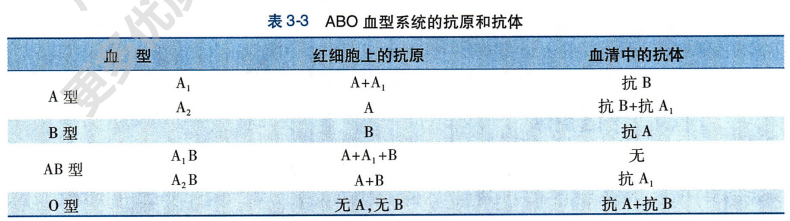

ABO 血型的**各种抗原的特异性**取决于红细胞膜上的糖蛋白或糖脂上的**寡糖链**

A、B 抗原都是在 H 抗原基础上由**糖基转移酶**催化增加糖基而来而来

O 型虽不含 A、B 抗原，但含有 H 抗原，而 H 抗原也是由**糖基转移酶催化前体物质**合成得到

因此，**基因通过决定糖基转移酶种类**，决定催化何种糖基连接在前驱物质那个位置，间接决定血型抗原特异性寡糖链，决定血型的表现型

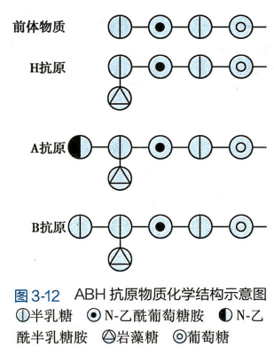

ABO 血型系统的抗体有两类：

- 天然抗体：IgM，分子量大不能通过胎盘
- 免疫抗体
  - 机体接收自身不存在的红细胞抗原刺激形成
  - IgG 抗体，分子量小，可通过胎盘

ABO 血型染色体的遗传：

- 血型由 9 号染色体上 A、B、O 三个等位基因决定
- A 和 B 为显性基因，O 为隐性基因

ABO 血型的鉴定：

- 正向定型：用抗 A 和抗 B 抗体检查有无 A 或 B 抗原
- 反向定型：用已知血型的红细胞检查血清中有无抗 A 后抗 B 抗体

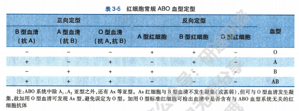

##### Rh 血型系统

Rh 抗原特异性取决于蛋白质的氨基酸序列：

- Rh 阳性者由 RhD 基因和 RhCE 基因
- Rh 阴性者只有 RhCE 基因
- 通常将红细胞上含有 D 抗原者称为 Rh 阳性，不含 D 抗原者称为 Rh 阴性

Rh 抗体：

- 人血清不存在抗 Rh 天然抗体
- 只有 Rh 阴性者接收阳性的血液后才会通过体液免疫产生抗 Rh 抗体
- Rh 阴性孕妇怀有 Rh 阳性胎儿时，第一胎分娩时才有少量红细胞进入母体产生抗体；第二胎抗 D 抗体进入胎儿体内引发溶血

#### 血量和输血原则

血量：每千克体重有 70~80ml 血液

输血最好坚持同型输血

交叉配血试验：

- 交叉配血主测：把供血者红细胞与受血者血清配合，检查受血者体内是否存在针对抗体
- 交叉配血次测：受血者红细胞与供血者血清配合，检查供血者体内是否存在针对性抗体

试验结果：

- 两侧都没有凝集，配血相合，可以输血
- 主侧凝集，配血不合，不能输血
- 主侧不凝集次侧凝集，配血基本相合，多见于将 O 型血输给其他血型或 AB 型血接收其他血型，只能少量输入

## 第四章 血液循环

循环系统包括：

- 心血管系统：起主要作用
  - 心脏
  - 血管
    - 动脉
    - 毛细血管
    - 静脉
  - 心腔与血管中的血液
- 淋巴系统：起辅助作用
  - 淋巴管
  - 淋巴器官

血液循环：心脏跳动推动血液在心血管系统内循环流动

血液循环主要功能：

- 物质运输：运送营养物质和代谢产物
- 体液调节：运送激素和生物活性物质
- 维持内环境稳态
- 血液防卫免疫功能

外周淋巴管收集部分组织液形成淋巴液，淋巴液汇入静脉血液

### 心脏的泵血功能

心脏的泵血功能：心脏节律性收缩和舒张对血液的驱动作用

收缩时将血液射入动脉，舒张时使静脉血回流到心脏

#### 心脏的泵血过程和机制

##### 心室泵血

心脏结构与功能：

- 两个心房：接收血液
- 两个心室：泵出血液

**左心房**接收肺部**富氧血**然后经**左心室**泵出到**全身**

**右心房**接收其他部位**贫氧血**然后经**右心室**泵到**肺部**氧合

心动周期：一次收缩和舒张的周期

左右心房/心室活动同步，每个周期心房先收缩，后心室收缩；心房心室的收缩期都短于舒张期

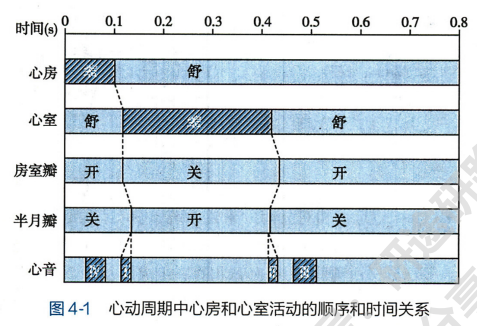

左右心室的泵血过程相似且几乎同时，因此以座心室为例说明一个心动周期中心室射血和充盈过程：

1. 心室收缩期
   1. 等容收缩期：
      1. 收缩时室压升高，超过房压时**房室瓣关闭**
      2. 但室压仍小于主动脉压，**主动脉瓣未开启**。此时心室容积不变，但心室收缩持续增大室压
   2. 射血期：室压超过主动脉压时半月瓣开启射血
      1. 快速射血期：血液快速射入主动脉，心室容积缩小，但由于心室肌收缩，室压仍上升
      2. 减慢射血期：心室收缩减弱，射血变慢，室内压与主动脉压下降
2. 心室舒张期
   1. 等容舒张期：
      1. 射血后，心室舒张，室内压下降；主动脉血反流回心室推动**半月瓣关闭**
      2. 此时室内压仍大于房压，**房室瓣关闭**，心室舒张室内压下降
   2. 心室充盈期：室压低于房压时，房内血冲开房室瓣进入心室
      1. 快速充盈期：心室快速充血，容积迅速增大
      2. 减慢充盈期：压力梯度减小，充盈减慢

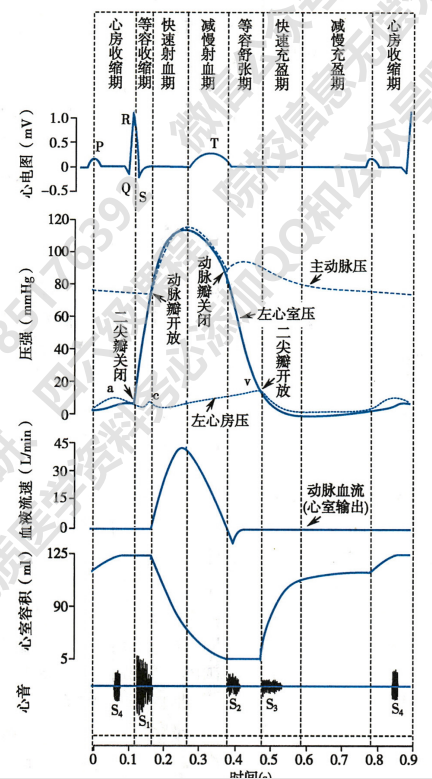

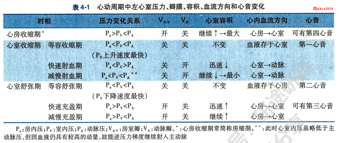

左心室肌收缩和舒张是造成左心室内压变化，导致心房和心室、心室和主动脉之间压力梯度的根本原因

压力梯度是推动血液流动的主要动力

右心室泵血和左心室基本相同，但肺动脉压仅为主动脉呀 1/6，因此右心室内压变化幅度不会有左心室内压那么大

##### 心房

心房的初级泵作用：

1. 心房主要功能：接收静脉回流的血液返回心室
2. 心室舒张期后期心室轻微收缩，使心室容积增大，提高心室肌初长度和收缩力，提高心室泵血
3. 如果心房不能正常收缩，心室每次射血量减少

房内压变化：

1. 心房收缩时房内压升高(a 升支)
2. 心房舒张房内压降低(a 降支)
3. 心室收缩时，心室血液推顶房室瓣使其凹入心房，房内压略微升高(c 升支)
4. 射血后，心室容积减小，房室瓣向下移动，房内压减小(c 降支)
5. 血液流入心房，房室瓣仍关闭，房内压升高(v 升支)
6. 血液从心房流入心室，房内压降低(v 降支)

#### 心输出量

**每搏输出量**：一侧心室一次心脏搏动射出的血液量，简称**搏出量**

左心室舒张末期容积 EDV 约 125ml

收缩末期容积 ESV 约 55ml

EDV - ESV = 约 70ml 即为搏出量，可见心室内并非所有血液都被搏出

搏出量占心室舒张末期容积的比例，称为**射血分数**，即射出量/原有总量

每分输出量：一侧心室每分钟射出的血液量，也称**心输出量**

每分输出量 = 心率 \* 搏出量

#### 心脏泵血功能的储备

心输出量可随机体代谢需要而增加的能力，称为**心泵功能储备或心力储备**

例如剧烈运动时的心输出量是安静时的 5 到 6 倍

心泵功能储备取决于搏出量和心率能提高的程度，因此包括两部分：

1. 搏出量储备
   1. 收缩期储备：提高心肌收缩能力，提高射血分数，比舒张期准备大得多
   2. 舒张期储备：增加舒张末期容积
2. 心率储备
   1. 在保持搏出量的情况下使心率加快
   2. 当心率过快时，心室充盈不足，心输出量和搏出量均减少

#### 影响心输出量的因素

心输出量 = 搏出量 \* 心率

而搏出量受心室肌前负荷、后负荷和心肌收缩能力等影响

- **心室前负荷**
  - 心室前负荷/初长度，取决于舒张末期血液充盈量，等价于心室舒张末期内压 EDP
  - 而舒张末期房压与室压基本相等，房内压测定方便
  - 因此常用心室舒张末期心房内压力反应前负荷
- **心肌异长自身调节**：通过改变心肌初长度引起心肌收缩力改变
  - 心功能曲线：增加前负荷，心肌收缩力加强，搏出量增多，每搏功增大
    - 5-15，心每搏功随心室舒张末期压增大
    - 15-20，趋于平坦
    - 高于 20 平坦
  - **心定律**：一定范围内增大心室舒张末期容积可增强心室收缩力
  - 心室肌**抗过度延伸特性**：心室肌初长度在超出最适长度后不再随室内压增加而增加，这使得心室功能曲线不会有明显降支
  - **生理意义**：对搏出量的变化进行调节，**平衡心室射血量和静脉回心量**

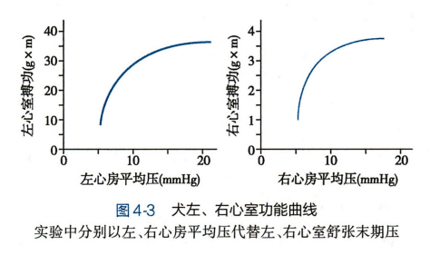

- 影响前负荷的因素：心室舒张末期充盈血量 = 静脉回心血量 + 射血后剩余血量
  - 静脉回心血量
    - 心室充盈时间：充盈完全则静脉回心血量多，反之减少
    - 静脉回流速度：回流越快静脉回心血量越多；速度取决于外周静脉压与心房、心室内压差，压力梯度越大，回流速度越快
    - 心室舒张功能：心室舒张耗能，心肌细胞内 Ca2+回降速度越快，心室舒张速度越快，心室负压越大，抽吸作用越强，静脉回心血量越多
    - 心室顺应性$C_V$：单位压力变化引起的容积改变，即$C_V=\frac{\triangle V}{\triangle P}$。心室顺应性高时，相同充盈压下能容纳更多血量，反之则降低
  - 射血后心室内剩余血量
    - 主动脉压升高导致搏出量暂时减少，可使剩余血量增多
    - 但剩余血量增加，舒张末期室内压增高，静脉回心血量减少

- 后负荷：大动脉血压使心室收缩的后负荷
  - 大动脉血压增高，等容收缩期延长，射血期缩短，搏出量减少；反之利于心室射血
  - 大动脉血压增高，搏出量减少，心室剩余血量增多，假设静脉回心血量不变，则心室舒张末期容积增大，**异长自身调节**加大心肌收缩力量，提高搏出量，使心室舒张末期容积恢复到原先水平
- 心肌收缩能力：心肌本身的内在特性
  - 心肌收缩能力增强，心室功能曲线向左上移动，即相同前负荷（房压）下，每搏功增加
  - 改变心肌收缩能力的调节称为“等长调节”
  - 影响因素
    - 活化横桥数目：活化横桥比例取决于 Ca2+浓度和肌钙蛋白对 Ca2+的亲和力
    - 肌球蛋白头部 ATP 酶活性
- 心率
  - 一定限度内提高心率可以提高心输出量
    - 心率过快，充盈不足，心输出量反而降低
    - 心率过慢，充盈早就到达最大限额，心输出量同样降低

#### 心功能评价

##### 心室压力变化评价心功能

心导管术：导管从周围血管插入，送入心腔及各处大血管的技术

**心导管检查时评价心室功能的金标准**

1. 心脏射血功能评价
   1. 通过搏出量、射血分数、每搏功、心输出量等指标评价射血功能
   2. 通过心室收缩压对时间的一阶导数 dP/dt 评价，如下图波峰，青年收缩压变化率峰值比老年高，说明收缩能力更强

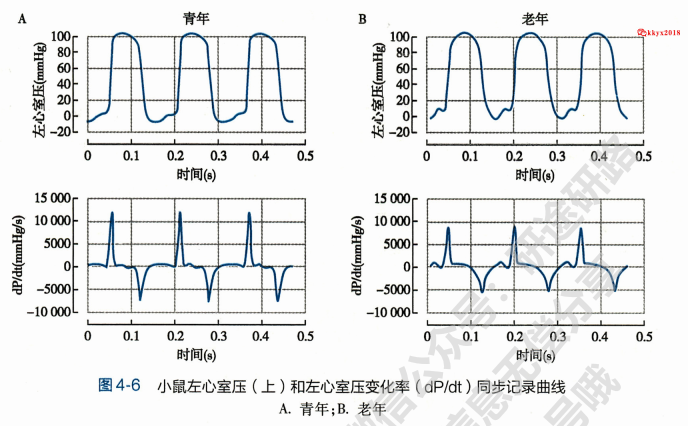

2. 心舒张功能评价
   1. 对舒张压曲线求一阶导数 -dP/dt 作为心室舒张能力的评价指标（舒张时新室内为负压吸血）
   2. 如上图波谷，青年波谷绝对值大于老年波谷绝对值，说明青年舒张能力更强（产生瞬时负压更大）

##### 心室容积变化评价心功能

**超声心动图检测**是临床最常用的**无创检查方法**

1. 心室收缩功能评价
   1. 首选指标：左心室射血分数
   2. 同时还可用射血期心室容积变化速率 dV/dt 和心室直径变化速率 dD/dt 反应心室收缩能力
2. 心室舒张功能评价，如下图：
   1. 舒张开始时，左心室血液流入速率较快(e 波)
   2. 舒张末期，左心房收缩使流入速率小幅度增大(a 波，且 e>a)
   3. 对于舒张障碍者
      1. 等容舒张期延长（需要更长时间舒张），-dP/dt 绝对值下降
      2. 舒张早期左心室压力较高，抽吸作用变小，e 波变小
      3. 舒张末期，左心房收缩对左心室充盈作用增大，a 波变大（因为舒张末期容积减小所以可充盈更多血液）

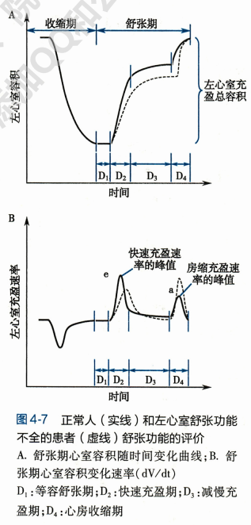

##### 心室压力和容积变化评价心功能

心脏做功量的测定：

1. 外功：心室收缩产生室内压推动血液所做的机械功
2. 内功：心脏活动中用于离子跨膜主动转运、克服心肌内部粘滞阻力等的耗能

每搏功：简称搏功，心室一次收缩射血所做的外功

每搏功由两部分组成：

1. 压力-容积功：将一定容积的血液提升到一定压力、增加血液势能
2. 血液动能：血液流动的动能

$$
压力-容积功 = 搏出量 \times 心动周期中室压增量，W = P\triangle V
$$

$$
血液动能 = 1/2 \times (搏出量质量\times 血流速度^2)，E_k=\frac{1}{2}mv^2
$$

每搏功 = 压力-容积功 + 血液动能

安静状态下血液动能占比很低，因此可将每搏功近似为压力-容积功

由于射血过程中室内压是变化的，因此数学上需要计算压力曲线的积分。但实际应用中常用下面两种替换：

- 用平均动脉压替代左心室内压平均值，即射血初期室内压
- 用左心房平均压替代左心室舒张末期压，即射血末期压

因此每搏功计算公式变为

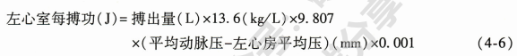

每分功：心室每分钟收缩射血所做的功

每分功 = 每搏功 × 心率

在上面通过心导管术和超声心动图绘制出心室压力-时间曲线和心室容积-时间曲线后，根据每个相同时间点的压力和容积可以绘制压力-容积曲线，得到压力-容积环

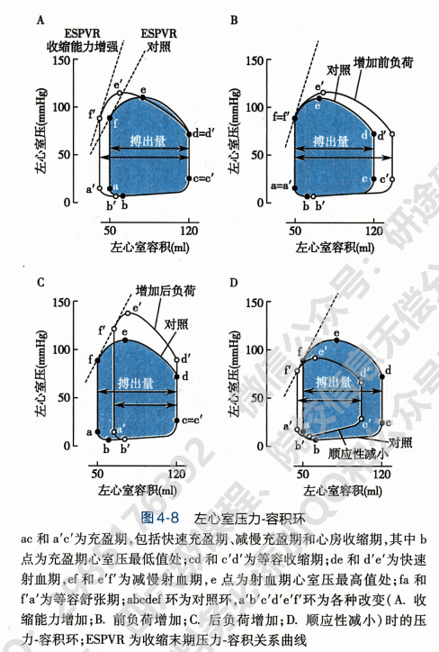

压力-容积环逆时针一周为一个心动周期，其反映了一个心动周期过程中压力与容积的关系

其中收缩末期压力-容积关系曲线 ESPVR 可反映心室收缩能力，也可以用于反映前负荷与后负荷变化

#### 心音

人有四种心音：

1. 第一心音：由**房室瓣关闭**以及**心室射血震动**引起，**标志心室收缩开始**
2. 第二心音：由**主动脉瓣和肺动脉瓣关闭**、血液冲击引起，**标志心室舒张期开始**
3. 第三心音：**心室快速充盈期末**，血流突然减速引起
4. 第四心音：**心房收缩**引起震动，也称心房音，出现在**心室舒张末期**

### 心脏的电生理学及生理特征

心脏的节律性收缩与舒张与生物电活动有关

心肌细胞动作电位每个时期都有两种以上离子流参与

一次动作电位包含被动和主动离子转移两个过程

心肌细胞根据电生理学特点可分为两种：

1. 工作细胞：心房肌和心室肌，由稳定静息电位，执行收缩功能
2. 自律细胞：窦房结细胞和浦肯野细胞，没有稳定静息电位，可自动产生节律性兴奋

根据动作电位去极化快慢及机制可分为：

1. 快反应细胞：去极化速度和幅度大，兴奋传到快，复极化缓慢
2. 慢反应细胞：去极化速度幅度小，兴奋传导满，复极化慢

#### 心肌细胞的跨膜电位及其形成机制

心肌细胞动作电位在不同类型心肌细胞不同，其形成机制/离子流也不同

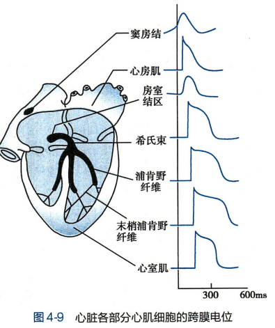

##### 工作细胞跨膜电位及形成机制

**静息电位的形成**：心肌工作细胞细胞膜静息时对 K+通透性高，**K+顺浓度梯度外流**，形成**外正内负**电位差，约为-90mV

同时细胞膜对 Na+等离子也有一定通透性，因此 Na+内流抵消部分 K+外流的电位差

因此静息电位大小主要取决于

- 细胞内外液 K+浓度差
- 膜对 K+的通透性

**K+向膜外扩散是静息电位主要来源**

**心室肌动作电位**由去极化和复极化两个过程五个时期组成：

1. 动作电位 0 期（快速去极化期）
   1. 心肌细胞受刺激，膜上钠通道开放，**Na+顺梯度内流去极化**，构成动作电位升支
   2. **钠通道是快通道**，激活、失活快
   3. 该去极化过程为**正反馈**：Na+内向电流可引起更多钠通道开放，形成更大的$I_{Na}$，因此可迅速到达平衡电位 ENa，动作电位升支陡峭
   4. T 型钙电流$I_{Ca-T}$也是快速内向离子流，但离子流较弱，去极化作用不大
2. 动作电位 1 期（快速复极化期）
   1. 膜去极化使瞬时外向电流($I_{to}$)通道开放，K+迅速短暂外流，引起快速复极化
   2. 1 期还有氯电流$I_{Cl}$，但一般强度小
3. 动作电位 2 期（平台期）
   1. 1 期复极化接近 0mV 后，保持极缓慢复极化过程，离子流最复杂，既有内向又有外向离子流
   2. 内向电流：
      1. 钙通道（慢通道）开放引起 Ca2+缓慢而持久地内流，形成**L 型钙电流** $I_{Ca-L}$ ，是形成平台期的主要原因
      2. 慢失活的$I_{Na}$，强度不大，但失活受阻时明显增大
   3. 外向电流
      1. **内向整流钾电流**$I_{K1}$时形成长时间平台期的主要原因。静息时 IK1 通道开放使 K+外流；去极化时通透性降低阻止 K+外流，此现象称为**内向整流**
      2. 延迟内向整流钾电流$I_K$，其随时间逐渐加强：早期抗衡$I_{Ca-L}$，后期时复极化主要电流
      3. 早期 Ca2+内流和 K+外流平衡，随后钙通道逐渐失活，K+外流主键增加形成复极
4. 动作电位 3 期（快速复极化末期）
   1. $I_K$逐渐加强，快速复极化直到恢复静息电位
   2. $I_K$正反馈，K+外流使膜内电位转负，膜内电位越负，外流电流越大
   3. $I_{K1}$在复极化末期开始加强，加速终末复极化
5. 动作电位 4 期（完全复极化期）
   1. 静息期，电位保持稳定的静息电位
   2. 钠泵增强，完成 Na+外运和 K+内运
   3. Na+-Ca2+交换提加强，将 3 个 Na+运入，将 1 个 Ca2+排出，运入的 Na+再由钠泵排出
   4. 两泵将动作电位期间排出的 K+、流入的 Na+和 Ca2+复位

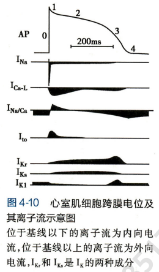

离子的被动转运：生物膜通透性改变，产生动作电位

离子的主动转运：保证膜内外不对等分布，保持细胞膜兴奋性

**心房肌细胞静息电位**：心房肌细胞膜上$I_{K1}$通道密度低于心室肌，外流少，受 Na+内漏影响较大，因而静息电位略小于心室肌细胞，约为-80mV

心房肌细胞动作电位与心室肌细胞很相似，但也有区别：

- $I_{to}$通道较发达，电流较大，平台期不明显
- 复极化较快使动作电位时程较短
- 心房肌细胞膜上存在乙酰胆碱 Ach 敏感的钾电流，Ach 激活通道使 K+外流增强出现超极化，时程明显缩短

##### 自律细胞跨膜电位及其形成机制

自律细胞与工作细胞最大的区别是**没有稳定的静息电位**

这是由于再 3 期复极化末时达到最大复极电位 MRP 后，4 期电位并不稳定在这一电位，而是**立即开始去极化**

通常用**MRP**的值代表**静息电位值**

**4 期自动去极化时自律细胞产生自律性兴奋的基础**

###### 窦房结细胞动作电位

窦房结中的自律细胞为**P 细胞**，动作电位为**慢反应电位**

动作电位性状与心室肌等**快反应电位**有很大不同：

1. 去极化速度和幅度小
2. 没有明显 1 期和平台期，只有 0、3、4 期
3. 4 期电位不稳定，最大复极电位绝对值小
4. 4 期发生自动去极化，达到阈电位即可爆发动作电位

窦房结 P 细胞膜上$I_{K1}$通道较少，因而最大复极电位小于心房肌静息电位，约为-70mV

窦房结 P 细胞动作电位：

1. 0 期
   1. 因为窦房结 P 细胞缺乏$I_{Na}$，因而不能向心室肌细胞一样产生快速去极化
   2. 0 期产生主要依靠$I_{Ca-L}$，即钙离子内流
   3. 因此去极化速度缓慢，受细胞外 Ca2+浓度影响
2. 因为窦房结 P 细胞缺乏$I_{to}$通道，因而无明显 1 期和 2 期
3. 3 期复极化
   1. 主要依靠$I_K$，使动作电位复极到 MRP 水平
4. 4 期自动去极化
   1. P 细胞动作电位到达 MRP 时，外向$I_K$逐步衰减，与内向离子流$I_f$共同导致自动去极化
   2. -50mV 左右，内向 T 型钙电流$I_{Ca-T}$加速自动去极化
   3. 去极化达到$I_{Ca-L}$阈电位时，$I_{Ca-L}$通道开放，钙离子内流开始一个新的动作电位

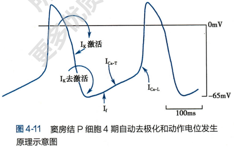

###### 浦肯野细胞动作电位

浦肯野细胞兴奋时产生快反应动作电位，与心室肌动作电位相似

也分为 01234 五个时期，0123 期机制与心室肌细胞基本相同，不同点是：

- 0 期去极化速度比心室肌细胞快
- 1 期较心室肌细胞更明显，1 期和 2 期之间有明显切痕
- 膜中$I_{K1}$通道密度较高，MBR 较心室肌静息电位更大
- 4 期电位不稳定
- 所有心肌细胞中浦肯野细胞动作电位时程最长

自动去极化机制：

- 外向电流减弱：复极到-50mV 左右$I_K$通道关闭
- 内向电流增强：$I_f$通道开始激活开放，激活程度随膜内负电压增大而增强
- $I_f$在自动去极化过程起主要作用
- 但由于$I_f$通道密度低，激活开放速度慢，因此 4 期自动去极化速度慢

#### 心肌的生理特性

心肌细胞有四种生理特性：

- 兴奋性
- 传导性
- 自律性
- 收缩性

前三种是电生理特性，第四种是机械特性，两种特性紧密相连

一般心肌细胞产生动作电位、通过**兴奋-收缩偶联**引起心肌收缩

工作细胞无自律性，自律细胞无收缩性

##### 兴奋性

心肌细胞每产生一次兴奋，其膜电位会发生一系列规律性变化，兴奋性因而也有周期性变化

心室肌细胞兴奋性的周期性变化：

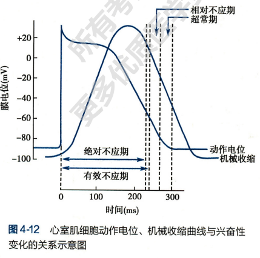

1. 有效不应期 ERP
   1. 绝对不应期：0 期去极化开始到 3 期复极化到-55mV，无论多强的刺激都不会引起去极化
   2. 局部不应期：-55mV 到-60mV 阈上刺激可引起局部反应，但不会产生新的动作电位
   3. 原因：钠通道完全失活或尚未恢复到可被激活的状态
   4. 心肌的 ERP 特别长
2. 相对不应期 RRP
   1. 复极化-60mV 到-80mV，阈上刺激可产生动作电位
   2. 原因：有相当数量钠通道复活到备用状态，但不多，因此需要阈上刺激才能引起兴奋
3. 超常期 SNP
   1. -80mV 到-90mV，阈下刺激即可引起兴奋
   2. 原因：钠通道基本恢复可被激活备用状态，且膜电位与阈电位接近
   3. 在相对不应期和超常期，膜电位低于静息电位，**钠通道开放数量和速率均低于静息电位时**，因此产生新兴奋时，去极化（Na+内流）速度和幅度都会低于正常

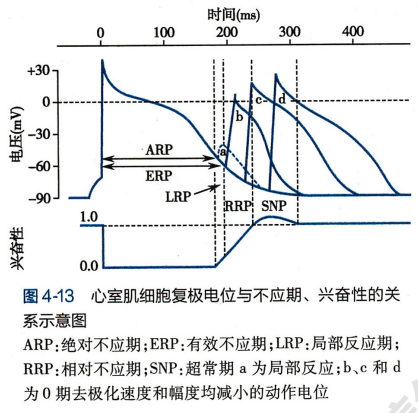

细胞兴奋性高低通常用刺激阈值大小衡量：刺激阈值低则兴奋性高；否则反之

影响心肌兴奋性的因素：

1. **静息电位或最大复极电位水平**：阈电位不变时，这两种电位负值越大，与阈电位的距离就越大，需要的刺激强度就越强，兴奋性越低
2. **阈电位水平**：与上面同理，阈电位上移，与静息电位或最大复极电位的距离增大，刺激阈值增大，兴奋性降低；反之，电位距离缩小，所需刺激强度缩小，兴奋性增强
3. 引起 0 期去极化的**离子通道的性状**
   1. 0 期去极化的通道都有**静息（备用）、激活和失活**三种状态
   2. **快反应动作电位**中
      1. 静息时**钠通道**静息，受到阈刺激、膜去极化达到阈电位后，大量钠通道激活
      2. 随后失活关闭
      3. 失活后须等到复极化到-60mV 才能开始复活
      4. 复活需要时间，只有恢复到静息电位钠通道才全部恢复到静息状态
      5. 这就是有效不应期刺激不能产生兴奋的本质原因
   3. 慢反应动作电位中
      1. 兴奋性取决于 L 型钙通道功能状态
      2. L 型钙通道激活、失活、复活速率均较慢

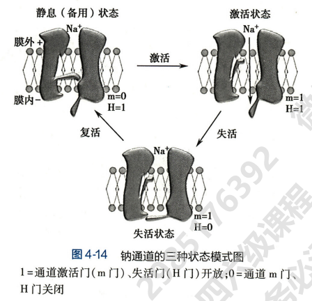

**兴奋性的周期性**与**收缩活动**的关系：

1. 心肌细胞**有效不应期很长**，延续到心肌舒张早期，**使收缩和舒张交替进行**，保证泵血活动正常
2. 一般窦房结产生的兴奋到达心房/心室肌时，有效不应期已经结束，因此能不断产生兴奋
3. 如果在窦房结兴奋到达前受到外来刺激，则可产生**期前兴奋**和**期前收缩**
   1. 期前兴奋和期前收缩也有**有效不应期**
   2. 如果窦房结兴奋恰巧落在该有效不应期，则需要等到**下一次窦房结兴奋**才能引发兴奋与收缩
   3. 因此期前收缩后可能会有一段较长的心室舒张期，成为**代偿间歇**

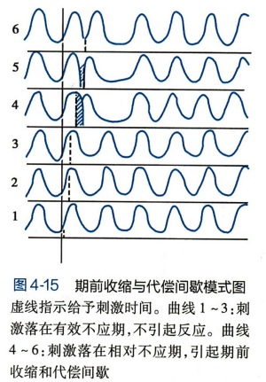

##### 传导性

心肌的传导性是指心肌细胞传导兴奋的能力或特性

兴奋在心内的传播时通过特殊的传导系统有序进行：

1. **窦房结**产生的兴奋能直接传给**心房肌纤维**
2. 心房中有小肌束组成的优势传导通路，可将兴奋快速传导到**房室结**
3. 房室结中兴奋传导缓慢，此时会出现时间延搁，成为房-室延搁，**确保心室收缩发生在心房收缩完毕之后**，利于心室充盈和射血
4. **浦肯野纤维**传递兴奋速度**最快**，可快速将兴奋传递到心室肌
5. 心室内传导系统传导兴奋迅速，可使**左右心室几乎同时收缩**

决定和影响传导性的因素：

1. 结构因素
   1. **心肌细胞直径**是决定传导性的**主要结构因素**：直径与内电阻成反比，直径越大，内电阻越小，传导速度越快
   2. **细胞间的连接方式**：缝隙连接构成低电阻通道，缝隙连接越多，传导性越好
   3. **细胞分化程度**：分化程度低传导慢
2. 生理因素
   1. **动作电位 0 期去极化速度和幅度**：
      1. 通过兴奋部位去极化与未兴奋部位产生**局部电流**传导兴奋
      2. **去极化速度**越快，局部电流形成越快
      3. **去极化幅度**越大，与未兴奋部位的电位差越大，局部电流越强，同时扩步距离也越大，传导速度越快
   2. **膜电位水平**
      1. 静息电位时，钠通道处于最佳可利用状态，钠通道快速开放，去极化速度幅度大，传导速度快
      2. 膜电位小于静息电位时，钠通道未完全复活，去极化速度幅度均减慢，传导减慢
   3. **邻近未兴奋部位膜的兴奋性**
      1. 只有邻近部位兴奋性正常、不处于不应期时，兴奋才能传导
      2. 静息电位增大或阈电位升高均会导致兴奋性降低，传导减慢
      3. 未兴奋部位膜电位低，钠通道失活无法产生动作电位，阻碍兴奋传导

##### 自动节律性

自动节律性简称节律性，指**心肌在无外来刺激的条件下能自动产生节律性兴奋**的能力或特性

**心脏的起搏点**：产生兴奋并控制整个心脏活动的自律组织通常是**自律性最高**的**窦房结**，故**窦房结是心脏活动的正常起搏点**

窦房结起搏而形成的心脏节律称为**窦性节律**

其他自律组织正常时只传导兴奋，不表现节律性，称为**潜在起搏点**

只有发生异常时潜在起搏点才会替代窦房结产生兴奋

**窦房结控制潜在起搏点的主要机制**：

1. **抢先占领**：
   1. 窦房结自律性最高（产生兴奋频率最快）
   2. 在潜在起搏点 4 期自动去极化到达阈电位前，窦房结的兴奋到来产生动作电位
2. **超速驱动压抑**：
   1. 自律细胞受到高于固有频率的刺激时，会按外来刺激的频率发生兴奋
   2. 外来刺激中断后，潜在起搏点的自律性需要一段时间才能恢复
   3. 频率差值越大，压抑效应越强，驱动中断后所需的恢复时间就越长

**决定和影响自律性的因素**：

1. **4 期自动去极化速度**：去极化越快，到达阈电位的时间越短，自律性越高
2. **最大复极电位水平**：最大复极电位减小，与阈电位的差距缩短，到达阈电位时间缩短，自律性增高
3. **阈电位水平**：阈电位上移，与最大复极电位之间距离增大，到达阈电位时间延长，自律性降低。但一般阈电位不变，不是主要因素

##### 收缩性

心肌和骨骼肌相同点：

1. 同属横纹肌
2. 心肌细胞的收缩同样由动作电位触发，通过兴奋-收缩耦联时肌丝滑行引起

心肌收缩特点：

1. 同步收缩
   1. 兴奋在心肌细胞之间通过缝隙连接迅速传播，使所有细胞几乎同时兴奋和收缩
   2. 唯一传播较慢的就是房室交界传导纤维，这使得心房和心室先后发生同步收缩
2. 不发生强直性收缩：心肌细胞有效不应期非常长，保证心脏舒缩交替进行
3. 对细胞外 Ca2+的依赖性
   1. 心肌细胞肌质网不如骨骼肌发达，贮存的 Ca2+较少，因此引起收缩主要依靠胞外 Ca2+内流
   2. 胞外 Ca2+内流触发肌质网释放 Ca2+到胞质，使胞质 Ca2+浓度升高引起心肌收缩
   3. 肌质网上钙泵逆梯度将 Ca2+摄入肌质网、肌膜上钙泵和 Na2+-Ca2+交换提将 Ca2+排出，使胞质 Ca2+浓度下降，心肌细胞舒张

影响心肌收缩的因素：

1. 前、后负荷、心肌收缩能力、胞外 Ca2+浓度等
2. 运动、肾上腺素等

心力衰竭：收缩/舒张功能不全

#### 体表心电图

##### 心电图基本原理

**膜极化学说（电偶学说）和容积导体原理**

静息状态下，心肌细胞膜电位为外正内负

心肌去极化产生动作电位时，极性反转变为内正外负

两个相近的正负电荷组成的体系称为电偶：

- 电源：带正电荷的一极
- 电穴：带负电荷的一极
- 电流从电源流向电穴

去极化时，动作电位细胞与邻近静息细胞形成电偶，产生局部电流使邻近细胞膜去极化，爆发动作电位

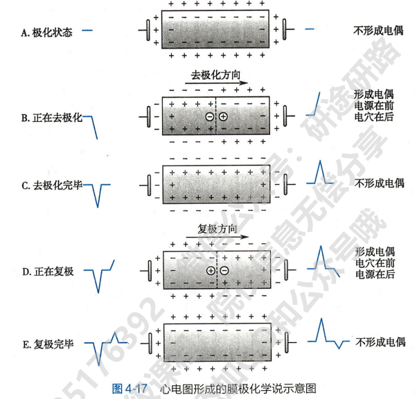

**容积导体**：身体的细胞内外液都是由电解质溶液组成，是很好的三维空间导体，称为容积导体

心脏形成的电偶可以通过身体这个容积导体传导到体表被记录，经放大后为心电图。心电图记录**心脏实时电活动**，显示**电压-时间曲线**

##### 心电图导联方式和正常心电图

心电图导联：电极位置与心电图机连接的线路

目前临床通常记录 12 导联心电图

正常体表心电图在每次兴奋过程中都会出现下面几个基本波形：

1. P 波：
   1. 幅度较小，形状小而圆钝，反映**左、右心房去极化**
   2. 心房颤动时 P 波消失
2. QRS 波群：是心室肌快速同步兴奋的结果
   1. P 波后间隔一小段时间（PR 间期）发生 QRS 波群，时程短、幅度大、形状尖锐，反映**左右心室去极化**
   2. Q 波：第一个向下的波
   3. R 波：第一个向上的波
   4. S 波：R 波出现后向下的波
   5. 正常传导途径：**左右束支 -> 浦肯野纤维网 -> 心室肌**
   6. **QRS 波群增宽**说明在**心室内传导时间变长**，可能有传导阻碍或心室肥厚
   7. **QRS 波群幅值增高**提示**心肌肥厚**
3. T 波
   1. QRS 波群后间隔一段时间（S-T 段）出现的持续时间按较长、波幅较低的向上的波，反映**心室复极化过程**
   2. T 波升支和降支不对称，升支缓慢、降支陡峭
4. U 波：T 波后低而宽的波
5. PR 间期
   1. 定义：从 P 波起点到 QRS 波起点的时程
   2. 代表兴奋由心房、房室交界、房室束到心室并引起心室兴奋的总时间，称为**房室传导时间**
6. PR 段
   1. 定义：P 波重点到 QRS 波起点之间的时段
   2. 电位很小，心电图一半记录不到电位变化，因此一般为水平线
7. QT 间期
   1. 定义：从 QRS 波起点到 T 波终点的时程
   2. 代表心室开始去极化到完全复极化经历的时间
   3. QT 间期长短与心率成反比
8. ST 段
   1. 定义：QRS 波终点到 T 波起点
   2. 心室所有细胞处于去极化尚未开始复极化，相当于平台期
   3. 电位变化很小，常为水平线

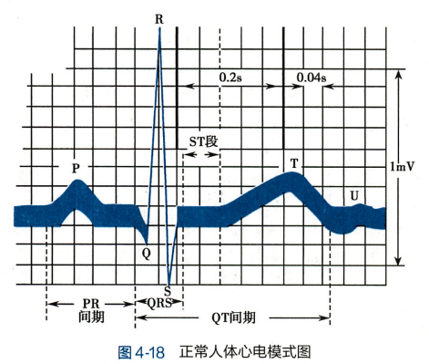

##### 心电图与心肌细胞动作电位的关系

虽然心电图是根据心脏的生物电活动产生的，但动作电位图形与心电图由显著差别：

1. 心肌细胞动作电位是单个细胞的膜电位变化，而心电图是整个心脏兴奋过程中的综合电变化
2. 单个心肌细胞动作电位是通过细胞内记录，心电图是通过细胞外记录

但心电图与动作电位的各个时期还是有明显的对应关系

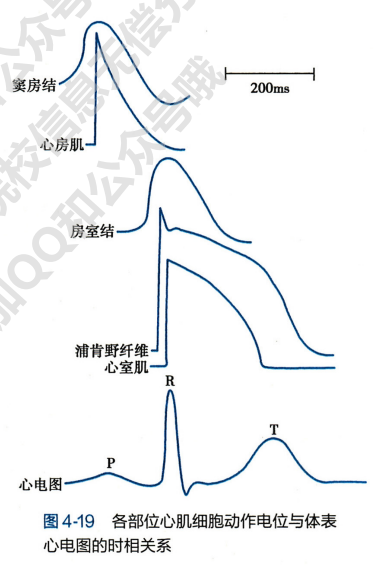

### 血管生理

血管包括动脉、静脉和毛细血管

血液由心房流入心室，再从心室泵出，流经动脉、毛细血管和静脉后返回心房

体循环中的血量约占 84%，肺动脉中的循环约占 9%

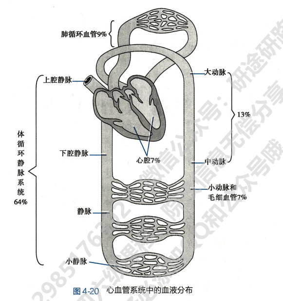

#### 各类血管的功能特点

##### 血管的功能性分类

动脉、毛细血管和静脉依次串联

动脉和静脉管壁从内向外分别有：

- 内膜：通透性屏障，有选择性
- 中膜：
  - 血管平滑肌、弹性纤维和胶原纤维组成，比例依血管类型而不同
  - 平滑肌可调节血流量
  - 弹性纤维可使动脉扩张或回缩
- 外膜：外层疏松结缔组织

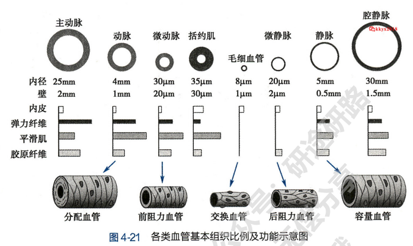

血管按生理功能可分为下面几类：

1. 弹性贮器血管：
   1. 主动脉、肺动脉主干及其发出的最大分支
   2. 管壁坚厚富含弹性纤维
   3. **心室射血时**，部分血液流入外周，另一部分暂时**储存**在大动脉，使管壁扩张，使血流**动能**转换为血管壁**弹性势能**
   4. **心室舒张期**，主动脉瓣关闭，大动脉管壁弹性回缩，**弹性势能**转换为**动能**，推动储存的血液继续流向外周
   5. **弹性贮存作用**使心室的间断射血转化为血液在血管中**连续流动**，使心动周期中血压波动幅度减小
2. 分配血管：中动脉，功能是将血液运输到各器官组织
3. 毛细血管前阻力血管
   1. 包括小动脉和微动脉
   2. 管径较细，对血液阻力较大
   3. 血管平滑肌丰富，常态保持一定收缩，舒张可显著改变血管口径和血流量
4. 毛细血管前括约肌：环绕在真毛细血管起始部位，其舒缩可控制毛细血管开关
5. 毛细血管
   1. 动静脉之间形成毛细血管网
   2. 管壁仅由单层内皮细胞组成，通透性高
   3. 是血管内外物质交换的主要场所，也称交换血管
6. 毛细血管后阻力血管：管径较小，可产生阻力，影响毛细血管前、后阻力比值
7. 容量血管
   1. 即为静脉系统
   2. 静脉相比动脉数量多、管壁薄、口径大、容量大，具有血液储存库作用
8. 短路血管：小动脉和小静脉之间的直接吻合支，小动脉的血液可不经毛细血管直接进入小静脉

##### 血管的内分泌功能

1. 血管内皮细胞：合成和释放舒血管物质和缩血管物质，维持动态平衡
2. 血管平滑肌细胞：可合成分泌肾素和血管紧张素，调节血管紧张度和血流量
3. 其他：分泌活性物质调节血管舒缩

#### 血管动力学

##### 血流量和血流速度

血流量：单位时间流经某一横截面的血量，也称容积速度，单位为 ml/min 或 L/min

血流速度：血液某一质点在管内移动的线速度

血流速度与血流量成正比，与血管截面面积成反比

泊肃叶定律计算液体流量：

$$
Q=\frac{\pi \triangle Pr^4}{8 \eta L}
$$

或将$\frac{\pi}{8\eta}$常数项记为 K 得到

$$
Q=K\frac{r^4}{L}(P_1-P_2)
$$

其中：

- Q 为液体流量
- $\triangle P$为管道两端压力差
- r 为管道半径
- L 为管道长度
- $\eta$ 为液体粘度常数

适用条件：

1. 粘性液体
2. 刚性管道

而在实际应用中，Q 并不与 $\triangle P$ 成正比，因为压力差变大时，**血管会弹性扩张**

血液在血管中有两种流动方式：

- 层流
  - 液体中各质点运动方向一致，但速度各不相同
  - 轴心处流速最快，越靠近管壁越慢
  - 泊肃叶定律仅适用于层流
- 湍流
  - 血流加速到一定程度时，层流被破坏，各个质点运动方向不一致，出现漩涡

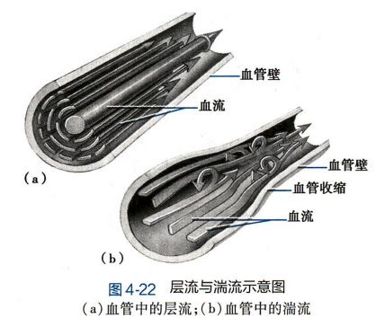

用于判断层流和湍流的参数为雷诺数 Re，定义为

$$
Re=\frac{VD\rho}{\eta}
$$

其中：

- V 为血液平均流速(cm/s)
- D 为管腔直径(cm)
- $\rho$ 为血液密度(g/cm3)
- $\eta$ 为血液黏度(泊)

因此血流速度快、血管口径大、血液黏度低时更可能发生湍流

一般心室腔和主动脉的血流方式为湍流，有利于血液混合；其他血管中为层流

##### 血液阻力

血液阻力会使血液能量逐渐降低，血压逐渐降低

发生湍流时血液阻力增大

产生阻力的主要部位是小血管（小动脉和微动脉）

血流阻力计算公式如下：

$$
Q=\frac{\triangle P}{R}
$$

其中：

- Q 为血流量
- $\triangle P$ 为血管两端压力差

而由泊肃叶定律有

$$
R = \frac{\triangle P}{Q}=\frac{8\eta L}{\pi r^4}
$$

其中：

- R 为血流阻力
- $\eta$ 为血液黏度
- L 为血管长度
- r 为血管半径

由此可见，对血流阻力影响最大的因素是 r，所以产生阻力的主要部位是微动脉

而影响血液黏度$\eta$ 的因素有以下：

1. 血细胞比容：是决定血液黏度的最重要因素，血细胞比容越大，血液黏度越大
2. 血流的切率：切率越高，层流现象越明显，血液黏度越低；反之切率越低，黏度越高
3. 血管口径：血管口径较小时，血管口径变小，黏度降低
4. 文帝

##### 血压

血压：血流对血管侧壁的压强，各段血管中的血压不同。**血压**在各段血管中的**下降幅度**与该段血管对**血流阻力**大小**成正比**

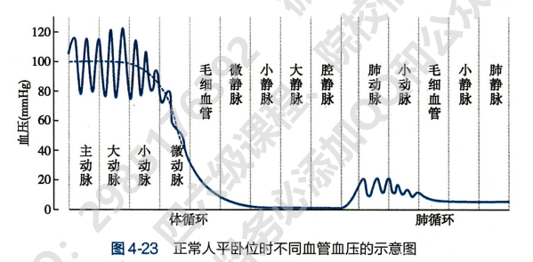

**血管的延迟顺应性**：

- 血容量突然增加时，血压先会迅速升高，随后管壁平滑肌缓慢延伸，血压将主键恢复到正常水平
- 血容量突然减少时，血压先会突然降低，随后由于血管平滑肌缓慢收缩血压恢复

所有平滑肌都有顺应性

血管的延迟顺应性的生理意义为**维持血压稳定**，例如在大量输血或失血时维持血压稳定

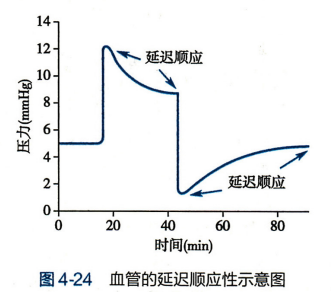

#### 动脉血压和动脉脉搏

##### 动脉血压

动脉血压通常指主动脉血压，形成条件有以下四个方面：

1. **心血管系统有足够的血液充盈**（有血）：动脉血压形成的**前提条件**
2. **心脏射血**：动脉血压形成的**必要条件**
   1. 心室收缩射血的能量一部分转换为血液流动的动能，一部分扩大动脉储存为势能。
   2. 心室舒张时动脉弹性回缩，储存的势能转换为血液动能，继续推动血液前进
3. **外周阻力**：主要是**小动脉和微动脉**对血流的阻力
   1. 外周阻力使得心室每次收缩射出的血液只有约 1/3 流到外周，其余血液**暂存**在主动脉和大动脉
   2. 因此使动脉血压升高
4. **主动脉和大动脉的弹性贮器作用**
   1. 心脏射血时，主动脉和大动脉扩张，可容纳一部分血液
   2. 心室舒张时，主动脉和大动脉弹性回缩推动血液进入外周
   3. 使**间断射血**转变为**动脉内持续流动的血液**
   4. 同时**维持舒张期血压**，使其不会过度降低

影响动脉血压的因素：

1. **心脏每搏输出量**
   1. 搏出量增加时，每次射入主动脉的血量增多，**收缩压增大**
   2. 动脉血压升高，血流速度增快，使心舒张末期存留在大动脉的血量增加不多，舒**张压升高较小**，**脉压**（收缩压和舒张压的差值）**增大**
2. **心率**：主要影响**舒张压**
   1. 心率加快，心室舒张期缩短，心舒期流向外周的血量减少，留存在主动脉的血量增多，**舒张压增大**
   2. 由于心舒期流出血量减少，因此心缩器主动脉血量增多，**收缩压也升高**；但由于血压升高血液流速加快，心缩期有较多血液外流，**收缩压升高程度较小，脉压减小**
3. **外周阻力**：主要影响**舒张压**
   1. 外周阻力增大，心舒期血液外流速度减慢，舒张压明显升高
   2. 心缩期，动脉血压升高使血流速度加快，收缩压升高不如舒张压明显，脉压减小
   3. 反之，外周阻力减小时，舒张压降低更明显，脉压减小
   4. 舒张压高低主要反映外周阻力大小
4. **主动脉和大动脉的弹性贮器作用**
   1. 若血管可扩张性降低，收缩压增高、舒张压降低，脉压加大
5. **循环血量与血管系统容量匹配情况**
   1. 一般循环血量略多于血管系统容量，保证一定的循环系统平均充盈压（动脉血压形成条件一）
   2. 如果大失血导致循环血量减少，则动脉血压下降
   3. 如果血管系统容量增大而循环血量不变，动脉血压下降

##### 动脉脉搏

**动脉脉搏：**每个心动周期中，动脉内压力和容积发生周期性变化，从而引起的**动脉管壁周期性波动**

动脉脉搏的波形：

1. 上升支：较陡，心室快速射血，动脉血压迅速上升，血管壁被扩张
2. 下降支
   1. 前段：心室射血后期，射血速度减慢，进入主动脉血量少于外流血量，大动脉开始回缩，动脉血压开始降低
   2. 后段：心室舒张，动脉血压继续下降
   3. 其中心室舒张、主动脉瓣关闭的瞬间，主动脉血液向心室反流冲击主动脉根部，造成血压短暂升高，形成降中波；降中波前一个切迹称为降中峡

下降支的形状可反映外周阻力大小：

1. 外周阻力大，下降速度慢，降中峡较高
2. 反之则下降速度快，降中峡较低

发生异常情况时动脉脉搏会异常，例如：

- 主动脉狭窄，射血阻力大（前文血液阻力一节说过血管口径是影响阻力最大因素），上升支较小
- 主动脉瓣关闭不全时，心舒期主动脉血液反流，使主动脉血压急剧降低，下降支陡峭

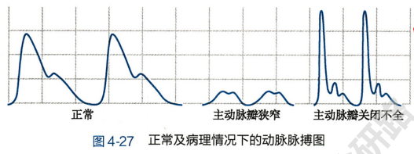

动脉脉搏可通过脉管壁传向末梢血管，动脉管壁的**可扩张性越大**，**脉搏传播速度就越慢**，在主动脉中传播速度最慢，在小动脉中最快

#### 静脉血压和静脉回心血量

##### 静脉血压

静脉血压已经很小，没有收缩压和舒张压之分，基本不受心脏活动的影响

中心静脉压：右心房和胸腔内大静脉血压

中心静脉压取决于：

1. 心脏射血能力：射血能力减弱，心房和腔静脉淤血，中心静脉压升高
2. 静脉回心血量：回心血量增多或回流速度快，中心静脉压升高

外周静脉压：各器官静脉血压

同时，重力对静脉压也会有影响。站立时足部血压相当于动脉压加上心脏到足部这么高的静水压

**跨璧压**：血液对管壁的压力与血管外组织对管壁压力之差

具有一定的跨璧压是血管充盈扩张的必要条件

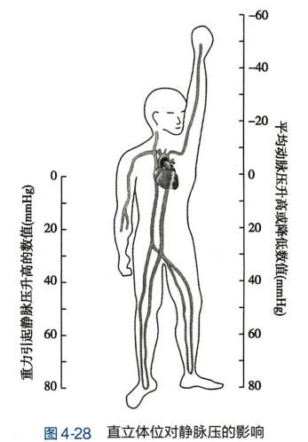

##### 静脉回心血量

静脉对血流的阻力很小，可以保证静脉回心血量

影响静脉回心血量的因素：

1. 体循环平均充盈压：是反映血管系统充盈程度的指标
   1. 充盈程度越高，静脉回心血量越多
   2. 血量增加或容量血管收缩，体循环平均充盈压升高，静脉回心血量增多；反之降低
2. 心肌收缩能力
   1. 心肌收缩能力强，射血量增多，心室剩余血量减少，心舒张期室内压较低，对心房和静脉血抽吸力越强，静脉回心血量增多
   2. 反之，心室剩余血量增多，舒张期室内压大，抽吸力小，静脉回心血量减少
3. 骨骼肌挤压作用
   1. 骨骼肌可挤压静脉加快静脉回流
   2. 骨骼肌和静脉瓣膜称为“肌肉泵”，肌肉泵做功可加速全身血液循环
4. 体位改变
   1. 体位改变可影响静脉跨璧压，改变静脉可扩展性从而影响静脉回心血量
   2. 例如平卧转位直立，下肢静脉跨璧压增大扩张，容纳更多血量，静脉回心血量减少
5. 呼吸运动
   1. 吸气时胸腔负压增大，右心房和大静脉扩张，利于外周静脉血液回流
   2. 呼气时胸膜腔负压减小，静脉回心血量减少
   3. 呼吸运动也称为“呼吸泵”

##### 静脉脉搏

外周静脉通常没有脉搏

静脉脉搏是右心房血压波动逆行传播，使**大静脉压力和容积周期性波动**

#### 微循环

**微循环**：微动脉与微静脉之间的血液循环

**微循环的组成**：

- 微动脉：微循环的起点，有平滑肌层控制管腔内径
- 后微动脉：管径更细，管壁只有一层平滑肌
- 毛细血管前括约肌：控制进入真毛细血管的血流量
- 真毛细血管：单层内皮细胞构成，没有平滑肌，通透性大
- 通血毛细血管

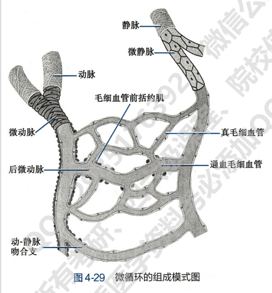

**微循环的血流通路**：

1. 迂回通路：**微动脉 - 后微动脉 - 毛细血管前括约肌 - 真毛细血管网 - 微静脉**，真毛细血管多、迂回曲折、通透性大，是**血液和组织液交换**的主要场所
2. 直捷通路：**微动脉 - 后微动脉 - 通血毛细血管**，流速较快，功能是使部分血液快速进入静脉，保证静脉回心血量
3. 动-静脉短路：微动脉 - 动-静脉吻合支 - 微静脉，速度快，无物质交换，功能是参与体温调节

**微循环的血流阻力**：

- 微循环中血流一般为层流
- 血流血流量与微动静脉血压差成正比
- 血流量与总血流阻力成反比
- 微循环血压取决于毛细血管前后阻力比值，比值增大则血压减小

**微循环血流量调节**：主要取决于**血管运动**，即后微动脉和毛细血管前括约肌间歇性收缩与舒张，以此调节毛细血管中的血流量/代谢产物清理

**微循环物质交换方式：**

- 扩散：物质扩散速率与浓度差、毛细血管壁通透性、有效交换面积有关
- 滤过和重吸收
  - 滤过：在毛细血管壁两侧静水压差和交替渗透差作用下，液体由毛细血管从内向外的移动
  - 重吸收：液体由外向内反向移动称为重吸收
- 吞饮：血浆蛋白

#### 组织液

组织液：由血浆经毛细血管壁滤到组织间隙形成的，是细胞生存的内环境

组织液的生成：

- 动态平衡
  - 毛细血管动脉段渗出产生组织液
  - 组织液从毛细血管静脉端回流入毛细血管
  - 组织液经淋巴管回流
- 动态平衡的影响因素
  - 毛细血管血压：向外
  - 组织液静水压：向内
  - 血浆胶体渗透压：向内
  - 组织液胶体渗透压：向外

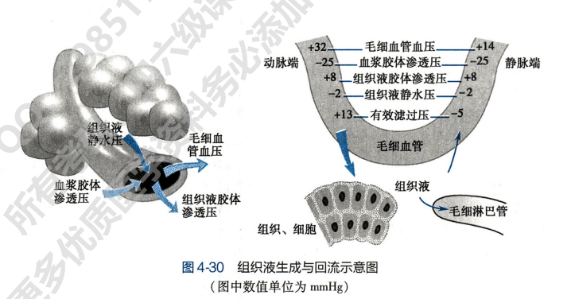

有效过滤压 = (毛细血管血压+组织液胶体渗透压) - (组织液静水压 + 血浆胶体渗透压)

有效过滤压为正值，说明毛细血管外渗透压大，有液体从毛细血管渗出反之则重吸收

影响组织液生成的因素：

1. 毛细血管有效流体静压：即毛细血管血压与组织液静水压的比值
   1. 是组织液生成主要因素
   2. 增大时会使组织液增多导致水肿
2. 有效胶体渗透压：血浆胶体渗透压与组织液胶体渗透压之差
   1. 是限制组织液生成主要力量
   2. 血浆胶体渗透压主要取决于血浆蛋白
3. 毛细血管壁通透性
   1. 一般血浆蛋白不渗出
   2. 若毛细血管壁通透性异常升高，血浆蛋白渗出，血浆胶体渗透压增大，组织胶体渗透压升高，有效滤过压增大，组织液生成增多导致水肿
4. 淋巴回流：部分组织液经淋巴系统回流

#### 淋巴液的生成与回流

淋巴系统由淋巴管、淋巴结、脾和胸腺等组成

淋巴管收集淋巴液后流入静脉

淋巴回流生理意义是回收蛋白质、运输脂肪及其他营养物质、调节体液平衡、防御与免疫

##### 毛细淋巴管结构与通透性

毛细淋巴管吸收组织液形成淋巴液

毛细淋巴管起始于盲端，盲端位于组织间隙，含有向内的瓣膜和丝状体

组织液较多时，**丝状体**拉开内皮细胞得到缝隙，**瓣膜**控制组织液及大分子单向进入淋巴管

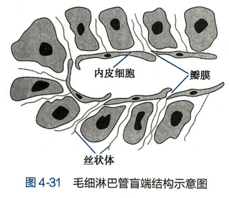

毛细淋巴管吸收组织液的动力是**组织液与毛细淋巴管内淋巴液之间的压力差**

##### 影响淋巴液生成和回流的因素

影响组织液压力的因素：

1. 毛细血管血压升高
2. 血浆胶体渗透压降低
3. 毛细血管壁通透性和组织液胶体渗透压增高

此时毛细血管渗出的组织液增多，与淋巴管内压力差变大，淋巴液增多

“淋巴管泵”可促进淋巴回流

### 心血管活动的调节

#### 神经调节

##### 心脏的神经支配

心脏受**心交感神经**和**心迷走神经**双重支配：

**心交感神经**：

- **节后纤维**释放**去甲肾上腺素**，作用于心肌细胞膜上 β1 受体，引起**正性变力/变力/变传导作用**(心肌收缩力增强、心率加快、传导速度增大等具体基质见教材 129 页)
- **左侧心交感神经**主要支配**房室交界**和**心室肌**，兴奋引起**心肌收缩力加强**
- **右侧心交感神经**支配**窦房结**，兴奋引起**心率加快**
- β1 受体拮抗剂可以消除心交感神经作用，可降心率、心收缩力等，减少心输出量、动脉血压

**心迷走神经**：

- 副交感神经节前神经元释放 ACh 作用于节后神经元 N1 受体
- 迷走神经节后神经纤维主要支配**窦房结**、**心房肌**、**房室交界**、**房室束**，对**心室肌支配很少**
- 心迷走神经节后纤维释放**ACh**作用于心肌细胞膜**M 受体**，引起负性变力/变时/变传导作用
- 心迷走神经对心房收缩减弱效果比心室更明显
- **右侧**迷走神经对窦房结影响占优，主要引起**心率减慢**；**左侧**对房室交界作用占优，主要引起**房室传导速度减慢**

支配心脏的肽能神经纤维：参与对心肌和冠状血管的调节

心脏传入神经：

- 心迷走神经传入纤维活动可抑制交感神经活动(类似负反馈)
- 心交感神经传入纤维引起交感神经活动增强(类似正反馈)

心交感紧张与心迷走紧张：心交感神经与心迷走神经**互相拮抗**

##### 血管的神经支配

支配血管平滑肌的神经称为血管运动神经，可分为两大类：

1. 缩血管神经
2. 舒血管神经

缩血管神经：

- 都是交感神经，故称为交感缩血管神经
- 节后纤维末梢释放去甲肾上腺素
  - 与**α 受体**结合引起血管平滑肌**收缩**；与**β2 受体**结合**舒张**
  - 与 α 结合能力更强，因此主要效应是血管收缩
- 基本所有血管都受交感缩血管神经支配，产生 1 到 3Hz 交感缩血管紧张
- 交感缩血管神经纤维在不同组织器官血管中分布密度不同
- 交感缩血管神经兴奋时，血管收缩，血流阻力增大，血压增大，血流量减少

舒血管神经纤维：

- **交感舒血管神经纤维**：节后神经末梢释放 ACh 作用于血管平滑肌膜 M 受体，引起骨骼肌舒张、血流量增加
- **副交感舒血管神经纤维**：释放 ACh 与 M 受体结合舒张
- 脊髓后根舒血管纤维

##### 心血管中枢

中枢神经系统中与控制心血管活动有关的神经元集合部位称为**心血管中枢**

- 脊髓
  - 交感节前神经元：支配心脏和血管
  - 副交感节前神经元：支配血管
  - 活动受高位中枢控制
  - 能完成原始的心血管反射，但调节能力低
- 延髓
  - 是调节心血管活动的最基本中枢
  - 延髓头部腹外侧区 RVLM 可产生和维持心交感神经和交感缩血管神经紧张性活动
  - 延髓尾端腹外侧区 CVLM 可抑制 RVLM 神经元活动，使紧张降低，血管舒张
  - NTS 是压力/化学/心肺感受器传入纤维的接替站，对多种传入信号整合，兴奋时迷走神经活动增强、交感神经受抑制
- 下丘脑 PVN
  - 在心血管活动整合中有重要作用
  - 调节心血管神经元活动
  - 压力感受性反射、肾脏反射、水盐平衡调节

##### 心血管反射

神经系统对心血管活动的调节是通过各种**心血管反射**进行的

1. 颈动脉窦和主动脉弓感受性反射

**感受性反射/降压反射**：动脉血压突然升高时，反射性引起心率减慢、心输出量减少、血管舒张、外周阻力减小、血压下降

动脉压力感受器：

- 颈动脉窦和主动脉弓外膜下的感觉神经末梢
- 动脉血压升高时，动脉壁被牵张程度加大，感受器冲入冲动
- 一般颈动脉窦感受器比主动脉弓更敏感

传入神经与神经中枢：

- 压力感受器传入神经传入冲动到延髓 NTS 后，与 CLVM 联系，抑制 RVLM，使交感神经紧张降低
- 使迷走神经紧张增强

反射效应：

- 动脉血压升高
- 压力感受器传入冲动增多，压力感受性反射增强
- 心迷走神经加强、心交感紧张和交感缩血管紧张减弱
- 最终导致心率减慢，心输出量减少，外周阻力减少，动脉血压下降

**窦内压(颈动脉窦/压力感受器)**与**动脉血压**变化关系曲线称为**压力感受性反射功能曲线**

- 动脉压 = 窦内压的点为调定点/反射平衡点，可以理解为恰没有反射
- 当窦内压增大或减小时，动脉压会因反射相而反变化
- 曲线中间段较陡、两端平缓，说明在血压在正常范围变化时，反射最敏感，纠正异常血压能力最强

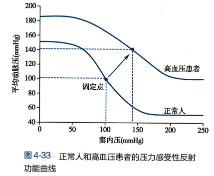

压力感受性反射的生理意义：

- 是典型的负反馈调节，可在短时间内快速调节动脉血压，维持动脉血压相对稳定
- 但压力感受性反射对快速变化的血压敏感，但对缓慢变化的血压不敏感，因此在长期调节中作用不大

2. 颈动脉体和主动脉体的化学感受性反射

化学感受性反射：

- 感受器：颈动脉体和主动脉体化学感受器可感受动脉血中 O2 降低、CO2 升高、H+升高等刺激
- 传入神经：窦神经和迷走神经
- 中枢：延髓
- 效应器：芫荽内呼吸运动神经元和心血管活动神经元改变

化学感受性反射的效应：

- 调节呼吸，反射性引起呼吸加深加快
- 通过呼吸改变，再影响心血管活动，心率/心输出量/外周阻力/血压升高
- 只有在缺氧缺血等情况才起调节作用

3. 心肺感受器引起的心血管反射

心肺感受器可感受两类刺激：机械牵张刺激和化学物质刺激

这些感受器主要依赖静脉回心血量，能探测循环系统充盈度，又称容量感受器

容量感受性反射：

- 心房血压升高、血容量增大使心房壁受牵张加强时容量感受器兴奋
- 传入冲动经迷走神经到达中枢
- 引起交感神经抑制、迷走神经兴奋，使心率/心输出量/外周阻力/血压下降
- 同时降低升压素和醛固酮水平，增加肾排水排钠，降低循环血量和细胞外液量

#### 体液调节

**体液调节**指血液或组织液中的化学物质对心肌和血管平滑肌活动的调节

##### 肾素-血管紧张素系统

肾素-血管紧张素系统 RAS 是人体重要的体液调节系统，构成为：

- 肾素：肾脏近球细胞分泌的酸性蛋白酶
- 交感神经兴奋、肾血流量减少/Na+降低时，肾素分泌增多，由肾静脉进入血液循环启动 RAS 反应
  - 肾素可将血浆或组织中的血管紧张素原水解为血管紧张素 I(Ang I)
  - Ang I 被血管紧张素转换酶切割为 Ang II
  - 进一步酶解为 Ang III
  - 上述的 Ang I、II、III 在不同酶作用下可形成不同肽链的血管紧张素

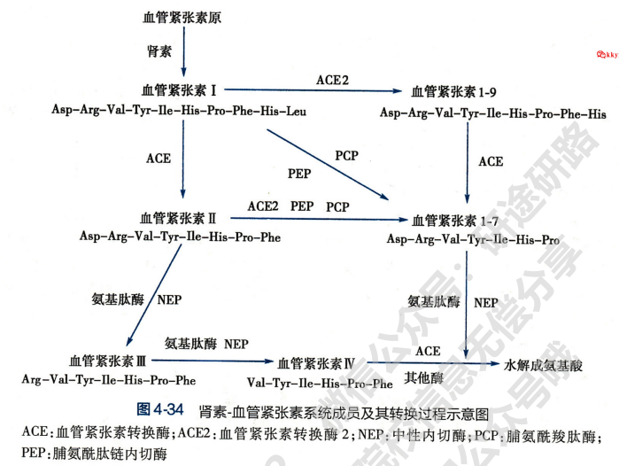

血管紧张素家族主要成员的生理作用：

1. **Ang II 的生理作用**
   1. 缩血管
   2. 促进交感神经末梢释放去甲肾上腺素
   3. 对中枢神经系统
      1. 降低压力感受性反射的敏感性
      2. 促进垂体释放血管升压素
      3. 增强促肾上腺皮质激素释放激素的作用
   4. 促进醛固酮合成和释放
2. Ang I 不具有生物活性
3. Ang III：与 Ang II 相似，缩血管效应较弱，刺激肾上腺皮质合成和释放醛固酮较强
4. Ang Iv：调节脑和肾皮质血流量

##### 肾上腺素和去甲肾上腺素

肾上腺素和去甲肾上腺素主要来自肾上腺髓质

肾上腺素：

1. 与 α 和 β(β1 和 β2)受体结合
   1. 在心脏与 β1 受体结合产生正性变时/变力作用
   2. 在血管，与 α/β2 受体结合，使血管收缩/舒张
2. 可在不改变外周阻力的情况下增加心输出量

去甲肾上腺素：

1. 主要与 α 和 β1 受体结合，与 β2 结合较弱
2. 可使全身血管收缩，外周阻力增加，动脉血压升高
3. 血压升高又使压力感受性反射活动增强，超过 NE 对心脏的效应，导致心率减慢

##### 血管升压素

血管升压素 VP 由下丘脑合成，经下丘脑-垂体束运输到垂体储存，需要时释放进入血液

VP 与集合管上的 V2 受体结合可促进水的重吸收，因此又叫**抗利尿激素**

VP 作用于血管平滑肌的 V1 受体引起血管收缩、血压升高

一般 VP 先抗利尿，再升血压

##### 血管内皮生成的血管活性物质

血管内皮细胞可释放多种血管活性物质：

1. 舒血管物质：NO、前列环素 PGI2 和内皮超极化因子 EDHF 等。Ach 促进舒血管物质 NO 的释放引起舒血管
2. 缩血管物质：内皮素 ET，是已知最强的缩血管物质

##### 激肽释放酶-激肽系统

激肽释放酶可分解激肽原为激肽，激肽可引起血管平滑肌舒张

激肽作用于血管内皮细胞上的 B2 受体，可刺激 NO，PGI2 和 EDHF 舒血管

##### 心血管活性多肽

1. 心房钠尿肽 ANP：钠尿肽 NP 分为心房钠尿肽 ANP、脑钠尿肽 BNP 和 C 型钠尿肽 CNP
   1. ANP 可利钠和利尿，抑制集合管对那的重吸收
   2. 可抑制肾素、醛固酮和血管升压素的合成与释放，利钠利尿
   3. 可舒张血管，降低血压
   4. 调节细胞增殖
2. 肾上腺髓质激素 ADM：
   1. 使血管舒张
   2. 在心脏可产生正性肌力作用，保护心脏
   3. 使肾排钠排水增多
3. 尾升压素 II
4. 阿片肽
5. 降钙素基因相关肽

##### 气体信号分子

1. 一氧化碳：舒血管作用
   1. 激活 sGC，增加 cGMP，使血管舒张
   2. 刺激钾通道开放，促进 K+外流，超极化(静息电位增加)
2. 硫化氢：舒血管、维持血压稳态
   1. 作用于钾通道，使 K+外流增加超极化
   2. 浓度依赖性抑制血管平滑肌细胞增殖

##### 前列腺素

前列腺素 PG 是一族不饱和脂肪酸

全身各处都含有其前体和酶

- PGE2 由肾脏产生，舒血管
- PGI2 在血管组织合成，强烈舒血管
- PGF2α 可使静脉收缩

##### 细胞因子

瘦素主要调节脂肪代谢，但也可以降低 NO、增加肾小管对 Na 的重吸收等，使血压升高

脂联素

#### 自身调节

心血管活动的自身调节包括

- 心脏泵血功能的自身调节：见前文影响心输出量的异长、等长自身调节
- 组织器官血流量的自身调节：**局部代谢产物学说**和**肌源学说**

##### 代谢性自身调节

1. 器官组织代谢水平越高，代谢产物越多，O2 分压越少
2. 局部微动脉和毛细血管前括约肌舒张
3. 血流量增加移出代谢产物、改善缺氧

这个过程称为**代谢性自身调节**

前面微循环中说的毛细血管前括约肌交替开放就是典型的代谢性自身调节

##### 肌源性自身调节

肌源性活动：血管平滑肌本身经常保持一定的紧张性收缩

- 器官血管灌注压升高时
  - 血管平滑肌受牵张刺激
  - 血管收缩，阻力增大
  - 避免器官血流量因灌注压升高而增多
- 反之灌注压减少时
  - 血管舒张，阻力减少
  - 使器官血流量不会明显减少

肌源性自身调节的意义使血压变化时使器官的血流量保持相对稳定

#### 动脉血压的长期调节

短期调节：对短时间内发生的血压变化进行调节，主要通过神经调节

长期调节：血压在较长时间内发生变化，主要靠**肾-体液控制系统**

1. 细胞外液增多，循环血量增多，动脉血压升高
2. 直接导致肾排钠排水增多，将过多体液排出，降血压

循环血量与血管系统容量会影响平均动脉压高低：循环血量增多时，回心血量和心输出量增加使动脉血压升高

而血压的改变也能影响循环血量：动脉血压升高，肾血流增多，肾小球过滤率升高，排水排钠增多，循环血量回降，动脉血压降低

影响肾-体液控制系统活动的主要因素：

1. 血管升压素/抗利尿激素释放减少，集合管对水的重吸收降低，肾排水增加，细胞外液减少
2. 心房钠尿肽增多，使肾对钠和水的重吸收减少，排水排钠增加，细胞外液减少
3. RAS 系统被抑制，肾素减少，AngII 减少，血管收缩减弱，血压回降
4. 交感神经系统相对抑制，心肌收缩力减弱，心率减慢，心输出量减少，外周血管舒张，血压回降

### 器官循环

器官血量与动静脉压力差成正比(动脉-静脉)；与血流阻力成反比

本节主要叙述心、肺、脑的血液循环

#### 冠脉循环

冠脉循环的生理特点：

1. 灌注压高，血流量大：
   1. 冠状动脉开口于主动脉根部，开口处血压等于主动脉压
   2. 同时血流阻力小，因而冠脉小血管血压和灌注压仍较高
   3. 冠脉血流量 CBF 取决于心肌活动水平，剧烈活动时冠脉达到最大舒张，CBF 为安静时的 5 倍
2. 摄氧率高，耗氧量大
   1. 摄氧率高达 70%
   2. 剧烈运动时，心肌主要靠扩张冠脉血管增加 CBF
3. 血流量受心肌收缩发生周期性变化
   1. 由于冠脉分支多数埋在心肌组织中，因此心肌周期性收缩会影响 CBF
   2. 心室收缩时，压迫肌纤维间的小血管使 CBF 减少
   3. 快速射血期主动脉压/冠状动脉压升高，CBF 增加
   4. 减慢射血期，CBF 减少
   5. 舒张期心肌对冠脉压迫减少，CBF 迅速增加，后逐渐减少
   6. 由于左心室肌肉比右心室厚，对 CBF 的影响更明显

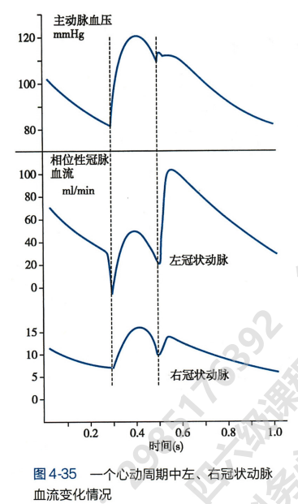

冠脉血流量 CBF 的调节：

1. 心肌代谢水平调节：
   1. **心肌代谢增强**时，耗氧增加，**ATP 分解**多于合成，产生 ADP 和 AMP
   2. 冠脉血管周围间质细胞中的**5'-核苷酸酶**可将**AMP**分解产生**腺苷**
   3. **腺苷**有强烈**舒张小动脉作用**，使冠脉舒张
2. 神经调节
   1. 交感神经兴奋，激活冠脉平滑肌 α 受体使其收缩；也激活心肌 β1 受体使心脏活动增强，代谢产物增多，使冠脉舒张
   2. 迷走神经兴奋，激活冠脉平滑肌 M 受体使其舒张；激活心肌 M 受体抑制心脏活动，代谢水平降低，时冠脉收缩
3. 体液调节
   1. 肾上腺素与去甲肾上腺素增强心肌代谢水平使 CBF 增加
   2. 甲状腺激素可提高心肌代谢，使冠脉舒张
   3. NO 和 CGRP 舒张冠脉，使 CBF 增加
   4. Ang II 和大剂量 VP 可使冠状动脉收缩，CNF 减少

#### 肺循环

肺循环：血液由右心室射出 - 肺动脉 - 肺毛细血管 - 肺静脉- 左心房

肺循环的任务是将含氧较低的静脉血转变为含氧较高的动脉血

肺循环的生理特点：

1. 血流阻力小、血压低
2. 血容量大，变化也大
   1. 吸气时，胸腔负内压增大
   2. 右心房静脉回心血量增大，右心室搏出量增多
   3. 肺循环血管因肺扩张而扩张，肺静脉流入左心房血量减少，左心室搏出量减少
   4. 扩张的肺循环血管慢慢被充盈，肺静脉流入左心房血量回升
   5. 呼吸过程中的血压波动称为动脉血压的呼吸波
3. 毛细血管的有效滤过压较低
   1. 有利于肺毛细血管有液体持续进入组织间隙
   2. 湿润肺泡或者通过肺淋巴管返回血液循环

肺循环血流量的调节：

1. 组织化学因素：
   1. 缺氧时，O2 分压少，CO2 分压升高时，**肺循环血管收缩（与体循环相反，体循环血管缺氧时会舒张）**
   2. 生理意义是：当某处血管氧气低时，血管收缩，使血液转移到氧气更充足的肺泡
2. 神经调节
   1. 交感神经直接效应使肺血管收缩和血流阻力增大
   2. 但交感神经兴奋使体循环血管收缩，可将部分血液挤入肺循环，增加肺循环血流量
3. 体液调节
   1. 肾上腺素、去甲肾上腺素、Ang II 等可使肺循环微动脉收缩
   2. 组胺、5-羟色胺等可使肺循环静脉收缩

#### 脑循环

脑内血液来自颈内动脉和椎动脉，各自发出分支营养脑组织，部分毛细血管伸入脑室分泌脑脊液，最后脑毛细血管血液和脑脊液都汇入静脉

脑循环的特点：

1. **血流量大，耗氧量大**：脑组织代谢水平高，能量几乎都来自糖有氧氧化，耗氧量大
2. **血流量变化小**
   1. 颅腔：有脑组织、脑血管和脑脊液
   2. 颅腔容积固定，脑组织和脑脊液不可压缩，脑血管舒缩程度有限
3. 存在**血-脑脊液屏障**和**血-脑屏障**

脑脊液：

- 无色透明液体，含极少量细胞
- 更新率高，每天生成的脑脊液都被吸收入血
- Na+和 Mg2+浓度较高，蛋白质、葡萄糖、K+含量也低

脑脊液功能：

- 主要功能使缓冲外力冲击
- 由于脑脊液有浮力，也可以减轻脑组织重量，避免脑组织对颅底神经压迫
- 也是脑和脊髓神经和血液进行物质交换的媒介

血-脑脊液屏障：

- 阻止**血液和脑脊液**物质的自由交换
- 是脉络丛细胞见的紧密连接和脉络丛细胞中运输物质的特殊载体系统
- 有主动运输载体，运输 Na+或 Mg2+等
- 阻止大分子物质进入脑脊液

血-脑屏障：

- 限制物质在**血液和脑组织**中物质的自由交换
- 水和游离的脂溶性物质容易通过
- 水溶性物质通过毛细血管内皮转运体运输
- 蛋白质和多肽一般不能通过

**血-脑脊液屏障和血-脑屏障的生理意义**：保持脑组织内环境理化因素稳定，防止血液中有害物质进入脑组织

**脑血流量的调节**：

1. 自身调节：脑血流量主要依靠自身调节维持
2. CO2 分压与低氧
   1. CO2 分压升高和低氧可直接引起血管舒张
   2. 化学感受性反射中，CO2 升高和低氧会使血管收缩
   3. 但化学感受性反射的缩血管效应很低，因此还是舒张为主
3. 神经调节

## 第五章 呼吸

呼吸：机体与外界环境进行物质交换的过程

呼吸包括三个环节：

1. **外呼吸**：肺毛细血管血液与外界环境气体交换过程，包括两个过程
   1. **肺通气**：肺泡与外界环境气体交换
   2. **肺换气**：肺泡与肺毛细血管血液气体交换
2. **气体运输**：O2 和 CO2 在血液中运输
3. **内呼吸**：组织细胞与组织毛细血管气体交换及组织细胞内氧化代谢过程

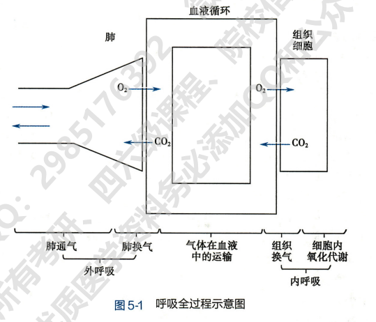

### 肺通气

肺通气使肺泡气不断更新，使肺泡气 O2 和 CO2 分压稳定（因为与血液进行气体交换后会使 PO2 降低、PCO2 升高）

呼吸道是气体进出肺的通道，不断分支形成气管-支气管树

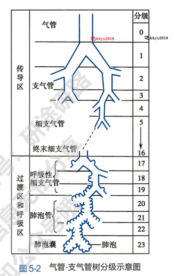

呼吸系统主要功能是：

1. **呼吸道**对吸入气体加温、加湿、过滤、清洁功能
2. **呼吸道**防御性呼吸反射，如咳嗽反射、喷嚏反射
3. **肺泡**是**肺换气**主要场所
4. **胸膜腔**连接肺和胸廓，内负压使肺随胸廓张缩而张缩
5. 膈和胸廓中的**胸壁肌**是产生呼吸运动的动力组织

#### 肺通气原理

**肺通气的直接动力**：肺泡气与外界大气之间的压力差

**肺通气的原动力**：呼吸肌张缩引起的节律性呼吸运动

呼吸肌张缩引起胸廓张缩，从而引起肺的张缩，导致肺内压变化，使气体进入或排出胸腔

##### 呼吸运动

呼吸肌张缩引起的胸廓节律性张缩称为**呼吸运动**，包括两个过程：

1. 吸气运动：胸廓扩大
2. 呼气运动：胸廓缩小

吸气：吸气时，胸腔上下径、前后径、左右径增大，胸腔扩大，肺容积增大，肺内压降低，外界气体流入肺

呼气：是一个被动过程，呼气肌不参与，由膈肌和肋间外肌舒张，引起胸腔和肺容积减小，肺内压升高，气体流出

呼吸运动的型式有：

1. 腹式呼吸和胸式呼吸
2. 平静呼吸和用力呼吸

##### 肺内压

肺内压指肺泡内气体压力，呈周期性变化：

1. 吸气时，肺容积增大，肺内压降低，低于大气压时气体流入
2. 随着气体流入肺，肺内压回升，升至与大气压相等时吸气停止
3. 呼气，肺容积减小，肺内压增大，大于大气压时气体流出
4. 随着气体流出，肺内压减小，等于大气压时停止

##### 胸膜腔内压

**胸膜腔**：肺表面的脏层胸膜和胸廓内壁的壁层胸膜之间的有少量浆液的间隙

**胸膜腔内压**：胸膜腔内的压力，始终低于大气压为**负压**

胸膜腔内压的形成与两种力有关：

1. 肺内压，使肺泡扩张
2. 肺回缩压，使肺泡缩小

$$
胸腔膜内压 = 肺内压+(-肺回缩压)
$$

呼吸气末，肺内压等于大气压，此时有

$$
胸腔膜内压 = 大气压+(-肺回缩压)
$$

若大气压计为 0，则

$$
胸膜腔内压=-肺回缩压
$$

因此，**胸膜腔内压主要由肺回缩压决定**

胸膜腔内压为负压有重要的**生理意义**：

1. 扩张肺
2. 使肺随胸廓的张缩而张缩
3. 使胸腔内的腔静脉和胸导管扩张，利于静脉血和淋巴液回流

如果空气进入胸膜腔导致负压消失，肺回缩，不会随胸廓张缩而张缩，肺不张

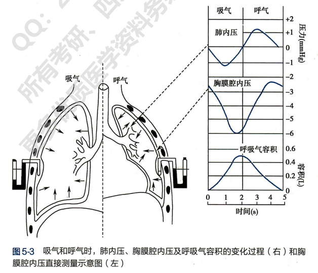

##### 肺通气阻力

肺通气过程中的阻力可分为两种：

1. 弹性阻力：肺/胸廓弹性阻力
2. 非弹性阻力：气道阻力、惯性阻力和组织粘滞阻力

**弹性阻力**可用**顺应性的高低**来衡量

**顺应性**：弹性组织在外力作用下发生形变的难易程度

顺应性越大，变形能力越强，即在较小外力下课发生较大的变性，计算公式为

$$
C=\frac{\triangle V}{\triangle P}(L/cmH_2O)
$$

表示单位跨璧压的变化$\triangle P$引起的腔内容积的变化$\triangle V$

如下图，相同跨璧压下，左侧容积变化大于右侧，故顺应性大于右侧

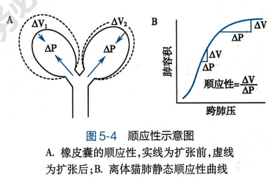

**弹性阻力与顺应性互为倒数**，即顺应性越大、越容易变性，说明弹性阻力越小

肺的在被扩张时产生的弹性回缩力，与肺扩张方向相反，是吸气的阻力，呼气的动力。肺弹性阻力的顺应性可表示为

$$
肺顺应性C_L=\frac{肺容积的变化\triangle V}{跨肺压的变化\triangle P}(L/cmH_2O)
$$

上图右侧为**肺容积-压力曲线图**，斜率表示肺顺应性，斜率越大，肺顺应性越高，弹性阻力越低

同时，**肺顺应性还受到肺总量的影响**

**肺总量**：指肺能容纳的最大气体量

- 肺总量较大者，吸入相同体积$\triangle V$气体，肺扩张程度变化小，弹性回缩力小，只需要较小跨肺压，顺应性大
- 肺总量较大者，扩张程度大，弹性回缩力大，需要更大的跨肺压，顺应性小

为了将肺总量也纳入肺顺应性的影响因素，定义比顺应性为肺顺应性除以肺总量得到

$$
比顺应性=\frac{平静呼吸时的肺顺应性(L/cmH_2O)}{功能余气量(L)}
$$

肺弹性阻力的来源包括：

1. 肺弹性成分
   1. 肺弹力纤维
   2. 胶原纤维
2. 肺泡表面张力：
   1. 表面张力有使表面尽可能缩小的倾向，有助于肺的回缩
   2. 是肺弹性阻力的主要来源

如下图：

- 注入生理盐水时的肺内压远小于充空气时，因为没有了肺泡表面张力
- 肺泡表面张力会导致滞后现象，即肺扩张和收缩顺应性曲线不重合

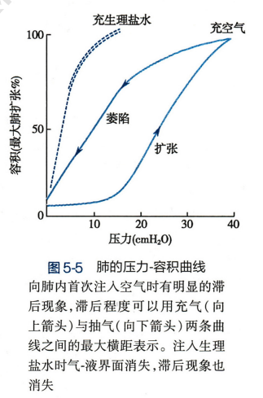

由 Laplace 定律：

$$
P=\frac{2T}{r}
$$

其中：

- P 为肺泡内液-气界面的压强(N/m2)
- T 为表面张力系数(N/m)
- r 为肺泡半径(m)

由此可见，小肺泡(r 小)回缩力大，大肺泡回缩力小

如果没有肺表面活性物质，气体会从小肺泡流向大肺泡，肺泡失去稳定性

但**肺表面活性物质**可以使两者压力相等

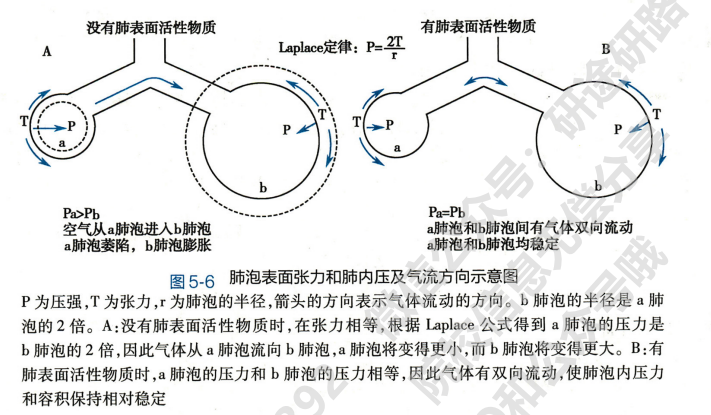

**肺表面活性物质**是脂质和蛋白质混合物

其主要作用是**降低肺泡表面张力**，**减少肺泡回缩力**，生理意义是：

1. **减小吸气阻力**
2. **维持不同大小肺泡稳定性**
   1. 肺泡变小时，膜面积减小，表面活性物质密度增大，降低表面张力作用增强，抵消表面张力增加量
   2. 反之，肺泡增大时，表面活性物质密度降低，降张力作用减弱
3. **防止肺水肿**：通过降低表面张力，降低表面张力对肺毛细血管和肺组织间液的抽吸作用，防止肺水肿

胸廓弹性阻力和胸廓顺应性：

- 自然状态时肺容量约为肺总量的 67%
- 小于 67%时，胸廓向内缩小，弹性阻力向外，吸气动力呼气阻力
- 大于 67%时，胸廓向外扩大，弹性阻力向内，吸气阻力呼气动力

这与肺不同，肺弹性阻力始终是吸气的阻力

$$
胸廓顺应性C_{chw}=\frac{胸腔容积变化\triangle V}{跨胸壁压的变化\triangle P}(L/cmH_2O)
$$

其中跨胸壁压为胸膜腔内压与胸壁外大气压之差

因为肺和胸廓呈串联关系，所以肺和胸廓的总弹性阻力为两者弹性阻力之和，可以用顺应性倒数表示

$$
\frac{1}{C_{L+chw}}=\frac{1}{C_L}+\frac{1}{C_{chw}}
$$

对于非弹性阻力，包括：

- 惯性阻力
- 粘滞阻力：呼吸时组织间的摩擦
- 气道阻力：气体与气道壁摩擦产生的阻力

**气道阻力**可用**维持单位是按气体流量所需的压力差**来表示：

$$
气道阻力=\frac{大气压与肺内压之差(cmH_2O)}{单位时间内气体流量(L/s)}
$$

气道阻力越大，维持流量所需的压力差就需要越大

#### 肺通气功能的评价

##### 肺容积和肺容量

**肺容积**：不同状态下肺所能容纳的气体量，可分为：

1. **潮气量**：每次呼吸时吸入或呼出的气体量
2. **补吸气量**：平静吸气末，再尽力吸气所能吸入的气体量，可反映吸气储备量
3. **补呼气量**：平静呼气末，尽力呼气所能呼出的气体量，反应呼气的储备量
4. **余气量**：最大呼气末尚留存于肺内不能呼出的气体量，余气量可避免肺泡塌陷

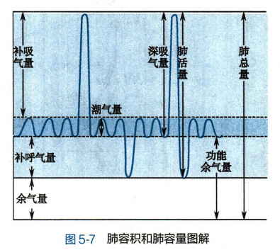

**肺容量**：指肺容积中两项及以上的联合气体量，包括：

1. **深吸气量**：平静呼气末做最大吸气时能吸入的气体量 = 潮气量 + 补吸气量，**可衡量最大通气潜力**
2. **功能余气量**：平静呼气末尚存留于肺内的气体量 = 余气量 + 补呼气量，生理意义是**缓冲呼吸过程中肺泡气 O2 和 CO2 分压**，通过功能余气量的稀释作用使 O2 和 CO2 分压不会突然升高或降低很多
3. **肺活量**：尽力吸气后，从肺内所能呼出的最大气体量 = 补吸气量 + 潮气量 + 补呼气量，**可反映一次通气的最大能力**

##### 肺通气量和肺泡通气量

**肺通气量**：每分钟吸入或呼出的气体总量 = 潮气量 × 呼吸频率

**最大随意通气量**：尽力作深、快呼吸时，每分钟能吸入或呼出的最大气体量，**反映单位时间按充分发挥所有通气潜力所能达到的通气量**

平静时的每分通气量与最大通气量比较，可以了解通气功能的储备能力，定义**通气储量百分比**如下：

$$
通气储量百分比=\frac{最大通气量-每分平静通气量}{最大通气量}\times100\%
$$

即通气储量占最大通气量的百分比

当肺或胸廓的顺应性降低、呼吸肌收缩力减弱或气道阻力增大时，可使最大随意通气量降低

无效腔：

- 解剖无效腔：吸入气体停留在呼吸道内不参与肺泡与血液的气体交换，这部分呼吸道的容积称为解剖无效腔
- 肺泡无效腔：部分气体随有通气但无血流，未进行气体交换，称为肺泡无效腔

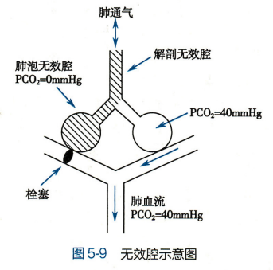

因为有无效腔的存在，吸入气体并不能全部到达肺泡并进行有效气体交换，因此肺通气量不能全面反映气体交换状况，因此引入**肺泡通气量**

**肺泡通气量**：每分钟吸入肺泡的新鲜空气量

**肺泡通气量 = (潮气量 - 无效腔气量) × 呼吸频率**

##### 最大呼气流-容积曲线

尽力吸气后，尽力尽快呼气至余气量，记录呼出气量和流速，可绘成最大呼气流速随肺容积变化的曲线，即最大呼气流速-容容积(MEFV)曲线

正常情况，升支较陡，呼气流速升高很快到顶；随后逐渐下降

小气道阻塞时，最大呼气流速(顶峰)下降，降支下移

##### 气道反应性测定

又称支气道激发试验(BPT)，测试支气管对吸入吸积性物质产生收缩反应程度的试验

先吸入激发剂(如组胺或乙酰胆碱触发过敏)，然后测定通气功能指标

##### 呼吸功

呼吸功：呼吸肌在呼吸运动中克服通气阻力所做的功

呼吸功(J) = 跨璧压(cmH2O) × 肺容积(L)

### 肺换气和组织换气

#### 气体交换基本原理

气体的扩散：存在气压差时，气体分子会从气压高处向气压低处转移

肺换气和组织唤起均以扩散方式进行

**气体扩散速率 D**：单位时间内气体扩散的容积

**Fick 弥散定律**定义了气体扩散速率的计算公式：

$$
D \propto \frac{\triangle P \cdot T \cdot A \cdot S}{d \cdot \sqrt{MW}}
$$

其中：

- D：气体扩散速率
- $\triangle P$ ：两侧气体分压差
  - 混合气体中某种气体的分压 = 混合气体总气压 × 气体容积百分比
  - 是气体扩散的动力，决定扩散方向
- T：温度
  - 在人体中体温一般恒定，可忽略
- A：扩散面积
  - 扩散面积越大，所扩散的分子总数越多
- S：气体分子溶解度
  - 单位分压下溶解于单位容积溶液中的气体量
  - 当扩散发生于气相和液相之间时，溶解度越大，越容易扩散到溶液
- d：扩散距离
  - 扩散距离越大，扩散所需的时间越长
- MW：气体分子量
  - 分子量小的气体扩散越快

一般将$S/\sqrt{MW}$称为扩散系数，它们只取决于分子本身的性质

#### 肺换气

##### 肺换气过程

1. 静脉血中，一般 PO2 较小、PCO2 较大
2. 流经肺毛细血管时，O2 由肺泡气向血液扩散，CO2 由血液向肺泡气扩散
3. 换气过程很快就能到达平衡

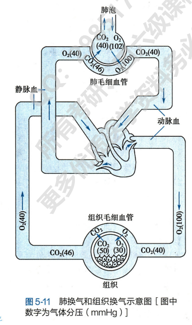

##### 影响肺换气的因素

1. 呼吸膜的厚度
   1. 气体在血液与肺泡中交换需要经过呼吸膜
   2. 呼吸膜越厚，扩散距离越长，扩散所需时间越长，单位时间交换的气体量越少
   3. 人体呼吸膜很薄，利于气体交换

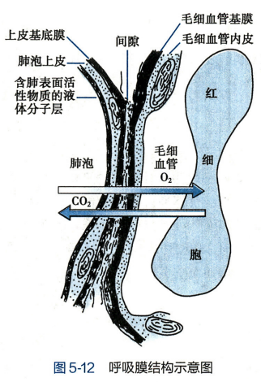

2. 呼吸膜面积：气体扩散速率与扩散面积成正比(见上文 Fick 弥散定律)
3. 通气/血流比值
   1. 定义：每分钟肺泡通气量($\dot{V_A}$) 和每分钟肺血流量($\dot{Q}$)的比值$\dot{V_A}/\dot{Q}$
   2. 比值过大，说明通气过度或血流不足，部分肺泡气提未能进行气体交换，肺泡无效腔增大
   3. 比值过小，说明通气不足或血流过多，静脉血中气体不能充分更新
   4. 比值异常时主要影响是缺 O2 而非 CO2 滞留，原因是：
      1. PO2 差远大于 PCO2 差
      2. CO2 扩散系数约为 O2 的 20 倍，CO2 扩散快
      3. 气体交换可刺激呼吸，增加肺通气量，有助于 CO2 排出，但无助于 O2 摄入

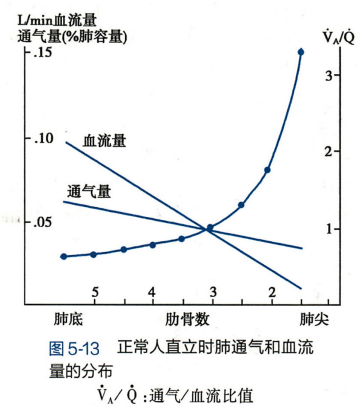

##### 肺扩散容量

扩散容量$D_L$：单位分压差下，每分钟通过呼吸膜扩散的气体毫升数

$$
D_L=\frac{V}{|{P_A}-{P_C}|}
$$

其中：

- V：每分钟通过呼吸膜扩散的气体量(ml/min)
- $P_A$：肺泡气中某种气体的分压
- $P_C$：肺毛细血管血液内该气体的分压

肺扩散容量是衡量呼吸气体通过呼吸膜能力的指标

#### 组织换气

组织换气：体循环毛细血管中血液与组织细胞之间的气体交换

机制与影响因素与肺换气类似，不同点在于

- 扩散发生于液相之间
- 扩散膜两侧 O2 和 CO2 分压差会随细胞内氧化代谢和血流量改变

### 气体在血液中的运输

O2 和 CO2 均以物理溶解和化学结合两种形式运输

物理溶解：气体在液体中的**溶解量**与**分压和溶解度成正比**，与**温度成反比**

物理溶解运输占比极小，**主要依靠化学结合运输**

因此下面主要讨论化学结合形式的运输

#### 氧的运输

氧的运输主要靠血红蛋白(Hb)作为载体，Hb 也参与 CO2 的运输

Hb 的分子结构：

1. 由 1 个珠蛋白和 4 个血红素组成，每个血红素基团中心为$Fe^{2+}$
2. Fe2+可与 O2 结合
3. 珠蛋白有 4 条肽链，每条和一个血红素结合成亚单位
4. 4 个亚单位直接通过盐键连接
5. Hb 与 O2 结合或解离会影响盐键的形成或断裂，改变 Hb 与 O2 的亲和力

Hb 与 O2 结合的特征：

1. 结合反应迅速而可逆，不需要酶催化，受 PO2 影响，反应方程如下：

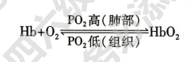

2. 结合是氧合而非氧化，Fe2+化合价不变
3. 1 分子 Hb 可结合 4 分子 O2(4 个血红素/Fe2+)，以下指标衡量 Hb 结合 O2 的量
   1. Hb 氧容量：100ml 血液中，Hb 所能结合最大 O2 量
   2. Hb 氧含量：100ml 血液中，Hb 实际结合 O2 量
   3. Hb 氧饱和度：Hb 氧含量与 Hb 氧容量的百分比
4. 解离曲线呈 S 型(见下文)
   1. Hb有两种构象，紧密型T型(对O2亲和力低)和疏松型R型(亲和力强)
   2. 4个亚单位之间有协同效应
      1. 1个亚单位结合O2后其他亚单位更容易结合
      2. HbO2一个亚单位释放O2后其他亚单位更容易释放

**氧解离曲线**：**血液PO2**(O2的分压)与**Hb氧饱和度**之间的关系曲线，可分为3段：

1. 上段：曲线平坦，说明PO2较高时，对Hb氧饱和度影响不大，因Hb氧饱和度已接近上限
2. 中段：曲线较陡，可反映安静状态下血液对组织的供O2情况
3. 下段：曲线最陡，PO2较小变化可导致Hb氧饱和度明显改变，可反映 血液供O2的储备能力

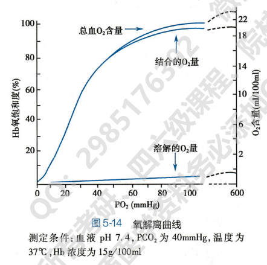

影响氧解离曲线的因素：

1. 血液pH和PCO2
   1. pH降低或PCO2升高，Hb对O2亲和力降低，P50增大(需要更多氧Hb才能达到50%含氧量)，曲线右移
   2. 反之，pH增加或PCO2降低，曲线左移

血液酸度和PCO2对Hb与O2亲和力的影响称为**波尔效应**

- 机制：pH改变会改变Hb的构象，使盐键形成/断裂，Hb向T型/R型转变
- 生理意义
  - **促进肺毛细血管血液摄取O2**：血液流经肺，CO2向肺泡扩散，PCO2降低，pH增大，使Hb与O2亲和力增强
  - **促进组织毛细血管血液释放O2**：血液流经组织，CO2从组织向血液扩散，血液PCO2增加，pH下降，Hb与O2亲和力降低，释放O2到组织供氧

2. 温度

   1. 温度升高，H+活度增加，降低Hb对O2亲和力；反之增加亲和力
   2. 低温有利于降低组织耗氧量，但同时也会增加Hb与O2亲和力，HbO2释放O2减少可能导致组织缺氧
3. 红细胞内2,3-二磷酸甘油酸(2,3-DPG)

   1. 2,3-DPG可形成盐键或使H+升高
   2. 因此，2,3-DPG升高，Hb对O2亲和力降低，P50增大，氧解离曲线右移；反之左移
   3. 2,3-DPG使红细胞无氧糖酵解产物，低氧环境糖酵解加强，释放2,3-DPG促进HbO2释放O2

   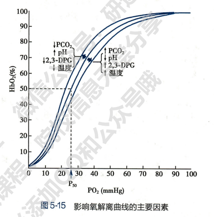
4. CO

   1. CO与Hb的亲和力使O2的250倍，可与Hb结合，占据O2结合位点，**妨碍Hb与O2的结合**
   2. 同时，Hb的一个血红素与CO结合后，会增加其余3个血红素与O2的亲和力，**妨碍Hb与O2解离释放O2**

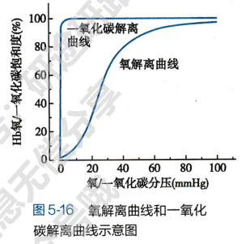

#### 二氧化碳的运输

CO2的运输形式：5%物理溶解，95%化学结合

化学结合主要以**碳酸氢盐**(HCO3-, 88%)和**氨基甲酰血红蛋白**(HbCO2, 7%)

1. **碳酸氢盐**

CO2与水生成碳酸，后一阶电离出H+和HCO3-

反应可逆且都需要碳酸酐酶，反应方向取决于PCO2的高低：

- 组织中，PCO2高，反应向右进行，CO2以碳酸氢盐形式运输
- 肺部，PCO2低，碳酸氢盐水解释放CO2到肺，呼出

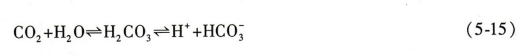

 组织换气进入血的CO2：

- 大部分进入红细胞，因为红细胞内碳酸酐酶较多
- 红细胞内H2CO3解离成HCO3-和H+
  - H+与Hb结合
    - 一方面推动反应向右进行，促使更多CO2转变为HCO3-
    - 另一方面可促进HbO2释放O2，利于组织供氧
  - HCO3-大部分顺浓度梯度扩散入血，并通过HCO3--CL-交换提将Cl-转移入红细胞

2. 氨基甲酰血红蛋白(HbCO2)

进入红细胞的部分CO2可与Hb的氨基结合生成HbCO2，反应迅速、可逆且无需酶催化

调节该反应的因素主要是**氧合作用**：

- **HbO2与CO2的结合能力低于去氧Hb**，且HbO2酸性强于去氧Hb
- 肺部，Hb氧合O2，HbO2增多，与CO2结合能力降低，促使HbCO2解离，反应向左进行

CO2解离曲线：血液中CO2含量与PCO2关系的曲线

与氧解离曲线不同，CO2含量可随PCO2升高而增加，曲线接近线性，不像氧饱和曲线呈S型，无饱和点

影响CO2运输的因素：**Hb是否与O2结合**

- **Hb与O2结合可促进CO2释放**，因为结合O2后与CO2结合能力降低
- 释放O2后的**Hb容易与CO2结合**，因为Hb酸性弱，易与CO2和H+结合，使碳酸分解出的H+被中和，**促进生成碳酸氢盐转运CO2**

这一现象称为**何尔登效应**

综上可见O2和CO2的运输相互影响：

- CO2通过波尔效应影响O2运输
- O2通过何尔登效应影响CO2运输

### 呼吸运动的调节

呼吸运动受到中枢神经系统的**自主性**和**随意性**双重控制

#### 呼吸中枢

呼吸节律起源于呼吸中枢

**呼吸中枢**：指中枢神经系统内**产生呼吸节律**和**调节呼吸运动**的**神经元细胞群**

1. 脊髓：
   1. 有支配呼吸肌的运动神经元
   2. 脊髓本身以及呼吸肌不能产生节律性呼吸
   3. 脊髓的呼吸神经元是联系高位呼吸中枢和呼吸肌的中继站
2. 低位脑干：脑桥和延髓
   1. **脑桥上部**为**呼吸调整中枢PC**，抑制长吸中枢
   2. **脑桥下部**为**长吸中枢**，可使吸气延长
   3. 来自肺部的**迷走神经**也可以**抑制吸气、促进吸气转为呼气**
   4. **延髓**为**喘息中枢**，可产生最基本的呼吸节律

3. 高位脑：脑桥以上的高级中枢，如下丘脑、大脑皮层等高级神经中枢的随意性调节

呼吸运动同时受到大脑皮层的随意性和低位脑干的自主性双重调节

#### 呼吸节律

呼吸节律形成机制尚未阐明，主要有两种学说：

1. 起搏细胞学说：某些延髓内的神经元有自发性的节律活动以驱使其他呼吸神经元活动(类似窦房结起搏细胞)
2. 神经元网络学说：呼吸节律的产生与中枢呼吸神经元之间的联系有关

两种学说的共同之处是都需要化学紧张性冲动传入

#### 呼吸的反射调节

##### 化学感受器

**化学因素**，包括O2、CO2、H+

**化学感受器**根据位置不同可分为外周化学感受器和中枢化学感受器

**外周化学感受器**：

1. 位于**颈动脉体**和**主动脉体**
2. **动脉血PO2降低、PCO2或H+浓度升高**时受刺激，冲动传入延髓孤束核
3. 引起反射性**呼吸加深加快**和血液循环功能变化

中枢化学感受器：

1. 位于脑内，不同于呼吸中枢但可影响呼吸运动
2. 延髓的中枢化学感受器位于延髓腹外侧浅表部位
   1. 头区和尾区有化学感受性
   2. 中区无化学感受性，但可能是冲动传入的中继站
3. H+升高(CO2增多可间接使H+升高)产生冲动，引起呼吸中枢兴奋，使呼吸加深加快

中枢化学感受器不感受低O2刺激，但对H+敏感性比外周高

中枢化学感受器通过影响肺通气调节脑脊液H+浓度，维持中枢神经系统pH环境稳定；外周化学感受器主要在低O2时维持呼吸驱动

##### CO2、H+和O2对呼吸运动的调节

**CO2是调节呼吸运动最重要的生理性化学因素**

CO2刺激呼吸有两种途径：

1. 刺激中枢化学感受器，再兴奋呼吸中枢
2. 刺激外周化学感受器，冲动经窦神经和迷走神经传入延髓，反射性使呼吸加深、加快，肺通气量增加

**H+对呼吸运动的调节**：

1. 浓度升高/降低时，可使呼吸运动加深加快/减慢、肺通气量增加/降低
2. 中枢感受器对H+更敏感，但H+通过血-脑屏障速率较慢，调节作用慢
3. 因此H+主要刺激外周化学感受器起作用

**O2水平对呼吸运动的调节**：

1. 吸入气的PO2降低时，动脉血中PO2下降，反射性使呼吸运动加深加快，肺通气量增加；反之肺通气量减少
2. 只有严重缺O2时才有重要意义
3. 低O2的刺激作用完全通过外周化学感受器实现，切除外周感受器后则低O2刺激效应完全消失

从上图可见三个因素引起的肺通气反应程度大致相同

而事实上一种因素的改变往往会引起其他因素的改变，可能协同增强也可能抵消减弱。改变一种因素而不控制另外两种因素的情况如下图：

观察到的结论如下：

1. CO2对呼吸作用刺激最强，强于单因素；H+次之；O2最弱
2. PCO2升高时，溶于水生成碳酸也使H+浓度升高，两者协同使效果比单CO2更强
3. H+浓度增加，肺通气增加使CO2排出增加，抵消部分H+刺激作用
4. PO2降低时，肺通气增加呼出更多CO2，使PCO2和H+浓度降低，减弱O2刺激作用

##### 肺牵张反射

肺牵张反射：

- 肺扩张可引起吸气活动抑制
- 肺萎陷可引起吸气活动增强
- 切断迷走神经后上述反应消失

说明这是迷走神经参与的反射性反应，包括肺扩张反射和肺萎陷反应两种

- 肺扩张反射：肺扩张时抑制吸气活动
  - 反射过程
    - 肺扩张时，牵拉呼吸道使牵张感受器兴奋
    - 冲动经迷走神经传入延髓
    - 延髓和脑桥呼吸中枢促使吸气转换为呼气
  - 生理意义
    - 加速吸气向呼气转换，增加呼吸频率
- 肺萎陷反射：肺萎陷时增强吸气活动

##### 防御性呼吸反射

1. 咳嗽反射
   1. 喉、气道、支气管粘膜受机械性或化学性刺激时，呼吸道粘膜下的感受器兴奋
   2. 冲动经迷走神经传入延髓
   3. 触发咳嗽反射，将呼吸道异物排出
2. 喷嚏反射
   1. 与咳嗽反射类似，只是刺激作用与鼻粘膜感受器

#### 特殊条件下呼吸运动及其调节

##### 运动时的呼吸调节

运动是呼吸加深加快，肺通气量增加，O2吸入和CO2排出都增加

- 运动开始时，肺通气量骤增，随后趋于平缓
- 运动停止后，肺通气量先骤降，随后缓慢下降恢复运动前水平；此时乳酸血症引起的H+还会使肺通气量增加

##### 低气压/高海拔下的呼吸调节

低氧对人体生理的主要影响是低氧作用

- 急性低氧反应：吸入气的PO2降低，刺激外周化学感受器，兴奋呼吸中枢使呼吸加深加快，肺通气量增加
- 随后会发生持续低氧下的通气衰竭

高海拔低氧时的通气反应包含兴奋性(短时间内)和抑制性反应(长时间)

##### 高气压/潜水下的呼吸调节

密闭容器中气体压力P和体积V成反比，即

$$
P_1V_1=P_2V_2
$$

压力升高，肺内气体容积被压缩，可能小于余气量(此时则没有气体可以呼出)

同时肺泡可能塌陷

肺内气体密度增加，气体可随分压梯度进入血液，进一步减小气体体积

压力升高，呼吸变得深而慢，原因是压力增加导致阻力增加

## 第六章 消化和吸收

消化：食物在消化道内被分解为可吸收的小分子物质的过程

食物消化有两种方式：

1. 机械性消化：消化道肌肉收缩和舒张把食物磨碎，并与消化液混合
2. 化学性消化：消化液中的酶将大分子分解为可吸收的小分子

### 消化生理概述

消化系统又消化道和消化腺组成，消化腺又分为内分泌和外分泌

消化道活动受神经和体液调节

#### 消化道平滑肌的特性

消化道平滑肌的肌组织的共同特性(兴奋性、传导性、收缩性等)的表现有自身特点：

1. 兴奋性较低，收缩缓慢
2. 有自律性：离体的消化道平滑肌仍能节律性舒缩，但节律较慢
3. 有紧张性：经常保持持续收缩状态
4. 有延展性：可增大容积接纳食物
5. 对不同刺激敏感性不同：对电刺激较不敏感，对机械、温度、化学刺激敏感

电生理特性有：

1. **静息电位**：较小且不稳定
2. **慢波电位**：
   1. 消化道平滑肌有轻微自律性，可以周期性产生轻度去极化和复极化，由于频率较慢故称为**慢波**
   2. 慢波起源于细胞ICC，ICC是胃肠运动的起搏细胞
   3. 慢波产生机制
      1. Ca2+浓度升高，激活率通道，Cl-外流去极化
      2. 慢波电位通过ICC与平滑肌细胞之间的缝隙连接扩布到平滑肌细胞
      3. 引起平滑肌细胞Ca2+通道开放，Ca2+内流
3. 动作电位：去极化依靠Ca2+内流；复极化主要依靠K+外流

#### 消化腺的分泌功能

消化腺分泌消化液，消化液主要功能有：

1. 稀释食物，使胃肠渗透压与血浆渗透压相近，利于吸收
2. 为消化酶提供适宜的pH环境
3. 消化酶水解大分子使之吸收
4. 保护消化道粘膜

消化腺细胞受体接收多种刺激，引起一系列生化反应，合成并储存分泌物，在特定条件下释放

#### 消化道的神经支配及其作用

消化系统既受到外部神经系统的支配，同时自身也有内部的自主神经系统进行调节

##### 外来神经

副交感神经：

- 主要来自迷走神经和盆神经
- 副交感神经大部分释放递质乙酰胆碱ACh，激活M受体
  - 促进消化道运动和消化腺分泌
  - 同时抑制消化道括约肌
- 少部分释放肽类物质进行调节

交感神经：

- 释放递质为去甲肾上腺素
- 交感神经兴奋可抑制胃肠运动和分泌

##### 内在神经丛

肠神经系统：

- 粘膜下神经丛：调节腺细胞和上皮细胞
- 肌间神经丛：支配平滑肌活动

两种神经丛之间有复杂的纤维联系，共同构成完整且相对独立的系统，可完成局部反射

外来神经对内在神经丛有调节作用，但内在神经丛也可以在局部发挥调节作用

#### 消化系统的内分泌功能

消化系统中的内分泌细胞统称**APUD细胞**，可合成分泌多种**胃肠激素**

消化道的内分泌细胞有开放型和闭合型两类：

- 开放型：有绒毛伸入胃肠腔，直接感受为胃肠内容物刺激
- 闭合型：无绒毛，不直接接触胃肠腔内环境，分泌受神经和体液调节

胃肠激素的生理作用：

1. 调节消化腺分泌和消化道运动
2. 调节其他激素的释放
3. 营养作用

### 口腔内消化和吞咽

#### 唾液的分泌

三对大唾液腺：腮腺、颌下腺、舌下腺

唾液性质和成分：

- 99%为水分，有机物有粘蛋白、唾液淀粉酶等
- 渗透压会随分泌率变化，分泌率越高/低，渗透压越高/低

唾液分泌的调节：

- 条件反射：望梅止渴，气味、颜色等等第二信号引起的唾液分泌
- 非条件反射
  - 口腔期
    - 物理化学刺激传递至延髓，后到达唾液腺
    - 副交感神经兴奋释放ACh，作用与腺细胞M受体，引起IP3生成
    - 触发细胞内钙库释放Ca2+，使腺细胞分泌增强，唾液分泌增多
  - 食道胃小肠期
    - 反射引起唾液分泌
    - 生理意义是稀释或中和刺激性物质

#### 咀嚼

咀嚼肌按一定顺序组成的节律性动作

作用是对事物进行机械性加工、与唾液充分混合

#### 吞咽

吞咽分为三个时期：

1. 口腔期：随意运动，受大脑皮层支配
2. 咽期：食物刺激咽部感受器，冲动传导延髓吞咽中枢，引发反射封闭鼻、口、喉通路
3. 食管期：食管蠕动使食物由食管进入胃

### 胃内消化

#### 胃液的分泌

##### 胃液

胃黏膜中多种外分泌腺细胞分泌胃液，同时有多种内分泌细胞分泌胃肠激素调节消化道和消化腺活动

胃液成分：

- 盐酸：由壁细胞分泌

  - 因为胃液中酸性很高，所以分泌H+是逆巨大浓度梯度进行，依靠分泌小管的质子泵实现
    - 质子泵水解1分子ATP，使1个H+进入分泌小管，1个K+从管中进入胞内，同时使K+通道和Cl-通道开放
    - K+进入胞内后经钾离子通道进入分泌小管
    - Cl-经通道进入分泌小管，与H+形成HCl，需要时从分泌小管分泌到胃腔
  - OH-在CA催化下与CO2结合成HCO3-，Cl--HCO3-交换体将HCO3-运出，将Cl-运入，补充Cl-
  - 钠钾泵可运出Na+，运入K+，补充进入分泌小管的K+
  - 盐酸的作用有
    - 激活胃蛋白酶原并提供酸性环境
    - 使食物中蛋白质变性
    - 酸性杀灭细菌
    - 盐酸进入小肠可促进促胰液素和缩胆囊素分泌，从而引起胰液、 胆汁和小肠液分泌
    - 酸性环境有利于小肠对铁和钙吸收

- 胃蛋白酶原：由胃泌酸腺的主细胞合成分泌
  - 合成后以无活性酶原形式储存在细胞，进食、神经兴奋、促胃液素可使其释放
  - 进入胃腔后再HCl作用下活化成胃蛋白酶，活化过程为正反馈，即已活化的胃蛋白酶能促进胃蛋白酶原激活
  - 可水解食物中蛋白质，最适pH为1.8到3.5
- 内因子：壁细胞分泌的糖蛋白
  - 可与胃内维生素B12结合，使其免遭肠内水解酶破坏
  - 可与会场粘膜细胞膜受体结合，促进维生素B12吸收
- 粘液和碳酸氢盐
  - 粘液主要成分为糖蛋白，作为保护层覆盖在胃黏膜表面起润滑作用，可与HCO3-形成粘液-碳酸氢盐屏障
  - 可保护胃黏膜免受盐酸和胃蛋白酶损伤
    - 粘液的粘稠度可减慢离子再粘液中扩散速度
    - H+扩散时会与HCO3-中和
    - 因此黏液层靠近粘膜pH较高，越靠近胃腔pH越低

##### 胃和十二指肠粘膜

胃和十二指肠粘膜由很强的细胞保护作用，可保护消化道受理化刺激

- 直接细胞作用
  - 前列腺素(PGE2和PGI2)和表皮生长因子EGF，可抑制胃酸和胃蛋白酶原分泌
  - 还可以刺激粘液和碳酸氢盐分泌
  - 可使胃黏膜微血管扩张，增加粘膜血流量，促进修复
- 适应性细胞保护
  - 胃黏膜持续少量释放前列腺素和生长抑素等
  - 减轻强刺激对胃黏膜的损伤

##### 胃液分泌

胃液分泌可分为三个时期：头期、胃期和肠期

头期：

- 食物刺激眼耳鼻口咽喉感受器，传入冲动，反射性引起胃液分泌，可通过假饲实验证明
- 条件反射：食物的颜色形状气味引起的反射
- 非条件反射：食物刺激口腔、舌、咽等感受器
- 冲动传入反射中枢后经迷走神经传出，支配胃腺和胃窦部的G细胞
  - 直接促进胃液分泌
  - 通过促胃液素间接促进胃液分泌

胃期：食物刺激胃壁机械/化学感受器促使胃液分泌

- 迷走-迷走反射
  - 食物直接刺激胃感受器
  - 迷走神经传入冲动到中枢
  - 迷走神经传出纤维引起胃液分泌
- 神经丛短反射
  - 胃壁内在神经丛直接或间接通过促胃液素促进胃液释放
- 刺激幽门部感受器，内在神经丛作用于G细胞引起促胃液素释放
- 食物中蛋白质消化产生的肽和氨基酸可作用于G细胞引起促胃液素分泌

肠期：

- 肠期的胃液分泌少，主要通过体液调节机制实现
- 食物对小肠粘膜的机械化学刺激，使其释放促胃液素、肠泌酸素，经血液循环作用于胃促进胃液分泌

##### 胃液分泌的调节

- 迷走神经释放Ach作用于不同部位的M3受体
  - 引起壁细胞分泌胃酸
  - 作用于ECL细胞使其释放组胺
  - 作用于δ细胞，抑制δ细胞释放生长抑素，减弱其对G细胞释放促胃液素的抑制作用
- 迷走神经释放促胃液素释放肽GBP作用于G细胞，使其释放促胃液素
- 组胺
  - 由ECL细胞分泌，旁分泌作用于壁细胞H2受体
  - 结合后通过受体-Gs-AC-PKA信号通路使有关蛋白磷酸化，促进壁细胞分泌胃酸
- 促胃液素
  - 由G细胞分泌
  - 迷走神经释放的GRP可作用于G细胞，促进促胃液素分泌
  - 促胃液素通过受体-Gq-PLC-IP3-Ca2+信号通路强烈刺激壁细胞分泌胃酸
  - 促胃液素也能促使ECL细胞分泌组胺
  - 胃酸对促胃液素分泌有负反馈调节

抑制胃液分泌的因素有：

- 盐酸：食物入胃可刺激HCl分泌，HCl过多可负反馈抑制胃酸分泌
  - HCl直接抑制胃窦粘膜G细胞释放促胃液素
  - 刺激胃黏膜δ细胞分泌生长抑素，抑制促胃液素和胃液分泌
  - 十二指肠中可刺激小肠粘膜释放促胰液素和球抑胃素
    - 促胰液素可抑制促胃液素
    - 球抑胃素是能抑制胃酸分泌的肽类激素
- 脂肪
  - 脂肪及其消化产物进入小肠后可刺激小肠粘膜释放肠抑胃素
- 高张溶液
  - 高张溶液可刺激小肠渗透压感受器，通过肠-胃反射抑制胃液分泌
  - 也能刺激小肠释放肠抑胃素

#### 胃的运动

胃的运动形式有：

1. 紧张性收缩：胃壁平滑肌经常处于缓慢持续收缩状态。可保持胃形状和位置，是其他运动形式的基础
2. 容受性舒张：食物刺激口咽食道感受器，可反射性引起胃舒张。反射是通过迷走-迷走反射实现
3. 蠕动：食物入胃后开始蠕动，将食物推入幽门、十二指肠，同时磨碎食物使之与胃液充分混合

胃排空：食物由胃进入十二指肠的过程，速度与食物物理化学性质有关

胃排空的控制：

- 胃内因素促进胃排空
  - 食物对胃的扩张刺激可通过迷走-迷走反射和胃壁内在神经丛局部反射，引起胃运动加强，促进胃排空
  - 也可引起G细胞释放促胃液素，促进胃运动
- 十二指肠内因素抑制胃排空
  - 食靡刺激感受器，通过肠-胃反射抑制胃运动
  - 刺激小肠粘膜释放肠抑胃素抑制胃运动

同时在消化期间，胃会出现周期性运动，每周期为间歇性强力收缩后伴随较长时间静息期，称为消化期间移行性复合运动MMC

消化期间MMC可将胃肠内容物清扫干净

呕吐是一系列复杂的反射，可将胃肠内有害物质排出起保护作用，但也可导致水、电解质、酸碱平衡紊乱

### 小肠内消化

食靡在小肠中受胰液、胆汁和小肠液的化学性消化及小肠运动的机械性消化

多数营养物质也在小肠被吸收

#### 胰液的分泌

胰腺兼具外分泌和内分泌：

- 内分泌主要与糖代谢调节有关
- 外分泌胰液

##### 胰液成分

- 无机物
  - HCO3-含量很高，可中和胃酸保护肠粘膜、提供中性pH环境
  - Cl-第二高，HCO3-升高时，Cl-下降
- 有机物：多种蛋白质酶
  - 胰淀粉酶：分解淀粉
  - 胰脂肪酶：分解甘油三酯为脂肪酸、一酰甘油和甘油
  - 胰蛋白酶和糜蛋白酶
    - 以酶原形式存在于胰液中
    - 肠激酶激活胰蛋白酶原(正反馈激活)
    - 胰蛋白酶使糜蛋白酶原活化
    - 两者都能分解蛋白质，糜蛋白酶还有凝乳作用

##### 胰液分泌的调节

胰液的分泌受神经和体液双重控制，但是以体液为主

神经调节：

- 食物对口、胃、小肠的刺激传入中枢，后通过**迷走神经**传出
- 迷走神经末梢释放Ach作用于胰腺直接促进胰液释放
- 也可以释放GBP作用于胃窦G细胞使其释放促胃液素，间接引起胰液分泌

体液调节：

- 促胰液素
  - 酸性食靡可刺激小肠粘膜释放促胰液素
  - 促胰液素作用于胰腺小导管上皮细胞，使其分泌水和HCO3-
- 缩胆囊素
  - 可促进胰液中各种酶的分泌，也称促胰酶素
  - 可促进胆囊强烈收缩排出胆汁
  - 可促进胰组织蛋白质和核糖核酸合成

促胰液素和促胆囊素之间由协同作用：一个激素可加强另一个激素的作用

#### 胆汁的分泌和排出

肝细胞能持续分泌胆汁并储存在胆囊内

进食后食物和消化液刺激胆囊收缩，将胆汁排入十二指肠

##### 胆汁的性质、成分和作用

成分：

- **胆汁是唯一不含消化酶的消化液**
- 其中所含的**胆盐**可促进脂肪消化吸收
- **胆固醇**是肝脏脂肪代谢产物
- **胆色素**是血红素分解产物
- 卵磷脂是胆固醇有效溶剂

胆汁的作用主要是促进脂肪的消化和吸收：

- 促进脂肪消化：胆盐胆固醇等可作为乳化剂使脂肪乳化，增加胰脂肪酶的作用面积
- 促进脂肪和脂溶性维生素吸收
  - 脂肪及分解产物本身很难穿过肠绒毛表面的静水层
  - 但与微胶粒混合后形成水溶性微胶粒，易于穿过静水层到达肠粘膜表面被吸收
- 中和胃酸
- 促进胆汁自身分泌：进入小肠的胆盐被吸收入血、回到肝，刺激肝胆汁分泌

##### 胆汁分泌的调节

神经调节：

- 进食和食物对胃、小肠的刺激通过迷走神经末梢释放Ach
- 直接作用于肝细胞和胆囊，增加胆汁分泌、引起胆囊收缩
- 或通过促胃液素释放间接引起胆汁分泌

体液调节：

- 促胃液素
  - 血液循环作用于肝细胞引起肝胆汁分泌
  - 也可先引起盐酸分泌，盐酸作用十二指肠使其分泌促胰液素，再促进胆汁分泌
- 促胰液素
  - 促进胰液分泌同时也能促进胆汁分泌
- 缩胆囊素
  - 血液循环作用于胆囊平滑肌和壶腹括约肌，引起胆囊收缩、胆汁排出

胆囊的功能：

1. 储存和浓缩胆汁
2. 调节胆管内压、排出胆汁

#### 小肠液的分泌

小肠内有两种腺体：

1. 十二指肠腺：又称勃氏腺，分泌含粘蛋白的碱性液体，保护十二指肠粘膜上皮
2. 小肠腺：又称李氏腺，分泌液为小肠液主要成分

##### 小肠液的性质、成分和作用

小肠液为弱碱性液体

可稀释消化产物，使其渗透压下降接近血浆渗透压，易于吸收

小肠液分泌后很快又被绒毛上皮吸收

小肠腺分泌肠激酶，可将胰蛋白酶原或化成胰蛋白酶

##### 小肠液分泌的调节

小肠液常态性分泌，但不同情况下分泌量不同

食靡的物理化学刺激均可通过内在神经丛引起小肠液分泌

促胃液素、促胰液素、缩胆囊素、血管活性肠肽等都能刺激小肠液分泌

#### 小肠的运动

小肠的运动形式：

1. 紧张性收缩：使小肠保持形状和位置，是进行其他运动的基础
2. 分节运动
   1. 肠道环行肌节律性收缩和舒张交替
   2. 生理意义
      1. 使食糜和消化液充分混合
      2. 增加食糜与小肠粘膜接触，同时不断挤压肠壁促进血液和淋巴回流，帮助吸收
      3. 对食糜有一定推进作用

3. 蠕动：作用是将食糜向小肠远端推进后，在新肠道进行分节运动

小肠运动的调节：

1. 神经调节
   1. 食糜对肠粘膜的机械化学刺激可通过肌间神经丛使运动加强
   2. 副交感神经使蠕动增强，交感神经相反
2. 体液调节
   1. 促胃液素、脑啡肽等促进小肠运动
   2. 促胰液素、生长抑素、肾上腺素抑制

### 肝脏消化功能和其他生理作用

#### 肝脏的功能特点

**肝脏是人体最大的消化腺**

肝脏的血液供应极为丰富，有两种来源：

1. 门静脉：收集来自**腹腔内脏**血液，**含有从消化道吸收入血的营养物质**，将其在肝内加工、储存和转运
2. 肝动脉：含有丰富O2为肝细胞供氧

肝脏主要功能是进行三大营养物质代谢，代谢活动丰富使肝内的酶类也极其丰富

#### 肝脏主要的生理功能

1. 分泌胆汁：肝脏可生成胆汁酸和分泌胆汁，促进小肠内脂肪的消化吸收
2. 物质代谢
   1. 肝与糖代谢：单糖被小肠吸收后经门静脉到达肝脏，在肝内转变为肝糖原储存
   2. 肝与蛋白质代谢
      1. 消化道吸收的氨基酸在肝内进行蛋白质合成、脱氨、转氨等，合成的蛋白质进入血液
      2. 肝脏是合成血浆蛋白的主要场所
      3. 肝脏将氨基酸代谢产生的氨合成尿素排出
   3. 肝与脂肪代谢
      1. 肝脏是脂肪运输的枢纽
      2. 消化吸收后的脂肪进入肝转变成体脂，饥饿时体脂运送到肝脏分解
      3. 肝中肝脂肪酶可加速脂肪分解成甘油和脂肪酸
      4. 肝还是体内脂肪酸、胆固醇、磷脂合成的主要器官
   4. 维生素代谢：肝脏可储存脂溶性维生素
   5. 激素代谢
3. 解毒功能：门静脉收集的来自腹腔的血液，其中的有害物质可在肝内被解毒和清除
4. 防御和免疫功能：肝脏是最大的网状内皮细胞吞噬系统，其中的巨噬细胞可吞噬抗原并呈递触发免疫反应

#### 肝脏功能的储备和肝脏的再生

肝脏有巨大的功能储备和再生能力：切除70%后，功能不受明显影响，且在几周内生长至原有大小

肝脏再生可能的原因是：

1. 某种物质刺激肝再生，促进DNA和蛋白质合成，另一种抑制肝再生。正常抑制性物质较强，肝被切除后再生性物质强
2. 激素作用，如生长激素、胰岛素、肾上腺皮质激素

### 大肠的功能

大肠没有重要的消化功能，主要功能是吸收水分和无机盐，同时将食物残渣转变为粪便

### 吸收

#### 吸收的部位和途径

消化道不同部位吸收的物质核吸收速度不同，取决于各部分消化道的结构、食物消化程度核停留时间：

- 胃：吸收很少，吸收少量乙醇和水
- 小肠：主要吸收部位，吸收糖类、蛋白质和脂肪消化产物
- 大肠：水和盐类

小肠内粘膜由许多环形皱襞，皱襞上有大量绒毛，绒毛上还有大量的微绒毛，这大大增加了小肠的吸收面积

同时小肠绒毛内还有丰富的毛细血管、毛细淋巴管、平滑肌和神经纤维网等，进食时绒毛节律伸缩摆动，加速血液和淋巴流动帮助吸收

营养物质有两条途径进入血液或淋巴：

1. 跨细胞途径：通过绒毛柱状上皮细胞进入
2. 细胞旁途径：通过细胞间隙进入

#### 小肠内主要物质的吸收

##### 水的吸收

溶质(特别是NaCl)的渗透压梯度是水吸收的主要动力，水会跟随溶质分子的吸收而被动吸收

##### 无机盐的吸收

- Na+的吸收
  - 上皮细胞基底侧钠泵将Na+泵出到组织间液，使细胞内低Na+
  - 肠腔中的Na+顺电-化学梯度进入细胞，并伴随葡萄糖、氨基酸等逆浓度差转运进入
  - 进入细胞的Na+再在基底侧的钠泵泵入组织间液后进入血液
- 铁的吸收
  - 食物中的铁大部分是Fe3+，被还原为Fe2+后吸收速度大大增加
  - 胃酸可促进维C还原高铁
  - 小肠通过多种转运蛋白主动转运无机铁
    - 粘膜细胞顶端膜的二价金属转运体DMT1将无机铁转运入细胞
    - 基底侧膜的铁转运蛋白1FP1可将无机铁运出细胞进入血液
  - 吸收入细胞内的Fe2+大部分被氧化为Fe3+并于脱铁铁蛋白结合成铁蛋白Fe-BP储存在细胞内
  - 储存在细胞内的铁可抑制铁的吸收，防止过量铁进入
- 钙的吸收
  - 影响因素主要是维生素D和机体对钙的需求量
    - 高活性的维D可促进小肠对Ca2+吸收
    - 儿童和哺乳期妇女对钙需要量增大吸收增多
  - 钙盐只有水溶液状态呈离子才好被吸收，形成沉淀则不能被吸收
  - 小肠可通过细胞旁途径**被动吸收**Ca2+
  - 跨上皮细胞途径
    - 肠腔Ca2+经顶端膜中特异钙通道顺电-化学通道进入细胞
    - 进入细胞 Ca2+迅速与钙结合蛋白CaBP结合，使胞质中游离的Ca2+浓度维持在中低水平，避免扰乱信号转导
    - 在基底膜侧，Ca2+与钙结合蛋白分离，通过基底侧膜的钙泵和Na+-Ca2+交换体转运出细胞
  - 该途径是通过高活性维生素D调控基因表达促进上述功能蛋白合成实现
- 负离子的吸收
  - Cl-和HCO3-可在钠泵产生的电位差推动下向细胞内移动

##### 糖的吸收

食物中的糖需要分解为单糖后才能被小肠上皮细胞吸收

不同单糖吸收速率差异很大

单糖吸收是逆浓度梯度的**继发性主动运输**：通过Na+-葡萄糖同向转运体，将葡萄糖伴随Na+顺梯度进入而逆梯度进入

进入细胞的葡萄糖通过易化扩散方式进入血液

##### 蛋白质的吸收

蛋白质分解为氨基酸后也是通过继发性主动运输进入

进入上皮细胞的氨基酸通过易化扩散进入组织间液、血液

二肽和三肽也可以进入细胞，在细胞内由二肽酶和三肽酶分解为氨基酸进入血液

##### 脂肪的吸收

1. 脂肪消化产物与胆汁中的胆盐形成混合微胶粒(见前文胆汁功能部分)
2. 混合微胶粒是双嗜性，可携带脂肪消化产物通过静水层到达上皮细胞
3. 一酰甘油、脂肪酸、胆固醇等从混合微胶粒中释出，透过脂质膜进入细胞(因为它们都是脂溶性的)
4. 脂肪酸和一酰甘油在细胞内质网重新合成脂质
5. 脂质与载脂蛋白合成乳糜微粒进入高尔基体
6. 高尔基体中用脂膜包裹形成囊泡，后胞吐释放

##### 胆固醇的吸收

1. 食物中酯化胆固醇经消化液中胆固醇酯酶水解呈游离胆固醇
2. 游离胆固醇通过混合微胶粒被小肠吸收
3. 在小肠粘膜上皮细胞重新酯化成胆固醇酯
4. 与载脂蛋白组成乳糜微粒进入淋巴循环

##### 维生素的吸收

大部分维生素在小肠上段通过依赖于Na+的同向转运体吸收(继发性主动运输)被吸收

只有维B12在回肠吸收，吸收过程如下：

1. 食物中的维B12是与蛋白质结合的
2. 胃蛋白酶消化蛋白质释放维B12
3. R蛋白与维B12的亲和力远大于与内因子，释放的维B12与R蛋白(糖蛋白)结合
4. 胰蛋白酶降解R蛋白，释放的维B12与内因子结合
5. 内因子-维B12复合物可抵抗胰蛋白酶消化，并通过转运蛋白转运到常上皮细胞

#### 大肠的吸收功能

大肠主要吸收水和电解质

同时也能吸收细菌合成的维B复合物和维K

临床上可采用直肠灌药作为给药途径：药物+直肠分泌液通过粘膜吸收入静脉后进入体循环，不经过肝脏和消化道，避免对药物的破坏

## 第七章 能量代谢与体温
