# 生理学

## 第一章 绪论

### 生命活动的基本特征

#### 新陈代谢

新陈代谢是机体生命活动最基本的特征，包括各种物质合成、分解和能量转换与利用，包含物质代谢和能量代谢

#### 兴奋性

作用于机体的内外环境变化称为**刺激**，机体对刺激所产生的应答性变化称为**反应**

不同组织细胞对刺激所产生的反应表现出不同的形式。接受刺激后能迅速产生某种特定生理反应的组织称为**可兴奋组织**

细胞接受刺激产生的反应有两种表现：

1. 有相对静止变为显著的运动状态，或原有的活动由弱变强，称为**兴奋。**能对刺激产生动作电位的组织或细胞也称为**可兴奋组织**，受刺激后产生动作电位的行为称为**兴奋**
2. 由运动转为相对静止，或活动由强变弱，这称为**抑制**

刺激要引起反应需要满足三个条件：

1. 足够的刺激强度
2. 足够的刺激作用时间
3. 适当的刺激强度-刺激作用时间变化率

能引起活组织细胞产生反应的最小刺激强度称为**阈强度/阈值**

刺激强度低于/高于阈值的刺激称为阈下/阈上刺激，超过最适刺激的称为强刺激

活组织细胞接受刺激产生反应的能力称为兴奋性，可以用阈值高低衡量兴奋性的高低

其他生命活动的基本特征还包括适应性、生殖、衰老等，此处略

### 机体生理功能的调节

#### 神经调节

反射是神经调节的基本形式

反射活动的结构基础为反射弧，由感受器、传入神经、中枢、传出神经和效应器组成

神经调节特点：迅速、作用快、调节精准

反射可分为条件反射（后天学习）和非条件反射（与生俱来）

#### 体液调节

机体的某些组织细胞分泌的特殊化学物质，通过体液途径到达并作用于靶细胞上的受体

特殊化学物质可以是激素也可以是某些细胞产生的特殊化学物质，也能是代谢产物

体液途径通过血液循环作用于全身靶细胞，称为远距分泌调节；化学物质不通过血液循环而是直接进入组织液，通过扩散作用到达邻近细胞发挥作用，称为旁分泌调节；细胞分泌激素或化学物质在局部扩散，又反馈作用于本身，称为子分泌调节；由下丘脑的一些细胞合成激素，然后随神经末梢进入血，称为神经内分泌调节

## 第二章 细胞的基本功能

### 细胞膜的物质转运功能

#### 细胞膜化学组成及分子排列形式

细胞膜主要由脂质和蛋白质组成，含少量糖类。排列形式为**液态镶嵌模型**

##### 细胞膜的脂质

脂质是细胞膜的基本架构，膜脂质主要由磷脂、胆固醇和少量糖脂组成

脂质分子都是双嗜性分子。磷脂双分子层亲水端朝向细胞外液或胞质，疏水端相对形成内部疏水区

膜脂质可因温度改变而呈凝胶或溶胶状态，使细胞膜具有稳定性和流动性。

此外膜的流动性还与膜脂质成分、膜蛋白含量有关：胆固醇含量越高，脂肪酸烃链越长蛋白质含量越多，流动性越低

##### 细胞膜的蛋白

根据膜蛋白在膜上的存在方式可分为两类：表面膜蛋白和整合膜蛋白

表面膜蛋白占 20%-30%，主要附着在细胞膜内表面，或以酶的形式参与信息转导或物质转运

整合膜蛋白占 70%-80%，肽链穿过膜脂质双层，多以 α-螺旋形式存在。一般与物质跨膜转运功能和受体功能有关的都属于整合膜蛋白

##### 细胞膜的糖类

主要是寡糖和多糖链，与膜蛋白或膜脂质结合形成糖蛋白或糖脂。大多数整合蛋白都是糖蛋白。

糖链基本上伸向细胞膜外侧，形成**糖包被。**糖包被可促进细胞接触和作用；许多糖类带负电，从而使细胞表面呈负电

#### 细胞膜的物质转运

##### 单纯扩散

定义：物质从质膜高浓度一侧像低浓度一侧进行跨膜扩散。

单纯扩散是物理现象，没有生物学转运机制，无需耗能，属于被动扩散

速率影响因素：

- 被转运物在膜两侧的浓度差
- 膜对该物质的通透性
- 溶液温度
- 膜有效面积

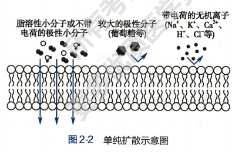

##### 易化扩散

定义：非脂溶性小分子物质或带电粒子**在跨膜蛋白的帮助下**，顺浓度梯度和电位梯度的跨膜转运。属于被动转运，不消耗 ATP

1. 经通道的易化扩散

带电离子经通道蛋白（离子通道）顺浓度/电位梯度运输。通道关闭时无离子通过，开放时快速通过。

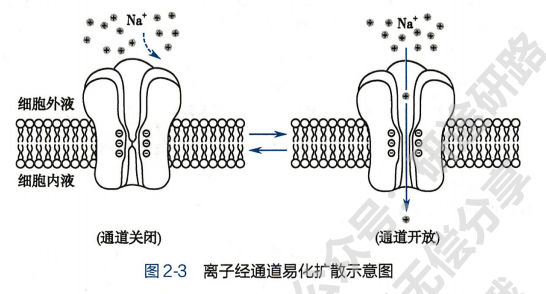

重要特性：

- 离子选择性：每种通道只对一种或几种离子有较高通道能力
- 门控特性：静息时通道闸门关闭，只有刺激时分子构象变化，闸门开放

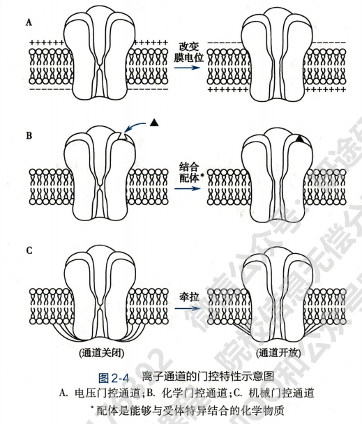

通道蛋白转运速率较快

2. 经载体的易化扩散

底物经载体从膜一侧转运至另一侧，过程为 **底物结合 - 构象变化 - 与底物解离**，过程较为复杂，因此转运速度较慢

载体介导的易化扩散有下面的特点：

- 结构特异性：载体只能识别具有特定化学结构的底物
- 饱和现象：因载体数量和转运速率有限，底物浓度到达一定值后，底物扩散速率不再随浓度增加而增大
- 竞争性抑制：两底物都能和同一载体结合，则会竞争载体，发生竞争性抑制，浓度较低的更容易受到抑制

##### 主动转运

定义：物质在膜蛋白的帮助下，由细胞供能进行逆浓度/电位梯度跨膜转运

根据**膜蛋白是否直接消耗能量**可分为**原发性主动转运**和**继发性主动转运**

1. 原发性主动转运

细胞直接利用能量将物质逆梯度转运。

转运底物多为离子，则介导这一过程的膜蛋白或载体称为**离子泵**，其本质是**ATP 酶**，可水解 ATP 并使自身构象发生变化进行转运

- 钠钾泵：每次活动使 3 个 Na+移出胞外、2 个 K+移入胞内，产生一个正电荷净外移，因此具有生电效应

  - 胞内许多代谢反应需要高 K+环境
  - 转运胞内 Na+，维持渗透压
  - Na+和 K+的转运是静息电位和动作电位的基础
  - Na+跨膜运输可为继发性主动转运蓄势

  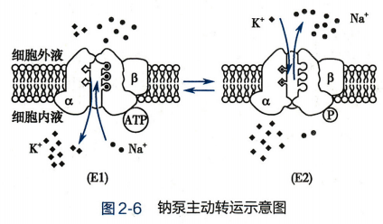
- 钙泵：也称 Ca2+-ATP 酶，具有特异性 Ca2+结合位点（不同于钠钾泵）

  - 质膜上的钙泵叫 PMCA，肌质网和内质网膜上的钙泵叫 SERCA
  - 前者可将 1 Ca2+/ATP 运出胞质，后者可将 2 Ca2+/ATP 从胞质运入内质网
  - 两者协同维持胞质 Ca2+浓度稳定在低水平
- 质子泵

  - 氢钾泵：分泌 H+摄入 K+，参与胃酸形成和肾脏排酸
  - 氢泵：将 H+由胞质运入溶酶体、高尔基体等细胞器内

2. 继发性主动转运

物质利用原发性主动转运建立起的 Na+或 H+浓度梯度，在 Na+或 H+离子顺浓度梯度扩散时同时时其他物质逆梯度转运的过程，称为继发性主动转运

继发性主动转运依赖于原发性主动转运

根据转运方向可分为两类：

- 通向转运：被转运的离子或分子都向同一方向运动，例如 Na+顺梯度入胞，葡萄糖逆梯度入胞
- 反向转运：反方向，例如 Na+顺梯度入胞，Ca2+逆梯度出胞

多数情况，跨质膜转运的动力来自钠泵建立的 Na+梯度，跨细胞器膜转运的动力来自质子泵建立的 H+梯度

##### 膜泡运输

大分子颗粒与物质，由膜包围形成囊泡，通过膜包裹、膜融合和膜离断一系列过程完成的转运，称为膜泡运输，包括入胞和出胞

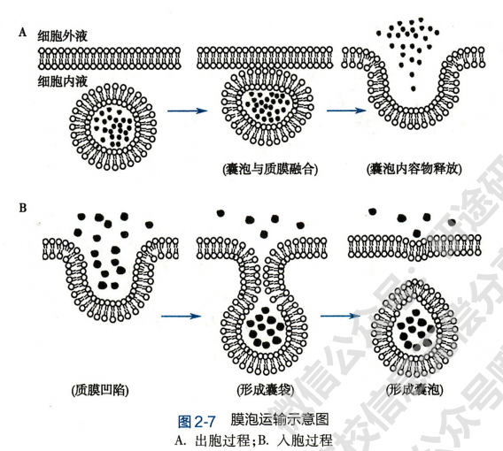

出胞分为**持续性出胞**和**调节性出胞**：

1. **持续性出胞**：分泌囊泡自发不断排出大分子物质的过程
2. **调节性出胞**：物质合成后先存储在分泌囊泡，接收到化学信号或电信号时再释放囊泡

入胞分为**吞噬**和**吞饮**：

1. 吞噬：被转运物质以**固态形式**进入，不是以分子形式而是以团块或颗粒形式出现
2. 吞饮：被转运物质以**液态形式**进入细胞

胞吞和胞吐的更详细的原理可见**细胞生物学第三章**

### 细胞的信号转导

定义：**生物活性物质**（激素、神经递质、细胞因子等）通过**受体或离子通道**的作用而**激活或抑制**细胞功能的过程

生理意义：

1. 是生理功能调节的基础
2. 适应内、外环境变化
3. 对细胞形态结构和生存状态有影响

主要的信号转导通路：

1. 水溶性配体 - 膜受体 ：离子通道型受体、G 蛋白偶联受体、酶联型受体和招募型受体介导
2. 脂溶性配体 - 单纯扩散 - 胞质受体或核受体：核受体介导

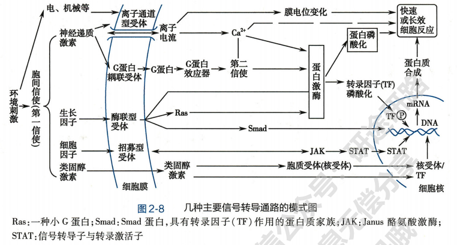

#### 离子通道型受体介导的信号转导

离子通道型受体：即是离子通道又是受体（化学门控）

转导过程：

1. 配体与受体结合
2. 离子通道开放
3. 细胞膜对特定离子的通透选择性增加
4. 引起膜电位变化

特点：

1. 路径简单
2. 速度快

#### G 蛋白偶联受体介导的信号转导

G 蛋白偶联受体：被配体激活后，作用于与之偶联的 G 蛋白，再引发一系列反应

G 蛋白偶联受体无通道结构、无酶活性，引发反应主要是一系列生化反应

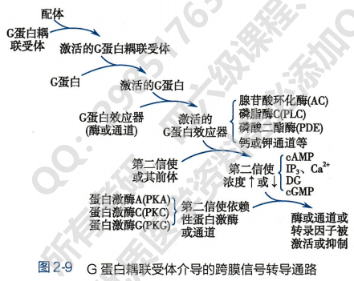

特点：

1. 速度慢
2. 但作用空间范围大
3. 信号逐级放大

##### 有关蛋白

信号转导过程主要涉及的蛋白如下

1. **G 蛋白偶联受体**：膜受体中最大家族，被配体激活后，通过改变分子构象，结合并激活 G 蛋白，再通过级联反应将信号传递到下游
2. **G 蛋白**：位于膜内侧面，有失活态（与 GDP 结合）和激活态（与 GTP 结合）两种构象，激活态导通/失活态中断信号转导。GTP 酶活性是关键

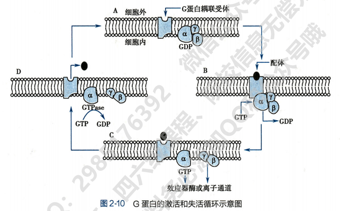

3. **G 蛋白效应器**：G 蛋白直接作用的标靶，包括第二信使物质、膜离子通道和膜转运蛋白等。效应器酶作用是催化生成/分解第二信使物质
4. **第二信使**：指激素、神经递质、细胞因子等细胞外信使分子（第一信使）作用于膜受体后产生的**细胞内信使物质**，一般指**效应器酶**分解细胞底物产生的小分子物质。第二信使可进一步激活**蛋白激酶**，使靶细胞磷酸化和构象变化
5. **蛋白激酶**：将 ATP 上的磷酸基团转移到蛋白上使蛋白磷酸化，使蛋白带电特性/构象发生变化，最终使其生物学特性变化，包括 PKA、PKC 等

##### 常见的信号转导通路

1. **受体 - G 蛋白 - AC - cAMP - PKA 通路**：此通路关键信使分子使 cAMP，也称 cAMP 第二信使通路。作用过程为：
   1. 第一信使
   2. G 蛋白偶联受体
   3. $G_s$激活 AC 提高 cAMP 浓度/$G_i$抑制 AC 降低胞质内 cAMP 浓度（拮抗作用）
   4. 激活依赖 cAMP 的 PKA
   5. 引起下游蛋白磷酸化/构象改变

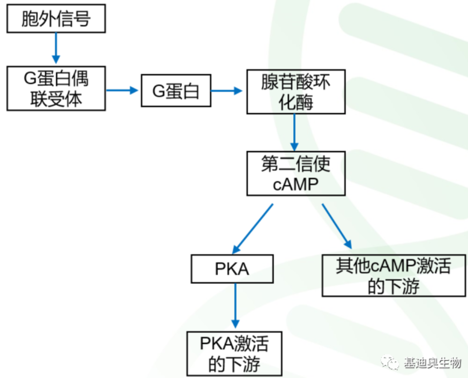

2. 受体 - G 蛋白 - PLC - $IP_3$-Ca2+和 DG-PKC 通路：关键信使分子是$IP_3$和 DG，也称 IP3 和 DG 第二信使系统 ，转导过程如下；
   1. 受体与**G 蛋白**结合**激活 PLC**
   2. **PLC**分解膜脂质中的 PIP2 为**IP3 和 DG**
      1. IP3 作为门控使胞内 Ca2+库释放 Ca2+，Ca2+浓度升高，启动 Ca2+系统
      2. DG 为脂溶性物质，在膜内侧面激活 PKC，进一步磷酸化下游蛋白

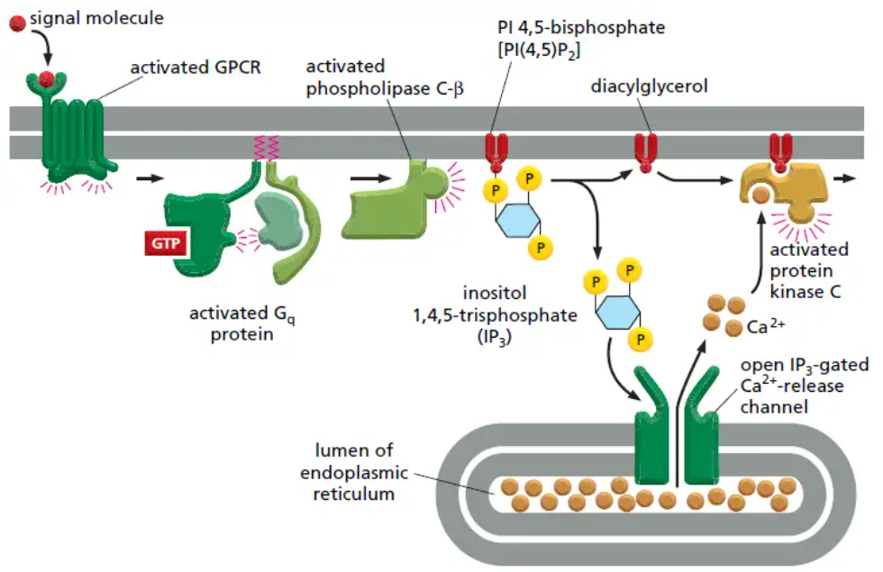

3. Ca2+信号系统：Ca2+不仅可以改变膜电位影响细胞功能，更能作为第二信使与底物蛋白（即钙结合蛋白）结合，产生生物效应

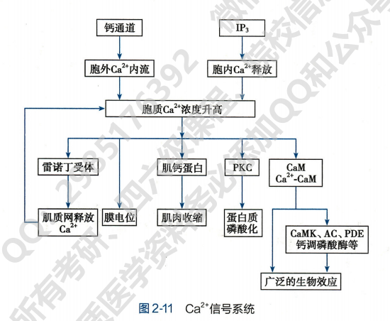

#### 酶联型受体介导的信号转导

酶联型受体：本身就具有酶活性或与酶相结合的膜受体，受体类型有以下几种：

1. 酪氨酸激酶受体 TKR：
   1. 配体主要是各种生长因子
   2. 细胞外部分与配体结合
   3. 胞内侧酪氨酸激酶被激活
   4. 磷酸化下游蛋白
2. 酪氨酸激酶结合型受体 TKAR：
   1. 相比 TKR 本身没有酶活性，配体是生长因子和肽类激素
   2. 与配体结合激活
   3. 激活后在胞内侧与胞质中与酪氨酸激酶结合并使其激活
   4. 酪氨酸激酶磷酸化下游蛋白
3. 鸟苷酸环化酶受体
   1. 配体是心房钠尿肽 ANP 和脑钠尿肽 BNP
   2. 被配体激活后，通过 GC 活性催化 GTP 生成 cGMP
   3. cGMP 作为第二信使激活蛋白激酶 PKG
   4. PKG 将底物蛋白磷酸化
4. 丝氨酸/苏氨酸激酶受体
   1. 具有丝氨酸/苏氨酸激酶活性
   2. 被配体激活后使 Smad 蛋白磷酸化激活

相比 G 蛋白耦联受体，TKR 和 TKAR 介导的信号转导通路更简捷，但产生效应缓慢

#### 招募型受体介导的信号转导

受体分子没有酶活性，信号转导过程如下：

1. 胞外域与配体结合
2. 胞内域招募激酶或转接蛋白
3. 激活下游不涉及第二信使的信号转导通路

主要配体使细胞因子等

该类型的信号转导相当于跳过第二信使，直接对蛋白激酶进行招募

#### 核受体介导的信号转导

一般胞质受体与配体结合后也要转入核内发挥作用，因此通常把细胞内的受体统称核受体

信号转导过程：

1. 细胞外信号分子，如类固醇激素，进入细胞
2. 与受体结合形成**激素-受体复合物**
3. 激素-受体复合物**转移至核内**
4. 再在核内与**核内**靶基因上的**HRE**结合
5. 调节靶细胞**转录表达**特定蛋白质产物

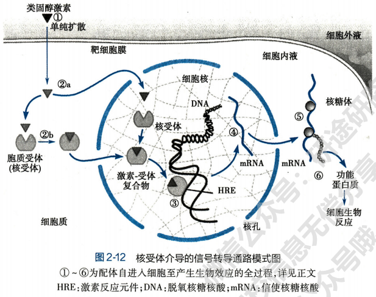

### 细胞的电活动

#### 静息电位

**静息电位**：静息状态下，**细胞膜两侧存在的内负外正的电位差**，称为**静息电位**

生理学中称膜两侧**外正内负的稳定状态**为**极化**

超极化：静息电位增大

去极化：静息电位减小

静息电位的产生机制：

基本原因：带电离子的跨膜转运，转运速率取决于浓度差及膜的通透性

1. 膜两侧离子浓度差与平衡电位

   细胞膜两侧的离子浓度差由离子泵，主要是钠泵所维持：

- 外Na+浓度是内的12倍
- 内K+浓度时外的30倍

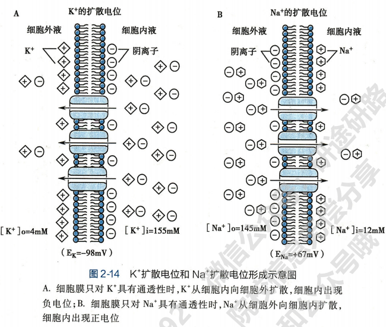

此时，**跨膜电场**和**离子浓度差**对离子移动的驱动力恰相反，将两者代数和称为离子的**电-化学驱动力。**

当电-化学驱动力为0时，膜两侧的电位差稳定，称其为**平衡电位，可用下面的公式计算：**

$$
E_X=\frac{RT}{ZF}ln\frac{[X]_o}{[X]_i}
$$

其中：

- $E_X$为平衡电位（细胞外为0时对应的细胞内数值）
- R、F为常数
- Z为离子价数（例如Na+为+1价）
- $[X]_o$和$[X]_i$分别为离子外/内浓度

当离子是正价时，离子浓度：

- 外>内：阳离子内流，内正外负
- 内>外：阳离子外流，内负外正

其他情况分析同理

2. 静息时细胞膜对离子有相对通透性

如果膜只对一种离子有通透性，那么静息电位等于该离子的平衡电位

如果对多种离子均有通透性，则静息电位为所有粒子平衡电位的综合结果，通透性越高的离子占比越大

例如，细胞膜对K+离子通透性最高，则静息电位主要接近K+离子的平衡电位（内>外，K+外流，外正内负）

静息电位可以表示为K+与Na+平衡电位关于通透性的加权和：

$$
E_m=\frac{P_K}{P_K+P_{Na}}E_K+\frac{P_{Na}}{P_K+P_{Na}}E_{Na}
$$

其中E表示平衡电位，P表示通透性

  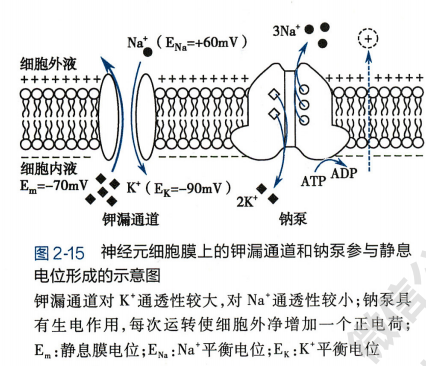

3. 钠泵的生电作用

钠泵分解1分子ATP可将3个Na+移出，将2个K+移入，使膜内形成负电位

但一般钠泵生电作用对静息电位的贡献十分有限

综上，影响静息电位的因素有：

1. 细胞外液K+浓度：因为细胞膜对K+通透性最大。胞外K+浓度升高，K+外流减少，形成电位差减小
2. 膜对K+和Na+的相对通透性：对K+越大，静息电位越大；对Na+越大，静息电位越小
3. 钠泵活动水平：钠泵越活跃生电作用越强

#### 动作电位

 定义：静息电位接受到刺激后产生的可传播的膜电位波动

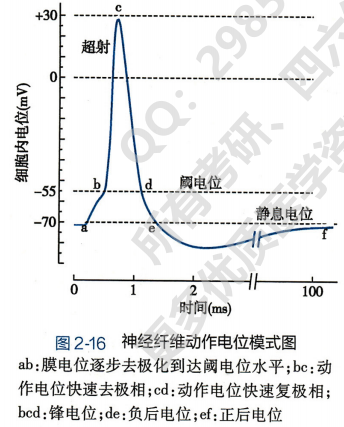

动作电位的特点：

1. “**全或无”现象**：刺激强度不足就不会产生动作电位（无）；刺激达到阈值，动作电位就会到达最大值，不会随刺激强度增强而增大（全）
2. **不衰减传播**：动作电位产生后沿膜传遍整个细胞，幅度波形不变
3. **脉冲式发放**：连续刺激产生的多个动作电位总有一个间隔，不会融合

##### 动作电位产生机制

动作电位产生式在静息电位基础上，电-化学驱动力和细胞膜对离子通透性改变的结果

1. 电-化学驱动力及其改变：

**电化学驱动力 = 膜电位 - 离子平衡电位**，正号表示力向外，符号表示向内

$$
E_m-E_X
$$

可以理解为当前状态对离子稳定状态的牵引力（不恰当的比方），如下图，当前状态$E_m$对$E_{Na}$的牵引力向下，为负表示向内

如下图，安静状态Na+受到向内驱动力明显大于K+向外驱动力。而动作电位期间$E_m$改变较大，导致两离子电化学驱动力变化较大

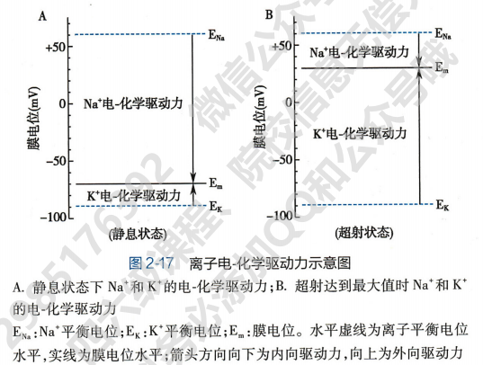

2. 动作电位期间细胞膜通透性的变化

电压钳制实验：

- 超极化时，没有检测到膜电位变化，说明膜通透性不变
- 去极化时，先有向下的内向电流，再由向上的外向电流，说明去极化可引起膜通透性改变
  - 然后阻断钠通道，内向电流消失，说明内向电流时Na+介导
  - 阻断钾通道，外向电流消失，说明外向电流是由K+介导

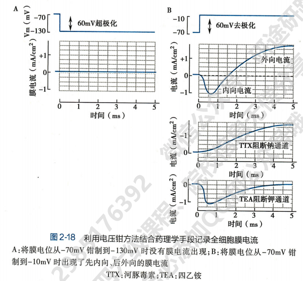

表明：去极化刺激可引起细胞膜对两种离子通透性的改变

定量计算两种离子在去极化时的电导$G_{Na}$和$G_K$发现：

- 去极化程度越大，$G_{Na}$和$G_K$越大
- 去极化与$G_{Na}$有互相增强关系，即正反馈，有助于兴奋后快速形成动作电位
- 去极化使 $G_K$增大，但$G_K$增大后会促进复极化恢复静息电位，即负反馈调节

因此动作电位形成过程总结如下：

1. 细胞受到刺激，$G_{Na}$增大
2. Na+内流，静息电位降低，即去极化
3. 去极化正反馈增强$G_{Na}$，膜电位迅速上升，形成动作电位升支
4. 去极化到峰值后$G_{Na}$减小、$G_K$增大
5. K+外流，复极化，形成动作电位降支

膜电导改变的实质是**膜中离子通道的开放和关闭**

  离子通道（由激活门和失活门串联控制）有三种功能状态：

- 静息态：膜电位为静息电位，激活门关失活门开，钠通道关闭
- 激活态：去极化，钠通道激活门开放
- 失活态：失活门关激活门开，不导通

K+离子通道只有一个激活门，而且对去极化的反应有延迟，一般在Na+通道关闭后K+通道才激活，因此K+外流总是发生在Na+之后，两者不会相互抵消

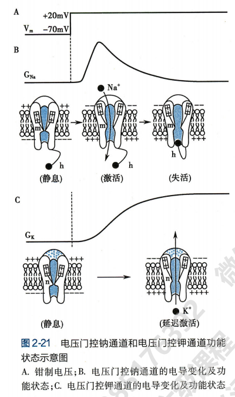

##### 动作电位的触发

动作电位触发需要刺激达到一定的量，通常包括三个参数：

- 刺激强度
- 刺激持续时间
- 刺激强度-时间变化率

阈强度：能使细胞产生动作电位的最小刺激强度

阈刺激：相当于阈强度的刺激

阈电位：能触发动作电位的膜电位临界值

阈电位影响因素：

1. 膜上电压门控钠通道数量/密度、状态
2. 胞外Ca2+浓度：Ca2+浓度升高，可减小膜对Na+的通透性，因此Ca2+被称为稳定剂

##### 动作电位的传播

1. 动作电位在同一细胞上的传播：**局部电流学说**

产生局部兴奋的区域为**外负内正**，而未兴奋的区域为**外正内负**，因此兴奋区与未兴奋区之间会产生电位差，从而产生局部电流，方向为**从正电位到负电位**，不断从兴奋区向未兴奋区传导

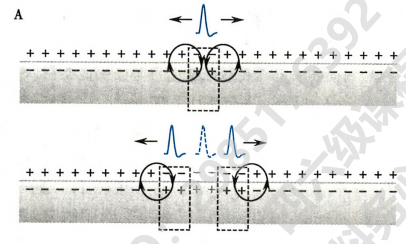

2. 动作电位在细胞之间传播

在某些组织中，细胞之间存在缝隙连接：

- 缝隙连接处两个细胞的质膜很近
- 细胞之间有蛋白质形成的连接子
- 连接子中央有亲水性孔道

当一个细胞产生动作电位后，可通过缝隙连接直接传播到另一细胞

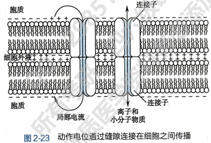

##### 兴奋性及其变化

兴奋性：机体接受刺激发生反应的能力

神经细胞、肌细胞、腺细胞容易接受刺激发生明显的兴奋反应，因为它们含有较多电压门控钠、钙通道

兴奋性高低可用刺激的阈值大小来衡量：

- 阈值越高，兴奋性越低
- 阈值越低，兴奋性越高

兴奋后的兴奋性变化：可兴奋细胞发生兴奋后，其兴奋性会出现周期性变化，分为以下四个阶段：

1. 绝对不应期：兴奋发生后一段时间，无论多强的刺激都不能使细胞再次兴奋，原因是：
   1. 兴奋时大部分钠通道已激活，不存在再次激活现象
   2. 兴奋后最初一段时间大部分钠通道已失活，无法再次激活
2. 相对不应期：兴奋性逐渐恢复，可再次接受刺激发生兴奋，**但刺激强度必须大于原来阈值**，原因是通道虽已经开始复活，但复活数量较少
3. 超常期：兴奋性轻度增高，原因是通道基本复活，但膜电位尚未完全恢复到静息电位，因此只需阈下刺激即可兴奋
4. 低常期：兴奋性轻度降低，原因是通道虽已复活，但膜电位轻度超极化，与阈电位水平距离增大

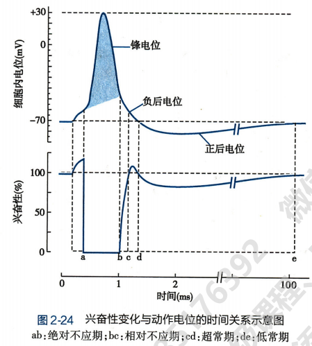

#### 电紧张电位

##### 电紧张电位的概念与产生

细胞膜可以看作是一个电容器，电荷Q外正内负形成电位差V，电容定义为

$$
C=\frac{Q}{V}
$$

同时细胞双脂质层之间的电阻称为膜电阻

如下图在某点注入脉冲电流，平行方向将向两端传播，同时会随时产生跨膜电流。由于轴向电阻和膜电阻的存在这些电流都会随离注入点的距离增加而不断减小

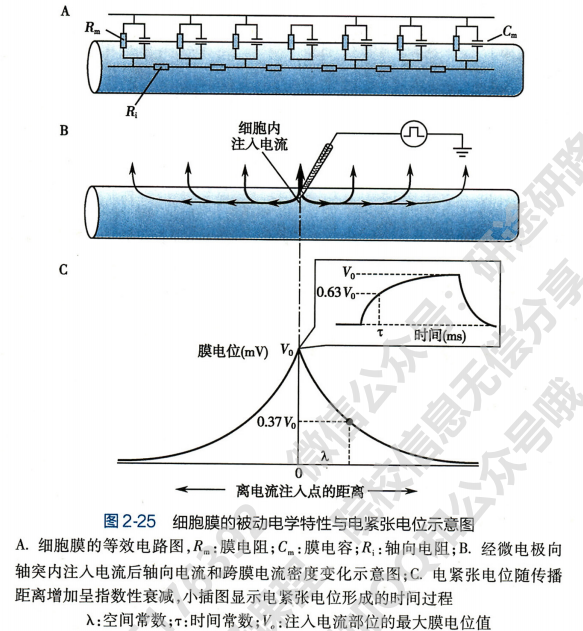

**电紧张点位**：随时间变化和空间分布变化的膜电位称为电紧张电位（区别于动作电位传播过程中不衰减）

空间常数：$\lambda$ ，用于描述电紧张点位的传播范围

- $\lambda$ 越大，影响范围越大
- 主要受**膜电阻**和**轴向电阻**影响

时间常数：$\tau$ ，用于描述电紧张点位的生成速度，可以理解为充电或放电**所需的时间**

- $\tau$ 越小，电紧张点位生成速度越快
- 主要受膜电阻和膜电容影响，主要是**膜电容**
- 减小膜电容可减小$\tau$

##### 电紧张电位的极性

如下图，将电源正负极同时插入胞质内，此时：

- 负极会吸引胞质内的正电荷，相当于注入正电荷，使胞质内外电位差减小，去极化
- 正极吸引负电荷，相当于注入负电荷，内外电位差增大，超极化

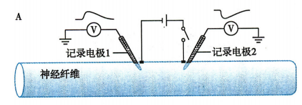

#### 局部电位

电紧张电位完全由细胞膜的被动特性决定，与离子通道和膜电导无关。但其实在神经递质或电紧张电位刺激下，部分离子通道开放产生轻度超极化或去极化反应

局部电位：部分离子通道开放形成的、不能远距离传播的电位

钠通道开放产生的去极化又称为**局部兴奋**

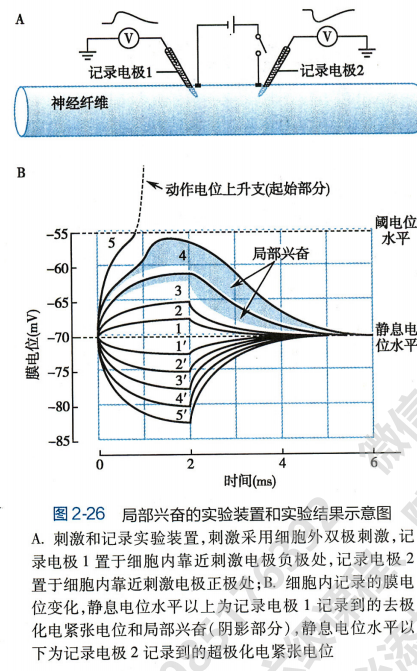

如上图，电源正极会产生超极化（静息电位下部分曲线），负极会产生去极化（静息电位上部分），这属于电紧张刺激

但随着电源电压增大，即刺激不断增强，超极化电位变化幅度大于去极化电位变化幅度，这是少量钠通道被激活后产生去极化叠加导致

### 肌细胞的收缩

人体肌组织按结构和收缩特性可分为：

- 骨骼肌
- 心肌
- 平滑肌

骨骼肌和心肌都有明暗交替的横纹，因此统称横纹肌

同时按受神经控制的差异，可分为：

- 随意肌（骨骼肌）：受躯体运动神经支配
- 非随意肌（心肌和平滑肌）：受自主神经调控

#### 横纹肌

##### 骨骼肌神经-肌接头

**骨骼肌神经-肌接头**：**运动神经末梢**与其支配的**骨骼肌细胞**之间的结构

由三部分组成：

- 接头前膜：运动神经轴突末梢膜的一部分
- 接头后膜：与接头前膜相对的骨骼肌细胞膜，也成为终板膜，**向内凹陷褶皱**增大表面积
- 街头间隙：充满细胞外液

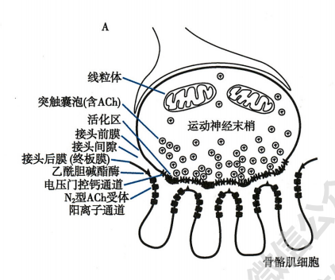

兴奋传递过程具有电-化学-电传递的特点：

1. 运动神经纤维传导动作电位到轴突末梢
2. 触发接头前膜Ca2+依赖性突触囊泡出胞，释放乙酰胆碱ACh
3. ACh激活终板膜的N2型ACh受体氧离子通道产生膜电位变化（电信号）
4. 离子通道开放，Na+离子内流（对Na+和K+都有通透性，但Na+内驱力更强），产生去极化反应，称为终版电位EPP
5. EPP以电紧张方式向周围扩散，刺激普通肌膜上的钠通道开放，引发动作电位
6. ACh释放后被终板膜外的乙酰胆碱酯酶分解，使终板膜恢复到接受新兴奋的状态

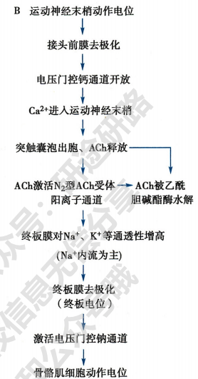

兴奋传递过程ACh的释放非常关键：

- **ACh释放有**Ca2+依赖性
  - 接头前膜的动作电位激活前膜的钙通道
  - Ca2+内流触发囊泡出胞
  - 因此细胞外Ca2+浓度变化会明显影响兴奋传递
- ACh释放是**量子释放**，即以囊泡为基本单位“量子”
  - 兴奋时大量囊泡产生**终板电位EPP**
  - 静息时也会有少量囊泡自发释放，产生**微终板电位MEPP**

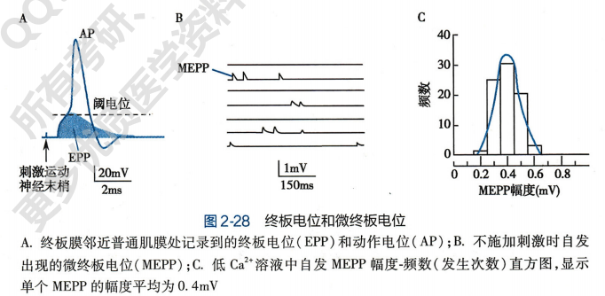

由于兴奋传导过程有神经递质参与，会受以下因素影响：

- 使用性增强现象
- 药物和病理因素可用影响受体、酶等物质

##### 横纹肌细胞结构特征

结构特征：含有大量**肌原纤维**和发达的**肌管系统**

肌原纤维：由粗肌丝和细肌丝组成，两者规律排列形成了明暗带

- 明带I
  - Z线：明带中间的线
  - 肌节：相邻两Z线之间的部分，**是肌肉收缩和舒张的基本单位**
- 暗带A
  - M线：暗带中央 线
  - H带：暗带中M线两侧较亮的区域

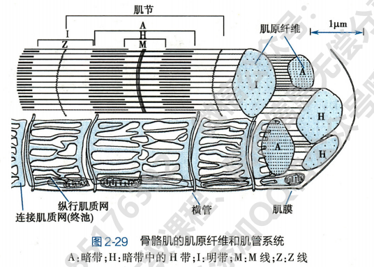

肌管系统有两种：

- **横管(T管)**：与肌纤维走向垂直
- **纵管(L管)**，与肌纤维走向平行的膜性管道，即**肌质网SR**
  - **纵行肌质网JSR**上的钙泵可逆梯度转运Ca2+到SR内

##### 横纹肌的收缩机制（重点）

横纹肌收缩时，暗带宽度不变，只有明带和H带变窄

收缩机制：肌丝滑行理论

- 横纹肌的肌原纤维有与其走向平行的粗肌丝和细肌丝构成
- 肌肉收缩与身长是粗肌丝和细肌丝在肌节内相互滑行导致
- 粗肌丝和细肌丝本身长度不改变

肌丝的分子结构：

- 由数百个肌球蛋白聚合
- 每个肌球蛋白有一个杆部和两个球形头部
  - 头部向外伸出形成横桥

粗肌丝中：

- 肌球蛋白杆状部集合在一起
- 头部向外形成 **横桥**
  - M线附近没有横桥
  - 横桥具有ATP酶活性，能与肌动蛋白结合
  - 横桥激活后向M线方向扭动，**是肌丝滑行的动力源**

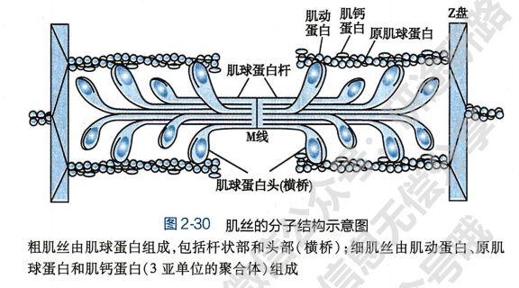

细肌丝由以下三种蛋白按 7:1:1 比例构成：

- **肌动蛋白**：主干，含有横桥结合位点
- **原肌球蛋白**
  - 长杆状，绕肌动蛋白双螺旋槽走向
  - 舒张时恰覆盖肌动蛋白横桥结合位点，抑制肌丝滑行
- **肌钙蛋白**
  - 出现在原肌球蛋白双螺旋上
  - 舒张时遮盖横桥结合位点
  - 胞质中Ca2+浓度升高时，会与Ca2+结合，使肌钙蛋白构象变化，暴露肌动蛋白横桥结合位点，引发横桥结合，产生肌丝滑行

**肌球蛋白**和**肌动蛋白**直接参与肌肉收缩，称为**收缩蛋白**

而**原肌球蛋白**和**肌钙蛋白**不直接参与，但可调控收缩蛋白间的相互作用，称为**调节蛋白**

**肌丝滑行过程**：

1. 舒张时，横桥的ATP酶活性分解ATP产生能量使上次扭动过的横桥复位
2. 胞质Ca2+浓度升高，与肌钙蛋白结合使后者构象改变，暴露肌动蛋白横桥结合位点，触发横桥与肌动蛋白结合
3. 横桥构象改变，头部向桥臂扭动45°，拖动细肌丝向M线方向滑动
4. 横桥再与ATP结合，与肌动蛋白分离，复位

整个过程称为**横桥周期**

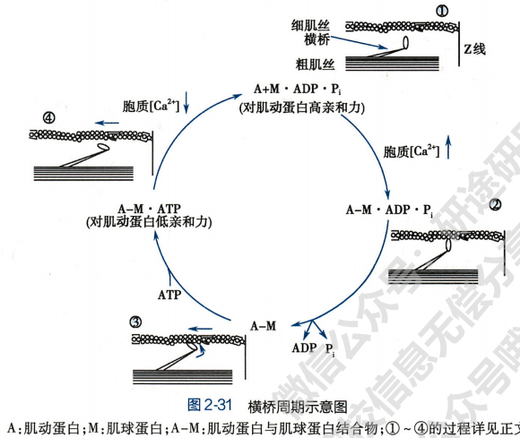

##### 横纹肌细胞的兴奋-收缩耦联

兴奋-收缩耦联：将横纹肌细胞产生动作电位的**电兴奋**与肌丝滑行的**机械收缩**联系起来的**中介机制**

耦联因子：**Ca2+**

兴奋-收缩耦联基本步骤：

1. **T管**膜传导动作电位并激活**L型钙通道**
2. 纵行肌质网JSR肌膜去极化（动作电位），顺梯度释放Ca2+到胞质
3. 胞质Ca2+浓度升高与肌钙蛋白结合触发肌肉收缩
4. JSR通过钙泵回摄Ca2+，胞质Ca2+浓度降低，肌肉舒张，因此舒张过程亦耗能（钙泵主动运输）

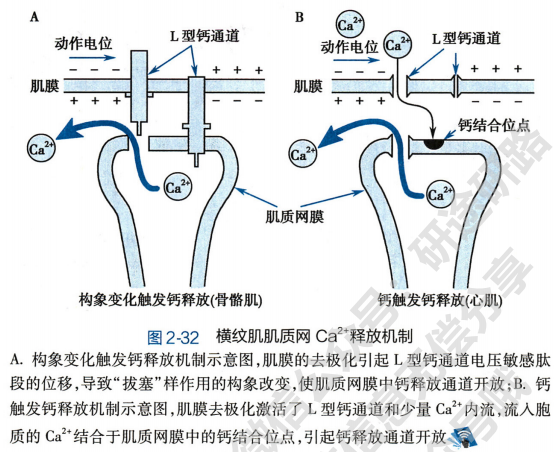

##### 影响横纹肌收缩效能的因素

等长收缩：肌肉长度不变，张力变大

等张收缩：肌肉张力不变，长度缩短

一般肌肉收缩先等长再等张缩短

1. 前负荷：肌肉在收缩前承受的负荷，决定肌肉初长度。如图，在一定范围内，肌肉收缩张力随初长度的增加而增大

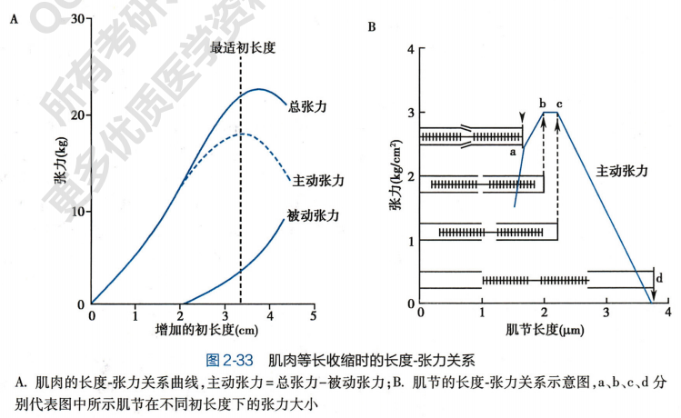

2. 后负荷：肌肉收缩后承受的负荷。如图，后负荷与收缩速度成反比关系

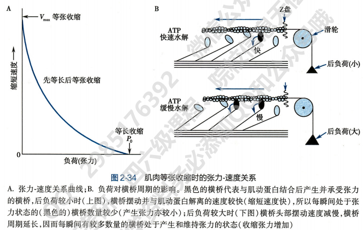

3. 肌肉收缩能力：肌肉内在特性，结构、调节等
4. 收缩的总和
   1. 多纤维总和：多根肌纤维同步收缩产生的叠加效应
   2. 频率总和：提高骨骼肌收缩频率而产生的叠加效应
      1. 动作电位频率很低时为单收缩
      2. 后一次收缩叠加前一次的舒张，称为**不完全强直收缩**
      3. 后一次收缩叠加前一次收缩，称为**完全强直收缩**，张力可达单收缩的3-4倍

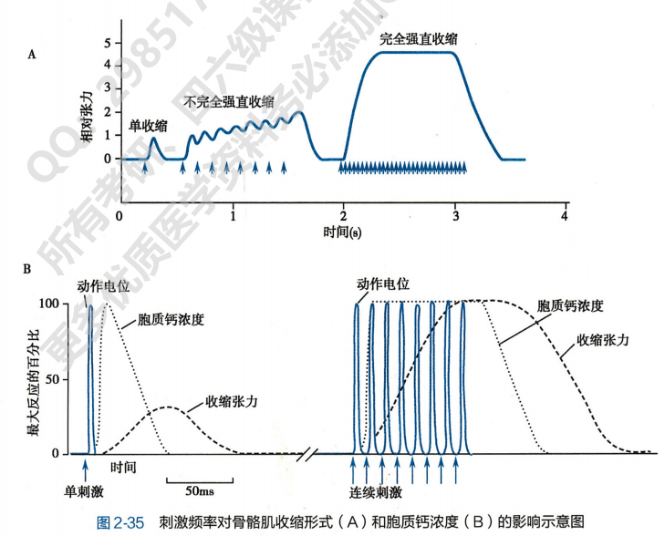

#### 平滑肌

平滑肌属于非随意肌，活动受自主神经调控，在细胞结构与收缩机制方面与横纹肌有显著差别

平滑肌分类：

- 单个单位平滑肌
  - 又称内脏平滑肌
  - 细胞间存在大连缝隙连接，电活动可直接传导到其他肌细胞，所有细胞可作为一个整体进行舒缩
  - 存在少量起搏细胞，能自发产生节律性兴奋和舒缩，引发整块平滑肌电活动和机械收缩
- 多单位平滑肌
  - 肌细胞相互独立，不含缝隙连接
  - 没有自律性，收缩受自主神经控制

平滑肌细胞结构特点：

- 细长纺锤形
- 细肌丝明显多于粗肌丝
- 无肌节，不显横纹
- 中间丝连接致密体和致密斑，形成细胞结构骨架

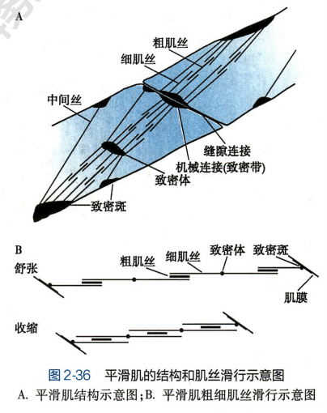

##### 平滑肌细胞的收缩机制

触发因子：Ca2+

Ca2+浓度调控有两种途径：

1. 电-机械耦联
   1. 平滑肌在化学信号等作用下产生动作电位
   2. 兴奋-收缩耦联提高Ca2+浓度，主要通过膜上的Ca2+通道流入
2. 药物-机械耦联：不产生动作电位情况下，接受化学信号直接诱发胞质中Ca2+浓度升高
   1. 胞外化学信号激活G蛋白耦联受体-PLC-IP3
   2. IP3激活SR膜的IP3R，介导SR释放Ca2+到胞内
   3. 通过SR上的钙泵和细胞膜上的Na+-Ca2+和钙泵将Ca2+摄入SR、运出胞质
   4. 降低Ca2+浓度的过程比骨骼肌缓慢，体现为平滑肌舒张缓慢

##### 平滑肌的肌丝滑行

平滑肌细胞不含肌钙蛋白，钙调蛋白CaM

- 胞质Ca2+升高，与CaM结合形成化合物，激活MLCK，触发平滑肌收缩
- 胞质Ca2+降低，MLCK失活，平滑肌舒张

## 第三章 血液

### 血液的生理概述

#### 血液的组成

血液由血浆和血细胞组成

血浆：

- 水、电解质、小分子有机化合物
- 血浆蛋白
  - 形成血浆胶体渗透压，保持血管内的水含量
  - 与激素结合，延迟激素留存时间
  - 作运输载体
  - 参与血液凝固、抗凝等生理过程
  - 抵御病原微生物
  - 营养功能

血细胞：

- 红细胞
- 白细胞
- 血小板

#### 血液的理化特性

血液的比重：

- 红细胞越多，全血比重越大
- 血浆蛋白越多，血浆比重越大

血液黏度：全血4 - 5，血浆1.6 - 2.4，取决于

- 血细胞比容
- 血浆蛋白含量
- 血流切率

血浆渗透压：主要来自Na+和Cl-

血浆pH：7.35到7.45，有缓冲对维持稳定：

- NaHCO3/H2CO3
- 蛋白质钠盐/蛋白质
- Na2HPO4/NaH2PO4

#### 血液的免疫学特性

固有免疫：又称为非特异性免疫

效应因子：

- 固有免疫细胞
  - 吞噬细胞
  - 自然杀伤细胞
  - 自然杀伤T细胞
- 补体
  - 与免疫有关且具有酶活性的球蛋白
  - 可被抗原激活
  - 激活后可导致细胞与细菌溶解、促进吞噬细胞吞噬

获得性免疫：又称特异性免疫

- 体液免疫：产生针对抗原的特异性抗体
  - B细胞被激活分裂分化成浆细胞
  - 浆细胞产生免疫球蛋白Ig，形成抗体
  - 抗体可中和毒性、促进吞噬、增强杀伤作用
- 细胞免疫：活化淋巴细胞攻击病原体
  - T细胞形成效应细胞分泌细胞因子进行细胞免疫
- 红细胞
  - 表面有补体受体
  - 可黏附抗原并被吞噬，清除病原体

### 血细胞的生理

#### 血细胞生成的部位和一般过程

血细胞起源于骨髓造血干细胞

造血过程：

1. 造血干细胞：自我复制、多向分化、重建长期造血（骨髓移植）
   1. 对称性分裂：分裂出两个相同的子代干细胞
   2. 非对称性分裂：分裂出一个干细胞和一个早期祖细胞
2. 定向祖细胞
3. 可识别的前体细胞

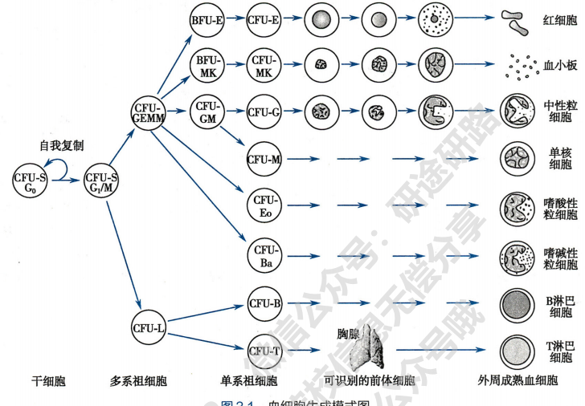

#### 红细胞的生理

血细胞中红细胞数量最多

成熟红细胞：

- 无核、双凹圆碟形
- 无线粒体，糖酵解是获得能量的唯一途径

生理特征：

1. 可塑变形性：在外力作用下可变形
2. 悬浮稳定性：能稳定悬浮于血浆中，因为与血浆摩擦力大
3. 渗透脆性：低渗盐溶液中膨胀破裂

红细胞功能：运输O2和CO2

- O2与血红蛋白结合运输
- 以碳酸氢盐和氨基甲酰血红蛋白形式运输CO2

 红细胞生成所需物质：

1. 铁：合成血红蛋白
2. 叶酸和维生素B12：合成DNA所需辅酶

红细胞生成的调节：

- 促红细胞生成素EPO：糖蛋白，作用于晚期红系祖细胞CFU-E
  - EPO抑制CFU-E凋亡
  - 激活特定基因表达，促进红系祖细胞分化和血红蛋白合成
  - 促进网织红细胞成熟和释放
  - 血浆EPO水平与血液血红蛋白浓度呈负相关
    - 贫血时，EPO升高，促进红细胞生成
    - 红细胞增高，EPO分泌减少
  - 肾是产生EPO的主要场所
  - 缺氧低氧会促进EPO合成和分泌

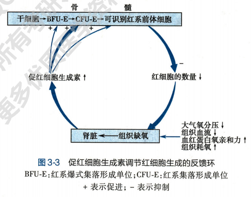

- 性激素
  - 雄激素可提高血浆中EPO浓度，促进红细胞生成
  - 雄激素也可直接刺激骨髓促进红细胞生成
  - 雄激素可促进血红蛋白合成
  - 雌激素可降低细胞对EPO反应，抑制红细胞合成

#### 白细胞的生理

白细胞：无色、有核，呈球形

可分为：

- 中性粒细胞
- 嗜酸性粒细胞
- 嗜碱性粒细胞
- 单核细胞
- 淋巴细胞

前三者总称粒细胞

各类白细胞均参与机体的防御功能，主要有两种方式：

1. 吞噬作用
2. 形成抗体和致敏淋巴细胞

白细胞渗出：除淋巴细胞外的白细胞都能伸出伪足变形，穿过毛细血管壁

趋化性：白细胞朝向某些化学物质运动的特性

趋化因子：吸引白细胞发生定向运动的化学物质

白细胞可分泌白细胞介素、干扰素等细胞因子

白细胞吞噬有选择性，可（在抗体和补体的帮助下）识别损坏和外源颗粒

##### 中性粒细胞

中性粒细胞：多核白细胞

循环池：约一半中性粒细胞随血液循环

边缘池：另一半滚动在小学馆内皮细胞上

两池中的细胞可互换实现动态平衡

中性粒细胞是主要的吞噬细胞：

- 会在趋化作用下渗出移动到炎症区域吞噬细胞
- 吞噬时能释放趋化因子吸引更多中性粒细胞
- 可通过抗菌性蛋白分子杀伤细菌
- 可产生活性氧基团依氧杀菌
- 杀菌后由溶酶体分解细菌

##### 单核细胞

骨髓进入血液的单核细胞未成熟，迁移至组织中后继续发育成**巨噬细胞**

巨噬细胞比中性粒细胞吞噬能力更强、可吞噬更多细菌、有更多酶

单核吞噬细胞可加工处理并呈递抗原

单核细胞还可发育成树突状细胞，吞噬能力较弱，但抗原呈递能力最强

##### 嗜酸性粒细胞

有昼夜周期性波动，于肾上腺皮质激素有关：晨少夜多

主要存在于组织中

含有过氧化物酶和主要碱性蛋白MBP带正电荷，呈嗜酸性

基本无杀菌作用，主要通过释放介质发挥功能

主要功能是：

1. 限制嗜碱性粒细胞和肥大细胞在I型超敏反应的作用
2. 参与对蠕虫的免疫反应

##### 嗜碱性粒细胞

存在于血液中，只有炎症时受趋化因子诱导才迁移到组织中

功能：

1. 释放肝素抗凝血，通畅血管
2. 释放组胺，使毛细血管壁通透性增加，局部水肿
3. 参与变态反应的重要效应细胞
4. 可释放嗜酸性粒细胞趋化因子A，吸引嗜酸性粒细胞，限制嗜碱性粒细胞在超敏反应中的作用

##### 淋巴细胞

在免疫应答起核心作用，可分为：

- T淋巴细胞：细胞免疫
- B淋巴细胞：体液免疫
- 自然杀伤细胞NK：固有免疫

#### 血小板的生理

##### 数量与功能

血小板无细胞核、体积小，受刺激可伸出伪足呈不规则形状

血小板膜上有多种糖蛋白，可作受体

血小板有助于维持血管壁的完整性，在生理止血中起重要作用

##### 血小板的生理特性

血小板的生理特性：

1. 黏附：血管内皮细胞受损时，可黏附于内皮下组织
2. 释放：血小板受刺激后将存储在致密体、溶酶体内的物质排出，排出物质可促进血小板活化、聚集，加速止血
3. 聚集：血小板与血小板之间相互黏着。可以通过光密度变化了解血小板的聚集情况（越聚集溶液越清澈）

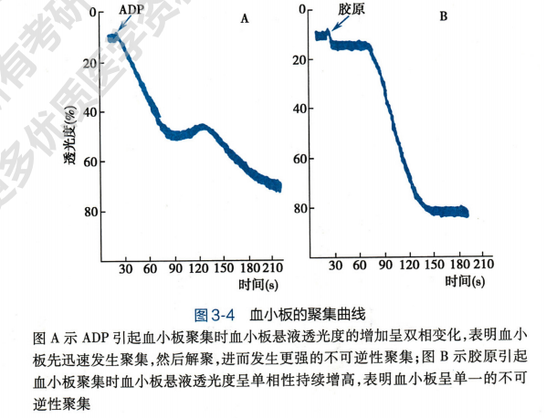

血小板聚集有两个时相：

1. 第一聚集：能快速聚集/快速解聚，可逆性聚集
2. 第二聚集：发生缓慢，但不能解聚，不可逆性聚集

生理性致聚剂：ADP、肾上腺素、胶原、凝血酶、TXA2

病理性致聚剂：细菌、病毒、药物等

血小板聚集的机制图如下：

- 血小板可经图中过程生成TXA2，促进血小板聚集
- 血管内皮细胞可合成PGI2，抑制血小板聚集
- 正常状态下两者相互平衡，血小板不会聚集
- 血管内皮细胞受损时，PGI2减少，TXA2较多促进血小板聚集修复血管

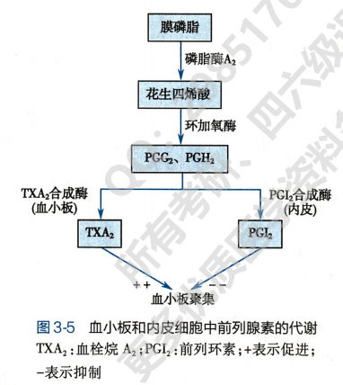

4. 收缩：血小板活化后，胞质内Ca2+增加分解ATP引起收缩
5. 吸附：血管内皮破损，局部凝血因子升高，血小板可吸附凝血因子黏附和聚集于局部

##### 血小板的生成与调节

生成：造血干细胞 -> 巨核系祖细胞 -> 原始巨核细胞 -> 幼巨核细胞 -> 成熟巨核细胞 -> 胞质裂解脱落下的有生物活性的小块胞质，成为血小板

大约2/3血小板存在于外周循环血液，剩余储存在脾脏和肝脏

血小板的调节：血小板生成素TPO，主要有肝细胞产生

TPO可促进巨核细胞增殖和分化，使血小板生成增加10倍

TPO调节血小板数量的方式；

- TPO以恒定速率从肝释放
- 血小板上有高亲和力TPO受体可与TPO结合并清除
- 正常情况下，大部分TPO都被血小板结合清除
- 当血小板数量减少时，TPO清除减少，多出的TPO刺激血小板增多

### 生理性止血

#### 生理性止血的基本过程

生理性止血过程包括三个阶段：

1. 血管收缩：受损血管局部和附近小血管收缩，原因有如下：
   1. 损伤刺激反射性使血管收缩（条件反射）
   2. 损伤引起肌源性收缩（动作电位-Ca2+-肌收缩）
   3. 损伤处血小板释放TXA2等缩血管物质引起血管收缩（化学物质）
2. 血小板止血栓形成
   1. 少量血小板黏附损伤部位
   2. 黏附的血小板释放信号释放内源性ADP和TXA2募集更多血小板黏附
   3. 血小板不断黏附形成血小板止血栓，**达成一期止血**
3. 血液凝固：
   1. 血管受损激活凝血系统
   2. 使血浆中可溶性纤维蛋白原转换为不溶性纤维蛋白
   3. 加固血栓形成凝血块，**达成二期止血**

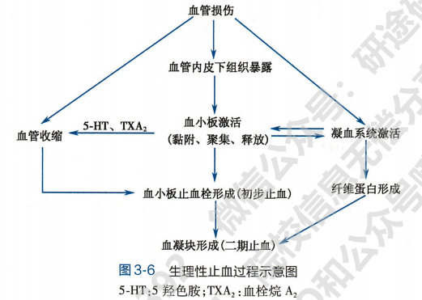

#### 血液凝固

凝血因子：直接参与血液凝固的物质，目前已知14种，除了一种是Ca2+外其他都为蛋白质

凝血因子的激活：正常情况下凝血蛋白酶都是无活性酶原，经过其他酶水解暴露活性中心才能激活，这个过程称为**凝血因子的激活**

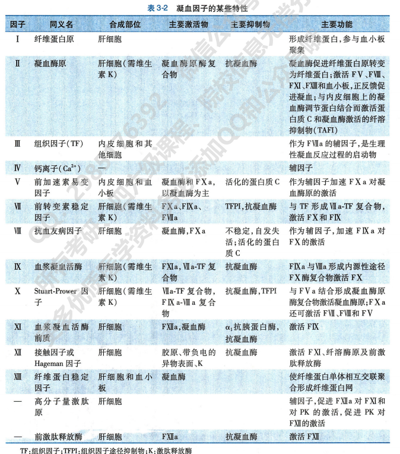

凝血过程包含三个步骤：

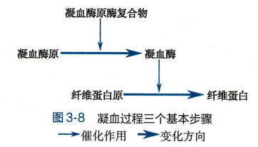

1. 凝血酶原酶复合物的形成
   1. 内源性凝血途径：**参与凝血的因子全部来自血液**，通常由**血液与异物接触启动**，经过一系列激活过程最终激活FX生成FXa
   2. 外源性凝血途径：由来自于血液之外的**组织因子TF暴露于血液而启动**的凝血。组织因子是位于组织细胞的跨膜蛋白，正常情况下不表达组织因子，血管损伤后暴露出损伤因子激活外源性凝血途径
   3. 上述两种途径产生的FXa在Ca2+存在时可**形成凝血酶原酶复合物**，**激活凝血酶原**
2. 凝血酶原的激活和纤维蛋白的生成
   1. 凝血酶原酶复合物激活凝血酶原形成凝血酶
   2. 凝血酶功能有：
      1. 使**纤维蛋白原**转变为**纤维蛋白单体**
      2. 激活FXIII为FXIIIa，FXIIIa在Ca2+作用下**使纤维蛋白单体相互聚合**，完成凝血过程
      3. 激活FV、FVIII等，形成凝血过程**正反馈机制**
      4. 使血小板活化

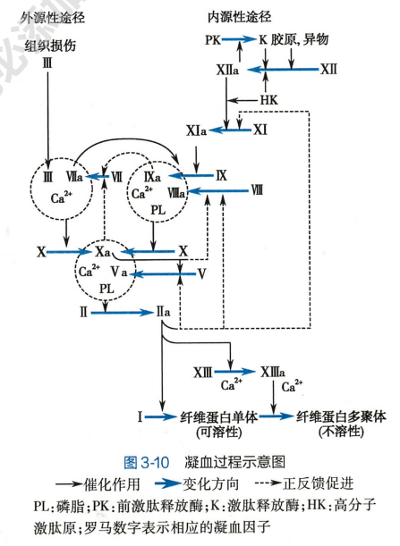

体内生理性凝血的机制：

- 组织因子使生理性凝血反应的启动物，激活FX为FXa启动凝血
- 虽然形成的凝血酶很少但能激活血小板、绕过部分步骤激活内源性凝血
- 最终激活足够的FXa和凝血酶完成凝血

血液凝固存在负性调控：

1. 血管内皮的抗凝作用保证血管通常：
   1. 正常血管内皮细胞可合成分泌组织因子途径抑制物、抗凝血酶等生理性抗凝物质
   2. 可是放PGI2和NO抑制血小板聚集
   3. 胞膜ADP酶可分解ADP抑制血小板激活
   4. 合成分泌组织型纤溶酶原激活物，促进纤维蛋白溶解
2. 纤维蛋白的吸附、血液的稀释和单核吞噬细胞的吞噬作用：
   1. 绝大部分凝血酶被纤维蛋白吸附，加速局部凝血、避免凝血酶扩散
   2. 活化凝血因子会在血液循环中稀释，并被抗凝物质灭活和被单核吞噬细胞吞噬
3. 生理性抗凝物质：
   1. 丝氨酸蛋白酶抑制物：抗凝血酶灭活凝血酶
   2. 蛋白质C系统：抑制FX和凝血酶激活、促进纤维蛋白溶解
   3. 组织因子途径抑制物TFPI：血管内皮细胞产生的糖蛋白，当FXa到达一定数量后负反馈抑制外源性凝血途径
   4. 肝素：增强抗凝血酶活性、促进TFPI释放间接抗凝

#### 纤维蛋白的溶解

纤溶系统主要包括：

1. 纤溶酶原
2. 纤溶酶
3. 纤溶酶原激活物
4. 纤溶抑制物

纤溶可分为**纤溶酶原激活**和**纤维蛋白降解**两个阶段

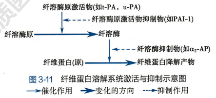

纤溶酶原：

- 主要由肝产生，正常无活性，在激活物作用下有限水解激活成纤溶酶
- 激活物包括t-PA和u-PA
  - t-PA：**内源性纤溶酶原激活物**，血管内皮细胞可合成。当**纤维蛋白存在时**与纤溶酶原的亲和力大大增强、激活能力大大增强
  - u-PA：主要在肾小管、集合管上皮细胞产生，激活纤溶酶原，在组织溶解血管外纤维蛋白

在纤溶酶作用下，纤维蛋白和纤维蛋白原可被分解为许多可溶性小肽，对部分凝血因子也有降解作用

纤溶抑制物主要有：

1. 纤溶酶原激活物抑制物-1(PAI-1)：由血管内皮细胞产生，与t-PA和u-PA结合使之灭活
2. α-抗纤溶酶(α-AP)：抑制纤溶酶活性，可防止纤维蛋白过早降解

正常情况血管内皮细胞PAI-1的量是t-PA的10倍，血液纤溶活性低。

当血管壁有纤维蛋白时，血管内皮分泌t-PA增多，由于t-PA与纤维蛋白结合能力很强，与纤维蛋白结合后可避免被PAI-1灭活

### 血型和输血原则
