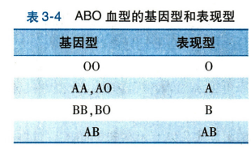
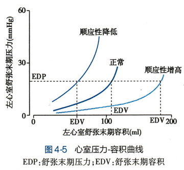
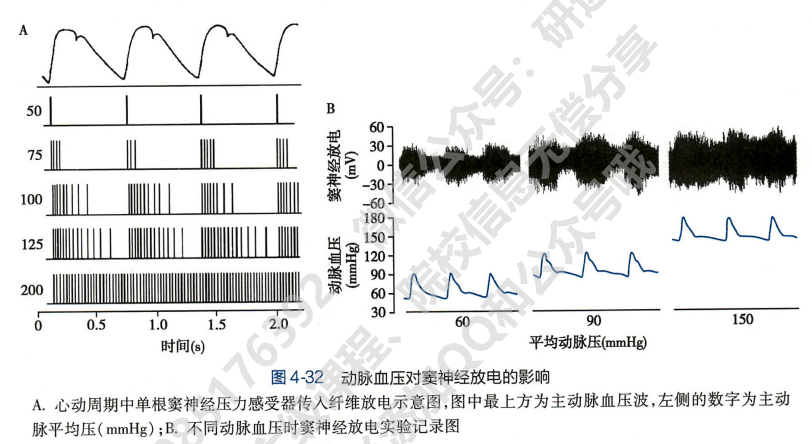

# 生理学

## 第一章 绪论

### 生命活动的基本特征

#### 新陈代谢

新陈代谢是机体生命活动最基本的特征，包括各种物质合成、分解和能量转换与利用，包含物质代谢和能量代谢

#### 兴奋性

作用于机体的内外环境变化称为**刺激**，机体对刺激所产生的应答性变化称为**反应**

不同组织细胞对刺激所产生的反应表现出不同的形式。接受刺激后能迅速产生某种特定生理反应的组织称为**可兴奋组织**

细胞接受刺激产生的反应有两种表现：

1. 有相对静止变为显著的运动状态，或原有的活动由弱变强，称为**兴奋。**能对刺激产生动作电位的组织或细胞也称为**可兴奋组织**，受刺激后产生动作电位的行为称为**兴奋**
2. 由运动转为相对静止，或活动由强变弱，这称为**抑制**

刺激要引起反应需要满足三个条件：

1. 足够的刺激强度
2. 足够的刺激作用时间
3. 适当的刺激强度-刺激作用时间变化率

能引起活组织细胞产生反应的最小刺激强度称为**阈强度/阈值**

刺激强度低于/高于阈值的刺激称为阈下/阈上刺激，超过最适刺激的称为强刺激

活组织细胞接受刺激产生反应的能力称为兴奋性，可以用阈值高低衡量兴奋性的高低

其他生命活动的基本特征还包括适应性、生殖、衰老等，此处略

### 机体生理功能的调节

#### 神经调节

反射是神经调节的基本形式

反射活动的结构基础为反射弧，由感受器、传入神经、中枢、传出神经和效应器组成

神经调节特点：迅速、作用快、调节精准

反射可分为条件反射（后天学习）和非条件反射（与生俱来）

#### 体液调节

机体的某些组织细胞分泌的特殊化学物质，通过体液途径到达并作用于靶细胞上的受体

特殊化学物质可以是激素也可以是某些细胞产生的特殊化学物质，也能是代谢产物

体液途径通过血液循环作用于全身靶细胞，称为远距分泌调节；化学物质不通过血液循环而是直接进入组织液，通过扩散作用到达邻近细胞发挥作用，称为旁分泌调节；细胞分泌激素或化学物质在局部扩散，又反馈作用于本身，称为子分泌调节；由下丘脑的一些细胞合成激素，然后随神经末梢进入血，称为神经内分泌调节

## 第二章 细胞的基本功能

### 细胞膜的物质转运功能

#### 细胞膜化学组成及分子排列形式

细胞膜主要由脂质和蛋白质组成，含少量糖类。排列形式为**液态镶嵌模型**

##### 细胞膜的脂质

脂质是细胞膜的基本架构，膜脂质主要由磷脂、胆固醇和少量糖脂组成

脂质分子都是双嗜性分子。磷脂双分子层亲水端朝向细胞外液或胞质，疏水端相对形成内部疏水区

膜脂质可因温度改变而呈凝胶或溶胶状态，使细胞膜具有稳定性和流动性。

此外膜的流动性还与膜脂质成分、膜蛋白含量有关：胆固醇含量越高，脂肪酸烃链越长蛋白质含量越多，流动性越低

##### 细胞膜的蛋白

根据膜蛋白在膜上的存在方式可分为两类：表面膜蛋白和整合膜蛋白

表面膜蛋白占 20%-30%，主要附着在细胞膜内表面，或以酶的形式参与信息转导或物质转运

整合膜蛋白占 70%-80%，肽链穿过膜脂质双层，多以 α-螺旋形式存在。一般与物质跨膜转运功能和受体功能有关的都属于整合膜蛋白

##### 细胞膜的糖类

主要是寡糖和多糖链，与膜蛋白或膜脂质结合形成糖蛋白或糖脂。大多数整合蛋白都是糖蛋白。

糖链基本上伸向细胞膜外侧，形成**糖包被。**糖包被可促进细胞接触和作用；许多糖类带负电，从而使细胞表面呈负电

#### 细胞膜的物质转运

##### 单纯扩散

定义：物质从质膜高浓度一侧像低浓度一侧进行跨膜扩散。

单纯扩散是物理现象，没有生物学转运机制，无需耗能，属于被动扩散

速率影响因素：

- 被转运物在膜两侧的浓度差
- 膜对该物质的通透性
- 溶液温度
- 膜有效面积

##### 易化扩散

定义：非脂溶性小分子物质或带电粒子**在跨膜蛋白的帮助下**，顺浓度梯度和电位梯度的跨膜转运。属于被动转运，不消耗 ATP

1. 经通道的易化扩散

带电离子经通道蛋白（离子通道）顺浓度/电位梯度运输。通道关闭时无离子通过，开放时快速通过。

重要特性：

- 离子选择性：每种通道只对一种或几种离子有较高通道能力
- 门控特性：静息时通道闸门关闭，只有刺激时分子构象变化，闸门开放

通道蛋白转运速率较快

2. 经载体的易化扩散

底物经载体从膜一侧转运至另一侧，过程为 **底物结合 - 构象变化 - 与底物解离**，过程较为复杂，因此转运速度较慢

载体介导的易化扩散有下面的特点：

- 结构特异性：载体只能识别具有特定化学结构的底物
- 饱和现象：因载体数量和转运速率有限，底物浓度到达一定值后，底物扩散速率不再随浓度增加而增大
- 竞争性抑制：两底物都能和同一载体结合，则会竞争载体，发生竞争性抑制，浓度较低的更容易受到抑制

##### 主动转运

定义：物质在膜蛋白的帮助下，由细胞供能进行逆浓度/电位梯度跨膜转运

根据**膜蛋白是否直接消耗能量**可分为**原发性主动转运**和**继发性主动转运**

1. 原发性主动转运

细胞直接利用能量将物质逆梯度转运。

转运底物多为离子，则介导这一过程的膜蛋白或载体称为**离子泵**，其本质是**ATP 酶**，可水解 ATP 并使自身构象发生变化进行转运

- 钠钾泵：每次活动使 3 个 Na+移出胞外、2 个 K+移入胞内，产生一个正电荷净外移，因此具有生电效应

  - 胞内许多代谢反应需要高 K+环境
  - 转运胞内 Na+，维持渗透压
  - Na+和 K+的转运是静息电位和动作电位的基础
  - Na+跨膜运输可为继发性主动转运蓄势

  
- 钙泵：也称 Ca2+-ATP 酶，具有特异性 Ca2+结合位点（不同于钠钾泵）

  - 质膜上的钙泵叫 PMCA，肌质网和内质网膜上的钙泵叫 SERCA
  - 前者可将 1 Ca2+/ATP 运出胞质，后者可将 2 Ca2+/ATP 从胞质运入内质网
  - 两者协同维持胞质 Ca2+浓度稳定在低水平
- 质子泵

  - 氢钾泵：分泌 H+摄入 K+，参与胃酸形成和肾脏排酸
  - 氢泵：将 H+由胞质运入溶酶体、高尔基体等细胞器内

2. 继发性主动转运

物质利用原发性主动转运建立起的 Na+或 H+浓度梯度，在 Na+或 H+离子顺浓度梯度扩散时同时时其他物质逆梯度转运的过程，称为继发性主动转运

继发性主动转运依赖于原发性主动转运

根据转运方向可分为两类：

- 通向转运：被转运的离子或分子都向同一方向运动，例如 Na+顺梯度入胞，葡萄糖逆梯度入胞
- 反向转运：反方向，例如 Na+顺梯度入胞，Ca2+逆梯度出胞

多数情况，跨质膜转运的动力来自钠泵建立的 Na+梯度，跨细胞器膜转运的动力来自质子泵建立的 H+梯度

##### 膜泡运输

大分子颗粒与物质，由膜包围形成囊泡，通过膜包裹、膜融合和膜离断一系列过程完成的转运，称为膜泡运输，包括入胞和出胞

出胞分为**持续性出胞**和**调节性出胞**：

1. **持续性出胞**：分泌囊泡自发不断排出大分子物质的过程
2. **调节性出胞**：物质合成后先存储在分泌囊泡，接收到化学信号或电信号时再释放囊泡

入胞分为**吞噬**和**吞饮**：

1. 吞噬：被转运物质以**固态形式**进入，不是以分子形式而是以团块或颗粒形式出现
2. 吞饮：被转运物质以**液态形式**进入细胞

胞吞和胞吐的更详细的原理可见**细胞生物学第三章**

### 细胞的信号转导

定义：**生物活性物质**（激素、神经递质、细胞因子等）通过**受体或离子通道**的作用而**激活或抑制**细胞功能的过程

生理意义：

1. 是生理功能调节的基础
2. 适应内、外环境变化
3. 对细胞形态结构和生存状态有影响

主要的信号转导通路：

1. 水溶性配体 - 膜受体 ：离子通道型受体、G 蛋白偶联受体、酶联型受体和招募型受体介导
2. 脂溶性配体 - 单纯扩散 - 胞质受体或核受体：核受体介导

#### 离子通道型受体介导的信号转导

离子通道型受体：即是离子通道又是受体（化学门控）

转导过程：

1. 配体与受体结合
2. 离子通道开放
3. 细胞膜对特定离子的通透选择性增加
4. 引起膜电位变化

特点：

1. 路径简单
2. 速度快

#### G 蛋白偶联受体介导的信号转导

G 蛋白偶联受体：被配体激活后，作用于与之偶联的 G 蛋白，再引发一系列反应

G 蛋白偶联受体无通道结构、无酶活性，引发反应主要是一系列生化反应

特点：

1. 速度慢
2. 但作用空间范围大
3. 信号逐级放大

##### 有关蛋白

信号转导过程主要涉及的蛋白如下

1. **G 蛋白偶联受体**：膜受体中最大家族，被配体激活后，通过改变分子构象，结合并激活 G 蛋白，再通过级联反应将信号传递到下游
2. **G 蛋白**：位于膜内侧面，有失活态（与 GDP 结合）和激活态（与 GTP 结合）两种构象，激活态导通/失活态中断信号转导。GTP 酶活性是关键

3. **G 蛋白效应器**：G 蛋白直接作用的标靶，包括第二信使物质、膜离子通道和膜转运蛋白等。效应器酶作用是催化生成/分解第二信使物质
4. **第二信使**：指激素、神经递质、细胞因子等细胞外信使分子（第一信使）作用于膜受体后产生的**细胞内信使物质**，一般指**效应器酶**分解细胞底物产生的小分子物质。第二信使可进一步激活**蛋白激酶**，使靶细胞磷酸化和构象变化
5. **蛋白激酶**：将 ATP 上的磷酸基团转移到蛋白上使蛋白磷酸化，使蛋白带电特性/构象发生变化，最终使其生物学特性变化，包括 PKA、PKC 等

##### 常见的信号转导通路

1. **受体 - G 蛋白 - AC - cAMP - PKA 通路**：此通路关键信使分子使 cAMP，也称 cAMP 第二信使通路。作用过程为：
   1. 第一信使
   2. G 蛋白偶联受体
   3. $G_s$激活 AC 提高 cAMP 浓度/$G_i$抑制 AC 降低胞质内 cAMP 浓度（拮抗作用）
   4. 激活依赖 cAMP 的 PKA
   5. 引起下游蛋白磷酸化/构象改变

2. 受体 - G 蛋白 - PLC - $IP_3$-Ca2+和 DG-PKC 通路：关键信使分子是$IP_3$和 DG，也称 IP3 和 DG 第二信使系统 ，转导过程如下；
   1. 受体与**G 蛋白**结合**激活 PLC**
   2. **PLC**分解膜脂质中的 PIP2 为**IP3 和 DG**
      1. IP3 作为门控使胞内 Ca2+库释放 Ca2+，Ca2+浓度升高，启动 Ca2+系统
      2. DG 为脂溶性物质，在膜内侧面激活 PKC，进一步磷酸化下游蛋白

3. Ca2+信号系统：Ca2+不仅可以改变膜电位影响细胞功能，更能作为第二信使与底物蛋白（即钙结合蛋白）结合，产生生物效应

#### 酶联型受体介导的信号转导

酶联型受体：本身就具有酶活性或与酶相结合的膜受体，受体类型有以下几种：

1. 酪氨酸激酶受体 TKR：
   1. 配体主要是各种生长因子
   2. 细胞外部分与配体结合
   3. 胞内侧酪氨酸激酶被激活
   4. 磷酸化下游蛋白
2. 酪氨酸激酶结合型受体 TKAR：
   1. 相比 TKR 本身没有酶活性，配体是生长因子和肽类激素
   2. 与配体结合激活
   3. 激活后在胞内侧与胞质中与酪氨酸激酶结合并使其激活
   4. 酪氨酸激酶磷酸化下游蛋白
3. 鸟苷酸环化酶受体
   1. 配体是心房钠尿肽 ANP 和脑钠尿肽 BNP
   2. 被配体激活后，通过 GC 活性催化 GTP 生成 cGMP
   3. cGMP 作为第二信使激活蛋白激酶 PKG
   4. PKG 将底物蛋白磷酸化
4. 丝氨酸/苏氨酸激酶受体
   1. 具有丝氨酸/苏氨酸激酶活性
   2. 被配体激活后使 Smad 蛋白磷酸化激活

相比 G 蛋白耦联受体，TKR 和 TKAR 介导的信号转导通路更简捷，但产生效应缓慢

#### 招募型受体介导的信号转导

受体分子没有酶活性，信号转导过程如下：

1. 胞外域与配体结合
2. 胞内域招募激酶或转接蛋白
3. 激活下游不涉及第二信使的信号转导通路

主要配体使细胞因子等

该类型的信号转导相当于跳过第二信使，直接对蛋白激酶进行招募

#### 核受体介导的信号转导

一般胞质受体与配体结合后也要转入核内发挥作用，因此通常把细胞内的受体统称核受体

信号转导过程：

1. 细胞外信号分子，如类固醇激素，进入细胞
2. 与受体结合形成**激素-受体复合物**
3. 激素-受体复合物**转移至核内**
4. 再在核内与**核内**靶基因上的**HRE**结合
5. 调节靶细胞**转录表达**特定蛋白质产物

### 细胞的电活动

#### 静息电位

**静息电位**：静息状态下，**细胞膜两侧存在的内负外正的电位差**，称为**静息电位**

生理学中称膜两侧**外正内负的稳定状态**为**极化**

超极化：静息电位增大

去极化：静息电位减小

静息电位的产生机制：

基本原因：带电离子的跨膜转运，转运速率取决于浓度差及膜的通透性

1. 膜两侧离子浓度差与平衡电位

   细胞膜两侧的离子浓度差由离子泵，主要是钠泵所维持：

- 外Na+浓度是内的12倍
- 内K+浓度时外的30倍

此时，**跨膜电场**和**离子浓度差**对离子移动的驱动力恰相反，将两者代数和称为离子的**电-化学驱动力。**

当电-化学驱动力为0时，膜两侧的电位差稳定，称其为**平衡电位，可用下面的公式计算：**

$$
E_X=\frac{RT}{ZF}ln\frac{[X]_o}{[X]_i}
$$

其中：

- $E_X$为平衡电位（细胞外为0时对应的细胞内数值）
- R、F为常数
- Z为离子价数（例如Na+为+1价）
- $[X]_o$和$[X]_i$分别为离子外/内浓度

当离子是正价时，离子浓度：

- 外>内：阳离子内流，内正外负
- 内>外：阳离子外流，内负外正

其他情况分析同理

2. 静息时细胞膜对离子有相对通透性

如果膜只对一种离子有通透性，那么静息电位等于该离子的平衡电位

如果对多种离子均有通透性，则静息电位为所有粒子平衡电位的综合结果，通透性越高的离子占比越大

例如，细胞膜对K+离子通透性最高，则静息电位主要接近K+离子的平衡电位（内>外，K+外流，外正内负）

静息电位可以表示为K+与Na+平衡电位关于通透性的加权和：

$$
E_m=\frac{P_K}{P_K+P_{Na}}E_K+\frac{P_{Na}}{P_K+P_{Na}}E_{Na}
$$

其中E表示平衡电位，P表示通透性

  

3. 钠泵的生电作用

钠泵分解1分子ATP可将3个Na+移出，将2个K+移入，使膜内形成负电位

但一般钠泵生电作用对静息电位的贡献十分有限

综上，影响静息电位的因素有：

1. 细胞外液K+浓度：因为细胞膜对K+通透性最大。胞外K+浓度升高，K+外流减少，形成电位差减小
2. 膜对K+和Na+的相对通透性：对K+越大，静息电位越大；对Na+越大，静息电位越小
3. 钠泵活动水平：钠泵越活跃生电作用越强

#### 动作电位

 定义：静息电位接受到刺激后产生的可传播的膜电位波动

动作电位的特点：

1. “**全或无”现象**：刺激强度不足就不会产生动作电位（无）；刺激达到阈值，动作电位就会到达最大值，不会随刺激强度增强而增大（全）
2. **不衰减传播**：动作电位产生后沿膜传遍整个细胞，幅度波形不变
3. **脉冲式发放**：连续刺激产生的多个动作电位总有一个间隔，不会融合

##### 动作电位产生机制

动作电位产生式在静息电位基础上，电-化学驱动力和细胞膜对离子通透性改变的结果

1. 电-化学驱动力及其改变：

**电化学驱动力 = 膜电位 - 离子平衡电位**，正号表示力向外，符号表示向内

$$
E_m-E_X
$$

可以理解为当前状态对离子稳定状态的牵引力（不恰当的比方），如下图，当前状态$E_m$对$E_{Na}$的牵引力向下，为负表示向内

如下图，安静状态Na+受到向内驱动力明显大于K+向外驱动力。而动作电位期间$E_m$改变较大，导致两离子电化学驱动力变化较大

2. 动作电位期间细胞膜通透性的变化

电压钳制实验：

- 超极化时，没有检测到膜电位变化，说明膜通透性不变
- 去极化时，先有向下的内向电流，再由向上的外向电流，说明去极化可引起膜通透性改变
  - 然后阻断钠通道，内向电流消失，说明内向电流时Na+介导
  - 阻断钾通道，外向电流消失，说明外向电流是由K+介导

表明：去极化刺激可引起细胞膜对两种离子通透性的改变

定量计算两种离子在去极化时的电导$G_{Na}$和$G_K$发现：

- 去极化程度越大，$G_{Na}$和$G_K$越大
- 去极化与$G_{Na}$有互相增强关系，即正反馈，有助于兴奋后快速形成动作电位
- 去极化使 $G_K$增大，但$G_K$增大后会促进复极化恢复静息电位，即负反馈调节

因此动作电位形成过程总结如下：

1. 细胞受到刺激，$G_{Na}$增大
2. Na+内流，静息电位降低，即去极化
3. 去极化正反馈增强$G_{Na}$，膜电位迅速上升，形成动作电位升支
4. 去极化到峰值后$G_{Na}$减小、$G_K$增大
5. K+外流，复极化，形成动作电位降支

膜电导改变的实质是**膜中离子通道的开放和关闭**

  离子通道（由激活门和失活门串联控制）有三种功能状态：

- 静息态：膜电位为静息电位，激活门关失活门开，钠通道关闭
- 激活态：去极化，钠通道激活门开放
- 失活态：失活门关激活门开，不导通

K+离子通道只有一个激活门，而且对去极化的反应有延迟，一般在Na+通道关闭后K+通道才激活，因此K+外流总是发生在Na+之后，两者不会相互抵消

##### 动作电位的触发

动作电位触发需要刺激达到一定的量，通常包括三个参数：

- 刺激强度
- 刺激持续时间
- 刺激强度-时间变化率

阈强度：能使细胞产生动作电位的最小刺激强度

阈刺激：相当于阈强度的刺激

阈电位：能触发动作电位的膜电位临界值

阈电位影响因素：

1. 膜上电压门控钠通道数量/密度、状态
2. 胞外Ca2+浓度：Ca2+浓度升高，可减小膜对Na+的通透性，因此Ca2+被称为稳定剂

##### 动作电位的传播

1. 动作电位在同一细胞上的传播：**局部电流学说**

产生局部兴奋的区域为**外负内正**，而未兴奋的区域为**外正内负**，因此兴奋区与未兴奋区之间会产生电位差，从而产生局部电流，方向为**从正电位到负电位**，不断从兴奋区向未兴奋区传导

2. 动作电位在细胞之间传播

在某些组织中，细胞之间存在缝隙连接：

- 缝隙连接处两个细胞的质膜很近
- 细胞之间有蛋白质形成的连接子
- 连接子中央有亲水性孔道

当一个细胞产生动作电位后，可通过缝隙连接直接传播到另一细胞

##### 兴奋性及其变化

兴奋性：机体接受刺激发生反应的能力

神经细胞、肌细胞、腺细胞容易接受刺激发生明显的兴奋反应，因为它们含有较多电压门控钠、钙通道

兴奋性高低可用刺激的阈值大小来衡量：

- 阈值越高，兴奋性越低
- 阈值越低，兴奋性越高

兴奋后的兴奋性变化：可兴奋细胞发生兴奋后，其兴奋性会出现周期性变化，分为以下四个阶段：

1. 绝对不应期：兴奋发生后一段时间，无论多强的刺激都不能使细胞再次兴奋，原因是：
   1. 兴奋时大部分钠通道已激活，不存在再次激活现象
   2. 兴奋后最初一段时间大部分钠通道已失活，无法再次激活
2. 相对不应期：兴奋性逐渐恢复，可再次接受刺激发生兴奋，**但刺激强度必须大于原来阈值**，原因是通道虽已经开始复活，但复活数量较少
3. 超常期：兴奋性轻度增高，原因是通道基本复活，但膜电位尚未完全恢复到静息电位，因此只需阈下刺激即可兴奋
4. 低常期：兴奋性轻度降低，原因是通道虽已复活，但膜电位轻度超极化，与阈电位水平距离增大

#### 电紧张电位

##### 电紧张电位的概念与产生

细胞膜可以看作是一个电容器，电荷Q外正内负形成电位差V，电容定义为

$$
C=\frac{Q}{V}
$$

同时细胞双脂质层之间的电阻称为膜电阻

如下图在某点注入脉冲电流，平行方向将向两端传播，同时会随时产生跨膜电流。由于轴向电阻和膜电阻的存在这些电流都会随离注入点的距离增加而不断减小

**电紧张点位**：随时间变化和空间分布变化的膜电位称为电紧张电位（区别于动作电位传播过程中不衰减）

空间常数：$\lambda$ ，用于描述电紧张点位的传播范围

- $\lambda$ 越大，影响范围越大
- 主要受**膜电阻**和**轴向电阻**影响

时间常数：$\tau$ ，用于描述电紧张点位的生成速度，可以理解为充电或放电**所需的时间**

- $\tau$ 越小，电紧张点位生成速度越快
- 主要受膜电阻和膜电容影响，主要是**膜电容**
- 减小膜电容可减小$\tau$

##### 电紧张电位的极性

如下图，将电源正负极同时插入胞质内，此时：

- 负极会吸引胞质内的正电荷，相当于注入正电荷，使胞质内外电位差减小，去极化
- 正极吸引负电荷，相当于注入负电荷，内外电位差增大，超极化

#### 局部电位

电紧张电位完全由细胞膜的被动特性决定，与离子通道和膜电导无关。但其实在神经递质或电紧张电位刺激下，部分离子通道开放产生轻度超极化或去极化反应

局部电位：部分离子通道开放形成的、不能远距离传播的电位

钠通道开放产生的去极化又称为**局部兴奋**

如上图，电源正极会产生超极化（静息电位下部分曲线），负极会产生去极化（静息电位上部分），这属于电紧张刺激

但随着电源电压增大，即刺激不断增强，超极化电位变化幅度大于去极化电位变化幅度，这是少量钠通道被激活后产生去极化叠加导致

### 肌细胞的收缩

人体肌组织按结构和收缩特性可分为：

- 骨骼肌
- 心肌
- 平滑肌

骨骼肌和心肌都有明暗交替的横纹，因此统称横纹肌

同时按受神经控制的差异，可分为：

- 随意肌（骨骼肌）：受躯体运动神经支配
- 非随意肌（心肌和平滑肌）：受自主神经调控

#### 横纹肌

##### 骨骼肌神经-肌接头

**骨骼肌神经-肌接头**：**运动神经末梢**与其支配的**骨骼肌细胞**之间的结构

由三部分组成：

- 接头前膜：运动神经轴突末梢膜的一部分
- 接头后膜：与接头前膜相对的骨骼肌细胞膜，也成为终板膜，**向内凹陷褶皱**增大表面积
- 街头间隙：充满细胞外液

兴奋传递过程具有电-化学-电传递的特点：

1. 运动神经纤维传导动作电位到轴突末梢
2. 触发接头前膜Ca2+依赖性突触囊泡出胞，释放乙酰胆碱ACh
3. ACh激活终板膜的N2型ACh受体氧离子通道产生膜电位变化（电信号）
4. 离子通道开放，Na+离子内流（对Na+和K+都有通透性，但Na+内驱力更强），产生去极化反应，称为终版电位EPP
5. EPP以电紧张方式向周围扩散，刺激普通肌膜上的钠通道开放，引发动作电位
6. ACh释放后被终板膜外的乙酰胆碱酯酶分解，使终板膜恢复到接受新兴奋的状态

兴奋传递过程ACh的释放非常关键：

- **ACh释放有**Ca2+依赖性
  - 接头前膜的动作电位激活前膜的钙通道
  - Ca2+内流触发囊泡出胞
  - 因此细胞外Ca2+浓度变化会明显影响兴奋传递
- ACh释放是**量子释放**，即以囊泡为基本单位“量子”
  - 兴奋时大量囊泡产生**终板电位EPP**
  - 静息时也会有少量囊泡自发释放，产生**微终板电位MEPP**

由于兴奋传导过程有神经递质参与，会受以下因素影响：

- 使用性增强现象
- 药物和病理因素可用影响受体、酶等物质

##### 横纹肌细胞结构特征

结构特征：含有大量**肌原纤维**和发达的**肌管系统**

肌原纤维：由粗肌丝和细肌丝组成，两者规律排列形成了明暗带

- 明带I
  - Z线：明带中间的线
  - 肌节：相邻两Z线之间的部分，**是肌肉收缩和舒张的基本单位**
- 暗带A
  - M线：暗带中央 线
  - H带：暗带中M线两侧较亮的区域

肌管系统有两种：

- **横管(T管)**：与肌纤维走向垂直
- **纵管(L管)**，与肌纤维走向平行的膜性管道，即**肌质网SR**
  - **纵行肌质网JSR**上的钙泵可逆梯度转运Ca2+到SR内

##### 横纹肌的收缩机制（重点）

横纹肌收缩时，暗带宽度不变，只有明带和H带变窄

收缩机制：肌丝滑行理论

- 横纹肌的肌原纤维有与其走向平行的粗肌丝和细肌丝构成
- 肌肉收缩与身长是粗肌丝和细肌丝在肌节内相互滑行导致
- 粗肌丝和细肌丝本身长度不改变

肌丝的分子结构：

- 由数百个肌球蛋白聚合
- 每个肌球蛋白有一个杆部和两个球形头部
  - 头部向外伸出形成横桥

粗肌丝中：

- 肌球蛋白杆状部集合在一起
- 头部向外形成 **横桥**
  - M线附近没有横桥
  - 横桥具有ATP酶活性，能与肌动蛋白结合
  - 横桥激活后向M线方向扭动，**是肌丝滑行的动力源**

细肌丝由以下三种蛋白按 7:1:1 比例构成：

- **肌动蛋白**：主干，含有横桥结合位点
- **原肌球蛋白**
  - 长杆状，绕肌动蛋白双螺旋槽走向
  - 舒张时恰覆盖肌动蛋白横桥结合位点，抑制肌丝滑行
- **肌钙蛋白**
  - 出现在原肌球蛋白双螺旋上
  - 舒张时遮盖横桥结合位点
  - 胞质中Ca2+浓度升高时，会与Ca2+结合，使肌钙蛋白构象变化，暴露肌动蛋白横桥结合位点，引发横桥结合，产生肌丝滑行

**肌球蛋白**和**肌动蛋白**直接参与肌肉收缩，称为**收缩蛋白**

而**原肌球蛋白**和**肌钙蛋白**不直接参与，但可调控收缩蛋白间的相互作用，称为**调节蛋白**

**肌丝滑行过程**：

1. 舒张时，横桥的ATP酶活性分解ATP产生能量使上次扭动过的横桥复位
2. 胞质Ca2+浓度升高，与肌钙蛋白结合使后者构象改变，暴露肌动蛋白横桥结合位点，触发横桥与肌动蛋白结合
3. 横桥构象改变，头部向桥臂扭动45°，拖动细肌丝向M线方向滑动
4. 横桥再与ATP结合，与肌动蛋白分离，复位

整个过程称为**横桥周期**

##### 横纹肌细胞的兴奋-收缩耦联

兴奋-收缩耦联：将横纹肌细胞产生动作电位的**电兴奋**与肌丝滑行的**机械收缩**联系起来的**中介机制**

耦联因子：**Ca2+**

兴奋-收缩耦联基本步骤：

1. **T管**膜传导动作电位并激活**L型钙通道**
2. 纵行肌质网JSR肌膜去极化（动作电位），顺梯度释放Ca2+到胞质
3. 胞质Ca2+浓度升高与肌钙蛋白结合触发肌肉收缩
4. JSR通过钙泵回摄Ca2+，胞质Ca2+浓度降低，肌肉舒张，因此舒张过程亦耗能（钙泵主动运输）

##### 影响横纹肌收缩效能的因素

等长收缩：肌肉长度不变，张力变大

等张收缩：肌肉张力不变，长度缩短

一般肌肉收缩先等长再等张缩短

1. 前负荷：肌肉在收缩前承受的负荷，决定肌肉初长度。如图，在一定范围内，肌肉收缩张力随初长度的增加而增大

2. 后负荷：肌肉收缩后承受的负荷。如图，后负荷与收缩速度成反比关系

3. 肌肉收缩能力：肌肉内在特性，结构、调节等
4. 收缩的总和
   1. 多纤维总和：多根肌纤维同步收缩产生的叠加效应
   2. 频率总和：提高骨骼肌收缩频率而产生的叠加效应
      1. 动作电位频率很低时为单收缩
      2. 后一次收缩叠加前一次的舒张，称为**不完全强直收缩**
      3. 后一次收缩叠加前一次收缩，称为**完全强直收缩**，张力可达单收缩的3-4倍

#### 平滑肌

平滑肌属于非随意肌，活动受自主神经调控，在细胞结构与收缩机制方面与横纹肌有显著差别

平滑肌分类：

- 单个单位平滑肌
  - 又称内脏平滑肌
  - 细胞间存在大连缝隙连接，电活动可直接传导到其他肌细胞，所有细胞可作为一个整体进行舒缩
  - 存在少量起搏细胞，能自发产生节律性兴奋和舒缩，引发整块平滑肌电活动和机械收缩
- 多单位平滑肌
  - 肌细胞相互独立，不含缝隙连接
  - 没有自律性，收缩受自主神经控制

平滑肌细胞结构特点：

- 细长纺锤形
- 细肌丝明显多于粗肌丝
- 无肌节，不显横纹
- 中间丝连接致密体和致密斑，形成细胞结构骨架

##### 平滑肌细胞的收缩机制

触发因子：Ca2+

Ca2+浓度调控有两种途径：

1. 电-机械耦联
   1. 平滑肌在化学信号等作用下产生动作电位
   2. 兴奋-收缩耦联提高Ca2+浓度，主要通过膜上的Ca2+通道流入
2. 药物-机械耦联：不产生动作电位情况下，接受化学信号直接诱发胞质中Ca2+浓度升高
   1. 胞外化学信号激活G蛋白耦联受体-PLC-IP3
   2. IP3激活SR膜的IP3R，介导SR释放Ca2+到胞内
   3. 通过SR上的钙泵和细胞膜上的Na+-Ca2+和钙泵将Ca2+摄入SR、运出胞质
   4. 降低Ca2+浓度的过程比骨骼肌缓慢，体现为平滑肌舒张缓慢

##### 平滑肌的肌丝滑行

平滑肌细胞不含肌钙蛋白，钙调蛋白CaM

- 胞质Ca2+升高，与CaM结合形成化合物，激活MLCK，触发平滑肌收缩
- 胞质Ca2+降低，MLCK失活，平滑肌舒张

## 第三章 血液

### 血液的生理概述

#### 血液的组成

血液由血浆和血细胞组成

血浆：

- 水、电解质、小分子有机化合物
- 血浆蛋白
  - 形成血浆胶体渗透压，保持血管内的水含量
  - 与激素结合，延迟激素留存时间
  - 作运输载体
  - 参与血液凝固、抗凝等生理过程
  - 抵御病原微生物
  - 营养功能

血细胞：

- 红细胞
- 白细胞
- 血小板

#### 血液的理化特性

血液的比重：

- 红细胞越多，全血比重越大
- 血浆蛋白越多，血浆比重越大

血液黏度：全血4 - 5，血浆1.6 - 2.4，取决于

- 血细胞比容
- 血浆蛋白含量
- 血流切率

血浆渗透压：主要来自Na+和Cl-

血浆pH：7.35到7.45，有缓冲对维持稳定：

- NaHCO3/H2CO3
- 蛋白质钠盐/蛋白质
- Na2HPO4/NaH2PO4

#### 血液的免疫学特性

固有免疫：又称为非特异性免疫

效应因子：

- 固有免疫细胞
  - 吞噬细胞
  - 自然杀伤细胞
  - 自然杀伤T细胞
- 补体
  - 与免疫有关且具有酶活性的球蛋白
  - 可被抗原激活
  - 激活后可导致细胞与细菌溶解、促进吞噬细胞吞噬

获得性免疫：又称特异性免疫

- 体液免疫：产生针对抗原的特异性抗体
  - B细胞被激活分裂分化成浆细胞
  - 浆细胞产生免疫球蛋白Ig，形成抗体
  - 抗体可中和毒性、促进吞噬、增强杀伤作用
- 细胞免疫：活化淋巴细胞攻击病原体
  - T细胞形成效应细胞分泌细胞因子进行细胞免疫
- 红细胞
  - 表面有补体受体
  - 可黏附抗原并被吞噬，清除病原体

### 血细胞的生理

#### 血细胞生成的部位和一般过程

血细胞起源于骨髓造血干细胞

造血过程：

1. 造血干细胞：自我复制、多向分化、重建长期造血（骨髓移植）
   1. 对称性分裂：分裂出两个相同的子代干细胞
   2. 非对称性分裂：分裂出一个干细胞和一个早期祖细胞
2. 定向祖细胞
3. 可识别的前体细胞

#### 红细胞的生理

血细胞中红细胞数量最多

成熟红细胞：

- 无核、双凹圆碟形
- 无线粒体，糖酵解是获得能量的唯一途径

生理特征：

1. 可塑变形性：在外力作用下可变形
2. 悬浮稳定性：能稳定悬浮于血浆中，因为与血浆摩擦力大
3. 渗透脆性：低渗盐溶液中膨胀破裂

红细胞功能：运输O2和CO2

- O2与血红蛋白结合运输
- 以碳酸氢盐和氨基甲酰血红蛋白形式运输CO2

 红细胞生成所需物质：

1. 铁：合成血红蛋白
2. 叶酸和维生素B12：合成DNA所需辅酶

红细胞生成的调节：

- 促红细胞生成素EPO：糖蛋白，作用于晚期红系祖细胞CFU-E
  - EPO抑制CFU-E凋亡
  - 激活特定基因表达，促进红系祖细胞分化和血红蛋白合成
  - 促进网织红细胞成熟和释放
  - 血浆EPO水平与血液血红蛋白浓度呈负相关
    - 贫血时，EPO升高，促进红细胞生成
    - 红细胞增高，EPO分泌减少
  - 肾是产生EPO的主要场所
  - 缺氧低氧会促进EPO合成和分泌

- 性激素
  - 雄激素可提高血浆中EPO浓度，促进红细胞生成
  - 雄激素也可直接刺激骨髓促进红细胞生成
  - 雄激素可促进血红蛋白合成
  - 雌激素可降低细胞对EPO反应，抑制红细胞合成

#### 白细胞的生理

白细胞：无色、有核，呈球形

可分为：

- 中性粒细胞
- 嗜酸性粒细胞
- 嗜碱性粒细胞
- 单核细胞
- 淋巴细胞

前三者总称粒细胞

各类白细胞均参与机体的防御功能，主要有两种方式：

1. 吞噬作用
2. 形成抗体和致敏淋巴细胞

白细胞渗出：除淋巴细胞外的白细胞都能伸出伪足变形，穿过毛细血管壁

趋化性：白细胞朝向某些化学物质运动的特性

趋化因子：吸引白细胞发生定向运动的化学物质

白细胞可分泌白细胞介素、干扰素等细胞因子

白细胞吞噬有选择性，可（在抗体和补体的帮助下）识别损坏和外源颗粒

##### 中性粒细胞

中性粒细胞：多核白细胞

循环池：约一半中性粒细胞随血液循环

边缘池：另一半滚动在小学馆内皮细胞上

两池中的细胞可互换实现动态平衡

中性粒细胞是主要的吞噬细胞：

- 会在趋化作用下渗出移动到炎症区域吞噬细胞
- 吞噬时能释放趋化因子吸引更多中性粒细胞
- 可通过抗菌性蛋白分子杀伤细菌
- 可产生活性氧基团依氧杀菌
- 杀菌后由溶酶体分解细菌

##### 单核细胞

骨髓进入血液的单核细胞未成熟，迁移至组织中后继续发育成**巨噬细胞**

巨噬细胞比中性粒细胞吞噬能力更强、可吞噬更多细菌、有更多酶

单核吞噬细胞可加工处理并呈递抗原

单核细胞还可发育成树突状细胞，吞噬能力较弱，但抗原呈递能力最强

##### 嗜酸性粒细胞

有昼夜周期性波动，于肾上腺皮质激素有关：晨少夜多

主要存在于组织中

含有过氧化物酶和主要碱性蛋白MBP带正电荷，呈嗜酸性

基本无杀菌作用，主要通过释放介质发挥功能

主要功能是：

1. 限制嗜碱性粒细胞和肥大细胞在I型超敏反应的作用
2. 参与对蠕虫的免疫反应

##### 嗜碱性粒细胞

存在于血液中，只有炎症时受趋化因子诱导才迁移到组织中

功能：

1. 释放肝素抗凝血，通畅血管
2. 释放组胺，使毛细血管壁通透性增加，局部水肿
3. 参与变态反应的重要效应细胞
4. 可释放嗜酸性粒细胞趋化因子A，吸引嗜酸性粒细胞，限制嗜碱性粒细胞在超敏反应中的作用

##### 淋巴细胞

在免疫应答起核心作用，可分为：

- T淋巴细胞：细胞免疫
- B淋巴细胞：体液免疫
- 自然杀伤细胞NK：固有免疫

#### 血小板的生理

##### 数量与功能

血小板无细胞核、体积小，受刺激可伸出伪足呈不规则形状

血小板膜上有多种糖蛋白，可作受体

血小板有助于维持血管壁的完整性，在生理止血中起重要作用

##### 血小板的生理特性

血小板的生理特性：

1. 黏附：血管内皮细胞受损时，可黏附于内皮下组织
2. 释放：血小板受刺激后将存储在致密体、溶酶体内的物质排出，排出物质可促进血小板活化、聚集，加速止血
3. 聚集：血小板与血小板之间相互黏着。可以通过光密度变化了解血小板的聚集情况（越聚集溶液越清澈）

血小板聚集有两个时相：

1. 第一聚集：能快速聚集/快速解聚，可逆性聚集
2. 第二聚集：发生缓慢，但不能解聚，不可逆性聚集

生理性致聚剂：ADP、肾上腺素、胶原、凝血酶、TXA2

病理性致聚剂：细菌、病毒、药物等

血小板聚集的机制图如下：

- 血小板可经图中过程生成TXA2，促进血小板聚集
- 血管内皮细胞可合成PGI2，抑制血小板聚集
- 正常状态下两者相互平衡，血小板不会聚集
- 血管内皮细胞受损时，PGI2减少，TXA2较多促进血小板聚集修复血管

4. 收缩：血小板活化后，胞质内Ca2+增加分解ATP引起收缩
5. 吸附：血管内皮破损，局部凝血因子升高，血小板可吸附凝血因子黏附和聚集于局部

##### 血小板的生成与调节

生成：造血干细胞 -> 巨核系祖细胞 -> 原始巨核细胞 -> 幼巨核细胞 -> 成熟巨核细胞 -> 胞质裂解脱落下的有生物活性的小块胞质，成为血小板

大约2/3血小板存在于外周循环血液，剩余储存在脾脏和肝脏

血小板的调节：血小板生成素TPO，主要有肝细胞产生

TPO可促进巨核细胞增殖和分化，使血小板生成增加10倍

TPO调节血小板数量的方式；

- TPO以恒定速率从肝释放
- 血小板上有高亲和力TPO受体可与TPO结合并清除
- 正常情况下，大部分TPO都被血小板结合清除
- 当血小板数量减少时，TPO清除减少，多出的TPO刺激血小板增多

### 生理性止血

#### 生理性止血的基本过程

生理性止血过程包括三个阶段：

1. 血管收缩：受损血管局部和附近小血管收缩，原因有如下：
   1. 损伤刺激反射性使血管收缩（条件反射）
   2. 损伤引起肌源性收缩（动作电位-Ca2+-肌收缩）
   3. 损伤处血小板释放TXA2等缩血管物质引起血管收缩（化学物质）
2. 血小板止血栓形成
   1. 少量血小板黏附损伤部位
   2. 黏附的血小板释放信号释放内源性ADP和TXA2募集更多血小板黏附
   3. 血小板不断黏附形成血小板止血栓，**达成一期止血**
3. 血液凝固：
   1. 血管受损激活凝血系统
   2. 使血浆中可溶性纤维蛋白原转换为不溶性纤维蛋白
   3. 加固血栓形成凝血块，**达成二期止血**

#### 血液凝固

凝血因子：直接参与血液凝固的物质，目前已知14种，除了一种是Ca2+外其他都为蛋白质

凝血因子的激活：正常情况下凝血蛋白酶都是无活性酶原，经过其他酶水解暴露活性中心才能激活，这个过程称为**凝血因子的激活**

凝血过程包含三个步骤：

1. 凝血酶原酶复合物的形成
   1. 内源性凝血途径：**参与凝血的因子全部来自血液**，通常由**血液与异物接触启动**，经过一系列激活过程最终激活FX生成FXa
   2. 外源性凝血途径：由来自于血液之外的**组织因子TF暴露于血液而启动**的凝血。组织因子是位于组织细胞的跨膜蛋白，正常情况下不表达组织因子，血管损伤后暴露出损伤因子激活外源性凝血途径
   3. 上述两种途径产生的FXa在Ca2+存在时可**形成凝血酶原酶复合物**，**激活凝血酶原**
2. 凝血酶原的激活和纤维蛋白的生成
   1. 凝血酶原酶复合物激活凝血酶原形成凝血酶
   2. 凝血酶功能有：
      1. 使**纤维蛋白原**转变为**纤维蛋白单体**
      2. 激活FXIII为FXIIIa，FXIIIa在Ca2+作用下**使纤维蛋白单体相互聚合**，完成凝血过程
      3. 激活FV、FVIII等，形成凝血过程**正反馈机制**
      4. 使血小板活化

体内生理性凝血的机制：

- 组织因子使生理性凝血反应的启动物，激活FX为FXa启动凝血
- 虽然形成的凝血酶很少但能激活血小板、绕过部分步骤激活内源性凝血
- 最终激活足够的FXa和凝血酶完成凝血

血液凝固存在负性调控：

1. 血管内皮的抗凝作用保证血管通常：
   1. 正常血管内皮细胞可合成分泌组织因子途径抑制物、抗凝血酶等生理性抗凝物质
   2. 可是放PGI2和NO抑制血小板聚集
   3. 胞膜ADP酶可分解ADP抑制血小板激活
   4. 合成分泌组织型纤溶酶原激活物，促进纤维蛋白溶解
2. 纤维蛋白的吸附、血液的稀释和单核吞噬细胞的吞噬作用：
   1. 绝大部分凝血酶被纤维蛋白吸附，加速局部凝血、避免凝血酶扩散
   2. 活化凝血因子会在血液循环中稀释，并被抗凝物质灭活和被单核吞噬细胞吞噬
3. 生理性抗凝物质：
   1. 丝氨酸蛋白酶抑制物：抗凝血酶灭活凝血酶
   2. 蛋白质C系统：抑制FX和凝血酶激活、促进纤维蛋白溶解
   3. 组织因子途径抑制物TFPI：血管内皮细胞产生的糖蛋白，当FXa到达一定数量后负反馈抑制外源性凝血途径
   4. 肝素：增强抗凝血酶活性、促进TFPI释放间接抗凝

#### 纤维蛋白的溶解

纤溶系统主要包括：

1. 纤溶酶原
2. 纤溶酶
3. 纤溶酶原激活物
4. 纤溶抑制物

纤溶可分为**纤溶酶原激活**和**纤维蛋白降解**两个阶段

纤溶酶原：

- 主要由肝产生，正常无活性，在激活物作用下有限水解激活成纤溶酶
- 激活物包括t-PA和u-PA
  - t-PA：**内源性纤溶酶原激活物**，血管内皮细胞可合成。当**纤维蛋白存在时**与纤溶酶原的亲和力大大增强、激活能力大大增强
  - u-PA：主要在肾小管、集合管上皮细胞产生，激活纤溶酶原，在组织溶解血管外纤维蛋白

在纤溶酶作用下，纤维蛋白和纤维蛋白原可被分解为许多可溶性小肽，对部分凝血因子也有降解作用

纤溶抑制物主要有：

1. 纤溶酶原激活物抑制物-1(PAI-1)：由血管内皮细胞产生，与t-PA和u-PA结合使之灭活
2. α-抗纤溶酶(α-AP)：抑制纤溶酶活性，可防止纤维蛋白过早降解

正常情况血管内皮细胞PAI-1的量是t-PA的10倍，血液纤溶活性低。

当血管壁有纤维蛋白时，血管内皮分泌t-PA增多，由于t-PA与纤维蛋白结合能力很强，与纤维蛋白结合后可避免被PAI-1灭活

### 血型和输血原则

#### 血型与红细胞凝集

血型通常指**红细胞膜上的特异性抗原类型**

红细胞凝集：血型不相容的血液混合，红细胞凝集成簇

在补体作用下，凝集的红细胞发生破裂引发溶血

红细胞凝集的本质是抗原-抗体反应：

- 特异性抗原取决于抗原决定簇，分为糖和多肽两种
- 抗原在凝集反应中称为凝集原
- 每个抗体有多个抗原结合位点，可结合多个相同抗原的红细胞使其凝集成簇

#### 红细胞血型

##### ABO血型系统

- ABO血型分型
  - A型
    - A1亚型
      - 含A和A1抗原
      - 血清中只有抗B抗体
    - A2亚型
      - 只含A抗原
      - 血清中有抗A1和抗B抗体
  - B型
    - 只含B抗原
    - 血清中只有抗A抗体
  - AB型
    - 含有A与B两种抗原
    - 没有抗A与抗B抗体
  - O型
    - AB两种抗原均无
    - 有抗A和抗B抗体

ABO血型的**各种抗原的特异性**取决于红细胞膜上的糖蛋白或糖脂上的**寡糖链**

A、B抗原都是在H抗原基础上由**糖基转移酶**催化增加糖基而来而来

O型虽不含A、B抗原，但含有H抗原，而H抗原也是由**糖基转移酶催化前体物质**合成得到

因此，**基因通过决定糖基转移酶种类**，决定催化何种糖基连接在前驱物质那个位置，间接决定血型抗原特异性寡糖链，决定血型的表现型

ABO血型系统的抗体有两类：

- 天然抗体：IgM，分子量大不能通过胎盘
- 免疫抗体
  - 机体接收自身不存在的红细胞抗原刺激形成
  - IgG抗体，分子量小，可通过胎盘

ABO血型染色体的遗传：

- 血型由9号染色体上A、B、O三个等位基因决定
- A和B为显性基因，O为隐性基因

ABO血型的鉴定：

- 正向定型：用抗A和抗B抗体检查有无A或B抗原
- 反向定型：用已知血型的红细胞检查血清中有无抗A后抗B抗体

##### Rh血型系统

Rh抗原特异性取决于蛋白质的氨基酸序列：

- Rh阳性者由RhD基因和RhCE基因
- Rh阴性者只有RhCE基因
- 通常将红细胞上含有D抗原者称为Rh阳性，不含D抗原者称为Rh阴性

Rh抗体：

- 人血清不存在抗Rh天然抗体
- 只有Rh阴性者接收阳性的血液后才会通过体液免疫产生抗Rh抗体
- Rh阴性孕妇怀有Rh阳性胎儿时，第一胎分娩时才有少量红细胞进入母体产生抗体；第二胎抗D抗体进入胎儿体内引发溶血

#### 血量和输血原则

血量：每千克体重有70~80ml血液

 输血最好坚持同型输血

交叉配血试验：

- 交叉配血主测：把供血者红细胞与受血者血清配合，检查受血者体内是否存在针对抗体
- 交叉配血次测：受血者红细胞与供血者血清配合，检查供血者体内是否存在针对性抗体

试验结果：

- 两侧都没有凝集，配血相合，可以输血
- 主侧凝集，配血不合，不能输血
- 主侧不凝集次侧凝集，配血基本相合，多见于将O型血输给其他血型或AB型血接收其他血型，只能少量输入

## 第四章 血液循环

循环系统包括：

- 心血管系统：起主要作用
  - 心脏
  - 血管
    - 动脉
    - 毛细血管
    - 静脉
  - 心腔与血管中的血液
- 淋巴系统：起辅助作用
  - 淋巴管
  - 淋巴器官

血液循环：心脏跳动推动血液在心血管系统内循环流动

血液循环主要功能：

- 物质运输：运送营养物质和代谢产物
- 体液调节：运送激素和生物活性物质
- 维持内环境稳态
- 血液防卫免疫功能

外周淋巴管收集部分组织液形成淋巴液，淋巴液汇入静脉血液

### 心脏的泵血功能

心脏的泵血功能：心脏节律性收缩和舒张对血液的驱动作用

收缩时将血液射入动脉，舒张时使静脉血回流到心脏

#### 心脏的泵血过程和机制

##### 心室泵血

心脏结构与功能：

- 两个心房：接收血液
- 两个心室：泵出血液

**左心房**接收肺部**富氧血**然后经**左心室**泵出到**全身**

**右心房**接收其他部位**贫氧血**然后经**右心室**泵到**肺部**氧合

心动周期：一次收缩和舒张的周期

 左右心房/心室活动同步，每个周期心房先收缩，后心室收缩；心房心室的收缩期都短于舒张期

左右心室的泵血过程相似且几乎同时，因此以座心室为例说明一个心动周期中心室射血和充盈过程：

1. 心室收缩期
   1. 等容收缩期：
      1. 收缩时室压升高，超过房压时**房室瓣关闭**
      2. 但室压仍小于主动脉压，**主动脉瓣未开启**。此时心室容积不变，但心室收缩持续增大室压
   2. 射血期：室压超过主动脉压时半月瓣开启射血
      1. 快速射血期：血液快速射入主动脉，心室容积缩小，但由于心室肌收缩，室压仍上升
      2. 减慢射血期：心室收缩减弱，射血变慢，室内压与主动脉压下降
2. 心室舒张期
   1. 等容舒张期：
      1. 射血后，心室舒张，室内压下降；主动脉血反流回心室推动**半月瓣关闭**
      2. 此时室内压仍大于房压，**房室瓣关闭**，心室舒张室内压下降
   2. 心室充盈期：室压低于房压时，房内血冲开房室瓣进入心室
      1. 快速充盈期：心室快速充血，容积迅速增大
      2. 减慢充盈期：压力梯度减小，充盈减慢

左心室肌收缩和舒张是造成左心室内压变化，导致心房和心室、心室和主动脉之间压力梯度的根本原因

压力梯度是推动血液流动的主要动力

右心室泵血和左心室基本相同，但肺动脉压仅为主动脉呀1/6，因此右心室内压变化幅度不会有左心室内压那么大

##### 心房

心房的初级泵作用：

1. 心房主要功能：接收静脉回流的血液返回心室
2. 心室舒张期后期心室轻微收缩，使心室容积增大，提高心室肌初长度和收缩力，提高心室泵血
3. 如果心房不能正常收缩，心室每次射血量减少

房内压变化：

1. 心房收缩时房内压升高(a升支)
2. 心房舒张房内压降低(a降支)
3. 心室收缩时，心室血液推顶房室瓣使其凹入心房，房内压略微升高(c升支)
4. 射血后，心室容积减小，房室瓣向下移动，房内压减小(c降支)
5. 血液流入心房，房室瓣仍关闭，房内压升高(v升支)
6. 血液从心房流入心室，房内压降低(v降支)

#### 心输出量

**每搏输出量**：一侧心室一次心脏搏动射出的血液量，简称**搏出量**

左心室舒张末期容积EDV约125ml

收缩末期容积ESV约55ml

EDV - ESV = 约70ml即为搏出量，可见心室内并非所有血液都被搏出

搏出量占心室舒张末期容积的比例，称为**射血分数**，即射出量/原有总量

每分输出量：一侧心室每分钟射出的血液量，也称**心输出量**

每分输出量 = 心率 * 搏出量

#### 心脏泵血功能的储备

心输出量可随机体代谢需要而增加的能力，称为**心泵功能储备或心力储备**

例如剧烈运动时的心输出量是安静时的5到6倍

心泵功能储备取决于搏出量和心率能提高的程度，因此包括两部分：

1. 搏出量储备
   1. 收缩期储备：提高心肌收缩能力，提高射血分数，比舒张期准备大得多
   2. 舒张期储备：增加舒张末期容积
2. 心率储备
   1. 在保持搏出量的情况下使心率加快
   2. 当心率过快时，心室充盈不足，心输出量和搏出量均减少

#### 影响心输出量的因素

心输出量 = 搏出量 * 心率

而搏出量受心室肌前负荷、后负荷和心肌收缩能力等影响

- **心室前负荷**
  - 心室前负荷/初长度，取决于舒张末期血液充盈量，等价于心室舒张末期内压EDP
  - 而舒张末期房压与室压基本相等，房内压测定方便
  - 因此常用心室舒张末期心房内压力反应前负荷
- **心肌异长自身调节**：通过改变心肌初长度引起心肌收缩力改变
  - 心功能曲线：增加前负荷，心肌收缩力加强，搏出量增多，每搏功增大
    - 5-15，心每搏功随心室舒张末期压增大
    - 15-20，趋于平坦
    - 高于20平坦
  - **心定律**：一定范围内增大心室舒张末期容积可增强心室收缩力
  - 心室肌**抗过度延伸特性**：心室肌初长度在超出最适长度后不再随室内压增加而增加，这使得心室功能曲线不会有明显降支
  - **生理意义**：对搏出量的变化进行调节，**平衡心室射血量和静脉回心量**

- 影响前负荷的因素：心室舒张末期充盈血量 = 静脉回心血量 + 射血后剩余血量
  - 静脉回心血量
    - 心室充盈时间：充盈完全则静脉回心血量多，反之减少
    - 静脉回流速度：回流越快静脉回心血量越多；速度取决于外周静脉压与心房、心室内压差，压力梯度越大，回流速度越快
    - 心室舒张功能：心室舒张耗能，心肌细胞内Ca2+回降速度越快，心室舒张速度越快，心室负压越大，抽吸作用越强，静脉回心血量越多
    - 心室顺应性$C_V$：单位压力变化引起的容积改变，即$C_V=\frac{\triangle V}{\triangle P}$。心室顺应性高时，相同充盈压下能容纳更多血量，反之则降低
  - 射血后心室内剩余血量
    - 主动脉压升高导致搏出量暂时减少，可使剩余血量增多
    - 但剩余血量增加，舒张末期室内压增高，静脉回心血量减少

- 后负荷：大动脉血压使心室收缩的后负荷
  - 大动脉血压增高，等容收缩期延长，射血期缩短，搏出量减少；反之利于心室射血
  - 大动脉血压增高，搏出量减少，心室剩余血量增多，假设静脉回心血量不变，则心室舒张末期容积增大，**异长自身调节**加大心肌收缩力量，提高搏出量，使心室舒张末期容积恢复到原先水平
- 心肌收缩能力：心肌本身的内在特性
  - 心肌收缩能力增强，心室功能曲线向左上移动，即相同前负荷（房压）下，每搏功增加
  - 改变心肌收缩能力的调节称为“等长调节”
  - 影响因素
    - 活化横桥数目：活化横桥比例取决于Ca2+浓度和肌钙蛋白对Ca2+的亲和力
    - 肌球蛋白头部ATP酶活性
- 心率
  - 一定限度内提高心率可以提高心输出量
    - 心率过快，充盈不足，心输出量反而降低
    - 心率过慢，充盈早就到达最大限额，心输出量同样降低

#### 心功能评价

##### 心室压力变化评价心功能

心导管术：导管从周围血管插入，送入心腔及各处大血管的技术

**心导管检查时评价心室功能的金标准**

1. 心脏射血功能评价
   1. 通过搏出量、射血分数、每搏功、心输出量等指标评价射血功能
   2. 通过心室收缩压对时间的一阶导数dP/dt评价，如下图波峰，青年收缩压变化率峰值比老年高，说明收缩能力更强

2. 心舒张功能评价
   1. 对舒张压曲线求一阶导数 -dP/dt 作为心室舒张能力的评价指标（舒张时新室内为负压吸血）
   2. 如上图波谷，青年波谷绝对值大于老年波谷绝对值，说明青年舒张能力更强（产生瞬时负压更大）

##### 心室容积变化评价心功能

**超声心动图检测**是临床最常用的**无创检查方法**

1. 心室收缩功能评价
   1. 首选指标：左心室射血分数
   2. 同时还可用射血期心室容积变化速率dV/dt和心室直径变化速率dD/dt反应心室收缩能力
2. 心室舒张功能评价，如下图：
   1. 舒张开始时，左心室血液流入速率较快(e波)
   2. 舒张末期，左心房收缩使流入速率小幅度增大(a波，且e>a)
   3. 对于舒张障碍者
      1. 等容舒张期延长（需要更长时间舒张），-dP/dt绝对值下降
      2. 舒张早期左心室压力较高，抽吸作用变小，e波变小
      3. 舒张末期，左心房收缩对左心室充盈作用增大，a波变大（因为舒张末期容积减小所以可充盈更多血液）

##### 心室压力和容积变化评价心功能

心脏做功量的测定：

1. 外功：心室收缩产生室内压推动血液所做的机械功
2. 内功：心脏活动中用于离子跨膜主动转运、克服心肌内部粘滞阻力等的耗能

每搏功：简称搏功，心室一次收缩射血所做的外功

每搏功由两部分组成：

1. 压力-容积功：将一定容积的血液提升到一定压力、增加血液势能
2. 血液动能：血液流动的动能

$$
压力-容积功 = 搏出量 \times 心动周期中室压增量，W = P\triangle V
$$

$$
血液动能 = 1/2 \times (搏出量质量\times 血流速度^2)，E_k=\frac{1}{2}mv^2
$$

每搏功 = 压力-容积功 + 血液动能

安静状态下血液动能占比很低，因此可将每搏功近似为压力-容积功

由于射血过程中室内压是变化的，因此数学上需要计算压力曲线的积分。但实际应用中常用下面两种替换：

- 用平均动脉压替代左心室内压平均值，即射血初期室内压
- 用左心房平均压替代左心室舒张末期压，即射血末期压

因此每搏功计算公式变为

每分功：心室每分钟收缩射血所做的功

每分功 = 每搏功 × 心率

在上面通过心导管术和超声心动图绘制出心室压力-时间曲线和心室容积-时间曲线后，根据每个相同时间点的压力和容积可以绘制压力-容积曲线，得到压力-容积环

压力-容积环逆时针一周为一个心动周期，其反映了一个心动周期过程中压力与容积的关系

其中收缩末期压力-容积关系曲线ESPVR可反映心室收缩能力，也可以用于反映前负荷与后负荷变化

#### 心音

人有四种心音：

1. 第一心音：由**房室瓣关闭**以及**心室射血震动**引起，**标志心室收缩开始**
2. 第二心音：由**主动脉瓣和肺动脉瓣关闭**、血液冲击引起，**标志心室舒张期开始**
3. 第三心音：**心室快速充盈期末**，血流突然减速引起
4. 第四心音：**心房收缩**引起震动，也称心房音，出现在**心室舒张末期**

### 心脏的电生理学及生理特征

心脏的节律性收缩与舒张与生物电活动有关

心肌细胞动作电位每个时期都有两种以上离子流参与

一次动作电位包含被动和主动离子转移两个过程

心肌细胞根据电生理学特点可分为两种：

1. 工作细胞：心房肌和心室肌，由稳定静息电位，执行收缩功能
2. 自律细胞：窦房结细胞和浦肯野细胞，没有稳定静息电位，可自动产生节律性兴奋

根据动作电位去极化快慢及机制可分为：

1. 快反应细胞：去极化速度和幅度大，兴奋传到快，复极化缓慢
2. 慢反应细胞：去极化速度幅度小，兴奋传导满，复极化慢

#### 心肌细胞的跨膜电位及其形成机制

心肌细胞动作电位在不同类型心肌细胞不同，其形成机制/离子流也不同

##### 工作细胞跨膜电位及形成机制

**静息电位的形成**：心肌工作细胞细胞膜静息时对K+通透性高，**K+顺浓度梯度外流**，形成**外正内负**电位差，约为-90mV

同时细胞膜对Na+等离子也有一定通透性，因此Na+内流抵消部分K+外流的电位差

因此静息电位大小主要取决于

- 细胞内外液K+浓度差
- 膜对K+的通透性

**K+向膜外扩散是静息电位主要来源**

**心室肌动作电位**由去极化和复极化两个过程五个时期组成：

1. 动作电位0期（快速去极化期）
   1. 心肌细胞受刺激，膜上钠通道开放，**Na+顺梯度内流去极化**，构成动作电位升支
   2. **钠通道是快通道**，激活、失活快
   3. 该去极化过程为**正反馈**：Na+内向电流可引起更多钠通道开放，形成更大的$I_{Na}$，因此可迅速到达平衡电位ENa，动作电位升支陡峭
   4. T型钙电流$I_{Ca-T}$也是快速内向离子流，但离子流较弱，去极化作用不大
2. 动作电位1期（快速复极化期）
   1. 膜去极化使瞬时外向电流($I_{to}$)通道开放，K+迅速短暂外流，引起快速复极化
   2. 1期还有氯电流$I_{Cl}$，但一般强度小
3. 动作电位2期（平台期）
   1. 1期复极化接近0mV后，保持极缓慢复极化过程，离子流最复杂，既有内向又有外向离子流
   2. 内向电流：
      1. 钙通道（慢通道）开放引起Ca2+缓慢而持久地内流，形成**L型钙电流** $I_{Ca-L}$ ，是形成平台期的主要原因
      2. 慢失活的$I_{Na}$，强度不大，但失活受阻时明显增大
   3. 外向电流
      1. **内向整流钾电流**$I_{K1}$时形成长时间平台期的主要原因。静息时IK1通道开放使K+外流；去极化时通透性降低阻止K+外流，此现象称为**内向整流**
      2. 延迟内向整流钾电流$I_K$，其随时间逐渐加强：早期抗衡$I_{Ca-L}$，后期时复极化主要电流
      3. 早期Ca2+内流和K+外流平衡，随后钙通道逐渐失活，K+外流主键增加形成复极
4. 动作电位3期（快速复极化末期）
   1. $I_K$逐渐加强，快速复极化直到恢复静息电位
   2. $I_K$正反馈，K+外流使膜内电位转负，膜内电位越负，外流电流越大
   3. $I_{K1}$在复极化末期开始加强，加速终末复极化
5. 动作电位4期（完全复极化期）
   1. 静息期，电位保持稳定的静息电位
   2. 钠泵增强，完成Na+外运和K+内运
   3. Na+-Ca2+交换提加强，将3个Na+运入，将1个Ca2+排出，运入的Na+再由钠泵排出
   4. 两泵将动作电位期间排出的K+、流入的Na+和Ca2+复位

离子的被动转运：生物膜通透性改变，产生动作电位

离子的主动转运：保证膜内外不对等分布，保持细胞膜兴奋性

**心房肌细胞静息电位**：心房肌细胞膜上$I_{K1}$通道密度低于心室肌，外流少，受Na+内漏影响较大，因而静息电位略小于心室肌细胞，约为-80mV

心房肌细胞动作电位与心室肌细胞很相似，但也有区别：

- $I_{to}$通道较发达，电流较大，平台期不明显
- 复极化较快使动作电位时程较短
- 心房肌细胞膜上存在乙酰胆碱Ach敏感的钾电流，Ach激活通道使K+外流增强出现超极化，时程明显缩短

##### 自律细胞跨膜电位及其形成机制

自律细胞与工作细胞最大的区别是**没有稳定的静息电位**

这是由于再3期复极化末时达到最大复极电位MRP后，4期电位并不稳定在这一电位，而是**立即开始去极化**

通常用**MRP**的值代表**静息电位值**

**4期自动去极化时自律细胞产生自律性兴奋的基础**

###### 窦房结细胞动作电位

窦房结中的自律细胞为**P细胞**，动作电位为**慢反应电位**

动作电位性状与心室肌等**快反应电位**有很大不同：

1. 去极化速度和幅度小
2. 没有明显1期和平台期，只有0、3、4期
3. 4期电位不稳定，最大复极电位绝对值小
4. 4期发生自动去极化，达到阈电位即可爆发动作电位

窦房结P细胞膜上$I_{K1}$通道较少，因而最大复极电位小于心房肌静息电位，约为-70mV

窦房结P细胞动作电位：

1. 0期
   1. 因为窦房结P细胞缺乏$I_{Na}$，因而不能向心室肌细胞一样产生快速去极化
   2. 0期产生主要依靠$I_{Ca-L}$，即钙离子内流
   3. 因此去极化速度缓慢，受细胞外Ca2+浓度影响
2. 因为窦房结P细胞缺乏$I_{to}$通道，因而无明显1期和2期
3. 3期复极化
   1. 主要依靠$I_K$，使动作电位复极到MRP水平
4. 4期自动去极化
   1. P细胞动作电位到达MRP时，外向$I_K$逐步衰减，与内向离子流$I_f$共同导致自动去极化
   2. -50mV左右，内向T型钙电流$I_{Ca-T}$加速自动去极化
   3. 去极化达到$I_{Ca-L}$阈电位时，$I_{Ca-L}$通道开放，钙离子内流开始一个新的动作电位

###### 浦肯野细胞动作电位

浦肯野细胞兴奋时产生快反应动作电位，与心室肌动作电位相似

也分为01234五个时期，0123期机制与心室肌细胞基本相同，不同点是：

- 0期去极化速度比心室肌细胞快
- 1期较心室肌细胞更明显，1期和2期之间有明显切痕
- 膜中$I_{K1}$通道密度较高，MBR较心室肌静息电位更大
- 4期电位不稳定
- 所有心肌细胞中浦肯野细胞动作电位时程最长

自动去极化机制：

- 外向电流减弱：复极到-50mV左右$I_K$通道关闭
- 内向电流增强：$I_f$通道开始激活开放，激活程度随膜内负电压增大而增强
- $I_f$在自动去极化过程起主要作用
- 但由于$I_f$通道密度低，激活开放速度慢，因此4期自动去极化速度慢

#### 心肌的生理特性

心肌细胞有四种生理特性：

- 兴奋性
- 传导性
- 自律性
- 收缩性

前三种是电生理特性，第四种是机械特性，两种特性紧密相连

一般心肌细胞产生动作电位、通过**兴奋-收缩偶联**引起心肌收缩

工作细胞无自律性，自律细胞无收缩性

##### 兴奋性

心肌细胞每产生一次兴奋，其膜电位会发生一系列规律性变化，兴奋性因而也有周期性变化

心室肌细胞兴奋性的周期性变化：

1. 有效不应期ERP
   1. 绝对不应期：0期去极化开始到3期复极化到-55mV，无论多强的刺激都不会引起去极化
   2. 局部不应期：-55mV到-60mV阈上刺激可引起局部反应，但不会产生新的动作电位
   3. 原因：钠通道完全失活或尚未恢复到可被激活的状态
   4. 心肌的ERP特别长
2. 相对不应期RRP
   1. 复极化-60mV到-80mV，阈上刺激可产生动作电位
   2. 原因：有相当数量钠通道复活到备用状态，但不多，因此需要阈上刺激才能引起兴奋
3. 超常期SNP
   1. -80mV到-90mV，阈下刺激即可引起兴奋
   2. 原因：钠通道基本恢复可被激活备用状态，且膜电位与阈电位接近
   3. 在相对不应期和超常期，膜电位低于静息电位，**钠通道开放数量和速率均低于静息电位时**，因此产生新兴奋时，去极化（Na+内流）速度和幅度都会低于正常

细胞兴奋性高低通常用刺激阈值大小衡量：刺激阈值低则兴奋性高；否则反之

影响心肌兴奋性的因素：

1. **静息电位或最大复极电位水平**：阈电位不变时，这两种电位负值越大，与阈电位的距离就越大，需要的刺激强度就越强，兴奋性越低
2. **阈电位水平**：与上面同理，阈电位上移，与静息电位或最大复极电位的距离增大，刺激阈值增大，兴奋性降低；反之，电位距离缩小，所需刺激强度缩小，兴奋性增强
3. 引起0期去极化的**离子通道的性状**
   1. 0期去极化的通道都有**静息（备用）、激活和失活**三种状态
   2. **快反应动作电位**中
      1. 静息时**钠通道**静息，受到阈刺激、膜去极化达到阈电位后，大量钠通道激活
      2. 随后失活关闭
      3. 失活后须等到复极化到-60mV才能开始复活
      4. 复活需要时间，只有恢复到静息电位钠通道才全部恢复到静息状态
      5. 这就是有效不应期刺激不能产生兴奋的本质原因
   3. 慢反应动作电位中
      1. 兴奋性取决于L型钙通道功能状态
      2. L型钙通道激活、失活、复活速率均较慢

**兴奋性的周期性**与**收缩活动**的关系：

1. 心肌细胞**有效不应期很长**，延续到心肌舒张早期，**使收缩和舒张交替进行**，保证泵血活动正常
2. 一般窦房结产生的兴奋到达心房/心室肌时，有效不应期已经结束，因此能不断产生兴奋
3. 如果在窦房结兴奋到达前受到外来刺激，则可产生**期前兴奋**和**期前收缩**
   1. 期前兴奋和期前收缩也有**有效不应期**
   2. 如果窦房结兴奋恰巧落在该有效不应期，则需要等到**下一次窦房结兴奋**才能引发兴奋与收缩
   3. 因此期前收缩后可能会有一段较长的心室舒张期，成为**代偿间歇**

##### 传导性

心肌的传导性是指心肌细胞传导兴奋的能力或特性

兴奋在心内的传播时通过特殊的传导系统有序进行：

1. **窦房结**产生的兴奋能直接传给**心房肌纤维**
2. 心房中有小肌束组成的优势传导通路，可将兴奋快速传导到**房室结**
3. 房室结中兴奋传导缓慢，此时会出现时间延搁，成为房-室延搁，**确保心室收缩发生在心房收缩完毕之后**，利于心室充盈和射血
4. **浦肯野纤维**传递兴奋速度**最快**，可快速将兴奋传递到心室肌
5. 心室内传导系统传导兴奋迅速，可使**左右心室几乎同时收缩**

决定和影响传导性的因素：

1. 结构因素
   1. **心肌细胞直径**是决定传导性的**主要结构因素**：直径与内电阻成反比，直径越大，内电阻越小，传导速度越快
   2. **细胞间的连接方式**：缝隙连接构成低电阻通道，缝隙连接越多，传导性越好
   3. **细胞分化程度**：分化程度低传导慢
2. 生理因素
   1. **动作电位0期去极化速度和幅度**：
      1. 通过兴奋部位去极化与未兴奋部位产生**局部电流**传导兴奋
      2. **去极化速度**越快，局部电流形成越快
      3. **去极化幅度**越大，与未兴奋部位的电位差越大，局部电流越强，同时扩步距离也越大，传导速度越快
   2. **膜电位水平**
      1. 静息电位时，钠通道处于最佳可利用状态，钠通道快速开放，去极化速度幅度大，传导速度快
      2. 膜电位小于静息电位时，钠通道未完全复活，去极化速度幅度均减慢，传导减慢
   3. **邻近未兴奋部位膜的兴奋性**
      1. 只有邻近部位兴奋性正常、不处于不应期时，兴奋才能传导
      2. 静息电位增大或阈电位升高均会导致兴奋性降低，传导减慢
      3. 未兴奋部位膜电位低，钠通道失活无法产生动作电位，阻碍兴奋传导

##### 自动节律性

自动节律性简称节律性，指**心肌在无外来刺激的条件下能自动产生节律性兴奋**的能力或特性

**心脏的起搏点**：产生兴奋并控制整个心脏活动的自律组织通常是**自律性最高**的**窦房结**，故**窦房结是心脏活动的正常起搏点**

窦房结起搏而形成的心脏节律称为**窦性节律**

其他自律组织正常时只传导兴奋，不表现节律性，称为**潜在起搏点**

只有发生异常时潜在起搏点才会替代窦房结产生兴奋

**窦房结控制潜在起搏点的主要机制**：

1. **抢先占领**：
   1. 窦房结自律性最高（产生兴奋频率最快）
   2. 在潜在起搏点4期自动去极化到达阈电位前，窦房结的兴奋到来产生动作电位
2. **超速驱动压抑**：
   1. 自律细胞受到高于固有频率的刺激时，会按外来刺激的频率发生兴奋
   2. 外来刺激中断后，潜在起搏点的自律性需要一段时间才能恢复
   3. 频率差值越大，压抑效应越强，驱动中断后所需的恢复时间就越长

**决定和影响自律性的因素**：

1. **4期自动去极化速度**：去极化越快，到达阈电位的时间越短，自律性越高
2. **最大复极电位水平**：最大复极电位减小，与阈电位的差距缩短，到达阈电位时间缩短，自律性增高
3. **阈电位水平**：阈电位上移，与最大复极电位之间距离增大，到达阈电位时间延长，自律性降低。但一般阈电位不变，不是主要因素

##### 收缩性

心肌和骨骼肌相同点：

1. 同属横纹肌
2. 心肌细胞的收缩同样由动作电位触发，通过兴奋-收缩耦联时肌丝滑行引起

心肌收缩特点：

1. 同步收缩
   1. 兴奋在心肌细胞之间通过缝隙连接迅速传播，使所有细胞几乎同时兴奋和收缩
   2. 唯一传播较慢的就是房室交界传导纤维，这使得心房和心室先后发生同步收缩
2. 不发生强直性收缩：心肌细胞有效不应期非常长，保证心脏舒缩交替进行
3. 对细胞外Ca2+的依赖性
   1. 心肌细胞肌质网不如骨骼肌发达，贮存的Ca2+较少，因此引起收缩主要依靠胞外Ca2+内流
   2. 胞外Ca2+内流触发肌质网释放Ca2+到胞质，使胞质Ca2+浓度升高引起心肌收缩
   3. 肌质网上钙泵逆梯度将Ca2+摄入肌质网、肌膜上钙泵和Na2+-Ca2+交换提将Ca2+排出，使胞质Ca2+浓度下降，心肌细胞舒张

影响心肌收缩的因素：

1. 前、后负荷、心肌收缩能力、胞外Ca2+浓度等
2. 运动、肾上腺素等

心力衰竭：收缩/舒张功能不全

#### 体表心电图

##### 心电图基本原理

**膜极化学说（电偶学说）和容积导体原理**

静息状态下，心肌细胞膜电位为外正内负

心肌去极化产生动作电位时，极性反转变为内正外负

两个相近的正负电荷组成的体系称为电偶：

- 电源：带正电荷的一极
- 电穴：带负电荷的一极
- 电流从电源流向电穴

去极化时，动作电位细胞与邻近静息细胞形成电偶，产生局部电流使邻近细胞膜去极化，爆发动作电位

**容积导体**：身体的细胞内外液都是由电解质溶液组成，是很好的三维空间导体，称为容积导体

心脏形成的电偶可以通过身体这个容积导体传导到体表被记录，经放大后为心电图。心电图记录**心脏实时电活动**，显示**电压-时间曲线**

##### 心电图导联方式和正常心电图

心电图导联：电极位置与心电图机连接的线路

目前临床通常记录12导联心电图

正常体表心电图在每次兴奋过程中都会出现下面几个基本波形：

1. P波：
   1. 幅度较小，形状小而圆钝，反映**左、右心房去极化**
   2. 心房颤动时P波消失
2. QRS波群：是心室肌快速同步兴奋的结果
   1. P波后间隔一小段时间（PR间期）发生QRS波群，时程短、幅度大、形状尖锐，反映**左右心室去极化**
   2. Q波：第一个向下的波
   3. R波：第一个向上的波
   4. S波：R波出现后向下的波
   5. 正常传导途径：**左右束支 -> 浦肯野纤维网 -> 心室肌**
   6. **QRS波群增宽**说明在**心室内传导时间变长**，可能有传导阻碍或心室肥厚
   7. **QRS波群幅值增高**提示**心肌肥厚**
3. T波
   1. QRS波群后间隔一段时间（S-T段）出现的持续时间按较长、波幅较低的向上的波，反映**心室复极化过程**
   2. T波升支和降支不对称，升支缓慢、降支陡峭
4. U波：T波后低而宽的波
5. PR间期
   1. 定义：从P波起点到QRS波起点的时程
   2. 代表兴奋由心房、房室交界、房室束到心室并引起心室兴奋的总时间，称为**房室传导时间**
6. PR段
   1. 定义：P波重点到QRS波起点之间的时段
   2. 电位很小，心电图一半记录不到电位变化，因此一般为水平线
7. QT间期
   1. 定义：从QRS波起点到T波终点的时程
   2. 代表心室开始去极化到完全复极化经历的时间
   3. QT间期长短与心率成反比
8. ST段
   1. 定义：QRS波终点到T波起点
   2. 心室所有细胞处于去极化尚未开始复极化，相当于平台期
   3. 电位变化很小，常为水平线

##### 心电图与心肌细胞动作电位的关系

虽然心电图是根据心脏的生物电活动产生的，但动作电位图形与心电图由显著差别：

1. 心肌细胞动作电位是单个细胞的膜电位变化，而心电图是整个心脏兴奋过程中的综合电变化
2. 单个心肌细胞动作电位是通过细胞内记录，心电图是通过细胞外记录

但心电图与动作电位的各个时期还是有明显的对应关系

### 血管生理

血管包括动脉、静脉和毛细血管

血液由心房流入心室，再从心室泵出，流经动脉、毛细血管和静脉后返回心房

体循环中的血量约占84%，肺动脉中的循环约占9%

#### 各类血管的功能特点

##### 血管的功能性分类

动脉、毛细血管和静脉依次串联

动脉和静脉管壁从内向外分别有：

- 内膜：通透性屏障，有选择性
- 中膜：
  - 血管平滑肌、弹性纤维和胶原纤维组成，比例依血管类型而不同
  - 平滑肌可调节血流量
  - 弹性纤维可使动脉扩张或回缩
- 外膜：外层疏松结缔组织

血管按生理功能可分为下面几类：

1. 弹性贮器血管：
   1. 主动脉、肺动脉主干及其发出的最大分支
   2. 管壁坚厚富含弹性纤维
   3. **心室射血时**，部分血液流入外周，另一部分暂时**储存**在大动脉，使管壁扩张，使血流**动能**转换为血管壁**弹性势能**
   4. **心室舒张期**，主动脉瓣关闭，大动脉管壁弹性回缩，**弹性势能**转换为**动能**，推动储存的血液继续流向外周
   5. **弹性贮存作用**使心室的间断射血转化为血液在血管中**连续流动**，使心动周期中血压波动幅度减小
2. 分配血管：中动脉，功能是将血液运输到各器官组织
3. 毛细血管前阻力血管
   1. 包括小动脉和微动脉
   2. 管径较细，对血液阻力较大
   3. 血管平滑肌丰富，常态保持一定收缩，舒张可显著改变血管口径和血流量
4. 毛细血管前括约肌：环绕在真毛细血管起始部位，其舒缩可控制毛细血管开关
5. 毛细血管
   1. 动静脉之间形成毛细血管网
   2. 管壁仅由单层内皮细胞组成，通透性高
   3. 是血管内外物质交换的主要场所，也称交换血管
6. 毛细血管后阻力血管：管径较小，可产生阻力，影响毛细血管前、后阻力比值
7. 容量血管
   1. 即为静脉系统
   2. 静脉相比动脉数量多、管壁薄、口径大、容量大，具有血液储存库作用
8. 短路血管：小动脉和小静脉之间的直接吻合支，小动脉的血液可不经毛细血管直接进入小静脉

##### 血管的内分泌功能

1. 血管内皮细胞：合成和释放舒血管物质和缩血管物质，维持动态平衡
2. 血管平滑肌细胞：可合成分泌肾素和血管紧张素，调节血管紧张度和血流量
3. 其他：分泌活性物质调节血管舒缩

#### 血管动力学

##### 血流量和血流速度

血流量：单位时间流经某一横截面的血量，也称容积速度，单位为ml/min或L/min

血流速度：血液某一质点在管内移动的线速度

血流速度与血流量成正比，与血管截面面积成反比

泊肃叶定律计算液体流量：

$$
Q=\frac{\pi \triangle Pr^4}{8 \eta L}
$$

或将$\frac{\pi}{8\eta}$常数项记为K得到

$$
Q=K\frac{r^4}{L}(P_1-P_2)
$$

其中：

- Q为液体流量
- $\triangle P$为管道两端压力差
- r为管道半径
- L为管道长度
- $\eta$ 为液体粘度常数

适用条件：

1. 粘性液体
2. 刚性管道

而在实际应用中，Q并不与 $\triangle P$ 成正比，因为压力差变大时，**血管会弹性扩张**

血液在血管中有两种流动方式：

- 层流
  - 液体中各质点运动方向一致，但速度各不相同
  - 轴心处流速最快，越靠近管壁越慢
  - 泊肃叶定律仅适用于层流
- 湍流
  - 血流加速到一定程度时，层流被破坏，各个质点运动方向不一致，出现漩涡

用于判断层流和湍流的参数为雷诺数Re，定义为

$$
Re=\frac{VD\rho}{\eta}
$$

其中：

- V为血液平均流速(cm/s)
- D为管腔直径(cm)
- $\rho$ 为血液密度(g/cm3)
- $\eta$ 为血液黏度(泊)

因此血流速度快、血管口径大、血液黏度低时更可能发生湍流

一般心室腔和主动脉的血流方式为湍流，有利于血液混合；其他血管中为层流

##### 血液阻力

血液阻力会使血液能量逐渐降低，血压逐渐降低

发生湍流时血液阻力增大

产生阻力的主要部位是小血管（小动脉和微动脉）

血流阻力计算公式如下：

$$
Q=\frac{\triangle P}{R}
$$

其中：

- Q为血流量
- $\triangle P$ 为血管两端压力差

而由泊肃叶定律有

$$
R = \frac{\triangle P}{Q}=\frac{8\eta L}{\pi r^4}
$$

其中：

- R为血流阻力
- $\eta$ 为血液黏度
- L为血管长度
- r为血管半径

由此可见，对血流阻力影响最大的因素是r，所以产生阻力的主要部位是微动脉

而影响血液黏度$\eta$ 的因素有以下：

1. 血细胞比容：是决定血液黏度的最重要因素，血细胞比容越大，血液黏度越大
2. 血流的切率：切率越高，层流现象越明显，血液黏度越低；反之切率越低，黏度越高
3. 血管口径：血管口径较小时，血管口径变小，黏度降低
4. 文帝

##### 血压

血压：血流对血管侧壁的压强，各段血管中的血压不同。**血压**在各段血管中的**下降幅度**与该段血管对**血流阻力**大小**成正比**

**血管的延迟顺应性**：

- 血容量突然增加时，血压先会迅速升高，随后管壁平滑肌缓慢延伸，血压将主键恢复到正常水平
- 血容量突然减少时，血压先会突然降低，随后由于血管平滑肌缓慢收缩血压恢复

所有平滑肌都有顺应性

血管的延迟顺应性的生理意义为**维持血压稳定**，例如在大量输血或失血时维持血压稳定

#### 动脉血压和动脉脉搏

##### 动脉血压

动脉血压通常指主动脉血压，形成条件有以下四个方面：

1. **心血管系统有足够的血液充盈**（有血）：动脉血压形成的**前提条件**
2. **心脏射血**：动脉血压形成的**必要条件**
   1. 心室收缩射血的能量一部分转换为血液流动的动能，一部分扩大动脉储存为势能。
   2. 心室舒张时动脉弹性回缩，储存的势能转换为血液动能，继续推动血液前进
3. **外周阻力**：主要是**小动脉和微动脉**对血流的阻力
   1. 外周阻力使得心室每次收缩射出的血液只有约1/3流到外周，其余血液**暂存**在主动脉和大动脉
   2. 因此使动脉血压升高
4. **主动脉和大动脉的弹性贮器作用**
   1. 心脏射血时，主动脉和大动脉扩张，可容纳一部分血液
   2. 心室舒张时，主动脉和大动脉弹性回缩推动血液进入外周
   3. 使**间断射血**转变为**动脉内持续流动的血液**
   4. 同时**维持舒张期血压**，使其不会过度降低

影响动脉血压的因素：

1. **心脏每搏输出量**
   1. 搏出量增加时，每次射入主动脉的血量增多，**收缩压增大**
   2. 动脉血压升高，血流速度增快，使心舒张末期存留在大动脉的血量增加不多，舒**张压升高较小**，**脉压**（收缩压和舒张压的差值）**增大**
2. **心率**：主要影响**舒张压**
   1. 心率加快，心室舒张期缩短，心舒期流向外周的血量减少，留存在主动脉的血量增多，**舒张压增大**
   2. 由于心舒期流出血量减少，因此心缩器主动脉血量增多，**收缩压也升高**；但由于血压升高血液流速加快，心缩期有较多血液外流，**收缩压升高程度较小，脉压减小**
3. **外周阻力**：主要影响**舒张压**
   1. 外周阻力增大，心舒期血液外流速度减慢，舒张压明显升高
   2. 心缩期，动脉血压升高使血流速度加快，收缩压升高不如舒张压明显，脉压减小
   3. 反之，外周阻力减小时，舒张压降低更明显，脉压减小
   4. 舒张压高低主要反映外周阻力大小
4. **主动脉和大动脉的弹性贮器作用**
   1. 若血管可扩张性降低，收缩压增高、舒张压降低，脉压加大
5. **循环血量与血管系统容量匹配情况**
   1. 一般循环血量略多于血管系统容量，保证一定的循环系统平均充盈压（动脉血压形成条件一）
   2. 如果大失血导致循环血量减少，则动脉血压下降
   3. 如果血管系统容量增大而循环血量不变，动脉血压下降

##### 动脉脉搏

**动脉脉搏：**每个心动周期中，动脉内压力和容积发生周期性变化，从而引起的**动脉管壁周期性波动**

动脉脉搏的波形：

1. 上升支：较陡，心室快速射血，动脉血压迅速上升，血管壁被扩张
2. 下降支
   1. 前段：心室射血后期，射血速度减慢，进入主动脉血量少于外流血量，大动脉开始回缩，动脉血压开始降低
   2. 后段：心室舒张，动脉血压继续下降
   3. 其中心室舒张、主动脉瓣关闭的瞬间，主动脉血液向心室反流冲击主动脉根部，造成血压短暂升高，形成降中波；降中波前一个切迹称为降中峡

下降支的形状可反映外周阻力大小：

1. 外周阻力大，下降速度慢，降中峡较高
2. 反之则下降速度快，降中峡较低

发生异常情况时动脉脉搏会异常，例如：

- 主动脉狭窄，射血阻力大（前文血液阻力一节说过血管口径是影响阻力最大因素），上升支较小
- 主动脉瓣关闭不全时，心舒期主动脉血液反流，使主动脉血压急剧降低，下降支陡峭

动脉脉搏可通过脉管壁传向末梢血管，动脉管壁的**可扩张性越大**，**脉搏传播速度就越慢**，在主动脉中传播速度最慢，在小动脉中最快

#### 静脉血压和静脉回心血量

##### 静脉血压

静脉血压已经很小，没有收缩压和舒张压之分，基本不受心脏活动的影响

中心静脉压：右心房和胸腔内大静脉血压

中心静脉压取决于：

1. 心脏射血能力：射血能力减弱，心房和腔静脉淤血，中心静脉压升高
2. 静脉回心血量：回心血量增多或回流速度快，中心静脉压升高

外周静脉压：各器官静脉血压

同时，重力对静脉压也会有影响。站立时足部血压相当于动脉压加上心脏到足部这么高的静水压

**跨璧压**：血液对管壁的压力与血管外组织对管壁压力之差

具有一定的跨璧压是血管充盈扩张的必要条件

##### 静脉回心血量

静脉对血流的阻力很小，可以保证静脉回心血量

影响静脉回心血量的因素：

1. 体循环平均充盈压：是反映血管系统充盈程度的指标
   1. 充盈程度越高，静脉回心血量越多
   2. 血量增加或容量血管收缩，体循环平均充盈压升高，静脉回心血量增多；反之降低
2. 心肌收缩能力
   1. 心肌收缩能力强，射血量增多，心室剩余血量减少，心舒张期室内压较低，对心房和静脉血抽吸力越强，静脉回心血量增多
   2. 反之，心室剩余血量增多，舒张期室内压大，抽吸力小，静脉回心血量减少
3. 骨骼肌挤压作用
   1. 骨骼肌可挤压静脉加快静脉回流
   2. 骨骼肌和静脉瓣膜称为“肌肉泵”，肌肉泵做功可加速全身血液循环
4. 体位改变
   1. 体位改变可影响静脉跨璧压，改变静脉可扩展性从而影响静脉回心血量
   2. 例如平卧转位直立，下肢静脉跨璧压增大扩张，容纳更多血量，静脉回心血量减少
5. 呼吸运动
   1. 吸气时胸腔负压增大，右心房和大静脉扩张，利于外周静脉血液回流
   2. 呼气时胸膜腔负压减小，静脉回心血量减少
   3. 呼吸运动也称为“呼吸泵”

##### 静脉脉搏

外周静脉通常没有脉搏

静脉脉搏是右心房血压波动逆行传播，使**大静脉压力和容积周期性波动**

#### 微循环

**微循环**：微动脉与微静脉之间的血液循环

**微循环的组成**：

- 微动脉：微循环的起点，有平滑肌层控制管腔内径
- 后微动脉：管径更细，管壁只有一层平滑肌
- 毛细血管前括约肌：控制进入真毛细血管的血流量
- 真毛细血管：单层内皮细胞构成，没有平滑肌，通透性大
- 通血毛细血管

**微循环的血流通路**：

1. 迂回通路：**微动脉 - 后微动脉 - 毛细血管前括约肌 - 真毛细血管网 - 微静脉**，真毛细血管多、迂回曲折、通透性大，是**血液和组织液交换**的主要场所
2. 直捷通路：**微动脉 - 后微动脉 - 通血毛细血管**，流速较快，功能是使部分血液快速进入静脉，保证静脉回心血量
3. 动-静脉短路：微动脉 - 动-静脉吻合支 - 微静脉，速度快，无物质交换，功能是参与体温调节

**微循环的血流阻力**：

- 微循环中血流一般为层流
- 血流血流量与微动静脉血压差成正比
- 血流量与总血流阻力成反比
- 微循环血压取决于毛细血管前后阻力比值，比值增大则血压减小

**微循环血流量调节**：主要取决于**血管运动**，即后微动脉和毛细血管前括约肌间歇性收缩与舒张，以此调节毛细血管中的血流量/代谢产物清理

**微循环物质交换方式：**

- 扩散：物质扩散速率与浓度差、毛细血管壁通透性、有效交换面积有关
- 滤过和重吸收
  - 滤过：在毛细血管壁两侧静水压差和交替渗透差作用下，液体由毛细血管从内向外的移动
  - 重吸收：液体由外向内反向移动称为重吸收
- 吞饮：血浆蛋白

#### 组织液

组织液：由血浆经毛细血管壁滤到组织间隙形成的，是细胞生存的内环境

组织液的生成：

- 动态平衡
  - 毛细血管动脉段渗出产生组织液
  - 组织液从毛细血管静脉端回流入毛细血管
  - 组织液经淋巴管回流
- 动态平衡的影响因素
  - 毛细血管血压：向外
  - 组织液静水压：向内
  - 血浆胶体渗透压：向内
  - 组织液胶体渗透压：向外

有效过滤压 = (毛细血管血压+组织液胶体渗透压) - (组织液静水压 + 血浆胶体渗透压)

有效过滤压为正值，说明毛细血管外渗透压大，有液体从毛细血管渗出反之则重吸收

影响组织液生成的因素：

1. 毛细血管有效流体静压：即毛细血管血压与组织液静水压的比值
   1. 是组织液生成主要因素
   2. 增大时会使组织液增多导致水肿
2. 有效胶体渗透压：血浆胶体渗透压与组织液胶体渗透压之差
   1. 是限制组织液生成主要力量
   2. 血浆胶体渗透压主要取决于血浆蛋白
3. 毛细血管壁通透性
   1. 一般血浆蛋白不渗出
   2. 若毛细血管壁通透性异常升高，血浆蛋白渗出，血浆胶体渗透压增大，组织胶体渗透压升高，有效滤过压增大，组织液生成增多导致水肿
4. 淋巴回流：部分组织液经淋巴系统回流

#### 淋巴液的生成与回流

淋巴系统由淋巴管、淋巴结、脾和胸腺等组成

淋巴管收集淋巴液后流入静脉

淋巴回流生理意义是回收蛋白质、运输脂肪及其他营养物质、调节体液平衡、防御与免疫

##### 毛细淋巴管结构与通透性

毛细淋巴管吸收组织液形成淋巴液

毛细淋巴管起始于盲端，盲端位于组织间隙，含有向内的瓣膜和丝状体

组织液较多时，**丝状体**拉开内皮细胞得到缝隙，**瓣膜**控制组织液及大分子单向进入淋巴管

毛细淋巴管吸收组织液的动力是**组织液与毛细淋巴管内淋巴液之间的压力差**

##### 影响淋巴液生成和回流的因素

影响组织液压力的因素：

1. 毛细血管血压升高
2. 血浆胶体渗透压降低
3. 毛细血管壁通透性和组织液胶体渗透压增高

此时毛细血管渗出的组织液增多，与淋巴管内压力差变大，淋巴液增多

“淋巴管泵”可促进淋巴回流

### 心血管活动的调节

#### 神经调节

##### 心脏的神经支配

心脏受**心交感神经**和**心迷走神经**双重支配：

**心交感神经**：

- **节后纤维**释放**去甲肾上腺素**，作用于心肌细胞膜上β1受体，引起**正性变力/变力/变传导作用**(心肌收缩力增强、心率加快、传导速度增大等具体基质见教材129页)
- **左侧心交感神经**主要支配**房室交界**和**心室肌**，兴奋引起**心肌收缩力加强**
- **右侧心交感神经**支配**窦房结**，兴奋引起**心率加快**
- β1受体拮抗剂可以消除心交感神经作用，可降心率、心收缩力等，减少心输出量、动脉血压

**心迷走神经**：

- 副交感神经节前神经元释放ACh作用于节后神经元N1受体
- 迷走神经节后神经纤维主要支配**窦房结**、**心房肌**、**房室交界**、**房室束**，对**心室肌支配很少**
- 心迷走神经节后纤维释放**ACh**作用于心肌细胞膜**M受体**，引起负性变力/变时/变传导作用
- 心迷走神经对心房收缩减弱效果比心室更明显
- **右侧**迷走神经对窦房结影响占优，主要引起**心率减慢**；**左侧**对房室交界作用占优，主要引起**房室传导速度减慢**

支配心脏的肽能神经纤维：参与对心肌和冠状血管的调节

心脏传入神经：

- 心迷走神经传入纤维活动可抑制交感神经活动(类似负反馈)
- 心交感神经传入纤维引起交感神经活动增强(类似正反馈)

心交感紧张与心迷走紧张：心交感神经与心迷走神经**互相拮抗**

##### 血管的神经支配

支配血管平滑肌的神经称为血管运动神经，可分为两大类：

1. 缩血管神经
2. 舒血管神经

缩血管神经：

- 都是交感神经，故称为交感缩血管神经
- 节后纤维末梢释放去甲肾上腺素
  - 与**α受体**结合引起血管平滑肌**收缩**；与**β2受体**结合**舒张**
  - 与α结合能力更强，因此主要效应是血管收缩
- 基本所有血管都受交感缩血管神经支配，产生1到3Hz交感缩血管紧张
- 交感缩血管神经纤维在不同组织器官血管中分布密度不同
- 交感缩血管神经兴奋时，血管收缩，血流阻力增大，血压增大，血流量减少

舒血管神经纤维：

- **交感舒血管神经纤维**：节后神经末梢释放ACh作用于血管平滑肌膜M受体，引起骨骼肌舒张、血流量增加
- **副交感舒血管神经纤维**：释放ACh与M受体结合舒张
- 脊髓后根舒血管纤维

##### 心血管中枢

中枢神经系统中与控制心血管活动有关的神经元集合部位称为**心血管中枢**

- 脊髓
  - 交感节前神经元：支配心脏和血管
  - 副交感节前神经元：支配血管
  - 活动受高位中枢控制
  - 能完成原始的心血管反射，但调节能力低
- 延髓
  - 是调节心血管活动的最基本中枢
  - 延髓头部腹外侧区RVLM可产生和维持心交感神经和交感缩血管神经紧张性活动
  - 延髓尾端腹外侧区CVLM可抑制RVLM神经元活动，使紧张降低，血管舒张
  - NTS是压力/化学/心肺感受器传入纤维的接替站，对多种传入信号整合，兴奋时迷走神经活动增强、交感神经受抑制
- 下丘脑PVN
  - 在心血管活动整合中有重要作用
  - 调节心血管神经元活动
  - 压力感受性反射、肾脏反射、水盐平衡调节

##### 心血管反射

神经系统对心血管活动的调节是通过各种**心血管反射**进行的

1. 颈动脉窦和主动脉弓感受性反射

**感受性反射/降压反射**：动脉血压突然升高时，反射性引起心率减慢、心输出量减少、血管舒张、外周阻力减小、血压下降

动脉压力感受器：

- 颈动脉窦和主动脉弓外膜下的感觉神经末梢
- 动脉血压升高时，动脉壁被牵张程度加大，感受器冲入冲动
- 一般颈动脉窦感受器比主动脉弓更敏感

传入神经与神经中枢：

- 压力感受器传入神经传入冲动到延髓NTS后，与CLVM联系，抑制RVLM，使交感神经紧张降低
- 使迷走神经紧张增强

反射效应：

- 动脉血压升高
- 压力感受器传入冲动增多，压力感受性反射增强
- 心迷走神经加强、心交感紧张和交感缩血管紧张减弱
- 最终导致心率减慢，心输出量减少，外周阻力减少，动脉血压下降

**窦内压(颈动脉窦/压力感受器)**与**动脉血压**变化关系曲线称为**压力感受性反射功能曲线**

- 动脉压 = 窦内压的点为调定点/反射平衡点，可以理解为恰没有反射
- 当窦内压增大或减小时，动脉压会因反射相而反变化
- 曲线中间段较陡、两端平缓，说明在血压在正常范围变化时，反射最敏感，纠正异常血压能力最强

压力感受性反射的生理意义：

- 是典型的负反馈调节，可在短时间内快速调节动脉血压，维持动脉血压相对稳定
- 但压力感受性反射对快速变化的血压敏感，但对缓慢变化的血压不敏感，因此在长期调节中作用不大

2. 颈动脉体和主动脉体的化学感受性反射

化学感受性反射：

- 感受器：颈动脉体和主动脉体化学感受器可感受动脉血中O2降低、CO2升高、H+升高等刺激
- 传入神经：窦神经和迷走神经
- 中枢：延髓
- 效应器：芫荽内呼吸运动神经元和心血管活动神经元改变

化学感受性反射的效应：

- 调节呼吸，反射性引起呼吸加深加快
- 通过呼吸改变，再影响心血管活动，心率/心输出量/外周阻力/血压升高
- 只有在缺氧缺血等情况才起调节作用

3. 心肺感受器引起的心血管反射

心肺感受器可感受两类刺激：机械牵张刺激和化学物质刺激

这些感受器主要依赖静脉回心血量，能探测循环系统充盈度，又称容量感受器

容量感受性反射：

- 心房血压升高、血容量增大使心房壁受牵张加强时容量感受器兴奋
- 传入冲动经迷走神经到达中枢
- 引起交感神经抑制、迷走神经兴奋，使心率/心输出量/外周阻力/血压下降
- 同时降低升压素和醛固酮水平，增加肾排水排钠，降低循环血量和细胞外液量

#### 体液调节

**体液调节**指血液或组织液中的化学物质对心肌和血管平滑肌活动的调节

##### 肾素-血管紧张素系统

肾素-血管紧张素系统RAS是人体重要的体液调节系统，构成为：

- 肾素：肾脏近球细胞分泌的酸性蛋白酶
- 交感神经兴奋、肾血流量减少/Na+降低时，肾素分泌增多，由肾静脉进入血液循环启动RAS反应
  - 肾素可将血浆或组织中的血管紧张素原水解为血管紧张素I(Ang I)
  - Ang I被血管紧张素转换酶切割为Ang II
  - 进一步酶解为Ang III
  - 上述的Ang I、II、III在不同酶作用下可形成不同肽链的血管紧张素

血管紧张素家族主要成员的生理作用：

1. **Ang II的生理作用**
   1. 缩血管
   2. 促进交感神经末梢释放去甲肾上腺素
   3. 对中枢神经系统
      1. 降低压力感受性反射的敏感性
      2. 促进垂体释放血管升压素
      3. 增强促肾上腺皮质激素释放激素的作用
   4. 促进醛固酮合成和释放
2. Ang I不具有生物活性
3. Ang III：与Ang II相似，缩血管效应较弱，刺激肾上腺皮质合成和释放醛固酮较强
4. Ang Iv：调节脑和肾皮质血流量

##### 肾上腺素和去甲肾上腺素

肾上腺素和去甲肾上腺素主要来自肾上腺髓质

肾上腺素：

1. 与α和β(β1和β2)受体结合
   1. 在心脏与β1受体结合产生正性变时/变力作用
   2. 在血管，与α/β2受体结合，使血管收缩/舒张
2. 可在不改变外周阻力的情况下增加心输出量

去甲肾上腺素：

1. 主要与α和β1受体结合，与β2结合较弱
2. 可使全身血管收缩，外周阻力增加，动脉血压升高
3. 血压升高又使压力感受性反射活动增强，超过NE对心脏的效应，导致心率减慢

##### 血管升压素

血管升压素VP由下丘脑合成，经下丘脑-垂体束运输到垂体储存，需要时释放进入血液

VP与集合管上的V2受体结合可促进水的重吸收，因此又叫**抗利尿激素**

VP作用于血管平滑肌的V1受体引起血管收缩、血压升高

一般VP先抗利尿，再升血压

##### 血管内皮生成的血管活性物质

血管内皮细胞可释放多种血管活性物质：

1. 舒血管物质：NO、前列环素PGI2和内皮超极化因子EDHF等。Ach促进舒血管物质NO的释放引起舒血管
2. 缩血管物质：内皮素ET，是已知最强的缩血管物质

##### 激肽释放酶-激肽系统

激肽释放酶可分解激肽原为激肽，激肽可引起血管平滑肌舒张

激肽作用于血管内皮细胞上的B2受体，可刺激NO，PGI2和EDHF舒血管

##### 心血管活性多肽

1. 心房钠尿肽ANP：钠尿肽NP分为心房钠尿肽ANP、脑钠尿肽BNP和C型钠尿肽CNP
   1. ANP可利钠和利尿，抑制集合管对那的重吸收
   2. 可抑制肾素、醛固酮和血管升压素的合成与释放，利钠利尿
   3. 可舒张血管，降低血压
   4. 调节细胞增殖
2. 肾上腺髓质激素ADM：
   1. 使血管舒张
   2. 在心脏可产生正性肌力作用，保护心脏
   3. 使肾排钠排水增多
3. 尾升压素II
4. 阿片肽
5. 降钙素基因相关肽

##### 气体信号分子

1. 一氧化碳：舒血管作用
   1. 激活sGC，增加cGMP，使血管舒张
   2. 刺激钾通道开放，促进K+外流，超极化(静息电位增加)
2. 硫化氢：舒血管、维持血压稳态
   1. 作用于钾通道，使K+外流增加超极化
   2. 浓度依赖性抑制血管平滑肌细胞增殖

##### 前列腺素

前列腺素PG是一族不饱和脂肪酸

全身各处都含有其前体和酶

- PGE2由肾脏产生，舒血管
- PGI2在血管组织合成，强烈舒血管
- PGF2α可使静脉收缩

##### 细胞因子

瘦素主要调节脂肪代谢，但也可以降低NO、增加肾小管对Na的重吸收等，使血压升高

脂联素

#### 自身调节

心血管活动的自身调节包括

- 心脏泵血功能的自身调节：见前文影响心输出量的异长、等长自身调节
- 组织器官血流量的自身调节：**局部代谢产物学说**和**肌源学说**

##### 代谢性自身调节

1. 器官组织代谢水平越高，代谢产物越多，O2分压越少
2. 局部微动脉和毛细血管前括约肌舒张
3. 血流量增加移出代谢产物、改善缺氧

这个过程称为**代谢性自身调节**

前面微循环中说的毛细血管前括约肌交替开放就是典型的代谢性自身调节

##### 肌源性自身调节

肌源性活动：血管平滑肌本身经常保持一定的紧张性收缩

- 器官血管灌注压升高时
  - 血管平滑肌受牵张刺激
  - 血管收缩，阻力增大
  - 避免器官血流量因灌注压升高而增多
- 反之灌注压减少时
  - 血管舒张，阻力减少
  - 使器官血流量不会明显减少

肌源性自身调节的意义使血压变化时使器官的血流量保持相对稳定

#### 动脉血压的长期调节

短期调节：对短时间内发生的血压变化进行调节，主要通过神经调节

长期调节：血压在较长时间内发生变化，主要靠**肾-体液控制系统**

1. 细胞外液增多，循环血量增多，动脉血压升高
2. 直接导致肾排钠排水增多，将过多体液排出，降血压

循环血量与血管系统容量会影响平均动脉压高低：循环血量增多时，回心血量和心输出量增加使动脉血压升高

而血压的改变也能影响循环血量：动脉血压升高，肾血流增多，肾小球过滤率升高，排水排钠增多，循环血量回降，动脉血压降低

影响肾-体液控制系统活动的主要因素：

1. 血管升压素/抗利尿激素释放减少，集合管对水的重吸收降低，肾排水增加，细胞外液减少
2. 心房钠尿肽增多，使肾对钠和水的重吸收减少，排水排钠增加，细胞外液减少
3. RAS系统被抑制，肾素减少，AngII减少，血管收缩减弱，血压回降
4. 交感神经系统相对抑制，心肌收缩力减弱，心率减慢，心输出量减少，外周血管舒张，血压回降

### 器官循环

器官血量与动静脉压力差成正比(动脉-静脉)；与血流阻力成反比

本节主要叙述心、肺、脑的血液循环

#### 冠脉循环

冠脉循环的生理特点：

1. 灌注压高，血流量大：
   1. 冠状动脉开口于主动脉根部，开口处血压等于主动脉压
   2. 同时血流阻力小，因而冠脉小血管血压和灌注压仍较高
   3. 冠脉血流量CBF取决于心肌活动水平，剧烈活动时冠脉达到最大舒张，CBF为安静时的5倍
2. 摄氧率高，耗氧量大
   1. 摄氧率高达70%
   2. 剧烈运动时，心肌主要靠扩张冠脉血管增加CBF
3. 血流量受心肌收缩发生周期性变化
   1. 由于冠脉分支多数埋在心肌组织中，因此心肌周期性收缩会影响CBF
   2. 心室收缩时，压迫肌纤维间的小血管使CBF减少
   3. 快速射血期主动脉压/冠状动脉压升高，CBF增加
   4. 减慢射血期，CBF减少
   5. 舒张期心肌对冠脉压迫减少，CBF迅速增加，后逐渐减少
   6. 由于左心室肌肉比右心室厚，对CBF的影响更明显

冠脉血流量CBF的调节：

1. 心肌代谢水平调节：
   1. **心肌代谢增强**时，耗氧增加，**ATP分解**多于合成，产生ADP和AMP
   2. 冠脉血管周围间质细胞中的**5'-核苷酸酶**可将**AMP**分解产生**腺苷**
   3. **腺苷**有强烈**舒张小动脉作用**，使冠脉舒张
2. 神经调节
   1. 交感神经兴奋，激活冠脉平滑肌α受体使其收缩；也激活心肌β1受体使心脏活动增强，代谢产物增多，使冠脉舒张
   2. 迷走神经兴奋，激活冠脉平滑肌M受体使其舒张；激活心肌M受体抑制心脏活动，代谢水平降低，时冠脉收缩
3. 体液调节
   1. 肾上腺素与去甲肾上腺素增强心肌代谢水平使CBF增加
   2. 甲状腺激素可提高心肌代谢，使冠脉舒张
   3. NO和CGRP舒张冠脉，使CBF增加
   4. Ang II和大剂量VP可使冠状动脉收缩，CNF减少

#### 肺循环

肺循环：血液由右心室射出 - 肺动脉 - 肺毛细血管 - 肺静脉- 左心房

肺循环的任务是将含氧较低的静脉血转变为含氧较高的动脉血

肺循环的生理特点：

1. 血流阻力小、血压低
2. 血容量大，变化也大
   1. 吸气时，胸腔负内压增大
   2. 右心房静脉回心血量增大，右心室搏出量增多
   3. 肺循环血管因肺扩张而扩张，肺静脉流入左心房血量减少，左心室搏出量减少
   4. 扩张的肺循环血管慢慢被充盈，肺静脉流入左心房血量回升
   5. 呼吸过程中的血压波动称为动脉血压的呼吸波
3. 毛细血管的有效滤过压较低
   1. 有利于肺毛细血管有液体持续进入组织间隙
   2. 湿润肺泡或者通过肺淋巴管返回血液循环

肺循环血流量的调节：

1. 组织化学因素：
   1. 缺氧时，O2分压少，CO2分压升高时，**肺循环血管收缩（与体循环相反，体循环血管缺氧时会舒张）**
   2. 生理意义是：当某处血管氧气低时，血管收缩，使血液转移到氧气更充足的肺泡
2. 神经调节
   1. 交感神经直接效应使肺血管收缩和血流阻力增大
   2. 但交感神经兴奋使体循环血管收缩，可将部分血液挤入肺循环，增加肺循环血流量
3. 体液调节
   1. 肾上腺素、去甲肾上腺素、Ang II等可使肺循环微动脉收缩
   2. 组胺、5-羟色胺等可使肺循环静脉收缩

#### 脑循环

脑内血液来自颈内动脉和椎动脉，各自发出分支营养脑组织，部分毛细血管伸入脑室分泌脑脊液，最后脑毛细血管血液和脑脊液都汇入静脉

脑循环的特点：

1. **血流量大，耗氧量大**：脑组织代谢水平高，能量几乎都来自糖有氧氧化，耗氧量大
2. **血流量变化小**
   1. 颅腔：有脑组织、脑血管和脑脊液
   2. 颅腔容积固定，脑组织和脑脊液不可压缩，脑血管舒缩程度有限
3. 存在**血-脑脊液屏障**和**血-脑屏障**

脑脊液：

- 无色透明液体，含极少量细胞
- 更新率高，每天生成的脑脊液都被吸收入血
- Na+和Mg2+浓度较高，蛋白质、葡萄糖、K+含量也低

脑脊液功能：

- 主要功能使缓冲外力冲击
- 由于脑脊液有浮力，也可以减轻脑组织重量，避免脑组织对颅底神经压迫
- 也是脑和脊髓神经和血液进行物质交换的媒介

血-脑脊液屏障：

- 阻止**血液和脑脊液**物质的自由交换
- 是脉络丛细胞见的紧密连接和脉络丛细胞中运输物质的特殊载体系统
- 有主动运输载体，运输Na+或Mg2+等
- 阻止大分子物质进入脑脊液

血-脑屏障：

- 限制物质在**血液和脑组织**中物质的自由交换
- 水和游离的脂溶性物质容易通过
- 水溶性物质通过毛细血管内皮转运体运输
- 蛋白质和多肽一般不能通过

**血-脑脊液屏障和血-脑屏障的生理意义**：保持脑组织内环境理化因素稳定，防止血液中有害物质进入脑组织

**脑血流量的调节**：

1. 自身调节：脑血流量主要依靠自身调节维持
2. CO2分压与低氧
   1. CO2分压升高和低氧可直接引起血管舒张
   2. 化学感受性反射中，CO2升高和低氧会使血管收缩
   3. 但化学感受性反射的缩血管效应很低，因此还是舒张为主
3. 神经调节

## 第五章 呼吸
