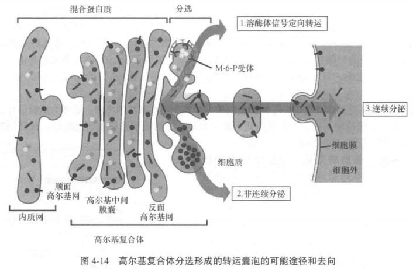
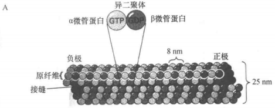
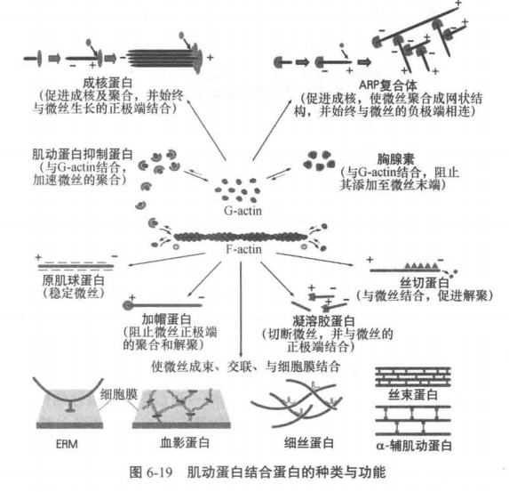
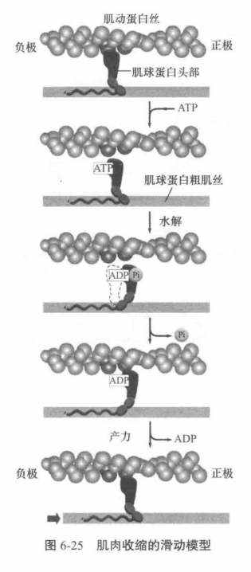
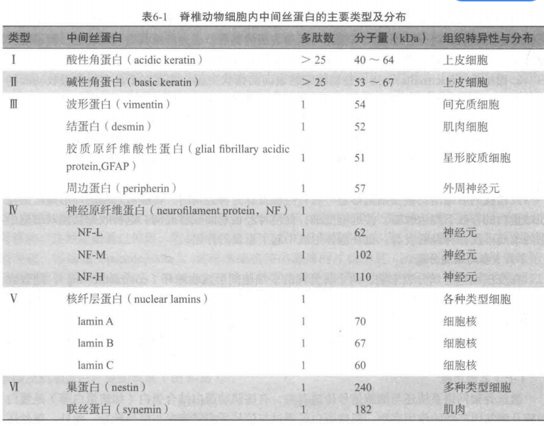

# 细胞生物学

## 第一章 细胞概论

### 细胞的基本知识

#### 化学组成及其结构

组成细胞的成分分为两大类：

1. 水（70%）
2. 非水化合物，即有机物与无机物

无机元素：H、O、N、P、S、Ca、K、Feel、Name、Class、Mg

有机物可按分子量分类：

- 小分子物质（100~1000）：**糖、脂肪酸、氨基酸、核苷**
- 生物大分子：生物小分子各自聚合可分别生成**多糖及糖原、脂肪及膜脂质、氨基酸、蛋白质和核酸**

参与细胞内结构组成的生物大分子主要有三种状态：

1. 膜状：细胞质膜、内膜和核膜
2. 线状/纤维状：一些线状结构由蛋白质组成，如微管、微丝和中间丝；另一些由核算组成，如信使 RNA(mRNA)，核仁中的核糖体 RNA(rRNA)以及染色体
3. 颗粒状：线粒体内膜和叶绿体类囊体膜上的基粒（蛋白质构成），以及核糖体（蛋白质与 RNA 组成，蛋白质合成的场所）

#### 细胞器

细胞质 = 胞质 + 细胞器

凡是具有一定形态特点、被单层或双层膜包绕、执行某些特定功能的结构，即称为细胞器(organelles)

1. 线粒体：细胞能量合成与供应
2. 高尔基体：单层膜蛋白质合成、糖与多糖合成、催化合成糖蛋白
3. 内质网：单层膜，蛋白质与脂质合成、分拣与运输
4. 溶酶体：单层膜，摄入物质的笑话分解，以及细胞内某些成分的降解

#### 细胞形状与大小

细胞形状：

- 单细胞
  - 细菌：杆菌、球菌、弧菌
  - 草履虫：鞋底状
  - 眼虫：梭形
- 多细胞生物，细胞形状还与功能有关
  - 肌肉细胞：长梭形，利于伸缩
  - 红细胞：扁盘装，利于$O_2$和$CO_2$气体交换
  - 神经细胞：很长的细胞突起，利于传到神经冲动

细胞大小，细胞体积守恒定律，细胞体积主要与下面两个因素有关：

1. 核质比：$NP=V_n/(V_c-V_n)$，即细胞核与细胞质的体积之比，其中 $V_n$和 $V_c$ 分别表示细胞核体积与细胞体积
2. 比面值（相对表面积），即单位体积占有的表面积：$I=S/V$，表面积除以体积

#### 细胞的基本共性

1. 细胞拥有一套独特的遗传密码及使用方式（基因）
2. 细胞能精确地自我复制（分裂）
3. 细胞需要能量才能生存
4. 细胞是一个加工厂（细胞代谢）
5. 细胞是一个“栩栩如生”的世界（细胞活动）
6. 细胞具有应激反应（受体/配体，信息传导）
7. 细胞能自我调节（突变）

### 原核细胞

原核细胞是指一类**无明显核结构的细胞**

原核细胞的三个基本特点：

1. 细胞内没有细胞核及核膜
2. 细胞内没有特定分化的复杂结构及内膜系统
3. 遗传信息量相对较小

下面将以细菌作为原核生物的代表进行介绍

细菌按照形状可以分为三类：

1. 球菌
2. 杆菌
3. 螺旋菌

细菌没有典型的细胞核，只有类似核的聚集了环状 DNA 分子的区域，称为拟核或类核，其周围是胞质

细菌除了核糖体外没有细胞器

细菌细胞膜是典型的生物膜结构但具有多功能性

细菌增殖方式为二分裂

#### 细菌的表面结构

1. 细胞膜：磷脂双分子层，半透膜，含丰富酶系，具有多功能性（细胞膜的多功能性是细菌区别于其他原核生物细胞膜的显著特征）
2. 细胞壁：成分为肽聚糖，多层网状大分子结构
3. 荚膜：细菌特殊结构，是细胞壁表面一层粘液物质，有保护和营养作用
4. 鞭毛和菌毛：鞭毛是运动器官，蛋白质结构；细菌间遗传物质传递由菌毛实现

#### 细菌的拟核和遗传物质

原核细胞没有细胞核和核膜

细菌遗传物质呈环状，所形成的一条染色体位于一个区域，称为拟核

除了拟核与染色体 DNA，细菌还存在染色体外 DNA，可自主复制，称为**质粒。**质粒是裸露的环状 DNA 分子，细菌可以在没有质粒的情况下生存

#### 细菌核糖体

细菌中含有核糖体，大部分游离于细胞质，少部分附着在细胞膜内侧。

### 真核细胞

#### 基本体系结构

**拥有细胞核**是真核细胞区别于原核细胞的最明显特征

真核细胞拥有：

1. 分化良好的细胞器与内膜系统
2. 特异蛋白质组装的细胞骨架
3. 以线粒体为代表的有氧代谢体系

真核生物区别于原核生物的特点：

1. 有完整的**细胞核，有助于执行复杂的遗传信息传递与表达功能**
2. 有复杂的**内膜系统**。除细胞膜外有一套用于包裹不同细胞器的膜系统，称为**内膜系统**
3. 拥有完善的**细胞骨架体系**。用于支撑细胞结构、帮助细胞附着、细胞转运、细胞通讯等

##### 生物膜系统

细胞内膜与细胞质膜统称为生物膜

细胞质膜，也称为细胞膜。主要功能是进行选择性物质交换，并由能量转换、分子识别、黏附运动及信号转导等功能。包绕细胞器的膜称为细胞器膜

细胞膜功能：

1. 信息传递：表面特定分子可作为标记被其他细胞识别
2. 控制物质进出：跨膜运输、胞吞胞吐/囊泡运输

##### 遗传信息传递与表达

染色体由蛋白质（组蛋白与少量酸性蛋白）与 DNA 组成，DNA 复制与 RNA 转录都在染色质上进行

遗传信息传递遵循**中心法则**：DNA-RNA-蛋白质。不同与原核细胞的是，转录在核内进行，翻译在核外

核糖体 = rRNA + 蛋白质，分为小亚基和大亚基

真核细胞的转录与翻译更复杂，除了因为**基因序列本身的改变**，还因为存在**表观遗传**，如组蛋白共价修饰、DNA 甲基化、染色质重塑、非编码 RNA 等。

##### 细胞骨架系统

**细胞骨架**可分为**细胞质骨架**与**核骨架**

细胞骨架是主要由微丝、微管和中间丝构成的网络

- 微丝：主要是肌动蛋白，与胞质运动、信号传递有关。
- 微管：由微管蛋白和微管结合蛋白组成，对细胞起支撑作用，为细胞内分子运输提供轨道
- 中间丝：组成复杂，类型众多，其蛋白质表达与细胞分化关系密切

#### 真核细胞与原核细胞本质之差

1. 真核细胞具有核和核膜：遗传信息的复制加工、转录在同一/不同区域进行
2. 真核细胞具有丰富的细胞内膜系统：原核细胞只靠内陷折叠及与各自色素或酶结合才能完成功能
3. 真核细胞具有形态各异的骨架：细胞骨架能维持细胞形态、提供轨道、平衡内外物质运输、调节细胞分裂
4. 丰富的遗传信息：真核细胞基因组容量与原核细胞差别不大，但能编码的基因数更多，得益于复杂的信息加工系统，包括一整套的基因表达过程（转录，转录后修饰，翻译，翻译后修饰等）与基因调节（转录前调节与转录后调节）。分裂方式也有有丝分裂、无丝分裂、减数分裂三种，而原核细胞只能二分裂

## 第二章 细胞生物学研究方法与技术

### 显微镜技术

显微镜技术分为三类：

- 光学显微镜：细胞显微结构
- 电子显微镜：分辨率提高，细胞亚显微结构
- 扫描隧道显微镜：分辨率提高到分子水平，研究细胞超微结构

#### 光学显微镜

光学显微镜分为下面几类：

1. 普通光学显微镜：生物样本固定、脱水、包埋、切片、染色
2. 相差显微镜：利用光的干涉衍射，适合观察单细胞或薄细胞层、细胞核、线粒体、液泡，样本无需染色
3. 荧光显微镜：有滤色片允许特定波长的荧光通过
4. 激光扫描共聚显微镜

#### 电子显微镜

简称电镜，种类如下：

1. 透射电子显微镜：主要观察细胞内部结构，观察组织、亚显微结构、蛋白质、核酸及病毒的形态
2. 扫描电子显微镜：主要观察细胞表面结构

### 细胞化学技术

细胞化学技术指保持细胞结构完整的条件下，通过细胞化学反应研究细胞成分及其动态变化

1. 酶化学技术：用电镜观察酶的分布，捕捉剂显色酶与底物的反应产物从而进行跟踪
2. 免疫细胞化学技术：将待检测的分子作为抗原，用可跟踪的抗体与之结合从而检测水平
3. 原位杂交技术：把标记过的核酸单链作为探针，探针可在细胞中和有互补结构的核酸单链结合，即可识别靶序列

### 细胞结构成分的离心分离技术

#### 离心分离技术原理与分类

离心分离原理：重力场作用下悬浮液的颗粒会沉降。沉降速度取决于颗粒的质量、密度、大小、形状和溶液粘度。沉降速度的 Stokes 公式：

$$
V=\frac{2r^2(\rho_1-\rho_2)}{9\eta}g
$$

其中：

- V 为沉降速度
- r 为颗粒直径
- $\rho_1$为颗粒密度
- $\rho_2$为介质密度
- $\eta$ 为介质粘度

$\rho_1 \gt \rho_2$ 时，V 为正，向管底沉降；反之溶液介质密度大则会上浮

实际一般溶液中各种物质处在同一重力场下，因此 g 可忽略。所以一般用沉降系数 S 表示沉降参数：

$$
S=V=\frac{2r^2(\rho_1-\rho_2)}{9\eta}
$$

离心技术有下面的分类：

1. 差速离心法：通过递增的速度离心，将不同大小的颗粒分离。但难以获得纯化的细胞器
2. 移动区带离心法：用于大小差别较小的颗粒。将所有颗粒放在介质表面，超速离心，由于不同大小的颗粒沉降速度不同则会形成不同的区带
3. 等密度离心法：原理是当颗粒密度与介质密度相同时将不会移动。设置一系列密度梯度的介质，开始离心，不同颗粒到达与其密度相等的介质中时将停止移动

#### 离心技术实验方法

离心方法选择：

- 差速离心：颗粒大小或沉降系数差别较大
- 移动区带离心：颗粒大小差别较小
- 等密度离心：颗粒大小差别不大但密度有差别

介质材料选择：

- 亲水有机分子（蔗糖、甘油）：低密度细胞器（高尔基体、内质网、溶酶体、线粒体）
- 重金属溶液：高密度分子和大分子（DNA、RNA、核糖体）

细胞器分离步骤：

1. 破碎细胞：细胞匀浆，机械方法破碎
2. 初步分离：差速离心法初步分离
3. 细胞器纯化：等密度法或换高密度蔗糖溶液差速离心细胞核

### 细胞培养技术

#### 细胞培养基本知识

培养细胞类型：

1. 贴壁细胞：有接触抑制，即互相接触后会抑制细胞运动
2. 悬浮细胞：在培养液中生长，生存空间打，便于大量繁殖

培养条件和细胞增殖过程：

- 传代：细胞到达一定密度后，要分离出一部分细胞到其他容器并更换培养液
- 细胞系：经遗传修饰后可在体外培养环境中无限生长的细胞

#### 细胞培养基本技术

原代培养：直接从生物体获取、分离细胞后首次培养

- 对细胞悬液（血液等）进行低速离心

* 对组织块，切成小块，胰蛋白酶或胶原蛋白酶分散，将获得的细胞悬液进行培养

传代方法：

- 贴壁细胞：胰蛋白酶，形成细胞悬液后加入培养基
- 悬浮细胞：直接添加新鲜培养基或离心收集后更换新鲜培养液

细胞冻存和复苏：

- 冻存前，向培养基中加入甘油等保护剂
- 液氮冻存
- “慢冻快融”，37 度水浴复苏

### 分析细胞学技术

#### 流式细胞分析

工作原理：

1. 荧光染色后的单细胞溶液放入流动室
2. 少部分液滴中包含单个细胞
3. 荧光标记不同的液滴可能带上不同电荷
4. 从而在电场中发生不同的偏转

#### 显微分光光度术

原理：细胞物质的特异光谱

1. 显微吸收光度测量：将目标基因**染色**，然后测量细胞组分-染料的**总吸光度**，计算出该组分的含量
2. 显微荧光光度测量：测量荧光反应物的量

### 细胞工程技术

#### 细胞融合

细胞融合方法：

1. 病毒类融合剂：仙台病毒
2. 化学融合剂：聚乙二醇 PEG
3. 电激融合法

**单克隆抗体技术：**

1. 向小鼠注射抗原，引发免疫反应，生成特异性免疫 B 淋巴细胞
2. B 细胞与骨髓瘤细胞经 PEG 融合
3. 对杂交瘤细胞进行筛选和克隆化，制备单克隆抗体

#### 细胞核移植

1. 选取受体细胞（成熟卵母细胞），紫外线照射或秋水仙素处理**去除细胞核**
2. 将供体细胞细胞核显微注射入受体细胞
3. 微电流脉冲促使核质融合
4. 体外培养重组卵一段时间，再移植入受体子宫

#### 基因转移

基因转移技术：将外源目的基因或 DNA 片段引入受体生物或细胞并使其表达

物理学方法：

1. 裸露 DNA 直接注射
2. 电穿孔
3. 基因枪
4. 显微注射

化学方法：增加细胞膜通透性、增加胞吞、增加 DNA 与细胞吸附。包括磷酸钙共沉淀、DEAE-葡聚糖、脂质体法等

生物学方法：病毒介导基因转移

- DNA 病毒载体：腺病毒载体
- RNA 病毒载体：逆转录病毒载体

病毒载体都是缺陷型病毒，感染细胞后仅将目的基因转入细胞但无法包装病毒颗粒

#### 转基因和基因敲除动物

转基因动物：通过基因工程在原 DNA 上添加一段 DNA，导入生殖细胞，培育成转基因动物并可将形状遗传

## 第三章 细胞膜与物质运输

### 细胞膜的化学组成与生物学特性

#### 化学组成

1. 磷脂、胆固醇核糖脂是膜脂质的主要类型
   1. 磷脂：两亲性分子，头部亲水、尾部疏水
   2. 胆固醇：使细胞膜更稳定，增加磷脂双分子层厚度
   3. 糖脂：脂质+寡糖，糖分子以糖脂或糖蛋白存在
2. 膜蛋白通过三种方式与膜结合
   1. 跨膜蛋白：两亲性分子，在磷脂双分子层中呈 α 螺旋结构（使肽键之间氢键合力达到最大）。功能有支撑、转运、能量转换等等
   2. 外周蛋白：分布于细胞膜内外表面，主要是内侧面，不插入脂质双分子层，以离子键、氢键等方式与膜结合，大多为亲水性。作膜骨架、维持膜完整性
   3. 脂锚定蛋白：也称脂连接蛋白，在膜内外侧以共价键与脂质双分子结合，相比跨膜蛋白运动型增大，更容易进行侧向移动
3. 细胞膜表面糖分子与膜蛋白或膜脂结合
   1. 真和细胞膜外表面的糖类成为细胞外被，用于保护细胞、抵御物理化学损伤等

#### 生物学特性

##### 细胞膜流动性使膜功能活动的保障

1. 脂质流动性：细胞运动、生长、分裂、物质转运、分泌核吞噬等作用都取决于细胞膜的流动性
2. 膜蛋白的流动性：
   1. 膜蛋白较大运动较慢。
   2. 可侧向位移（人-鼠细胞融合实验、荧光光漂白恢复法）
   3. 旋转扩散
   4. 并非所有膜蛋白都能自由运动

3. 影响膜流动性的因素：相变温度 $T_m$（由晶态变为液晶态），而其主要受三种因素影响
   1. 脂肪酸链长短：脂肪酸链越长，$T_m$越高，流动性越差
   2. 脂肪酸饱和程度：不饱和脂肪酸越多，$T_m$越低 ，流动性越高（动物脂肪多为饱和脂肪酸为固体）
   3. 胆固醇：对膜流动性有双向调节作用
      1. 一方面相变温度以上，因为其不易变形，可以限制膜流动性
      2. 另一方面，相变温度以下，可以干扰脂膜有序性，促进流动性

同时，膜蛋白越多，膜流动性越低

##### 膜不对称性决定膜的功能域

1. 膜脂不对称性：双层脂质分子分为外层核内层，内外两层的脂质分子的**种类和数量**差异很大
2. 膜蛋白不对称性：各种膜蛋白在细胞膜上都有特定位置，分布不对称
3. 膜糖不对称性：糖脂与糖蛋白的低聚糖连只在质膜外层 ，细胞器中寡糖链只在细胞器膜内侧

### 小分子物质的跨膜运输

细胞膜对进出细胞的物质的调节作用：

1. 通过膜选择通透性来维持细胞内外离子浓度差、渗透压平衡
2. 维持膜内负外正电势差及细胞兴奋性
3. 维持内环境与功能稳态

#### 被动运输

定义：物质顺梯度，从高浓度一侧向低浓度一侧进行跨膜转运过程

驱动力：浓度梯度

根据是否需要借助转运蛋白分为简单扩散和易化扩散：

##### 简单扩散

- 不需借助膜蛋白
- 速率完全取决于物质的分子量、浓度梯度和脂溶性

##### 易化扩散

离子、单糖、氨基酸、核苷酸等，需要借助膜蛋白才能跨膜

借助的膜蛋白可以分为**载体蛋白**和**通道蛋白**

载体蛋白：

- 对所转运物质有高度专一性
- 通过构象变化实现物质转运
- 驱动力是膜两侧物质浓度梯度差

通道蛋白（离子通道）：

- 通道双向，转运方向由浓度梯度决定，转运过程中不与离子结合
- 离子通道对离子有高度选择性，各种通道只能由特定离子通过
- 转运速率高
- 通道并非持续开放，有开放和关闭两种构象，通过门控机制调节

#### 主动运输

定义：物质由低浓度一侧向高浓度一侧逆梯度转运，需要消耗能量

##### ATP 供能的离子泵

钠钾泵：负责 Na+和 K+转运的蛋白质——Na+-K+ ATP 酶，是一种 ATP 水解酶，水解 ATP 释放能量供离子逆梯度转运。每次活动有 3 个 Na+出胞，2 个 K+入胞。从下图中可以看到，主要依靠**磷酸化和去磷酸化**实现构象改变

钙泵：Ca2+依赖性 ATP 酶，膜上 Ca2+泵将 Ca2+泵到胞外，内肌网膜上的 Ca2+泵将 Ca2+从细胞质运回肌质网，维持胞质中 Ca2+处在低水平

##### 协同运输

p.s. 同生理学中的继发性主动运输

定义：当离子顺浓度梯度运输时，顺便将这些分子逆梯度运输。这种依赖另一种物质被动运输而进行的主动运输称为**协同运输**

e.g. Na+-葡萄糖协同运输

### 大分子与颗粒物质的跨膜运输

大分子物质通过膜泡运输，包括胞吞和胞吐

#### 胞吞

根据胞吞物质的大小、状态和特异程度的不同，可以将胞吞作用分为三类：

1. 吞噬作用
2. 胞饮作用
3. 受体介导的胞吞作用

##### 吞噬作用

定义：细胞内吞较大的固体颗粒或多分子化合物进入细胞的过程

过程：

1. 被吞噬物质吸附，吸附物质没有专一性
2. 细胞膜内陷形成**伪足**
3. 包裹物质摄入细胞，形成的膜泡称为**吞噬体**或**吞噬泡**

##### 胞饮作用

定义：细胞摄入细胞外液及可溶性物质的过程。

当可溶性物质到达一定浓度时引发胞饮，质膜上的特殊区域形成小泡，称为胞饮体或胞饮泡

特点：胞饮作用是**持续发生的**，将持续一段时间

##### 受体介导的胞吞作用

胞饮作用不具有选择性，而受体介导的胞吞作用可以选择性吞入细胞外液中含量很低的物质，避免摄入过多液体，吞噬效率可提高 1000 多倍

1. 有被小窝和有被小泡：**有被小窝**是指质膜上受体集中的凹陷区域，进一步内陷与质膜分离后形成**有被小泡**进入细胞
2. 无被小泡形成：有被小泡形成后，**动力蛋白**将其从质膜上切割下，**脱去网格蛋白包被**形成**无被小泡。**无被小泡与**内体**融合，分离出**受体**和**配体**。受体送回细胞膜再利用，配体被溶酶体降解

3. 受体介导的 LDL 胞吞：主要用于运入**胆固醇**。
   1. 需要胆固醇时，首先合成 LDL 受体并嵌入细胞膜有被区
   2. 细胞外液中的 LDL 与 LDL 受体结合
   3. 有被小窝内陷，动力蛋白切割，脱去网格蛋白形成无被小泡
   4. 无被小泡与包内体结合，分离 LDL 受体与 LDL 颗粒
   5. LDL 受体返回细胞膜循环利用
   6. LDL 颗粒与溶酶体结合，被降解成胆固醇颗粒

#### 胞吐作用

定义：细胞将自身合成的物质或代谢废物释放到细胞外的过程

根据作用方式不同可分为：

1. 连续性分泌：又称固有性胞吐，是**持续不断**的过程，不受细胞外信号的调节，主要用于分泌**分泌性蛋白质**
2. 受调分泌：分泌性蛋白合成后**先存储**在分泌囊泡中，当细胞**接受外界信号刺激**，细胞内 Ca2+升高，才启动胞吐

## 第四章 细胞内膜系统

### 内质网

#### 内质网的化学组成

主要成分也是脂质和蛋白质，蛋白质种类多样：

1. 解毒功能
2. 脂质物质代谢
3. 糖类物质代谢
4. 蛋白质加工转运相关酶

内质网网腔中普遍存在网质蛋白质，主要功能是参与蛋白质的正确折叠和转运，主要有以下几种：

1. 免疫球蛋白重链结合蛋白：组织蛋白质聚集或变性，协助蛋白质折叠。帮助多肽进行折叠、装配和转运，自身不参与最终产物形成的分子称为**分子伴侣**
2. 钙网蛋白：调节钙平衡、蛋白质折叠加工……

…………略

#### 内质网的形态结构和类型

根据**是否附着核糖体**，可将内质网分为**粗面内质网**和**滑面内质网**

##### 粗面内质网

膜表面附着有核糖体颗粒，主要与外输性蛋白质合成有关

核糖体：蛋白质合成场所，合成蛋白质时大小亚基结合成核糖体，合成结束后大小亚基解离

真核细胞核糖体有两种类型：

1. 附着核糖体：附着在内质网膜和外层核膜表面
2. 游离核糖体：游离在细胞质基质中

##### 滑面内质网

可以和粗面内质网、核膜及高尔基复合体相连

滑面内质网具有多功能性，在不同细胞不同状态下形态分布和发达程度差异较大

#### 粗面内质网的功能

粗面内质网的主要功能：进行蛋白质合成、修饰加工、分选及转运

##### 参与蛋白质的合成

细胞中蛋白质合成可分为两种：

1. 内源性蛋白：始终在游离核糖体上合成
2. 外运性蛋白：游离核糖体上开始合成后，核糖体转移到粗面内质网上继续合成。因此粗面内质网的功能之一就是为外运性蛋白质合成提供核糖体附着的支架

**信号假说**解释了核糖体是如何移动并附着在粗面内质网上的：**分泌蛋白多肽链 N 端的信号肽**可引导蛋白质多肽链穿越内质网膜

1. 信号肽翻译 SRP
2. SRP 与信号肽、核糖体结合，并占据 A 位停止多肽合成
3. SRP-核糖体复合体与内质网膜上的信号识别颗粒受体结合，使核糖体停在内质网上
4. SRP 解离循环利用，多肽链可以继续合成
5. 信号肽诱导中央管通道打开，使新生肽链穿越内质网膜进入内质网腔
6. 大小亚基解离，通道关闭

同时信号肽可以指导内质网上新合成肽链的插入转移

##### 帮助新和成蛋白质的正确折叠与装配

内质网可帮助新合成蛋白质：

1. 按照一定方式折叠成高级的三维空间结构
2. 对所合成蛋白质进行质量监控，折叠错误则降解

##### 蛋白质修饰

内质网可对蛋白质进行加工修饰，主要包括：

1. 糖基化修饰：蛋白质与糖类在糖基转移酶的作用下共价结合形成糖蛋白的过程，包括：
   1. 粗面内质网上进行的 N-连接糖基化
   2. 高尔基复合体上进行的 O-连接糖基化
2. 酰基化修饰
   1. 酰基与糖脂结合将蛋白质锚定在内质网上
   2. 癌细胞产物的酰基化修饰
3. 泛素化修饰：底物蛋白被泛素蛋白共价修饰，泛素用于介导细胞降解，因此被泛素化修饰的蛋白相当于被打上“降解”标签
4. 蛋白质的囊泡运输：外输性蛋白被内质网膜包裹形成膜性小泡，一些进入高尔基复合体进一步加工浓缩修饰，另一些直接进入大浓缩泡

#### 滑面内质网的功能

##### 参与脂质、类固醇激素的合成与转运

滑面内质网是脂质物质合成的主要场所

脂质合成在**内质网膜胞质侧进行**，合成后的脂质镶嵌在**胞质侧膜**上，在**翻转酶**作用下将一部分脂质分子转移到内质网腔面

内质网合成的脂质可以输送到其他膜结构的膜上，主要有两种方式：

1. 出芽形成转运囊泡，输送到高尔基复合体、溶酶体和细胞膜
2. 与 PEP 结合进入胞质，在自由扩散转运到线粒体、过氧化物酶体等缺少磷脂的细胞器膜上（相当于用 PEP 作为载体）

同时滑面内质网还参与合成**胆固醇和类固醇类激素**，合成后以**脂蛋白**等形式运输到其他细胞器加工和分泌

##### 参与脂质代谢

脂质代谢旺盛的细胞内有丰富的滑面内质网，例如小肠上皮细胞

##### 参与糖原代谢

包括糖原的合成（尚不确定）与分解

饥饿时，可以被细胞质基质中的糖原磷酸化酶降解成葡糖-6-磷酸，然后由滑面内质网膜上的酶去磷酸化形成葡萄糖

##### 参与肝的解毒作用

肝细胞的滑面内质网中含有丰富的**氧化酶系**和**电子传递酶系**：

- 前者可**催化氧还反应**使毒性钝化或破坏
- 后者通过羟化作用电子传递**增强产物极性**，使**其易溶于尿液排出**

##### 参与 Ca2+存储与 Ca2+浓度调节

滑面内质网有存储 Ca2+的功能

骨骼肌细胞和心肌细胞的滑面内质网异常发达，特化为**肌质网**

肌质网膜有大量 Ca2+泵，不断将胞质中的 Ca2+转运到内质网腔存储，受到刺激使释放 Ca2+到胞质引起肌细胞收缩

### 高尔基复合体

高尔基体由几部分膜性结构组成，因此应称为高尔基复合体

#### 高尔基复合体的化学组成

**膜脂质**：脂质含量介于内质网和细胞膜，胆固醇含量明显高于内质网，说明流动性较低

**蛋白质**：**糖基转移酶**是高尔基复合体的标志酶

#### 高尔基复合体的形态结构

高尔基复合体呈弓形

- 凸面朝向细胞核或内质网，称为顺面、未成熟面，较薄
- 凹面朝向细胞膜，称为反面、成熟面、分泌面，较厚

1. 顺面高尔基网 CGN：
   1. 对内质网合成的蛋白质和脂质进行分选，大部分转运到中间高尔基网，小部分送回内质网
   2. 进行蛋白质修饰
2. 高尔基中间膜囊：
   1. 糖基化修饰
   2. 糖脂形成
   3. 高尔基复合体有关多糖形成
3. 反面高尔基网：
   1. 对蛋白质进行分选并分泌
   2. 蛋白质修饰

#### 高尔基复合体的极性

极性：**高尔基复合体各部分结构**在化学组成、形态和功能上的**明显差异**

各部分在形态上有所差异；功能上，含有不同的酶、形成独立的生化区室，因而可以执行不同功能

高尔基复合体执行功能时有方向性、顺序性：

1. 顺面：筛选鉴定可进入中间膜囊的蛋白质
2. 中间膜囊：对蛋白质、脂质进行加工和修饰
3. 反面：分选蛋白质并形成分泌泡分泌

#### 高尔基复合体的功能

1. 是细胞内蛋白质运输和分泌的中转站
2. 是蛋白质加工重要场所
   1. 糖基化，功能有：
      1. 保护蛋白质免遭水解酶降解
      2. 作为运输信号引导靶向运输
      3. 形成糖萼
   2. 磷酸化
   3. 蛋白质（或酶）的水解：某些蛋白质或酶需要特异性水解（切割）才能具有生物活性，如下图：

3. 是细胞内蛋白质分选与囊泡运输的枢纽，囊泡主要去向有三条：
   1. 溶酶体酶：以有被囊泡方式转运到溶酶体
   2. 分泌蛋白：与细胞膜融合分泌到细胞外（连续分泌）
   3. 分泌蛋白：以有被囊泡方式暂存胞质，择机分泌（非连续分泌）

### 溶酶体

溶酶体：膜性细胞器，含多种水解酶，能分解各种物质

#### 溶酶体的形态结构和特性

不同细胞溶酶体形态各异，一个细胞中含有几百个

溶酶体有以下共同特性：

1. 含多种酸性水解酶
2. 腔内位酸性环境
   1. 膜上有质子泵，可水解 ATP 将 H+泵入溶酶体
   2. 膜上有 Cl-通道蛋白，可运入 Cl-
   3. 两者相当于向内运输 HCl
3. 膜高度稳定：因为含有多种水解酶，因此膜必须高度稳定，原因可能有
   1. 溶酶体膜糖蛋白 LGP 寡糖链伸向内侧防止分解
   2. 溶酶体膜含较多胆固醇
4. 膜转运蛋白丰富：将分解产物运出，同时防止酶外漏引发自溶

#### 溶酶体的类型

根据底物可分为：

1. 自噬溶酶体
2. 异噬溶酶体
3. 残余体

#### 溶酶体的发生

溶酶体的形成与内质网、高尔基复合体以及胞吞都有关，主要包括以下过程：

1. 溶酶体酶蛋白前体在粗面内质网合成、初加工和转运（膜泡）到顺面高尔基网
2. 溶酶体酶蛋白前体**在高尔基复合体标记、分选和转运**
3. 细胞质中的囊泡与内体结合形成内溶性溶酶体
4. 在细胞质中成熟

综上

- 溶酶体膜来自高尔基复合体和晚期内体
- 溶酶体酶合成于粗面内质网
- 分选在高尔基复合体

#### 溶酶体的功能

1. 参与细胞防御
2. 参与细胞结构成分的更新：清除损伤或衰老的细胞器
3. 提供细胞营养：分解大分子物质提供营养
4. 参与机体组织器官形态形成：胚胎发育期间自溶除去不必要的细胞或组织
5. 参与受精过程：精子顶体水解卵细胞外被
6. 参与激素合成及激素水平调节：激素合成、加工和成熟等活动
7. 参与某些腺体组织细胞分泌过程的调节：细胞调节自身分泌量

### 过氧化物酶体

过氧化物酶体：单层膜细胞器，原型或卵圆形，含有类核体或类晶体，与溶酶体一样属于**异质性细胞器**

过氧化物酶体的酶：

1. 氧化酶：氧化底物时把氧还原成过氧化氢

2. 过氧化氢酶类：将过氧化氢还原成水

3. 过氧化物酶类：作用同过氧化氢酶

#### 过氧化物酶体的功能

1. 清除细胞代谢过程中产生的过氧化氢等毒性物质，起解毒作用
   1. 氧化酶氧化底物沈城过氧化氢
   2. 过氧化氢酶利用过氧化氢氧化其他有毒产物使其失去毒性

2. 调节细胞内的氧浓度，避免高浓度氧的损害

   1. 过氧化物酶体消耗O2进行氧化反应
   2. 线粒体有氧呼吸合成ATP
   3. 但线粒体最佳氧浓度是2%，然后不会随杨浓度增加而提高氧化能力；但过氧化物酶体氧化能力随氧浓度增高而上升
3. 进行脂肪酸氧化，参与细胞代谢

#### 过氧化物酶体的发生

1. 分类增殖：与线粒体一样，原有过氧化物酶体二分裂得到新的
2. 从头合成
   1. 内质网出芽释放未成熟的囊泡状结构——过氧化物酶体前体
   2. 细胞质中装配成成熟的过氧化物酶体

### 细胞内蛋白质的分选与运输

分选：生物体根据蛋白质信号序列合成蛋白质，分类运输到指定部位，装配成有一定结构和功能的复合体

#### 分选信号决定蛋白质去向

游离核糖体合成的蛋白：

- 核定位信号：使蛋白运输到细胞核
- 转运肽：使蛋白运输到线粒体
- 过氧化物酶体引导信号：运输到过氧化物酶体

同理不同蛋白有各种不同分选信号

#### 囊泡运输

胞内蛋白质有以下运输方式：

1. 囊泡运输（最主要）
2. 跨膜运输
3. 门孔运输

##### 囊泡

囊泡使细胞内物质定向运输的主要载体

固有膜性结构：内质网、高尔基复合体、溶酶体等

但囊泡是动态膜性结构，主要有两种囊泡：

1. 网格蛋白有被囊泡：产生于细胞膜和高尔基复合体
2. COP 有被蛋白
   1. COP Ⅱ又被囊泡主要负责蛋白质正向运输：负责**介导物质从内质网到高尔基复合体的正向运输**
   2. COP Ⅰ有被囊泡主要负责**内质网逃逸蛋白的回收**

同时，囊泡转运过程是一个高度有序、严格调控的定向物质运输过程：

1. 囊泡转运过程受严格选择和精密控制
2. 囊泡必须**特异性识别**并锚定与靶膜并写在货物

## 第五章 线粒体

### 线粒体的形态结构

光镜形态：多种多样，因细胞种类和所处生理状态不同而异

数目：与细胞类型与能量需求有关

**超微结构**：线粒体是由两层单位膜封闭包裹而成的膜囊状结构，由以下部分组成：

- 外膜

  - 平整光滑
  - 含有多种运输蛋白，即**孔蛋白**，可使水溶性物质通过
  - 富含胆固醇和磷脂，蛋白质比内膜少
  - 标志酶是**单胺氧化酶**
- 内膜

  - 富含蛋白质、磷脂，但缺少胆固醇
  - 没有孔蛋白，**通透性低**
  - 标志酶是**细胞色素c氧化酶**
  - 内膜向内折叠形成嵴，增加内膜表面积
    - 嵴的排列分为板层状和小管状
    - 嵴的数量与能量需求相关
  - 内膜/嵴膜上附着大量基粒，成分是ATP合酶
    - ATP合酶是多组分复合体
    - **膜结合**状态下具有**ATP合酶活性**，可催化ADP和Pi合成ATP
    - **游离**状态下具有**ATP水解酶活性**
    - 基粒**头部**含可溶性ATP酶，膜结合状态具有ATP合酶活性
    - 基粒**柄部**是调控之子通道的蛋白质
    - 基粒**基片**能传递质子，有质子通道的功能

  
- 膜间隙：内外膜之间的间隙，含有可溶性酶、底物和辅助因子
- 内室与基质：内膜以内部分，包含线粒体基质、酶、线粒体DNA、mRNA、tRNA等，以及基质颗粒

### 线粒体的化学组成和酶的分布

#### 化学组成

##### 蛋白质

内膜蛋白质含量最多，主要是ATP合酶、电子传递应答蛋白、载体蛋白

ADP/ATP逆向转运蛋白：

- 将线粒体合成的ATP运输至膜间隙，随后运出至细胞质供能
- 将ADP运入线粒体基质腔

可溶性蛋白：酶、外周蛋白

不溶性蛋白：向前蛋白、结构蛋白、酶蛋白

##### 脂质

外膜富含胆固醇和磷脂

内膜富含心磷脂，因此疏水性强、通透性低

#### 酶的分布

外膜：

- **单胺氧化酶（外膜的标志酶）**、NADH细胞色素c还原酶
- 与脂质代谢有关的酶

内膜：

- 呼吸链相关酶系
- 能量转化系统

### 线粒体的功能（重点）

线粒体主要功能是对糖、脂肪、蛋白质等各种能源物质的氧化和能量转换

细胞氧化：通过酶催化将各种供能物质氧化而释放能量的过程

细胞呼吸：细胞氧化过程中要消耗O2生成CO2和H2O

物质氧化基本过程：

- 糖酵解（细胞质中进行，不需要氧）
- 乙酰辅酶A生成（线粒体中进行）
- 三羧酸循环（线粒体中进行）
- 电子传递偶联氧化磷酸化（线粒体中进行）

#### 糖酵解

糖类如葡萄糖，不能直接进入线粒体，要在细胞质基质中先磷酸化，在酶的催化下分解成丙酮酸

$$
1葡萄糖\ce{->[酶的催化]}2丙酮酸+2ATP+2H+
$$

形成的丙酮酸进入线粒体基质

#### 乙酰辅酶A生成

丙酮酸进入线粒体基质后进行氧化（脱氢）脱羧：

$$
丙酮酸\ce{->[丙酮酸脱氢酶系][脱去1个碳]}乙酰基+CoA\ce{->乙酰CoA}
$$

#### 三羧酸循环TAC

三羧酸循环过程：

$$
乙酰CoA+草酰乙酸\ce{->}柠檬酸
$$

$$
柠檬酸\ce{->[各种酶]}\alpha-酮戊二酸\ce{->}琥珀酸\ce{->}草酰乙酸
$$

每进行一次TAC循环，产生4对H+和2分子CO2

3对H+与NAD+结合，每个NAD+接受一个H+和两个电子，另一个H+留在基质中，生成还原态的NADH

1对H+与一个FAD结合，每个FAD接受2个H+和两个电子，形成$FADH_2$

#### 电子传递偶联磷酸氧化

##### 电子传递

上述反应中产生的H原子必须与O2反应，氧化生成水

但是H原子不能直接和O2结合，需要经过以下步骤：

1. H原子解离成H+和e
2. 电子经过内膜上的电子传递酶系传递给1/2O2形成O2-
3. O2-与基质中的2H+形成H2O

NADH和FADH2是电子传递的重要媒介

**电子载体**：与释放电子结合并将电子传递下去的物质

- 黄素蛋白
- 细胞色素
- 铁硫蛋白
- 泛醌/辅酶Q

**电子传递链/呼吸链：**电子载体与蛋白质组成复合物，有序镶嵌在内膜上，组成传递电子和质子的酶体系

- 复合体Ⅰ：NADH脱氢酶
- 复合体Ⅱ：琥珀酸脱氢酶
- 复合体Ⅲ：细胞色素c氧化还原酶
- 复合体Ⅳ：细胞色素c氧化酶

如上图：

1. 复合体Ⅰ从NADH中接受电子，再将其传递给泛醌UQ
2. 泛醌同时也能从复合体Ⅱ中获得电子
3. 泛醌将电子经复合体Ⅲ传递给细胞色素c(cyt c)
4. cyt c 将电子传递给复合体Ⅳ
5. 复合体Ⅳ利用电子和氢离子将氧气还原成水

##### 氧化磷酸化偶联机制

化学渗透偶联假说：

1. **呼吸链起质子泵的作用**
2. 电子在复合体间传递时，释放能量**使质子H+从基质传递至膜间隙**
3. 因为内膜对H+不通透，因此形成**外正内负的电化学质子梯度**
4. 当内膜外的H+通过ATP酶复合体的**质子通道**进入基质
5. 此时，ATP合酶**利用电化学梯度的能量**催化ADP和Pi合成ATP，将能量以高能磷酸键的形式存储于ATP中

化学渗透耦联假说的最大特点是强调膜结构的完整性，即H+不能自由出入

### 线粒体的半自主性

#### 线粒体DNA

线粒体mtDNA呈闭合的环状双链分子，不与组蛋白组合，分散在线粒体基质不同区域

mtDNA有自我复制能力，能进行**半保留复制**（子代双链中含有一条父代单链与一条新结合的链）

mtDNA分裂前与内膜结合难以看见，分裂时出现在基质中，分裂后由于内膜结合

mtDNA复制需要的**DNA聚合酶**由核DNA编码，在细胞质核糖体上合成

#### 线粒体蛋白质的合成

线粒体具有自身合成蛋白质的系统：mtDNA、tRNA、rRNA等

线粒体核糖体的蛋白质：

1. 由核DNA编码
2. 在细胞质核糖体上合成
3. 再转运到线粒体内装配成线粒体核糖体

线粒体具有自主性的原因：

- 线粒体的蛋白质合成与原核细胞相似，而与真核细胞（细胞质核糖体）不同
  - mRNA的转录和翻译基本在同一时间和区域进行
  - 起始tRNA为甲硫氨酰tRNA
  - 线粒体蛋白质合成系统对药物的敏感性与细菌一致，而与细胞质系统不一致。即抑菌药物可以抑制线粒体蛋白质合成，而对细胞质系统无影响
- mtDNA的遗传密码子与通用密码表不相同

因此可说线粒体有自己的DNA和蛋白质合成体系，即独立的遗传系统

但由于：

- mtDNA分子量小，能合成的蛋白质很少，所以绝大多数蛋白质还是来自于核DNA编码
- 同时线粒体的遗传系统受核遗传系统控制（线粒体核糖体由核DNA编码）

因此线粒体是**半自助细胞器**

### 线粒体的增殖

关于线粒体增殖的两种观点：

1. 线粒体是在细胞质中重新形成的
2. 是由原来的线粒体分裂或出芽产生

证明实验：

1. 放射性标记线粒体膜的磷脂
2. 将标记过的线粒体在无放射性的培养基培养
3. 当细胞数增加一倍时，所有线粒体的放射性物质也减小一半

由此证明线粒体是从原先的线粒体分裂而来

线粒体的增殖有以下三种分裂方式：

1. 间壁分裂：内膜向中心形成间壁
2. 收缩分裂：中央收缩、两端拉长
3. 出芽分裂：原线粒体长出小芽、小芽分离、长大呈新的线粒体

## 第六章 细胞骨架

细胞骨架包括：

- 微丝：主要在细胞膜内侧，维持细胞形态，动态不稳定结构
- 微管：主要在细胞核周围，放射状向胞质四周扩散，动态不稳定结构
- 中间丝：分布在整个细胞中

### 微管

微管：细胞质内中空管状结构

#### 微管组成与形态

**微管蛋白**是组成微管的结构蛋白，主要分为

- α微管蛋白
- β微管蛋白

**微管的基本组成单位**是α、β微管蛋白异二聚体

原纤维：α、β两种蛋白交替出现形成的单链

13根原纤维平行合并形成微管：

- 异二聚体始终交替结合，即前一个β与下一个α连接
- 微管蛋白沿微管呈螺旋状
- 微管合拢处有一根接缝
- 微管可以在末端继续聚合/解离二聚体以延长/缩短

微管具有极性：

- α微管蛋白端为负极，异二聚体添加速度慢
- β微管蛋白端为正极，异二聚体添加速度快

微管有三种存在形式：

- 单管
- 二联管
- 三联管

#### 微管的装配

微管组装特点：

1. GTP-β微管蛋白亲和力强，易结合
2. GTP-β微管蛋白结合后水解GTP为GDP，而GDP-β微管蛋白易解聚
3. 异二聚体浓度高于临界浓度时可装配微管
4. 微管组装主要在正极
5. 低温、Ca2+和药物（秋水仙碱）会破坏组装和去组装的平衡

微管自我组装过程：

1. 微管蛋白异二聚体先组装成短的寡聚体结构，即组装核心
2. 组装核心向两端和两侧扩展，形成片状结构
3. 片状增加到13根原纤维时，合拢微管，此过程称为成核期，过程缓慢，是限速步骤，又称为延迟期
4. 成核期后，高浓度异二聚体迅速添加到微管末端使其延长
5. 异二聚体浓度低于临界浓度后，微管快速去组装，迅速缩短

微管装配过程动态不稳定，会不断出现延长和缩短的交替现象，本质原因是：

- GTP-微管蛋白的浓度
- GTP水解成GDP的速度

两者的动态平衡

- GTP-微管蛋白浓度高时，组装速度大于GTP水解速度，形成“GTP-帽”，抑制解聚
- 微管蛋白浓度下降，GTP水解速率上升，GTP-帽消失，微管迅速缩短
- 微管蛋白浓度升高，再次开始延长

组织中心MTOC：细胞内微管组装的起始区域，**多为中心体**

MTOC近端为负极，远端为正极

中心体：由一对相互垂直的中心粒和中心粒周围基质组成，在S期半保留复制，分裂期移动到细胞两极形成纺锤体

部分药物可影响微管装配。例如秋水仙碱可以

- 与异二聚体结合，阻止微管聚合，促进微管解聚
- 抑制细胞纺锤体形成，使分裂停留在中期

紫杉醇

- 与异二聚体结合，抑制解聚，促进延长
- 同样能抑制有丝分裂

两者作用虽然相反，但都是破坏了微管的动态不稳定性，阻止纺锤丝形成

#### 微管的功能

1. 通过支架作用维持细胞的形态
2. 参与细胞内物质运输
   1. 为运输提供轨道，微管极性可指导方向
   2. 马达蛋白可与微管轨道结合并转运物质
      1. 驱动蛋白：将物质由微管负极运向正极（背向中心体）
      2. 动力蛋白：将物质从正极运向负极（朝向中心体）
3. 维持细胞器的定位和分布
4. 组成纤毛和鞭毛运动的元件
5. 参与纺锤体的形成与染色体的运动

### 微丝

微丝使三种细胞骨架成分中最纤细的，由肌动蛋白构成

#### 微丝的组成与形态

肌动蛋白：球形，ATP酶活性部位可结合ATP和Mg2+

游离的球形分子形式称为**球状肌动蛋白G-actin**

聚合成纤维细丝形式称为**纤维状肌动蛋白F-actin**

人体中有6中肌动蛋白亚型：

- 4中α-肌动蛋白：参与组成细胞收缩性结构
- β-肌动蛋白：存在于膜内侧，能装配成微丝
- γ-肌动蛋白：形成应力纤维

微丝形态结构：

1. 肌动蛋白头尾相连形成肌动蛋白纤维
2. 两条平行肌动蛋白显微右手螺旋相互缠绕形成微丝

微丝具有极性：

- 容易聚合肌动蛋白（微丝延长）一端为正极
- 不易聚合、容易解聚一端为负极

#### 微丝的装配

##### 微丝装配过程

微丝和微管一样也是动态结构，能不断组装和去组装

装配特点：

1. 结合ATP的G-actin于肌动蛋白纤维末端亲和力高，结合到负极后ATP水解成ADP
2. ADP-肌动蛋白亲和力弱，容易解聚
3. 正极生长速度快于负极
4. 正极临界浓度低于负极
5. 特异性药物会破坏微丝组装/去组装平衡

装配过程：

1. 成核期：限速过程，G-actin随机移动形成三聚体“核心”
2. 延长期：G-actin在核心两端聚合，纤维快速延长
3. 平衡期：G-actin浓度降低，正极组装速度与负极解离速度相同，纤维长度不变

##### 微丝装配的动态调节

踏车现象：

- 初始G-actin浓度高于负极临界浓度，**两极快速添加G-actin均延长**
- G-actin浓度下降到负极临界浓度，负极添加与解离速度相同，而**正极快速生长**，G-actin仍减少
- G-actin浓度低于负极临界浓度，**负极**解离快于添加而**缩短**；**正极**仍未到达临界浓度，添加快于解聚而**延长**
- G-actin正极添加速度与负极解离速度相等时**微丝长度不变、G-actin浓度不变**，但**保持向前运动**，这种现象称为**踏车现象**
- 此时G-actin浓度**介于正负临界浓度之间**

踏车能量来自ATP：与ATP结合的G-actin装配后水解ATP

微丝解离速度明显慢于微管解聚速度，因此不会出现快速解聚现象

微丝结合蛋白可调节微丝形成：

- 前纤维蛋白可促进聚合
  - 使游离的G-actin均与ATP结合
  - 将ADP-G-actin的ADP置换为ATP，形成profilin-ATP-G-actin复合体
- 丝切蛋白可促进ADP-G-actin解离，然后经过ATP置换后添加到微丝正极

这两种微丝结合蛋白可将踏车速度提升近10倍

##### 微丝体内装配的成核作用

微丝在肌动蛋白成核因子帮助下组装可快速进入延长期：

- 肌动蛋白相关蛋白ARP
  - 为肌动蛋白纤维生长提供核心
  - 封闭肌动蛋白纤维负极端，保证正极快速延长
  - 可结合在已有的肌动蛋白纤维上成核组装新的纤维，形成网状结构
  - 需要激活因子激活

- formin蛋白家族
  - formin FH2结构域结合两个G-actin形成核心
  - formin FH1结构域可提高profilin-ATP-G-actin浓度，快速供给
  - FH2结构域始终域正极结合，提高组装速度同时保护正极端免受加帽蛋白干扰

##### 影响微丝聚合与解聚的药物

- 细胞松弛素：与微丝正极端结合，**抑制微丝组装**，使微丝解聚
- 鬼笔环肽：与F-actin结合**抑制微丝解聚**

#### 肌动蛋白结合蛋白

细胞内G-actin浓度很高，快速聚合会导致浓度迅速下降

**肌动蛋白结合蛋白ABP**可以和G-actin或F-actin结合，细胞内**抑制微丝快速聚合**

肌动蛋白结合蛋白有不同种类不同功能：

#### 肌球蛋白

肌球蛋白：具有ATP酶活性，可沿着微丝运动的马达蛋白

Ⅱ型肌球蛋白结构如下：

- 球形头部
  - ATP酶活性
  - 肌动蛋白结合位点：结合微丝后ATP酶活性增强
- 颈部
  - 长度与轻链数各不相同，杠杆作用
- 长尾部：差异较大，与货物结合

#### 微丝的生物学功能

1. 细胞内运动：李斯特菌能跟随微丝向前移动（**踏车现象**）
2. 胞吞作用：微丝快速聚合可导致细胞膜内陷，并于细胞膜分离
3. 肌肉收缩：**肌球蛋白**与**肌动蛋白**参与肌肉收缩的滑动模型，详细过程参考**生理学笔记第二章第四节肌肉收缩**
   1. 肌球蛋白头部与肌动蛋白丝结合
   2. ATP与肌球蛋白头部结合，使肌球蛋白头部与肌动蛋白解离
   3. 肌球蛋白头部水解ATP使头部向细肌丝正极移动
   4. 肌球蛋白释放Pi，肌球蛋白头部与肌动蛋白结合，将肌动蛋白向M线拉
   5. 肌球蛋白释放ADP，恢复至初始构象，开始新循环

4. 细胞运动：肌动蛋白与肌动蛋白结合蛋白ABP相互作用进行变形运动
   1. ABP介导肌动蛋白聚合，使细胞伸出伪足
   2. 伪足与表面黏附
   3. 细胞后部黏附点脱离基质，肌动蛋白纤维解聚产生拉力，拉动细胞向前移动

5. 维持细胞形态：
   1. 细胞皮质：质膜下由微丝和肌动蛋白结合蛋白组成的网格结构
   2. 可维持质膜强度和韧性
6. 参与细胞分裂：
   1. 有丝分裂末期子细胞间形成收缩环，收缩环收紧使两细胞分离
   2. 收缩环收缩机制来自肌动蛋白和肌球蛋白的滑动以及微丝解聚

### 中间丝

中间丝：因直径介于微管与微丝之间得名（……）

并非所有真核生物都存在中间丝蛋白

中间丝是最稳定、化学成分最复杂的骨架成分

#### 中间丝蛋白的组成与结构

中间丝有6种类型：

中间丝蛋白的结构：

- 头部氨基端呈球形，中间区的α螺旋为杆状，尾部羧基端也呈球形
- 两个平行的α螺旋杆状区形成螺旋二聚体
- 中间丝分子量大小主要取决于尾部氨基酸数目

#### 中间丝的装配

中间丝的装配与微管和微丝不同，不涉及微管所需的GTP或微丝的ATP提供能量

装配过程如下：

1. 两条平行的中间丝蛋白的α螺旋杆状区缠绕成双股超螺旋二聚体
2. 两条反向平行的二聚体形成四聚体，四聚体是中间丝组装的基本单位
3. 四聚体首尾相连组成原纤维
4. 8根原纤维侧向作用形成绳索样中间丝

中间丝装配有以下特点；

- 两个二聚体反向平行装配成四聚体，因此四聚体没有极性
- 细胞内的中间丝蛋白基本全部装配成中间丝，几乎不存在游离的可溶性蛋白，也没有踏车现象
- 暂未发现影响中间丝装配的药物
- 但中间丝是动态结构

中间丝装配的调控机制：与中间丝蛋白**氨基末端**头部结构域的**磷酸化**有关

#### 中间丝的生物学功能

1. **为细胞提供支撑作用**
   1. 在细胞内形成一个完整的**支撑网架系统**：与细胞膜/外基质、细胞核/核基质相连，通过细丝状蛋白与微丝、微管等相连，形成网状骨架，支撑细胞
   2. 为细胞提供**机械强度支撑**：中间丝易弯曲，受应力不易断裂，可保护细胞免受机械损伤
2. **参与细胞内物质运输**：中间丝、微管、微丝组成的网络完成物质运输
3. **参与细胞内信号传递**：中间丝可充当信号分子传递信息
4. **在相邻细胞、细胞与基膜之间形成连接**：中间丝可在细胞间形成网络
5. **参与细胞分化**：中间丝蛋白的表达具有严格的时空和组织特异性

### 细胞骨架之间的相互作用

#### 功能上相互呼应

三种物质分布：

- 微管：细胞核周围，放射状向胞质四周扩散
- 微丝：细胞膜内侧
- 中间丝：整个细胞

三者相互配合完成细胞支撑、运输等功能

例如在细胞毒性T细胞识别靶细胞后，识别部位肌动蛋白形成微丝带动中心体转移至识别部位

#### 细胞信息传递

细胞骨架系统对外可与细胞膜和外基质连接，对内可与细胞核相连，是

- 连接细胞表面和细胞核的唯一结构
- 细胞外信号和核内基因表达间的桥梁

## 第七章 细胞核
