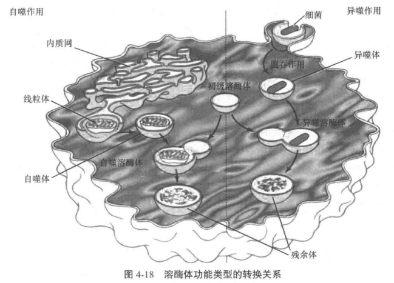
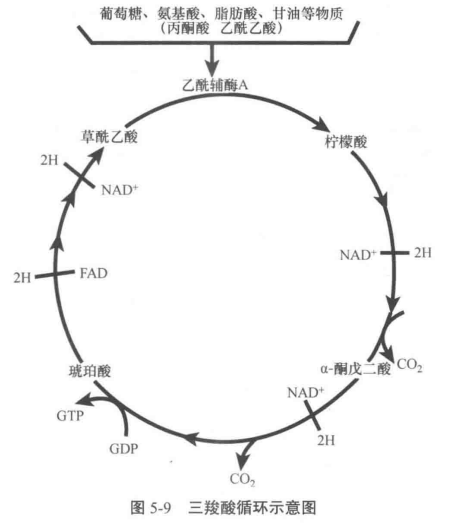
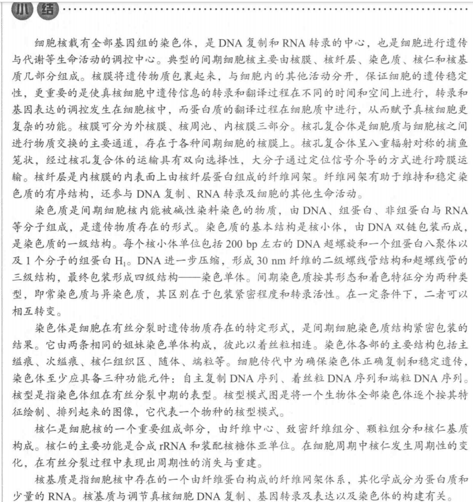
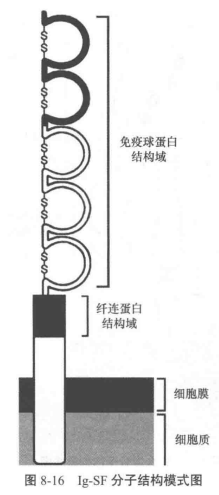

# 细胞生物学

## 第一章 细胞概论

### 细胞的基本知识

#### 化学组成及其结构

组成细胞的成分分为两大类：

1. 水（70%）
2. 非水化合物，即有机物与无机物

无机元素：H、O、N、P、S、Ca、K、Feel、Name、Class、Mg

有机物可按分子量分类：

- 小分子物质（100~1000）：**糖、脂肪酸、氨基酸、核苷**
- 生物大分子：生物小分子各自聚合可分别生成**多糖及糖原、脂肪及膜脂质、氨基酸、蛋白质和核酸**

参与细胞内结构组成的生物大分子主要有三种状态：

1. 膜状：细胞质膜、内膜和核膜
2. 线状/纤维状：一些线状结构由蛋白质组成，如微管、微丝和中间丝；另一些由核算组成，如信使 RNA(mRNA)，核仁中的核糖体 RNA(rRNA)以及染色体
3. 颗粒状：线粒体内膜和叶绿体类囊体膜上的基粒（蛋白质构成），以及核糖体（蛋白质与 RNA 组成，蛋白质合成的场所）

#### 细胞器

细胞质 = 胞质 + 细胞器

凡是具有一定形态特点、被单层或双层膜包绕、执行某些特定功能的结构，即称为细胞器(organelles)

1. 线粒体：细胞能量合成与供应
2. 高尔基体：单层膜蛋白质合成、糖与多糖合成、催化合成糖蛋白
3. 内质网：单层膜，蛋白质与脂质合成、分拣与运输
4. 溶酶体：单层膜，摄入物质的笑话分解，以及细胞内某些成分的降解

#### 细胞形状与大小

细胞形状：

- 单细胞
  - 细菌：杆菌、球菌、弧菌
  - 草履虫：鞋底状
  - 眼虫：梭形
- 多细胞生物，细胞形状还与功能有关
  - 肌肉细胞：长梭形，利于伸缩
  - 红细胞：扁盘装，利于$O_2$和$CO_2$气体交换
  - 神经细胞：很长的细胞突起，利于传到神经冲动

细胞大小，细胞体积守恒定律，细胞体积主要与下面两个因素有关：

1. 核质比：$NP=V_n/(V_c-V_n)$，即细胞核与细胞质的体积之比，其中 $V_n$和 $V_c$ 分别表示细胞核体积与细胞体积
2. 比面值（相对表面积），即单位体积占有的表面积：$I=S/V$，表面积除以体积

#### 细胞的基本共性

1. 细胞拥有一套独特的遗传密码及使用方式（基因）
2. 细胞能精确地自我复制（分裂）
3. 细胞需要能量才能生存
4. 细胞是一个加工厂（细胞代谢）
5. 细胞是一个“栩栩如生”的世界（细胞活动）
6. 细胞具有应激反应（受体/配体，信息传导）
7. 细胞能自我调节（突变）

### 原核细胞

原核细胞是指一类**无明显核结构的细胞**

原核细胞的三个基本特点：

1. 细胞内没有细胞核及核膜
2. 细胞内没有特定分化的复杂结构及内膜系统
3. 遗传信息量相对较小

下面将以细菌作为原核生物的代表进行介绍

细菌按照形状可以分为三类：

1. 球菌
2. 杆菌
3. 螺旋菌

细菌没有典型的细胞核，只有类似核的聚集了环状 DNA 分子的区域，称为拟核或类核，其周围是胞质

细菌除了核糖体外没有细胞器

细菌细胞膜是典型的生物膜结构但具有多功能性

细菌增殖方式为二分裂

#### 细菌的表面结构

1. 细胞膜：磷脂双分子层，半透膜，含丰富酶系，具有多功能性（细胞膜的多功能性是细菌区别于其他原核生物细胞膜的显著特征）
2. 细胞壁：成分为肽聚糖，多层网状大分子结构
3. 荚膜：细菌特殊结构，是细胞壁表面一层粘液物质，有保护和营养作用
4. 鞭毛和菌毛：鞭毛是运动器官，蛋白质结构；细菌间遗传物质传递由菌毛实现

#### 细菌的拟核和遗传物质

原核细胞没有细胞核和核膜

细菌遗传物质呈环状，所形成的一条染色体位于一个区域，称为拟核

除了拟核与染色体 DNA，细菌还存在染色体外 DNA，可自主复制，称为**质粒。**质粒是裸露的环状 DNA 分子，细菌可以在没有质粒的情况下生存

#### 细菌核糖体

细菌中含有核糖体，大部分游离于细胞质，少部分附着在细胞膜内侧。

### 真核细胞

#### 基本体系结构

**拥有细胞核**是真核细胞区别于原核细胞的最明显特征

真核细胞拥有：

1. 分化良好的细胞器与内膜系统
2. 特异蛋白质组装的细胞骨架
3. 以线粒体为代表的有氧代谢体系

真核生物区别于原核生物的特点：

1. 有完整的**细胞核，有助于执行复杂的遗传信息传递与表达功能**
2. 有复杂的**内膜系统**。除细胞膜外有一套用于包裹不同细胞器的膜系统，称为**内膜系统**
3. 拥有完善的**细胞骨架体系**。用于支撑细胞结构、帮助细胞附着、细胞转运、细胞通讯等

##### 生物膜系统

细胞内膜与细胞质膜统称为生物膜

细胞质膜，也称为细胞膜。主要功能是进行选择性物质交换，并由能量转换、分子识别、黏附运动及信号转导等功能。包绕细胞器的膜称为细胞器膜

细胞膜功能：

1. 信息传递：表面特定分子可作为标记被其他细胞识别
2. 控制物质进出：跨膜运输、胞吞胞吐/囊泡运输

##### 遗传信息传递与表达

染色体由蛋白质（组蛋白与少量酸性蛋白）与 DNA 组成，DNA 复制与 RNA 转录都在染色质上进行

遗传信息传递遵循**中心法则**：DNA-RNA-蛋白质。不同与原核细胞的是，转录在核内进行，翻译在核外

核糖体 = rRNA + 蛋白质，分为小亚基和大亚基

真核细胞的转录与翻译更复杂，除了因为**基因序列本身的改变**，还因为存在**表观遗传**，如组蛋白共价修饰、DNA 甲基化、染色质重塑、非编码 RNA 等。

##### 细胞骨架系统

**细胞骨架**可分为**细胞质骨架**与**核骨架**

细胞骨架是主要由微丝、微管和中间丝构成的网络

- 微丝：主要是肌动蛋白，与胞质运动、信号传递有关。
- 微管：由微管蛋白和微管结合蛋白组成，对细胞起支撑作用，为细胞内分子运输提供轨道
- 中间丝：组成复杂，类型众多，其蛋白质表达与细胞分化关系密切

#### 真核细胞与原核细胞本质之差

1. 真核细胞具有核和核膜：遗传信息的复制加工、转录在同一/不同区域进行
2. 真核细胞具有丰富的细胞内膜系统：原核细胞只靠内陷折叠及与各自色素或酶结合才能完成功能
3. 真核细胞具有形态各异的骨架：细胞骨架能维持细胞形态、提供轨道、平衡内外物质运输、调节细胞分裂
4. 丰富的遗传信息：真核细胞基因组容量与原核细胞差别不大，但能编码的基因数更多，得益于复杂的信息加工系统，包括一整套的基因表达过程（转录，转录后修饰，翻译，翻译后修饰等）与基因调节（转录前调节与转录后调节）。分裂方式也有有丝分裂、无丝分裂、减数分裂三种，而原核细胞只能二分裂

## 第二章 细胞生物学研究方法与技术

### 显微镜技术

显微镜技术分为三类：

- 光学显微镜：细胞显微结构
- 电子显微镜：分辨率提高，细胞亚显微结构
- 扫描隧道显微镜：分辨率提高到分子水平，研究细胞超微结构

#### 光学显微镜

光学显微镜分为下面几类：

1. 普通光学显微镜：生物样本固定、脱水、包埋、切片、染色
2. 相差显微镜：利用光的干涉衍射，适合观察单细胞或薄细胞层、细胞核、线粒体、液泡，样本无需染色
3. 荧光显微镜：有滤色片允许特定波长的荧光通过
4. 激光扫描共聚显微镜

#### 电子显微镜

简称电镜，种类如下：

1. 透射电子显微镜：主要观察细胞内部结构，观察组织、亚显微结构、蛋白质、核酸及病毒的形态
2. 扫描电子显微镜：主要观察细胞表面结构

### 细胞化学技术

细胞化学技术指保持细胞结构完整的条件下，通过细胞化学反应研究细胞成分及其动态变化

1. 酶化学技术：用电镜观察酶的分布，捕捉剂显色酶与底物的反应产物从而进行跟踪
2. 免疫细胞化学技术：将待检测的分子作为抗原，用可跟踪的抗体与之结合从而检测水平
3. 原位杂交技术：把标记过的核酸单链作为探针，探针可在细胞中和有互补结构的核酸单链结合，即可识别靶序列

### 细胞结构成分的离心分离技术

#### 离心分离技术原理与分类

离心分离原理：重力场作用下悬浮液的颗粒会沉降。沉降速度取决于颗粒的质量、密度、大小、形状和溶液粘度。沉降速度的 Stokes 公式：

$$
V=\frac{2r^2(\rho_1-\rho_2)}{9\eta}g
$$

其中：

- V 为沉降速度
- r 为颗粒直径
- $\rho_1$为颗粒密度
- $\rho_2$为介质密度
- $\eta$ 为介质粘度

$\rho_1 \gt \rho_2$ 时，V 为正，向管底沉降；反之溶液介质密度大则会上浮

实际一般溶液中各种物质处在同一重力场下，因此 g 可忽略。所以一般用沉降系数 S 表示沉降参数：

$$
S=V=\frac{2r^2(\rho_1-\rho_2)}{9\eta}
$$

离心技术有下面的分类：

1. 差速离心法：通过递增的速度离心，将不同大小的颗粒分离。但难以获得纯化的细胞器
2. 移动区带离心法：用于大小差别较小的颗粒。将所有颗粒放在介质表面，超速离心，由于不同大小的颗粒沉降速度不同则会形成不同的区带
3. 等密度离心法：原理是当颗粒密度与介质密度相同时将不会移动。设置一系列密度梯度的介质，开始离心，不同颗粒到达与其密度相等的介质中时将停止移动

#### 离心技术实验方法

离心方法选择：

- 差速离心：颗粒大小或沉降系数差别较大
- 移动区带离心：颗粒大小差别较小
- 等密度离心：颗粒大小差别不大但密度有差别

介质材料选择：

- 亲水有机分子（蔗糖、甘油）：低密度细胞器（高尔基体、内质网、溶酶体、线粒体）
- 重金属溶液：高密度分子和大分子（DNA、RNA、核糖体）

细胞器分离步骤：

1. 破碎细胞：细胞匀浆，机械方法破碎
2. 初步分离：差速离心法初步分离
3. 细胞器纯化：等密度法或换高密度蔗糖溶液差速离心细胞核

### 细胞培养技术

#### 细胞培养基本知识

培养细胞类型：

1. 贴壁细胞：有接触抑制，即互相接触后会抑制细胞运动
2. 悬浮细胞：在培养液中生长，生存空间打，便于大量繁殖

培养条件和细胞增殖过程：

- 传代：细胞到达一定密度后，要分离出一部分细胞到其他容器并更换培养液
- 细胞系：经遗传修饰后可在体外培养环境中无限生长的细胞

#### 细胞培养基本技术

原代培养：直接从生物体获取、分离细胞后首次培养

- 对细胞悬液（血液等）进行低速离心

* 对组织块，切成小块，胰蛋白酶或胶原蛋白酶分散，将获得的细胞悬液进行培养

传代方法：

- 贴壁细胞：胰蛋白酶，形成细胞悬液后加入培养基
- 悬浮细胞：直接添加新鲜培养基或离心收集后更换新鲜培养液

细胞冻存和复苏：

- 冻存前，向培养基中加入甘油等保护剂
- 液氮冻存
- “慢冻快融”，37 度水浴复苏

### 分析细胞学技术

#### 流式细胞分析

工作原理：

1. 荧光染色后的单细胞溶液放入流动室
2. 少部分液滴中包含单个细胞
3. 荧光标记不同的液滴可能带上不同电荷
4. 从而在电场中发生不同的偏转

#### 显微分光光度术

原理：细胞物质的特异光谱

1. 显微吸收光度测量：将目标基因**染色**，然后测量细胞组分-染料的**总吸光度**，计算出该组分的含量
2. 显微荧光光度测量：测量荧光反应物的量

### 细胞工程技术

#### 细胞融合

细胞融合方法：

1. 病毒类融合剂：仙台病毒
2. 化学融合剂：聚乙二醇 PEG
3. 电激融合法

**单克隆抗体技术：**

1. 向小鼠注射抗原，引发免疫反应，生成特异性免疫 B 淋巴细胞
2. B 细胞与骨髓瘤细胞经 PEG 融合
3. 对杂交瘤细胞进行筛选和克隆化，制备单克隆抗体

#### 细胞核移植

1. 选取受体细胞（成熟卵母细胞），紫外线照射或秋水仙素处理**去除细胞核**
2. 将供体细胞细胞核显微注射入受体细胞
3. 微电流脉冲促使核质融合
4. 体外培养重组卵一段时间，再移植入受体子宫

#### 基因转移

基因转移技术：将外源目的基因或 DNA 片段引入受体生物或细胞并使其表达

物理学方法：

1. 裸露 DNA 直接注射
2. 电穿孔
3. 基因枪
4. 显微注射

化学方法：增加细胞膜通透性、增加胞吞、增加 DNA 与细胞吸附。包括磷酸钙共沉淀、DEAE-葡聚糖、脂质体法等

生物学方法：病毒介导基因转移

- DNA 病毒载体：腺病毒载体
- RNA 病毒载体：逆转录病毒载体

病毒载体都是缺陷型病毒，感染细胞后仅将目的基因转入细胞但无法包装病毒颗粒

#### 转基因和基因敲除动物

转基因动物：通过基因工程在原 DNA 上添加一段 DNA，导入生殖细胞，培育成转基因动物并可将形状遗传

## 第三章 细胞膜与物质运输

### 细胞膜的化学组成与生物学特性

#### 化学组成

1. 磷脂、胆固醇核糖脂是膜脂质的主要类型
   1. 磷脂：两亲性分子，头部亲水、尾部疏水
   2. 胆固醇：使细胞膜更稳定，增加磷脂双分子层厚度
   3. 糖脂：脂质+寡糖，糖分子以糖脂或糖蛋白存在
2. 膜蛋白通过三种方式与膜结合
   1. 跨膜蛋白：两亲性分子，在磷脂双分子层中呈 α 螺旋结构（使肽键之间氢键合力达到最大）。功能有支撑、转运、能量转换等等
   2. 外周蛋白：分布于细胞膜内外表面，主要是内侧面，不插入脂质双分子层，以离子键、氢键等方式与膜结合，大多为亲水性。作膜骨架、维持膜完整性
   3. 脂锚定蛋白：也称脂连接蛋白，在膜内外侧以共价键与脂质双分子结合，相比跨膜蛋白运动型增大，更容易进行侧向移动
3. 细胞膜表面糖分子与膜蛋白或膜脂结合
   1. 真和细胞膜外表面的糖类成为细胞外被，用于保护细胞、抵御物理化学损伤等

#### 生物学特性

##### 细胞膜流动性使膜功能活动的保障

1. 脂质流动性：细胞运动、生长、分裂、物质转运、分泌核吞噬等作用都取决于细胞膜的流动性
2. 膜蛋白的流动性：
   1. 膜蛋白较大运动较慢。
   2. 可侧向位移（人-鼠细胞融合实验、荧光光漂白恢复法）
   3. 旋转扩散
   4. 并非所有膜蛋白都能自由运动

3. 影响膜流动性的因素：相变温度 $T_m$（由晶态变为液晶态），而其主要受三种因素影响
   1. 脂肪酸链长短：脂肪酸链越长，$T_m$越高，流动性越差
   2. 脂肪酸饱和程度：不饱和脂肪酸越多，$T_m$越低 ，流动性越高（动物脂肪多为饱和脂肪酸为固体）
   3. 胆固醇：对膜流动性有双向调节作用
      1. 一方面相变温度以上，因为其不易变形，可以限制膜流动性
      2. 另一方面，相变温度以下，可以干扰脂膜有序性，促进流动性

同时，膜蛋白越多，膜流动性越低

##### 膜不对称性决定膜的功能域

1. 膜脂不对称性：双层脂质分子分为外层核内层，内外两层的脂质分子的**种类和数量**差异很大
2. 膜蛋白不对称性：各种膜蛋白在细胞膜上都有特定位置，分布不对称
3. 膜糖不对称性：糖脂与糖蛋白的低聚糖连只在质膜外层 ，细胞器中寡糖链只在细胞器膜内侧

### 小分子物质的跨膜运输

细胞膜对进出细胞的物质的调节作用：

1. 通过膜选择通透性来维持细胞内外离子浓度差、渗透压平衡
2. 维持膜内负外正电势差及细胞兴奋性
3. 维持内环境与功能稳态

#### 被动运输

定义：物质顺梯度，从高浓度一侧向低浓度一侧进行跨膜转运过程

驱动力：浓度梯度

根据是否需要借助转运蛋白分为简单扩散和易化扩散：

##### 简单扩散

- 不需借助膜蛋白
- 速率完全取决于物质的分子量、浓度梯度和脂溶性

##### 易化扩散

离子、单糖、氨基酸、核苷酸等，需要借助膜蛋白才能跨膜

借助的膜蛋白可以分为**载体蛋白**和**通道蛋白**

载体蛋白：

- 对所转运物质有高度专一性
- 通过构象变化实现物质转运
- 驱动力是膜两侧物质浓度梯度差

通道蛋白（离子通道）：

- 通道双向，转运方向由浓度梯度决定，转运过程中不与离子结合
- 离子通道对离子有高度选择性，各种通道只能由特定离子通过
- 转运速率高
- 通道并非持续开放，有开放和关闭两种构象，通过门控机制调节

#### 主动运输

定义：物质由低浓度一侧向高浓度一侧逆梯度转运，需要消耗能量

##### ATP 供能的离子泵

钠钾泵：负责 Na+和 K+转运的蛋白质——Na+-K+ ATP 酶，是一种 ATP 水解酶，水解 ATP 释放能量供离子逆梯度转运。每次活动有 3 个 Na+出胞，2 个 K+入胞。从下图中可以看到，主要依靠**磷酸化和去磷酸化**实现构象改变

钙泵：Ca2+依赖性 ATP 酶，膜上 Ca2+泵将 Ca2+泵到胞外，内肌网膜上的 Ca2+泵将 Ca2+从细胞质运回肌质网，维持胞质中 Ca2+处在低水平

##### 协同运输

p.s. 同生理学中的继发性主动运输

定义：当离子顺浓度梯度运输时，顺便将这些分子逆梯度运输。这种依赖另一种物质被动运输而进行的主动运输称为**协同运输**

e.g. Na+-葡萄糖协同运输

### 大分子与颗粒物质的跨膜运输

大分子物质通过膜泡运输，包括胞吞和胞吐

#### 胞吞

根据胞吞物质的大小、状态和特异程度的不同，可以将胞吞作用分为三类：

1. 吞噬作用
2. 胞饮作用
3. 受体介导的胞吞作用

##### 吞噬作用

定义：细胞内吞较大的固体颗粒或多分子化合物进入细胞的过程

过程：

1. 被吞噬物质吸附，吸附物质没有专一性
2. 细胞膜内陷形成**伪足**
3. 包裹物质摄入细胞，形成的膜泡称为**吞噬体**或**吞噬泡**

##### 胞饮作用

定义：细胞摄入细胞外液及可溶性物质的过程。

当可溶性物质到达一定浓度时引发胞饮，质膜上的特殊区域形成小泡，称为胞饮体或胞饮泡

特点：胞饮作用是**持续发生的**，将持续一段时间

##### 受体介导的胞吞作用

胞饮作用不具有选择性，而受体介导的胞吞作用可以选择性吞入细胞外液中含量很低的物质，避免摄入过多液体，吞噬效率可提高 1000 多倍

1. 有被小窝和有被小泡：**有被小窝**是指质膜上受体集中的凹陷区域，进一步内陷与质膜分离后形成**有被小泡**进入细胞
2. 无被小泡形成：有被小泡形成后，**动力蛋白**将其从质膜上切割下，**脱去网格蛋白包被**形成**无被小泡。**无被小泡与**内体**融合，分离出**受体**和**配体**。受体送回细胞膜再利用，配体被溶酶体降解

3. 受体介导的 LDL 胞吞：主要用于运入**胆固醇**。
   1. 需要胆固醇时，首先合成 LDL 受体并嵌入细胞膜有被区
   2. 细胞外液中的 LDL 与 LDL 受体结合
   3. 有被小窝内陷，动力蛋白切割，脱去网格蛋白形成无被小泡
   4. 无被小泡与包内体结合，分离 LDL 受体与 LDL 颗粒
   5. LDL 受体返回细胞膜循环利用
   6. LDL 颗粒与溶酶体结合，被降解成胆固醇颗粒

#### 胞吐作用

定义：细胞将自身合成的物质或代谢废物释放到细胞外的过程

根据作用方式不同可分为：

1. 连续性分泌：又称固有性胞吐，是**持续不断**的过程，不受细胞外信号的调节，主要用于分泌**分泌性蛋白质**
2. 受调分泌：分泌性蛋白合成后**先存储**在分泌囊泡中，当细胞**接受外界信号刺激**，细胞内 Ca2+升高，才启动胞吐

## 第四章 细胞内膜系统

### 内质网

#### 内质网的化学组成

主要成分也是脂质和蛋白质，蛋白质种类多样：

1. 解毒功能
2. 脂质物质代谢
3. 糖类物质代谢
4. 蛋白质加工转运相关酶

内质网网腔中普遍存在网质蛋白质，主要功能是参与蛋白质的正确折叠和转运，主要有以下几种：

1. 免疫球蛋白重链结合蛋白：组织蛋白质聚集或变性，协助蛋白质折叠。帮助多肽进行折叠、装配和转运，自身不参与最终产物形成的分子称为**分子伴侣**
2. 钙网蛋白：调节钙平衡、蛋白质折叠加工……

…………略

#### 内质网的形态结构和类型

根据**是否附着核糖体**，可将内质网分为**粗面内质网**和**滑面内质网**

##### 粗面内质网

膜表面附着有核糖体颗粒，主要与外输性蛋白质合成有关

核糖体：蛋白质合成场所，合成蛋白质时大小亚基结合成核糖体，合成结束后大小亚基解离

真核细胞核糖体有两种类型：

1. 附着核糖体：附着在内质网膜和外层核膜表面
2. 游离核糖体：游离在细胞质基质中

##### 滑面内质网

可以和粗面内质网、核膜及高尔基复合体相连

滑面内质网具有多功能性，在不同细胞不同状态下形态分布和发达程度差异较大

#### 粗面内质网的功能

粗面内质网的主要功能：进行蛋白质合成、修饰加工、分选及转运

##### 参与蛋白质的合成

细胞中蛋白质合成可分为两种：

1. 内源性蛋白：始终在游离核糖体上合成
2. 外运性蛋白：游离核糖体上开始合成后，核糖体转移到粗面内质网上继续合成。因此粗面内质网的功能之一就是为外运性蛋白质合成提供核糖体附着的支架

**信号假说**解释了核糖体是如何移动并附着在粗面内质网上的：**分泌蛋白多肽链 N 端的信号肽**可引导蛋白质多肽链穿越内质网膜

1. 信号肽翻译 SRP
2. SRP 与信号肽、核糖体结合，并占据 A 位停止多肽合成
3. SRP-核糖体复合体与内质网膜上的信号识别颗粒受体结合，使核糖体停在内质网上
4. SRP 解离循环利用，多肽链可以继续合成
5. 信号肽诱导中央管通道打开，使新生肽链穿越内质网膜进入内质网腔
6. 大小亚基解离，通道关闭

同时信号肽可以指导内质网上新合成肽链的插入转移

##### 帮助新和成蛋白质的正确折叠与装配

内质网可帮助新合成蛋白质：

1. 按照一定方式折叠成高级的三维空间结构
2. 对所合成蛋白质进行质量监控，折叠错误则降解

##### 蛋白质修饰

内质网可对蛋白质进行加工修饰，主要包括：

1. 糖基化修饰：蛋白质与糖类在糖基转移酶的作用下共价结合形成糖蛋白的过程，包括：
   1. 粗面内质网上进行的 N-连接糖基化
   2. 高尔基复合体上进行的 O-连接糖基化
2. 酰基化修饰
   1. 酰基与糖脂结合将蛋白质锚定在内质网上
   2. 癌细胞产物的酰基化修饰
3. 泛素化修饰：底物蛋白被泛素蛋白共价修饰，泛素用于介导细胞降解，因此被泛素化修饰的蛋白相当于被打上“降解”标签
4. 蛋白质的囊泡运输：外输性蛋白被内质网膜包裹形成膜性小泡，一些进入高尔基复合体进一步加工浓缩修饰，另一些直接进入大浓缩泡

#### 滑面内质网的功能

##### 参与脂质、类固醇激素的合成与转运

滑面内质网是脂质物质合成的主要场所

脂质合成在**内质网膜胞质侧进行**，合成后的脂质镶嵌在**胞质侧膜**上，在**翻转酶**作用下将一部分脂质分子转移到内质网腔面

内质网合成的脂质可以输送到其他膜结构的膜上，主要有两种方式：

1. 出芽形成转运囊泡，输送到高尔基复合体、溶酶体和细胞膜
2. 与 PEP 结合进入胞质，在自由扩散转运到线粒体、过氧化物酶体等缺少磷脂的细胞器膜上（相当于用 PEP 作为载体）

同时滑面内质网还参与合成**胆固醇和类固醇类激素**，合成后以**脂蛋白**等形式运输到其他细胞器加工和分泌

##### 参与脂质代谢

脂质代谢旺盛的细胞内有丰富的滑面内质网，例如小肠上皮细胞

##### 参与糖原代谢

包括糖原的合成（尚不确定）与分解

饥饿时，可以被细胞质基质中的糖原磷酸化酶降解成葡糖-6-磷酸，然后由滑面内质网膜上的酶去磷酸化形成葡萄糖

##### 参与肝的解毒作用

肝细胞的滑面内质网中含有丰富的**氧化酶系**和**电子传递酶系**：

- 前者可**催化氧还反应**使毒性钝化或破坏
- 后者通过羟化作用电子传递**增强产物极性**，使**其易溶于尿液排出**

##### 参与 Ca2+存储与 Ca2+浓度调节

滑面内质网有存储 Ca2+的功能

骨骼肌细胞和心肌细胞的滑面内质网异常发达，特化为**肌质网**

肌质网膜有大量 Ca2+泵，不断将胞质中的 Ca2+转运到内质网腔存储，受到刺激使释放 Ca2+到胞质引起肌细胞收缩

### 高尔基复合体

高尔基体由几部分膜性结构组成，因此应称为高尔基复合体

#### 高尔基复合体的化学组成

**膜脂质**：脂质含量介于内质网和细胞膜，胆固醇含量明显高于内质网，说明流动性较低

**蛋白质**：**糖基转移酶**是高尔基复合体的标志酶

#### 高尔基复合体的形态结构

高尔基复合体呈弓形

- 凸面朝向细胞核或内质网，称为顺面、未成熟面，较薄
- 凹面朝向细胞膜，称为反面、成熟面、分泌面，较厚

1. 顺面高尔基网 CGN：
   1. 对内质网合成的蛋白质和脂质进行分选，大部分转运到中间高尔基网，小部分送回内质网
   2. 进行蛋白质修饰
2. 高尔基中间膜囊：
   1. 糖基化修饰
   2. 糖脂形成
   3. 高尔基复合体有关多糖形成
3. 反面高尔基网：
   1. 对蛋白质进行分选并分泌
   2. 蛋白质修饰

#### 高尔基复合体的极性

极性：**高尔基复合体各部分结构**在化学组成、形态和功能上的**明显差异**

各部分在形态上有所差异；功能上，含有不同的酶、形成独立的生化区室，因而可以执行不同功能

高尔基复合体执行功能时有方向性、顺序性：

1. 顺面：筛选鉴定可进入中间膜囊的蛋白质
2. 中间膜囊：对蛋白质、脂质进行加工和修饰
3. 反面：分选蛋白质并形成分泌泡分泌

#### 高尔基复合体的功能

1. 是细胞内蛋白质运输和分泌的中转站
2. 是蛋白质加工重要场所
   1. 糖基化，功能有：
      1. 保护蛋白质免遭水解酶降解
      2. 作为运输信号引导靶向运输
      3. 形成糖萼
   2. 磷酸化
   3. 蛋白质（或酶）的水解：某些蛋白质或酶需要特异性水解（切割）才能具有生物活性，如下图：

3. 是细胞内蛋白质分选与囊泡运输的枢纽，囊泡主要去向有三条：
   1. 溶酶体酶：以有被囊泡方式转运到溶酶体
   2. 分泌蛋白：与细胞膜融合分泌到细胞外（连续分泌）
   3. 分泌蛋白：以有被囊泡方式暂存胞质，择机分泌（非连续分泌）

### 溶酶体

溶酶体：膜性细胞器，含多种水解酶，能分解各种物质

#### 溶酶体的形态结构和特性

不同细胞溶酶体形态各异，一个细胞中含有几百个

溶酶体有以下共同特性：

1. 含多种酸性水解酶
2. 腔内位酸性环境
   1. 膜上有质子泵，可水解 ATP 将 H+泵入溶酶体
   2. 膜上有 Cl-通道蛋白，可运入 Cl-
   3. 两者相当于向内运输 HCl
3. 膜高度稳定：因为含有多种水解酶，因此膜必须高度稳定，原因可能有
   1. 溶酶体膜糖蛋白 LGP 寡糖链伸向内侧防止分解
   2. 溶酶体膜含较多胆固醇
4. 膜转运蛋白丰富：将分解产物运出，同时防止酶外漏引发自溶

#### 溶酶体的类型

根据底物可分为：

1. 自噬溶酶体
2. 异噬溶酶体
3. 残余体

#### 溶酶体的发生

溶酶体的形成与内质网、高尔基复合体以及胞吞都有关，主要包括以下过程：

1. 溶酶体酶蛋白前体在粗面内质网合成、初加工和转运（膜泡）到顺面高尔基网
2. 溶酶体酶蛋白前体**在高尔基复合体标记、分选和转运**
3. 细胞质中的囊泡与内体结合形成内溶性溶酶体
4. 在细胞质中成熟

综上

- 溶酶体膜来自高尔基复合体和晚期内体
- 溶酶体酶合成于粗面内质网
- 分选在高尔基复合体

#### 溶酶体的功能

1. 参与细胞防御
2. 参与细胞结构成分的更新：清除损伤或衰老的细胞器
3. 提供细胞营养：分解大分子物质提供营养
4. 参与机体组织器官形态形成：胚胎发育期间自溶除去不必要的细胞或组织
5. 参与受精过程：精子顶体水解卵细胞外被
6. 参与激素合成及激素水平调节：激素合成、加工和成熟等活动
7. 参与某些腺体组织细胞分泌过程的调节：细胞调节自身分泌量

### 过氧化物酶体

过氧化物酶体：单层膜细胞器，原型或卵圆形，含有类核体或类晶体，与溶酶体一样属于**异质性细胞器**

过氧化物酶体的酶：

1. 氧化酶：氧化底物时把氧还原成过氧化氢

2. 过氧化氢酶类：将过氧化氢还原成水

3. 过氧化物酶类：作用同过氧化氢酶

#### 过氧化物酶体的功能

1. 清除细胞代谢过程中产生的过氧化氢等毒性物质，起解毒作用
   1. 氧化酶氧化底物沈城过氧化氢
   2. 过氧化氢酶利用过氧化氢氧化其他有毒产物使其失去毒性

2. 调节细胞内的氧浓度，避免高浓度氧的损害

   1. 过氧化物酶体消耗O2进行氧化反应
   2. 线粒体有氧呼吸合成ATP
   3. 但线粒体最佳氧浓度是2%，然后不会随杨浓度增加而提高氧化能力；但过氧化物酶体氧化能力随氧浓度增高而上升
3. 进行脂肪酸氧化，参与细胞代谢

#### 过氧化物酶体的发生

1. 分类增殖：与线粒体一样，原有过氧化物酶体二分裂得到新的
2. 从头合成
   1. 内质网出芽释放未成熟的囊泡状结构——过氧化物酶体前体
   2. 细胞质中装配成成熟的过氧化物酶体

### 细胞内蛋白质的分选与运输

分选：生物体根据蛋白质信号序列合成蛋白质，分类运输到指定部位，装配成有一定结构和功能的复合体

#### 分选信号决定蛋白质去向

游离核糖体合成的蛋白：

- 核定位信号：使蛋白运输到细胞核
- 转运肽：使蛋白运输到线粒体
- 过氧化物酶体引导信号：运输到过氧化物酶体

同理不同蛋白有各种不同分选信号

#### 囊泡运输

胞内蛋白质有以下运输方式：

1. 囊泡运输（最主要）
2. 跨膜运输
3. 门孔运输

##### 囊泡

囊泡使细胞内物质定向运输的主要载体

固有膜性结构：内质网、高尔基复合体、溶酶体等

但囊泡是动态膜性结构，主要有两种囊泡：

1. 网格蛋白有被囊泡：产生于细胞膜和高尔基复合体
2. COP 有被蛋白
   1. COP Ⅱ又被囊泡主要负责蛋白质正向运输：负责**介导物质从内质网到高尔基复合体的正向运输**
   2. COP Ⅰ有被囊泡主要负责**内质网逃逸蛋白的回收**

同时，囊泡转运过程是一个高度有序、严格调控的定向物质运输过程：

1. 囊泡转运过程受严格选择和精密控制
2. 囊泡必须**特异性识别**并锚定与靶膜并写在货物

## 第五章 线粒体

### 线粒体的形态结构

光镜形态：多种多样，因细胞种类和所处生理状态不同而异

数目：与细胞类型与能量需求有关

**超微结构**：线粒体是由两层单位膜封闭包裹而成的膜囊状结构，由以下部分组成：

- 外膜

  - 平整光滑
  - 含有多种运输蛋白，即**孔蛋白**，可使水溶性物质通过
  - 富含胆固醇和磷脂，蛋白质比内膜少
  - 标志酶是**单胺氧化酶**
- 内膜

  - 富含蛋白质、磷脂，但缺少胆固醇
  - 没有孔蛋白，**通透性低**
  - 标志酶是**细胞色素c氧化酶**
  - 内膜向内折叠形成嵴，增加内膜表面积
    - 嵴的排列分为板层状和小管状
    - 嵴的数量与能量需求相关
  - 内膜/嵴膜上附着大量基粒，成分是ATP合酶
    - ATP合酶是多组分复合体
    - **膜结合**状态下具有**ATP合酶活性**，可催化ADP和Pi合成ATP
    - **游离**状态下具有**ATP水解酶活性**
    - 基粒**头部**含可溶性ATP酶，膜结合状态具有ATP合酶活性
    - 基粒**柄部**是调控之子通道的蛋白质
    - 基粒**基片**能传递质子，有质子通道的功能

  
- 膜间隙：内外膜之间的间隙，含有可溶性酶、底物和辅助因子
- 内室与基质：内膜以内部分，包含线粒体基质、酶、线粒体DNA、mRNA、tRNA等，以及基质颗粒

### 线粒体的化学组成和酶的分布

#### 化学组成

##### 蛋白质

内膜蛋白质含量最多，主要是ATP合酶、电子传递应答蛋白、载体蛋白

ADP/ATP逆向转运蛋白：

- 将线粒体合成的ATP运输至膜间隙，随后运出至细胞质供能
- 将ADP运入线粒体基质腔

可溶性蛋白：酶、外周蛋白

不溶性蛋白：向前蛋白、结构蛋白、酶蛋白

##### 脂质

外膜富含胆固醇和磷脂

内膜富含心磷脂，因此疏水性强、通透性低

#### 酶的分布

外膜：

- **单胺氧化酶（外膜的标志酶）**、NADH细胞色素c还原酶
- 与脂质代谢有关的酶

内膜：

- 呼吸链相关酶系
- 能量转化系统

### 线粒体的功能（重点）

线粒体主要功能是对糖、脂肪、蛋白质等各种能源物质的氧化和能量转换

细胞氧化：通过酶催化将各种供能物质氧化而释放能量的过程

细胞呼吸：细胞氧化过程中要消耗O2生成CO2和H2O

物质氧化基本过程：

- 糖酵解（细胞质中进行，不需要氧）
- 乙酰辅酶A生成（线粒体中进行）
- 三羧酸循环（线粒体中进行）
- 电子传递偶联氧化磷酸化（线粒体中进行）

#### 糖酵解

糖类如葡萄糖，不能直接进入线粒体，要在细胞质基质中先磷酸化，在酶的催化下分解成丙酮酸

$$
1葡萄糖\ce{->[酶的催化]}2丙酮酸+2ATP+2H+
$$

形成的丙酮酸进入线粒体基质

#### 乙酰辅酶A生成

丙酮酸进入线粒体基质后进行氧化（脱氢）脱羧：

$$
丙酮酸\ce{->[丙酮酸脱氢酶系][脱去1个碳]}乙酰基+CoA\ce{->乙酰CoA}
$$

#### 三羧酸循环TAC

三羧酸循环过程：

$$
乙酰CoA+草酰乙酸\ce{->}柠檬酸
$$

$$
柠檬酸\ce{->[各种酶]}\alpha-酮戊二酸\ce{->}琥珀酸\ce{->}草酰乙酸
$$

每进行一次TAC循环，产生4对H+和2分子CO2

3对H+与NAD+结合，每个NAD+接受一个H+和两个电子，另一个H+留在基质中，生成还原态的NADH

1对H+与一个FAD结合，每个FAD接受2个H+和两个电子，形成$FADH_2$

#### 电子传递偶联磷酸氧化

##### 电子传递

上述反应中产生的H原子必须与O2反应，氧化生成水

但是H原子不能直接和O2结合，需要经过以下步骤：

1. H原子解离成H+和e
2. 电子经过内膜上的电子传递酶系传递给1/2O2形成O2-
3. O2-与基质中的2H+形成H2O

NADH和FADH2是电子传递的重要媒介

**电子载体**：与释放电子结合并将电子传递下去的物质

- 黄素蛋白
- 细胞色素
- 铁硫蛋白
- 泛醌/辅酶Q

**电子传递链/呼吸链：**电子载体与蛋白质组成复合物，有序镶嵌在内膜上，组成传递电子和质子的酶体系

- 复合体Ⅰ：NADH脱氢酶
- 复合体Ⅱ：琥珀酸脱氢酶
- 复合体Ⅲ：细胞色素c氧化还原酶
- 复合体Ⅳ：细胞色素c氧化酶

如上图：

1. 复合体Ⅰ从NADH中接受电子，再将其传递给泛醌UQ
2. 泛醌同时也能从复合体Ⅱ中获得电子
3. 泛醌将电子经复合体Ⅲ传递给细胞色素c(cyt c)
4. cyt c 将电子传递给复合体Ⅳ
5. 复合体Ⅳ利用电子和氢离子将氧气还原成水

##### 氧化磷酸化偶联机制

化学渗透偶联假说：

1. **呼吸链起质子泵的作用**
2. 电子在复合体间传递时，释放能量**使质子H+从基质传递至膜间隙**
3. 因为内膜对H+不通透，因此形成**外正内负的电化学质子梯度**
4. 当内膜外的H+通过ATP酶复合体的**质子通道**进入基质
5. 此时，ATP合酶**利用电化学梯度的能量**催化ADP和Pi合成ATP，将能量以高能磷酸键的形式存储于ATP中

化学渗透耦联假说的最大特点是强调膜结构的完整性，即H+不能自由出入

### 线粒体的半自主性

#### 线粒体DNA

线粒体mtDNA呈闭合的环状双链分子，不与组蛋白组合，分散在线粒体基质不同区域

mtDNA有自我复制能力，能进行**半保留复制**（子代双链中含有一条父代单链与一条新结合的链）

mtDNA分裂前与内膜结合难以看见，分裂时出现在基质中，分裂后由于内膜结合

mtDNA复制需要的**DNA聚合酶**由核DNA编码，在细胞质核糖体上合成

#### 线粒体蛋白质的合成

线粒体具有自身合成蛋白质的系统：mtDNA、tRNA、rRNA等

线粒体核糖体的蛋白质：

1. 由核DNA编码
2. 在细胞质核糖体上合成
3. 再转运到线粒体内装配成线粒体核糖体

线粒体具有自主性的原因：

- 线粒体的蛋白质合成与原核细胞相似，而与真核细胞（细胞质核糖体）不同
  - mRNA的转录和翻译基本在同一时间和区域进行
  - 起始tRNA为甲硫氨酰tRNA
  - 线粒体蛋白质合成系统对药物的敏感性与细菌一致，而与细胞质系统不一致。即抑菌药物可以抑制线粒体蛋白质合成，而对细胞质系统无影响
- mtDNA的遗传密码子与通用密码表不相同

因此可说线粒体有自己的DNA和蛋白质合成体系，即独立的遗传系统

但由于：

- mtDNA分子量小，能合成的蛋白质很少，所以绝大多数蛋白质还是来自于核DNA编码
- 同时线粒体的遗传系统受核遗传系统控制（线粒体核糖体由核DNA编码）

因此线粒体是**半自助细胞器**

### 线粒体的增殖

关于线粒体增殖的两种观点：

1. 线粒体是在细胞质中重新形成的
2. 是由原来的线粒体分裂或出芽产生

证明实验：

1. 放射性标记线粒体膜的磷脂
2. 将标记过的线粒体在无放射性的培养基培养
3. 当细胞数增加一倍时，所有线粒体的放射性物质也减小一半

由此证明线粒体是从原先的线粒体分裂而来

线粒体的增殖有以下三种分裂方式：

1. 间壁分裂：内膜向中心形成间壁
2. 收缩分裂：中央收缩、两端拉长
3. 出芽分裂：原线粒体长出小芽、小芽分离、长大呈新的线粒体

## 第六章 细胞骨架

细胞骨架包括：

- 微丝：主要在细胞膜内侧，维持细胞形态，动态不稳定结构
- 微管：主要在细胞核周围，放射状向胞质四周扩散，动态不稳定结构
- 中间丝：分布在整个细胞中

### 微管

微管：细胞质内中空管状结构

#### 微管组成与形态

**微管蛋白**是组成微管的结构蛋白，主要分为

- α微管蛋白
- β微管蛋白

**微管的基本组成单位**是α、β微管蛋白异二聚体

原纤维：α、β两种蛋白交替出现形成的单链

13根原纤维平行合并形成微管：

- 异二聚体始终交替结合，即前一个β与下一个α连接
- 微管蛋白沿微管呈螺旋状
- 微管合拢处有一根接缝
- 微管可以在末端继续聚合/解离二聚体以延长/缩短

微管具有极性：

- α微管蛋白端为负极，异二聚体添加速度慢
- β微管蛋白端为正极，异二聚体添加速度快

微管有三种存在形式：

- 单管
- 二联管
- 三联管

#### 微管的装配

微管组装特点：

1. GTP-β微管蛋白亲和力强，易结合
2. GTP-β微管蛋白结合后水解GTP为GDP，而GDP-β微管蛋白易解聚
3. 异二聚体浓度高于临界浓度时可装配微管
4. 微管组装主要在正极
5. 低温、Ca2+和药物（秋水仙碱）会破坏组装和去组装的平衡

微管自我组装过程：

1. 微管蛋白异二聚体先组装成短的寡聚体结构，即组装核心
2. 组装核心向两端和两侧扩展，形成片状结构
3. 片状增加到13根原纤维时，合拢微管，此过程称为成核期，过程缓慢，是限速步骤，又称为延迟期
4. 成核期后，高浓度异二聚体迅速添加到微管末端使其延长
5. 异二聚体浓度低于临界浓度后，微管快速去组装，迅速缩短

微管装配过程动态不稳定，会不断出现延长和缩短的交替现象，本质原因是：

- GTP-微管蛋白的浓度
- GTP水解成GDP的速度

两者的动态平衡

- GTP-微管蛋白浓度高时，组装速度大于GTP水解速度，形成“GTP-帽”，抑制解聚
- 微管蛋白浓度下降，GTP水解速率上升，GTP-帽消失，微管迅速缩短
- 微管蛋白浓度升高，再次开始延长

组织中心MTOC：细胞内微管组装的起始区域，**多为中心体**

MTOC近端为负极，远端为正极

中心体：由一对相互垂直的中心粒和中心粒周围基质组成，在S期半保留复制，分裂期移动到细胞两极形成纺锤体

部分药物可影响微管装配。例如秋水仙碱可以

- 与异二聚体结合，阻止微管聚合，促进微管解聚
- 抑制细胞纺锤体形成，使分裂停留在中期

紫杉醇

- 与异二聚体结合，抑制解聚，促进延长
- 同样能抑制有丝分裂

两者作用虽然相反，但都是破坏了微管的动态不稳定性，阻止纺锤丝形成

#### 微管的功能

1. 通过支架作用维持细胞的形态
2. 参与细胞内物质运输
   1. 为运输提供轨道，微管极性可指导方向
   2. 马达蛋白可与微管轨道结合并转运物质
      1. 驱动蛋白：将物质由微管负极运向正极（背向中心体）
      2. 动力蛋白：将物质从正极运向负极（朝向中心体）
3. 维持细胞器的定位和分布
4. 组成纤毛和鞭毛运动的元件
5. 参与纺锤体的形成与染色体的运动

### 微丝

微丝使三种细胞骨架成分中最纤细的，由肌动蛋白构成

#### 微丝的组成与形态

肌动蛋白：球形，ATP酶活性部位可结合ATP和Mg2+

游离的球形分子形式称为**球状肌动蛋白G-actin**

聚合成纤维细丝形式称为**纤维状肌动蛋白F-actin**

人体中有6中肌动蛋白亚型：

- 4中α-肌动蛋白：参与组成细胞收缩性结构
- β-肌动蛋白：存在于膜内侧，能装配成微丝
- γ-肌动蛋白：形成应力纤维

微丝形态结构：

1. 肌动蛋白头尾相连形成肌动蛋白纤维
2. 两条平行肌动蛋白显微右手螺旋相互缠绕形成微丝

微丝具有极性：

- 容易聚合肌动蛋白（微丝延长）一端为正极
- 不易聚合、容易解聚一端为负极

#### 微丝的装配

##### 微丝装配过程

微丝和微管一样也是动态结构，能不断组装和去组装

装配特点：

1. 结合ATP的G-actin于肌动蛋白纤维末端亲和力高，结合到负极后ATP水解成ADP
2. ADP-肌动蛋白亲和力弱，容易解聚
3. 正极生长速度快于负极
4. 正极临界浓度低于负极
5. 特异性药物会破坏微丝组装/去组装平衡

装配过程：

1. 成核期：限速过程，G-actin随机移动形成三聚体“核心”
2. 延长期：G-actin在核心两端聚合，纤维快速延长
3. 平衡期：G-actin浓度降低，正极组装速度与负极解离速度相同，纤维长度不变

##### 微丝装配的动态调节

踏车现象：

- 初始G-actin浓度高于负极临界浓度，**两极快速添加G-actin均延长**
- G-actin浓度下降到负极临界浓度，负极添加与解离速度相同，而**正极快速生长**，G-actin仍减少
- G-actin浓度低于负极临界浓度，**负极**解离快于添加而**缩短**；**正极**仍未到达临界浓度，添加快于解聚而**延长**
- G-actin正极添加速度与负极解离速度相等时**微丝长度不变、G-actin浓度不变**，但**保持向前运动**，这种现象称为**踏车现象**
- 此时G-actin浓度**介于正负临界浓度之间**

踏车能量来自ATP：与ATP结合的G-actin装配后水解ATP

微丝解离速度明显慢于微管解聚速度，因此不会出现快速解聚现象

微丝结合蛋白可调节微丝形成：

- 前纤维蛋白可促进聚合
  - 使游离的G-actin均与ATP结合
  - 将ADP-G-actin的ADP置换为ATP，形成profilin-ATP-G-actin复合体
- 丝切蛋白可促进ADP-G-actin解离，然后经过ATP置换后添加到微丝正极

这两种微丝结合蛋白可将踏车速度提升近10倍

##### 微丝体内装配的成核作用

微丝在肌动蛋白成核因子帮助下组装可快速进入延长期：

- 肌动蛋白相关蛋白ARP
  - 为肌动蛋白纤维生长提供核心
  - 封闭肌动蛋白纤维负极端，保证正极快速延长
  - 可结合在已有的肌动蛋白纤维上成核组装新的纤维，形成网状结构
  - 需要激活因子激活

- formin蛋白家族
  - formin FH2结构域结合两个G-actin形成核心
  - formin FH1结构域可提高profilin-ATP-G-actin浓度，快速供给
  - FH2结构域始终域正极结合，提高组装速度同时保护正极端免受加帽蛋白干扰

##### 影响微丝聚合与解聚的药物

- 细胞松弛素：与微丝正极端结合，**抑制微丝组装**，使微丝解聚
- 鬼笔环肽：与F-actin结合**抑制微丝解聚**

#### 肌动蛋白结合蛋白

细胞内G-actin浓度很高，快速聚合会导致浓度迅速下降

**肌动蛋白结合蛋白ABP**可以和G-actin或F-actin结合，细胞内**抑制微丝快速聚合**

肌动蛋白结合蛋白有不同种类不同功能：

#### 肌球蛋白

肌球蛋白：具有ATP酶活性，可沿着微丝运动的马达蛋白

Ⅱ型肌球蛋白结构如下：

- 球形头部
  - ATP酶活性
  - 肌动蛋白结合位点：结合微丝后ATP酶活性增强
- 颈部
  - 长度与轻链数各不相同，杠杆作用
- 长尾部：差异较大，与货物结合

#### 微丝的生物学功能

1. 细胞内运动：李斯特菌能跟随微丝向前移动（**踏车现象**）
2. 胞吞作用：微丝快速聚合可导致细胞膜内陷，并于细胞膜分离
3. 肌肉收缩：**肌球蛋白**与**肌动蛋白**参与肌肉收缩的滑动模型，详细过程参考**生理学笔记第二章第四节肌肉收缩**
   1. 肌球蛋白头部与肌动蛋白丝结合
   2. ATP与肌球蛋白头部结合，使肌球蛋白头部与肌动蛋白解离
   3. 肌球蛋白头部水解ATP使头部向细肌丝正极移动
   4. 肌球蛋白释放Pi，肌球蛋白头部与肌动蛋白结合，将肌动蛋白向M线拉
   5. 肌球蛋白释放ADP，恢复至初始构象，开始新循环

4. 细胞运动：肌动蛋白与肌动蛋白结合蛋白ABP相互作用进行变形运动
   1. ABP介导肌动蛋白聚合，使细胞伸出伪足
   2. 伪足与表面黏附
   3. 细胞后部黏附点脱离基质，肌动蛋白纤维解聚产生拉力，拉动细胞向前移动

5. 维持细胞形态：
   1. 细胞皮质：质膜下由微丝和肌动蛋白结合蛋白组成的网格结构
   2. 可维持质膜强度和韧性
6. 参与细胞分裂：
   1. 有丝分裂末期子细胞间形成收缩环，收缩环收紧使两细胞分离
   2. 收缩环收缩机制来自肌动蛋白和肌球蛋白的滑动以及微丝解聚

### 中间丝

中间丝：因直径介于微管与微丝之间得名（……）

并非所有真核生物都存在中间丝蛋白

中间丝是最稳定、化学成分最复杂的骨架成分

#### 中间丝蛋白的组成与结构

中间丝有6种类型：

中间丝蛋白的结构：

- 头部氨基端呈球形，中间区的α螺旋为杆状，尾部羧基端也呈球形
- 两个平行的α螺旋杆状区形成螺旋二聚体
- 中间丝分子量大小主要取决于尾部氨基酸数目

#### 中间丝的装配

中间丝的装配与微管和微丝不同，不涉及微管所需的GTP或微丝的ATP提供能量

装配过程如下：

1. 两条平行的中间丝蛋白的α螺旋杆状区缠绕成双股超螺旋二聚体
2. 两条反向平行的二聚体形成四聚体，四聚体是中间丝组装的基本单位
3. 四聚体首尾相连组成原纤维
4. 8根原纤维侧向作用形成绳索样中间丝

中间丝装配有以下特点；

- 两个二聚体反向平行装配成四聚体，因此四聚体没有极性
- 细胞内的中间丝蛋白基本全部装配成中间丝，几乎不存在游离的可溶性蛋白，也没有踏车现象
- 暂未发现影响中间丝装配的药物
- 但中间丝是动态结构

中间丝装配的调控机制：与中间丝蛋白**氨基末端**头部结构域的**磷酸化**有关

#### 中间丝的生物学功能

1. **为细胞提供支撑作用**
   1. 在细胞内形成一个完整的**支撑网架系统**：与细胞膜/外基质、细胞核/核基质相连，通过细丝状蛋白与微丝、微管等相连，形成网状骨架，支撑细胞
   2. 为细胞提供**机械强度支撑**：中间丝易弯曲，受应力不易断裂，可保护细胞免受机械损伤
2. **参与细胞内物质运输**：中间丝、微管、微丝组成的网络完成物质运输
3. **参与细胞内信号传递**：中间丝可充当信号分子传递信息
4. **在相邻细胞、细胞与基膜之间形成连接**：中间丝可在细胞间形成网络
5. **参与细胞分化**：中间丝蛋白的表达具有严格的时空和组织特异性

### 细胞骨架之间的相互作用

#### 功能上相互呼应

三种物质分布：

- 微管：细胞核周围，放射状向胞质四周扩散
- 微丝：细胞膜内侧
- 中间丝：整个细胞

三者相互配合完成细胞支撑、运输等功能

例如在细胞毒性T细胞识别靶细胞后，识别部位肌动蛋白形成微丝带动中心体转移至识别部位

#### 细胞信息传递

细胞骨架系统对外可与细胞膜和外基质连接，对内可与细胞核相连，是

- 连接细胞表面和细胞核的唯一结构
- 细胞外信号和核内基因表达间的桥梁

## 第七章 细胞核

### 核膜与核孔复合体

#### 核膜

核膜由**内外两层单位膜**组成，保证生命活动相互不干扰、保护核内DNA分子免受损伤

外膜：

- 面向细胞质，表面由大量核糖体
- 部分与内质网相连
- 分裂间期外膜与中间丝、微管等细胞骨架相连

内膜：

- 面向核质，无核糖体
- 与浓集染色质接触
- 核纤层通过相关蛋白质结合在内膜上

#### 核周池

核内外膜之间的腔隙称为核周池

核周池与粗面内质网相连，腔内含有多种蛋白质和酶

#### 核孔复合体

核孔是细胞质和细胞核进行物质交换的主要通道

核孔是蛋白质组成的复合体，由以下部分组成：

- 胞质环：外核膜一侧的边缘
- 核质环：内核膜一侧的边缘
- 端环：环上向核中心伸出的8条长纤维
- 辐：8根柱状结构支撑两个环
- 中央颗粒：中央运输体，转运核质与胞质的物质

核孔复合体的功能：

1. 跨膜运输蛋白：是细胞核与细胞质物质交换的通道
   1. 被动运输：核孔复合体亲水，离子和水溶性小分子可自由扩散
   2. 主动运输：
      1. 核孔径可根据物质大小调节
      2. 信号识别与载体介导主动转运，消耗ATP
      3. 有双向性

通过核孔的蛋白质去向由其序列中的**定位信号**决定，证明实验：

1. 将完整的核质蛋白、核质蛋白头部、核质蛋白尾部注射仅细胞质
2. 完整核质蛋白、尾部可转运到细胞核中
3. 头部停留在细胞质没有转运

说明核质蛋白尾部存在**核定位信号(NLS)**

同样，大分子出核需要核输出信号(NES)；需要往返的蛋白则同时有NLS核NES

亲核蛋白：在细胞质合成后进入细胞核内发挥功能的蛋白质

亲核蛋白一般具有**有核定位功能的氨基酸序列(NLS)**保证转运到细胞核内

同时亲核蛋白转运还需要核转运蛋白、Ran等蛋白质的协助：

- 亲核蛋白先后与核转运蛋白α、β结合
- 复合体与核孔胞质纤维结合产生构象改变，复合体转运到核质面
- 结合GTP的Ran蛋白与核转运蛋白β作用，是复合体解离，亲核蛋白游离
- β与Ran返回胞质面
- Ran返回核质面

同时核中的mRNA和各种非编码RNA通过核孔复合体转运到胞质，有核输出信号(NES)，需要蛋白质协助并耗能

#### 核纤层

结构：仅靠核内膜的核纤层蛋白纤维网络结构

- A型核纤层蛋白：核纤层蛋白A、C，近染色质，可与染色质特殊位点结合，为染色质提供附着位点
- B型核纤层蛋白：核纤层蛋白B，近内膜，可与内膜受体结合

功能：

1. 维持核膜完整与稳定，为核膜提供支架，与核膜崩解核重建有关

2. 为染色质提供锚定位点，介导核膜与染色质相互作用，保证染色质结构有序性。对基因转录调控有关键作用
3. 核纤层与染色质的凝集和解聚相关
   1. 染色质附着在核纤层位点才能凝集称染色体
   2. 染色体需要附着在新的核纤层才能解聚为染色质

### 染色质

#### 化学组成

##### 染色质DNA

染色质DNA：遗传物质载体，DNA复制和RNA转录的模板

基因组：生物全部染色体上遗传物质的总和

基因组由单一序列和重复序列组成：

- 单一序列：基因组中只有单拷贝
- 重复序列：基因组中反复出现

真核基因组DNA可分为：

- 非编码序列：大多数重复序列
- 编码序列：多是单拷贝

基因多样性体现为：

1. DNA片段长度多样性：碱基缺失、重复、插入
2. DNA重复序列多样性：重复序列拷贝数的变异
3. 单核苷多样性：单个核苷酸变异，包括单碱基确实、插入、置换

##### 染色质蛋白质

染色质蛋白质：即染色体DNA结合蛋白，包括两类：

- 组蛋白
  - 与DNA**非特异性**结合
  - 是染色质主要蛋白质组分
  - 可有多种修饰以维持染色体结构和功能
  - 只在S期合成
- 非组蛋白
  - 与DNA**特异性**结合
  - 为染色体上与**特异DNA序列**结合的蛋白质
  - 整个细胞周期都在合成

#### 染色质的结构

##### 一级结构：核小体

- 核心：组蛋白八聚体
- DNA链盘绕组蛋白，与H1组蛋白结合
- 相邻核小体之间以连接DNA相连
- 组蛋白与DNA的作用不具有序列特异性
- 核小体有自我装配特性：未与组蛋白结合的DNA接触到组蛋白后可装配成核小体
- 核小体沿DNA链的分布受不同因素的影响
  - 非组蛋白特异性结合
  - AT面向组蛋白八聚体，GT背向组蛋白八聚体

##### 二级结构：30nm纤维

一级结构：组蛋白H1介导形成的核小体串珠结构

二级结构：组蛋白H1参与形成外径30nm、内径11nm的**螺线管结构**

##### 三级结构：超螺线管

30nm纤维进一步螺旋化形成圆筒状结构，称为**超螺线管**，是**染色质包装的三级结构**

##### 四级结构：染色单体

超螺线管进一步螺旋折叠形成**染色单体**，即**染色质包装的四级结构**

#### 常染色质和异染色质

常染色质：

- 包装松散、具有转录活性的染色质
- 含有单一和重复序列DNA
- 多在S期早、中期复制，正常情况功能活跃

异染色质：

- 细胞间期及早前期呈凝集状态的染色质，染色深色呈块状结构
- DNA分子与组蛋白紧密结合，很少转录，功能静止，低活性
- 又分为两种
  - 结构异染色质：整个细胞周期都处于凝集态，有大量重复DNA序列
  - 兼性异染色质：常染色质在特定阶段转变而来
- 功能
  - 贮存遗传信息
  - 转录终止点
  - DNA聚合酶起始点
  - 转录rRNA

### 染色体

染色体是间期细胞质结构紧密包装的结果，化学组成没有区别

#### 中期染色体的形态结构

中期染色体的结构：

- 姐妹染色单体在着丝粒结合
- 每条单体由一条DNA双链盘曲折叠形成

中期染色体有四种：

1. 中着丝粒染色体：两臂长度大致相等
2. 近中着丝粒染色体
3. 近端着丝粒染色体：具有微小短臂
4. 端着丝粒染色体

**主缢痕**：姐妹染色单体连接处向内凹陷的缢痕，包括着丝粒和动粒

着丝粒：

- 姐妹染色单体的连接点，位于主缢痕处
- 将两条染色单体分为短臂p和长臂q
- 由高度重复的异染色质组成，主要成分DNA和蛋白质

动粒：

- 位于染色单体外侧的三层圆盘状结构
- 由多种蛋白质组成
- 是分裂时着丝粒的附着位置

着丝粒与动粒组成复合体，共同介导纺锤丝与染色体结合

着丝粒-动粒复合体由内向外包含三个结构域：

1. 配对结构域：位于着丝粒结构域内层，两条染色单体在此连接，含有着丝粒蛋白和染色单体蛋白
2. 中心结构域：着丝粒的主体，包括着丝粒大部分
3. 动粒结构域：位于着丝粒表面，呈内中外三层板状结构：
   1. 外板覆盖纤维冠，纤维冠上有马达蛋白，与纺锤丝相连
   2. 内板与中心结构域的着丝粒异染色质结合
   3. 三种结构共同实现与纺锤丝微管结合、牵引染色体分离

**次缢痕**：除了主缢痕外的其他浅染色缢痕称为次缢痕

**核仁组织区**：次缢痕处有含rRNA基因的染色体区域，rRNA基因在此处合成，称为核仁组织区NOR。并非所有次缢痕都是NOR

**随体**：位于某些染色体末端的球状或棒状结构

端粒：

- 染色体两端特化结构
- 功能
  - 保护染色体末端免于融合、退化
  - **细胞分裂计数器**
- 每次分裂都会时端粒缩短，端粒缩短是细胞衰老的标志
- 癌症细胞有较强端粒酶活性，可合成端粒DNA，因此分裂后长度不变，几乎能无限分裂

#### 染色体DNA的三种功能元件

1. 自主复制DNA序列：具有复制七十点，保证染色体自我复制
2. 着丝粒DNA序列：与染色体分离有关
3. 端粒DNA序列：TTAGGG，避免核酸酶对染色体末端DNA序列的切割

#### 核型与染色体显带

核型：某一类生物体体细胞在分裂中期的全部染色体总和

核型模式图如下：

染色体显带技术：可明确核型中任何一条染色体乃至某一易位片段

### 核仁

#### 化学组成

核仁主要成分是染色质蛋白质：

- 组蛋白和非组蛋白
- 核糖体蛋白质

同时还有多种酶系、RNA

#### 超微结构

裸露无膜、纤维丝构成的海绵状结构，主要有三个特征区域：

1. 纤维中心FC：低电子密度区域，rRNA的基因rDNA存在部位
2. 致密纤维组分DFC：电子密度最高区域，是rDNA进行rRNA转录的区域：首先合成前体，然后在DFC中的蛋白剪切加工形成成熟rRNA
3. 颗粒组分GC：核仁主要结构，由核糖和蛋白颗粒组成，是正在加工、成熟的课堂提亚单位前体颗粒
4. 核仁基质：无定形蛋白质液体，上述三种物质存在核仁基质中，核仁基质与核基质沟通

综上：

- rRNA基因位于**纤维中心**
- 转录发生在**纤维中心与致密纤维中心交界**，合成前体
- 前体在**致密纤维中心**剪切加工
- rRNA加工成熟后，颗粒组分形成**核糖体亚单位前体**

#### 核仁的功能

核仁的主要功能是**合成rRNA**和**装配核糖体亚单位**

##### rRNA合成，加工与成熟

rRNA有四种：

- 5.8S rRNA
- 18S rRNA
- 28S rRNA
- 5S rRNA

前三种组成一个转录单位，由RNA聚合酶I转录；5S的基因不在核仁区的rDNA，而在染色体其他区域

串联的rRNA基因由RNA聚合酶转录，产生初级RNA转录本，最终剪切成28S、18S、5.8S

##### 核糖体亚单位组装

核糖体亚单位组装过程：

1. 上面45S rRNA转录后**与核仁蛋白质结合**形成核糖和蛋白颗粒
2. 后者丢失部分RNA和蛋白质构成核糖体大小亚单位前体
3. 大小亚单位前体通过核孔复合体运输到蛋白质
4. **成熟mRNA**出核后**刺激大小亚基成熟形成完整核糖体**并进行蛋白质翻译

此外，常染色体中的5S rDNA经RNA聚合酶III转录后，5S rRNA转运至核仁参与大亚基组装

##### 核仁周期

核仁会随着细胞周期而周期性变化：

1. 有丝分裂时，核仁变形、缩小，染色质凝集，rRNA合成停止，核膜破裂进入**中期**，**核仁消失**
2. **有丝分裂末期**，核仁组织区DNA解凝集，rRNA重新开始合成，**核仁重组**

核仁重建过程需要**rRNA基因活性**，**rRNA基因转录活性**被一直会阻止核仁重建

##### 细胞核仁与细胞应激

核仁除了为核糖体提供原料外，还有**细胞应激感受器**的作用

核糖体大小亚基是由成熟RNA与核糖体蛋白结合而成

当核仁受到损伤时，会导致rRNA产生受到抑制。此时游离的核糖体蛋白会：

1. 从核仁组织区转移到细胞核基质
2. 抑制MDM2对p53降解，使p53蛋白水平升高并活化
3. p53激活下游基因导致细胞周期停止或细胞凋亡

### 细胞核基质

细胞核内除了核膜、染色质、核仁外，还有一个以蛋白质成分为主的**网络结构体系**，称为**核基质**

#### 核基质结构与化学组成

细胞核去除核膜、组蛋白非组蛋白、DNA与脂质后，得到纤维网格结构，即为核骨架纤维

核骨架蛋白质组成非常复杂，主要可分为两类：

1. 各类型细胞共有的蛋白质
2. 与细胞类型与分化程度有关蛋白质

#### 核基质的生物学功能

- 调节DNA复制
  - DNA半环通过特定的**基质锚定区域序列**结合到核基质上，DNA复制在核基质上进行
  - 同时基质锚定区域可与**DNA拓扑异构酶II**结合锚定到核基质，调控DNA复制
- 调控基因转录表达
  - 转录的基因需要结合在核基质
  - 只有有转录活性的基因才能与核基质结合
- 染色体构建
  - 核基质可能对核内DNA空间构型起维系和支架作用
  - 参与DNA超螺旋化

## 第八章 细胞连接与细胞黏附

### 细胞连接

#### 细胞连接的类型和组成

动物细胞之间的连接可分为三种：

- 紧密连接：相邻细胞质膜紧密结合，可调控液体在细胞间隙流动与渗透
- 锚定连接：细胞借助细胞骨架成分相互黏附，保护免受外力冲击作用
- 通讯连接：信息通过缝隙连接传递给相邻细胞

#### 细胞连接的结构与功能

##### 紧密连接

紧密连接可阻挡液体通过细胞间隙向相邻细胞渗透，例如可防止肠腔内液体穿过上皮细胞，起到**封闭作用**

例如小肠上皮细胞分为顶面和基底面：

- 顶面：靠近肠腔一侧，上皮的吸收只能发生在顶面，由膜转运蛋白介导
- 基底面：紧靠血管内皮，营养成分转运入小肠上皮细胞并经过代谢后，代谢产物经基底面转运入血

嵴线是紧密连接的结构基础，相邻细胞紧密连接处的嵴线通过阔膜蛋白彼此对合交联

紧密连接的密闭程度与嵴线数量有关，嵴线越多，封闭越严

参与紧密连接的跨膜蛋白：

- 封闭蛋白：存在于不同上皮细胞中，构成通透强度不同和选择性不同的紧密连接
- 封闭连接蛋白：可将嵴线固定在细胞骨架上

紧密连接功能：

1. **机械连接作用**
2. **封闭作用**：阻止物质的双向渗漏
3. **物理屏障**：限制膜蛋白在脂质双层中流动，形成**极向化**，保证细胞运转蛋白有序活动
   1. 细胞膜的极向化：膜蛋白、膜脂和膜糖类成分**有规律聚集**到细胞膜某一位置

##### 锚定连接

**锚定连接**指细胞借助细胞内骨架成分形成的特殊连接方式，可为阻止和细胞抵御外界机械力的破坏

**锚定连接的蛋白**有两大类：

- **细胞内附着蛋白**：将细胞骨架蛋白（例如肌动蛋白或中间丝）附着于连接点
- **跨膜连接糖蛋白**
  - 细胞内的部分与附着蛋白相连
  - 细胞外的部分与相邻细胞跨膜连接蛋白相连，或与胞外基质相连

锚定连接分为两类：

- 桥粒连接：借助中间丝相连

  - 点状桥粒
    - 相邻细胞通过中间丝的报纸版参与连接
    - 点状桥粒呈圆形
    - 细胞膜胞质侧有非糖蛋白斑块结构
    - 中间丝一端附着斑块，一端向胞质放射状伸出，称为张力丝
  - 半桥粒
    - 指细胞与基膜之间的连接
    - 结构只有点状桥粒的一半，即只有基底面有胞质斑、张力丝与跨膜连接糖蛋白
    - 功能是将上皮细胞铆接在基膜上，防止机械力造成脱落

- 黏着连接：借助肌动蛋白纤维相连
  - 黏着带：黏着链接包绕整个细胞，形成一条带状区域，称为黏着带
    - 与胞质斑相连的是肌动蛋白而非中间丝
    - 相邻细胞通过钙黏着蛋白相互连接
    - 黏着带除了细胞间连接和支持功能，由于肌动蛋白有收缩功能可牵动胞质班、改变细胞形状
  - 黏着斑：类似半桥粒，是细胞与细胞外基质间的连接结构

##### 通讯连接

细胞之间供互相交流而形成的特殊连接方式称为通讯连接，主要传递的是化学信号和电信号

动物细胞的通讯连接有两种：

1. 缝隙连接
2. 突触

###### 缝隙连接

缝隙连接的基本单位是**连接子**。每个连接子由6个跨膜柱状蛋白，即**连接子蛋白**，环聚而成

相邻细胞膜的连接子跨细胞间隙对合连接，形成沟通通道

沟通通道除了连接作用，还可以通过小分子信号物质引起对方代谢耦联，起到信号通讯作用

同时缝隙连接的通透性并不是恒定不变，而是可调节的。

例如连接子围成的亲水孔道具有开关功能，两细胞之一胞质Ca2+浓度升高时关闭，信息传递阻断

孔道开关并非像离子通道那样“全或无”，而是随Ca2+浓度而逐渐变化

缝隙连接主要传导电信号，缝隙连接成为相邻细胞间电兴奋的传导通路，称为**电耦联**

###### 突触

突触是**神经元之间**或**神经元-肌细胞之间**的特异性连接装置

突触可分为两类：

1. 化学突触：传递的介质是神经递质
   1. 先将电信号转换为化学信号
   2. 再将化学信号转换为电信号
   3. 因此动作电位在传递中会有延迟现象
2. 电突触：缝隙连接构成，传递电信号

### 细胞黏附

细胞黏附分子是介导细胞黏附的细胞表面特定分子

细胞黏附分子均为跨膜糖蛋白，由三部分构成：

1. 胞外区：肽链N端，负责配体识别
2. 跨膜区：多为单次跨膜
3. 胞质区：肽链C端，与细胞骨架成分或信号分子相连

介导细胞识别和黏着的方式也有三种：

1. 同嗜性结合：同种黏附分子相互识别与黏着
2. 异嗜性结合：不同种黏附分子相互识别与黏着
3. 连接分子依赖性结合：黏附分子需要通过“中介分子”才能识别与黏附

#### 重要 细胞黏附分子及其功能

##### 钙黏素

钙黏着蛋白也称钙黏素，是依赖Ca2+的糖蛋白，同嗜性细胞黏附分子

结构：

1. 胞外由5个重复结构组成，均含Ca2+结合部位
2. Ca2+可将胞外区锁定形成棒状结构，Ca2+越多，钙黏素刚性越强
3. 钙黏素通过不同的连接蛋白与不同的细胞骨架成分相连

功能：

1. 同嗜性黏附
2. 参与个体发育过程的细胞分化：发育过程中调控钙黏素表达的种类和数量可以影响细胞分化
3. 介导细胞连接

##### 选择素

选择素：

- 异嗜性细胞黏附分子
- 为能与特异糖基识别并结合的糖蛋白，作用依赖于Ca2+
- 介导白细胞与血管内皮细胞或血小板的识别与黏附，帮助白细胞从血液进入黏附部位

结构：

1. 外侧氨基酸端由Ca2+依赖的C型凝集素结构域组成，可以结合糖类基团，是配体结合部位
2. 向内为表皮生长因子样结构域EGF，不参与配体结合，可维持选择素分子构型
3. 靠近膜部分为补体结合蛋白结构域

功能：主要参与白细胞与血管内皮细胞之间的识别与黏着，帮助白细胞从血液进入炎症部位

##### 整合素

整合素又称整联蛋白：

- 异嗜性细胞黏附分子，作用依赖Ca2+
- 介导细胞之间相互作用及细胞与外基质识别与黏着

结构：

1. α与β亚基共价形成异二聚体
2. 胞外区头部可与多种配体结合，介导细胞与外基质黏着
3. 胞内区很短，可通过连接蛋白与肌动蛋白丝等作用，组装成黏着斑和半桥粒

功能：

1. 介导细胞间的相互作用：例如白细胞表面的整合素可使白细胞黏附在血管内皮细胞，进入炎症部位
2. 介导细胞与细胞外基质的相互作用：
   1. 例如介导细胞与外基质黏附
   2. 介导血小板聚集形成血栓
   3. 与肌动蛋白及其他相关蛋白结合，参与形成半桥粒
3. 信号传递
   1. 整合素与配体结合后启动信号转导，调节蛋白磷酸化水平和基因表达，从而控制细胞运动增殖凋亡
   2. 整合素需要活化后才能与配体结合
   3. 活化过程是胞内信号引起整合素胞外识别结构域活化，使整合素与配体结合，称为胞内信号外传
   4. 整合素结合配体后再通过细胞骨架或信号转导体系将信号内传，使细胞发生反应，称为胞外信号内传
   5. 活化整合素失活后，黏附的细胞脱离

##### 免疫球蛋白超家族

免疫球蛋白超家族(Ig-SF)是含有免疫球蛋白(IG)样结构域的所有分子：

- 不依赖Ca2+或Mg2+
- 除了一般细胞黏附，还介导淋巴细胞和免疫应答所需细胞之间的作用

Ig-SF黏附分子的结构：

1. 胞外区由一个或多个免疫球蛋白(Ig)样结构域组成
2. 每个Ig中还有一个二硫键

功能：

1. 同嗜性黏着
2. 神经管形成神经元、神经细胞间相互作用中有重要作用
3. 可与选择素协同介导白细胞与内皮细胞黏附，使白细胞黏附在炎症血管部位，后通过水解酶穿出血管壁作用到病原体

##### 透明质酸黏素

一类可结合透明质酸糖链蛋白聚糖的整合膜蛋白

功能：

1. 可与透明质酸、胶原等结合，介导细胞与外基质黏附
2. 参与细胞对透明质酸的摄取与降解
3. 参与淋巴细胞归巢
4. 参与T细胞活化
5. 促进细胞迁移

#### 细胞黏附分子的生物学作用

1. 与免疫细胞间的相互作用
   1. 介导免疫细胞迁移，协同刺激分子一同激活T细胞
   2. 参与辅助性T细胞与抗原提呈细胞紧密接触，参与T细胞活化与细胞因子分泌调节
   3. 促进效应T细胞与靶细胞紧密接触
2. 与炎症反应：帮助白细胞黏附并穿越血管内皮细胞向炎症部位渗出
3. 参与淋巴细胞归巢

## 第九章 细胞外基质

组织由细胞和细胞外基质组成

细胞外基质是细胞分泌到细胞外，由蛋白和多糖等大分子组成的网络结构

细胞外基质主要负责组织结构间的支撑和连接，还参与调节组织、器官的形成、细胞生理活动、细胞间信息调节

### 细胞外基质的组成成分

细胞外基质主要分为四大类：

- 胶原蛋白
- 非胶原蛋白
- 弹性蛋白
- 糖胺聚糖和蛋白聚糖

基本化学成分为蛋白和多糖

#### 胶原蛋白

胶原蛋白是疏水性纤维性蛋白，由成纤维细胞合成，主要构成细胞外基质结构框架，其支撑器官、保护机体的功能

**胶原的类型：**

**胶原蛋白的结构特点：**

- 胶原蛋白的基本结构是胶原分子
- 胶原蛋白一级结构为甘氨酸起始的三肽重复序列
- 二级结构为三股螺旋结构
- 三级结构是各种交联
- 四级结构是原胶原分子平行排列成束，共价连接为胶原纤维

**胶原的合成：**

- 合成细胞：间质细胞，例如成纤维细胞、成骨细胞、称软骨细胞等
- 合成过程
  - 细胞内阶段
    - 胶原蛋白在内质网中合成
    - 在高尔基体继续加工为绳索状前胶原分子
    - 通过分泌作用出胞
  - 细胞外阶段
    - 前胶原肽酶去掉前胶原分子的前肽
    - 自我装配称胶原原纤维
    - 若干胶原原纤维由糖蛋白粘合称胶原纤维

胶原蛋白的降解：由胶原酶特异性降解，胶原酶的活化与抑制可调节胶原降解作用，降解过程一般较慢

胶原的功能：

1. 皮肤组织胶原：抗张力
2. 肌腱胶原纤维：承受拉力
3. 角膜胶原：既透明又有一定强度

#### 非胶原蛋白

非胶原蛋白可分别与细胞及细胞外其他成分结合，是细胞外基质的组织者

非胶原蛋白均为糖蛋白，主要有纤连蛋白和层粘连蛋白

##### 纤连蛋白

纤连蛋白FN，也称为纤维连接蛋白：

- FN是由两条大肽链组成的二聚体
- 两条肽链在C端以二硫键交联
- 每条肽链可分为type I、type II和type III三个单元
- 不同种的FN都由同一基因编码，只是在转录后hnRNA剪接上有差异，从而产生不同的mRNA，进而翻译除不同类型的FN
- 翻译后的FN修饰也有差异

纤连蛋白的分子结构：

- 纤连蛋白肽链不同每个单元都有不同的结合区域，可以与不同物质特异性结合
- 纤连蛋白结构域中的RGD三肽序列时细胞外基质蛋白的特有序列

纤连蛋白的功能：

1. 主要功能是介导细胞黏连：将细胞锚定到底物上
2. 帮助细胞运动和迁移：纤连蛋白基质纤维为细胞运动提供轨道
3. 创伤修复：促进血小板附着、免疫细胞迁移

##### 层粘连蛋白

层粘连蛋白LN，简称层连蛋白

层粘连蛋白的结构：

- 由1条重链(α链)和2条轻链(β、γ链)构成
- 3条肽链通过二硫键交联成十字形分子
- 层粘连蛋白分子中有多个细胞结合位点，可与细胞膜上的受体识别结合

层连蛋白的功能：作为基膜的主要成分，对基膜基质组装其关键作用

#### 弹性蛋白

弹性蛋白具有伸展性，弹性蛋白纤维网络使组织具有弹性和回缩能力，保证组织器官的弹性功能

弹性蛋白结构：

- 弹性蛋白是高度疏水的非糖基化蛋白
- 由两种类型短肽胶体排列构成
  - 疏水短肽：给分子提供弹性
  - α螺旋：在相邻分子间形成交联
- 弹性蛋白没有胶原特有的RDG三肽结构，因此发送无规则卷曲
- 也不发生糖基化修饰
- 一个短肽编码后作为原弹性蛋白分泌到胞外，通过复杂的交联形成网络结构

弹性蛋白功能：与纤丝素合成弹性纤维、弹性纤维网络，使组织具有弹性和回缩能力

#### 糖胺聚糖和蛋白聚糖

糖胺聚糖GAG和蛋白聚糖PG是**高分子含糖化合物**，形成细胞外基质**高度亲水**的**无定形胶状物**

##### 糖胺聚糖

由重复的双糖单位(氨基己糖 + 糖醛酸)构成的无分支长链多糖

多数糖胺聚糖中糖基被硫酸化

透明质酸HA是重要的糖胺聚糖：

- 呈无规卷曲，占据大量空间
- 透明质酸可结合阳离子，增加基质离子浓度和渗透压，吸水进入基质
- 因此透明质酸常向外膨胀，产生张力抗压抗冲击
- 体液(尤其关节液)中透明质酸起润滑作用
- 紫外线照射损伤皮肤可刺激透明质酸合成，帮助皮肤修复
- 可帮助细胞迁移，迁移结束后被透明质酸酶降解

肝素：天然抗凝血物质，常用作抗凝剂，用于血栓等

##### 蛋白聚糖

蛋白聚糖是**糖胺聚糖**(除透明质酸)与核心蛋白的**丝氨酸残基**共价结合

按氨基酸顺序对蛋白聚糖分类如下

### 基膜的结构与功能

基膜位于上皮细胞基底面与结缔组织的膜状结构，有支持连接作用；同时基膜也是半透膜，可供物质通透

#### 基膜的形态结构与成分

成分：

- 层粘连蛋白
  - 有许多结构域能与细胞表面受体/结合
  - 可与IV型胶原结合，形成网状结构，形成的基膜通过粘连蛋白与细胞受体结合，使基膜覆盖细胞
- IV型胶原
  - 是基膜的网状钢架
  - 在细胞内合成后直接作为前胶原参与细胞外间质构成
- 巢蛋白
  - 形成IV型胶原纤维网络与层粘连蛋白纤维网格之间的连桥
- 串珠蛋白聚糖
  - 可与多种细胞外基质成分交联，共同构成网络结构

基膜的结构：

1. 透明板：靠近上皮基底面，电子密度低
2. 致密板：透明板下电子密度高的均质层
3. 网织板：较厚，由成纤维粘连细胞分泌，有的基膜无此层

#### 基膜的功能

1. 对上皮组织起结构支撑作用：通过层粘连蛋白与上皮组织粘连
2. 连接上皮组织与结缔组织
3. 隔离细胞与结缔组织
4. 作为半透膜，有选择性屏障作用
   1. 组织上皮细胞接触结缔组织
   2. 肾小球、肺泡中，基膜可起分子过滤作用（例如肾细胞中允许小分子进入尿液而阻止大分子蛋白质进入）
5. 调节分子和细胞运动，诱导细胞分化、引导细胞迁移

### 细胞外基质的功能

#### 细胞外基质的物理作用

胶原选择性地与非胶原蛋白、糖胺聚糖和弹性蛋白结合，形成组织特异性(在不同组织中不同)的三维网络结构

对细胞起支撑、黏附(细胞通过细胞外基质连接才能构成组织)，还能影响细胞的物理性状

1. 决定组织的牵张强度与弹性

**组织牵张强度**：指组织破裂时所需的单位面积的张力

决定其强度的主要是**胶原含量**和**胶原纤维束直径**

**核心聚糖**对维持胶原纤维正常结构有重要作用。核心聚糖基因缺陷的胶原纤维结构疏松，从而导致组织牵张强度低

**组织弹性**：组织在受到外力作用后恢复到原来形状的物理特性

决定成分是**弹性纤维**，其中的**原纤维蛋白**异常会导致弹性改变

2. 天然屏障作用

细胞外基质中的蛋白聚糖充满结缔组织细胞间质，起分子筛作用：

- 小分子物质通过
- 大分子颗粒(如病原微生物)不能通过

3. 生长因子贮存库

细胞外基质中的蛋白聚糖可结合细胞因子，在一定条件下释放，与细胞表面受体结合引起生物学效应

#### 细胞外基质的生物学功能

1. 决定细胞的形态
   1. 相同细胞在不同细胞外基质中的形态不同
   2. 主要是通过外基质与受体结合，通过信号传递影响细胞骨架组装与排列，从而影响细胞形状
2. 影响细胞的存活与凋亡
   1. 依赖性：大多数细胞须黏附于特定的细胞外基质才能长期存活
   2. 不同细胞赖以生存的外基质成分不同
3. 调节细胞增殖
   1. 锚定性依赖：贴壁细胞只有黏附在一定机制上才能增殖
   2. 细胞黏附在适当基质上才能保证蛋白质与RNA合成，在铺展状态才能进行DNA复制
   3. 细胞外基质含有表皮生长因子(EGF)样功能区，可促进细胞分裂。一般被遮盖，创伤时暴露促进分裂
   4. 不同外基质对增殖的影响不同
4. 控制细胞分化
   1. 外基质成分与细胞表面受体结合，启动胞内信号传递影响分化
5. 参与细胞迁移
   1. 可控制细胞迁移的方向和速度
   2. 可为细胞迁移预先筑巢、搭建脚手架
6. 调节细胞运动
   1. 趋化作用：层粘连蛋白、纤连蛋白等对免疫细胞有趋化作用，可吸引其向损伤部位移动
   2. 促进细胞游走：部分细胞只有在特定的外基质中，才能在趋化因子作用下游走
   3. 促进细胞铺展：细胞黏附在适宜的基质上铺展，促进细胞发挥生物学功能。铺展的原理是外基质成分与受体结合影响细胞骨架组装
7. 调节细胞代谢
   1. 对细胞代谢调节：对蛋白酶及蛋白酶抑制剂合成和分解代谢的调节
   2. 对自由基产生的调节
   3. 对细胞内pH的调节
   4. 对细胞骨架形态和结构的调节

#### 其他生物学功能

1. 加速血液凝固，促进创伤修复
2. 免疫学功能：纤连蛋白可促进吞噬、可包裹颗粒使其利于被吞噬和消化
3. 细胞信号转导作用
   1. 细胞表面有与细胞外基质特异性结合的受体，发挥信号传递作用，如整合素家族受体
   2. 细胞外基质调节细胞受体表达

## 第十章 细胞信号转导

### 细胞通讯概述

细胞通讯：多细胞生物绝大多数细胞不直接与外界环境接触，需要通过相互识别、作用、反应来协调细胞行为

细胞间通讯方式主要有三种：

- 细胞间隙连接通讯
- 细胞膜表面分子接触通讯
- 化学信号分子介导通讯

#### 细胞间隙连接通讯

细胞间隙连接(缝隙连接)：两个相连的细胞通过连接子进行通讯

连接子：棒状，向前蛋白环绕构成亲水管道，称为中央小管

细胞间隙连接属于直接通讯，可与相邻细胞共享小分子物质

#### 细胞膜表面分子接触通讯

定义：细胞借助细胞表面分子或细胞外的黏附分子，与相邻细胞的表面分子，特异性识别和作用

也属于直接通讯

典型例子是T淋巴细胞与B淋巴细胞的相互作用

#### 化学信号分子介导通讯

细胞分泌化学信号分子，作用于靶细胞，称为化学通讯

化学通讯属于间接通讯，细胞之间不需要直接接触

化学信号分子传递方式有下面四种：

1. 内分泌传递方式：信号分子经血液转运至全身靶细胞
   1. 低浓度
   2. 全身性
   3. 长时效
2. 旁分泌传递方式：信号分子经细胞间液扩散作用于邻近靶细胞
3. 自分泌传递方式：细胞释放的信号分子作用于自身细胞
4. 突触分泌传递方式：突触前细胞释放神经递质作用于突触后膜

### 细胞信号转导及其分子

#### 受体

受体：膜上或胞内能被外援化学信号分子特异性识别并结合的**特异性蛋白质**

配体：能与受体特异识别并结合的分子

受体与配体的特点：

1. 高度特异性：特异性由受体与配体的空间构象决定
2. 高度亲和力
3. 可逆性：受体与信号分子以非共价键可逆结合，发挥生物效应后，受体恢复，配体失活或降解
4. 可饱和性：受体数量有限，配体到达一定数目后继续增加，生物效应达到饱和不再增强
5. 可调节性：受体数目、活性、亲和力可调节
6. 特定作用模式

##### 细胞膜受体

水溶性信号分子难以穿过细胞膜，因此需要细胞膜受体转导信号，可分为两种：

1. **G蛋白偶联型受体**：受体激活后，可偶联激活G蛋白产生生物效应(见后文)
2. **酶偶联型受体**：受体本身具有酶活性/酶活性结合域
   1. 有三个结构区
      1. N端位于胞外，含配体特异性结合域
      2. 中间为胞膜区
      3. C端位于胞内区，含有蛋白激酶活性域
   2. 受体与配体结合后，激活胞内蛋白激酶活性，使底物蛋白磷酸化
3. **离子通道型受体**：
   1. 受体本身为离子通道，开放和关闭受化学配体控制
   2. 主要配体为神经递质

##### 细胞内受体

分布于胞质或核内，多为**激素依赖性转录因子**，在核内启动信号转导并**影响基因转录**，故统称**核受体**

脂溶性分子进入细胞后：

1. 有的直接与核内受体结合
2. 有的先与胞质受体结合，复合物再进入核内与DNA结合调节转录

#### 细胞内信号分子

第二信使：由第一信使刺激所引发，在胞内产生的非蛋白类小分子物质

包括以下类别：

1. 环核苷酸类

包括cAMP和cGMP：

- cAMP作用于蛋白激酶A(PKA)，结合2分子cAMP活化后，可催化多种底物蛋白磷酸化，改变其活性产生生物效应
- cGMP作用于蛋白激酶G(PKG)，结合4分子cGMP活化后

NO信号转导机制：

1. 乙酰胆碱作用于血管内皮细胞，引起Ca2+升高
2. Ca2+激活一氧化氮合酶NOS，分解L-精氨酸产生NO
3. NO扩散进入平滑肌细胞，与鸟苷酸环化酶GC结合，催化GTP产生cGMP
4. cGMP可降低血管平滑肌中Ca2+浓度，使血管舒张
5. 脂类

脂类第二信使有很多，催化脂类第二信使生成的酶有两种：

- 磷脂酶PL：催化磷脂水解
- 磷脂酰肌醇激酶PIKs：催化磷脂酰肌醇PI磷酸化

不同脂类第二信使作用靶蛋白不同：

- IP3
  - 水溶性，经质膜扩散到细胞质中
  - 与内质网或肌质网膜上受体结合，使Ca2+通道开放
  - Ca2+从内质网释放到胞质中，使胞质Ca2+浓度增加
- DAG
  - 脂溶性，生成后留在质膜
  - **DAG**与**Ca2+**共同激活**蛋白激酶C(PKC)**
  - PKC催化底物蛋白磷酸化

#### 细胞内信号转导方式

##### 蛋白激酶与蛋白磷酸酶

蛋白激酶PK：可催化ATP的γ-磷酸基团转移至靶蛋白分子上，激活底物

蛋白磷酸酶：与PK作用相反，催化磷酸化的蛋白质分子去磷酸化，使底物失活

蛋白激酶根据作用的氨基酸残基可分为两大类：

- 酪氨酸激酶PTK类
- 丝氨酸/苏氨酸激酶类：胞内主要激酶，催化底物蛋白中的丝氨酸/苏氨酸位点磷酸化
  - PKA和PKG：受环核苷酸cAMP/cGMP调节
  - PKC：受DAG/Ca2+调节
  - ...

##### G蛋白

G蛋白：能与GDP/GTP结合的蛋白，一般结合GTP时为激活作用通路，GTP被水解为GDP后失活，信号途径关闭

G蛋白主要包含两大类：

- 异三聚体G蛋白
  - G蛋白偶联型受体GPCR与配体结合后，激活其偶联的G蛋白
  - GPCR构象改变引起G蛋白构象改变，α亚基与GTP亲和力提高
  - α亚基与GTP结合激活下游效应酶/蛋白
  - 随后α亚基中的GTP酶活化，水解GTP成GDP，信号转导终止

- 小分子G蛋白
  - 只有一个α单体
  - 机制与G蛋白基本相同，都结合GTP-水解成GDP释放
  - 细胞中有专门调控小G蛋白的细胞因子

##### 支架蛋白、衔接蛋白与信号转导复合物

首先，蛋白质与蛋白质之间可以通过蛋白质相互作用结构域，进行相互作用，识别其他蛋白质的模体，形成信号转导复合物

支架蛋白：

- 分子量较大，可同时结合多个同一信号转导通路中的分子
- 保避免与其他信号转导通路发生交叉
- 增加调控复杂性多样性

衔接蛋白：连接上游信号分子和下游信号分子

### 细胞信号转导的重要通路

#### 细胞膜受体介导的信号转导途径

##### 离子通道介导

某些离子通道本质是受体，开关受化学配体与受体结合控制，也称为配体门控受体型离子通道(LGRC)

主要配体是神经递质，可引起膜电位改变

LGRC可分为两种：

- 阳离子通道：配体有乙酰胆碱、谷氨酸、5-羟色胺等
- 阴离子通道：配体有甘氨酸和γ-氨基丁酸

乙酰胆碱LGRC有3种构象变化：

##### G蛋白介导

该途径主要由G蛋白偶联型受体激活G蛋白，G蛋白释放/水解第二信使产生效应

下面介绍两种该类受体的信号转导方式

胰高血糖素受体介导的信号转导：

1. 胰高血糖素与胰高血糖素受体结合，激活G蛋白
2. G蛋白激活腺苷酸环化酶AC
3. AC促进ATP水解成第二信使cAMP
4. cAMP变构激活PKA
   1. PKA磷酸化激活磷酸化酶b激酶，激活糖原磷酸化酶，促进糖原分解
   2. PKA磷酸化糖原合酶，抑制器活性，糖原合成减弱
5. 上述效应使血糖升高

血管紧张素II受体介导的信号转导：

1. 血管紧张素II与受体结合，激活G蛋白磷脂酶C(PLC)
2. PLC催化生成IP3和DAG
3. IP3与内质网膜上的IP3受体结合，释放Ca2+
4. Ca2+活化CaM(钙调蛋白)，进而活化CaM-K，作用于底物引起血管收缩

##### 酶偶联型受体介导

结构域中有酶活性的受体称为酶偶联型受体，几个典型的例子如下：

表皮生长因子EFG：

1. EGF与EGF受体(EGFR)结合后，活化EGFR
2. EGFR的蛋白酪氨酸激酶(PTK)活性增强，使自身磷酸化
3. EGFR的磷酸化区域可与生长因子结合蛋白Grb2的SH2结构域识别结合
4. Grb2募集SOS，结合后可活化小分子G蛋白Ras
5. 活化的Ras引起有丝分裂原激活的蛋白激酶MAPK级联式活化

细胞因子介导的信号通路：

1. 白细胞介素受体是酶偶联型受体，自身无酶活性，通过与PTK结合激活下游信号分子
2. 干扰素等细胞因子
   1. 与受体结合后激活偶联的蛋白酪氨酸激酶JAK
   2. 使转录因子STAT磷酸化
   3. 磷酸化 STAT进入核调控基因表达

TNF-α受体介导的信号通路：

1. 正常时细胞核因子NF-KB与其抑制性IKB蛋白结合
2. 受刺激(TNF)时，IKB激酶磷酸化IKB
3. 磷酸化的IKB被泛素蛋白酶降解
4. NF-KB入核结合到基因上启动下游基因表达

TGF-β受体介导的信号转导通路：

1. TGF-β受体具有**蛋白丝氨酸/苏氨酸激酶催化结构域**
2. TGF-β与受体结合时，活化受体
3. 活化的受体催化转录因子Smad发生丝氨酸磷酸化
4. 磷酸化的Smad分子进入细胞调控基因转录速度，影响细胞分化

#### 细胞内受体介导的信号转导途径

细胞内受体可能位于胞质或细胞核，多为转录因子

1. 受体未与激素结合时，一般具有抑制基因转录和蛋白质合成的物质
2. 激素与受体结合后，受体构象变化，露出向核内转移部位及DNA结合部位
3. 激素-受体复合体向核内转移并结合在靶基因附近的激素反应元件HRE上
4. 改变基因表达谱

### 细胞信号转导的特点

#### 一般性特点

1. 一过性和记忆性
   1. 一过性：信号转导链上的节点接收上游信号并转导到下游后，会恢复到初始状态准备接收下一个信号
   2. 记忆性：上游信号终止后，信号转导蛋白仍保持一段时间活性
2. 暂时性和可逆性
   1. 暂时性：信号转导分子有暂时性，很快产生，很快灭活
   2. 可逆性：被激活的信号分子随后会回复到静息状态，例如磷酸化和去磷酸化
3. 信号转导通路连贯性：信号转导通路是一个连贯的级联反应过程
4. 信号转导网络化

5. 信号转导专一性：配体-受体间专一性、细胞内信号转导专一性、基因转录专一性
6. 信号转导放大效应：逐级放大信号

#### 信号转导通路之间的相互作用

1. 收敛作用：多种信号作用于不同受体，在细胞内汇集于同一效应蛋白使其活化

例如下面G蛋白偶联型受体、生长因子受体和整合素受体分别接收不同的细胞外信号，到了细胞内都激活Ras

2. 播散作用：与收敛作用相反，一个刺激信号进入细胞后同时作用于多个效应蛋白
3. 信号通路交互作用

### 细胞信号转导与医学

略

## 第十一章 细胞增殖与细胞周期

### 细胞增殖

细胞增殖的方式是细胞分裂，分裂大致分为三种：

- 无丝分裂
- 有丝分裂
- 减数分裂

#### 无丝分裂

母细胞直接断裂成子细胞，也称直接分裂

过程中核仁、核膜不消失，没有染色体，不形成纺锤体。核仁伸长、中间缢断

特点是分裂迅速、能量消耗少

#### 有丝分裂

有丝分裂是体细胞分裂的主要形式

细胞周期：

分裂间期：合成染色质DNA

分裂期：

- 前期

  - 染色质凝集成染色体
    - 每条染色体复制，两条姐妹染色单体通过着丝粒连接
    - 着丝粒两侧连接动粒，动粒连接纺锤丝
  - 核膜破裂与核仁接替
  - 分裂极确立、纺锤体形成
  - 染色体向赤道面运动

  
- 中期

  - 染色体凝集程度达到最大
  - 所有染色体位于赤道板
- 后期

  - 着丝粒分裂，姐妹染色单体分离移向两极
  - 后期A：姐妹染色单体向两极移动，呈v型
  - 后期B：两极间距离拉大

  
- 末期

  - 子核形成：染色体到达两极后解聚，核膜小泡在染色体周围集聚形成双层膜
  - 胞质分裂：中部质膜出现有肌动蛋白等蛋白组成的收缩环，肌动蛋白、肌球蛋白相互滑动使环缢缩，使胞质分裂
  - 有丝分裂过程中核分裂和胞质分裂相继发生，但是是两个分离的过程

#### 减数分裂

减数分裂只出现在原始生殖细胞中，染色体只复制一次而细胞分裂两次，最终使生殖细胞中只有一半的染色体(单倍体)

两次减数分裂：

- **减数分裂I：分离同源染色体**
- **减数分裂II：分离姐妹染色单体**

##### 减数分裂I

前期I

- 细线期
  - 染色体已经复制，单分辨不出两条染色单体
  - 核体积增大、核仁增大，与RNA、蛋白质合成有关
- 偶线期
  - 同源染色体联会配对
  - 每对同源染色体都经过复制，一共有4个姐妹染色单体，也称为四分体
- 双线期
  - 联会的同源染色体开始分离，单交叉点还联系
- 终变期
  - 交叉端化，核仁开始消失，核膜解体，染色质形成

中期I

- 核仁消失、核膜解体标志进入中期I
- 同源染色体四分体排列在赤道面上

后期I

- 两条同源染色体分开向两极移动
- 染色体数目减半，但子细胞仍是二倍体2C

末期I

- 染色体到达两端后去凝集形成染色质纤维
- 核仁核膜重新出现，胞质分裂形成两个子细胞

##### 减数分裂II

前期II

- 去凝集的染色体再次聚集
- 每个染色体有两条姐妹染色单体

中期II：染色体排列在赤道板，没有同源染色体

后期II：姐妹染色单体分开，在纺锤丝牵引下移向两极

末期II：

- 到达两极的染色体进入两个子细胞，重现核膜核仁
- 胞质分裂后形成4个子细胞

### 细胞周期及其调控

#### 细胞周期划分

细胞周期可分为四个时期：

1. G1期(gap 1)：有丝分裂完成到DNA复制前的间期
2. S期：DNA复制时期
3. G2期：DNA复制完成到有丝分裂开始前的间隙
4. M期/D期：细胞分裂开始到结束

##### G1期

G1期又称DNA合成前期，指分裂期结束到S期DNA开始合成前的时期

G1期主要进行**活跃的RNA和蛋白质合成：**

- 细胞体积增大，RNA聚合酶活性升高
- mRNA, tRNA, rRNA不断产生，蛋白质含量增加

G1期合成的蛋白有两种：

- S期**DNA复制起始和延伸所需的酶**，如DNA聚合酶
- G1期向S期转变所需的**调控蛋白**
  - 触发蛋白是G1期向S期转变所需的专一性蛋白，只有其含量到达临界值，才会向S期转变
  - S期活化因子SPF
  - ......

##### S期

S期，又称DNA合成期

1. DNA复制有一定顺序：常染色质+CG片段 -> 异染色质+AT片段
2. DNA边复制边转录
3. DNA复制需要有S期活化因子(SPF)才能启动，且染色质DNA必须处于感受状态
4. 中心粒也在S期完成复制

##### G2期

G2期继续大量合成RNA和蛋白质，包括：

- 微管蛋白
- 有丝分裂因子
- 成熟促进因子MPF：蛋白激酶，促进M期启动

G2期中心粒体积增大并向两极移动

##### M期

M期，又称分裂期，细胞形态结构显著改变：

- 染色体凝集、分离
- 核膜、核仁解体与重建
- 纺锤体、收缩环形成
- 细胞核分裂为两个子核
- 细胞质一分为二

#### 细胞周期的调控

细胞周期由**细胞周期蛋白**与**细胞周期蛋白依赖激酶**调控

**细胞周期蛋白cyclin**：

1. 含量随细胞周期变化而变化，呈周期性
2. 能和细胞周期蛋白依赖激酶Cdk特异性结合，使Cdk活化

**细胞周期蛋白依赖激酶Cdk**：

1. 常以磷酸化的形式被激活，参与细胞周期调节
2. 活化的前提是与细胞周期蛋白结合
3. 可催化核纤层蛋白磷酸化、解体、核膜消失；染色体凝缩等

细胞周期蛋白水平周期性变化，导致Cdk-cyclin复合体周期性结合激活，触发细胞周期事件

- G1/S期
  - 细胞周期蛋白E与Cdk2结合促进进入S期
  - 注入细胞蛋白E抗体可使细胞停留在G1期
- G2/M期
  - 细胞周期蛋白A、B与Cdk1结合
  - Cdk1使底物蛋白磷酸化
    - 组蛋白H1磷酸化导致染色体凝缩
    - 核纤层蛋白磷酸化使核膜解体

细胞周期中，**细胞周期蛋白需要快速降解**

- 周期蛋白A/B的N段有一段与降解有关的序列，称为**降解盒**
- MBF活性最高时，通过**泛素**在**泛素连接酶**催化下与**细胞周期蛋白**结合
- 周期蛋白随后被蛋白酶体水解

**细胞周期蛋白依赖激酶抑制因子CKI：** 直接与Cdk或Cdk-cyclin复合体结合抑制Cdk激酶活性，负调控细胞周期

##### cyclin-Cdk调控

- G1期
  - Cdk失活，原因有CKI与Cdk或Cdk-cyclin复合物结合、细胞周期蛋白转录活性下降
  - Cdk失活的生理意义：防止细胞在G1期启动细胞活动，保证有足够事件完成G1期
  - G1期晚期，细胞外增值信号(生长因子/激素)使周期蛋白D、E转录活性升高，Cdk活性升高，Cdk蛋白复合体活性升高，推动进入S期启动DNA复制
- S期
  - cyclin-Cdk复合物控制DNA准确复制
  - cyclinD/E复合体的cyclin不可逆降解，使细胞不会从S期逆转到G1期
  - cyclinA-Cdk复合物能启动DNA复制
    - cyclinA-Cdk磷酸化激活复制起始点ORC，启动DNA复制
    - Cdc6、Mcm与ORC结合形成前复制复合体pre-RC
    - 还可激活Mcm蛋白，Mcm有DNA解旋酶作用，使DNA解螺旋开始复制
  - S-Cdk触发前复制复合体pre-RC启动，阻止DNA再次复制

- G2/M期转换
  - G2期晚期会形成cyclin B-Cdk复合物，即成熟促进因子MPF，促进向M期转换
  - M-cyclin转录增强，cyclin积累，结合周期蛋白的M-Cdk增加
  - 但蛋白激酶Wee1磷酸化Cdk1，导致cyclin-Cdk没有活性，保证Cdk不断积累同时不被过早活化
  - M期临近时，Wee1活性下降、Cdc25使Cdk去磷酸化，活化Cdk，对Cdk的激活有正反馈作用(如下图)

- M期
  - 有丝分裂早期MPF可产生多种效应，如纺锤体组装、染色体凝集、核膜崩解等
  - M-Cdk激酶活性上升，启动促后期蛋白复合体APC
    - 分裂相前，APC与染色体分离酶结合，抑制其活性
    - 分裂相中期末，ACP被泛素化降解，分离酶释放，切割粘合素复合体使姐妹染色单体分离

- M期退出
  - 进入M期后，泛素依赖性M期周期蛋白水解M-Cdk使其失活
  - 先前被磷酸化的蛋白因M-Cdk失活而去磷酸化，发生相反事件
    - 纺锤体解体
    - 染色体去凝集
    - 核纤层蛋白去磷酸化重新组成和纤维，核膜重构

##### 检测点调控

细胞周期检测点：细胞周期进入下一时相前，检查任务完成情况

- G1/S检测点
  - 也称R点，越过该点则进入S期开始DNA合成
  - 检查内容：DNA是否受损、外环境是否适宜、细胞体积是足够大
  - 若DNA受损则滞留在G1期
- S检测点
  - 负责检查DNA复制完成情况
  - 保证细胞基因组DNA全部复制后方可进入M期
- G2/M检测点
  - DNA复制未完成时，M期激酶活性不能表现
  - G2检测点阻止DNA损伤的细胞进入M期
- 中-后期检测点
  - 也称纺锤体组装检测点SAC，可确保染色体正确分离
  - 监控动粒与纺锤体微管之间的连接
  - 只要有一个动粒没有正确连接到纺锤丝都会抑制APC活性

##### 癌基因与抑癌基因调控

癌基因

- 是一类调控细胞生长、增殖、分化所需的基因
- 突变或过度表达会导致细胞增殖异常引起癌变
- 原癌基因编码的蛋白质都是细胞信号转导网络中的成分

抑癌基因：

- 能抑制细胞恶性增殖的基因
- 代表性的有p53基因，主要功能是阻止DNA突变的细胞通过G1期限制点

##### 生长因子与激素调控

生长因子是与细胞增殖有关的信号物质，可促进细胞增殖

生长因子的信号通路主要有Ras途径、cAMP途径、磷脂酰肌醇途径

激素可分为两种：

- 蛋白类激素：受体位于靶细胞膜上
- 类固醇类激素：受体位于胞内

## 第十二章 细胞分化

### 概述

细胞分化概念：由同一受精卵产生的细胞在形态结构、生化组成、功能等方面产生明显差异，这种个体发育中形成稳定差异的过程称为细胞分化

差异产生的原因：基因的选择性表达/基因差异表达的结果

细胞分化的特点：

1. 原则上有高度稳定性：已分化的细胞不会逆转回未分化或再分化为其他类型的细胞
2. 也具有不稳定性
   1. 去分化：特定条件下高度分化的细胞会回到未分化状态
   2. 转分化：特定条件下已分化成熟的动物细胞可转变为另一种分化状态，例如上皮-间质细胞转化EMT
3. 细胞分化具有时空性
   1. 细胞在生物体中的位置和环境影响分化方向
   2. 不同发育阶段，细胞有不同的形态和功能

### 细胞的分化潜能

分化潜能：指一个细胞分化成多少种成熟细胞的能力

全能性：细胞有分化成所有类型细胞的潜能

从受精卵到桑葚胚，所有细胞都有全能性；随着个体发育，分化潜能逐渐受限

然而，从全能细胞->多能细胞->单能细胞->终末分化细胞后，终末分化细胞的细胞核仍具有全能性，证明实验是体细胞核移植实验

成熟细胞核的全能性实现的条件是**与卵细胞质融合**

#### 细胞决定与分化

细胞决定：在发生可识别的分化特征之前就决定发育方向

细胞决定可通过胚胎移植实验证明：将已预定发育为表皮的细胞，由供体移植到受体预定发育为脑组织的区域，供体表皮细胞仍发育为表皮

细胞决定先于细胞分化，细胞分化是细胞决定的结果

### 影响细胞分化的因素

#### 内在机制

##### 细胞分化决定因子

动物卵细胞内的物质分布不均匀，可分为：

- 动物极：原生质集中，卵裂较快
- 植物极：卵黄较多，分裂较慢

其中，对细胞分化起决定性作用的是：**mRNA**

- mRNA在卵细胞中不均等分布到动物极和植物极
- 在子代细胞中继续不均等分裂并翻译成蛋白质
- 这些mRNA的产物多为**转录因子**和蛋白质合成的**调节蛋白**

##### 分化过程基因表达与调控

1. 基因的选择性表达是细胞分化的普遍规律

细胞分化本质是**细胞特化**，即细胞表达特定的蛋白质，使细胞拥有特定的结构与功能

奢侈蛋白：基因差异表达使细胞含有的特有蛋白质

奢侈基因：编码奢侈蛋白的基因

管家基因：所有细胞中均表达的蛋白质

细胞核移植实验证明了细胞核具有全能性，这也说明细胞分化本质是选择性表达一部分基因，另一部分基因被抑制，一般基因组不发生变化

2. 细胞分化的基因表达调控主要发生在转录水平

**基因表达的时序性**：特定基因的表达严格按照一定的时间顺序进行

例如血红蛋白由2条α珠蛋白链核2条β珠蛋白链组成，α和β珠蛋白基因都由同一个基因簇编码，在发育的不同时期可编码不同的珠蛋白，形成不同的血红蛋白

β珠蛋白的时序性表达与基因簇上游的**基因座控制区LCR**有关

LCR能结合转录因子，调控相关的珠蛋白基因转录表达

除了时序性之外，基因表达还有组织特异性

**基因表达的组织特异性**：同种基因在不同组织的差异性表达，包括是否表达、表达高低、表达种类等，也可以理解为**空间特异性**

基因转录需要**激活因子**与**基因调控区**结合

转录因子：一类核蛋白，经核孔复合体进入细胞核后与DNA转录调控区的顺式作用元件特异性结合调控目的基因表达

转录因子可分为两类：

1. 通用转录因子：存在于多种细胞，为多种基因所需
2. 组织特异性转录因子：只存在几类细胞，为特定基因或组织特异性基因表达所需

下面的实验中，将人生长激素基因重组至小鼠弹性蛋白酶基因下游，发现胰腺中的组织特异性转录因子启动了人生长激素在胰腺细胞表达

3. 基因表达调控具有复杂型

细胞谱系：祖细胞与分化细胞之间的宗系关系

细胞分化的重要环节是：来自同一谱系的细胞受特定转录因子的作用

**关键基因调节蛋白**：

- 可引发一整串下游基因表达从而形成特定分化方向
- **细胞分化主导基因**：编码关键基因调节蛋白的基因
- 调控方式
  - 使一些基因永久关闭，另一些基因持续激活
  - 正反馈促进自身表达，使自身持续保持活化状态
- 不仅能触发特定谱系细胞分化，也能触发整个器官的发育(多种细胞)

因此只需要激活关键基因调节蛋白的表达就可以激活下游基因表达，使细胞向特定方向分化

一个基因可以接收多个基因调节蛋白调控，单个基因调节蛋白也可以参与多个基因表达的调控，如下图

染色质对基因表达的调控：DNA与染色质紧密结合，转录时染色质解聚便于转录调节因子结合，转录完毕后染色质恢复致密

因此影响染色质结构的因素也能影响基因表达，主要是染色质(DNA和组蛋白)的化学修饰：

- DNA甲基化
  - 可通过DNA复制遗传给子代细胞
  - 启动子区域甲基化程度越高，转录活性越低
    - 甲基化的DNA直接干扰转录因子与启动子结合
    - 甲基化的DNA与转录抑制因子结合
    - DNA甲基化有利于染色质形成致密结构抑制基因转录
  - 持续表达的管家基因均无甲基化修饰
- 组蛋白甲基化
- 组蛋白乙酰化
  - NH3+被乙酰基取代，失去正电荷，与DNA亲和力降低，RNA聚合酶和转录因子更容易进入启动子区，有利于转录
  - 去乙酰化抑制转录
  - 可通过乙酰化和去乙酰化的快速转换精细调控基因表达

**表观遗传**是指**影响基因表达**且**可遗传**的改变，包括：

- 甲基化和组蛋白修饰
- 组蛋白组分改变
- 染色质重建子
- 非编码RNA

#### 外在因素

多细胞生物发育时，以下过程会同时发生：

1. 细胞增殖
2. 细胞分化
3. 细胞间相互作用
4. 细胞迁移

因此细胞还会收到环境的影响

##### 细胞间相互作用

1. **胚胎诱导：一部分细胞对另一部分细胞产生影响并决定其分化方向**

胚胎诱导主要存在于胚胎组织分化形成器官过程

3个胚层中，中胚层先分化，并促使内外胚层向相应组织器官分化

一般诱导过程为多级诱导，例如：

**胚胎诱导是通过信号分子介导的细胞间信息传递实现的**

- 诱导者释放信号分子，即旁分泌因子
- 旁分泌因子分泌后于被诱导细胞受体结合，影响基因表达诱导分化
  - 旁分泌因子包括四个主要蛋白家族
  - 这些旁分泌因子介导的信号转导在组织器官发育过程中有重要作用
  - 组织器官的发育通常是多种信号转导途径的结果

同时，位置信息对细胞分化有诱导作用：

- 胚胎发育时细胞需要知道自己的位置，结合自身情况调控分化
- 改变位置可以改变分化方向

位置信息一般是**特定蛋白质形成的浓度梯度**，处在不同位置时蛋白质浓度梯度不同，以此感知位置

2. **胚胎抑制：已分化的组织细胞可产生物质，抑制邻近细胞进行同样的分化，避免器官重复发生**

抑素：抑制细胞分化的内源性分子

但抑制没有被分离纯化，机制也没阐明

##### 激素对细胞分化的调节

细胞分化不仅有邻近细胞间诱导或抑制，也有远距离细胞通过激素影响分化

- 甾苗类激素：脂溶性，可直接穿过细胞膜进入细胞内起作用
- 多肽激素：蛋白质类，先与受体结合，通过第二信使发挥作用

### 细胞分化与肿瘤

体内正常细胞发生癌变变为肿瘤细胞

肿瘤细胞的特点是：

- 低分化
- 无限增殖：失去接触抑制，可多层堆积分裂，可无限传代且不死亡
- 强迁移：可转移到其他部位引起继发性癌变

## 第十三章 干细胞

### 干细胞概述
